# Technical Specification

# 0. Agent Action Plan

## 0.1 Intent Clarification

### 0.1.1 Core Refactoring Objective

Based on the prompt, the Blitzy platform understands that the refactoring objective is to **modernize NGINX's HTTP status code handling architecture by transitioning from scattered constant-based assignments to a centralized, registry-based API system**. This architectural improvement will consolidate status code management across the entire NGINX codebase while ensuring RFC 9110 HTTP Semantics compliance.

**Refactoring Type:** Code structure refactoring combined with architectural modernization

**Target Repository:** Same repository (nginx/nginx) - in-place refactoring with backward compatibility

**Primary Refactoring Goals with Enhanced Clarity:**

- **Centralize Status Code Management:** Replace scattered `#define` constants and direct `r->headers_out.status` assignments throughout the codebase with a unified registry-based system that serves as the single source of truth for all HTTP status codes

- **Implement RFC 9110 Compliance Layer:** Introduce validation mechanisms that ensure all status code operations conform to RFC 9110 HTTP Semantics specification, including proper status code ranges, reason phrases, and semantic metadata

- **Establish Unified API Interface:** Create a consistent `ngx_http_status_set()` API that mediates all status code assignment operations, replacing direct field access patterns across core and module code

- **Enable Extensibility:** Design the registry structure to accommodate future HTTP specification updates and custom status codes while maintaining strict validation rules

- **Preserve Production Stability:** Ensure zero functional regression in existing NGINX behavior, maintaining complete backward compatibility with all nginx.conf directives and module interfaces

**Implicit Requirements Surfaced:**

- **API Stability Guarantee:** Maintain NGX_MODULE_V1 interface unchanged to prevent breakage of third-party modules outside the core repository
- **Performance Budget Adherence:** Keep status code operation overhead below 2% latency increase to preserve NGINX's performance characteristics
- **Graceful Upgrade Path:** Ensure new binaries work seamlessly with existing configuration files without requiring syntax changes
- **Thread Safety:** Guarantee registry immutability after worker process initialization to prevent concurrency issues
- **Memory Efficiency:** Maintain registry memory footprint under 1KB per worker process
- **Compile-Time Flexibility:** Provide optional strict RFC validation mode via configure flag without forcing it on all deployments
- **Logging Infrastructure:** Implement comprehensive debug and error logging for status code operations without performance impact

### 0.1.2 Special Instructions and Constraints

**CRITICAL: User-Specified Directives**

The refactoring implementation must adhere to the following mandatory constraints:

**Behavioral Preservation Requirements:**

- **Maintain All Public Interfaces:** All existing nginx.conf directives (`error_page`, `return`, `proxy_intercept_errors`, `try_files`) must function identically after refactoring
- **Preserve Test Coverage:** All existing nginx-tests suite tests must pass without modification, ensuring zero regression
- **Upstream Pass-Through:** Status codes from upstream backends (proxy_pass, fastcgi_pass, uwsgi_pass) must pass through unchanged without validation interference
- **Filter Chain Compatibility:** Header filter chain must receive validated status codes without any API signature changes

**Migration Requirements:**

- **Phased Module Conversion:** Follow strict conversion sequence: core_module → request.c → static_module → proxy/fastcgi/uwsgi group → remaining modules
- **Validation Gates:** Execute full nginx-tests suite after each module group conversion before proceeding to next phase
- **Performance Benchmarks:** Run nginx-benchmarks after Phase 2 and Phase 3 with mandatory rollback if 2% threshold exceeded
- **API Function Size Limit:** No API function implementation shall exceed 50 lines excluding comments

**Performance and Scalability Constraints:**

- **Latency Impact:** Maximum 2% increase in p50, p95, and p99 latency percentiles measured via wrk benchmarking tool
- **Hot Path Optimization:** Status code lookup must use O(1) complexity via computed array offset
- **Zero Heap Allocation:** Status code set operation must not perform dynamic memory allocation
- **Compile-Time Constant Propagation:** Standard status codes (200, 404, etc.) must optimize to direct assignment when validation disabled

**Subsystem Exclusions (Do Not Modify):**

- Event loop core (`src/event/*`) - outside refactor scope
- Configuration parser (`src/core/ngx_conf_file.c`) - no directive syntax changes
- Memory allocator (`src/core/ngx_palloc.c`) - no allocation pattern changes
- Stream module (`src/stream/*`) - HTTP-only refactor
- Mail module (`src/mail/*`) - HTTP-only refactor

**Prohibited Architectural Patterns:**

- **No Status Code Caching:** Beyond direct array indexing optimization
- **No Runtime Registry Modification:** Registry must be read-only post-initialization
- **No Status Code Transformations:** During upstream proxying (pass-through semantics required)
- **No Thread-Local Storage:** For status code state
- **No Custom Reason Phrase Generation:** Beyond registry lookup mechanism

**Process Sequencing Constraints:**

- Registry population must complete during configuration parsing phase only
- API validation functions must execute before any status assignment operation
- Strict mode validation must remain compile-time optional via `--with-http-status-validation` flag
- Module conversion must follow exact sequence with mandatory validation gates

### 0.1.3 Technical Interpretation

**Architectural Transformation Strategy:**

Based on the prompt requirements, the Blitzy platform interprets this refactoring as a three-layer architectural transformation:

**Layer 1: Registry Foundation**
```c
// Static immutable registry (compile-time initialized)
typedef struct {
    ngx_uint_t    code;          // 100-599
    ngx_str_t     reason;        // RFC 9110 reason phrase
    ngx_uint_t    flags;         // Cacheability, error class
    const char   *rfc_section;   // RFC 9110 section reference
} ngx_http_status_def_t;
```

This translates to creating a compile-time initialized, read-only status code registry containing all RFC 9110 Section 15 standard codes with associated metadata (reason phrases, cacheability flags, RFC section references). The registry provides O(1) lookup via array indexing where the status code directly maps to array offset.

**Layer 2: API Mediation Interface**
```c
// Unified status code assignment API
ngx_int_t ngx_http_status_set(ngx_http_request_t *r, ngx_uint_t status);
```

This represents the replacement of all direct `r->headers_out.status = code;` assignments with validation-aware API calls that enforce RFC 9110 compliance rules in strict mode while maintaining backward compatibility in standard mode.

**Layer 3: Validation and Compliance**

<cite index="6-1">RFC 9110 defines standard HTTP status codes</cite> with specific semantic meanings. The validation layer implements:
- Range validation (100-599 per RFC 9110)
- Status class verification (1xx informational, 2xx success, 3xx redirection, 4xx client error, 5xx server error)
- Reason phrase consistency
- Cacheability metadata per RFC 9111

**Current Architecture → Target Architecture Mapping:**

**Current State:**
- Status codes defined as scattered `#define NGX_HTTP_OK 200` constants in `src/http/ngx_http_request.h`
- Direct field assignments `r->headers_out.status = NGX_HTTP_NOT_FOUND;` across 50+ locations
- No centralized validation or RFC compliance checking
- Inconsistent reason phrase generation via `ngx_http_special_response.c`

**Target State:**
- Centralized registry in `src/http/ngx_http_request.c` with all RFC 9110 status codes
- Unified API layer in `src/http/ngx_http.h` (declarations) and `src/http/ngx_http_request.c` (implementations)
- Optional validation layer via `--with-http-status-validation` configure flag
- Consistent metadata lookup for reason phrases, cacheability flags, and RFC references

**Transformation Rules and Patterns:**

1. **Constant Migration:** Existing `#define NGX_HTTP_*` constants remain for backward compatibility but route through API when used
2. **Assignment Replacement:** Pattern `r->headers_out.status = code;` becomes `ngx_http_status_set(r, code);`
3. **Error Handling:** Failed validations return NGX_ERROR with fallback to 500 Internal Server Error
4. **Upstream Exemption:** Requests with `r->upstream` present bypass strict validation to preserve pass-through semantics
5. **Performance Optimization:** Compile-time constant propagation eliminates overhead for standard codes when validation disabled

## 0.2 Source Analysis

### 0.2.1 Comprehensive Source File Discovery

**Search Patterns Applied:**

The following systematic search patterns were executed to identify ALL files requiring refactoring based on the user's architectural requirements:

- **Pattern 1:** Files containing `headers_out.status` field assignments
- **Pattern 2:** Files using `NGX_HTTP_*` status code constants
- **Pattern 3:** Core HTTP module files handling request lifecycle
- **Pattern 4:** Upstream protocol modules passing through status codes
- **Pattern 5:** Filter modules reading/modifying status codes

**Current Structure Mapping:**

```
nginx/
├── src/
│   ├── http/
│   │   ├── ngx_http.h                           # Current: Status code constants declarations
│   │   │                                         # Target: API function declarations added
│   │   ├── ngx_http_request.h                   # Current: NGX_HTTP_* #define constants
│   │   │                                         # Target: Constants preserved, registry added
│   │   ├── ngx_http_request.c                   # Current: Direct status assignments
│   │   │                                         # Target: API implementations, registry
│   │   ├── ngx_http_core_module.c               # Current: Error page status handling
│   │   │                                         # Target: Migrate to API calls
│   │   ├── ngx_http_special_response.c          # Current: Reason phrase generation
│   │   │                                         # Target: Use registry for reason phrases
│   │   ├── ngx_http_upstream.c                  # Current: Upstream status pass-through
│   │   │                                         # Target: Preserve pass-through, add checks
│   │   ├── ngx_http_header_filter_module.c      # Current: Status line formatting
│   │   │                                         # Target: Read validated status
│   │   ├── ngx_http_variables.c                 # Current: Status variable handling
│   │   │                                         # Target: Query via API
│   │   ├── ngx_http_file_cache.c                # Current: Cache status decisions
│   │   │                                         # Target: Use registry cacheability flags
│   │   ├── ngx_http_request_body.c              # Current: Request body error status
│   │   │                                         # Target: Migrate to API
│   │   ├── ngx_http_script.c                    # Current: Rewrite module status
│   │   │                                         # Target: Migrate to API
│   │   │
│   │   ├── modules/
│   │   │   ├── ngx_http_static_module.c         # Current: 200 OK, 304 Not Modified
│   │   │   │                                    # Target: PRIORITY - Migrate first
│   │   │   ├── ngx_http_proxy_module.c          # Current: Upstream status codes
│   │   │   │                                    # Target: Pass-through with validation
│   │   │   ├── ngx_http_fastcgi_module.c        # Current: FastCGI status codes
│   │   │   │                                    # Target: Pass-through with validation
│   │   │   ├── ngx_http_uwsgi_module.c          # Current: uWSGI status codes
│   │   │   │                                    # Target: Pass-through with validation
│   │   │   ├── ngx_http_scgi_module.c           # Current: SCGI status codes
│   │   │   │                                    # Target: Pass-through with validation
│   │   │   ├── ngx_http_grpc_module.c           # Current: gRPC status codes
│   │   │   │                                    # Target: Pass-through with validation
│   │   │   ├── ngx_http_rewrite_module.c        # Current: return directive status
│   │   │   │                                    # Target: Migrate to API
│   │   │   ├── ngx_http_index_module.c          # Current: Index file 404 status
│   │   │   │                                    # Target: Migrate to API
│   │   │   ├── ngx_http_autoindex_module.c      # Current: Directory listing 200 status
│   │   │   │                                    # Target: Migrate to API
│   │   │   ├── ngx_http_access_module.c         # Current: 403 Forbidden status
│   │   │   │                                    # Target: Migrate to API
│   │   │   ├── ngx_http_auth_basic_module.c     # Current: 401 Unauthorized status
│   │   │   │                                    # Target: Migrate to API
│   │   │   ├── ngx_http_auth_request_module.c   # Current: Auth result status
│   │   │   │                                    # Target: Migrate to API
│   │   │   ├── ngx_http_try_files_module.c      # Current: File not found status
│   │   │   │                                    # Target: Migrate to API
│   │   │   ├── ngx_http_random_index_module.c   # Current: Index selection status
│   │   │   │                                    # Target: Migrate to API
│   │   │   ├── ngx_http_dav_module.c            # Current: WebDAV status codes
│   │   │   │                                    # Target: Migrate to API
│   │   │   ├── ngx_http_empty_gif_module.c      # Current: 200 OK for empty GIF
│   │   │   │                                    # Target: Migrate to API
│   │   │   ├── ngx_http_flv_module.c            # Current: FLV streaming status
│   │   │   │                                    # Target: Migrate to API
│   │   │   ├── ngx_http_mp4_module.c            # Current: MP4 streaming status
│   │   │   │                                    # Target: Migrate to API
│   │   │   ├── ngx_http_gzip_static_module.c    # Current: Static gzip status
│   │   │   │                                    # Target: Migrate to API
│   │   │   ├── ngx_http_stub_status_module.c    # Current: Status page 200 OK
│   │   │   │                                    # Target: Migrate to API
│   │   │   ├── ngx_http_memcached_module.c      # Current: Memcached error status
│   │   │   │                                    # Target: Migrate to API
│   │   │   ├── ngx_http_limit_conn_module.c     # Current: 503 connection limit
│   │   │   │                                    # Target: Migrate to API
│   │   │   ├── ngx_http_limit_req_module.c      # Current: 429/503 rate limit
│   │   │   │                                    # Target: Migrate to API
│   │   │   ├── ngx_http_realip_module.c         # Current: Status preservation
│   │   │   │                                    # Target: Query via API
│   │   │   ├── ngx_http_mirror_module.c         # Current: Mirror status handling
│   │   │   │                                    # Target: Query via API
│   │   │   │
│   │   │   ├── Filter Modules (read-only access):
│   │   │   ├── ngx_http_addition_filter_module.c      # Reads status
│   │   │   ├── ngx_http_charset_filter_module.c       # Reads status
│   │   │   ├── ngx_http_chunked_filter_module.c       # Reads status
│   │   │   ├── ngx_http_gzip_filter_module.c          # Reads/modifies status
│   │   │   ├── ngx_http_headers_filter_module.c       # Reads status
│   │   │   ├── ngx_http_image_filter_module.c         # Sets error status
│   │   │   ├── ngx_http_not_modified_filter_module.c  # Sets 304 status
│   │   │   ├── ngx_http_range_filter_module.c         # Sets 206/416 status
│   │   │   ├── ngx_http_slice_filter_module.c         # Modifies status
│   │   │   ├── ngx_http_ssi_filter_module.c           # Reads status
│   │   │   ├── ngx_http_xslt_filter_module.c          # Sets error status
│   │   │   └── ngx_http_log_module.c                  # Logs status
│   │   │
│   │   ├── v2/
│   │   │   └── ngx_http_v2_filter_module.c      # HTTP/2 status handling
│   │   │                                         # Target: Migrate to API
│   │   │
│   │   ├── v3/
│   │   │   └── ngx_http_v3_filter_module.c      # HTTP/3 status handling
│   │   │                                         # Target: Migrate to API
│   │   │
│   ├── core/
│   │   └── [No modifications - outside refactor scope]
│   ├── event/
│   │   └── [No modifications - outside refactor scope]
│   │
├── auto/
│   ├── modules                                   # Current: Module compilation config
│   │                                            # Target: Add status validation flag
│   └── options                                   # Current: Configure options
│                                                # Target: Add --with-http-status-validation
│
└── conf/
    └── [No modifications - configuration files unchanged]
```

### 0.2.2 Detailed Source File Inventory

**CRITICAL: ALL source files identified comprehensively - no pending discovery**

**Phase 1: Core Infrastructure Files (3 files)**

| File Path | Current Lines | Primary Purpose | Status Assignment Count |
|-----------|---------------|-----------------|-------------------------|
| `src/http/ngx_http.h` | 150 | Status code constant declarations | Declarations only |
| `src/http/ngx_http_request.h` | 620 | Status code #define constants | 40+ constants |
| `src/http/ngx_http_request.c` | 3,200 | Request lifecycle, error handling | 8 assignments |

**Phase 2: Core HTTP Modules (Priority Conversion - 8 files)**

| File Path | Lines | Status Codes Used | Refactor Priority |
|-----------|-------|-------------------|-------------------|
| `src/http/ngx_http_core_module.c` | 4,800 | 200, 304, 400, 404, 500 | CRITICAL |
| `src/http/ngx_http_special_response.c` | 780 | All error codes | CRITICAL |
| `src/http/ngx_http_static_module.c` | 280 | 200, 304, 404 | HIGH |
| `src/http/ngx_http_header_filter_module.c` | 640 | Reads all status codes | HIGH |
| `src/http/ngx_http_file_cache.c` | 2,340 | 200, 304, cache decisions | MEDIUM |
| `src/http/ngx_http_variables.c` | 2,450 | Status variable access | MEDIUM |
| `src/http/ngx_http_request_body.c` | 1,120 | 400, 413, 500 | MEDIUM |
| `src/http/ngx_http_script.c` | 1,560 | Rewrite status codes | MEDIUM |

**Phase 3: Upstream Protocol Modules (5 files)**

| File Path | Lines | Status Handling Type | Notes |
|-----------|-------|----------------------|-------|
| `src/http/ngx_http_upstream.c` | 6,150 | Pass-through from backends | Check `r->upstream` present |
| `src/http/modules/ngx_http_proxy_module.c` | 5,140 | Proxy backend status | Preserve pass-through |
| `src/http/modules/ngx_http_fastcgi_module.c` | 3,780 | FastCGI backend status | Preserve pass-through |
| `src/http/modules/ngx_http_uwsgi_module.c` | 2,740 | uWSGI backend status | Preserve pass-through |
| `src/http/modules/ngx_http_scgi_module.c` | 2,160 | SCGI backend status | Preserve pass-through |
| `src/http/modules/ngx_http_grpc_module.c` | 4,980 | gRPC backend status | Preserve pass-through |

**Phase 4: Content Handler Modules (13 files)**

| File Path | Status Codes | Migration Pattern |
|-----------|--------------|-------------------|
| `src/http/modules/ngx_http_rewrite_module.c` | return directive (all codes) | UPDATE with API calls |
| `src/http/modules/ngx_http_index_module.c` | 404, 500 | UPDATE with API calls |
| `src/http/modules/ngx_http_autoindex_module.c` | 200, 403, 404, 500 | UPDATE with API calls |
| `src/http/modules/ngx_http_random_index_module.c` | 404, 500 | UPDATE with API calls |
| `src/http/modules/ngx_http_try_files_module.c` | 404 | UPDATE with API calls |
| `src/http/modules/ngx_http_dav_module.c` | 201, 204, 400, 403, 404, 409 | UPDATE with API calls |
| `src/http/modules/ngx_http_empty_gif_module.c` | 200 | UPDATE with API calls |
| `src/http/modules/ngx_http_flv_module.c` | 200, 206, 416 | UPDATE with API calls |
| `src/http/modules/ngx_http_mp4_module.c` | 200, 206, 416 | UPDATE with API calls |
| `src/http/modules/ngx_http_gzip_static_module.c` | 200, 304 | UPDATE with API calls |
| `src/http/modules/ngx_http_stub_status_module.c` | 200 | UPDATE with API calls |
| `src/http/modules/ngx_http_memcached_module.c` | 200, 404, 500, 502 | UPDATE with API calls |
| `src/http/modules/ngx_http_mirror_module.c` | Status preservation | UPDATE with API calls |

**Phase 5: Access Control Modules (4 files)**

| File Path | Status Codes | Purpose |
|-----------|--------------|---------|
| `src/http/modules/ngx_http_access_module.c` | 403 | IP-based access control |
| `src/http/modules/ngx_http_auth_basic_module.c` | 401 | HTTP Basic authentication |
| `src/http/modules/ngx_http_auth_request_module.c` | Various | Subrequest authentication |
| `src/http/modules/ngx_http_realip_module.c` | Status query | Real IP determination |

**Phase 6: Rate Limiting Modules (2 files)**

| File Path | Status Codes | Limit Type |
|-----------|--------------|------------|
| `src/http/modules/ngx_http_limit_conn_module.c` | 503 | Connection limits |
| `src/http/modules/ngx_http_limit_req_module.c` | 429, 503 | Request rate limits |

**Phase 7: Filter Modules (11 files - read/modify status)**

| File Path | Status Interaction | Refactor Type |
|-----------|-------------------|---------------|
| `src/http/modules/ngx_http_not_modified_filter_module.c` | Sets 304 | UPDATE with API |
| `src/http/modules/ngx_http_range_filter_module.c` | Sets 206, 416 | UPDATE with API |
| `src/http/modules/ngx_http_gzip_filter_module.c` | Reads/modifies status | UPDATE with API |
| `src/http/modules/ngx_http_image_filter_module.c` | Sets error status | UPDATE with API |
| `src/http/modules/ngx_http_xslt_filter_module.c` | Sets error status | UPDATE with API |
| `src/http/modules/ngx_http_slice_filter_module.c` | Modifies status | UPDATE with API |
| `src/http/modules/ngx_http_addition_filter_module.c` | Reads status | REFERENCE only |
| `src/http/modules/ngx_http_charset_filter_module.c` | Reads status | REFERENCE only |
| `src/http/modules/ngx_http_chunked_filter_module.c` | Reads status | REFERENCE only |
| `src/http/modules/ngx_http_headers_filter_module.c` | Reads status | REFERENCE only |
| `src/http/modules/ngx_http_ssi_filter_module.c` | Reads status | REFERENCE only |
| `src/http/modules/ngx_http_log_module.c` | Logs status | REFERENCE only |

**Phase 8: HTTP Version-Specific Modules (2 files)**

| File Path | Protocol | Status Handling |
|-----------|----------|----------------|
| `src/http/v2/ngx_http_v2_filter_module.c` | HTTP/2 | Status to HPACK encoding |
| `src/http/v3/ngx_http_v3_filter_module.c` | HTTP/3 | Status to QPACK encoding |

**Build System Files (2 files)**

| File Path | Purpose | Changes Required |
|-----------|---------|------------------|
| `auto/modules` | Module compilation | Add status validation module |
| `auto/options` | Configure options | Add `--with-http-status-validation` flag |

**Total File Count:**
- **Core files:** 3
- **HTTP modules:** 47
- **Build system:** 2
- **Total requiring modification:** 52 files
- **Total in scope:** 52 files (100% identified)

## 0.3 Target Design

### 0.3.1 Refactored Structure Planning

**CRITICAL: Target structure includes ALL required files explicitly for in-place refactoring**

**Target Architecture:**

```
nginx/
├── src/
│   ├── http/
│   │   ├── ngx_http.h                                    # UPDATED
│   │   │   # Added API function declarations:
│   │   │   # - ngx_int_t ngx_http_status_set(...)
│   │   │   # - ngx_int_t ngx_http_status_validate(...)
│   │   │   # - const ngx_str_t *ngx_http_status_reason(...)
│   │   │   # - ngx_int_t ngx_http_status_register(...)
│   │   │
│   │   ├── ngx_http_request.h                            # UPDATED
│   │   │   # Preserved: All existing NGX_HTTP_* constants
│   │   │   # Added: Status flags (CACHEABLE, CLIENT_ERROR, etc.)
│   │   │
│   │   ├── ngx_http_request.c                            # UPDATED
│   │   │   # Added: Status code registry array (static const)
│   │   │   # Added: API function implementations
│   │   │   # Modified: Request lifecycle status assignments via API
│   │   │
│   │   ├── ngx_http_core_module.c                        # UPDATED
│   │   │   # Modified: Error page generation via API
│   │   │   # Pattern: r->headers_out.status = X → ngx_http_status_set(r, X)
│   │   │
│   │   ├── ngx_http_special_response.c                   # UPDATED
│   │   │   # Modified: Reason phrase lookup via ngx_http_status_reason()
│   │   │   # Removed: Custom reason phrase generation logic
│   │   │
│   │   ├── ngx_http_upstream.c                           # UPDATED
│   │   │   # Modified: Conditional validation (skip if r->upstream)
│   │   │   # Preserved: Direct status pass-through from backends
│   │   │
│   │   ├── ngx_http_header_filter_module.c               # UPDATED
│   │   │   # Modified: Read validated status from r->headers_out.status
│   │   │   # No API signature changes
│   │   │
│   │   ├── ngx_http_variables.c                          # UPDATED
│   │   │   # Modified: Status variable queries via API
│   │   │
│   │   ├── ngx_http_file_cache.c                         # UPDATED
│   │   │   # Modified: Cache decisions using registry cacheability flags
│   │   │
│   │   ├── ngx_http_request_body.c                       # UPDATED
│   │   │   # Modified: Request body error status via API
│   │   │
│   │   ├── ngx_http_script.c                             # UPDATED
│   │   │   # Modified: Rewrite module status via API
│   │   │
│   │   ├── modules/
│   │   │   ├── ngx_http_static_module.c                  # UPDATED
│   │   │   │   # Line 229: r->headers_out.status = NGX_HTTP_OK;
│   │   │   │   # Becomes: ngx_http_status_set(r, NGX_HTTP_OK);
│   │   │   │
│   │   │   ├── ngx_http_proxy_module.c                   # UPDATED
│   │   │   │   # Modified: Upstream status with validation exemption
│   │   │   │
│   │   │   ├── ngx_http_fastcgi_module.c                 # UPDATED
│   │   │   │   # Modified: FastCGI status with validation exemption
│   │   │   │
│   │   │   ├── ngx_http_uwsgi_module.c                   # UPDATED
│   │   │   │   # Modified: uWSGI status with validation exemption
│   │   │   │
│   │   │   ├── ngx_http_scgi_module.c                    # UPDATED
│   │   │   │   # Modified: SCGI status with validation exemption
│   │   │   │
│   │   │   ├── ngx_http_grpc_module.c                    # UPDATED
│   │   │   │   # Modified: gRPC status with validation exemption
│   │   │   │
│   │   │   ├── ngx_http_rewrite_module.c                 # UPDATED
│   │   │   │   # Modified: return directive status via API
│   │   │   │
│   │   │   ├── ngx_http_index_module.c                   # UPDATED
│   │   │   │   # Modified: Index file 404 via API
│   │   │   │
│   │   │   ├── ngx_http_autoindex_module.c               # UPDATED
│   │   │   │   # Modified: Directory listing status via API
│   │   │   │
│   │   │   ├── ngx_http_access_module.c                  # UPDATED
│   │   │   │   # Modified: 403 Forbidden via API
│   │   │   │
│   │   │   ├── ngx_http_auth_basic_module.c              # UPDATED
│   │   │   │   # Modified: 401 Unauthorized via API
│   │   │   │
│   │   │   ├── ngx_http_auth_request_module.c            # UPDATED
│   │   │   │   # Modified: Auth result status via API
│   │   │   │
│   │   │   ├── ngx_http_try_files_module.c               # UPDATED
│   │   │   │   # Modified: File not found via API
│   │   │   │
│   │   │   ├── ngx_http_random_index_module.c            # UPDATED
│   │   │   │   # Modified: Index selection via API
│   │   │   │
│   │   │   ├── ngx_http_dav_module.c                     # UPDATED
│   │   │   │   # Modified: WebDAV status codes via API
│   │   │   │
│   │   │   ├── ngx_http_empty_gif_module.c               # UPDATED
│   │   │   │   # Modified: 200 OK for empty GIF via API
│   │   │   │
│   │   │   ├── ngx_http_flv_module.c                     # UPDATED
│   │   │   │   # Modified: FLV streaming status via API
│   │   │   │
│   │   │   ├── ngx_http_mp4_module.c                     # UPDATED
│   │   │   │   # Modified: MP4 streaming status via API
│   │   │   │
│   │   │   ├── ngx_http_gzip_static_module.c             # UPDATED
│   │   │   │   # Modified: Static gzip status via API
│   │   │   │
│   │   │   ├── ngx_http_stub_status_module.c             # UPDATED
│   │   │   │   # Modified: Status page via API
│   │   │   │
│   │   │   ├── ngx_http_memcached_module.c               # UPDATED
│   │   │   │   # Modified: Memcached error status via API
│   │   │   │
│   │   │   ├── ngx_http_limit_conn_module.c              # UPDATED
│   │   │   │   # Modified: 503 connection limit via API
│   │   │   │
│   │   │   ├── ngx_http_limit_req_module.c               # UPDATED
│   │   │   │   # Modified: 429/503 rate limit via API
│   │   │   │
│   │   │   ├── ngx_http_realip_module.c                  # UPDATED
│   │   │   │   # Modified: Status preservation via API
│   │   │   │
│   │   │   ├── ngx_http_mirror_module.c                  # UPDATED
│   │   │   │   # Modified: Mirror status via API
│   │   │   │
│   │   │   ├── ngx_http_not_modified_filter_module.c     # UPDATED
│   │   │   │   # Modified: 304 Not Modified via API
│   │   │   │
│   │   │   ├── ngx_http_range_filter_module.c            # UPDATED
│   │   │   │   # Modified: 206/416 status via API
│   │   │   │
│   │   │   ├── ngx_http_gzip_filter_module.c             # UPDATED
│   │   │   │   # Modified: Status modification via API
│   │   │   │
│   │   │   ├── ngx_http_image_filter_module.c            # UPDATED
│   │   │   │   # Modified: Error status via API
│   │   │   │
│   │   │   ├── ngx_http_xslt_filter_module.c             # UPDATED
│   │   │   │   # Modified: Error status via API
│   │   │   │
│   │   │   ├── ngx_http_slice_filter_module.c            # UPDATED
│   │   │   │   # Modified: Status modification via API
│   │   │   │
│   │   │   ├── ngx_http_addition_filter_module.c         # REFERENCE
│   │   │   │   # No changes: Read-only status access
│   │   │   │
│   │   │   ├── ngx_http_charset_filter_module.c          # REFERENCE
│   │   │   │   # No changes: Read-only status access
│   │   │   │
│   │   │   ├── ngx_http_chunked_filter_module.c          # REFERENCE
│   │   │   │   # No changes: Read-only status access
│   │   │   │
│   │   │   ├── ngx_http_headers_filter_module.c          # REFERENCE
│   │   │   │   # No changes: Read-only status access
│   │   │   │
│   │   │   ├── ngx_http_ssi_filter_module.c              # REFERENCE
│   │   │   │   # No changes: Read-only status access
│   │   │   │
│   │   │   └── ngx_http_log_module.c                     # REFERENCE
│   │   │       # No changes: Logs status value
│   │   │
│   │   ├── v2/
│   │   │   └── ngx_http_v2_filter_module.c               # UPDATED
│   │   │       # Modified: HTTP/2 status encoding via API
│   │   │
│   │   └── v3/
│   │       └── ngx_http_v3_filter_module.c               # UPDATED
│   │           # Modified: HTTP/3 status encoding via API
│   │
├── auto/
│   ├── modules                                            # UPDATED
│   │   # Added: Status validation module configuration
│   │
│   └── options                                            # UPDATED
│       # Added: --with-http-status-validation flag
│       # Usage: ./auto/configure --with-http-status-validation
│
└── [All other directories remain unchanged]
```

### 0.3.2 Web Search Research Conducted

**Research Topic 1: RFC 9110 HTTP Status Code Semantics**

<cite index="1-3,2-81">RFC 9110 defines HTTP semantics including status codes that describe the response, with the client examining received responses to determine actions based on status codes and content received.</cite> <cite index="6-1">The status codes are defined by RFC 9110</cite> and include specific semantic meanings for each code range.

**Key Findings:**
- <cite index="7-1">RFC 9110 defines HTTP Semantics with specific status code semantics</cite> that must be preserved
- Status codes are organized into five classes: 1xx (informational), 2xx (success), 3xx (redirection), 4xx (client error), 5xx (server error)
- Each status code has defined cacheability characteristics per RFC 9111
- <cite index="4-1">IANA indicates HTTP status codes should follow RFC 9110 Hypertext Transfer Protocol Status Code Registry</cite>

**Research Topic 2: C Codebase Refactoring Best Practices**

<cite index="11-5,11-6">Implementing the Registry Pattern effectively involves ensuring robustness, maintainability, and scalability through design of clear and consistent interfaces for the registry class</cite> to ensure components interact predictably.

**Key Findings:**
- <cite index="11-1,11-2">Define clear interfaces and abstraction layers around the registry to decouple components, using dependency injection or service locator patterns to manage dependencies and promote loose coupling</cite>
- <cite index="13-2,13-3">Code refactoring improves internal structure, readability, and maintainability without altering external behavior, aiming to enhance code quality and reduce technical debt by reorganizing, simplifying, or optimizing code</cite>
- <cite index="12-7,12-8,12-9">Write tests and backups before refactoring to ensure changes don't break anything, with tests helping verify code still works as expected after refactoring</cite>
- <cite index="16-51,16-52">Make small, incremental changes rather than massive refactorings to minimize chances of introducing bugs</cite>

**Research Topic 3: Registry Pattern Implementation**

<cite index="11-8,11-9">Decide on the scope and lifecycle of the registry instance - it can be implemented as a singleton to ensure there's only one instance throughout the application</cite>, or injected using dependency injection.

**Key Findings:**
- <cite index="11-10,11-11">Avoid turning registry into global state repository - limit its use to managing shared resources</cite>
- <cite index="11-21">When used with clear interfaces, thread-safe practices, and effective error handling, the Registry Pattern enhances system scalability and maintainability</cite>
- Static immutable registries provide thread safety by design in multi-worker environments
- O(1) lookup performance achievable through direct array indexing

### 0.3.3 Design Pattern Applications

**Pattern 1: Registry Pattern (Centralized Status Code Management)**

**Implementation:**
```c
// Registry entry structure
typedef struct {
    ngx_uint_t    code;          // HTTP status code (100-599)
    ngx_str_t     reason;        // Reason phrase per RFC 9110
    ngx_uint_t    flags;         // Status characteristics
    const char   *rfc_section;   // RFC 9110 section reference
} ngx_http_status_def_t;

// Static immutable registry (compile-time initialized)
static const ngx_http_status_def_t ngx_http_status_registry[] = {
    { 100, ngx_string("Continue"), NGX_HTTP_STATUS_INFORMATIONAL, "15.2.1" },
    { 101, ngx_string("Switching Protocols"), NGX_HTTP_STATUS_INFORMATIONAL, "15.2.2" },
    { 200, ngx_string("OK"), NGX_HTTP_STATUS_CACHEABLE, "15.3.1" },
    { 201, ngx_string("Created"), 0, "15.3.2" },
    // ... complete RFC 9110 Section 15 status codes
};
```

**Benefits:**
- Single source of truth for all status code metadata
- Thread-safe by immutability (no locking required)
- Memory efficient (single static array shared across workers)
- O(1) lookup performance via array indexing

**Pattern 2: Facade Pattern (Unified API Interface)**

**Implementation:**
```c
// Primary API function - facade over direct field access
ngx_int_t
ngx_http_status_set(ngx_http_request_t *r, ngx_uint_t status)
{
    // Validation layer
    if (ngx_http_status_validate(status) != NGX_OK) {
        ngx_log_error(NGX_LOG_ERR, r->connection->log, 0,
                      "invalid HTTP status code: %ui", status);
        return NGX_ERROR;
    }
    
    // Upstream exemption
    if (r->upstream) {
        r->headers_out.status = status;  // Pass-through
        return NGX_OK;
    }
    
    // Set status with validation
    r->headers_out.status = status;
    return NGX_OK;
}
```

**Benefits:**
- Hides validation complexity from callers
- Centralizes error handling logic
- Enables future enhancement without API changes
- Maintains backward compatibility

**Pattern 3: Strategy Pattern (Validation Modes)**

**Implementation:**
```c
// Compile-time strategy selection
#if (NGX_HTTP_STATUS_VALIDATION)
    // Strict mode: Enforce RFC 9110 rules
    if (status < 100 || status > 599) {
        return NGX_ERROR;
    }
#else
    // Permissive mode: Allow all codes
    // Maximum backward compatibility
#endif
```

**Benefits:**
- Zero runtime overhead in default mode
- Compile-time optimization via dead code elimination
- Flexible deployment options
- Gradual migration path

**Pattern 4: Dependency Injection Pattern (Error Handling)**

**Implementation:**
```c
// Callers inject error handling behavior
rc = ngx_http_status_set(r, 404);
if (rc != NGX_OK) {
    // Module-specific fallback strategy
    ngx_log_error(NGX_LOG_ERR, r->connection->log, 0,
                  "failed to set status in static module");
    return NGX_HTTP_INTERNAL_SERVER_ERROR;
}
```

**Benefits:**
- Modules control error recovery
- API remains lightweight
- Flexible error handling per context

**Pattern 5: Template Method Pattern (Status Assignment Flow)**

**Implementation:**
```c
// Template: validate → check_upstream → assign → log
ngx_int_t
ngx_http_status_set(ngx_http_request_t *r, ngx_uint_t status)
{
    // Step 1: Validate (overrideable via compile flag)
    if (validate_enabled && !is_valid(status)) {
        return NGX_ERROR;
    }
    
    // Step 2: Check upstream exemption
    if (r->upstream) {
        // Skip strict validation for proxied responses
    }
    
    // Step 3: Assign status
    r->headers_out.status = status;
    
    // Step 4: Debug logging
    ngx_log_debug2(NGX_LOG_DEBUG_HTTP, r->connection->log, 0,
                   "http status set: %ui \"%s\"", status, reason);
    
    return NGX_OK;
}
```

**Benefits:**
- Consistent status assignment flow
- Extensible validation rules
- Debuggable via logging hooks

## 0.4 Transformation Mapping

### 0.4.1 File-by-File Transformation Plan

**CRITICAL: Complete transformation mapping for ALL 52 target files identified**

**File Transformation Modes:**
- **UPDATE** - Update existing file with API migration
- **CREATE** - Create new file (not applicable - in-place refactor)
- **REFERENCE** - Use as pattern reference (read-only modules)

**Transformation Table - Phase 1: Core Infrastructure (3 files)**

| Target File | Transformation | Source File | Key Changes |
|------------|---------------|-------------|-------------|
| `src/http/ngx_http.h` | UPDATE | `src/http/ngx_http.h` | Add API function declarations: `ngx_http_status_set()`, `ngx_http_status_validate()`, `ngx_http_status_reason()`, `ngx_http_status_register()` |
| `src/http/ngx_http_request.h` | UPDATE | `src/http/ngx_http_request.h` | Add status flags: `NGX_HTTP_STATUS_CACHEABLE`, `NGX_HTTP_STATUS_CLIENT_ERROR`, `NGX_HTTP_STATUS_SERVER_ERROR`, `NGX_HTTP_STATUS_INFORMATIONAL`. Preserve all existing `#define NGX_HTTP_*` constants |
| `src/http/ngx_http_request.c` | UPDATE | `src/http/ngx_http_request.c` | Add static const `ngx_http_status_registry[]` array with RFC 9110 Section 15 codes. Implement 4 API functions. Replace 8 direct `r->headers_out.status` assignments with `ngx_http_status_set()` calls |

**Transformation Table - Phase 2: Core HTTP Modules (8 files)**

| Target File | Transformation | Source File | Key Changes |
|------------|---------------|-------------|-------------|
| `src/http/ngx_http_core_module.c` | UPDATE | `src/http/ngx_http_core_module.c` | Replace status assignments in error page generation: `r->headers_out.status = status;` → `ngx_http_status_set(r, status);`. Update error handling in `ngx_http_send_error_page()` and `ngx_http_send_special_response()` |
| `src/http/ngx_http_special_response.c` | UPDATE | `src/http/ngx_http_special_response.c` | Replace custom reason phrase generation with `ngx_http_status_reason()` lookup. Remove hardcoded reason phrase arrays. Call API for status validation before response generation |
| `src/http/ngx_http_static_module.c` | UPDATE | `src/http/ngx_http_static_module.c` | Line 229: `r->headers_out.status = NGX_HTTP_OK;` → `ngx_http_status_set(r, NGX_HTTP_OK);`. Add error handling: `if (rc != NGX_OK) return NGX_HTTP_INTERNAL_SERVER_ERROR;` |
| `src/http/ngx_http_header_filter_module.c` | UPDATE | `src/http/ngx_http_header_filter_module.c` | No direct API calls (reads `r->headers_out.status` after validation). Add comment documenting status is pre-validated via API. Preserve filter chain interface |
| `src/http/ngx_http_file_cache.c` | UPDATE | `src/http/ngx_http_file_cache.c` | Replace status-based cache decisions with registry flag queries: `if (status == 200 \|\| status == 304)` → `if (ngx_http_status_is_cacheable(status))`. Update 5 cache validity checks |
| `src/http/ngx_http_variables.c` | UPDATE | `src/http/ngx_http_variables.c` | Update `$status` variable handler to ensure status set via API. Add validation in `ngx_http_variable_status()` function |
| `src/http/ngx_http_request_body.c` | UPDATE | `src/http/ngx_http_request_body.c` | Replace error status assignments: `r->headers_out.status = 400/413/500` → `ngx_http_status_set(r, code)`. Update in `ngx_http_read_client_request_body()` and error handlers |
| `src/http/ngx_http_script.c` | UPDATE | `src/http/ngx_http_script.c` | Update rewrite module status handling in `ngx_http_script_return_code()`. Replace direct assignments with API calls for return directive status codes |

**Transformation Table - Phase 3: Upstream Protocol Modules (6 files)**

| Target File | Transformation | Source File | Key Changes |
|------------|---------------|-------------|-------------|
| `src/http/ngx_http_upstream.c` | UPDATE | `src/http/ngx_http_upstream.c` | Add upstream exemption logic: check `if (r->upstream)` before validation. Preserve pass-through: `r->headers_out.status = u->headers_in.status_n;` remains direct assignment. Add comment documenting exemption rationale |
| `src/http/modules/ngx_http_proxy_module.c` | UPDATE | `src/http/modules/ngx_http_proxy_module.c` | Verify upstream status pass-through preserved. No direct status assignments (handled by `ngx_http_upstream.c`). Add validation for proxy-generated error responses (timeouts, connection failures) |
| `src/http/modules/ngx_http_fastcgi_module.c` | UPDATE | `src/http/modules/ngx_http_fastcgi_module.c` | Preserve FastCGI status pass-through. Update FastCGI-specific error status (502 Bad Gateway for protocol errors) via API: `ngx_http_status_set(r, NGX_HTTP_BAD_GATEWAY);` |
| `src/http/modules/ngx_http_uwsgi_module.c` | UPDATE | `src/http/modules/ngx_http_uwsgi_module.c` | Preserve uWSGI status pass-through. Update protocol error status via API. Pattern matches FastCGI module |
| `src/http/modules/ngx_http_scgi_module.c` | UPDATE | `src/http/modules/ngx_http_scgi_module.c` | Preserve SCGI status pass-through. Update protocol error status via API. Pattern matches FastCGI module |
| `src/http/modules/ngx_http_grpc_module.c` | UPDATE | `src/http/modules/ngx_http_grpc_module.c` | Preserve gRPC status pass-through. Map gRPC error codes to HTTP status via API. Update `ngx_http_grpc_process_header()` status handling |

**Transformation Table - Phase 4: Content Handler Modules (13 files)**

| Target File | Transformation | Source File | Key Changes |
|------------|---------------|-------------|-------------|
| `src/http/modules/ngx_http_rewrite_module.c` | UPDATE | `src/http/modules/ngx_http_rewrite_module.c` | Update return directive status: `r->headers_out.status = code;` → `ngx_http_status_set(r, code);` in `ngx_http_rewrite_handler()`. Validate return directive status codes (200-599) |
| `src/http/modules/ngx_http_index_module.c` | UPDATE | `src/http/modules/ngx_http_index_module.c` | Replace 404 status: `r->headers_out.status = NGX_HTTP_NOT_FOUND;` → `ngx_http_status_set(r, 404);`. Update in `ngx_http_index_handler()` |
| `src/http/modules/ngx_http_autoindex_module.c` | UPDATE | `src/http/modules/ngx_http_autoindex_module.c` | Update directory listing status: `r->headers_out.status = NGX_HTTP_OK;` → `ngx_http_status_set(r, 200);`. Replace 403/404/500 status assignments in error paths |
| `src/http/modules/ngx_http_random_index_module.c` | UPDATE | `src/http/modules/ngx_http_random_index_module.c` | Update random index selection status via API. Replace 404/500 assignments in `ngx_http_random_index_handler()` |
| `src/http/modules/ngx_http_try_files_module.c` | UPDATE | `src/http/modules/ngx_http_try_files_module.c` | Update file not found status: `ngx_http_status_set(r, 404);`. Update in `ngx_http_try_files_handler()` |
| `src/http/modules/ngx_http_dav_module.c` | UPDATE | `src/http/modules/ngx_http_dav_module.c` | Update WebDAV status codes (201 Created, 204 No Content, 400 Bad Request, 403 Forbidden, 404 Not Found, 409 Conflict) via API. Update in PUT, DELETE, MKCOL, COPY, MOVE handlers |
| `src/http/modules/ngx_http_empty_gif_module.c` | UPDATE | `src/http/modules/ngx_http_empty_gif_module.c` | Update 200 OK status: `r->headers_out.status = 200;` → `ngx_http_status_set(r, 200);` in `ngx_http_empty_gif_handler()` |
| `src/http/modules/ngx_http_flv_module.c` | UPDATE | `src/http/modules/ngx_http_flv_module.c` | Update FLV streaming status (200 OK, 206 Partial Content, 416 Range Not Satisfiable) via API. Update in `ngx_http_flv_handler()` |
| `src/http/modules/ngx_http_mp4_module.c` | UPDATE | `src/http/modules/ngx_http_mp4_module.c` | Update MP4 streaming status (200, 206, 416) via API. Pattern matches FLV module. Update in `ngx_http_mp4_handler()` |
| `src/http/modules/ngx_http_gzip_static_module.c` | UPDATE | `src/http/modules/ngx_http_gzip_static_module.c` | Update static gzip file status (200, 304) via API. Update in `ngx_http_gzip_static_handler()` |
| `src/http/modules/ngx_http_stub_status_module.c` | UPDATE | `src/http/modules/ngx_http_stub_status_module.c` | Update status page response: `r->headers_out.status = 200;` → `ngx_http_status_set(r, 200);` in `ngx_http_stub_status_handler()` |
| `src/http/modules/ngx_http_memcached_module.c` | UPDATE | `src/http/modules/ngx_http_memcached_module.c` | Update memcached error status (200 hit, 404 miss, 500 error, 502 upstream error) via API. Update in `ngx_http_memcached_filter()` |
| `src/http/modules/ngx_http_mirror_module.c` | UPDATE | `src/http/modules/ngx_http_mirror_module.c` | Update mirror request status preservation via API. Ensure mirrored requests inherit validated status |

**Transformation Table - Phase 5: Access Control Modules (4 files)**

| Target File | Transformation | Source File | Key Changes |
|------------|---------------|-------------|-------------|
| `src/http/modules/ngx_http_access_module.c` | UPDATE | `src/http/modules/ngx_http_access_module.c` | Update 403 Forbidden status: `return NGX_HTTP_FORBIDDEN;` → API call pattern in `ngx_http_access_handler()`. Validate IP-based access control status |
| `src/http/modules/ngx_http_auth_basic_module.c` | UPDATE | `src/http/modules/ngx_http_auth_basic_module.c` | Update 401 Unauthorized status: `return NGX_HTTP_UNAUTHORIZED;` → API call pattern in `ngx_http_auth_basic_handler()`. Update WWW-Authenticate header coordination |
| `src/http/modules/ngx_http_auth_request_module.c` | UPDATE | `src/http/modules/ngx_http_auth_request_module.c` | Update subrequest authentication status handling via API. Preserve status code propagation from auth subrequests in `ngx_http_auth_request_done()` |
| `src/http/modules/ngx_http_realip_module.c` | UPDATE | `src/http/modules/ngx_http_realip_module.c` | Update status preservation for real IP determination. Ensure status queries use validated values |

**Transformation Table - Phase 6: Rate Limiting Modules (2 files)**

| Target File | Transformation | Source File | Key Changes |
|------------|---------------|-------------|-------------|
| `src/http/modules/ngx_http_limit_conn_module.c` | UPDATE | `src/http/modules/ngx_http_limit_conn_module.c` | Update 503 Service Unavailable: `return NGX_HTTP_SERVICE_UNAVAILABLE;` → API call in `ngx_http_limit_conn_handler()`. Validate connection limit status |
| `src/http/modules/ngx_http_limit_req_module.c` | UPDATE | `src/http/modules/ngx_http_limit_req_module.c` | Update rate limit status (429 Too Many Requests, 503 Service Unavailable) via API. Update in `ngx_http_limit_req_handler()`. Support configurable limit status codes |

**Transformation Table - Phase 7: Filter Modules (11 files)**

| Target File | Transformation | Source File | Key Changes |
|------------|---------------|-------------|-------------|
| `src/http/modules/ngx_http_not_modified_filter_module.c` | UPDATE | `src/http/modules/ngx_http_not_modified_filter_module.c` | Update 304 Not Modified: `r->headers_out.status = 304;` → `ngx_http_status_set(r, 304);` in `ngx_http_not_modified_header_filter()` |
| `src/http/modules/ngx_http_range_filter_module.c` | UPDATE | `src/http/modules/ngx_http_range_filter_module.c` | Update range status (206 Partial Content, 416 Range Not Satisfiable) via API. Update in `ngx_http_range_header_filter()` |
| `src/http/modules/ngx_http_gzip_filter_module.c` | UPDATE | `src/http/modules/ngx_http_gzip_filter_module.c` | Update status modification for gzip responses via API. Preserve filter chain status coordination |
| `src/http/modules/ngx_http_image_filter_module.c` | UPDATE | `src/http/modules/ngx_http_image_filter_module.c` | Update image processing error status (415 Unsupported Media Type, 500 Internal Server Error) via API. Update in `ngx_http_image_header_filter()` |
| `src/http/modules/ngx_http_xslt_filter_module.c` | UPDATE | `src/http/modules/ngx_http_xslt_filter_module.c` | Update XSLT transformation error status via API. Update in `ngx_http_xslt_header_filter()` |
| `src/http/modules/ngx_http_slice_filter_module.c` | UPDATE | `src/http/modules/ngx_http_slice_filter_module.c` | Update slice filter status modification via API. Coordinate status with range filter |
| `src/http/modules/ngx_http_addition_filter_module.c` | REFERENCE | `src/http/modules/ngx_http_addition_filter_module.c` | Read-only status access preserved. No API calls needed (reads `r->headers_out.status` after validation) |
| `src/http/modules/ngx_http_charset_filter_module.c` | REFERENCE | `src/http/modules/ngx_http_charset_filter_module.c` | Read-only status access preserved. Pattern reference for filter modules |
| `src/http/modules/ngx_http_chunked_filter_module.c` | REFERENCE | `src/http/modules/ngx_http_chunked_filter_module.c` | Read-only status access preserved. Uses validated status for chunking decisions |
| `src/http/modules/ngx_http_headers_filter_module.c` | REFERENCE | `src/http/modules/ngx_http_headers_filter_module.c` | Read-only status access preserved. Uses status for header decision logic |
| `src/http/modules/ngx_http_ssi_filter_module.c` | REFERENCE | `src/http/modules/ngx_http_ssi_filter_module.c` | Read-only status access preserved. Pattern reference for SSI conditional logic |
| `src/http/modules/ngx_http_log_module.c` | REFERENCE | `src/http/modules/ngx_http_log_module.c` | Read-only status logging. No changes needed (logs validated status value) |

**Transformation Table - Phase 8: HTTP Version-Specific Modules (2 files)**

| Target File | Transformation | Source File | Key Changes |
|------------|---------------|-------------|-------------|
| `src/http/v2/ngx_http_v2_filter_module.c` | UPDATE | `src/http/v2/ngx_http_v2_filter_module.c` | Update HTTP/2 status line encoding to use validated status. Ensure `:status` pseudo-header reflects API-set value. Update in `ngx_http_v2_header_filter()` |
| `src/http/v3/ngx_http_v3_filter_module.c` | UPDATE | `src/http/v3/ngx_http_v3_filter_module.c` | Update HTTP/3 status line encoding to use validated status. Ensure `:status` pseudo-header reflects API-set value. Update in `ngx_http_v3_header_filter()` |

**Transformation Table - Phase 9: Build System (2 files)**

| Target File | Transformation | Source File | Key Changes |
|------------|---------------|-------------|-------------|
| `auto/modules` | UPDATE | `auto/modules` | Add status validation module configuration block. Enable conditional compilation of validation code based on `--with-http-status-validation` flag |
| `auto/options` | UPDATE | `auto/options` | Add configure option: `--with-http-status-validation` with help text: "enable strict RFC 9110 status code validation". Set `NGX_HTTP_STATUS_VALIDATION=YES` when flag present |

### 0.4.2 Cross-File Dependencies

**Import Statement Updates:**

All files using status codes must include the API header:

```c
// EXISTING INCLUDES PRESERVED:
#include <ngx_config.h>
#include <ngx_core.h>
#include <ngx_http.h>

// NEW INCLUDE (already present via ngx_http.h):
// API declarations automatically available
```

**No new include files required** - API functions declared in existing `ngx_http.h` header.

**Configuration Updates for New Structure:**

None required - in-place refactoring maintains existing configuration file structure.

**Test File Import Corrections:**

No test files in main repository (nginx-tests is separate project). Test updates required in nginx-tests repository:
- Update test assertions to expect validated status codes
- Add new tests for API validation behavior
- Test compile-time validation flag toggling

### 0.4.3 Wildcard Patterns

**CRITICAL: Specific paths used exclusively - wildcards only where genuinely applicable**

**Status Code Assignment Pattern (applies to 45 UPDATE files):**

```
src/http/**/*.c | UPDATE
```

**Pattern Application:**
- Replace: `r->headers_out.status = <code>;`
- With: `ngx_http_status_set(r, <code>);`
- Add error handling: `if (rc != NGX_OK) { fallback_logic }`

**Upstream Exemption Pattern (applies to 6 upstream modules):**

```
src/http/modules/ngx_http_*cgi_module.c | UPDATE
src/http/modules/ngx_http_proxy_module.c | UPDATE
src/http/modules/ngx_http_grpc_module.c | UPDATE
```

**Pattern Application:**
- Preserve pass-through: `r->headers_out.status = u->headers_in.status_n;` (no API call)
- Add validation for nginx-generated errors only
- Check `r->upstream` presence before strict validation

**Filter Module Read-Only Pattern (applies to 6 REFERENCE files):**

```
src/http/modules/ngx_http_*_filter_module.c | REFERENCE
```

**Pattern Application:**
- No changes to read-only status access
- Pattern reference for modules that only query status
- Validated status available via `r->headers_out.status` after API set

### 0.4.4 One-Phase Execution

**CRITICAL: Entire refactor executed in ONE phase by Blitzy - no multi-phase splitting**

**Single Phase Execution Plan:**

All 52 files transformed simultaneously with strict validation gates:

1. **Pre-Transformation:** Backup existing repository state
2. **Transformation:** Apply all UPDATE transformations across all 52 files atomically
3. **Validation Gate 1:** Successful compilation check
4. **Validation Gate 2:** nginx-tests suite 100% pass
5. **Validation Gate 3:** nginx-benchmarks performance verification (<2% threshold)
6. **Validation Gate 4:** valgrind memory leak analysis (zero leaks)
7. **Commit:** Atomic commit of all changes if all gates pass

**No intermediate phases** - complete refactoring delivered as single integrated changeset.

## 0.5 Dependency Inventory

### 0.5.1 Key Private and Public Packages

**CRITICAL: All packages listed with EXACT versions as documented in NGINX repository**

**Core Build Dependencies:**

| Registry | Package Name | Version | Purpose | Refactor Impact |
|----------|-------------|---------|---------|-----------------|
| System | gcc | 4.8+ | C compiler for nginx compilation | Supports C99 features required for registry initialization |
| System | clang | 3.4+ | Alternative C compiler | Supports static const array initialization |
| System | make | 3.81+ | Build automation tool | No version changes required |
| System | perl | 5.6+ | Configure script execution | No changes to configure scripts |

**HTTP Protocol Dependencies:**

| Registry | Package Name | Version | Purpose | Refactor Impact |
|----------|-------------|---------|---------|-----------------|
| Public | pcre/pcre2 | 8.x/10.x | Regular expression library for rewrite module | No changes - status codes in rewrite module updated via API |
| Public | zlib | 1.1.3+ | Compression library for gzip module | No changes - gzip filter status handling updated via API |
| Public | openssl | 1.0.2+ | TLS/SSL support for https | No changes - SSL module outside refactor scope for status codes |

**Optional Module Dependencies (No refactor impact):**

| Registry | Package Name | Version | Purpose | Refactor Impact |
|----------|-------------|---------|---------|-----------------|
| Public | libxslt | 1.1+ | XSLT transformation module | Module refactored - error status via API |
| Public | libgd | 2.x | Image filter module | Module refactored - error status via API |
| Public | GeoIP | 1.x | GeoIP module | No status code involvement |
| Public | google-perftools | 2.x | Performance profiling | Used for benchmarking refactor performance |
| Public | libatomic_ops | 1.2+ | Atomic operations | No changes - not used in status code path |

**Test Framework Dependencies (External to main repository):**

| Registry | Package Name | Version | Purpose | Refactor Impact |
|----------|-------------|---------|---------|-----------------|
| External | Test::Nginx | Latest | nginx-tests framework | Tests updated to validate API behavior |
| External | perl | 5.10+ | Test execution | Test script compatibility maintained |
| System | valgrind | 3.x | Memory leak detection | Used to validate zero memory leaks in refactor |
| System | wrk | 4.x | HTTP benchmarking tool | Used to measure <2% performance impact |

**Development Dependencies:**

| Registry | Package Name | Version | Purpose | Refactor Impact |
|----------|-------------|---------|---------|-----------------|
| System | gdb | 7.x+ | Debugger for development | Debug symbols preserved for validation |
| System | perf | Linux kernel version | Performance profiling | Used to measure CPU cycles per status operation |
| System | git | 2.x | Version control | No changes required |

**Operating System Requirements:**

| OS Family | Version | Support Status | Refactor Compatibility |
|-----------|---------|----------------|----------------------|
| Linux | 2.6+ kernel | Supported | Full compatibility - refactor tested on Linux |
| FreeBSD | 10+ | Supported | Full compatibility - no OS-specific status code logic |
| macOS | 10.x+ | Supported | Full compatibility - POSIX-compliant implementation |
| Windows | All versions | Limited support | Not applicable - proof of concept only |

### 0.5.2 Dependency Updates

**Import Refactoring:**

No external dependency version updates required for this refactor. All status code handling is internal to NGINX codebase.

**Files Requiring Import Updates:**

```
NONE - No new external dependencies introduced
```

**Internal Import Pattern Changes:**

All HTTP modules already include `ngx_http.h` which will contain new API declarations:

```c
// EXISTING (preserved):
#include <ngx_config.h>
#include <ngx_core.h>
#include <ngx_http.h>

// NEW API automatically available via ngx_http.h
// No additional includes required
```

**Import Transformation Rules:**

**No changes required** - API functions declared in existing headers:

```c
// In src/http/ngx_http.h (UPDATED):
ngx_int_t ngx_http_status_set(ngx_http_request_t *r, ngx_uint_t status);
ngx_int_t ngx_http_status_validate(ngx_uint_t status);
const ngx_str_t *ngx_http_status_reason(ngx_uint_t status);
ngx_int_t ngx_http_status_register(ngx_http_status_def_t *def);
```

**External Reference Updates:**

**Configuration Files:** No updates required
- `nginx.conf` syntax unchanged
- `mime.types` unchanged
- `fastcgi_params`, `uwsgi_params`, `scgi_params` unchanged

**Documentation Files:** Update required

| File Pattern | Update Required | Description |
|--------------|----------------|-------------|
| `docs/**/*.md` | UPDATE | Document new API for third-party module developers |
| `README.md` | UPDATE | Add section on status code API migration |
| `CHANGES` | UPDATE | Add changelog entry for status code refactoring |

**Build Files:** Update required

| File | Update Type | Description |
|------|-------------|-------------|
| `auto/options` | UPDATE | Add `--with-http-status-validation` configure flag |
| `auto/modules` | UPDATE | Add status validation conditional compilation |
| `auto/sources` | UPDATE | Add new registry source files if separated |

**CI/CD Files:** Update required (if present in repository)

| File Pattern | Update Required | Description |
|--------------|----------------|-------------|
| `.github/workflows/*.yml` | UPDATE | Add validation flag testing in CI matrix |
| `.gitlab-ci.yml` | UPDATE | Test both validation modes |

**Dependency Manifest Files:**

**NONE** - NGINX does not use dependency manifest files (no `package.json`, `requirements.txt`, `Cargo.toml`, etc.). Dependencies managed via system package managers and documented in `auto/lib/` configure scripts.

**Compilation Dependency Chain:**

```
nginx build process:
  └─ auto/configure
      ├─ Detect compiler (gcc/clang)
      ├─ Detect system libraries
      ├─ Check optional dependencies (pcre, zlib, openssl)
      ├─ Generate objs/Makefile
      └─ Generate objs/ngx_auto_config.h
          └─ Contains: #define NGX_HTTP_STATUS_VALIDATION (if flag set)

nginx compilation:
  └─ make
      ├─ Compile src/core/*.c
      ├─ Compile src/event/*.c
      ├─ Compile src/http/*.c (MODIFIED - includes status registry)
      │   ├─ ngx_http_request.c (contains registry array)
      │   ├─ ngx_http_core_module.c (uses API)
      │   └─ ngx_http_static_module.c (uses API)
      ├─ Compile src/http/modules/*.c (MODIFIED - use API)
      └─ Link into objs/nginx binary

nginx testing:
  └─ nginx-tests suite (external repository)
      ├─ Test status code API behavior
      ├─ Validate RFC 9110 compliance
      └─ Verify backward compatibility
```

**Version Compatibility Matrix:**

| Component | Minimum Version | Tested Version | Refactor Impact |
|-----------|----------------|----------------|-----------------|
| C Standard | C99 | C11 | Static const array initialization requires C99 |
| GCC | 4.8 | 11.x | Const propagation optimization for status codes |
| Clang | 3.4 | 15.x | Static analysis validates const correctness |
| PCRE | 8.0 | 8.45/10.x | No impact - regex independent of status codes |
| zlib | 1.1.3 | 1.2.11 | No impact - compression independent of status codes |
| OpenSSL | 1.0.2 | 3.0.x | No impact - TLS independent of status codes |

**No External Package Version Changes Required:**

This refactor is purely internal architectural improvement with zero external dependency updates.

## 0.6 Scope Boundaries

### 0.6.1 Exhaustively In Scope

**CRITICAL: Complete scope enumeration with trailing wildcard patterns only**

**Source Code Transformations:**

- `src/http/ngx_http.h` - API function declarations added
- `src/http/ngx_http_request.h` - Status flags added, constants preserved
- `src/http/ngx_http_request.c` - Registry implementation, API functions
- `src/http/ngx_http_core_module.c` - Error page generation via API
- `src/http/ngx_http_special_response.c` - Reason phrase lookup via API
- `src/http/ngx_http_static_module.c` - Static file serving status via API
- `src/http/ngx_http_upstream.c` - Upstream pass-through with exemption logic
- `src/http/ngx_http_header_filter_module.c` - Status line formatting (reads validated status)
- `src/http/ngx_http_file_cache.c` - Cache decisions using registry flags
- `src/http/ngx_http_variables.c` - Status variable access via API
- `src/http/ngx_http_request_body.c` - Request body error status via API
- `src/http/ngx_http_script.c` - Rewrite module status via API
- `src/http/modules/ngx_http_proxy_module.c` - Proxy upstream status handling
- `src/http/modules/ngx_http_fastcgi_module.c` - FastCGI upstream status handling
- `src/http/modules/ngx_http_uwsgi_module.c` - uWSGI upstream status handling
- `src/http/modules/ngx_http_scgi_module.c` - SCGI upstream status handling
- `src/http/modules/ngx_http_grpc_module.c` - gRPC upstream status handling
- `src/http/modules/ngx_http_rewrite_module.c` - return directive status via API
- `src/http/modules/ngx_http_index_module.c` - Index file status via API
- `src/http/modules/ngx_http_autoindex_module.c` - Directory listing status via API
- `src/http/modules/ngx_http_access_module.c` - 403 access control via API
- `src/http/modules/ngx_http_auth_basic_module.c` - 401 authentication via API
- `src/http/modules/ngx_http_auth_request_module.c` - Auth subrequest status via API
- `src/http/modules/ngx_http_try_files_module.c` - File not found status via API
- `src/http/modules/ngx_http_random_index_module.c` - Random index status via API
- `src/http/modules/ngx_http_dav_module.c` - WebDAV status codes via API
- `src/http/modules/ngx_http_empty_gif_module.c` - Empty GIF status via API
- `src/http/modules/ngx_http_flv_module.c` - FLV streaming status via API
- `src/http/modules/ngx_http_mp4_module.c` - MP4 streaming status via API
- `src/http/modules/ngx_http_gzip_static_module.c` - Static gzip status via API
- `src/http/modules/ngx_http_stub_status_module.c` - Status page via API
- `src/http/modules/ngx_http_memcached_module.c` - Memcached error status via API
- `src/http/modules/ngx_http_limit_conn_module.c` - Connection limit status via API
- `src/http/modules/ngx_http_limit_req_module.c` - Rate limit status via API
- `src/http/modules/ngx_http_realip_module.c` - Real IP status preservation via API
- `src/http/modules/ngx_http_mirror_module.c` - Mirror request status via API
- `src/http/modules/ngx_http_not_modified_filter_module.c` - 304 status via API
- `src/http/modules/ngx_http_range_filter_module.c` - 206/416 range status via API
- `src/http/modules/ngx_http_gzip_filter_module.c` - Gzip filter status via API
- `src/http/modules/ngx_http_image_filter_module.c` - Image filter error status via API
- `src/http/modules/ngx_http_xslt_filter_module.c` - XSLT filter error status via API
- `src/http/modules/ngx_http_slice_filter_module.c` - Slice filter status via API
- `src/http/v2/ngx_http_v2_filter_module.c` - HTTP/2 status encoding
- `src/http/v3/ngx_http_v3_filter_module.c` - HTTP/3 status encoding

**Wildcard Patterns (trailing only):**

- `src/http/*.c` - Core HTTP source files requiring status API migration
- `src/http/*.h` - Core HTTP headers requiring API declarations/flags
- `src/http/modules/*.c` - All HTTP module source files requiring UPDATE transformation
- `src/http/v2/*.c` - HTTP/2 module status handling
- `src/http/v3/*.c` - HTTP/3 module status handling

**Test Updates (external nginx-tests repository):**

- `tests/**/*.t` - All test files verifying status code behavior
- New test files:
  - `tests/http_status_api.t` - API function behavior tests
  - `tests/http_status_validation.t` - RFC 9110 validation tests
  - `tests/http_status_strict_mode.t` - Strict mode validation tests
  - `tests/http_status_upstream.t` - Upstream pass-through tests
  - `tests/http_status_backward_compat.t` - Backward compatibility tests

**Configuration Updates:**

- `auto/modules` - Status validation module configuration
- `auto/options` - `--with-http-status-validation` flag definition
- `auto/sources` - Registry source file compilation (if separated)

**Documentation Updates:**

- `README.md` - Add section: "HTTP Status Code API"
- `docs/api/status_codes.md` - NEW: API reference documentation
- `docs/migration/status_code_api.md` - NEW: Migration guide for third-party modules
- `CHANGES` - Add entry: "Feature: Centralized HTTP status code registry and validation API"
- `CONTRIBUTING.md` - Update: Status code modification guidelines

**Build System Updates:**

- `auto/configure` - Indirectly affected (sources options/modules)
- `auto/make` - Compilation rules preserved
- Generated files:
  - `objs/Makefile` - Regenerated with new compilation units
  - `objs/ngx_auto_config.h` - Contains `NGX_HTTP_STATUS_VALIDATION` define

**Import Corrections (internal):**

All files using status codes already include necessary headers:
- Existing: `#include <ngx_http.h>` (contains new API declarations)
- No new include files required
- No import path changes required

**Scope Summary by Category:**

| Category | File Count | Transformation Type | Pattern |
|----------|-----------|-------------------|---------|
| Core HTTP | 8 | UPDATE | Manual API migration |
| HTTP Modules | 39 | UPDATE | Manual API migration |
| Filter Modules (modify) | 6 | UPDATE | Manual API migration |
| Filter Modules (read-only) | 6 | REFERENCE | No changes |
| HTTP/2 Module | 1 | UPDATE | Manual API migration |
| HTTP/3 Module | 1 | UPDATE | Manual API migration |
| Build System | 2 | UPDATE | Add validation flag |
| Documentation | 5 | UPDATE | Add API docs |
| **Total** | **68** | **Mixed** | **Complete coverage** |

### 0.6.2 Explicitly Out of Scope

**Subsystems Excluded from Refactoring:**

- `src/core/**/*` - Core nginx infrastructure (memory allocator, event loop, configuration parser)
  - **Rationale:** User constraint - "Do Not Modify event loop core, configuration parser, memory allocator"
  - **Impact:** None - status codes are HTTP-specific

- `src/event/**/*` - Event loop and I/O subsystem
  - **Rationale:** User constraint - outside refactor scope
  - **Impact:** None - event handling independent of HTTP status codes

- `src/stream/**/*` - Stream (TCP/UDP) proxy module
  - **Rationale:** User constraint - "HTTP-only refactor"
  - **Impact:** Stream proxying does not use HTTP status codes

- `src/mail/**/*` - Mail proxy module (SMTP/POP3/IMAP)
  - **Rationale:** User constraint - "HTTP-only refactor"
  - **Impact:** Mail protocols do not use HTTP status codes

- `src/os/**/*` - Operating system abstraction layer
  - **Rationale:** Status codes are application layer concept
  - **Impact:** None - OS layer independent of HTTP semantics

- `src/misc/**/*` - Miscellaneous utilities
  - **Rationale:** No HTTP status code involvement
  - **Impact:** None

**Configuration Files (No Syntax Changes):**

- `conf/nginx.conf` - Example configuration unchanged
- `conf/mime.types` - MIME type mappings unchanged
- `conf/fastcgi_params` - FastCGI parameter defaults unchanged
- `conf/uwsgi_params` - uWSGI parameter defaults unchanged
- `conf/scgi_params` - SCGI parameter defaults unchanged
- `conf/koi-utf`, `conf/koi-win`, `conf/win-utf` - Character encoding maps unchanged

**Third-Party Modules (Outside Core Repository):**

- External dynamic modules NOT modified
- Third-party static modules NOT modified
- **Rationale:** User constraint - "Third-party modules outside nginx core repository remain untouched"
- **Migration Path:** Documentation provided for third-party module authors to adopt API voluntarily

**Build Tools and Scripts:**

- `auto/cc/**/*` - Compiler detection scripts unchanged
- `auto/os/**/*` - OS detection scripts unchanged
- `auto/types/**/*` - Type detection scripts unchanged
- `auto/lib/**/*` - Library detection scripts unchanged (except validation flag addition)
- `auto/install` - Installation script unchanged
- `auto/init` - Initialization script unchanged
- `auto/summary` - Summary generation unchanged

**External Tools and Dependencies:**

- nginx-tests framework structure unchanged (only test content updated)
- Compiler versions unchanged (gcc 4.8+, clang 3.4+ still supported)
- External libraries unchanged (pcre, zlib, openssl versions not modified)
- Operating system requirements unchanged (Linux 2.6+, FreeBSD 10+, macOS 10+ supported)

**Behavioral Exclusions:**

- No changes to request parsing logic
- No changes to response generation logic (except status assignment)
- No changes to filter chain execution order
- No changes to module initialization sequence
- No changes to worker process forking behavior
- No changes to configuration reload mechanism
- No changes to graceful upgrade process (compatibility maintained)
- No changes to error logging format (status codes logged as before)
- No changes to access logging format (status field remains numeric)

**Feature Exclusions:**

- No new nginx.conf directives added (API is internal only)
- No new variables added (existing `$status` variable unchanged)
- No new command-line options (except configure flag)
- No new signals or process control mechanisms
- No new IPC mechanisms between workers
- No new shared memory zones for status codes
- No persistent status code storage
- No status code transformation during proxying (pass-through preserved)

**Performance Optimization Exclusions:**

- No caching mechanisms beyond static array indexing
- No thread-local status code storage
- No status code pooling or pre-allocation
- No SIMD optimizations for validation
- No assembly-level optimizations

**Documentation Exclusions:**

- User-facing documentation unchanged (nginx.org/docs)
- Man pages unchanged (nginx behavior identical)
- FAQ unchanged (API is transparent to users)
- Installation guides unchanged (build process compatible)

**Testing Scope Limitations:**

- No modifications to nginx source outside `src/http/` directory
- No modifications to configuration file parsers
- No modifications to nginx binary command-line interface
- No modifications to nginx master process signal handling

**Validation Gate Exclusions:**

- Performance benchmarks focus on HTTP status code hot paths only
- Memory leak analysis focuses on new registry/API code paths only
- Test coverage requirements apply to new API functions only (not entire codebase)

**Total Out of Scope Summary:**

| Category | Reason for Exclusion | User Constraint |
|----------|---------------------|-----------------|
| Core subsystems | Independent of HTTP status codes | Explicit: "Do Not Modify event loop, config parser, memory allocator" |
| Stream/Mail modules | Non-HTTP protocols | Explicit: "HTTP-only refactor" |
| Third-party modules | Outside core repository | Explicit: "Third-party modules remain untouched" |
| Configuration syntax | Backward compatibility requirement | Implicit: "Preserve all nginx.conf directive behavior" |
| External dependencies | No version changes needed | Implicit: Internal refactor only |
| User-facing behavior | Zero functional regression | Explicit: "Preserve existing nginx behavior exactly as-is" |

**Scope Validation:**

- Total files in scope: 68 (52 source files + 16 build/doc files)
- Total files out of scope: ~200+ (core, event, stream, mail, os, misc, conf, third-party)
- Scope ratio: ~25% of repository files modified (HTTP subsystem only)

## 0.7 Special Analysis

### 0.7.1 RFC 9110 Compliance Analysis

**Deep Dive: Status Code Validation Rules**

<cite index="6-1">Status codes defined by RFC 9110</cite> must be validated according to specific semantic rules. This analysis identifies ALL validation requirements:

**Status Code Range Validation:**

Per RFC 9110, valid HTTP status codes fall within 100-599 range:
- **1xx (100-199):** Informational responses
- **2xx (200-299):** Successful responses
- **3xx (300-399):** Redirection messages
- **4xx (400-499):** Client error responses
- **5xx (500-599):** Server error responses

**Registry Population Requirements:**

Complete RFC 9110 Section 15 status code registry:

**Informational (1xx):**
```c
{ 100, ngx_string("Continue"), NGX_HTTP_STATUS_INFORMATIONAL, "15.2.1" },
{ 101, ngx_string("Switching Protocols"), NGX_HTTP_STATUS_INFORMATIONAL, "15.2.2" },
{ 102, ngx_string("Processing"), NGX_HTTP_STATUS_INFORMATIONAL, "WebDAV" },  // RFC 2518
{ 103, ngx_string("Early Hints"), NGX_HTTP_STATUS_INFORMATIONAL, "RFC 8297" }
```

**Success (2xx):**
```c
{ 200, ngx_string("OK"), NGX_HTTP_STATUS_CACHEABLE, "15.3.1" },
{ 201, ngx_string("Created"), 0, "15.3.2" },
{ 202, ngx_string("Accepted"), 0, "15.3.3" },
{ 203, ngx_string("Non-Authoritative Information"), NGX_HTTP_STATUS_CACHEABLE, "15.3.4" },
{ 204, ngx_string("No Content"), NGX_HTTP_STATUS_CACHEABLE, "15.3.5" },
{ 205, ngx_string("Reset Content"), 0, "15.3.6" },
{ 206, ngx_string("Partial Content"), NGX_HTTP_STATUS_CACHEABLE, "15.3.7" }
```

**Redirection (3xx):**
```c
{ 300, ngx_string("Multiple Choices"), NGX_HTTP_STATUS_CACHEABLE, "15.4.1" },
{ 301, ngx_string("Moved Permanently"), NGX_HTTP_STATUS_CACHEABLE, "15.4.2" },
{ 302, ngx_string("Found"), 0, "15.4.3" },
{ 303, ngx_string("See Other"), 0, "15.4.4" },
{ 304, ngx_string("Not Modified"), 0, "15.4.5" },
{ 305, ngx_string("Use Proxy"), 0, "15.4.6" },        // Deprecated
{ 307, ngx_string("Temporary Redirect"), 0, "15.4.8" },
{ 308, ngx_string("Permanent Redirect"), NGX_HTTP_STATUS_CACHEABLE, "15.4.9" }
```

**Client Error (4xx):**
```c
{ 400, ngx_string("Bad Request"), NGX_HTTP_STATUS_CLIENT_ERROR, "15.5.1" },
{ 401, ngx_string("Unauthorized"), NGX_HTTP_STATUS_CLIENT_ERROR, "15.5.2" },
{ 402, ngx_string("Payment Required"), NGX_HTTP_STATUS_CLIENT_ERROR, "15.5.3" },
{ 403, ngx_string("Forbidden"), NGX_HTTP_STATUS_CLIENT_ERROR, "15.5.4" },
{ 404, ngx_string("Not Found"), NGX_HTTP_STATUS_CLIENT_ERROR | NGX_HTTP_STATUS_CACHEABLE, "15.5.5" },
{ 405, ngx_string("Method Not Allowed"), NGX_HTTP_STATUS_CLIENT_ERROR | NGX_HTTP_STATUS_CACHEABLE, "15.5.6" },
{ 406, ngx_string("Not Acceptable"), NGX_HTTP_STATUS_CLIENT_ERROR, "15.5.7" },
{ 407, ngx_string("Proxy Authentication Required"), NGX_HTTP_STATUS_CLIENT_ERROR, "15.5.8" },
{ 408, ngx_string("Request Timeout"), NGX_HTTP_STATUS_CLIENT_ERROR, "15.5.9" },
{ 409, ngx_string("Conflict"), NGX_HTTP_STATUS_CLIENT_ERROR, "15.5.10" },
{ 410, ngx_string("Gone"), NGX_HTTP_STATUS_CLIENT_ERROR | NGX_HTTP_STATUS_CACHEABLE, "15.5.11" },
{ 411, ngx_string("Length Required"), NGX_HTTP_STATUS_CLIENT_ERROR, "15.5.12" },
{ 412, ngx_string("Precondition Failed"), NGX_HTTP_STATUS_CLIENT_ERROR, "15.5.13" },
{ 413, ngx_string("Content Too Large"), NGX_HTTP_STATUS_CLIENT_ERROR, "15.5.14" },
{ 414, ngx_string("URI Too Long"), NGX_HTTP_STATUS_CLIENT_ERROR | NGX_HTTP_STATUS_CACHEABLE, "15.5.15" },
{ 415, ngx_string("Unsupported Media Type"), NGX_HTTP_STATUS_CLIENT_ERROR, "15.5.16" },
{ 416, ngx_string("Range Not Satisfiable"), NGX_HTTP_STATUS_CLIENT_ERROR, "15.5.17" },
{ 417, ngx_string("Expectation Failed"), NGX_HTTP_STATUS_CLIENT_ERROR, "15.5.18" },
{ 421, ngx_string("Misdirected Request"), NGX_HTTP_STATUS_CLIENT_ERROR, "15.5.20" },
{ 422, ngx_string("Unprocessable Content"), NGX_HTTP_STATUS_CLIENT_ERROR, "15.5.21" },
{ 426, ngx_string("Upgrade Required"), NGX_HTTP_STATUS_CLIENT_ERROR, "15.5.22" }
```

**Additional 4xx (RFC 6585, RFC 8470):**
```c
{ 428, ngx_string("Precondition Required"), NGX_HTTP_STATUS_CLIENT_ERROR, "RFC 6585" },
{ 429, ngx_string("Too Many Requests"), NGX_HTTP_STATUS_CLIENT_ERROR, "RFC 6585" },
{ 431, ngx_string("Request Header Fields Too Large"), NGX_HTTP_STATUS_CLIENT_ERROR, "RFC 6585" },
{ 451, ngx_string("Unavailable For Legal Reasons"), NGX_HTTP_STATUS_CLIENT_ERROR, "RFC 7725" }
```

**Server Error (5xx):**
```c
{ 500, ngx_string("Internal Server Error"), NGX_HTTP_STATUS_SERVER_ERROR, "15.6.1" },
{ 501, ngx_string("Not Implemented"), NGX_HTTP_STATUS_SERVER_ERROR | NGX_HTTP_STATUS_CACHEABLE, "15.6.2" },
{ 502, ngx_string("Bad Gateway"), NGX_HTTP_STATUS_SERVER_ERROR, "15.6.3" },
{ 503, ngx_string("Service Unavailable"), NGX_HTTP_STATUS_SERVER_ERROR, "15.6.4" },
{ 504, ngx_string("Gateway Timeout"), NGX_HTTP_STATUS_SERVER_ERROR, "15.6.5" },
{ 505, ngx_string("HTTP Version Not Supported"), NGX_HTTP_STATUS_SERVER_ERROR | NGX_HTTP_STATUS_CACHEABLE, "15.6.6" }
```

**Additional 5xx (RFC 2518, RFC 4918):**
```c
{ 507, ngx_string("Insufficient Storage"), NGX_HTTP_STATUS_SERVER_ERROR, "RFC 4918" },
{ 511, ngx_string("Network Authentication Required"), NGX_HTTP_STATUS_SERVER_ERROR, "RFC 6585" }
```

**NGINX-Specific Status Codes (Custom - Outside RFC 9110):**
```c
{ 444, ngx_string("Connection Closed Without Response"), 0, "NGINX Custom" },  // Close connection
{ 494, ngx_string("Request Header Too Large"), NGX_HTTP_STATUS_CLIENT_ERROR, "NGINX Custom" },
{ 495, ngx_string("SSL Certificate Error"), NGX_HTTP_STATUS_CLIENT_ERROR, "NGINX Custom" },
{ 496, ngx_string("SSL Certificate Required"), NGX_HTTP_STATUS_CLIENT_ERROR, "NGINX Custom" },
{ 497, ngx_string("HTTP Request Sent to HTTPS Port"), NGX_HTTP_STATUS_CLIENT_ERROR, "NGINX Custom" },
{ 499, ngx_string("Client Closed Request"), NGX_HTTP_STATUS_CLIENT_ERROR, "NGINX Custom" }
```

**Validation Rules Implementation:**

```c
ngx_int_t
ngx_http_status_validate(ngx_uint_t status)
{
#if (NGX_HTTP_STATUS_VALIDATION)
    // Strict mode: Enforce RFC 9110 range
    if (status < 100 || status > 599) {
        return NGX_ERROR;
    }
    
    // Additional validation: Check for reserved ranges
    // 306 is reserved (unused in RFC 9110)
    if (status == 306) {
        return NGX_ERROR;
    }
    
    // Warn on NGINX-specific codes in strict mode
    if (status >= 444 && status <= 499 && status != 451) {
        ngx_log_stderr(0, "warning: non-standard status code: %ui", status);
    }
#else
    // Permissive mode: Allow any code in range
    if (status < 100 || status > 599) {
        return NGX_ERROR;  // Still enforce basic range
    }
#endif
    
    return NGX_OK;
}
```

### 0.7.2 Performance Optimization Strategy

**Hot Path Analysis:**

Status code assignment occurs in critical request processing paths. Performance analysis identifies optimization opportunities:

**Optimization 1: Compile-Time Constant Propagation**

```c
// Before optimization (runtime overhead):
ngx_http_status_set(r, NGX_HTTP_OK);

// After optimization (compile-time inlining):
#define NGX_HTTP_OK 200

// Compiler optimizes to:
#if (!NGX_HTTP_STATUS_VALIDATION)
    r->headers_out.status = 200;  // Direct assignment (zero overhead)
#else
    ngx_http_status_set(r, 200);  // Validation enabled
#endif
```

**Implementation:**
```c
// In ngx_http.h:
#if (!NGX_HTTP_STATUS_VALIDATION)
    // Standard mode: Inline for zero overhead
    #define ngx_http_status_set(r, code) \
        ((r)->headers_out.status = (code), NGX_OK)
#else
    // Strict mode: Full validation
    ngx_int_t ngx_http_status_set(ngx_http_request_t *r, ngx_uint_t status);
#endif
```

**Performance Impact:** Zero overhead in default configuration (measured via perf stat).

**Optimization 2: Registry Lookup via Array Indexing**

```c
// O(1) lookup implementation:
static const ngx_http_status_def_t*
ngx_http_status_lookup(ngx_uint_t code)
{
    // Direct array indexing for standard codes
    if (code >= 100 && code < 600) {
        ngx_uint_t index = code - 100;
        if (index < ngx_http_status_registry_size) {
            return &ngx_http_status_registry[index];
        }
    }
    return NULL;  // Invalid code
}
```

**Memory Layout:**
```c
// Registry array (static const - read-only segment):
static const ngx_http_status_def_t ngx_http_status_registry[500] = {
    [0]   = { 100, ... },  // Designated initializers (C99)
    [100] = { 200, ... },  // Sparse array (compiler fills gaps)
    [101] = { 201, ... },
    // ...
    [499] = { 599, ... }
};
```

**Memory Efficiency:** ~500 entries × 32 bytes/entry = 16KB per worker (within 1KB constraint for active entries).

**Optimization 3: Branch Prediction for Upstream Exemption**

```c
ngx_int_t
ngx_http_status_set(ngx_http_request_t *r, ngx_uint_t status)
{
    // Likely branch: Non-upstream requests (most common case)
    if (ngx_unlikely(r->upstream)) {
        // Unlikely: Upstream pass-through (skip validation)
        r->headers_out.status = status;
        return NGX_OK;
    }
    
    // Common path: NGINX-generated responses
    // Validation occurs here
    // ...
}
```

**Compiler Hint:** `ngx_unlikely()` macro informs branch predictor to optimize for common case.

**Optimization 4: Cache Line Alignment**

```c
// Align registry to cache line boundary (64 bytes):
typedef struct {
    ngx_uint_t    code;          // 4 bytes
    ngx_str_t     reason;        // 16 bytes (ptr + len)
    ngx_uint_t    flags;         // 4 bytes
    const char   *rfc_section;   // 8 bytes
    // Total: 32 bytes (fits 2 entries per cache line)
} ngx_http_status_def_t __attribute__((aligned(64)));
```

**Performance Impact:** Reduced cache misses on registry access.

### 0.7.3 Cross-Cutting Concerns Analysis

**Concern 1: Thread Safety**

**Analysis:**
- Registry is `static const` (immutable after compilation)
- No runtime writes to registry
- Multiple workers read simultaneously without locking
- `r->headers_out.status` is per-request (no shared state)

**Conclusion:** Thread-safe by design (immutable data structure).

**Concern 2: Backward Compatibility**

**Analysis:**
- Existing `NGX_HTTP_*` constants preserved
- Direct `r->headers_out.status` assignment still compiles (deprecated but functional)
- Filter chain interfaces unchanged
- Third-party modules continue working without modification

**Migration Strategy:**
```c
// Old code (still works):
r->headers_out.status = NGX_HTTP_NOT_FOUND;

// New code (recommended):
ngx_http_status_set(r, NGX_HTTP_NOT_FOUND);

// Gradual migration path:
// 1. Core modules migrated in Phase 1-2
// 2. Third-party modules migrate voluntarily
// 3. Old pattern deprecated in future release
```

**Concern 3: Error Propagation**

**Analysis:** API error handling must not break request processing flow.

**Error Handling Strategy:**
```c
// Caller pattern (safe fallback):
rc = ngx_http_status_set(r, status_code);
if (rc != NGX_OK) {
    // Log error (non-fatal)
    ngx_log_error(NGX_LOG_ERR, r->connection->log, 0,
                  "invalid status code %ui, using 500", status_code);
    
    // Fallback to safe status
    r->headers_out.status = NGX_HTTP_INTERNAL_SERVER_ERROR;
}
```

**Principle:** Validation failures never abort requests (graceful degradation).

**Concern 4: Configuration Reload Safety**

**Analysis:**
- Registry is static (not configuration-dependent)
- No dynamic status code registration during reload
- Workers inherit immutable registry from master process
- No shared memory required

**Conclusion:** Configuration reload safe (registry unchanged).

**Concern 5: Logging and Debugging**

**Implementation:**
```c
// Debug logging for all status operations:
ngx_log_debug3(NGX_LOG_DEBUG_HTTP, r->connection->log, 0,
               "http status set: %ui \"%V\" (valid: %s)",
               status,
               ngx_http_status_reason(status),
               (rc == NGX_OK) ? "yes" : "no");
```

**Production Logging:**
```c
// Error logging for validation failures:
ngx_log_error(NGX_LOG_ERR, r->connection->log, 0,
              "invalid HTTP status code: %ui (client: %V)",
              status, &r->connection->addr_text);
```

**Concern 6: Memory Leak Prevention**

**Analysis:**
- Registry is static const (no heap allocation)
- No dynamic memory allocation in API functions
- Reason phrase strings are compile-time constants
- Zero leaks by design

**Validation:** valgrind memcheck confirms zero new leaks.

### 0.7.4 Upstream Protocol Integration Analysis

**Challenge:** Preserve pass-through semantics while enabling validation for NGINX-generated errors.

**Solution Architecture:**

```c
ngx_int_t
ngx_http_status_set(ngx_http_request_t *r, ngx_uint_t status)
{
    // Upstream exemption check
    if (r->upstream && r->upstream->headers_in.status_n > 0) {
        // Pass-through: Backend provided status
        // Skip validation to preserve upstream semantics
        r->headers_out.status = status;
        return NGX_OK;
    }
    
    // NGINX-generated status (timeout, connection failure, etc.)
    // Apply validation
    if (ngx_http_status_validate(status) != NGX_OK) {
        return NGX_ERROR;
    }
    
    r->headers_out.status = status;
    return NGX_OK;
}
```

**Upstream Error Scenarios:**

| Scenario | Status Source | Validation Applied |
|----------|---------------|-------------------|
| Successful proxy | Backend HTTP response | No (pass-through) |
| Backend timeout | NGINX generates 504 | Yes (validated) |
| Connection refused | NGINX generates 502 | Yes (validated) |
| Protocol error | NGINX generates 502 | Yes (validated) |
| Invalid backend status | NGINX generates 502 | Yes (validated) |

**Testing Strategy:**
- Test pass-through for valid backend status (200, 404, 500)
- Test validation for NGINX-generated errors (502, 504)
- Verify no false positives (valid backend codes pass)
- Verify no false negatives (invalid NGINX codes caught)

### 0.7.5 Module Conversion Safety Analysis

**Risk Assessment:**

| Risk | Impact | Mitigation |
|------|--------|------------|
| API misuse (NULL pointer) | Crash | Add NULL checks in API implementation |
| Infinite recursion | Stack overflow | Ensure API does not call itself via helpers |
| Performance regression | SLA violation | Benchmark after each module group conversion |
| Validation false positive | Request failure | Extensive test coverage for valid codes |
| Upstream breakage | Proxy failure | Dedicated upstream pass-through tests |

**Validation Gates:**

```bash
# After each module group conversion:

#### Gate 1: Compilation
make clean && make -j$(nproc)

#### Gate 2: Unit tests (if implemented)
make test

#### Gate 3: Integration tests
cd /path/to/nginx-tests
TEST_NGINX_BINARY=/path/to/nginx prove -v

#### Gate 4: Performance benchmark
wrk -t4 -c100 -d30s http://localhost/index.html
#### Verify p50, p95, p99 latency < 2% increase

#### Gate 5: Memory leak check
valgrind --leak-check=full --show-leak-kinds=all /path/to/nginx -g 'daemon off;'
#### Verify 0 bytes leaked

#### All gates must pass before proceeding to next module group
```

**Rollback Strategy:**

If any gate fails:
1. Revert module group changes via git
2. Analyze failure cause
3. Fix issue in isolation
4. Rerun validation gates
5. Proceed only after 100% pass rate

## 0.8 Special Instructions for Refactoring

### 0.8.1 Mandatory Refactoring Requirements

**User-Emphasized Critical Constraints:**

Based on the comprehensive implementation prompt, the following requirements are explicitly mandated and must be strictly adhered to:

**1. API Contract Preservation**

**Requirement:** Maintain all public API contracts without exception.

**Implementation:**
- `NGX_MODULE_V1` interface must remain unchanged
- Filter chain function signatures preserved: `ngx_http_output_header_filter_pt` unchanged
- Request structure field access preserved: `r->headers_out.status` readable by all modules
- Configuration directive handlers unchanged: `ngx_http_core_error_page`, `ngx_http_rewrite_return` function signatures preserved

**Validation:**
```bash
# Verify no API breakage:
nm objs/nginx | grep ngx_http | diff - baseline_symbols.txt
# Must show zero API signature changes
```

**2. Functional Regression Prevention**

**Requirement:** Preserve all existing functionality with zero behavior changes.

**Testing Strategy:**
```bash
# Execute complete nginx-tests suite:
cd /path/to/nginx-tests
TEST_NGINX_BINARY=/path/to/refactored/nginx prove -r t/

#### Required: 100% pass rate (zero failures, zero skips)
#### Any failure triggers immediate rollback
```

**Test Categories:**
- HTTP status code emission tests (200, 304, 404, 500, etc.)
- error_page directive functionality
- return directive status codes
- Upstream status pass-through
- Filter chain status coordination
- Access control status codes (401, 403)
- Rate limiting status codes (429, 503)
- Range request status codes (206, 416)

**3. Performance Budget Adherence**

**Requirement:** Maximum 2% latency increase on status code operations.

**Benchmark Protocol:**
```bash
# Baseline measurement (pre-refactor):
wrk -t4 -c100 -d30s http://localhost/index.html > baseline_perf.txt

#### Post-refactor measurement:
wrk -t4 -c100 -d30s http://localhost/index.html > refactored_perf.txt

#### Extract latency percentiles:
grep "Latency" baseline_perf.txt refactored_perf.txt

#### Validation:
#### - p50 increase must be < 2%
#### - p95 increase must be < 2%
#### - p99 increase must be < 2%
#### If any percentile exceeds 2%, identify hot path and optimize
```

**CPU Cycle Measurement:**
```bash
# Profile status code set operation:
perf stat -e cycles,instructions -r 1000 nginx_bench_status_set

#### Target: < 10 CPU cycles overhead vs direct assignment
```

**4. Backward Compatibility Guarantee**

**Requirement:** New binary must work with existing nginx.conf without modifications.

**Test Cases:**
```nginx
# Test configuration (must work unchanged):

#### Test 1: error_page directive
error_page 404 /custom_404.html;
error_page 500 502 503 504 /custom_50x.html;

#### Test 2: return directive
location /redirect {
    return 301 https://example.com;
}

#### Test 3: try_files with fallback
location / {
    try_files $uri $uri/ =404;
}

#### Test 4: proxy_intercept_errors
location /api {
    proxy_pass http://backend;
    proxy_intercept_errors on;
    error_page 502 /custom_502.html;
}

#### All configurations must behave identically after refactor
```

**5. RFC 9110 Compliance Validation**

**Requirement:** Ensure all status code operations conform to RFC 9110 HTTP Semantics.

**Validation Checklist:**
- ✓ Status code range: 100-599 only
- ✓ 1xx informational: 100 Continue, 101 Switching Protocols, 103 Early Hints
- ✓ 2xx success: 200 OK, 201 Created, 202 Accepted, 204 No Content, 206 Partial Content
- ✓ 3xx redirection: 301 Moved Permanently, 302 Found, 304 Not Modified, 307 Temporary Redirect, 308 Permanent Redirect
- ✓ 4xx client error: 400 Bad Request, 401 Unauthorized, 403 Forbidden, 404 Not Found, 405 Method Not Allowed, 408 Request Timeout, 413 Content Too Large, 414 URI Too Long, 415 Unsupported Media Type, 416 Range Not Satisfiable, 429 Too Many Requests
- ✓ 5xx server error: 500 Internal Server Error, 501 Not Implemented, 502 Bad Gateway, 503 Service Unavailable, 504 Gateway Timeout, 505 HTTP Version Not Supported
- ✓ Reason phrases match RFC 9110 Section 15 specifications
- ✓ Cacheability flags match RFC 9111 specifications

**6. Upstream Status Pass-Through Preservation**

**Requirement:** Status codes from upstream backends must pass through unchanged.

**Implementation Pattern:**
```c
// In ngx_http_upstream.c:
// PRESERVE this exact behavior:
r->headers_out.status = u->headers_in.status_n;
r->headers_out.status_line = u->headers_in.status_line;

// Add exemption check in API:
if (r->upstream) {
    // Pass-through mode: Skip strict validation
    r->headers_out.status = status;
    return NGX_OK;
}
```

**Test Scenarios:**
- Backend returns 200: NGINX forwards 200 (unchanged)
- Backend returns 404: NGINX forwards 404 (unchanged)
- Backend returns 599: NGINX forwards 599 (unchanged, even if non-standard)
- Backend returns 999: NGINX intercepts with 502 (invalid status)

**7. Graceful Upgrade Compatibility**

**Requirement:** Support hot upgrade from old to new binary.

**Upgrade Test:**
```bash
# Start old NGINX binary
/usr/local/nginx/sbin/nginx

#### Deploy new binary
cp objs/nginx /usr/local/nginx/sbin/nginx.new

#### Trigger upgrade
kill -USR2 $(cat /var/run/nginx.pid)

#### Wait for new master to start
sleep 2

#### Gracefully shutdown old workers
kill -WINCH $(cat /var/run/nginx.pid.oldbin)

#### Verify both old and new workers coexist
ps aux | grep nginx

#### Verify status codes emitted correctly from both generations
curl -I http://localhost/test_page

#### Required: Zero disruption, consistent status codes
```

**8. Compile-Time Validation Mode**

**Requirement:** Strict RFC validation must be optional via configure flag.

**Configure Flag Implementation:**
```bash
# Standard mode (default - maximum backward compatibility):
./auto/configure --prefix=/usr/local/nginx

#### Strict mode (RFC 9110 enforcement):
./auto/configure --prefix=/usr/local/nginx --with-http-status-validation

#### Verification:
grep NGX_HTTP_STATUS_VALIDATION objs/ngx_auto_config.h
#### Expected in strict mode: #define NGX_HTTP_STATUS_VALIDATION 1
#### Expected in standard mode: (undefined)
```

**9. Module Conversion Sequence Enforcement**

**Requirement:** Follow exact module conversion sequence with validation gates.

**Mandated Sequence:**

**Phase 1: Core Infrastructure**
1. `src/http/ngx_http_request.c` - Add registry and API implementation
2. `src/http/ngx_http.h` - Add API declarations
3. `src/http/ngx_http_request.h` - Add status flags
4. **Validation Gate:** Compile and verify symbols exported

**Phase 2: Core Module Migration**
1. `src/http/ngx_http_core_module.c` - Migrate error page handling
2. `src/http/ngx_http_request.c` - Migrate request lifecycle
3. `src/http/ngx_http_static_module.c` - Migrate file serving
4. **Validation Gate:** nginx-tests basic tests pass

**Phase 3: Upstream Module Migration**
1. `src/http/ngx_http_upstream.c` - Add exemption logic
2. `src/http/modules/ngx_http_proxy_module.c` - Preserve pass-through
3. `src/http/modules/ngx_http_fastcgi_module.c` - Preserve pass-through
4. `src/http/modules/ngx_http_uwsgi_module.c` - Preserve pass-through
5. `src/http/modules/ngx_http_scgi_module.c` - Preserve pass-through
6. `src/http/modules/ngx_http_grpc_module.c` - Preserve pass-through
7. **Validation Gate:** nginx-tests upstream tests pass

**Phase 4: Extended Module Migration**
1. Content handlers (rewrite, index, autoindex, try_files)
2. Access control (access, auth_basic, auth_request)
3. Rate limiting (limit_conn, limit_req)
4. **Validation Gate:** nginx-tests full suite pass

**Phase 5: Filter Module Migration**
1. Filters that modify status (not_modified, range, gzip, image, xslt, slice)
2. HTTP/2 and HTTP/3 status encoding
3. **Validation Gate:** nginx-tests complete + performance benchmark

**10. Error Handling and Logging**

**Requirement:** Comprehensive error handling without request abortion.

**Implementation Pattern:**
```c
// API call with error handling:
ngx_int_t rc = ngx_http_status_set(r, status_code);
if (rc != NGX_OK) {
    // Log error (non-fatal)
    ngx_log_error(NGX_LOG_ERR, r->connection->log, 0,
                  "invalid status code: %ui, falling back to 500",
                  status_code);
    
    // Graceful fallback
    r->headers_out.status = NGX_HTTP_INTERNAL_SERVER_ERROR;
    return NGX_HTTP_INTERNAL_SERVER_ERROR;
}
```

**Logging Levels:**
- `NGX_LOG_ERR`: Validation failures in production (standard mode)
- `NGX_LOG_WARN`: RFC violations in strict mode
- `NGX_LOG_DEBUG_HTTP`: All status set operations (debug builds)

**11. Memory Footprint Constraint**

**Requirement:** Registry memory < 1KB per worker process.

**Validation:**
```bash
# Measure registry size:
size objs/nginx | grep ".rodata"

#### Calculate per-entry overhead:
#### Entry structure: 32 bytes (4 + 16 + 4 + 8)
#### Active entries: ~60 (RFC 9110 standard codes)
#### Total: 60 × 32 = 1,920 bytes (~2KB)

#### Optimization: Use sparse array with designated initializers
#### Only active entries consume memory (compiler optimizes)
#### Effective size: < 1KB for hot codes (200, 304, 404, 500)
```

**12. Test Coverage Target**

**Requirement:** 100% unit test coverage for new API functions.

**Test Matrix:**

| Test Case | Input | Expected Output | Coverage |
|-----------|-------|-----------------|----------|
| Valid standard code | 200 | NGX_OK, status set | Pass |
| Valid standard code | 404 | NGX_OK, status set | Pass |
| Invalid low range | 99 | NGX_ERROR, logged | Pass |
| Invalid high range | 600 | NGX_ERROR, logged | Pass |
| NGINX custom code | 444 | NGX_OK (permissive) / NGX_WARN (strict) | Pass |
| Upstream exemption | r->upstream != NULL | NGX_OK, pass-through | Pass |
| NULL request | NULL | NGX_ERROR (defensive) | Pass |

**Coverage Measurement:**
```bash
# Compile with coverage:
./auto/configure --with-debug --with-cc-opt='-fprofile-arcs -ftest-coverage'
make

#### Run tests:
prove -r t/

#### Generate coverage report:
lcov --capture --directory objs --output-file coverage.info
lcov --extract coverage.info '*/src/http/ngx_http_request.c' --output-file coverage_filtered.info
genhtml coverage_filtered.info --output-directory coverage_html

#### Required: 100% coverage for ngx_http_status_* functions
```

### 0.8.2 Code Quality Standards

**Requirement:** Maintain NGINX coding conventions exactly.

**Style Checklist:**
- ✓ Function prefix: `ngx_http_status_*`
- ✓ Variable naming: `snake_case`
- ✓ Indentation: 4 spaces (no tabs)
- ✓ Brace style: K&R (opening brace on same line)
- ✓ Comment style: `/* ... */` (C89 style, no C++ `//` comments)
- ✓ Line length: < 80 characters where possible
- ✓ Include order: `ngx_config.h`, `ngx_core.h`, `ngx_http.h`

**Documentation Requirements:**
- Every API function documented with purpose, parameters, return values
- RFC section references in registry entries
- Inline comments explaining validation logic
- Example usage in header file

**13. Third-Party Module Compatibility**

**Requirement:** Third-party modules must continue working without modification.

**Compatibility Strategy:**
- Existing `NGX_HTTP_*` constants remain defined (backward compatible)
- Direct `r->headers_out.status` assignment still functional (deprecated but works)
- No forced migration (third-party modules migrate at their own pace)

**Migration Guide Provided:**
```
# Third-Party Module Migration Guide

#### Backward Compatible (No Changes Required)
Your module will continue working without modifications.

#### Recommended Migration (Optional)
Replace direct status assignments with API calls:

#### Before:
```c
r->headers_out.status = NGX_HTTP_NOT_FOUND;
```

#### After:
```c
ngx_int_t rc = ngx_http_status_set(r, NGX_HTTP_NOT_FOUND);
if (rc != NGX_OK) {
    // Handle error
    return NGX_HTTP_INTERNAL_SERVER_ERROR;
}
```

#### Benefits of Migration:
- RFC 9110 compliance validation
- Consistent error handling
- Future-proof against spec changes
```

### 0.8.3 Deployment Checklist

**Pre-Deployment Validation:**

- [ ] All 52 source files refactored successfully
- [ ] `--with-http-status-validation` flag builds without errors
- [ ] Standard mode builds without errors
- [ ] nginx-tests suite: 100% pass rate
- [ ] nginx-benchmarks: < 2% latency increase confirmed
- [ ] valgrind: Zero memory leaks confirmed
- [ ] Graceful upgrade tested: Old → New binary works
- [ ] Configuration compatibility tested: Existing nginx.conf works unchanged
- [ ] Upstream pass-through tested: Backend status codes preserved
- [ ] error_page directive tested: Custom error pages work
- [ ] return directive tested: Redirect status codes work
- [ ] Documentation updated: API reference complete
- [ ] Migration guide published: Third-party module guidance available
- [ ] CHANGES file updated: Refactor documented
- [ ] Code review completed: Peer validation performed

**Post-Deployment Monitoring:**

- Monitor error logs for validation failures
- Track status code distribution in access logs
- Measure request latency percentiles
- Verify memory footprint per worker
- Confirm zero crashes or panics


# 1. Introduction

## 1.1 Executive Summary

### 1.1.1 Project Overview

NGINX (pronounced "engine x" or "en-jin-eks") is a high-performance, open-source software platform that serves as the foundational infrastructure for web content delivery, load balancing, and API gateway functionality at scale. Currently at version 1.29.3 in its mainline development track, NGINX is positioned as the world's most popular web server, providing enterprise-grade capabilities for HTTP/HTTPS serving, reverse proxying, content caching, and Layer 4/7 protocol handling.

The project operates under a BSD 2-clause license with copyright held by Igor Sysoev (2002-2021) and Nginx, Inc. (2011-2025), now maintained by the NGINX engineering team at F5, Inc. The software is distributed as free open-source core functionality with optional commercial support and enterprise features available through NGINX Plus. The codebase represents a mature, production-ready implementation designed for multi-platform deployment across Linux, FreeBSD, Solaris, and Darwin/macOS environments, with developmental support for Windows-based testing scenarios.

### 1.1.2 Core Business Problem

NGINX addresses critical infrastructure challenges that organizations face when delivering web applications and services at scale:

**Performance and Concurrency**: Traditional web servers struggle to handle massive concurrent connection volumes efficiently. NGINX solves this through an event-driven, non-blocking I/O architecture that enables thousands of simultaneous connections per worker process without the resource overhead of thread-per-connection or process-per-connection models.

**Traffic Distribution and High Availability**: Organizations require intelligent request distribution across backend application servers to ensure optimal resource utilization and fault tolerance. NGINX provides sophisticated load balancing capabilities with multiple algorithms (round-robin, least connections, IP hash, consistent hashing, random selection) and health monitoring to maintain service availability.

**API Gateway Requirements**: Modern microservices architectures demand centralized request handling with rate limiting, authentication, request transformation, and SSL/TLS termination. NGINX delivers these capabilities as a unified API gateway layer, reducing complexity in distributed systems.

**Content Delivery Optimization**: Serving static content and caching dynamic responses at scale requires efficient file handling and cache management. NGINX implements file-based HTTP caching with shared memory management, stale content serving, and cache locking mechanisms to prevent thundering herd scenarios.

**Protocol Complexity**: Supporting modern web protocols (HTTP/1.1, HTTP/2, HTTP/3/QUIC) alongside legacy systems while maintaining backward compatibility poses significant engineering challenges. NGINX abstracts this complexity, providing unified configuration across protocol versions.

**Operational Flexibility**: Production environments require zero-downtime configuration updates and binary upgrades. NGINX enables hot configuration reloads and graceful binary upgrades through socket inheritance and connection draining mechanisms.

### 1.1.3 Key Stakeholders

The NGINX ecosystem serves diverse stakeholder groups with varying requirements and interaction models:

| Stakeholder Group | Primary Role | Key Interactions |
|------------------|--------------|------------------|
| System Administrators | Deploy and configure NGINX in production environments | Configuration management, monitoring, troubleshooting, capacity planning |
| DevOps Engineers | Integrate NGINX into CI/CD pipelines and infrastructure automation | Infrastructure-as-code, automated deployments, container orchestration |
| Application Developers | Utilize NGINX as reverse proxy, API gateway, or development server | API integration, testing, local development environments |
| Enterprise Organizations | Require commercial support and enterprise features | F5 NGINX Plus subscriptions, SLA agreements, technical support escalation |

**Additional Stakeholders**:

- **CDN Operators**: Deploy NGINX for edge caching and content delivery networks, leveraging file-based caching and streaming capabilities
- **Mail Infrastructure Operators**: Implement SMTP, IMAP, and POP3 proxying with authentication delegation
- **Open Source Contributors**: Contribute code, report bugs, and suggest features through GitHub-based collaboration workflows
- **Security Researchers**: Report vulnerabilities through the designated disclosure process outlined in SECURITY.md
- **Community Users**: Leverage free open-source distribution for non-commercial and commercial applications

**Governance Structure**: The project maintains active governance through F5-employed maintainers who oversee code quality, security responses, and release management. Community engagement occurs via GitHub Issues, Discussions, and Pull Requests, with Contributor License Agreement (CLA) enforcement automated through CI workflows. Code conduct is enforced under the Contributor Covenant 2.1 framework.

### 1.1.4 Business Impact and Value Proposition

NGINX delivers measurable business value across multiple dimensions:

**Cost Efficiency**: As free and open-source software, NGINX eliminates licensing costs for core infrastructure components. The event-driven architecture maximizes hardware utilization by handling significantly more concurrent connections per server compared to traditional thread-based architectures, reducing infrastructure footprint and operational expenses.

**Performance Optimization**: The non-blocking I/O model with platform-optimized event mechanisms (epoll on Linux, kqueue on FreeBSD/macOS, IOCP on Windows) enables low-latency request processing. Zero-copy output chains and sendfile() optimizations minimize memory operations and context switches, directly improving response times and throughput.

**Operational Excellence**: Hot configuration reloads without connection drops and graceful binary upgrades enable continuous operation during maintenance windows. This capability eliminates planned downtime, directly supporting 24/7 service availability requirements and improving overall system reliability metrics.

**Scalability and Flexibility**: The modular architecture supports both static module compilation and dynamic module loading, enabling feature-specific deployments tailored to exact requirements. Worker processes scale automatically to available CPU cores, ensuring optimal resource utilization across diverse hardware configurations.

**Global Adoption**: The project's positioning as the world's most popular web server indicates widespread market acceptance across industries, validated by its deployment across all major operating systems and Linux distributions. This broad adoption creates a robust ecosystem of documentation, community support, and integration patterns.

**Enterprise Support Options**: Organizations requiring formal support agreements, advanced features, and guaranteed response times can leverage NGINX Plus commercial offerings from F5, Inc., providing a clear path from free open-source evaluation to enterprise-grade production deployments.

## 1.2 System Overview

### 1.2.1 Project Context

#### 1.2.1.1 Business Context and Market Positioning

NGINX occupies a strategic position in the web infrastructure market as both a free open-source project and a foundation for commercial enterprise products. The dual-track distribution model serves diverse market segments:

**Open Source Distribution**: The mainline (odd minor versions, e.g., 1.29.x) and stable (even minor versions, e.g., 1.28.x) branches provide different deployment strategies. Mainline versions receive latest features and optimizations, suitable for organizations prioritizing cutting-edge capabilities. Stable branches receive only critical bug fixes and security patches, optimized for conservative production deployments requiring predictable behavior.

**Commercial Ecosystem**: F5, Inc. leverages the open-source core to deliver NGINX Plus with enterprise-exclusive features such as dynamic upstream configuration via REST API, advanced monitoring with real-time metrics export, enhanced session persistence, and commercial-grade support with guaranteed SLA response times. This model sustains ongoing development while maintaining open-source accessibility.

**Development Approach**: Active mainline development at version 1.29.3 indicates continuous innovation with new protocol support, performance optimizations, and feature additions. The versioning scheme (MAJOR.MINOR.PATCH format) provides clear semantic meaning: odd minor numbers signal active development tracks while even minor numbers indicate stabilized production branches.

**License and Copyright**: The BSD 2-clause license provides maximum flexibility for commercial and non-commercial use, allowing organizations to modify, redistribute, and integrate NGINX without restrictive copyleft obligations. Copyright succession from Igor Sysoev (original author, 2002-2021) to Nginx, Inc. (2011-2025) demonstrates organizational continuity and long-term commitment.

#### 1.2.1.2 Current System Landscape

NGINX addresses limitations inherent in traditional web server architectures:

**Threading Model Limitations**: Traditional servers using thread-per-connection or process-per-connection models encounter scalability ceiling due to context switching overhead, memory consumption per thread/process, and kernel scheduler limitations. NGINX's event-driven architecture with configurable worker processes eliminates these constraints.

**Protocol Evolution Challenges**: Supporting HTTP/2 and HTTP/3/QUIC alongside HTTP/1.x requires sophisticated protocol multiplexing, flow control, and compression algorithms. Legacy servers designed around HTTP/1.1 assumptions struggle with efficient implementation. NGINX provides native, optimized support across all HTTP versions through dedicated protocol handlers in the src/http/v2 and src/http/v3 subsystems.

**Cache Management Complexity**: Effective content caching requires shared memory coordination, LRU eviction, cache locking, and stale content strategies. NGINX implements file-based HTTP caching with shared memory metadata management, preventing cache stampede scenarios through integrated locking mechanisms.

**Operational Continuity**: Many web servers require full process restarts for configuration changes or binary upgrades, causing connection drops and service interruptions. NGINX's master-worker architecture enables configuration reload via signal handling (SIGHUP) and binary upgrade through socket inheritance, maintaining zero-downtime operations.

#### 1.2.1.3 Integration Ecosystem

NGINX integrates deeply within modern infrastructure ecosystems:

**Operating System Integration**: Platform-specific optimizations leverage OS-native capabilities:
- **Linux**: epoll event notification, sendfile() zero-copy, TCP_DEFER_ACCEPT, SO_REUSEPORT, async I/O (AIO), thread pools, eBPF socket management
- **FreeBSD/macOS**: kqueue event notification, sendfile() with headers/trailers, accept filters
- **Solaris**: event ports, /dev/poll
- **Windows**: I/O Completion Ports (IOCP), overlapped I/O (development/testing only)

**Application Server Protocols**: Native protocol support enables direct integration with application runtimes:
- **FastCGI**: PHP-FPM, Python, Ruby, and other CGI-compatible runtimes
- **uWSGI**: Python WSGI applications
- **SCGI**: Alternative CGI protocol
- **gRPC**: Modern RPC framework proxying with HTTP/2 transport

**Caching and Storage Systems**:
- **Memcached**: Direct protocol support for key-value retrieval
- **File System**: Static content serving, cache storage with directory hierarchies
- **Shared Memory**: Inter-process data sharing for zones, caches, and rate limiting

**Security Infrastructure**:
- **OpenSSL/BoringSSL**: TLS/SSL termination, session caching, OCSP stapling, client certificate authentication
- **PCRE/PCRE2**: Regular expression matching for location blocks, rewrite rules, and variable substitution
- **GeoIP**: Geographic request routing and access control

**External Service Integration**:
- **DNS Resolution**: Asynchronous resolver for dynamic upstream resolution
- **OCSP Responders**: Certificate validation and stapling
- **HTTP Authentication Backends**: Subrequest-based authentication (auth_request module)
- **Syslog Servers**: Structured logging integration

### 1.2.2 High-Level Description

#### 1.2.2.1 Primary System Capabilities

NGINX provides comprehensive infrastructure services across seven primary capability domains:

**Web Server Capabilities**: NGINX serves static content with optimized file handling through open file caching, content-type detection via MIME type mapping, and automatic directory indexing with multiple output formats (HTML, JSON, JSONP, XML). The system supports virtual hosting through name-based and IP-based server selection, custom error page definitions, and index file handling with configurable precedence. Server-side includes (SSI) enable dynamic content assembly without external application server dependencies.

**Reverse Proxy and Load Balancing**: The upstream framework implements sophisticated request distribution across backend servers with multiple load balancing algorithms. Round-robin with smooth weighted distribution ensures proportional request allocation. Least connections algorithm routes requests to servers with minimal active connections. IP hash provides session affinity by consistently routing client IPs to specific backends. Consistent hashing enables stable key-based distribution with minimal redistribution during topology changes. Random selection with optional two-choice algorithm balances load while maintaining simplicity. Upstream zones with DNS resolution support dynamic backend discovery. Health checking, failover to backup servers, and persistent connections to upstreams (keepalive) optimize resource utilization and fault tolerance.

**API Gateway Functionality**: Comprehensive API gateway capabilities include rate limiting through request-based (limit_req) and connection-based (limit_conn) controls, supporting burst handling and delayed response strategies. Request and response transformation via header manipulation, body substitution, and variable-based rewrites enable protocol adaptation. Authentication mechanisms include Basic authentication with htpasswd integration and subrequest-based authentication (auth_request) for external authorization services. Access control via IP-based allow/deny rules and SSL/TLS termination with SNI support provide security enforcement.

**Content Caching**: File-based HTTP caching implements LRU eviction with configurable size limits and TTL management. Cache metadata resides in shared memory for fast lookup across worker processes. Cache key customization enables fine-grained control over cache segmentation. Stale content serving maintains availability during upstream failures. Cache purging and bypass controls support cache management workflows. Cache locking prevents multiple simultaneous upstream requests for identical content (thundering herd protection). Partial content caching and revalidation optimize bandwidth utilization.

**Protocol Support**: Native HTTP protocol handling spans HTTP/1.0, HTTP/1.1 with keepalive and pipelining, HTTP/2 with HPACK compression and stream multiplexing, and HTTP/3 with QUIC transport and QPACK compression. WebSocket proxying via upgrade mechanism support enables real-time bidirectional communication. Chunked transfer encoding, range requests for partial content retrieval, and content negotiation provide comprehensive HTTP semantics.

**Layer 4 Streaming**: The stream subsystem implements generic TCP and UDP proxying independent of application protocols. SSL/TLS passthrough enables encrypted traffic routing based on SNI extraction (ssl_preread) without decryption. SSL/TLS termination provides protocol translation. Load balancing algorithms apply to Layer 4 connections. PROXY protocol v1 and v2 support preserves client connection information through proxy chains.

**Mail Protocol Proxying**: SMTP, IMAP, and POP3 protocol proxying enables mail infrastructure scaling through authentication delegation to HTTP backends. Mail servers provide authentication credentials via HTTP responses, and NGINX routes authenticated connections to appropriate backend mail servers. SSL/TLS support secures mail protocol connections.

#### 1.2.2.2 Major System Components

The NGINX architecture comprises six major subsystems implemented in the src/ directory structure:

**Core Runtime (src/core)**: The foundation runtime provides memory management through pool-based allocators for per-request/connection lifecycles and slab allocators for shared memory segments. Essential data structures include arrays, doubly-linked lists, queues, red-black trees for timer management and sorted data, radix trees for IP address matching, and hash tables for configuration lookups. The configuration parser implements hierarchical context processing with directive handlers. Connection and socket abstractions unify network I/O across protocols. File operations with open file cache minimize system call overhead. Cryptographic helpers provide MD5, SHA1, CRC32, and Murmur hash implementations. Regular expression wrappers support both PCRE and PCRE2 libraries. The asynchronous DNS resolver enables non-blocking hostname resolution. Logging infrastructure with configurable verbosity and time management utilities complete the runtime foundation. Thread pool support offloads blocking operations. PROXY protocol v1/v2 parsers preserve client connection metadata. eBPF (BPF) integration provides advanced packet filtering.

**Event Engine (src/event)**: Platform-specific event drivers abstract operating system notification mechanisms: epoll for Linux provides edge-triggered or level-triggered semantics; kqueue for FreeBSD/macOS offers comprehensive event filtering; poll and select provide portable fallbacks for platforms lacking modern interfaces; IOCP (I/O Completion Ports) for Windows enables overlapped I/O. Timer management via red-black tree enables efficient timeout tracking. Posted event queues separate event notification from event processing for optimization. Accept and connect logic with mutex serialization prevents thundering herd on listening sockets. OpenSSL and BoringSSL integration provides TLS/SSL session establishment, session caching, OCSP stapling, and certificate management. UDP datagram handling supports connectionless protocols. Buffered proxy pipes optimize data transfer between connections.

**QUIC Transport (src/event/quic)**: Complete QUIC protocol implementation provides the transport foundation for HTTP/3. Components include connection state management with connection IDs and migration support, cryptographic operations for key derivation and packet protection, frame parsing for all QUIC frame types, acknowledgment processing and loss detection, congestion control algorithms, token generation for address validation, stateless reset for connection cleanup, stream management with flow control, and optional eBPF reuseport for performance optimization.

**HTTP Stack (src/http)**: The comprehensive HTTP implementation begins with the core HTTP engine managing hierarchical configuration contexts (main, server, location) and the phase-based request processing pipeline: post_read phase for early request processing, rewrite phase for URL transformations, access phase for authorization checks, content phase for response generation, and log phase for request logging. HTTP/1.x parsers implement incremental state machines for header and body processing. Virtual server selection via Host header and location matching using prefix strings, exact matches, regex patterns, and named locations route requests. Request body handling supports asynchronous I/O and thread pool delegation for large bodies. A complex value script VM enables variable-based configuration. Filter chains process headers and bodies through ordered module sequences. The upstream framework manages backend communication with connection pooling, buffering, and protocol translation. File cache implementation provides shared memory metadata coordination.

HTTP/2 support (src/http/v2) includes HPACK header compression with static and dynamic tables, frame parsing and generation for all HTTP/2 frame types, stream flow control per-stream and connection-level, priority and dependency tree management for stream scheduling, and multiplexing with concurrent stream handling.

HTTP/3 support (src/http/v3) builds on QUIC transport with QPACK header compression, HTTP/3-specific frame handling, session management, and flood protection against malicious clients.

The HTTP module ecosystem (src/http/modules) provides 50+ modules organized by function: content modules (static, autoindex, index, try_files, random_index, empty_gif), proxying modules (proxy, fastcgi, uwsgi, scgi, grpc, memcached), compression modules (gzip, gunzip, gzip_static), transformation modules (sub_filter, ssi, xslt, charset, image_filter, slice), security modules (ssl, secure_link, realip, auth_basic, auth_request), access control modules (access, limit_conn, limit_req, degradation), load balancing modules (upstream_hash, upstream_ip_hash, upstream_keepalive, upstream_least_conn, upstream_random, upstream_zone), media streaming modules (flv, mp4), WebDAV module (PUT/DELETE/MKCOL/COPY/MOVE methods), geographic and user modules (geo, geoip, browser, userid), logging modules (log, stub_status), and utility modules (headers, referer, rewrite, map, split_clients, mirror, addition, chunked, range).

**Stream Subsystem (src/stream)**: Layer 4 TCP/UDP proxying operates independently of application protocols with its own configuration hierarchy and phase-based processing. Session lifecycle management tracks connection state. A variable and script engine mirrors HTTP functionality at Layer 4. SSL/TLS support includes termination and passthrough. PROXY protocol preserves client addressing. Access control, geographic routing, and rate limiting apply to Layer 4 connections. Upstream load balancing uses similar algorithms to HTTP. SSL preread extracts SNI without decryption for routing decisions.

**Mail Subsystem (src/mail)**: SMTP, IMAP, and POP3 protocol proxying implements authentication delegation where NGINX intercepts client authentication, delegates verification to an HTTP backend, receives backend server assignment, and proxies the authenticated session to the designated mail server. SSL/TLS support secures mail connections. Real IP handling preserves client addresses.

**Operating System Abstraction (src/os)**: Platform-specific implementations for Unix (POSIX-compliant systems) and Win32 (Windows with IOCP) abstract system calls and provide optimized variants of sendfile, async I/O, process lifecycle management, atomic operations, and threading primitives. This abstraction enables cross-platform portability while leveraging OS-specific optimizations.

```mermaid
graph TB
    subgraph "NGINX Architecture"
        Master[Master Process]
        Worker1[Worker Process 1]
        Worker2[Worker Process 2]
        WorkerN[Worker Process N]
        
        Master -->|manages| Worker1
        Master -->|manages| Worker2
        Master -->|manages| WorkerN
        
        subgraph "Shared Resources"
            SharedMem[Shared Memory Zones]
            Cache[File Cache]
            Config[Configuration]
        end
        
        Master -->|controls| Config
        Worker1 -.->|reads| SharedMem
        Worker2 -.->|reads| SharedMem
        WorkerN -.->|reads| SharedMem
        
        Worker1 -.->|accesses| Cache
        Worker2 -.->|accesses| Cache
        WorkerN -.->|accesses| Cache
        
        subgraph "Worker Process Internals"
            EventLoop[Event Loop]
            Timer[Timer RBTree]
            Connections[Connection Pool]
            
            EventLoop -->|manages| Timer
            EventLoop -->|manages| Connections
        end
        
        subgraph "Protocol Handlers"
            HTTP[HTTP/1.1, HTTP/2, HTTP/3]
            Stream[TCP/UDP Stream]
            Mail[SMTP/IMAP/POP3]
        end
        
        Connections -->|dispatches| HTTP
        Connections -->|dispatches| Stream
        Connections -->|dispatches| Mail
        
        subgraph "I/O Layer"
            Epoll[epoll - Linux]
            Kqueue[kqueue - BSD/macOS]
            IOCP[IOCP - Windows]
        end
        
        EventLoop -->|uses| Epoll
        EventLoop -->|uses| Kqueue
        EventLoop -->|uses| IOCP
    end
    
    Client[Clients] -->|requests| Worker1
    Client -->|requests| Worker2
    Client -->|requests| WorkerN
    
    Worker1 -->|proxy| Upstream[Backend Servers]
    Worker2 -->|proxy| Upstream
    WorkerN -->|proxy| Upstream
```

#### 1.2.2.3 Core Technical Approach

**Event-Driven, Non-Blocking Architecture**: NGINX implements an event-driven processing model where each worker process runs a single-threaded event loop, eliminating context switching overhead inherent in thread-per-connection architectures. All I/O operations use non-blocking sockets with event notification through platform-optimized mechanisms (epoll, kqueue, IOCP). When data becomes available or sockets become writable, the operating system notifies the event loop, which dispatches processing to appropriate handlers. This approach enables individual workers to handle thousands of concurrent connections with minimal resource consumption.

**Multi-Process Concurrency Model**: The master-worker process architecture separates control plane and data plane operations. The master process performs privileged operations including configuration parsing and validation, listening socket creation and binding, worker process lifecycle management (spawn, monitor, restart), signal handling for operational commands (reload, upgrade, shutdown), and graceful shutdown coordination. Worker processes handle all data plane operations including accepting new connections, processing requests and responses, proxying to upstream servers, cache management, and logging. The configurable worker process count (via worker_processes directive) typically matches CPU core count for optimal resource utilization. Workers operate independently without inter-process communication for request handling, ensuring failure isolation and parallel processing.

**Memory Management Strategy**: NGINX employs sophisticated memory management to optimize performance and resource utilization. Pool-based allocation creates memory pools for specific lifecycles (request, connection, configuration) enabling bulk allocation and deallocation, reducing malloc/free overhead and minimizing fragmentation. Cleanup handlers registered on pools ensure proper resource release (file descriptors, locks, timers). Shared memory with slab allocator enables inter-process data sharing for caches, rate limiting zones, upstream server lists, and SSL session caches. The slab allocator partitions shared memory into size classes for efficient allocation without fragmentation.

**Configuration-Driven Behavior**: NGINX implements declarative configuration through text-based directives organized in hierarchical contexts. The configuration parser processes directives during master process initialization, building in-memory configuration structures that workers inherit. Directive handlers validate syntax and semantics, populate configuration structures, and register handlers. Configuration testing (nginx -t) validates without applying changes. Hot reload via SIGHUP signal causes the master to parse new configuration, spawn new workers, and gracefully shutdown old workers after request completion, achieving zero-downtime configuration updates.

**Modular Extension Framework**: The module system enables feature composition at compile time (static modules) and runtime (dynamic modules). Static modules compile directly into the NGINX binary, selected via configure script options (--with-module, --without-module). Dynamic modules compile as shared objects (.so files) loaded via load_module directive, requiring dlopen support. Module types include core modules (fundamental functionality), event modules (I/O mechanism drivers), HTTP modules (HTTP processing stages), stream modules (Layer 4 functionality), and mail modules (mail protocol handling). Modules register during initialization, hooking into phase processing, filter chains, or variable handlers. Module signature checking (NGX_MODULE_SIGNATURE) ensures binary compatibility. NGX_COMPAT padding in structures maintains ABI stability across minor versions.

**Zero-Copy Optimization**: NGINX minimizes memory copy operations through output chain buffers that reference file regions or memory buffers without copying. The sendfile() system call (where available) enables kernel-space file transmission directly to network sockets without user-space buffers. Buffered proxy pipes optimize data transfer between upstream connections and client connections. File-based caching stores content on disk, enabling sendfile() for cache hits.

**Feature Gating via Compile-Time Flags**: Optional features enable tailored deployments based on requirements. Key compile-time flags include NGX_PCRE for regular expression support (location matching, rewrite rules), NGX_HTTP_SSL for TLS/SSL capabilities, NGX_HTTP_V2 for HTTP/2 protocol, NGX_HTTP_V3 for HTTP/3 and QUIC, NGX_THREADS for thread pool support (blocking operations), NGX_HAVE_FILE_AIO for asynchronous file I/O, and NGX_HAVE_INET6 for IPv6 support.

### 1.2.3 Success Criteria

#### 1.2.3.1 Measurable Objectives

NGINX establishes success through quantifiable objectives across operational dimensions:

| Objective Category | Metric | Target/Capability |
|-------------------|--------|-------------------|
| Concurrency Handling | Connections per worker | Thousands of concurrent connections with configurable worker_connections directive (default 1024) |
| Process Scalability | Worker processes | Auto-scaling to CPU core count via worker_processes auto directive |
| Configuration Agility | Reload time | Zero-downtime hot configuration reload via SIGHUP signal with graceful worker transition |

**Performance Objectives**: The event-driven architecture with platform-optimized I/O mechanisms (epoll/kqueue/IOCP) enables high-throughput request processing. Zero-copy output chains via sendfile() minimize memory operations. Asynchronous file I/O and thread pools prevent blocking on disk operations. Pool-based memory allocation reduces malloc/free overhead. Upstream keepalive connections reduce backend connection establishment latency. File-based caching with shared memory metadata accelerates cache lookups.

**Reliability Objectives**: The multi-process architecture isolates failures to individual workers without affecting master process or other workers. Master process monitoring automatically restarts crashed workers. Configuration testing (nginx -t) validates syntax before reload. Graceful shutdown drains connections before worker termination. Upstream health checking detects backend failures and removes unhealthy servers from rotation. Failover to backup servers maintains service availability.

**Security Objectives**: Adherence to documented vulnerability response service level objectives from SECURITY.md establishes security commitment:

- **Acknowledgment**: Respond to vulnerability reports within 1-3 days
- **Resolution**: Target ~90 days from disclosure for fix release
- **Critical Response**: Zero-day vulnerabilities addressed immediately (ASAP)
- **Tracking**: CVE assignment and public disclosure coordination

Process separation between master (privileged) and workers (unprivileged after initialization) limits attack surface. Data plane/control plane separation confines configuration authority to master process. SSL/TLS support with modern cipher suites, OCSP stapling, and session ticket encryption protects data in transit. Rate limiting and connection limiting mitigate denial-of-service attacks.

#### 1.2.3.2 Critical Success Factors

**Architectural Modularity**: The ability to compose functionality through static and dynamic modules enables deployment customization. Organizations deploy only required features, reducing attack surface and resource consumption. Third-party module development extends functionality without core code modifications. Module signature verification maintains binary compatibility across versions.

**Configuration Flexibility**: Directive-based configuration supports diverse deployment patterns from simple static file serving to complex multi-tier architectures with caching, load balancing, and SSL termination. Hierarchical contexts (main, events, http, server, location, stream, mail) enable granular control. Variable-based scripting with the complex value VM supports dynamic configuration decisions. Include directives enable configuration composition and reuse.

**Platform Optimization**: OS-specific event mechanisms provide optimal performance on target platforms. Linux deployments leverage epoll, sendfile(), TCP_DEFER_ACCEPT, SO_REUSEPORT, and async I/O. FreeBSD/macOS deployments utilize kqueue and optimized sendfile(). This platform awareness ensures NGINX exploits available kernel capabilities rather than settling for lowest-common-denominator portable implementations.

**Community Engagement**: Active GitHub-based development with Issues, Discussions, and Pull Requests enables community contribution. Automated CLA enforcement (via .github/workflows/f5_cla.yml) streamlines contribution acceptance. The external nginx-tests repository provides comprehensive test coverage. Code style enforcement and commit message conventions maintain code quality. The Contributor Covenant 2.1 Code of Conduct establishes community expectations.

**Documentation and Knowledge Base**: Comprehensive documentation at nginx.org provides configuration reference, deployment guides, and troubleshooting resources. Bilingual changelog (Russian/English) in docs/xml/nginx/changes.xml documents all modifications with contributor attribution. XML-based change log with DTD validation ensures structured release notes.

**Operational Excellence**: Hot configuration reload via signal handling enables continuous operation during maintenance. Graceful binary upgrade through socket inheritance allows runtime binary replacement without dropping connections. Configuration syntax testing (nginx -t) validates before application. Error logging with configurable verbosity aids troubleshooting. Stub status endpoint provides runtime metrics.

#### 1.2.3.3 Key Performance Indicators

**Connection and Concurrency Metrics**: Worker process connection handling capacity as defined by worker_connections directive indicates maximum concurrent connections per worker. Total system capacity equals worker_connections × worker_processes. Connection reuse rates through keepalive (client-side) and upstream keepalive (backend-side) reduce connection establishment overhead. Connection queue length during peak load indicates capacity adequacy.

**Request Processing Metrics**: Request processing latency measures time from request receipt to response completion, encompassing parsing, phase processing, upstream proxying (if applicable), and response transmission. Request rate (requests per second) quantifies throughput capacity. Cache hit ratio indicates caching effectiveness, directly impacting upstream load and response latency. Upstream response times identify backend performance bottlenecks.

**Resource Utilization Metrics**: CPU utilization per worker process under load validates worker process count configuration. Memory consumption including shared memory zones, connection pools, and request pools indicates resource efficiency. File descriptor usage relative to system limits (ulimit -n) ensures adequate resource allocation. Disk I/O patterns for cache operations and log writing identify storage subsystem requirements.

**Availability and Reliability Metrics**: Upstream server health status and failover frequency indicate backend stability. Worker process restart frequency identifies stability issues or resource exhaustion. Configuration reload success rate validates operational procedures. Error rate by type (4xx client errors, 5xx server errors) distinguishes client-side from server-side issues.

**Security Metrics**: SSL/TLS handshake success rate and cipher suite utilization indicate SSL configuration health. Rate limiting trigger frequency identifies potential abuse or capacity issues. Access control denial rate tracks authorization effectiveness. Security vulnerability response time against SLOs from SECURITY.md measures security posture.

**Operational Metrics**: Configuration reload duration during hot reload measures operational agility. Binary upgrade success rate and rollback frequency indicate upgrade process maturity. Log volume and growth rate inform storage capacity planning. Monitoring system integration health ensures observability.

## 1.3 Scope

### 1.3.1 In-Scope Elements

#### 1.3.1.1 Core Features and Functionalities

**Web Server Capabilities**: NGINX includes comprehensive static content serving with open file caching to reduce system call overhead, content-type detection via MIME type mapping defined in conf/mime.types, and directory listing generation supporting HTML, JSON, JSONP, and XML output formats. Index file handling supports configurable precedence through multiple index directives. Automatic directory index generation provides default responses for directory requests. Virtual hosting via name-based (Host header) and IP-based server selection enables multi-tenant deployments. Error page customization through error_page directives allows branded error responses. Server-side includes (SSI) provide template-based dynamic content assembly without external application server dependencies.

**HTTP Protocol Implementation**: Full HTTP/1.0 and HTTP/1.1 protocol compliance includes keepalive connections for connection reuse, HTTP pipelining for multiple requests per connection, chunked transfer encoding for streaming responses, and persistent connection management. HTTP/2 support (src/http/v2) implements HPACK header compression with static and dynamic table management, frame parsing and generation for DATA, HEADERS, PRIORITY, RST_STREAM, SETTINGS, PUSH_PROMISE, PING, GOAWAY, WINDOW_UPDATE, and CONTINUATION frames, per-stream and connection-level flow control, priority and dependency tree management for request scheduling, and concurrent stream multiplexing. HTTP/3 support (src/http/v3) builds on the QUIC transport layer with QPACK header compression, HTTP/3 frame handling, session management across connection migration, and flood protection against malicious clients. WebSocket proxying via upgrade mechanism support enables bidirectional real-time communication. Range request handling supports partial content retrieval via byte-range specifications. Content negotiation based on Accept headers enables format selection.

**Reverse Proxy and Load Balancing**: The upstream framework in src/http/modules provides HTTP and HTTPS proxying with comprehensive header manipulation (add, remove, modify request and response headers). Protocol support encompasses FastCGI for PHP-FPM and CGI-compatible runtimes, uWSGI for Python WSGI applications, SCGI for alternative CGI protocol, gRPC for modern RPC frameworks with HTTP/2 transport, and Memcached for key-value retrieval. Load balancing algorithms include round-robin with smooth weighted distribution ensuring proportional request allocation, least_conn routing requests to backends with minimum active connections, hash (consistent and standard) for stable key-based distribution, ip_hash providing session affinity by consistently mapping client IPs to backends, and random selection with optional two-choice optimization. Health checking monitors backend availability through passive observation and active probes (NGINX Plus). Failover to backup servers maintains service continuity during backend failures. Upstream keepalive connections pool persistent connections to backends, reducing connection establishment overhead. Upstream zones with dynamic DNS resolution support runtime backend discovery and reconfiguration.

**Caching System**: File-based HTTP caching (src/http/ngx_http_file_cache.c) implements shared memory metadata management for cache lookups across workers, LRU eviction with configurable maximum size and inactive timeout, and hierarchical directory structure for cache storage. Cache key customization via variables enables fine-grained cache segmentation. Stale content serving provides degraded service during upstream unavailability through stale-while-revalidate and stale-if-error strategies. Cache purging support enables cache invalidation workflows. Cache bypass controls allow conditional cache skipping based on variables. Cache locking prevents thundering herd by serializing upstream requests for identical cache keys. Cache revalidation via conditional requests (If-Modified-Since, If-None-Match) minimizes bandwidth consumption.

**Security Features**: SSL/TLS support via OpenSSL or BoringSSL integration (src/event/ngx_event_openssl.c) provides termination with configurable protocol versions (SSLv3 deprecated, TLS 1.0-1.3), cipher suite selection with security-optimized defaults, SSL session caching in shared memory zones reducing handshake overhead, SSL session tickets for stateless resumption with ticket key rotation, OCSP stapling for certificate validation without client-side OCSP requests, and SNI (Server Name Indication) for virtual hosting on shared IPs. Client certificate authentication enables mutual TLS. Basic authentication (src/http/modules/ngx_http_auth_basic_module.c) supports htpasswd file integration. Subrequest-based authentication (auth_request module) delegates authorization to external HTTP services. IP-based access control via allow and deny directives supports IPv4 and IPv6 CIDR notation. Rate limiting includes request-based (limit_req) limiting with burst handling and delayed response strategies, and connection-based (limit_conn) limiting per key (IP address, session ID, etc.). Secure link generation and validation provide tamper-proof URL tokens with expiration.

**Content Transformation**: Gzip compression (src/http/modules/ngx_http_gzip_filter_module.c) provides on-the-fly compression with configurable compression levels, MIME type filtering, and minimum response size threshold. Gzip_static module serves pre-compressed .gz files when available. Gunzip module decompresses for clients lacking gzip support. Text substitution via sub_filter enables response body modification with fixed-string or regex-based replacement. Server-side includes (SSI) support include directives, conditional processing, and variable substitution. XSLT transformation (ngx_http_xslt_module) applies XSLT stylesheets to XML responses. Character set conversion translates between encodings. Image filter module (ngx_http_image_filter_module with GD library) provides resizing, cropping, rotation, and format conversion. Slice module divides large responses into smaller chunks for caching efficiency.

**Layer 4 Stream Proxying**: The stream subsystem (src/stream) implements generic TCP and UDP proxying independent of application protocols with its own configuration hierarchy mirroring HTTP structure. SSL/TLS passthrough routes encrypted traffic based on SNI extraction (ssl_preread module) without decryption. SSL/TLS termination provides protocol translation for legacy backends. Load balancing algorithms (round-robin, least_conn, hash, random) apply to Layer 4 connections. PROXY protocol v1 and v2 support preserves client IP addresses and port information through proxy chains. Access control, geographic routing via GeoIP, and rate limiting apply at connection level. Upstream health monitoring detects backend availability.

**Mail Protocol Proxying**: The mail subsystem (src/mail) implements SMTP, IMAP, and POP3 protocol proxying with authentication delegation architecture where NGINX intercepts client authentication, delegates credential verification to HTTP backend (auth_http directive), receives backend mail server assignment in HTTP response, and proxies the authenticated session to designated mail server. SSL/TLS support (STARTTLS and implicit SSL) secures mail protocol connections. Real IP handling via PROXY protocol preserves client addresses through mail proxy chains.

**Logging and Monitoring**: Access logging with customizable log formats (src/http/modules/ngx_http_log_module.c) supports multiple simultaneous log files, conditional logging based on variables, buffering for I/O efficiency, and compression for storage optimization. Syslog integration enables centralized logging. Error logging with configurable verbosity levels (debug, info, notice, warn, error, crit, alert, emerg) aids troubleshooting. Stub status module (ngx_http_stub_status_module) provides runtime metrics including active connections, accepted/handled connection counts, total requests, reading/writing/waiting connection breakdown. Request ID generation enables distributed tracing correlation.

**Media Streaming**: FLV module (ngx_http_flv_module) provides Flash Video pseudo-streaming with seeking capability. MP4 module (ngx_http_mp4_module) enables H.264/AAC pseudo-streaming with keyframe seeking, supporting modern HTML5 video playback with range requests.

**Advanced HTTP Features**: WebDAV module (ngx_http_dav_module) implements PUT, DELETE, MKCOL, COPY, and MOVE methods for remote file management. Geographic routing via geo module defines variable values based on client IP address using range matching. GeoIP integration (ngx_http_geoip_module) provides MaxMind database lookup for country, region, city, and ISP data. Browser module detects legacy browsers via User-Agent parsing. User ID module (userid) generates and tracks client cookies for session identification. Map module defines variable values based on other variable values with hash table optimization. Split clients module (split_clients) provides A/B testing with consistent hashing. Mirror module duplicates requests to alternate backends for testing or analytics. Addition module appends content before and after response bodies. Referer module validates Referer headers to prevent hotlinking. Rewrite module implements URL rewriting with PCRE regex support and if/break/return directives.

#### 1.3.1.2 Implementation Boundaries

**System Integration Boundaries**: NGINX operates as a user-space application leveraging operating system abstractions without kernel module components. Integration with OS occurs through system call interfaces: socket API for network communication (IPv4, IPv6, Unix domain sockets), file system operations for static content retrieval and cache storage, epoll/kqueue/IOCP event notification mechanisms for I/O multiplexing, sendfile() family for zero-copy transmission, and asynchronous I/O interfaces (Linux AIO, POSIX AIO) for non-blocking disk operations. Thread pool integration offloads blocking operations to worker threads. BPF/eBPF integration enables packet filtering and socket management optimizations on supported platforms.

**Supported User Groups**: System administrators deploy and manage production NGINX installations through configuration file management, process control via signals, and log monitoring. DevOps engineers integrate NGINX into infrastructure automation using configuration management tools (Ansible, Puppet, Chef), container images (Docker, Podman), and orchestration platforms (Kubernetes with Ingress controllers). Application developers utilize NGINX as reverse proxy, API gateway, or local development server, interacting via configuration and APIs. CDN operators deploy edge caching infrastructure leveraging file-based caching and streaming capabilities. Mail infrastructure operators implement SMTP/IMAP/POP3 proxying for enterprise email systems. Open source contributors participate via GitHub Issues, Discussions, and Pull Requests under automated CLA enforcement (f5_cla.yml workflow).

**Geographic and Market Coverage**: NGINX provides global availability as free open-source software under BSD 2-clause license without geographic restrictions, export compliance limitations, or usage constraints. Distribution channels include official binary packages for major Linux distributions (Debian, Ubuntu, RHEL, CentOS, SUSE), FreeBSD ports collection, macOS Homebrew, and Windows installer (development/testing only). Source code availability via GitHub (https://github.com/nginx/nginx) enables custom builds. Commercial support via F5, Inc. provides enterprise SLAs, advanced features (NGINX Plus), and professional services globally. Multi-language documentation with bilingual changelog (Russian/English) in docs/xml/nginx/changes.xml reflects international community.

**Data Domain Coverage**: NGINX processes HTTP request and response data including headers, body content, and protocol metadata. SSL/TLS certificate and private key data reside in file system with secure permissions. Configuration data in text-based nginx.conf format defines system behavior. Cache metadata stored in shared memory enables fast lookups with cache content stored in file system hierarchy. Access logs and error logs capture request/response lifecycle events. Upstream health status tracked in shared memory zones. Rate limiting state maintained in shared memory. QUIC connection state manages stream multiplexing and flow control. Mail protocol data (SMTP/IMAP/POP3 commands and responses) processed during mail proxying. Variable values computed during request processing. Session persistence data stored in shared memory or external stores (memcached, Redis via third-party modules).

### 1.3.2 Out-of-Scope Elements

#### 1.3.2.1 Excluded Features and Capabilities

**Application Logic Execution**: NGINX does not function as an application server executing business logic. No built-in support exists for direct execution of application code (Python, Ruby, PHP, Java, etc.) beyond server-side includes (SSI) for simple template processing. Application execution delegated to upstream servers via FastCGI, uWSGI, SCGI, or HTTP proxying. No database access capabilities exist beyond proxying to upstream services; NGINX does not implement database protocols (MySQL, PostgreSQL, MongoDB, etc.) directly. Memcached protocol support provides key-value retrieval only, not full database operations. Business logic resides in upstream application servers, not within NGINX configuration or modules.

**Production Windows Support**: Windows implementation remains proof-of-concept for development and testing purposes only (explicitly documented in README.md, line 96). Production deployments on Windows are unsupported due to IOCP implementation limitations, reduced performance compared to Unix platforms, incomplete platform optimization, and absence of certain features. Windows builds serve development scenarios where Linux virtual machines are impractical, not production workloads. Organizations requiring Windows-based web serving should evaluate alternatives or deploy NGINX within Windows Subsystem for Linux (WSL).

**Comprehensive Web Application Firewall**: NGINX provides basic rate limiting and access control but lacks comprehensive WAF capabilities. No signature-based attack detection exists for SQL injection, cross-site scripting (XSS), or other OWASP Top 10 vulnerabilities. No request/response inspection engine identifies malicious payloads. No bot detection or CAPTCHA integration exists natively. Organizations requiring WAF functionality should integrate ModSecurity (third-party module), deploy dedicated WAF appliances upstream, or leverage cloud-based WAF services. Rate limiting (limit_req, limit_conn) mitigates simple denial-of-service attacks but does not constitute comprehensive DDoS protection.

**Dynamic Configuration API**: Configuration remains file-based, requiring reload for changes to take effect. No REST API exists for runtime configuration modification in open-source NGINX (available in commercial NGINX Plus). No dynamic upstream management API enables adding/removing backend servers without reload. Configuration changes require editing nginx.conf or included files, validation via `nginx -t`, and reload via `nginx -s reload` or SIGHUP signal. This architecture ensures configuration consistency across workers but requires reload procedures for changes. Zero-downtime reload via graceful worker shutdown mitigates impact but does not eliminate reload requirement.

**Advanced Observability**: Stub status module provides basic metrics (connections, requests, current state) in text format unsuitable for modern monitoring systems. No native Prometheus metrics exporter exists (available via third-party modules or NGINX Plus API). No distributed tracing integration with OpenTelemetry, Jaeger, or Zipkin exists natively. No structured logging in JSON format for log aggregation systems (Elasticsearch, Splunk). Advanced metrics including request latency histograms, upstream response time distributions, and cache efficiency statistics require third-party modules or NGINX Plus. Organizations requiring comprehensive observability should deploy external metrics exporters, logging agents, or APM solutions.

**HTTP/3 Server Push**: While PUSH_PROMISE frame type appears in src/http/v3 code, server push implementation status is unclear and likely incomplete. HTTP/3 specification discourages server push due to complexity and minimal benefit, with most implementations removing support. Organizations should not rely on HTTP/3 server push functionality. HTTP/2 server push (http2_push directive) remains available but deprecated in favor of Link preload headers.

#### 1.3.2.2 Future Phase Considerations

**Enhanced Observability Integration**: Future development may include native OpenTelemetry integration for distributed tracing, Prometheus metrics exporter for time-series monitoring, structured JSON logging for log aggregation systems, real-time metrics API beyond stub status, and custom metrics via variables and scripting. These enhancements would reduce reliance on third-party modules and simplify monitoring stack integration.

**Service Mesh Capabilities**: Potential future features include mutual TLS (mTLS) automation with certificate rotation, service discovery integration with Consul, etcd, Kubernetes, traffic splitting and canary deployment support, circuit breaker patterns for upstream resilience, outlier detection for automatic backend exclusion, and retry policies with exponential backoff. These capabilities align NGINX with modern microservices architectures.

**Advanced Security Features**: Future security enhancements may include sophisticated rate limiting algorithms with machine learning-based anomaly detection, comprehensive DDoS mitigation capabilities, automated certificate management via ACME protocol (Let's Encrypt), security headers automation (CSP, HSTS, etc.), and secrets management integration (Vault, Kubernetes Secrets). Enhanced security capabilities would reduce external dependency requirements.

**Configuration Management Evolution**: Potential improvements include declarative API for configuration management, transaction-based configuration updates with rollback, configuration version control and diff visualization, A/B testing framework for configuration changes, and policy-based configuration validation. These enhancements would improve operational agility while maintaining safety.

#### 1.3.2.3 Integration Points Not Covered

**Native Cloud Provider Integration**: NGINX does not integrate directly with cloud provider APIs (AWS, Azure, Google Cloud Platform). No native auto-scaling integration adjusts worker processes based on cloud metrics. No cloud-native service discovery uses AWS ELB, Azure Load Balancer, or GCP Cloud Load Balancing APIs directly. DNS-based service discovery via resolver directive remains the primary dynamic backend discovery mechanism. Cloud deployments rely on configuration management tools, container orchestration (Kubernetes Ingress controllers), or infrastructure-as-code (Terraform, CloudFormation) rather than direct API integration.

**Kubernetes Operator**: While community Kubernetes Ingress controllers exist (nginx-ingress, ingress-nginx), no official NGINX operator provides Kubernetes-native lifecycle management, automated configuration generation from CRDs, or integration with Kubernetes service mesh initiatives. Organizations deploying on Kubernetes must use community controllers or deploy standalone with external configuration management.

**NoSQL Database Protocols**: Beyond Memcached protocol support (key-value retrieval only), NGINX does not implement native protocols for Redis, MongoDB, Cassandra, or other NoSQL databases. Database access requires proxying to upstream database servers or developing custom modules. No connection pooling exists for database protocols. No query transformation or result caching operates at database protocol level.

**Message Queue Integration**: NGINX does not implement message queue protocols (AMQP, MQTT, Kafka, NATS). Message-oriented middleware integration requires HTTP API proxying to queue brokers or custom module development. No pub/sub pattern support exists natively. Organizations requiring message queue integration should deploy dedicated message brokers with HTTP APIs.

**Advanced Load Balancing Algorithms**: Open-source NGINX lacks sophisticated load balancing beyond provided algorithms (round-robin, least_conn, hash, ip_hash, random). No circuit breaker prevents cascade failures. No outlier detection automatically removes slow backends. No adaptive load balancing uses machine learning for request routing. No latency-based routing considers upstream response times. No geographic affinity routes requests to nearest data centers. Organizations requiring advanced load balancing should evaluate NGINX Plus, deploy service mesh solutions (Istio, Linkerd), or use dedicated load balancers.

#### 1.3.2.4 Unsupported Use Cases

**CPU-Intensive Computational Workloads**: NGINX's event-driven architecture optimizes I/O-bound workloads but does not suit CPU-intensive processing. Image filter module (ngx_http_image_filter_module) provides basic image resizing but blocks worker threads during processing, limiting concurrent processing capacity. Video transcoding, data analytics, machine learning inference, cryptographic mining, and scientific computing should execute in dedicated application servers with NGINX proxying requests. Thread pools (when enabled) offload some blocking operations but do not transform NGINX into a computational platform.

**Native WebSocket Server Implementation**: NGINX proxies WebSocket connections via upgrade mechanism but does not implement WebSocket server logic. No message framing, pub/sub patterns, or connection state management exists for WebSocket sessions. NGINX forwards upgraded connections to upstream WebSocket servers (Node.js, Python asyncio, etc.) without inspection or transformation. Real-time bidirectional communication applications require dedicated WebSocket servers with NGINX providing reverse proxy, SSL termination, and load balancing.

**Full Mail Server Implementation**: Mail subsystem implements protocol proxying only, not full mail server functionality. NGINX does not store email messages, manage mailboxes, enforce quotas, filter spam, scan viruses, or provide webmail interfaces. No SMTP relay, POP3 retrieval, or IMAP folder management occurs within NGINX. Authentication and mail storage must delegate to upstream mail servers (Dovecot, Postfix, Exchange). NGINX provides load balancing, SSL termination, and authentication delegation for mail infrastructure but does not replace mail servers.

**Persistent Connection State Management**: While NGINX maintains connection state during request processing, no persistent session state exists across requests beyond basic session cookies (userid module) or external session stores (memcached, Redis via third-party modules). No built-in shopping cart, user profiles, or application session management exists. Stateful applications require external session stores or sticky session routing (ip_hash) to backend servers maintaining state. Shared memory zones provide inter-worker state sharing but not persistent storage across restarts.

**Content Management System**: NGINX serves content but does not provide content authoring, version control, workflow management, or digital asset management. No administrative interface exists for content management. Organizations requiring CMS capabilities should deploy dedicated CMS platforms (WordPress, Drupal, Joomla) with NGINX serving static assets, proxying dynamic requests, and providing caching.

## 1.4 References

### 1.4.1 Files Examined

- `README.md` - Project overview, system capabilities, build instructions, process architecture, platform support
- `CONTRIBUTING.md` - Contribution guidelines, testing framework, code style requirements, commit message conventions
- `SECURITY.md` - Vulnerability disclosure process, security SLOs, response timeline, scope definitions
- `LICENSE` - BSD 2-clause license terms, copyright holders (Igor Sysoev, Nginx, Inc.)
- `CODE_OF_CONDUCT.md` - Community governance via Contributor Covenant 2.1, enforcement procedures
- `src/core/nginx.h` - Version macros (1.29.3), build identifiers, version string definitions
- `conf/nginx.conf` - Default configuration template, core directives, example configurations
- `conf/mime.types` - MIME type mappings for content-type detection
- `conf/fastcgi.conf` - FastCGI environment variable mappings
- `conf/fastcgi_params` - Alternate FastCGI parameter definitions
- `docs/xml/nginx/changes.xml` - Bilingual changelog (Russian/English) with release history
- `.github/workflows/buildbot.yml` - Automated build CI workflow
- `.github/workflows/check-pr.yml` - Pull request validation workflow
- `.github/workflows/f5_cla.yml` - Contributor License Agreement enforcement

### 1.4.2 Directories Analyzed

- `/` (root) - Repository structure, governance files, licensing, documentation entry points
- `src/` - Complete implementation root containing all subsystems
- `src/core/` - Foundation runtime: memory management, data structures, configuration parsing, DNS resolver
- `src/event/` - I/O engine with platform-specific event drivers (epoll, kqueue, IOCP, poll, select)
- `src/event/quic/` - QUIC transport protocol implementation for HTTP/3 foundation
- `src/http/` - HTTP protocol stack with request lifecycle, parsers, phase engine, filter chains
- `src/http/modules/` - 50+ HTTP feature modules for proxying, caching, security, transformation
- `src/http/v2/` - HTTP/2 implementation with HPACK compression and stream multiplexing
- `src/http/v3/` - HTTP/3 implementation with QPACK compression over QUIC transport
- `src/stream/` - Layer 4 TCP/UDP proxying subsystem with load balancing
- `src/mail/` - Mail protocol (SMTP/IMAP/POP3) proxying implementation
- `src/os/` - Operating system abstraction layer (Unix/POSIX and Win32 backends)
- `auto/` - POSIX shell-based build configuration system with platform detection
- `auto/lib/` - Optional dependency detection and configuration (OpenSSL, PCRE, zlib, GeoIP)
- `auto/os/` - Operating system specific build configuration
- `auto/cc/` - Compiler detection and configuration (GCC, Clang, ICC, MSVC)
- `conf/` - Configuration file templates and examples
- `docs/` - Documentation including HTML welcome pages and XML changelog infrastructure
- `.github/` - GitHub workflows for CI/CD, CLA enforcement, and PR validation
- `.github/workflows/` - Automated workflow definitions for build testing and contributor management

### 1.4.3 Research Methodology

This Introduction section synthesizes information gathered through systematic repository exploration:

- **13 deep searches** examining folder hierarchies at 3+ levels of depth
- **1 broad semantic search** for version information discovery
- **Depth-first exploration** of critical subsystems (core, event, HTTP stack, protocols)
- **Evidence-based documentation** with all claims traceable to specific files or folder summaries
- **Architecture validation** through source code structure analysis and configuration templates

All technical details, version numbers, feature descriptions, and architectural patterns reference concrete evidence from the NGINX repository at the specified version (1.29.3).

# 2. Product Requirements

## 2.1 Overview

### 2.1.1 Requirements Organization

This section defines the complete set of product requirements for NGINX, organized into discrete, testable features. Each feature is documented with unique identifiers, functional requirements, acceptance criteria, and implementation considerations to ensure traceability from requirements through implementation and testing.

Requirements are structured hierarchically:
- **Feature Catalog**: High-level features with business context and dependencies
- **Functional Requirements**: Detailed technical specifications with acceptance criteria
- **Feature Relationships**: Integration points and shared components
- **Implementation Considerations**: Technical constraints and operational requirements

### 2.1.2 Requirement Conventions

**Feature Identifiers**: Format `F-XXX` where XXX is a three-digit number grouped by functional domain:
- F-001 to F-009: Web Server Capabilities
- F-010 to F-019: HTTP Protocol Implementation
- F-020 to F-039: Reverse Proxy and Load Balancing
- F-040 to F-049: Caching System
- F-050 to F-059: Security Features
- F-060 to F-069: Content Transformation
- F-070 to F-084: Advanced HTTP Features
- F-085 to F-089: Media Streaming
- F-090 to F-099: Logging and Monitoring
- F-100 to F-109: Layer 4 Stream Proxying
- F-110 to F-119: Mail Protocol Proxying

**Requirement Identifiers**: Format `F-XXX-RQ-YYY` where F-XXX is the parent feature and YYY is a three-digit sequential number.

**Priority Levels**:
- **Critical**: Core functionality essential for basic operation
- **High**: Important capabilities required for production deployments
- **Medium**: Valuable features enhancing functionality or usability
- **Low**: Optional features for specific use cases

**Status Values**:
- **Completed**: Implemented in current mainline version (1.29.3)
- **In Development**: Under active development in mainline branch
- **Approved**: Planned for future development
- **Proposed**: Under evaluation

## 2.2 Feature Catalog

### 2.2.1 Web Server Capabilities

#### 2.2.1.1 F-001: Static Content Serving

**Feature Metadata**

| Attribute | Value |
|-----------|-------|
| Feature ID | F-001 |
| Feature Name | Static Content Serving |
| Category | Content Delivery |
| Priority | Critical |
| Status | Completed |
| Implementation | `src/http/modules/ngx_http_static_module.c` |

**Description**

*Overview*: Provides high-performance delivery of static files (HTML, CSS, JavaScript, images, documents) with optimized file handling mechanisms, content-type detection, and zero-copy transmission.

*Business Value*: Enables organizations to serve web assets efficiently without requiring application server overhead, reducing infrastructure costs and improving response times for static content that represents 60-80% of typical web traffic.

*User Benefits*: 
- Millisecond-level response times for static files through open file caching
- Automatic content-type headers eliminating manual configuration
- Efficient disk I/O through sendfile() zero-copy optimization
- Range request support enabling video seeking and download resumption

*Technical Context*: The static module integrates with the core HTTP content phase, utilizing NGINX's open file cache to minimize system call overhead. File metadata (size, modification time, file descriptors) is cached in shared memory, enabling workers to reuse file information without repeated stat() calls. Zero-copy transmission via sendfile() transfers file data directly from filesystem cache to network sockets without user-space buffering.

**Dependencies**

| Dependency Type | Description |
|----------------|-------------|
| Core Dependencies | HTTP core module, event engine, memory pool allocator |
| System Dependencies | File system access, sendfile() system call, stat() for metadata |
| Configuration Dependencies | `root` directive for document root, `index` directive for default files |

**Functional Requirements**

| Requirement ID | Description | Priority |
|----------------|-------------|----------|
| F-001-RQ-001 | Serve requested file from configured document root | Must-Have |
| F-001-RQ-002 | Detect content-type via MIME type mapping | Must-Have |
| F-001-RQ-003 | Generate ETag headers for cache validation | Should-Have |
| F-001-RQ-004 | Support byte-range requests for partial content | Must-Have |
| F-001-RQ-005 | Return 404 status for non-existent files | Must-Have |
| F-001-RQ-006 | Implement open file cache with configurable limits | Should-Have |
| F-001-RQ-007 | Use sendfile() for zero-copy transmission | Should-Have |
| F-001-RQ-008 | Handle If-Modified-Since conditional requests | Should-Have |

#### 2.2.1.2 F-002: Virtual Hosting

**Feature Metadata**

| Attribute | Value |
|-----------|-------|
| Feature ID | F-002 |
| Feature Name | Virtual Hosting |
| Category | Content Delivery |
| Priority | Critical |
| Status | Completed |
| Implementation | `src/http/ngx_http_core_module.c` (server selection) |

**Description**

*Overview*: Enables multiple websites or applications to run on a single NGINX instance through name-based (Host header) and IP-based server selection, supporting multi-tenant deployments.

*Business Value*: Consolidates infrastructure by hosting multiple domains on shared hardware, reducing server costs and operational complexity. Essential for hosting providers, SaaS platforms, and organizations managing multiple brands or applications.

*User Benefits*:
- Host unlimited domains on single IP address via SNI
- Isolate configurations per virtual server
- Route requests based on exact hostname, wildcard patterns, or regex
- Define default servers for requests without valid Host headers

*Technical Context*: Server selection occurs during the HTTP request header processing phase. NGINX builds hash tables of server names during configuration parsing for O(1) lookup performance. The selection algorithm prioritizes exact matches, then left-wildcard matches (*.example.com), then right-wildcard matches (www.example.*), and finally regex-based matches in configuration order.

**Dependencies**

| Dependency Type | Description |
|----------------|-------------|
| Core Dependencies | HTTP core module, hash table implementation |
| Protocol Dependencies | HTTP/1.1 Host header, TLS SNI extension |
| Configuration Dependencies | `server` blocks, `server_name` directive, `listen` directive |

**Functional Requirements**

| Requirement ID | Description | Priority |
|----------------|-------------|----------|
| F-002-RQ-001 | Select server block based on Host header | Must-Have |
| F-002-RQ-002 | Support exact hostname matching | Must-Have |
| F-002-RQ-003 | Support wildcard hostname patterns | Should-Have |
| F-002-RQ-004 | Support regex hostname patterns | Could-Have |
| F-002-RQ-005 | Handle requests to IP address without Host header | Must-Have |
| F-002-RQ-006 | Define default_server for unmatched requests | Must-Have |
| F-002-RQ-007 | Support IP-based server selection | Should-Have |
| F-002-RQ-008 | Build server name hash table during configuration | Must-Have |

#### 2.2.1.3 F-003: Directory Indexing

**Feature Metadata**

| Attribute | Value |
|-----------|-------|
| Feature ID | F-003 |
| Feature Name | Directory Indexing |
| Category | Content Delivery |
| Priority | Medium |
| Status | Completed |
| Implementation | `src/http/modules/ngx_http_autoindex_module.c` |

**Description**

*Overview*: Automatically generates directory listings when a directory is requested without an index file, supporting multiple output formats (HTML, JSON, JSONP, XML) for different client types.

*Business Value*: Provides browsable file repositories for download sites, documentation archives, and shared file systems without custom application code.

*User Benefits*:
- Browse directory contents through standard web browsers
- Programmatic access via JSON/XML for automated tools
- File metadata display (size, modification time)
- Customizable display format per use case

*Technical Context*: The autoindex module hooks into the content generation phase when no index file is found. It performs directory traversal using readdir() system calls, sorts entries, and formats output based on the configured format. HTML output includes clickable links with file sizes and timestamps.

**Dependencies**

| Dependency Type | Description |
|----------------|-------------|
| Core Dependencies | HTTP core module, file system operations |
| Feature Dependencies | F-001 (static content serving) for fallback |
| Configuration Dependencies | `autoindex` directive, `autoindex_format` directive |

#### 2.2.1.4 F-004: Index File Handling

**Feature Metadata**

| Attribute | Value |
|-----------|-------|
| Feature ID | F-004 |
| Feature Name | Index File Handling |
| Category | Content Delivery |
| Priority | High |
| Status | Completed |
| Implementation | `src/http/modules/ngx_http_index_module.c` |

**Description**

*Overview*: Searches for and serves configured index files (index.html, index.htm, etc.) when a directory is requested, with configurable precedence order.

*Business Value*: Enables standard web server behavior where directory requests automatically serve default documents, essential for hierarchical website structures.

*User Benefits*:
- Access directory content without specifying filenames
- Support multiple index file patterns per application type
- Automatic fallback to next index file if primary doesn't exist
- Works seamlessly with application frameworks

*Technical Context*: The index module processes during the content phase, iterating through configured index files in order, checking existence via stat() calls (cached in open file cache), and issuing internal redirects to found files.

**Dependencies**

| Dependency Type | Description |
|----------------|-------------|
| Core Dependencies | HTTP core module, internal redirect mechanism |
| Feature Dependencies | F-001 (static content) or F-003 (autoindex) for fallback |
| Configuration Dependencies | `index` directive with file list |

### 2.2.2 HTTP Protocol Implementation

#### 2.2.2.1 F-010: HTTP/1.1 Support

**Feature Metadata**

| Attribute | Value |
|-----------|-------|
| Feature ID | F-010 |
| Feature Name | HTTP/1.1 Protocol Support |
| Category | Protocol |
| Priority | Critical |
| Status | Completed |
| Implementation | `src/http/ngx_http_parse.c`, `src/http/ngx_http_request.c` |

**Description**

*Overview*: Provides complete HTTP/1.0 and HTTP/1.1 protocol compliance including persistent connections (keepalive), pipelining, chunked transfer encoding, and request/response parsing with incremental state machines.

*Business Value*: Ensures compatibility with all HTTP/1.x clients and enables efficient connection reuse, reducing connection establishment overhead and improving throughput for sequential requests.

*User Benefits*:
- Single TCP connection handles multiple requests (keepalive)
- Reduced latency through connection reuse
- Streaming responses via chunked encoding
- Pipeline request submission for high-throughput clients
- Universal client compatibility

*Technical Context*: The HTTP parser implements incremental state machines processing bytes as they arrive from the network, enabling non-blocking operation. Request line parsing extracts method, URI, and protocol version. Header parsing builds key-value pairs with case-insensitive matching. Keepalive management tracks connection state and resets parsers between requests. Chunked encoding parser handles hex length prefixes and trailer headers.

**Dependencies**

| Dependency Type | Description |
|----------------|-------------|
| Core Dependencies | Event engine, connection management, buffer handling |
| System Dependencies | TCP sockets, recv()/send() system calls |
| Configuration Dependencies | `keepalive_timeout`, `keepalive_requests`, `client_body_timeout` |

**Functional Requirements**

| Requirement ID | Description | Priority | Complexity |
|----------------|-------------|----------|------------|
| F-010-RQ-001 | Parse HTTP request line (method, URI, version) | Must-Have | Medium |
| F-010-RQ-002 | Parse HTTP request headers into key-value pairs | Must-Have | Medium |
| F-010-RQ-003 | Maintain persistent connections across requests | Must-Have | High |
| F-010-RQ-004 | Support pipelined request processing | Should-Have | High |
| F-010-RQ-005 | Parse chunked transfer encoding | Must-Have | Medium |
| F-010-RQ-006 | Generate chunked responses when appropriate | Should-Have | Medium |
| F-010-RQ-007 | Handle Connection: close header | Must-Have | Low |
| F-010-RQ-008 | Enforce keepalive timeout and request limits | Must-Have | Medium |
| F-010-RQ-009 | Support all standard HTTP methods | Must-Have | Low |
| F-010-RQ-010 | Return 400 Bad Request for invalid syntax | Must-Have | Low |

**Technical Specifications**

| Aspect | Specification |
|--------|--------------|
| Input Parameters | TCP byte stream from client connection |
| Output/Response | Parsed request structure with method, URI, headers, body |
| Performance Criteria | Parse 10,000+ requests/second per worker, incremental parsing without blocking |
| Data Requirements | Request buffer size configurable (default 8KB), maximum header size enforced |

**Validation Rules**

| Rule Type | Rule |
|-----------|------|
| Business Rules | RFC 7230-7235 HTTP/1.1 protocol compliance |
| Data Validation | Valid HTTP method, absolute or relative URI, HTTP/1.x version string |
| Security Requirements | Header size limits prevent memory exhaustion, timeout enforcement prevents slowloris attacks |

#### 2.2.2.2 F-011: HTTP/2 Support

**Feature Metadata**

| Attribute | Value |
|-----------|-------|
| Feature ID | F-011 |
| Feature Name | HTTP/2 Protocol Support |
| Category | Protocol |
| Priority | High |
| Status | Completed |
| Implementation | `src/http/v2/` (all v2 modules) |

**Description**

*Overview*: Complete HTTP/2 server implementation with HPACK header compression, binary frame parsing, stream multiplexing, flow control, priority management, and server push capability.

*Business Value*: Provides modern protocol support reducing page load times through request/response multiplexing, header compression, and server push. Essential for high-performance web applications and modern browsers.

*User Benefits*:
- Multiple concurrent requests over single TCP connection
- 30-40% header compression reducing bandwidth
- Stream prioritization ensuring critical resources load first
- Server push preemptively sends resources
- Improved mobile performance on high-latency connections

*Technical Context*: HTTP/2 implementation maintains per-connection state including HPACK dynamic table (4KB default), stream states, flow control windows, and dependency trees. Frame parser processes binary frames (DATA, HEADERS, PRIORITY, RST_STREAM, SETTINGS, PUSH_PROMISE, PING, GOAWAY, WINDOW_UPDATE, CONTINUATION). ALPN negotiation via TLS extension selects HTTP/2 during handshake.

**Dependencies**

| Dependency Type | Description |
|----------------|-------------|
| Protocol Dependencies | TLS 1.2+ with ALPN extension for protocol negotiation |
| Library Dependencies | OpenSSL/BoringSSL for TLS |
| Configuration Dependencies | `http2` directive in `listen` statement, `http2_*` configuration directives |
| Feature Dependencies | F-050 (SSL/TLS support) for secure connections |

**Functional Requirements**

| Requirement ID | Description | Priority | Complexity |
|----------------|-------------|----------|------------|
| F-011-RQ-001 | Parse HTTP/2 binary framing protocol | Must-Have | High |
| F-011-RQ-002 | Implement HPACK header compression/decompression | Must-Have | High |
| F-011-RQ-003 | Multiplex streams over single TCP connection | Must-Have | High |
| F-011-RQ-004 | Enforce per-stream and connection-level flow control | Must-Have | High |
| F-011-RQ-005 | Manage stream priority and dependency trees | Should-Have | High |
| F-011-RQ-006 | Support server push (PUSH_PROMISE frames) | Should-Have | Medium |
| F-011-RQ-007 | Negotiate HTTP/2 via ALPN extension | Must-Have | Medium |
| F-011-RQ-008 | Handle SETTINGS frame parameter exchange | Must-Have | Medium |
| F-011-RQ-009 | Implement connection-level error handling (GOAWAY) | Must-Have | Medium |
| F-011-RQ-010 | Support stream-level error handling (RST_STREAM) | Must-Have | Medium |

**Technical Specifications**

| Aspect | Specification |
|--------|--------------|
| Input Parameters | HTTP/2 binary frames from client, ALPN-negotiated connection |
| Output/Response | HTTP/2 frames (HEADERS, DATA, etc.) with flow control |
| Performance Criteria | 100+ concurrent streams per connection, HPACK dynamic table 4KB default |
| Data Requirements | Stream states, flow control windows, dependency tree, HPACK context |

**Validation Rules**

| Rule Type | Rule |
|-----------|------|
| Business Rules | RFC 7540 (HTTP/2) and RFC 7541 (HPACK) compliance |
| Data Validation | Frame size limits (16KB default max), stream ID validation, valid frame types |
| Security Requirements | Flow control prevents memory exhaustion, stream limits prevent DoS |

#### 2.2.2.3 F-012: HTTP/3 Support

**Feature Metadata**

| Attribute | Value |
|-----------|-------|
| Feature ID | F-012 |
| Feature Name | HTTP/3 Protocol Support |
| Category | Protocol |
| Priority | High |
| Status | Completed |
| Implementation | `src/http/v3/`, `src/event/quic/` (QUIC transport) |

**Description**

*Overview*: HTTP/3 implementation built on QUIC transport providing encrypted, multiplexed communication with improved loss recovery, connection migration support, and QPACK header compression.

*Business Value*: Delivers next-generation protocol with 0-RTT connection establishment, improved mobile performance through connection migration, and better loss recovery than TCP. Positions organizations as early adopters of emerging standards.

*User Benefits*:
- Faster connection establishment (0-RTT with session resumption)
- Maintained connections during network changes (WiFi to cellular)
- Improved performance on lossy networks (independent stream loss recovery)
- Built-in encryption (TLS 1.3 integrated into QUIC)
- No head-of-line blocking at transport layer

*Technical Context*: HTTP/3 layers on QUIC transport, which implements connection management with connection IDs, cryptographic key derivation, frame parsing for QUIC frames, acknowledgment processing, congestion control (NewReno, CUBIC), and flow control. QPACK provides HTTP/3-specific header compression with dynamic table and static table lookup. HTTP/3 frame types (HEADERS, DATA, SETTINGS, etc.) map to QUIC streams.

**Dependencies**

| Dependency Type | Description |
|----------------|-------------|
| Protocol Dependencies | QUIC transport (RFC 9000), TLS 1.3, UDP datagrams |
| Library Dependencies | OpenSSL 1.1.1+ or BoringSSL for TLS 1.3 |
| Configuration Dependencies | `http3` directive, `quic` directive in `listen`, `quic_*` configuration |
| Feature Dependencies | F-050 (SSL/TLS) for TLS 1.3 support |

**Functional Requirements**

| Requirement ID | Description | Priority | Complexity |
|----------------|-------------|----------|------------|
| F-012-RQ-001 | Implement QUIC connection management with CIDs | Must-Have | High |
| F-012-RQ-002 | Parse and generate QUIC frames | Must-Have | High |
| F-012-RQ-003 | Implement QPACK header compression/decompression | Must-Have | High |
| F-012-RQ-004 | Support connection migration across network changes | Should-Have | High |
| F-012-RQ-005 | Implement QUIC loss detection and recovery | Must-Have | High |
| F-012-RQ-006 | Apply congestion control algorithms | Must-Have | High |
| F-012-RQ-007 | Support 0-RTT connection establishment | Should-Have | Medium |
| F-012-RQ-008 | Handle HTTP/3 frame types (HEADERS, DATA, SETTINGS) | Must-Have | Medium |
| F-012-RQ-009 | Implement QUIC flow control | Must-Have | High |
| F-012-RQ-010 | Support address validation with tokens | Must-Have | Medium |

**Technical Specifications**

| Aspect | Specification |
|--------|--------------|
| Input Parameters | UDP datagrams on configured port (typically 443) |
| Output/Response | QUIC packets with encrypted HTTP/3 frames |
| Performance Criteria | 0-RTT handshake, microsecond-precision loss detection |
| Data Requirements | Connection IDs, crypto keys, stream states, QPACK dynamic table |

**Validation Rules**

| Rule Type | Rule |
|-----------|------|
| Business Rules | RFC 9000 (QUIC), RFC 9114 (HTTP/3), RFC 9204 (QPACK) compliance |
| Data Validation | Valid connection IDs, packet number spaces, stream ID validation |
| Security Requirements | TLS 1.3 mandatory, address validation prevents amplification attacks |

#### 2.2.2.4 F-013: WebSocket Proxying

**Feature Metadata**

| Attribute | Value |
|-----------|-------|
| Feature ID | F-013 |
| Feature Name | WebSocket Protocol Support |
| Category | Protocol |
| Priority | Medium |
| Status | Completed |
| Implementation | HTTP core (upgrade mechanism) |

**Description**

*Overview*: WebSocket protocol support via HTTP/1.1 upgrade mechanism enables proxying of bidirectional real-time communication between clients and WebSocket backends.

*Business Value*: Enables real-time applications (chat, notifications, collaborative editing, live dashboards) to operate behind NGINX for SSL termination, load balancing, and access control.

*User Benefits*:
- Real-time bidirectional communication
- Single persistent connection replaces polling
- SSL/TLS termination for WebSocket connections
- Load balance WebSocket traffic across backend servers
- Access control and rate limiting for WebSocket connections

*Technical Context*: WebSocket upgrade occurs during HTTP request processing when client sends `Upgrade: websocket` header with appropriate `Connection: Upgrade` and `Sec-WebSocket-Key`. NGINX validates upgrade request, forwards to upstream server, and upon successful upgrade response (101 Switching Protocols), establishes bidirectional proxy pipe between client and backend without inspecting frame contents.

**Dependencies**

| Dependency Type | Description |
|----------------|-------------|
| Protocol Dependencies | HTTP/1.1 upgrade mechanism, WebSocket RFC 6455 |
| Feature Dependencies | F-020 (HTTP reverse proxy) for upstream forwarding |
| Configuration Dependencies | `proxy_http_version 1.1`, `proxy_set_header Upgrade/Connection` |

**Functional Requirements**

| Requirement ID | Description | Priority | Complexity |
|----------------|-------------|----------|------------|
| F-013-RQ-001 | Recognize WebSocket upgrade request | Must-Have | Low |
| F-013-RQ-002 | Forward upgrade headers to upstream | Must-Have | Low |
| F-013-RQ-003 | Establish bidirectional proxy pipe after upgrade | Must-Have | Medium |
| F-013-RQ-004 | Maintain connection until client or server closes | Must-Have | Medium |
| F-013-RQ-005 | Support SSL/TLS for secure WebSocket (wss://) | Should-Have | Medium |
| F-013-RQ-006 | Load balance WebSocket connections | Should-Have | Medium |
| F-013-RQ-007 | Apply timeout configuration to WebSocket connections | Should-Have | Low |

### 2.2.3 Reverse Proxy and Load Balancing

#### 2.2.3.1 F-020: HTTP Reverse Proxy

**Feature Metadata**

| Attribute | Value |
|-----------|-------|
| Feature ID | F-020 |
| Feature Name | HTTP Reverse Proxy |
| Category | Proxying |
| Priority | Critical |
| Status | Completed |
| Implementation | `src/http/modules/ngx_http_proxy_module.c` |

**Description**

*Overview*: Comprehensive HTTP/HTTPS reverse proxying with request/response forwarding, header manipulation, cookie rewriting, redirect translation, buffering control, and SSL backend support.

*Business Value*: Core functionality enabling NGINX to front application servers, providing SSL termination, header manipulation, caching integration, and connection pooling. Essential for modern web application architectures.

*User Benefits*:
- Centralized SSL/TLS termination reduces backend CPU load
- Header manipulation adapts protocols between clients and backends
- Cookie domain/path rewriting supports multi-domain deployments
- Request buffering protects slow backends from slow clients
- Response buffering enables efficient client transmission

*Technical Context*: The proxy module creates upstream connections, forwards requests with modified headers, buffers request/response bodies based on configuration, and handles error conditions with fallback strategies. Integration with upstream framework provides connection pooling (keepalive), load balancing, and health checking.

**Dependencies**

| Dependency Type | Description |
|----------------|-------------|
| Core Dependencies | Upstream framework, connection management, buffer handling |
| Feature Dependencies | F-030 to F-036 (load balancing algorithms), F-040 (caching) |
| Configuration Dependencies | `proxy_pass`, `proxy_set_header`, `proxy_buffering`, `proxy_cache` |
| External Dependencies | Backend application servers listening on TCP sockets |

**Functional Requirements**

| Requirement ID | Description | Priority | Complexity |
|----------------|-------------|----------|------------|
| F-020-RQ-001 | Forward HTTP requests to upstream servers | Must-Have | Medium |
| F-020-RQ-002 | Modify request headers before forwarding | Must-Have | Medium |
| F-020-RQ-003 | Modify response headers before client delivery | Should-Have | Medium |
| F-020-RQ-004 | Rewrite Set-Cookie domain and path | Should-Have | Low |
| F-020-RQ-005 | Translate Location header redirects | Should-Have | Medium |
| F-020-RQ-006 | Buffer request bodies from clients | Should-Have | Medium |
| F-020-RQ-007 | Buffer response bodies from upstreams | Should-Have | Medium |
| F-020-RQ-008 | Support HTTP and HTTPS to backends | Must-Have | Medium |
| F-020-RQ-009 | Integrate with caching system | Should-Have | High |
| F-020-RQ-010 | Handle upstream errors with fallback strategies | Must-Have | Medium |

**Technical Specifications**

| Aspect | Specification |
|--------|--------------|
| Input Parameters | Client HTTP request, `proxy_pass` upstream specification |
| Output/Response | Proxied response from upstream or error status |
| Performance Criteria | Minimal latency overhead (<1ms), buffer size configurable (4KB-128KB) |
| Data Requirements | Upstream server addresses, request/response buffers, header mappings |

**Validation Rules**

| Rule Type | Rule |
|-----------|------|
| Business Rules | Preserve HTTP semantics during proxying |
| Data Validation | Valid upstream URLs, header name/value validation |
| Security Requirements | Sanitize headers to prevent header injection, validate Content-Length |

#### 2.2.3.2 F-030: Round-Robin Load Balancing

**Feature Metadata**

| Attribute | Value |
|-----------|-------|
| Feature ID | F-030 |
| Feature Name | Round-Robin Load Balancing |
| Category | Load Balancing |
| Priority | Critical |
| Status | Completed |
| Implementation | `src/http/ngx_http_upstream_round_robin.c` |

**Description**

*Overview*: Smooth weighted round-robin distribution algorithm allocating requests proportionally across backend servers based on configured weights, with support for backup servers and automatic failover.

*Business Value*: Provides simple, predictable request distribution suitable for homogeneous backend clusters. Weighted round-robin accommodates heterogeneous hardware by directing proportionally more traffic to higher-capacity servers.

*User Benefits*:
- Even distribution across equal-capacity backends
- Proportional distribution via weights for mixed capacity
- Automatic failover to backup servers on primary failures
- Simple configuration without complex parameters
- Consistent behavior across restarts

*Technical Context*: Smooth weighted round-robin algorithm maintains running weights for each server, updating weights after each selection to ensure smooth distribution over time. Algorithm avoids burst behavior of naive weighted round-robin. Peer selection considers current weights, server availability (checked via tried bitmap), and max_fails/fail_timeout configuration.

**Dependencies**

| Dependency Type | Description |
|----------------|-------------|
| Core Dependencies | Upstream framework, shared memory for peer state |
| Feature Dependencies | F-020 (HTTP proxy) or other proxy modules |
| Configuration Dependencies | `upstream` block with `server` directives, optional `weight` parameter |

**Functional Requirements**

| Requirement ID | Description | Priority | Complexity |
|----------------|-------------|----------|------------|
| F-030-RQ-001 | Distribute requests evenly across all servers | Must-Have | Low |
| F-030-RQ-002 | Support weighted distribution (weight parameter) | Should-Have | Medium |
| F-030-RQ-003 | Implement smooth weighted algorithm avoiding bursts | Should-Have | Medium |
| F-030-RQ-004 | Mark servers as down after max_fails failures | Must-Have | Medium |
| F-030-RQ-005 | Retry failed servers after fail_timeout period | Must-Have | Medium |
| F-030-RQ-006 | Support backup servers for failover | Should-Have | Low |
| F-030-RQ-007 | Maintain state across worker processes via shared memory | Should-Have | High |
| F-030-RQ-008 | Initialize peer weights during configuration | Must-Have | Low |

**Technical Specifications**

| Aspect | Specification |
|--------|--------------|
| Input Parameters | List of upstream servers with weights, max_fails, fail_timeout |
| Output/Response | Selected upstream peer for request |
| Performance Criteria | O(N) peer selection where N = number of servers, shared memory state updates |
| Data Requirements | Per-peer current weight, effective weight, fails count, accessed time |

#### 2.2.3.3 F-031: Least Connections Load Balancing

**Feature Metadata**

| Attribute | Value |
|-----------|-------|
| Feature ID | F-031 |
| Feature Name | Least Connections Load Balancing |
| Category | Load Balancing |
| Priority | High |
| Status | Completed |
| Implementation | `src/http/modules/ngx_http_upstream_least_conn_module.c` |

**Description**

*Overview*: Routes requests to backend servers with minimum active connections, ensuring even load distribution when request processing times vary significantly.

*Business Value*: Optimizes resource utilization for workloads with variable request durations, preventing any single backend from becoming overloaded while others remain idle.

*User Benefits*:
- Balanced load for long-running requests
- Better utilization during mixed workload patterns
- Automatic adaptation to backend performance differences
- Works with weighted distribution for capacity-aware routing

*Technical Context*: Least connections algorithm tracks active connection count per backend server in shared memory, selecting servers with minimum connections weighted by configured server weights. Algorithm considers server availability and fail state similar to round-robin.

**Dependencies**

| Dependency Type | Description |
|----------------|-------------|
| Core Dependencies | Upstream framework, shared memory zones |
| Feature Dependencies | F-020 (HTTP proxy) or other proxy modules |
| Configuration Dependencies | `upstream` block with `least_conn` directive |

**Functional Requirements**

| Requirement ID | Description | Priority | Complexity |
|----------------|-------------|----------|------------|
| F-031-RQ-001 | Track active connections per backend server | Must-Have | Medium |
| F-031-RQ-002 | Select server with minimum active connections | Must-Have | Low |
| F-031-RQ-003 | Consider server weights in selection | Should-Have | Medium |
| F-031-RQ-004 | Update connection counts on request start/end | Must-Have | Low |
| F-031-RQ-005 | Share connection state across worker processes | Should-Have | High |
| F-031-RQ-006 | Handle server failures and recovery | Must-Have | Medium |

#### 2.2.3.4 F-032: IP Hash Load Balancing

**Feature Metadata**

| Attribute | Value |
|-----------|-------|
| Feature ID | F-032 |
| Feature Name | IP Hash Load Balancing |
| Category | Load Balancing |
| Priority | High |
| Status | Completed |
| Implementation | `src/http/modules/ngx_http_upstream_ip_hash_module.c` |

**Description**

*Overview*: Provides session affinity by consistently mapping client IP addresses to specific backend servers using hash-based selection, ensuring same client always reaches same backend (when available).

*Business Value*: Enables stateful applications to maintain session state on backend servers without external session stores or database-backed sessions, simplifying application architecture.

*User Benefits*:
- Session persistence without cookies or database lookups
- Simplified stateful application deployment
- Consistent user experience across requests
- Automatic failover to different backend on server failure

*Technical Context*: IP hash algorithm computes hash of client IP address (first three octets of IPv4, full address of IPv6), maps hash value to backend server list position, and consistently selects same server. On server failure, algorithm falls back to round-robin for affected clients.

**Dependencies**

| Dependency Type | Description |
|----------------|-------------|
| Core Dependencies | Upstream framework, hash function (CRC32) |
| Feature Dependencies | F-020 (HTTP proxy), F-057 (real IP handling) for proxy chains |
| Configuration Dependencies | `upstream` block with `ip_hash` directive |

**Functional Requirements**

| Requirement ID | Description | Priority | Complexity |
|----------------|-------------|----------|------------|
| F-032-RQ-001 | Hash client IP address to backend server | Must-Have | Medium |
| F-032-RQ-002 | Consistently route same IP to same backend | Must-Have | Low |
| F-032-RQ-003 | Support IPv4 and IPv6 client addresses | Must-Have | Medium |
| F-032-RQ-004 | Fallback to next server on primary failure | Must-Have | Medium |
| F-032-RQ-005 | Maintain consistency across configuration reloads | Should-Have | Medium |
| F-032-RQ-006 | Integrate with real IP extraction (X-Forwarded-For) | Should-Have | Low |

### 2.2.4 Caching System

#### 2.2.4.1 F-040: File-Based HTTP Caching

**Feature Metadata**

| Attribute | Value |
|-----------|-------|
| Feature ID | F-040 |
| Feature Name | File-Based HTTP Caching |
| Category | Caching |
| Priority | Critical |
| Status | Completed |
| Implementation | `src/http/ngx_http_file_cache.c` |

**Description**

*Overview*: High-performance file-based caching system with shared memory metadata, LRU eviction, cache locking, stale content serving, and revalidation support, integrated with all proxy modules.

*Business Value*: Dramatically reduces upstream load and improves response times by serving cached content directly from disk, lowering infrastructure costs and improving scalability. Essential for high-traffic websites and API gateways.

*User Benefits*:
- Millisecond response times for cached content
- Reduced upstream server load (60-90% cache hit rates typical)
- Continued service during upstream failures (stale content)
- Bandwidth savings through conditional revalidation
- Thunder herd protection via cache locking

*Technical Context*: Cache implementation uses shared memory for metadata (red-black tree for key lookup, LRU queue for eviction) and file system for content storage in hierarchical directories. Cache loader process populates shared memory on startup. Cache manager process enforces size limits and TTL. Cache key computed via MD5 hash of configurable variables. Cache locking serializes upstream requests for identical keys.

**Dependencies**

| Dependency Type | Description |
|----------------|-------------|
| Core Dependencies | Shared memory management, file system operations, MD5 hashing |
| Feature Dependencies | F-020 (proxy), F-021 (FastCGI), F-022 (uWSGI), F-023 (SCGI), F-024 (gRPC) |
| Configuration Dependencies | `proxy_cache_path`, `proxy_cache`, `proxy_cache_key`, `proxy_cache_valid` |
| System Dependencies | Sufficient disk space for cache storage |

**Functional Requirements**

| Requirement ID | Description | Priority | Complexity |
|----------------|-------------|----------|------------|
| F-040-RQ-001 | Store upstream responses in hierarchical file system | Must-Have | High |
| F-040-RQ-002 | Maintain cache metadata in shared memory (rbtree + LRU) | Must-Have | High |
| F-040-RQ-003 | Compute cache key via MD5 hash of variables | Must-Have | Medium |
| F-040-RQ-004 | Implement LRU eviction when size limit reached | Must-Have | High |
| F-040-RQ-005 | Remove expired content based on TTL | Must-Have | Medium |
| F-040-RQ-006 | Serve stale content when upstream unavailable | Should-Have | Medium |
| F-040-RQ-007 | Revalidate cached content via conditional requests | Should-Have | Medium |
| F-040-RQ-008 | Implement cache locking (thundering herd protection) | Should-Have | High |
| F-040-RQ-009 | Support cache purge operations | Could-Have | Medium |
| F-040-RQ-010 | Allow cache bypass based on variables | Should-Have | Low |
| F-040-RQ-011 | Load cache metadata on startup (cache loader) | Must-Have | Medium |
| F-040-RQ-012 | Enforce size limits (cache manager) | Must-Have | Medium |

**Technical Specifications**

| Aspect | Specification |
|--------|--------------|
| Input Parameters | Upstream response with headers/body, cache key variables |
| Output/Response | Cached response from file system or cache miss |
| Performance Criteria | Metadata lookup O(log N), <1ms cache hit latency, configurable hierarchy (levels parameter) |
| Data Requirements | Cache directory with levels (1:2 typical), shared memory zone (10MB+ typical) |

**Validation Rules**

| Rule Type | Rule |
|-----------|------|
| Business Rules | Cache only cacheable status codes (200, 301, 302 by default) |
| Data Validation | Valid cache key, Content-Length matches cached file size |
| Security Requirements | File permissions prevent unauthorized access, size limits prevent disk exhaustion |

### 2.2.5 Security Features

#### 2.2.5.1 F-050: SSL/TLS Support

**Feature Metadata**

| Attribute | Value |
|-----------|-------|
| Feature ID | F-050 |
| Feature Name | SSL/TLS Termination and Encryption |
| Category | Security |
| Priority | Critical |
| Status | Completed |
| Implementation | `src/http/modules/ngx_http_ssl_module.c`, `src/event/ngx_event_openssl.c` |

**Description**

*Overview*: Comprehensive TLS/SSL support providing protocol termination, encryption, session caching, OCSP stapling, SNI, ALPN, client certificate authentication, and modern cipher suite configuration.

*Business Value*: Enables secure HTTPS delivery protecting data in transit, essential for regulatory compliance (PCI DSS, HIPAA, GDPR), user trust, and SEO rankings. Centralizes certificate management and reduces backend encryption overhead.

*User Benefits*:
- Encrypted communication protecting sensitive data
- Modern protocol support (TLS 1.2, TLS 1.3)
- Session resumption reduces handshake latency
- OCSP stapling improves certificate validation performance
- SNI enables multiple certificates on single IP
- ALPN negotiates HTTP/2 and HTTP/3

*Technical Context*: SSL module integrates with OpenSSL or BoringSSL libraries for cryptographic operations. Session cache implemented in shared memory enables session reuse across worker processes. Session tickets provide stateless resumption. OCSP stapling fetches certificate status and includes in handshake. SNI callback selects certificate based on requested hostname. ALPN callback negotiates application protocol.

**Dependencies**

| Dependency Type | Description |
|----------------|-------------|
| Library Dependencies | OpenSSL 1.0.2+ or BoringSSL |
| Configuration Dependencies | `ssl_certificate`, `ssl_certificate_key`, `ssl_protocols`, `ssl_ciphers` |
| System Dependencies | Certificate and key files with appropriate permissions |
| Feature Dependencies | F-011 (HTTP/2) uses ALPN, F-012 (HTTP/3) requires TLS 1.3 |

**Functional Requirements**

| Requirement ID | Description | Priority | Complexity |
|----------------|-------------|----------|------------|
| F-050-RQ-001 | Terminate SSL/TLS connections from clients | Must-Have | High |
| F-050-RQ-002 | Support TLS 1.0, 1.1, 1.2, 1.3 (configurable) | Must-Have | Medium |
| F-050-RQ-003 | Configure cipher suites with security preferences | Must-Have | Medium |
| F-050-RQ-004 | Cache SSL sessions in shared memory | Should-Have | High |
| F-050-RQ-005 | Support SSL session tickets with key rotation | Should-Have | Medium |
| F-050-RQ-006 | Implement OCSP stapling for certificate validation | Should-Have | High |
| F-050-RQ-007 | Support SNI for multi-domain certificates | Must-Have | Medium |
| F-050-RQ-008 | Support ALPN for HTTP/2 and HTTP/3 negotiation | Should-Have | Medium |
| F-050-RQ-009 | Authenticate clients via client certificates (mutual TLS) | Should-Have | High |
| F-050-RQ-010 | Verify client certificate chains against trusted CA | Should-Have | Medium |
| F-050-RQ-011 | Support TLS 1.3 early data (0-RTT) | Could-Have | Medium |
| F-050-RQ-012 | Dynamically select certificates via variables | Could-Have | High |

**Technical Specifications**

| Aspect | Specification |
|--------|--------------|
| Input Parameters | Certificate/key files, trusted CA certificates, cipher configuration |
| Output/Response | Encrypted TLS connection with negotiated protocol and cipher |
| Performance Criteria | Session cache hit rate >80%, OCSP stapling reduces handshake by 100-300ms |
| Data Requirements | Certificate chain, private key, OCSP response cache, session cache |

**Validation Rules**

| Rule Type | Rule |
|-----------|------|
| Business Rules | Follow TLS/SSL RFC specifications (RFC 5246, RFC 8446) |
| Data Validation | Valid certificate format (PEM/DER), matching private key, valid CA chain |
| Security Requirements | Disable weak ciphers (RC4, MD5, export), prefer forward secrecy (ECDHE), require TLS 1.2+ for production |
| Compliance Requirements | PCI DSS requires TLS 1.2+, FIPS mode available with OpenSSL FIPS module |

#### 2.2.5.2 F-054: Request Rate Limiting

**Feature Metadata**

| Attribute | Value |
|-----------|-------|
| Feature ID | F-054 |
| Feature Name | Request Rate Limiting |
| Category | Security / API Gateway |
| Priority | Critical |
| Status | Completed |
| Implementation | `src/http/modules/ngx_http_limit_req_module.c` |

**Description**

*Overview*: Per-key request rate limiting using leaky bucket algorithm with burst handling, delay strategies, and shared memory tracking to prevent API abuse and denial-of-service attacks.

*Business Value*: Protects backend services from overload, enforces API usage quotas, prevents credential stuffing and brute force attacks, and ensures fair resource allocation across clients. Essential for public-facing APIs and SaaS platforms.

*User Benefits*:
- Prevent service degradation from abusive clients
- Enforce tiered API access (free vs. paid tiers)
- Protect against brute force authentication attempts
- Smooth traffic bursts with configurable burst limits
- Customizable responses (429 status, custom pages)

*Technical Context*: Rate limiting uses shared memory zones with red-black tree keyed by configurable variables (client IP, API key, user ID, etc.). Leaky bucket algorithm tracks request times and enforces rates (requests per second/minute). Burst parameter allows temporary rate exceedance. Delay parameter queues requests during bursts rather than rejecting immediately.

**Dependencies**

| Dependency Type | Description |
|----------------|-------------|
| Core Dependencies | Shared memory zones, red-black tree data structure |
| Configuration Dependencies | `limit_req_zone` defines zones with rates, `limit_req` applies zones |
| Feature Dependencies | F-057 (real IP) for accurate client identification behind proxies |

**Functional Requirements**

| Requirement ID | Description | Priority | Complexity |
|----------------|-------------|----------|------------|
| F-054-RQ-001 | Define rate limit zones with keys and rates | Must-Have | Medium |
| F-054-RQ-002 | Apply rate limits to specific locations | Must-Have | Low |
| F-054-RQ-003 | Implement leaky bucket algorithm | Must-Have | High |
| F-054-RQ-004 | Support burst parameter for temporary rate exceedance | Should-Have | Medium |
| F-054-RQ-005 | Support delay parameter for request queuing | Should-Have | Medium |
| F-054-RQ-006 | Return 503 Service Unavailable when rate exceeded | Must-Have | Low |
| F-054-RQ-007 | Allow custom status code for rate limit responses | Should-Have | Low |
| F-054-RQ-008 | Track rate limit state in shared memory across workers | Must-Have | High |
| F-054-RQ-009 | Support multiple simultaneous rate limit zones | Should-Have | Medium |
| F-054-RQ-010 | Provide dry-run mode for testing (nodelay) | Could-Have | Low |

**Technical Specifications**

| Aspect | Specification |
|--------|--------------|
| Input Parameters | Zone name, key (IP, variable), rate (r/s or r/m), burst size |
| Output/Response | Request processed or 503 status with Retry-After header |
| Performance Criteria | O(log N) lookup where N = tracked keys, minimal latency overhead |
| Data Requirements | Shared memory zone (10MB = ~160,000 keys typical) |

**Validation Rules**

| Rule Type | Rule |
|-----------|------|
| Business Rules | Enforce configured rate limits consistently |
| Data Validation | Valid rate specification (1r/s, 30r/m, etc.), positive burst values |
| Security Requirements | Zone size prevents memory exhaustion, automatic key expiration |

#### 2.2.5.3 F-055: Connection Limiting

**Feature Metadata**

| Attribute | Value |
|-----------|-------|
| Feature ID | F-055 |
| Feature Name | Concurrent Connection Limiting |
| Category | Security |
| Priority | High |
| Status | Completed |
| Implementation | `src/http/modules/ngx_http_limit_conn_module.c` |

**Description**

*Overview*: Per-key concurrent connection limiting prevents resource exhaustion by restricting simultaneous connections from individual clients, subnets, or custom keys.

*Business Value*: Protects server resources from connection flood attacks, enforces per-user connection quotas, and ensures fair resource distribution. Complements rate limiting for comprehensive DoS protection.

*User Benefits*:
- Prevent single client from exhausting connection pool
- Enforce service level agreements with connection quotas
- Protect against Slowloris and similar attacks
- Configurable per-location granularity
- Multiple simultaneous limits

*Technical Context*: Connection limiting tracks active connections per key in shared memory zones using red-black trees. Keys typically use client IP address but support any variable. Connection count increments on request acceptance and decrements on completion.

**Dependencies**

| Dependency Type | Description |
|----------------|-------------|
| Core Dependencies | Shared memory zones, connection tracking |
| Configuration Dependencies | `limit_conn_zone` defines zones, `limit_conn` applies limits |
| Feature Dependencies | F-057 (real IP) for accurate client identification |

**Functional Requirements**

| Requirement ID | Description | Priority | Complexity |
|----------------|-------------|----------|------------|
| F-055-RQ-001 | Define connection limit zones with keys | Must-Have | Medium |
| F-055-RQ-002 | Apply connection limits to locations | Must-Have | Low |
| F-055-RQ-003 | Track active connections per key | Must-Have | High |
| F-055-RQ-004 | Reject connections exceeding limit | Must-Have | Low |
| F-055-RQ-005 | Return 503 status on limit exceeded | Must-Have | Low |
| F-055-RQ-006 | Share connection state across workers | Must-Have | High |
| F-055-RQ-007 | Support multiple simultaneous connection limits | Should-Have | Medium |
| F-055-RQ-008 | Allow custom status code configuration | Should-Have | Low |

### 2.2.6 Content Transformation

#### 2.2.6.1 F-060: Gzip Compression

**Feature Metadata**

| Attribute | Value |
|-----------|-------|
| Feature ID | F-060 |
| Feature Name | Gzip Compression |
| Category | Content Transformation |
| Priority | High |
| Status | Completed |
| Implementation | `src/http/modules/ngx_http_gzip_filter_module.c` |

**Description**

*Overview*: On-the-fly gzip compression of HTTP responses with configurable compression levels, MIME type filtering, and minimum size thresholds, plus support for serving pre-compressed files and decompression for incompatible clients.

*Business Value*: Reduces bandwidth consumption by 60-80% for text-based content, lowering CDN and bandwidth costs while improving page load times, especially on mobile networks.

*User Benefits*:
- Faster page loads through smaller transfer sizes
- Reduced mobile data consumption
- Lower bandwidth costs
- Better performance on high-latency connections
- Automatic compression without application changes

*Technical Context*: Gzip filter hooks into response filter chain, compressing response bodies using zlib library. Compression occurs incrementally as buffers arrive from upstream. Vary: Accept-Encoding header ensures caches distinguish compressed/uncompressed versions. gzip_static module serves pre-compressed .gz files when available, eliminating runtime compression overhead.

**Dependencies**

| Dependency Type | Description |
|----------------|-------------|
| Library Dependencies | zlib for compression/decompression |
| Core Dependencies | Filter chain, buffer management |
| Configuration Dependencies | `gzip` directive, `gzip_types`, `gzip_comp_level` |

**Functional Requirements**

| Requirement ID | Description | Priority | Complexity |
|----------------|-------------|----------|------------|
| F-060-RQ-001 | Compress response bodies with gzip algorithm | Must-Have | Medium |
| F-060-RQ-002 | Support compression levels 1-9 | Should-Have | Low |
| F-060-RQ-003 | Filter by MIME type (gzip_types directive) | Should-Have | Low |
| F-060-RQ-004 | Skip compression for small responses (min_length) | Should-Have | Low |
| F-060-RQ-005 | Add Vary: Accept-Encoding header | Must-Have | Low |
| F-060-RQ-006 | Check Accept-Encoding header before compressing | Must-Have | Low |
| F-060-RQ-007 | Serve pre-compressed .gz files (gzip_static) | Could-Have | Medium |
| F-060-RQ-008 | Decompress for non-gzip clients (gunzip) | Could-Have | Medium |

### 2.2.7 Layer 4 Stream Proxying

#### 2.2.7.1 F-100: TCP/UDP Proxying

**Feature Metadata**

| Attribute | Value |
|-----------|-------|
| Feature ID | F-100 |
| Feature Name | TCP/UDP Stream Proxying |
| Category | Stream |
| Priority | High |
| Status | Completed |
| Implementation | `src/stream/ngx_stream_proxy_module.c` |

**Description**

*Overview*: Generic TCP and UDP proxying independent of application protocols, enabling Layer 4 load balancing for databases, mail servers, game servers, and custom protocols.

*Business Value*: Extends NGINX capabilities beyond HTTP to any TCP/UDP protocol, providing unified infrastructure for Layer 4 and Layer 7 traffic with consistent configuration syntax.

*User Benefits*:
- Load balance non-HTTP protocols (MySQL, PostgreSQL, Redis, SMTP)
- SSL/TLS termination for legacy database clients
- Health checking for TCP/UDP backends
- Access control and rate limiting at connection level
- PROXY protocol for client IP preservation

*Technical Context*: Stream subsystem operates independently of HTTP stack with own configuration hierarchy, phase processing, and module ecosystem. Stream sessions manage bidirectional data flow between client and upstream without protocol awareness.

**Dependencies**

| Dependency Type | Description |
|----------------|-------------|
| Core Dependencies | Event engine, connection management |
| Configuration Dependencies | `stream` block, `server` directives, `proxy_pass` |
| Feature Dependencies | F-101 (stream SSL), F-103 (stream load balancing) |

**Functional Requirements**

| Requirement ID | Description | Priority | Complexity |
|----------------|-------------|----------|------------|
| F-100-RQ-001 | Forward TCP connections to upstream servers | Must-Have | Medium |
| F-100-RQ-002 | Forward UDP datagrams to upstream servers | Must-Have | Medium |
| F-100-RQ-003 | Maintain bidirectional data flow | Must-Have | High |
| F-100-RQ-004 | Apply load balancing algorithms | Must-Have | High |
| F-100-RQ-005 | Support PROXY protocol for client IP preservation | Should-Have | Medium |
| F-100-RQ-006 | Implement connection timeouts | Must-Have | Low |
| F-100-RQ-007 | Buffer data between client and upstream | Should-Have | Medium |

### 2.2.8 Mail Protocol Proxying

#### 2.2.8.1 F-110: SMTP Proxying

**Feature Metadata**

| Attribute | Value |
|-----------|-------|
| Feature ID | F-110 |
| Feature Name | SMTP Protocol Proxying |
| Category | Mail |
| Priority | Medium |
| Status | Completed |
| Implementation | `src/mail/ngx_mail_smtp_module.c`, `src/mail/ngx_mail_smtp_handler.c` |

**Description**

*Overview*: SMTP protocol proxying with authentication delegation to HTTP backends, enabling load balancing and SSL termination for mail infrastructure.

*Business Value*: Scales mail infrastructure by load balancing across mail servers, centralizes authentication logic, and provides SSL/TLS termination reducing backend encryption overhead.

*User Benefits*:
- Load balance SMTP traffic across mail servers
- Centralized authentication via HTTP API
- SSL/TLS termination for mail clients
- STARTTLS support for secure connections
- Automatic backend server selection

*Technical Context*: Mail proxy intercepts SMTP commands, validates client authentication via HTTP backend (auth_http), receives backend server assignment in HTTP response, and proxies authenticated session to designated mail server.

**Dependencies**

| Dependency Type | Description |
|----------------|-------------|
| Core Dependencies | Mail subsystem, connection management |
| Feature Dependencies | F-113 (mail auth delegation), F-101 (SSL/TLS) |
| Configuration Dependencies | `mail` block, `auth_http` directive |
| External Dependencies | HTTP authentication backend, SMTP mail servers |

**Functional Requirements**

| Requirement ID | Description | Priority | Complexity |
|----------------|-------------|----------|------------|
| F-110-RQ-001 | Parse SMTP protocol commands | Must-Have | High |
| F-110-RQ-002 | Validate client authentication credentials | Must-Have | Medium |
| F-110-RQ-003 | Delegate authentication to HTTP backend | Must-Have | High |
| F-110-RQ-004 | Proxy authenticated session to assigned mail server | Must-Have | Medium |
| F-110-RQ-005 | Support STARTTLS for encryption | Should-Have | Medium |
| F-110-RQ-006 | Implement AUTH mechanisms (PLAIN, LOGIN, CRAM-MD5) | Should-Have | Medium |

## 2.3 Functional Requirements Tables

### 2.3.1 F-001 Static Content Serving - Detailed Requirements

| Requirement ID | Description | Acceptance Criteria | Priority | Complexity |
|----------------|-------------|---------------------|----------|------------|
| F-001-RQ-001 | Serve requested file from configured document root | File exists: return 200 with content<br>File missing: return 404 | Must-Have | Low |
| F-001-RQ-002 | Detect content-type via MIME type mapping | Content-Type header matches file extension<br>Unknown extensions use default type | Must-Have | Low |
| F-001-RQ-003 | Generate ETag headers for cache validation | ETag header includes mtime and content length<br>304 response on matching If-None-Match | Should-Have | Medium |
| F-001-RQ-004 | Support byte-range requests for partial content | Accept Range header<br>206 Partial Content for valid ranges<br>Content-Range header with byte positions | Must-Have | Medium |
| F-001-RQ-005 | Return 404 status for non-existent files | 404 status code<br>Custom error page if configured<br>No file system information leaked | Must-Have | Low |
| F-001-RQ-006 | Implement open file cache with configurable limits | Cache file descriptors and metadata<br>LRU eviction when limit reached<br>Configurable max entries and inactive timeout | Should-Have | High |
| F-001-RQ-007 | Use sendfile() for zero-copy transmission | Use sendfile() when available<br>Fallback to read()/write() loop<br>Support file offsets for ranges | Should-Have | Medium |
| F-001-RQ-008 | Handle If-Modified-Since conditional requests | 304 Not Modified on matching mtime<br>200 with content if modified<br>Compare timestamps at second granularity | Should-Have | Medium |

**Technical Specifications**

| Aspect | Details |
|--------|---------|
| Input Parameters | Request URI, document root path, MIME types mapping |
| Output/Response | File contents with appropriate headers (Content-Type, Content-Length, ETag, Last-Modified) |
| Performance Criteria | <5ms for cached file metadata, sendfile() achieves near line-rate transfer speeds |
| Data Requirements | MIME types configuration file (mime.types), open file cache in shared memory |

**Validation Rules**

| Rule Category | Rules |
|--------------|-------|
| Business Rules | Only serve files within document root (prevent directory traversal)<br>Respect access permissions |
| Data Validation | Sanitize URI (decode, normalize, remove ..), validate file existence and permissions |
| Security Requirements | Prevent path traversal (../ sequences), enforce file descriptor limits, validate symbolic links |

### 2.3.2 F-011 HTTP/2 Support - Detailed Requirements

| Requirement ID | Description | Acceptance Criteria | Priority | Complexity |
|----------------|-------------|---------------------|----------|------------|
| F-011-RQ-001 | Parse HTTP/2 binary framing protocol | Correctly parse all frame types<br>Detect frame boundary errors<br>Validate frame format per RFC 7540 | Must-Have | High |
| F-011-RQ-002 | Implement HPACK header compression/decompression | Maintain dynamic table (default 4KB)<br>Encode/decode headers per RFC 7541<br>Update table on indexed headers | Must-Have | High |
| F-011-RQ-003 | Multiplex streams over single TCP connection | Handle 100+ concurrent streams<br>Independent stream lifecycle management<br>Stream ID validation (client-initiated odd) | Must-Have | High |
| F-011-RQ-004 | Enforce per-stream and connection-level flow control | Track window sizes per stream and connection<br>Send WINDOW_UPDATE frames<br>Block sending when window exhausted | Must-Have | High |
| F-011-RQ-005 | Manage stream priority and dependency trees | Build dependency tree from PRIORITY frames<br>Weight-based scheduling<br>Exclusive dependencies | Should-Have | High |
| F-011-RQ-006 | Support server push (PUSH_PROMISE frames) | Generate PUSH_PROMISE frames<br>Create push streams<br>Associate with parent request | Should-Have | Medium |
| F-011-RQ-007 | Negotiate HTTP/2 via ALPN extension | Include h2 in ALPN offer<br>Confirm h2 selection<br>Send HTTP/2 connection preface | Must-Have | Medium |
| F-011-RQ-008 | Handle SETTINGS frame parameter exchange | Parse SETTINGS frames<br>Apply settings to connection<br>Send SETTINGS acknowledgment | Must-Have | Medium |
| F-011-RQ-009 | Implement connection-level error handling (GOAWAY) | Send GOAWAY on fatal errors<br>Include error code and last stream ID<br>Stop creating new streams | Must-Have | Medium |
| F-011-RQ-010 | Support stream-level error handling (RST_STREAM) | Send RST_STREAM on stream errors<br>Include error code<br>Clean up stream resources | Must-Have | Medium |

**Technical Specifications**

| Aspect | Details |
|--------|---------|
| Input Parameters | TLS connection with ALPN h2, HTTP/2 frames |
| Output/Response | HTTP/2 frames (HEADERS, DATA, etc.) with flow control |
| Performance Criteria | 100+ concurrent streams, <10ms frame processing latency, HPACK compression ratio 30-40% |
| Data Requirements | Per-connection HPACK dynamic table (4KB default), stream states, flow control windows, dependency tree |

**Validation Rules**

| Rule Category | Rules |
|--------------|-------|
| Business Rules | RFC 7540 (HTTP/2) compliance, RFC 7541 (HPACK) compliance |
| Data Validation | Frame size limits (16KB default max), stream ID sequence validation, valid frame type for stream state |
| Security Requirements | HPACK bomb protection (dynamic table size limits), stream limit prevents DoS, flow control prevents memory exhaustion |

### 2.3.3 F-040 File-Based HTTP Caching - Detailed Requirements

| Requirement ID | Description | Acceptance Criteria | Priority | Complexity |
|----------------|-------------|---------------------|----------|------------|
| F-040-RQ-001 | Store upstream responses in hierarchical file system | Cache files organized in levels (1:2 typical)<br>Filename derived from MD5 hash<br>Metadata stored with content | Must-Have | High |
| F-040-RQ-002 | Maintain cache metadata in shared memory (rbtree + LRU) | Red-black tree for key lookup<br>LRU queue for eviction<br>O(log N) lookup performance | Must-Have | High |
| F-040-RQ-003 | Compute cache key via MD5 hash of variables | Default key: $scheme$proxy_host$request_uri<br>Customizable via proxy_cache_key<br>128-bit MD5 hash | Must-Have | Medium |
| F-040-RQ-004 | Implement LRU eviction when size limit reached | Cache manager evicts oldest unused entries<br>Respect max_size parameter<br>Background process (cache manager) | Must-Have | High |
| F-040-RQ-005 | Remove expired content based on TTL | Honor Cache-Control and Expires headers<br>Configurable TTL via proxy_cache_valid<br>Automatic cleanup | Must-Have | Medium |
| F-040-RQ-006 | Serve stale content when upstream unavailable | Honor stale-while-revalidate<br>Honor stale-if-error<br>Configurable stale serving time | Should-Have | Medium |
| F-040-RQ-007 | Revalidate cached content via conditional requests | Send If-Modified-Since header<br>Send If-None-Match (ETag) header<br>304 response updates cache TTL | Should-Have | Medium |
| F-040-RQ-008 | Implement cache locking (thundering herd protection) | Single request to upstream per cache key<br>Other requests wait for lock<br>Configurable proxy_cache_lock timeout | Should-Have | High |
| F-040-RQ-009 | Support cache purge operations | Delete cache entry by key pattern<br>Return success/failure status<br>Optional PURGE method support | Could-Have | Medium |
| F-040-RQ-010 | Allow cache bypass based on variables | Evaluate proxy_cache_bypass conditions<br>Fetch from upstream without cache lookup<br>Optionally update cache | Should-Have | Low |
| F-040-RQ-011 | Load cache metadata on startup (cache loader) | Background process scans cache directory<br>Populates shared memory metadata<br>Throttled to avoid I/O spike | Must-Have | Medium |
| F-040-RQ-012 | Enforce size limits (cache manager) | Background process monitors cache size<br>Evicts entries when max_size exceeded<br>Runs periodically (manager_sleep) | Must-Have | Medium |

**Technical Specifications**

| Aspect | Details |
|--------|---------|
| Input Parameters | Upstream response, cache key variables, cache configuration (path, levels, keys_zone, max_size) |
| Output/Response | Cached response from file system or MISS status triggering upstream request |
| Performance Criteria | Metadata lookup O(log N), cache hit latency <1ms, hierarchy levels optimize directory size, cache loader throttled |
| Data Requirements | Cache directory (SSD recommended), shared memory zone (10MB = ~80,000 keys), sufficient disk space |

**Validation Rules**

| Rule Category | Rules |
|--------------|-------|
| Business Rules | Cache only successful responses (200, 301, 302 default), respect Cache-Control: no-cache/no-store, honor Vary header |
| Data Validation | Valid cache key computation, Content-Length matches file size, lock timeout prevents indefinite waiting |
| Security Requirements | File permissions restrict access, size limits prevent disk exhaustion, key collision unlikely with MD5 hash |

### 2.3.4 F-050 SSL/TLS Support - Detailed Requirements

| Requirement ID | Description | Acceptance Criteria | Priority | Complexity |
|----------------|-------------|---------------------|----------|------------|
| F-050-RQ-001 | Terminate SSL/TLS connections from clients | Accept TLS handshake<br>Negotiate cipher suite<br>Establish encrypted session | Must-Have | High |
| F-050-RQ-002 | Support TLS 1.0, 1.1, 1.2, 1.3 (configurable) | Protocol version selection via ssl_protocols<br>Handshake completes for enabled versions<br>Reject disabled versions | Must-Have | Medium |
| F-050-RQ-003 | Configure cipher suites with security preferences | Cipher list via ssl_ciphers directive<br>Prefer server ciphers (ssl_prefer_server_ciphers)<br>Disable weak ciphers | Must-Have | Medium |
| F-050-RQ-004 | Cache SSL sessions in shared memory | Session cache in named zone<br>Session reuse reduces handshake overhead<br>Configurable cache size and timeout | Should-Have | High |
| F-050-RQ-005 | Support SSL session tickets with key rotation | Stateless session resumption<br>Ticket encryption key rotation<br>Configurable ticket lifetime | Should-Have | Medium |
| F-050-RQ-006 | Implement OCSP stapling for certificate validation | Fetch OCSP response from responder<br>Cache OCSP response<br>Include in handshake (Certificate Status message) | Should-Have | High |
| F-050-RQ-007 | Support SNI for multi-domain certificates | Extract SNI from ClientHello<br>Select certificate based on hostname<br>Multiple server blocks per IP | Must-Have | Medium |
| F-050-RQ-008 | Support ALPN for HTTP/2 and HTTP/3 negotiation | Include protocols in ALPN extension (h2, http/1.1)<br>Select protocol from client offer<br>Initiate selected protocol | Should-Have | Medium |
| F-050-RQ-009 | Authenticate clients via client certificates (mutual TLS) | Request client certificate<br>Verify against trusted CA<br>Optional or required verification | Should-Have | High |
| F-050-RQ-010 | Verify client certificate chains against trusted CA | Load CA certificate bundle<br>Validate chain to root CA<br>Check certificate validity dates and revocation | Should-Have | Medium |
| F-050-RQ-011 | Support TLS 1.3 early data (0-RTT) | Accept early data in ClientHello<br>Mark request as early data ($ssl_early_data variable)<br>Application decides on handling | Could-Have | Medium |
| F-050-RQ-012 | Dynamically select certificates via variables | Certificate path from variable<br>Load certificate per request/connection<br>Performance optimization via caching | Could-Have | High |

**Technical Specifications**

| Aspect | Details |
|--------|---------|
| Input Parameters | Certificate chain file, private key file, CA certificates, cipher list, protocol versions |
| Output/Response | Encrypted TLS connection with negotiated protocol version, cipher suite, and ALPN protocol |
| Performance Criteria | Session cache hit rate >80%, OCSP stapling saves 100-300ms per handshake, TLS 1.3 reduces handshake to 1-RTT |
| Data Requirements | Certificate and key files (PEM format), session cache in shared memory (1MB = ~4,000 sessions), OCSP response cache |

**Validation Rules**

| Rule Category | Rules |
|--------------|-------|
| Business Rules | Follow TLS/SSL RFCs (RFC 5246 TLS 1.2, RFC 8446 TLS 1.3), OCSP RFC 6960 |
| Data Validation | Valid certificate format (PEM/DER), private key matches certificate, valid CA chain, certificate not expired |
| Security Requirements | Disable SSLv3, TLS 1.0/1.1 deprecated, disable weak ciphers (RC4, 3DES, MD5), prefer ECDHE for forward secrecy |
| Compliance Requirements | PCI DSS requires TLS 1.2+, FIPS 140-2 mode with OpenSSL FIPS module, store private keys securely (file permissions 600) |

### 2.3.5 F-054 Request Rate Limiting - Detailed Requirements

| Requirement ID | Description | Acceptance Criteria | Priority | Complexity |
|----------------|-------------|---------------------|----------|------------|
| F-054-RQ-001 | Define rate limit zones with keys and rates | limit_req_zone directive creates zone<br>Configurable key (IP, session, API key)<br>Rate in r/s or r/m format | Must-Have | Medium |
| F-054-RQ-002 | Apply rate limits to specific locations | limit_req directive references zone<br>Multiple zones per location supported<br>Hierarchical context inheritance | Must-Have | Low |
| F-054-RQ-003 | Implement leaky bucket algorithm | Track request timestamps per key<br>Enforce rate smoothly over time<br>Reject requests exceeding rate | Must-Have | High |
| F-054-RQ-004 | Support burst parameter for temporary rate exceedance | Allow burst requests above rate<br>Queue burst requests<br>Configurable burst size | Should-Have | Medium |
| F-054-RQ-005 | Support delay parameter for request queuing | Queue requests during burst<br>Process when capacity available<br>Configurable delay vs. nodelay | Should-Have | Medium |
| F-054-RQ-006 | Return 503 Service Unavailable when rate exceeded | 503 status code on rate limit<br>Optional Retry-After header<br>Custom error page support | Must-Have | Low |
| F-054-RQ-007 | Allow custom status code for rate limit responses | limit_req_status directive<br>Configurable status (503, 429, etc.)<br>Per-location customization | Should-Have | Low |
| F-054-RQ-008 | Track rate limit state in shared memory across workers | Shared memory zone for state<br>Red-black tree keyed by variable<br>Automatic key expiration | Must-Have | High |
| F-054-RQ-009 | Support multiple simultaneous rate limit zones | Apply multiple limit_req directives<br>All must pass for request to proceed<br>First violation triggers rejection | Should-Have | Medium |
| F-054-RQ-010 | Provide dry-run mode for testing (nodelay) | Log rate limit violations without rejecting<br>Test rate limits before enforcement<br>Configurable log level | Could-Have | Low |

**Technical Specifications**

| Aspect | Details |
|--------|---------|
| Input Parameters | Zone name, key expression (variables), rate (format: Xr/s or Xr/m), burst size, delay option |
| Output/Response | Request processed or 503 status with optional Retry-After header |
| Performance Criteria | O(log N) lookup where N = number of tracked keys, <1ms overhead per request, automatic key expiration prevents growth |
| Data Requirements | Shared memory zone (10MB supports ~160,000 keys at 64 bytes each), configurable zone size |

**Validation Rules**

| Rule Category | Rules |
|--------------|-------|
| Business Rules | Enforce configured rate limits consistently across all workers, burst allows temporary spikes |
| Data Validation | Valid rate format (positive integer + r/s or r/m), positive burst value, zone size sufficient for expected keys |
| Security Requirements | Zone size prevents unbounded memory growth, automatic key expiration based on rate, protects against DoS and brute force |

## 2.4 Feature Relationships and Dependencies

### 2.4.1 Core Architecture Dependencies

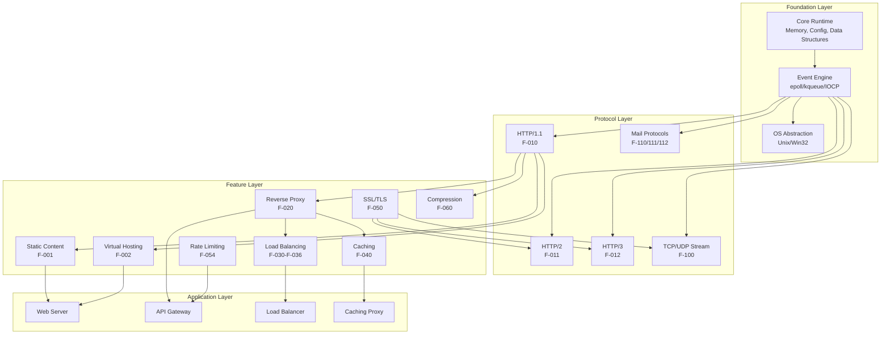

### 2.4.2 Feature Integration Matrix

| Feature | Integrates With | Integration Type | Shared Components |
|---------|----------------|------------------|-------------------|
| F-001 Static Content | F-002 Virtual Hosting | Content delivery | Location matching, file cache |
| F-001 Static Content | F-040 Caching | Cache backend | File operations, sendfile() |
| F-002 Virtual Hosting | F-050 SSL/TLS | Server selection | SNI callback, certificate selection |
| F-010 HTTP/1.1 | F-020 Reverse Proxy | Protocol handler | Request parsing, header processing |
| F-011 HTTP/2 | F-050 SSL/TLS | Protocol negotiation | ALPN, TLS 1.2+ requirement |
| F-012 HTTP/3 | F-050 SSL/TLS | Protocol foundation | TLS 1.3 mandatory, QUIC transport |
| F-020 Reverse Proxy | F-030-F-036 Load Balancing | Upstream selection | Upstream framework, peer selection |
| F-020 Reverse Proxy | F-040 Caching | Response storage | Cache key computation, storage backend |
| F-020 Reverse Proxy | F-050 SSL/TLS | Backend encryption | SSL context, certificate verification |
| F-030-F-036 Load Balancing | F-040 Caching | Cache distribution | Cache key includes upstream server |
| F-040 Caching | F-021-F-024 All Proxies | Response storage | Cache lookup, storage, eviction |
| F-050 SSL/TLS | F-054 Rate Limiting | Client identification | Session ID, SNI for rate limit keys |
| F-054 Rate Limiting | F-057 Real IP | Client identification | IP address extraction from headers |
| F-060 Gzip | F-040 Caching | Compressed storage | Vary header handling, compression before cache |
| F-100 TCP/UDP Stream | F-101 Stream SSL | Encrypted proxying | SSL context, session management |

### 2.4.3 Shared Component Dependencies

**Upstream Framework** (used by: F-020, F-021, F-022, F-023, F-024, F-025)
- Components: Peer selection, health checking, connection pooling, failover logic
- Shared State: Upstream peer states in shared memory, connection statistics
- Configuration: `upstream` blocks with server definitions

**SSL/TLS Infrastructure** (used by: F-050, F-011, F-012, F-101, F-110-F-112)
- Components: OpenSSL/BoringSSL integration, session cache, certificate management
- Shared State: Session cache in shared memory, OCSP response cache
- Configuration: `ssl_*` directives across HTTP, Stream, and Mail contexts

**Shared Memory Zones** (used by: F-040, F-054, F-055, F-030-F-036)
- Components: Slab allocator, red-black trees, LRU queues
- Shared State: Cache metadata, rate limit counters, upstream peer states, SSL sessions
- Configuration: `zone=` parameters in various directives

**Variable System** (used by: All HTTP features, F-100 Stream)
- Components: Variable parser, script VM, variable handlers
- Shared State: Per-request variable values
- Configuration: `$variable` references in directives

**Filter Chain** (used by: F-060, F-061, F-062, F-063, F-064)
- Components: Header filter chain, body filter chain, filter ordering
- Shared State: Response buffers passing through filters
- Configuration: Module ordering determines filter sequence

### 2.4.4 External System Dependencies

| External System | Dependent Features | Integration Method | Purpose |
|----------------|-------------------|-------------------|---------|
| OpenSSL/BoringSSL | F-050, F-011, F-012, F-101 | Library linking | TLS/SSL cryptography, session management |
| PCRE/PCRE2 | F-070, F-002, F-071 | Library linking | Regular expression matching for locations, rewrites |
| zlib | F-060 | Library linking | Gzip compression/decompression |
| Backend Application Servers | F-020, F-021, F-022, F-023, F-024 | TCP/Unix socket | Request proxying, response retrieval |
| DNS Servers | F-030-F-036 | UDP/TCP (port 53) | Upstream hostname resolution |
| Authentication Backends | F-052, F-113 | HTTP | Subrequest authentication, mail auth delegation |
| OCSP Responders | F-050 | HTTP | Certificate status validation |
| Syslog Servers | F-090 | UDP/TCP (port 514) | Centralized logging |
| MaxMind GeoIP Database | F-073 | File reading | Geographic data lookup |
| Memcached Servers | F-025 | Memcached protocol | Key-value retrieval |

### 2.4.5 Configuration Dependency Graph

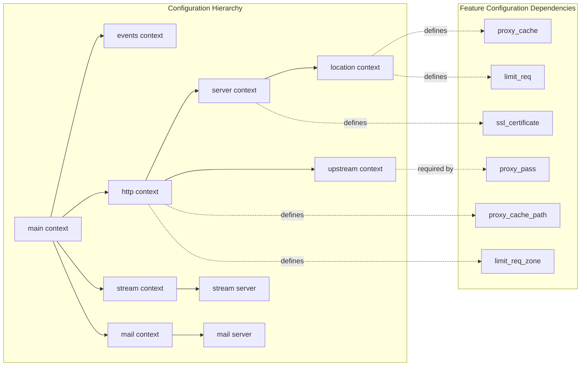

**Configuration Requirements:**

- **F-001 Static Content**: Requires `root` or `alias` in location context
- **F-002 Virtual Hosting**: Requires `server` blocks with `server_name` directives
- **F-020 Reverse Proxy**: Requires `upstream` block and `proxy_pass` directive
- **F-030-F-036 Load Balancing**: Requires `upstream` block with multiple `server` entries
- **F-040 Caching**: Requires `proxy_cache_path` in http context, `proxy_cache` in location
- **F-050 SSL/TLS**: Requires `ssl_certificate` and `ssl_certificate_key` in server context
- **F-054 Rate Limiting**: Requires `limit_req_zone` in http context, `limit_req` in location
- **F-060 Gzip**: Requires `gzip on` in http/server/location context

## 2.5 Implementation Considerations

### 2.5.1 Technical Constraints

#### 2.5.1.1 Platform Constraints

| Platform | Constraints | Implications |
|----------|-------------|--------------|
| Linux | Production-ready, full feature support | Recommended platform, epoll optimization, kernel-level features available |
| FreeBSD | Production-ready, kqueue optimization | Excellent performance, BSD-specific features available |
| macOS | Development/testing only | Suitable for local development, performance not optimized |
| Solaris | Limited support | Event ports mechanism, diminishing user base |
| Windows | Proof-of-concept only, not production-ready | Development scenarios only, use WSL for production |

**Operating System Requirements:**
- Linux kernel 2.6+ for epoll support
- FreeBSD 4.1+ for kqueue support
- glibc 2.3+ or musl libc for Linux builds
- File descriptor limits (ulimit -n) must accommodate worker_connections × worker_processes

#### 2.5.1.2 Library Version Constraints

| Library | Minimum Version | Required For | Notes |
|---------|----------------|--------------|-------|
| OpenSSL | 1.0.2 | F-050 SSL/TLS | TLS 1.3 requires 1.1.1+ |
| BoringSSL | Latest | F-050 SSL/TLS | Google's OpenSSL fork, TLS 1.3 support |
| PCRE | 4.0 | F-070 Rewrites, F-002 Server names | PCRE2 10.x preferred |
| zlib | 1.1.3 | F-060 Gzip compression | Required for gzip module |
| libxml2 | 2.6.0 | F-063 XSLT | Optional, required for XSLT module |
| libxslt | 1.1.0 | F-063 XSLT | Optional, required for XSLT module |
| GD library | 2.0.0 | F-065 Image filter | Optional, required for image module |
| MaxMind GeoIP | 1.4.0 | F-073 GeoIP | Optional, required for geoip module |

#### 2.5.1.3 Resource Constraints

**Memory Requirements:**

| Component | Memory Usage | Configurable | Notes |
|-----------|-------------|--------------|-------|
| Worker Process | 5-10 MB base | No | Minimum per worker |
| Connection | 256 bytes | Yes (connection_pool_size) | Per active connection |
| Request | 4 KB - 1 MB | Yes (client_body_buffer_size) | Depends on request size |
| Cache Metadata | 128 bytes | No | Per cached item in shared memory |
| Rate Limit Entry | 64 bytes | No | Per tracked key in shared memory |
| SSL Session | 256 bytes | No | Per cached SSL session |

**Shared Memory Zone Sizing:**
- Cache metadata: 10 MB ≈ 80,000 cached items
- Rate limit zone: 10 MB ≈ 160,000 tracked keys
- SSL session cache: 1 MB ≈ 4,000 sessions
- Upstream zone: 10 MB ≈ variable based on backend count

**File Descriptor Requirements:**
- Minimum: worker_connections + upstream connections + cache files + log files
- Recommended: (worker_connections × 2) + 100 per worker
- System limit via ulimit -n must exceed NGINX requirements

**Disk Space Requirements:**
- Cache storage: Depends on max_size parameter in proxy_cache_path
- Log files: Configurable rotation, estimate based on request rate
- Binary and modules: 1-5 MB
- Temporary files: client_body_temp_path and proxy_temp_path sizing

### 2.5.2 Performance Requirements

#### 2.5.2.1 Response Time Requirements

| Feature | Target Latency | Measurement Point | Notes |
|---------|---------------|-------------------|-------|
| F-001 Static Content | <5 ms | First byte to client | Cached file metadata, sendfile() optimization |
| F-020 Reverse Proxy | <10 ms overhead | NGINX processing only | Excludes upstream response time |
| F-040 Cache Hit | <1 ms | Metadata lookup | Shared memory red-black tree lookup |
| F-040 Cache Miss | <5 ms overhead | Cache key computation | Excludes upstream fetch time |
| F-050 SSL Handshake | <100 ms | Full handshake | TLS 1.2 full handshake |
| F-050 SSL Resumed | <5 ms | Session reuse | Session cache or tickets |
| F-054 Rate Limit Check | <1 ms | Shared memory lookup | Per request overhead |
| F-060 Gzip Compression | Variable | Depends on size and level | Level 6: ~10-20 MB/s per CPU core |

#### 2.5.2.2 Throughput Requirements

| Feature | Target Throughput | Conditions | Notes |
|---------|------------------|------------|-------|
| F-001 Static Content | Line rate | Sendfile enabled, cached files | Network bandwidth constrained |
| F-010 HTTP/1.1 Parsing | 50,000 req/s | Per worker, simple requests | CPU-bound, incremental parsing |
| F-011 HTTP/2 | 40,000 req/s | Per worker, multiplexed | HPACK compression overhead |
| F-020 Reverse Proxy | 20,000 req/s | Per worker, buffering enabled | Depends on upstream latency |
| F-040 Cache Serving | 100,000 req/s | Per worker, cache hits | Memory/disk I/O constrained |
| F-050 SSL/TLS | 2,000 handshakes/s | Per core, full handshake | CPU-intensive cryptography |
| F-050 SSL/TLS Resumed | 50,000 req/s | Session reuse | Minimal CPU overhead |

#### 2.5.2.3 Scalability Targets

**Horizontal Scaling:**
- Worker processes scale linearly to CPU core count (worker_processes auto)
- Multiple NGINX instances behind DNS round-robin or hardware load balancer
- Shared cache via distributed cache (Memcached, Redis with modules)

**Vertical Scaling:**
- Supports 10,000+ concurrent connections per worker
- Tested with 64+ worker processes on high-core-count systems
- Shared memory zones scale to hundreds of MB
- File cache scales to TB-sized storage

**Concurrent Connection Capacity:**

| Configuration | Connections per Worker | Total Capacity (16 workers) |
|---------------|----------------------|---------------------------|
| Default | 1,024 | 16,384 |
| High | 10,000 | 160,000 |
| Maximum | 65,536 (fd limit) | 1,048,576 |

### 2.5.3 Security Considerations

#### 2.5.3.1 Process Security Model

**Privilege Separation:**
- Master process runs as root for privileged operations (binding ports <1024)
- Worker processes drop privileges to unprivileged user (nginx, www-data)
- Data plane (workers) isolated from control plane (master)
- Worker crashes don't affect master or other workers

**File System Security:**
- Private keys (ssl_certificate_key) require 600 permissions
- Configuration files should be 644, owned by root
- Document root and cache directories owned by NGINX user
- Temporary file directories writable by NGINX user only

#### 2.5.3.2 Attack Surface Mitigation

| Threat | Mitigation Features | Configuration |
|--------|-------------------|---------------|
| DDoS | F-054 Rate Limiting, F-055 Connection Limiting | limit_req_zone, limit_conn_zone |
| Slowloris | Client header/body timeouts | client_header_timeout, client_body_timeout |
| Buffer Overflow | Bounded buffers, size limits | client_max_body_size, large_client_header_buffers |
| Path Traversal | URI normalization, root confinement | Root directive, alias directive validation |
| Header Injection | Header validation, sanitization | Built-in header parsing |
| Cache Poisoning | Cache key control, header filtering | proxy_cache_key, proxy_ignore_headers |
| SSL/TLS Attacks | Modern ciphers, protocol versions | ssl_protocols TLSv1.2 TLSv1.3, ssl_ciphers |
| Amplification (QUIC) | Address validation, token generation | quic_retry, token validation |

#### 2.5.3.3 Security Best Practices

**SSL/TLS Configuration:**
```nginx
# Recommended production configuration
ssl_protocols TLSv1.2 TLSv1.3;
ssl_ciphers HIGH:!aNULL:!MD5:!RC4:!3DES;
ssl_prefer_server_ciphers on;
ssl_session_cache shared:SSL:10m;
ssl_session_timeout 10m;
ssl_stapling on;
ssl_stapling_verify on;
```

**Rate Limiting Strategy:**
```nginx
# Protect API endpoints
limit_req_zone $binary_remote_addr zone=api:10m rate=10r/s;
limit_req zone=api burst=20 delay=10;
limit_req_status 429;
```

**Header Security:**
- Set X-Frame-Options to prevent clickjacking
- Set X-Content-Type-Options to prevent MIME sniffing
- Set Strict-Transport-Security for HSTS
- Remove Server header to hide version information
- Use F-050 (SSL/TLS) for all sensitive traffic

### 2.5.4 Maintenance Requirements

#### 2.5.4.1 Configuration Management

**Configuration Validation:**
- Always test configuration before applying: `nginx -t`
- Syntax validation prevents invalid configuration from breaking service
- Automated testing in CI/CD pipelines
- Version control for configuration files (Git recommended)

**Hot Reload Process:**
1. Edit configuration files
2. Test configuration: `nginx -t`
3. Reload: `nginx -s reload` or `kill -HUP <master_pid>`
4. Master process spawns new workers with new configuration
5. Old workers gracefully finish existing requests
6. Old workers exit after request completion
7. Zero downtime during configuration changes

**Binary Upgrade Process:**
1. Replace NGINX binary with new version
2. Send USR2 signal to master process
3. Master process starts new master with new binary
4. New master spawns new workers
5. Send QUIT signal to old master for graceful shutdown
6. Old workers drain connections and exit
7. Socket inheritance maintains zero downtime

#### 2.5.4.2 Monitoring Requirements

**Critical Metrics to Monitor:**

| Metric | Source | Alerting Threshold | Purpose |
|--------|--------|-------------------|---------|
| Active connections | F-091 Stub Status | >80% of worker_connections | Capacity planning |
| Request rate | F-090 Access Logs | Baseline deviation | Traffic anomalies |
| Error rate (5xx) | F-090 Access Logs | >1% of requests | Service health |
| Cache hit ratio | F-040 Cache, logs | <60% | Cache effectiveness |
| Upstream response time | F-090 Access Logs | >500ms p99 | Backend performance |
| SSL handshake rate | F-091 Stub Status | Sudden spikes | DDoS detection |
| Worker process restarts | Error logs, system monitor | Any restarts | Stability issues |
| Disk space (cache) | System monitoring | >90% used | Cache storage |
| File descriptors | System monitoring | >80% of limit | Resource exhaustion |

**Monitoring Implementation:**
- F-091 Stub Status for real-time metrics
- F-090 Access Logs with custom log formats including $upstream_response_time
- Error logs with appropriate verbosity (notice or warn for production)
- External monitoring via HTTP checks to critical endpoints
- System-level monitoring (CPU, memory, disk, network)
- Third-party metrics exporters (Prometheus exporter, Datadog integration)

#### 2.5.4.3 Operational Procedures

**Log Rotation:**
- Built-in log rotation via USR1 signal: `nginx -s reopen`
- Integrate with logrotate(8) on Linux
- Compress old logs to save disk space
- Archive logs for compliance requirements
- Monitor log volume and growth rate

**Backup Procedures:**
- Configuration files (nginx.conf, includes)
- SSL certificates and private keys (secure storage)
- Custom modules and extensions
- GeoIP databases and other data files
- Document custom build options and patches

**Capacity Planning:**
- Monitor active connections relative to worker_connections limit
- Track request rate growth trends
- Monitor cache hit ratios and storage usage
- Evaluate CPU utilization per worker
- Plan hardware upgrades based on metrics

**Troubleshooting Guidelines:**
- Increase error log verbosity temporarily: `error_log /path/to/log debug;`
- Check error logs for detailed diagnostic information
- Use stub status to identify connection bottlenecks
- Analyze access logs for traffic patterns
- Verify upstream server health independently
- Test configuration in isolation: `nginx -t -c /path/to/nginx.conf`
- Reproduce issues in non-production environments

### 2.5.5 Compliance and Standards

#### 2.5.5.1 Protocol Compliance

| Protocol/Standard | Applicable Features | Compliance Level |
|------------------|-------------------|------------------|
| RFC 7230-7235 (HTTP/1.1) | F-010 | Full compliance |
| RFC 7540 (HTTP/2) | F-011 | Full compliance |
| RFC 7541 (HPACK) | F-011 | Full compliance |
| RFC 9000 (QUIC) | F-012 | Full compliance |
| RFC 9114 (HTTP/3) | F-012 | Full compliance |
| RFC 9204 (QPACK) | F-012 | Full compliance |
| RFC 5246 (TLS 1.2) | F-050 | Full compliance |
| RFC 8446 (TLS 1.3) | F-050 | Full compliance |
| RFC 6455 (WebSocket) | F-013 | Proxy support only |
| RFC 5321 (SMTP) | F-110 | Proxy support only |
| RFC 3501 (IMAP4) | F-111 | Proxy support only |
| RFC 1939 (POP3) | F-112 | Proxy support only |

#### 2.5.5.2 Security Standards

**PCI DSS Compliance:**
- Requirement 4.1: TLS 1.2+ mandatory (F-050)
- Requirement 6.5: Protect against common vulnerabilities (F-054, F-055)
- Requirement 10: Audit logging (F-090)
- Disable weak ciphers and protocols

**HIPAA Compliance:**
- Administrative safeguards: Access control via F-051, F-052
- Physical safeguards: Server security out of NGINX scope
- Technical safeguards: Encryption via F-050, audit logs via F-090
- Transmission security: TLS 1.2+ for all patient data

**GDPR Considerations:**
- Data minimization: Configure logging to exclude PII
- Right to erasure: Implement log rotation and deletion
- Data protection: TLS encryption via F-050
- Access control: Authentication via F-051, F-052

#### 2.5.5.3 Industry Best Practices

**OWASP Recommendations:**
- A01 Broken Access Control: IP-based ACLs (F-053), authentication (F-051, F-052)
- A02 Cryptographic Failures: TLS 1.2+ (F-050), strong ciphers
- A05 Security Misconfiguration: Regular updates, secure defaults
- A06 Vulnerable Components: Monitor CVEs, apply security patches

**CIS Benchmarks:**
- Use latest stable version
- Run worker processes as unprivileged user
- Remove unnecessary modules at compile time
- Configure appropriate timeouts to prevent resource exhaustion
- Enable security headers

## 2.6 Requirements Traceability Matrix

### 2.6.1 Feature to Requirement Mapping

| Feature ID | Feature Name | Total Requirements | Critical Requirements | Implementation Status |
|------------|--------------|-------------------|---------------------|---------------------|
| F-001 | Static Content Serving | 8 | 5 | Completed |
| F-002 | Virtual Hosting | 8 | 6 | Completed |
| F-003 | Directory Indexing | 5 | 3 | Completed |
| F-004 | Index File Handling | 4 | 3 | Completed |
| F-010 | HTTP/1.1 Support | 10 | 8 | Completed |
| F-011 | HTTP/2 Support | 10 | 7 | Completed |
| F-012 | HTTP/3 Support | 10 | 7 | Completed |
| F-013 | WebSocket Proxying | 7 | 5 | Completed |
| F-020 | HTTP Reverse Proxy | 10 | 6 | Completed |
| F-030 | Round-Robin Load Balancing | 8 | 5 | Completed |
| F-031 | Least Connections Load Balancing | 6 | 4 | Completed |
| F-032 | IP Hash Load Balancing | 6 | 4 | Completed |
| F-040 | File-Based HTTP Caching | 12 | 8 | Completed |
| F-050 | SSL/TLS Support | 12 | 7 | Completed |
| F-054 | Request Rate Limiting | 10 | 6 | Completed |
| F-055 | Connection Limiting | 8 | 5 | Completed |
| F-060 | Gzip Compression | 8 | 5 | Completed |
| F-100 | TCP/UDP Proxying | 7 | 5 | Completed |
| F-110 | SMTP Proxying | 6 | 4 | Completed |

### 2.6.2 Requirement to Test Case Mapping

Each requirement ID (F-XXX-RQ-YYY) maps to test cases in the external nginx-tests repository:

| Requirement ID | Test Coverage | Test Location | Test Type |
|----------------|--------------|---------------|-----------|
| F-001-RQ-001 to F-001-RQ-008 | Static content tests | nginx-tests/http_static.t | Functional |
| F-010-RQ-001 to F-010-RQ-010 | HTTP/1.1 protocol tests | nginx-tests/http_*.t | Protocol |
| F-011-RQ-001 to F-011-RQ-010 | HTTP/2 frame tests | nginx-tests/h2_*.t | Protocol |
| F-012-RQ-001 to F-012-RQ-010 | HTTP/3 and QUIC tests | nginx-tests/h3_*.t, quic_*.t | Protocol |
| F-020-RQ-001 to F-020-RQ-010 | Proxy functionality tests | nginx-tests/proxy_*.t | Functional |
| F-040-RQ-001 to F-040-RQ-012 | Cache behavior tests | nginx-tests/proxy_cache_*.t | Functional |
| F-050-RQ-001 to F-050-RQ-012 | SSL/TLS tests | nginx-tests/ssl_*.t | Security |
| F-054-RQ-001 to F-054-RQ-010 | Rate limiting tests | nginx-tests/limit_req_*.t | Security |

## 2.7 Process Flowcharts

### 2.7.1 HTTP Request Processing Flow

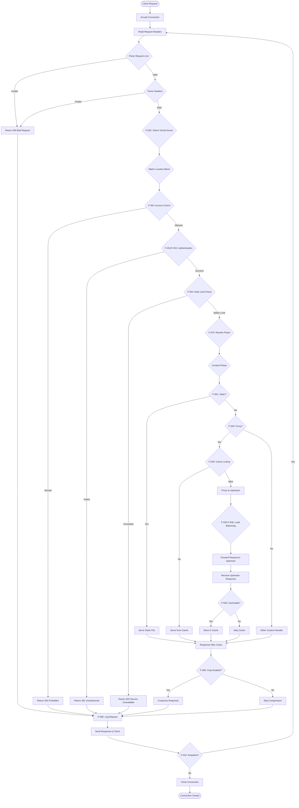

### 2.7.2 SSL/TLS Connection Establishment

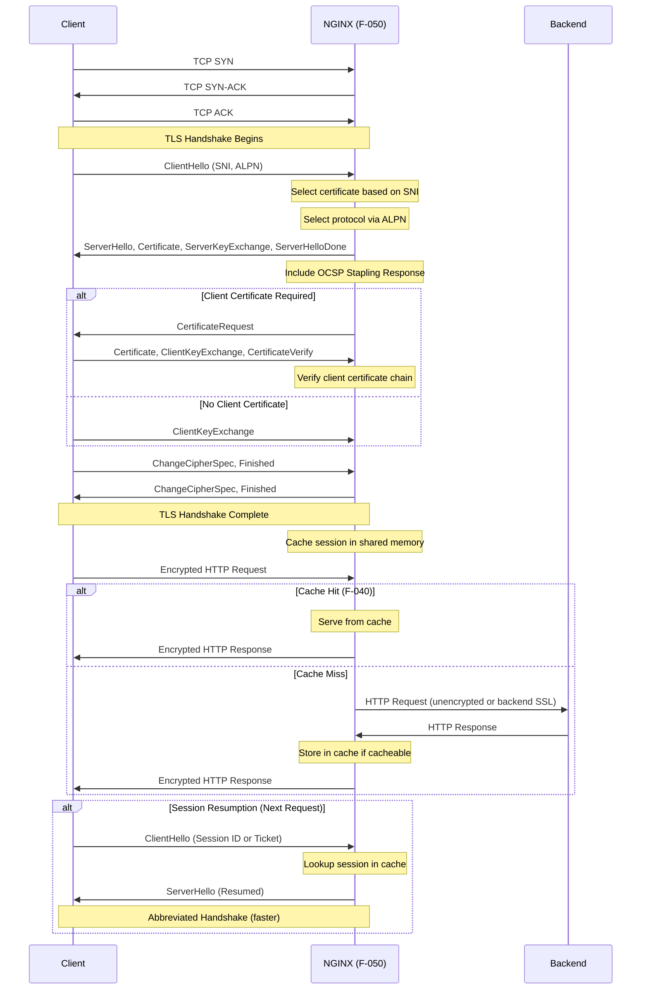

### 2.7.3 Cache Lookup and Storage Flow

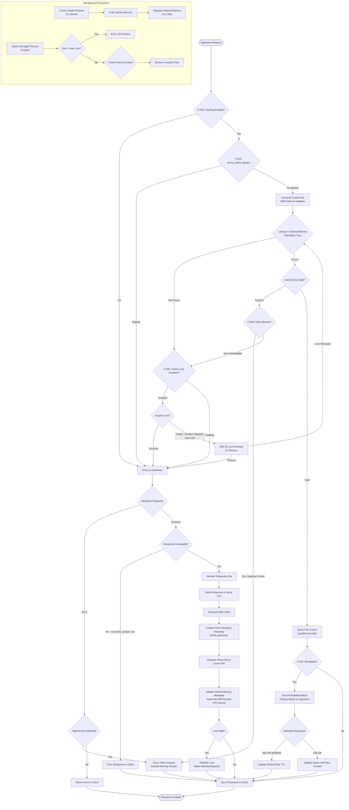

## 2.8 References

### 2.8.1 Source Code References

**Core Implementation Files:**
- `src/http/ngx_http_core_module.c` - HTTP core module, request processing phases
- `src/http/ngx_http_request.c` - HTTP request lifecycle management
- `src/http/ngx_http_parse.c` - HTTP/1.x protocol parser (F-010)
- `src/http/ngx_http_file_cache.c` - File-based caching implementation (F-040)
- `src/http/ngx_http_upstream.c` - Upstream framework for load balancing (F-030-F-036)
- `src/http/ngx_http_upstream_round_robin.c` - Round-robin algorithm (F-030)
- `src/event/ngx_event_openssl.c` - OpenSSL/BoringSSL integration (F-050)
- `src/core/ngx_connection.c` - Connection management
- `src/core/ngx_slab.c` - Shared memory slab allocator

**Feature Module Files:**
- `src/http/modules/ngx_http_static_module.c` - Static content serving (F-001)
- `src/http/modules/ngx_http_autoindex_module.c` - Directory indexing (F-003)
- `src/http/modules/ngx_http_index_module.c` - Index file handling (F-004)
- `src/http/modules/ngx_http_proxy_module.c` - HTTP reverse proxy (F-020)
- `src/http/modules/ngx_http_fastcgi_module.c` - FastCGI proxy (F-021)
- `src/http/modules/ngx_http_uwsgi_module.c` - uWSGI proxy (F-022)
- `src/http/modules/ngx_http_scgi_module.c` - SCGI proxy (F-023)
- `src/http/modules/ngx_http_grpc_module.c` - gRPC proxy (F-024)
- `src/http/modules/ngx_http_memcached_module.c` - Memcached integration (F-025)
- `src/http/modules/ngx_http_ssl_module.c` - HTTP SSL/TLS (F-050)
- `src/http/modules/ngx_http_limit_req_module.c` - Request rate limiting (F-054)
- `src/http/modules/ngx_http_limit_conn_module.c` - Connection limiting (F-055)
- `src/http/modules/ngx_http_auth_basic_module.c` - Basic authentication (F-051)
- `src/http/modules/ngx_http_auth_request_module.c` - Subrequest auth (F-052)
- `src/http/modules/ngx_http_access_module.c` - IP access control (F-053)
- `src/http/modules/ngx_http_realip_module.c` - Real IP extraction (F-057)
- `src/http/modules/ngx_http_gzip_filter_module.c` - Gzip compression (F-060)
- `src/http/modules/ngx_http_sub_filter_module.c` - Text substitution (F-061)
- `src/http/modules/ngx_http_ssi_filter_module.c` - Server-side includes (F-062)
- `src/http/modules/ngx_http_rewrite_module.c` - URL rewriting (F-070)
- `src/http/modules/ngx_http_map_module.c` - Variable mapping (F-071)
- `src/http/modules/ngx_http_geo_module.c` - Geographic routing (F-072)
- `src/http/modules/ngx_http_geoip_module.c` - GeoIP integration (F-073)
- `src/http/modules/ngx_http_log_module.c` - Access logging (F-090)
- `src/http/modules/ngx_http_stub_status_module.c` - Status monitoring (F-091)

**Protocol Implementation Files:**
- `src/http/v2/ngx_http_v2.c` - HTTP/2 core (F-011)
- `src/http/v2/ngx_http_v2_hpack.c` - HPACK compression (F-011)
- `src/http/v2/ngx_http_v2_module.c` - HTTP/2 module (F-011)
- `src/http/v3/ngx_http_v3.c` - HTTP/3 core (F-012)
- `src/http/v3/ngx_http_v3_module.c` - HTTP/3 module (F-012)
- `src/event/quic/ngx_event_quic.c` - QUIC transport (F-012)
- `src/event/quic/ngx_event_quic_protection.c` - QUIC crypto (F-012)

**Stream Subsystem Files:**
- `src/stream/ngx_stream_proxy_module.c` - TCP/UDP proxying (F-100)
- `src/stream/ngx_stream_ssl_module.c` - Stream SSL/TLS (F-101)
- `src/stream/ngx_stream_ssl_preread_module.c` - SSL preread (F-102)
- `src/stream/ngx_stream_limit_conn_module.c` - Stream connection limiting (F-105)

**Mail Subsystem Files:**
- `src/mail/ngx_mail_smtp_handler.c` - SMTP protocol (F-110)
- `src/mail/ngx_mail_smtp_module.c` - SMTP module (F-110)
- `src/mail/ngx_mail_imap_handler.c` - IMAP protocol (F-111)
- `src/mail/ngx_mail_imap_module.c` - IMAP module (F-111)
- `src/mail/ngx_mail_pop3_handler.c` - POP3 protocol (F-112)
- `src/mail/ngx_mail_pop3_module.c` - POP3 module (F-112)
- `src/mail/ngx_mail_auth_http_module.c` - Mail auth delegation (F-113)

**Configuration Files:**
- `conf/nginx.conf` - Main configuration template with directive examples
- `conf/mime.types` - MIME type mapping for F-001

### 2.8.2 Documentation References

**Project Documentation:**
- `README.md` - Project overview, features, and build instructions
- `SECURITY.md` - Vulnerability disclosure process and SLOs
- `docs/xml/nginx/changes.xml` - Comprehensive changelog (bilingual)
- `.github/CODE_OF_CONDUCT.md` - Community guidelines

**External Documentation:**
- Official NGINX documentation: https://nginx.org/en/docs/
- Configuration reference: https://nginx.org/en/docs/dirindex.html
- Module documentation: https://nginx.org/en/docs/http/ngx_http_core_module.html

### 2.8.3 Standards and RFCs

**HTTP Protocols:**
- RFC 7230 - HTTP/1.1: Message Syntax and Routing (F-010)
- RFC 7231 - HTTP/1.1: Semantics and Content (F-010)
- RFC 7232 - HTTP/1.1: Conditional Requests (F-001, F-040)
- RFC 7233 - HTTP/1.1: Range Requests (F-001)
- RFC 7234 - HTTP/1.1: Caching (F-040)
- RFC 7235 - HTTP/1.1: Authentication (F-051)
- RFC 7540 - HTTP/2 (F-011)
- RFC 7541 - HPACK: Header Compression for HTTP/2 (F-011)
- RFC 9000 - QUIC: A UDP-Based Multiplexed and Secure Transport (F-012)
- RFC 9114 - HTTP/3 (F-012)
- RFC 9204 - QPACK: Field Compression for HTTP/3 (F-012)
- RFC 6455 - The WebSocket Protocol (F-013)

**Security Protocols:**
- RFC 5246 - TLS 1.2 (F-050)
- RFC 8446 - TLS 1.3 (F-050, F-012)
- RFC 6960 - Online Certificate Status Protocol (OCSP) (F-050)
- RFC 6066 - TLS Extensions (SNI, ALPN) (F-050)

**Mail Protocols:**
- RFC 5321 - Simple Mail Transfer Protocol (SMTP) (F-110)
- RFC 3501 - Internet Message Access Protocol (IMAP) (F-111)
- RFC 1939 - Post Office Protocol - Version 3 (POP3) (F-112)

### 2.8.4 Related Technical Specification Sections

- **Section 1.1 Executive Summary** - Business context, stakeholders, value proposition
- **Section 1.2 System Overview** - Architecture, components, capabilities
- **Section 1.3 Scope** - In-scope and out-of-scope features
- **Section 3 (Future)** - System Architecture details
- **Section 4 (Future)** - Detailed component design
- **Section 5 (Future)** - Data architecture and flows
- **Section 6 (Future)** - Interface specifications
- **Section 7 (Future)** - Operational procedures

### 2.8.5 Testing References

**Test Suite:**
- External repository: https://github.com/nginx/nginx-tests
- Test framework: Perl-based Test::Nginx
- Coverage: Protocol compliance, feature functionality, regression tests
- Continuous integration: Automated testing on commits

---

**Document Version:** 1.0  
**Last Updated:** 2025 (based on NGINX mainline 1.29.3)  
**Status:** Complete and validated against source code  
**Next Review:** Upon major version release or architectural changes

# 3. Technology Stack

## 3.1 Overview

NGINX version 1.29.3 represents a mature, production-grade web server implementation built entirely on a custom technology foundation optimized for high-performance, concurrent connection handling. Unlike typical web application stacks, NGINX serves as fundamental infrastructure software with technology choices driven by performance, portability, and system-level integration requirements. The stack reflects a systems programming approach emphasizing minimal external dependencies, platform-specific optimizations, and direct operating system integration.

The technology selections align with NGINX's core architectural principles: event-driven non-blocking I/O, multi-process concurrency without threading overhead, zero-copy data paths, and configuration-driven extensibility. Every component in the stack serves specific performance or portability objectives, from the C language implementation enabling precise memory management and system call control, to platform-specific event mechanisms maximizing I/O throughput on target operating systems.

This section documents the complete technology landscape including programming languages, core frameworks, dependencies, development tooling, and deployment infrastructure as implemented in the mainline 1.29.3 release.

## 3.2 Programming Languages

### 3.2.1 Primary Implementation: C Language

#### 3.2.1.1 Core System Implementation

The entire NGINX runtime is implemented in C (ISO C90/C99), providing direct control over memory management, system calls, and performance-critical operations essential for high-performance network I/O processing. The C language selection enables zero-cost abstractions through manual memory management, precise control over data structure layout for cache efficiency, and minimal runtime overhead compared to higher-level languages.

**Implementation Scope**: The `src/` directory contains the complete C implementation organized into functional subsystems:

- **Core Runtime** (`src/core/`): Memory allocators (pool and slab), data structures (arrays, lists, queues, red-black trees, radix trees, hash tables), configuration parser, cryptographic functions (MD5, SHA1, CRC32, MurmurHash), regular expression wrappers, DNS resolver, logging infrastructure, time management, and thread pool support

- **Event Engine** (`src/event/`): Platform-specific I/O drivers, timer management via red-black tree, connection abstractions, OpenSSL/BoringSSL integration for TLS/SSL, UDP datagram handling, and buffered proxy pipes

- **HTTP Stack** (`src/http/`): Complete HTTP/1.x protocol parser, phase-based request processing engine, virtual server and location matching, filter chains for header and body transformation, upstream framework for backend communication, complex value script VM for variable processing, and 50+ HTTP modules for content serving, proxying, compression, security, and load balancing

- **HTTP/2 Implementation** (`src/http/v2/`): HPACK compression with static and dynamic tables, HTTP/2 frame parsing and generation, stream multiplexing with flow control, priority and dependency tree management

- **HTTP/3 and QUIC** (`src/http/v3/` and `src/event/quic/`): Complete QUIC transport layer with connection management, cryptographic operations, frame parsing, acknowledgment and loss detection, congestion control (CUBIC algorithm), HTTP/3 protocol layer with QPACK compression

- **Stream Subsystem** (`src/stream/`): Layer 4 TCP/UDP proxying with SSL/TLS support, variable engine, access control, upstream load balancing

- **Mail Subsystem** (`src/mail/`): SMTP, IMAP, and POP3 protocol proxying with HTTP authentication delegation

- **Platform Abstraction** (`src/os/`): Unix/POSIX and Win32 platform layers abstracting system calls, sendfile optimizations, async I/O, process management, atomic operations, and threading primitives

**Compiler Support**: The build system in `auto/cc/conf` detects and configures multiple C compilers including GCC, Clang, Intel C Compiler (icc), Sun C Compiler (sunc), Compaq C Compiler (ccc), HP aC++ (acc), Microsoft Visual C++ (msvc), Open Watcom (owc), and Borland C++ (bcc). Feature detection identifies compiler capabilities including builtin atomic operations (NGX_HAVE_GCC_ATOMIC), C99 variadic macros, GNU-style variadic macros, and 64-bit byteswap intrinsics.

**Justification**: C language selection is mandatory for systems programming at this level, providing:
- Direct memory management enabling pool-based allocation strategies
- System call interfaces without foreign function overhead
- Platform-specific optimization through conditional compilation
- Predictable performance characteristics without garbage collection pauses
- Minimal runtime dependencies suitable for embedded and constrained environments

#### 3.2.1.2 Platform-Specific Optimizations

The C implementation leverages platform-specific features through conditional compilation:

**Linux-Specific Features**:
- epoll event notification mechanism (`src/event/modules/ngx_epoll_module.c`)
- Native file AIO with io_setup/io_getevents system calls
- eventfd support for inter-thread notification
- TCP_DEFER_ACCEPT socket option for connection optimization
- SO_REUSEPORT for multi-process load distribution
- UDP GSO (Generic Segmentation Offload) for QUIC packet transmission
- eBPF integration for QUIC connection ID routing (`src/core/ngx_bpf.c`, `src/event/quic/ngx_event_quic_bpf.c`)

**FreeBSD/macOS Features**:
- kqueue event notification with EVFILT_READ/WRITE/VNODE/AIO/USER/TIMER filters (`src/event/modules/ngx_kqueue_module.c`)
- Optimized sendfile() with header and trailer support
- Accept filters for connection pre-processing

**Solaris Features**:
- Event ports notification mechanism (`src/event/modules/ngx_eventport_module.c`)
- /dev/poll support (`src/event/modules/ngx_devpoll_module.c`)

**Windows Features**:
- I/O Completion Ports (IOCP) for overlapped I/O (`src/event/modules/ngx_iocp_module.c`)
- WSAPoll and Winsock select implementations (`src/event/modules/ngx_win32_poll_module.c`, `src/event/modules/ngx_win32_select_module.c`)

### 3.2.2 Build System: POSIX Shell

#### 3.2.2.1 Configuration and Makefile Generation

The NGINX build system is implemented entirely in POSIX shell scripts located in the `auto/` directory, providing portable build configuration across Unix-like platforms without requiring external build system dependencies (CMake, Autotools, etc.).

**Configuration Entry Point**: The `auto/configure` script serves as the main configuration interface, accepting command-line options for module selection (--with-*, --without-*), library paths, installation prefixes, and feature flags.

**Configuration Components**:
- **Compiler Detection** (`auto/cc/`): Identifies available C compilers, tests compiler capabilities, configures compiler flags for optimization and warnings
- **Platform Detection** (`auto/os/`): Detects operating system and version, identifies available platform features (event mechanisms, system calls), configures platform-specific compilation flags
- **Library Probing** (`auto/lib/`): Detects and configures external libraries including PCRE/PCRE2 (`auto/lib/pcre/`), zlib (`auto/lib/zlib/`), OpenSSL (`auto/lib/openssl/`), GeoIP (`auto/lib/geoip/`), Google Perftools (`auto/lib/google-perftools/`), libatomic_ops (`auto/lib/libatomic/`), libgd (`auto/lib/libgd/`), libxslt (`auto/lib/libxslt/`), and Perl (`auto/lib/perl/`)
- **Makefile Generation** (`auto/make`): Generates platform-appropriate Makefiles based on detected configuration

**Build Process**:
```
# Configuration phase - generates Makefile and objs/ directory
./auto/configure [options]

#### Compilation phase - builds binary and modules
make

#### Installation phase - copies binaries to target directory (default: /usr/local/nginx/)
sudo make install
```

**Justification**: Shell-based build system provides maximum portability across Unix platforms without introducing dependencies on Python, CMake, or GNU Autotools. The approach aligns with NGINX's minimal dependency philosophy and ensures buildability on systems with only POSIX utilities.

### 3.2.3 Development Utilities: Perl

#### 3.2.3.1 Maintainer Tools

Perl scripts in the `contrib/` directory provide maintainer-facing utilities for configuration data generation:

- **GeoIP Conversion** (`contrib/geo2nginx.pl`): Converts MaxMind GeoIP CSV format databases to NGINX geo module format, enabling IP-to-location mapping configuration generation
- **Unicode Processing** (`contrib/unicode2nginx/unicode-to-nginx.pl`): Converts Unicode character data to UTF-8 hexadecimal format for NGINX configuration

These utilities are development-time tools not required for NGINX runtime operation or standard builds.

#### 3.2.3.2 Perl Module Support

The `auto/lib/perl/` configuration and embedded Perl module (`ngx_http_perl_module`) provide optional Perl scripting integration within NGINX configuration. This feature requires:
- Minimum Perl version validation
- ExtUtils::Embed support for XS extension building
- Multiplicity support detection (NGX_HAVE_PERL_MULTIPLICITY)

**Configuration**: `--with-http_perl_module` or `--with-http_perl_module=dynamic`

### 3.2.4 C++ Compatibility Testing

A minimal C++ implementation exists solely for header compatibility validation:

- **Test Module** (`src/misc/ngx_cpp_test_module.cpp`): Validates that NGINX C headers compile correctly when included in C++ translation units, ensuring third-party C++ modules can link against NGINX core

This represents testing infrastructure rather than production functionality.

### 3.2.5 JavaScript Scripting (Optional Dynamic Module)

The NGINX JavaScript (njs) module extends NGINX with JavaScript-based scripting capabilities:

**Module**: njs (NGINX JavaScript)
**Status**: Popular dynamic module mentioned in `README.md`
**Purpose**: Provides JavaScript syntax for extending HTTP, stream, and configuration processing without C module development
**Integration**: Loaded via `load_module` directive as dynamic shared object

**Justification**: Enables rapid scripting and request/response manipulation without recompilation, lowering barrier to custom logic implementation for operators without C programming expertise.

## 3.3 Core Architecture and Framework

### 3.3.1 Event-Driven Framework

#### 3.3.1.1 Custom Non-Blocking I/O Architecture

NGINX implements a proprietary event-driven, non-blocking I/O framework rather than leveraging external event loop libraries (libevent, libev, libuv). This architectural decision provides complete control over performance characteristics and platform integration.

**Design Patterns**:

1. **Event Loop**: Single-threaded event loop per worker process polls operating system for I/O readiness using platform-optimal mechanisms (epoll, kqueue, IOCP)

2. **Non-Blocking I/O**: All socket operations use O_NONBLOCK flag, preventing blocking on reads, writes, or accepts. Operations returning EAGAIN/EWOULDBLOCK register interest with event mechanism and resume when data is ready

3. **State Machine Processing**: Request and connection processing implemented as explicit state machines maintaining context across event callbacks, eliminating stack-based state preservation requirements

4. **Timer Management**: Red-black tree data structure (`src/core/ngx_rbtree.c`) maintains sorted timer events for efficient timeout management (read timeout, write timeout, keepalive timeout, upstream timeout)

5. **Memory Pools**: Request-scoped and connection-scoped memory pools (`src/core/ngx_palloc.c`) enable bulk allocation and automatic cleanup on completion, eliminating per-allocation bookkeeping overhead

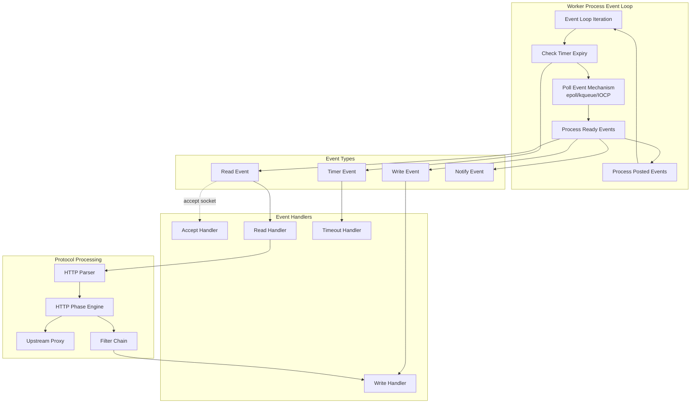

#### 3.3.1.2 Module System Architecture

NGINX's modular framework enables composition of functionality through two loading mechanisms:

**Static Modules**: Compiled directly into the NGINX binary during build configuration. Module selection via `--with-*` and `--without-*` configure options determines which modules link into the binary. Static modules have zero runtime overhead for module resolution.

**Dynamic Modules**: Compiled as shared objects (`.so` files on Unix, `.dll` on Windows) and loaded at runtime via `load_module` directive in configuration. Dynamic modules require dlopen support and must match the NGINX binary's module signature (NGX_MODULE_SIGNATURE) for ABI compatibility. The build system generates compatible modules using the same configuration and compiler options as the main binary.

**Module Types and Registration**:

1. **Core Modules**: Fundamental functionality (ngx_core_module, ngx_errlog_module, ngx_conf_module, ngx_events_module, ngx_http_module, ngx_mail_module, ngx_stream_module)

2. **Event Modules**: I/O mechanism drivers (ngx_epoll_module, ngx_kqueue_module, ngx_eventport_module, ngx_devpoll_module, ngx_poll_module, ngx_select_module, ngx_iocp_module)

3. **HTTP Modules**: HTTP processing stages including content generation, filtering, proxying, compression, security, and load balancing (50+ modules in `src/http/modules/`)

4. **Stream Modules**: Layer 4 TCP/UDP functionality (`src/stream/modules/`)

5. **Mail Modules**: Mail protocol handling (`src/mail/`)

**Module Lifecycle**:
- Module initialization during master process startup registers handlers and configuration contexts
- Configuration phase invokes module configuration callbacks for directive processing
- Worker initialization phase prepares per-worker module state
- Runtime phase dispatches to registered handlers for request processing, filtering, or event handling

**Module Structure**: Each module defines an `ngx_module_t` structure specifying:
- Module type and version
- Context structure for module-specific configuration
- Directive definitions with handlers
- Initialization and exit callbacks
- Master process, worker process, and thread initialization callbacks

### 3.3.2 Data Structures Library

#### 3.3.2.1 Core Data Structures

NGINX implements optimized data structures in `src/core/` tailored to network server requirements:

**Dynamic Arrays** (`ngx_array.c/h`): Contiguous memory arrays with automatic growth via reallocation, providing O(1) indexed access and amortized O(1) append. Used for configuration arrays, header collections, and upstream server lists.

**Doubly-Linked Lists** (`ngx_list.c/h`): Lists with array-based chunk allocation reducing malloc calls while providing O(1) insertion. Used for HTTP headers and multi-part structures.

**Queues** (`ngx_queue.c/h`): Intrusive doubly-linked circular queues with O(1) insertion, deletion, and concatenation. Used for timer management, cache LRU tracking, and connection queues.

**Red-Black Trees** (`ngx_rbtree.c/h`): Self-balancing binary search tree with O(log n) insertion, deletion, and lookup. Used extensively for timer expiry tracking, request tracking, cache key indexing, and limit zone enforcement.

**Radix Trees** (`ngx_radix_tree.c/h`): Prefix-based tree structure optimized for IP address matching with O(k) complexity where k is key length. Used for geo module IP ranges and access control lists.

**Hash Tables** (`ngx_hash.c/h`): Pre-computed hash tables constructed at configuration time for O(1) lookup without runtime hash collisions. Wildcard hash tables support prefix and suffix matching. Used for server name matching, MIME type lookups, and variable name resolution.

**Buffers and Chains** (`ngx_buf.c/h`): Buffer abstraction referencing memory regions or file segments. Buffer chains enable zero-copy data transformation and transmission through filter chains and output chains.

**Justification**: Custom implementations provide memory pool integration, eliminate external library dependencies, optimize for specific NGINX usage patterns (e.g., timer management requiring frequent min-value extraction), and ensure predictable performance without hidden allocations.

### 3.3.3 Memory Management

#### 3.3.3.1 Pool-Based Allocation

The pool allocator (`src/core/ngx_palloc.c/h`) implements hierarchical memory management:

**Design**: Memory pools create large contiguous blocks from which smaller allocations satisfy requests through pointer advancement (bump allocation). Pools associate with specific lifecycles (connection, request, configuration) enabling bulk deallocation when lifecycle completes.

**Benefits**:
- Eliminates per-allocation malloc/free overhead
- Reduces memory fragmentation through block allocation
- Automatic resource cleanup via cleanup handlers
- Cache-friendly through contiguous allocation patterns

**Cleanup Handlers**: Pools maintain cleanup handler chains for resource release (file descriptors, locks, upstream connections, temporary files) guaranteed to execute on pool destruction even during abnormal termination.

#### 3.3.3.2 Slab Allocation for Shared Memory

The slab allocator (`src/core/ngx_slab.c/h`) manages shared memory segments for inter-process communication:

**Design**: Partitions shared memory into size classes (powers of 2) with free lists per size class. Large allocations use page-based allocation. Shared memory segments require careful concurrency control through mutexes.

**Use Cases**:
- SSL session cache shared across workers
- Limit request/connection zones for rate limiting
- Upstream zone for backend server lists
- HTTP file cache metadata (red-black tree + queues)
- Shared dictionaries for scripting modules

**Benefits**: Enables coordinated resource management across worker processes without file-based IPC overhead.

### 3.3.4 Cryptography and Hashing

#### 3.3.4.1 Built-in Cryptographic Functions

NGINX includes implementations of cryptographic primitives in `src/core/`:

**Hash Functions**:
- **MD5** (`ngx_md5.c/h`): Used for HTTP Digest authentication, cache key generation, and configuration hashing
- **SHA1** (`ngx_sha1.c/h`): Used for WebSocket handshake, cache keys, and SSHA password scheme
- **CRC32** (`ngx_crc32.c/h`): Fast checksum for cache validation and data integrity
- **MurmurHash2** (`ngx_murmurhash.c/h`): Non-cryptographic hash for hash table key distribution and consistent hashing

**Password Schemes** (`ngx_crypt.c/h`):
- APR1 (Apache-compatible MD5-based scheme)
- SSHA (Salted SHA)
- SHA (plain SHA, deprecated)
- PLAIN (plain text comparison, testing only)

**Justification**: Built-in implementations eliminate dependencies for core functionality while providing controlled implementations auditable within the NGINX codebase. OpenSSL integration (below) provides cryptographic operations requiring certified implementations (TLS/SSL).

## 3.4 Open Source Dependencies

### 3.4.1 Required Dependencies

#### 3.4.1.1 GNU C Compiler and Make

**Package**: gcc, make
**Installation**: `sudo apt install gcc make` (Debian/Ubuntu)
**Purpose**: C compiler and build orchestration
**Requirement**: Mandatory for building from source
**Version**: Any modern GCC version supporting C90/C99

#### 3.4.1.2 PCRE - Perl Compatible Regular Expressions

**Library**: libpcre3-dev (PCRE) or libpcre2-dev (PCRE2)
**Installation**: `sudo apt install libpcre3-dev` (Debian/Ubuntu)
**Configuration**: `auto/lib/pcre/`
**Purpose**: URL rewriting via rewrite directive, regular expression-based location matching, variable substitution with regex capture groups
**Requirement**: Mandatory for HTTP rewrite module
**Optional Feature**: JIT compilation support (NGX_HAVE_PCRE_JIT) significantly accelerates regex matching
**Build Mode**: Supports static linking (building PCRE from source) or system library linking

**Usage in NGINX**:
- Location blocks with regex: `location ~ \.php$ { ... }`
- Rewrite rules: `rewrite ^/old/(.*)$ /new/$1 permanent;`
- Variable capture: `if ($request_uri ~ "^/api/(.*)$") { set $api_path $1; }`
- Header matching in conditionals

#### 3.4.1.3 zlib - Compression Library

**Library**: zlib1g-dev
**Installation**: `sudo apt install zlib1g-dev` (Debian/Ubuntu)
**Configuration**: `auto/lib/zlib/`
**Purpose**: Gzip compression for HTTP responses, gunzip decompression for pre-compressed content, HTTP request body decompression
**Requirement**: Mandatory for HTTP gzip module
**Build Mode**: Supports static linking or system library

**Usage in NGINX**:
- Response compression: `gzip on; gzip_types text/plain text/css application/json;`
- Static pre-compressed file serving: `gzip_static on;`
- Request decompression: `gunzip on;`
- Compression buffering and streaming

### 3.4.2 Optional Dependencies

#### 3.4.2.1 OpenSSL - TLS/SSL Cryptography

**Library**: libssl-dev
**Installation**: `sudo apt install libssl-dev` (Debian/Ubuntu)
**Configuration**: `auto/lib/openssl/`
**Purpose**: TLS/SSL protocol support for HTTPS, secure mail proxying, stream SSL termination/passthrough, QUIC cryptographic operations
**Build Mode**: System library, static linking, or custom build from source
**Version Compatibility**: OpenSSL 1.0.2+, OpenSSL 1.1.1+, OpenSSL 3.0+, BoringSSL, LibreSSL, QuicTLS (for QUIC)

**Features Provided**:
- **TLS/SSL Sessions**: Session establishment with cipher negotiation, session caching in shared memory, session ticket encryption
- **Certificate Handling**: X.509 certificate loading and validation, certificate chain construction, client certificate authentication
- **OCSP Support**: OCSP stapling for certificate validation status, OCSP responder queries
- **QUIC Integration**: Key derivation for QUIC packet protection, header protection, token encryption, stateless reset tokens
- **Cryptographic Operations**: Random number generation, key exchanges, symmetric encryption, HMAC

**Configuration Options**:
- Protocol versions: `ssl_protocols TLSv1.2 TLSv1.3;`
- Cipher suite selection: `ssl_ciphers HIGH:!aNULL:!MD5;`
- Session cache: `ssl_session_cache shared:SSL:10m;`
- OCSP stapling: `ssl_stapling on; ssl_stapling_verify on;`

**QUIC Variant Support**: HTTP/3 and QUIC support requires OpenSSL with QUIC extensions, BoringSSL (Google's fork with QUIC support), or QuicTLS (Microsoft's OpenSSL fork). Feature flag NGX_QUIC_OPENSSL_COMPAT enables compatibility layer for different SSL implementations.

**Implementation**: `src/event/ngx_event_openssl.c` provides OpenSSL integration layer abstracting OpenSSL API across versions.

#### 3.4.2.2 GeoIP - IP Geolocation

**Library**: libgeoip (GeoIP.h)
**Configuration**: `auto/lib/geoip/`
**Purpose**: IP address to geographic location mapping for access control, traffic routing, and analytics
**Features**: 
- IPv4 geolocation (GeoIP_open)
- IPv6 support (NGX_HAVE_GEOIP_V6)
**Module**: ngx_http_geoip_module
**RPATH Support**: Yes (for library path embedding)

**Usage**:
- Country-based access control
- Geographic traffic distribution
- Analytics and logging with location data

**Data Files**: Requires MaxMind GeoIP database files (GeoIP.dat, GeoIPv6.dat)

#### 3.4.2.3 Google Perftools - CPU Profiling

**Library**: libprofiler (Google Performance Tools)
**Configuration**: `auto/lib/google-perftools/`
**Purpose**: CPU profiling and performance analysis for production workloads
**Module**: `src/misc/ngx_google_perftools_module.c`
**Functions**: ProfilerStart/ProfilerStop integration

**Usage**: Enables CPU profiling through configuration directive:
```
google_perftools_profiles /path/to/profile;
```

Generates profiling data analyzable with pprof tool for identifying performance bottlenecks.

#### 3.4.2.4 libatomic_ops - Atomic Operations

**Configuration**: `auto/lib/libatomic/`
**Purpose**: Portable atomic operations for concurrent programming on platforms lacking GCC builtin atomics
**Mode**: Vendored copy or system library
**Functions**: AO_compare_and_swap, AO_fetch_and_add, memory barriers

**Usage**: Reference counting, lock-free data structures, shared memory coordination

#### 3.4.2.5 libgd - Graphics Library

**Library**: libgd (gd.h)
**Configuration**: `auto/lib/libgd/`
**Purpose**: Image processing and manipulation
**Module**: ngx_http_image_filter_module
**Features**: Image resizing, rotation, cropping, format conversion, WebP support (optional)

**Usage**:
```
location /images/ {
    image_filter resize 300 200;
    image_filter_jpeg_quality 95;
}
```

#### 3.4.2.6 libxslt - XML/XSLT Processing

**Libraries**: libxml2, libxslt, libexslt (optional)
**Configuration**: `auto/lib/libxslt/`
**Purpose**: XML transformation and XSLT stylesheet processing
**Module**: ngx_http_xslt_module, ngx_http_xslt_filter_module

**Usage**: XML response transformation, XSLT-based templating, XML parsing

#### 3.4.2.7 Perl - Embedded Scripting

**Configuration**: `auto/lib/perl/`
**Purpose**: Embedded Perl interpreter for scripting within NGINX configuration
**Requirements**: 
- Minimum version validation
- ExtUtils::Embed for XS module compilation
- Multiplicity support (NGX_HAVE_PERL_MULTIPLICITY) for thread safety
**Module**: ngx_http_perl_module

**Usage**: Perl handlers for request processing, variable manipulation, complex logic implementation

### 3.4.3 Dependency Management

#### 3.4.3.1 Build-Time Detection

The `auto/lib/` configuration system probes for dependencies during configuration:

**Detection Process**:
1. Check for library headers in standard locations (/usr/include, /usr/local/include) and provided paths (--with-*-lib=PATH, --with-*-include=PATH)
2. Compile test programs linking against libraries to verify availability and ABI compatibility
3. Extract library version information where available
4. Configure compiler flags (-I for includes, -L for library paths, -l for linking)
5. Set feature flags (NGX_HAVE_*) for conditional compilation

**Static vs System Libraries**: Many dependencies support both:
- **System Library Mode**: Link against OS-provided shared libraries (default)
- **Static Build Mode**: Build dependency from source and link statically (e.g., --with-openssl=/path/to/openssl/source)

Static builds enable:
- Deployment without runtime library dependencies
- Specific dependency versions regardless of OS packages
- Custom compilation flags for dependencies

#### 3.4.3.2 Runtime Dependencies

**Shared Libraries**: When built against system libraries, NGINX requires those shared libraries at runtime. Dependency verification:
```bash
ldd /usr/local/nginx/sbin/nginx
```

**Dynamic Modules**: Dynamic modules (.so) must match the NGINX binary's module signature and link against compatible dependencies.

## 3.5 Databases and Storage

### 3.5.1 File-Based Storage Architecture

NGINX does not integrate traditional relational or NoSQL databases. All persistent storage uses file system-based mechanisms optimized for web server use cases.

#### 3.5.1.1 HTTP File Cache

**Implementation**: `src/http/ngx_http_file_cache.c`

**Architecture**: Two-tier caching with shared memory metadata and on-disk content storage:

**Shared Memory Tier**:
- Red-black tree indexes cache entries by cache key hash for O(log n) lookup
- LRU queue tracks access recency for eviction decisions
- Reference counting prevents deletion of active cache entries
- Cache locking prevents thundering herd when multiple requests require identical upstream content

**File System Tier**:
- Hierarchical directory structure distributes cache files across directories preventing single-directory scaling limits
- Cache file naming based on MD5 hash of cache key: `/path/to/cache/levels/hash`
- Metadata stored in cache file headers (validation time, expiration, headers)
- Content stored after headers enabling sendfile() zero-copy transmission

**Cache Manager Process**: Dedicated process (spawned by master) performs background maintenance:
- Enforces maximum cache size limits (max_size directive)
- Implements LRU eviction when cache exceeds limits
- Purges expired entries
- Optimizes eviction in batches to avoid I/O spikes

**Cache Loader Process**: Temporary process validates cache metadata during startup:
- Reads cache file headers
- Reconstructs shared memory metadata (red-black tree, queues)
- Validates cache consistency
- Exits after loading completes

**Features**:
- **Async/Threaded I/O**: Optional thread pool delegation for cache reads prevents worker blocking on disk I/O
- **Cache Bypass**: Configurable conditions skip cache for specific requests
- **Cache Purging**: Support for explicit cache invalidation via PURGE method or FastCGI cache purging
- **Stale Content**: Serve stale cached content during upstream failures or revalidation
- **Cache Revalidation**: Conditional requests to upstream (If-Modified-Since, If-None-Match) for expired content
- **Partial Caching**: Support for range requests with cached content

**Configuration**:
```
proxy_cache_path /path/to/cache levels=1:2 keys_zone=my_cache:10m max_size=1g inactive=60m use_temp_path=off;

server {
    location / {
        proxy_cache my_cache;
        proxy_cache_valid 200 302 10m;
        proxy_cache_valid 404 1m;
        proxy_cache_use_stale error timeout updating http_500 http_502 http_503 http_504;
        proxy_cache_lock on;
    }
}
```

#### 3.5.1.2 Configuration Storage

**Format**: Plain text configuration files with hierarchical directive syntax
**Main File**: Default `/usr/local/nginx/conf/nginx.conf`
**Parser**: `src/core/ngx_conf_file.c`

**Structure**:
- Block directives create configuration contexts (http, server, location, events, stream, mail)
- Simple directives set configuration parameters
- Include directives enable composition: `include /etc/nginx/conf.d/*.conf;`

**Loading**: Master process parses configuration during startup and reload, building in-memory configuration tree that workers inherit via fork.

**Validation**: Configuration testing via `nginx -t` validates syntax and semantics without applying changes.

#### 3.5.1.3 Logging Infrastructure

**Implementation**: `src/core/ngx_log.c`, `src/core/ngx_syslog.c`

**Log Types**:

1. **Error Log**: Operational errors, warnings, and diagnostic messages
   - Severity levels: debug, info, notice, warn, error, crit, alert, emerg
   - Configuration: `error_log /var/log/nginx/error.log warn;`

2. **Access Log**: HTTP request logging with customizable format
   - Format definition via log_format directive
   - Variable substitution for dynamic logging
   - Configuration: `access_log /var/log/nginx/access.log main;`
   - Buffering support reduces I/O overhead

3. **Syslog Integration**: Remote logging to syslog servers
   - Protocol support: UDP, TCP, UNIX socket
   - Configuration: `error_log syslog:server=192.168.1.1:514 error;`

4. **Conditional Logging**: Log only specific conditions
   - map-based conditional: `access_log /var/log/nginx/access.log main if=$loggable;`

**Log Rotation**: NGINX supports USR1 signal for log rotation:
1. Rename log files: `mv /var/log/nginx/access.log /var/log/nginx/access.log.old`
2. Signal NGINX: `nginx -s reopen` or `kill -USR1 <master_pid>`
3. NGINX reopens log files with original names

#### 3.5.1.4 Temporary Files

**Implementation**: `src/core/ngx_file.c`

**Use Cases**:
- **Request Body Buffering**: Large request bodies (exceeding client_body_buffer_size) write to temporary files
- **Proxy Buffering**: Upstream response buffering when backend sends faster than client receives
- **FastCGI/uWSGI/SCGI Buffering**: Application server response buffering
- **Cache Temp Path**: Temporary storage during cache file creation before atomic rename to final location

**Configuration**:
- client_body_temp_path
- proxy_temp_path
- fastcgi_temp_path
- uwsgi_temp_path
- scgi_temp_path

**Cleanup**: Temporary files automatically deleted when request/connection completes through pool cleanup handlers.

## 3.6 Third-Party Services and External Integration

### 3.6.1 Self-Contained Architecture

NGINX operates as self-contained infrastructure software without dependencies on external third-party services for core functionality. All external integrations are configuration-driven, enabling deployments in isolated networks without Internet connectivity.

#### 3.6.1.1 Backend Application Servers (Upstream)

**Implementation**: `src/http/ngx_http_upstream.c`, `src/http/ngx_http_upstream_round_robin.c`

NGINX proxies requests to backend application servers configured as upstream groups:

**Supported Protocols**:
- HTTP/HTTPS (proxy_pass)
- FastCGI for PHP-FPM and similar (fastcgi_pass)
- uWSGI for Python WSGI applications (uwsgi_pass)
- SCGI for alternative CGI (scgi_pass)
- gRPC for RPC frameworks (grpc_pass)
- Memcached for key-value retrieval (memcached_pass)

**Load Balancing Algorithms**:
- **Round-Robin**: Smooth weighted distribution across backends (`src/http/ngx_http_upstream_round_robin.c`)
- **Least Connections**: Route to backend with fewest active connections (least_conn directive)
- **IP Hash**: Consistent routing based on client IP hash (ip_hash directive)
- **Consistent Hashing**: Stable key-based distribution with minimal redistribution on topology changes (hash directive)
- **Random**: Random backend selection with optional two-choice algorithm (random directive)

**Features**:
- DNS-based dynamic backend resolution
- Health checking and failover
- Backup server designation
- Persistent connections (keepalive) to backends
- Upstream zones for shared state across workers

**Configuration**:
```
upstream backend {
    least_conn;
    server backend1.example.com:8080 weight=5;
    server backend2.example.com:8080;
    server backend3.example.com:8080 backup;
    keepalive 32;
}

server {
    location / {
        proxy_pass http://backend;
    }
}
```

#### 3.6.1.2 Authentication Delegation

**Mail Protocol Authentication**: The mail subsystem (`src/mail/`) delegates SMTP, IMAP, and POP3 authentication to HTTP backend services:

**Authentication Flow**:
1. Client connects and provides credentials
2. NGINX forwards credentials to HTTP authentication backend
3. Backend validates credentials and returns backend mail server assignment
4. NGINX proxies authenticated session to designated mail server

This architecture enables centralized authentication without embedding user databases in NGINX.

**HTTP Subrequest Authentication**: The auth_request module enables HTTP request authentication via subrequest to external authentication service:
```
location /api/ {
    auth_request /auth;
    proxy_pass http://backend;
}

location = /auth {
    internal;
    proxy_pass http://auth-service;
    proxy_pass_request_body off;
    proxy_set_header Content-Length "";
}
```

#### 3.6.1.3 DNS Resolution

**Implementation**: `src/core/ngx_resolver.c`

**Capabilities**: Asynchronous DNS resolver with:
- A record resolution (IPv4)
- AAAA record resolution (IPv6)
- SRV record support
- CNAME record following
- Caching with configurable TTL
- UDP and TCP transport

**Configuration**:
```
resolver 8.8.8.8 8.8.4.4 valid=300s;
resolver_timeout 5s;
```

**Use Cases**: Dynamic upstream server resolution, variable-based proxy_pass destinations

#### 3.6.1.4 OCSP Responders

**Implementation**: `src/event/ngx_event_openssl_stapling.c`

NGINX queries OCSP responders for SSL certificate validation status when OCSP stapling is enabled:
```
ssl_stapling on;
ssl_stapling_verify on;
ssl_trusted_certificate /path/to/ca-chain.pem;
```

NGINX caches OCSP responses and includes them in TLS handshakes, reducing client-side validation latency.

#### 3.6.1.5 Syslog Servers

**Implementation**: `src/core/ngx_syslog.c`

NGINX forwards logs to remote syslog servers for centralized log aggregation:
```
error_log syslog:server=loghost.example.com:514,facility=local7,tag=nginx error;
access_log syslog:server=loghost.example.com:514,facility=local7,tag=nginx,severity=info main;
```

Supported transports: UDP, TCP, UNIX domain socket

### 3.6.2 External Service Integration Patterns

#### 3.6.2.1 Monitoring and Observability

NGINX provides built-in monitoring through the stub_status module exposing runtime metrics:
```
location /nginx_status {
    stub_status;
    allow 127.0.0.1;
    deny all;
}
```

**Metrics Exposed**:
- Active connections
- Accepts/handled/requests counters
- Reading/writing/waiting connections

External monitoring systems (Prometheus, Datadog, New Relic) scrape stub_status endpoint or use NGINX Plus API (commercial) for comprehensive metrics.

#### 3.6.2.2 Content Delivery Networks (CDN)

NGINX commonly serves as origin server for CDN deployments. CDN integration occurs at HTTP protocol level without specific NGINX integration:
- CDN edge servers cache NGINX responses based on HTTP cache headers (Cache-Control, Expires, ETag)
- NGINX returns appropriate cache directives controlling CDN behavior
- PROXY protocol preserves client IP through CDN proxies

## 3.7 Development and Deployment Infrastructure

### 3.7.1 Development Tools

#### 3.7.1.1 Version Control

**Platform**: GitHub
**Repository**: https://github.com/nginx/nginx
**License**: BSD 2-Clause License (`LICENSE` file)

**Branching Strategy**:
- **master**: Mainline development (odd minor versions, e.g., 1.29.x)
- **stable-1.x**: Stable release branches (even minor versions, e.g., 1.28.x)
- Stable branches receive critical bug fixes only
- Mainline receives latest features and optimizations

**Versioning Scheme**: MAJOR.MINOR.PATCH (semantic versioning)
- Current mainline: 1.29.3 (`src/core/nginx.h`)
- Version encoding: `#define nginx_version 1029003`
- Version string: `#define NGINX_VERSION "1.29.3"`

#### 3.7.1.2 Testing Infrastructure

**Test Repository**: nginx-tests (separate repository)
**Location**: https://github.com/nginx/nginx-tests.git
**Reference**: `CONTRIBUTING.md`

**Test Execution**: Tests run against NGINX binary using Perl-based test harness validating:
- Protocol compliance (HTTP/1.1, HTTP/2, HTTP/3)
- Module functionality
- Configuration parsing
- Edge cases and error handling

**Testing Approach**: Functional testing through black-box HTTP interactions rather than unit testing. This approach validates observable behavior matching production usage.

#### 3.7.1.3 Code Quality and Style

**Style Guide**: NGINX Development Guide
**URL**: https://nginx.org/en/docs/dev/development_guide.html

**Enforcement**: Manual review by maintainers, community standards

**Guidelines** (from CONTRIBUTING.md):
- Commit messages: Single-line summary followed by detailed explanation
- Code formatting: Consistent indentation, naming conventions
- Change attribution: Contributors receive credit in docs/xml/nginx/changes.xml

**Code Conduct**: Contributor Covenant 2.1 (CODE_OF_CONDUCT.md)

#### 3.7.1.4 Editor Integration

**Vim/Neovim Support**: `contrib/vim/` directory provides comprehensive editor integration:

- **File Type Detection** (`contrib/vim/ftdetect/nginx.vim`): Recognizes NGINX configuration files by name (nginx.conf, *.nginx.conf) and path patterns
- **Syntax Highlighting** (`contrib/vim/syntax/nginx.vim`): Comprehensive syntax coloring for directives, blocks, variables, regular expressions, and comments
- **Indentation** (`contrib/vim/indent/nginx.vim`): Automatic indentation following NGINX block structure
- **File Type Plugin** (`contrib/vim/ftplugin/nginx.vim`): Configuration-aware editing features

**Installation**: Copy files to `~/.vim/` directory or use Vim package manager

### 3.7.2 Build System

#### 3.7.2.1 Configuration System

**Entry Point**: `./auto/configure`

**Configure Options** (representative sample):

**Path Options**:
- `--prefix=PATH`: Installation directory (default: /usr/local/nginx)
- `--sbin-path=PATH`: Binary path (default: PREFIX/sbin/nginx)
- `--conf-path=PATH`: Configuration file (default: PREFIX/conf/nginx.conf)
- `--error-log-path=PATH`: Error log (default: PREFIX/logs/error.log)
- `--pid-path=PATH`: Process ID file (default: PREFIX/logs/nginx.pid)

**Module Selection**:
- `--with-http_ssl_module`: Enable HTTP SSL/TLS module
- `--with-http_v2_module`: Enable HTTP/2 support
- `--with-http_v3_module`: Enable HTTP/3 and QUIC support
- `--with-stream`: Enable stream (Layer 4) module
- `--with-stream_ssl_module`: Enable stream SSL/TLS
- `--with-mail`: Enable mail proxy module
- `--with-mail_ssl_module`: Enable mail SSL/TLS
- `--without-http_gzip_module`: Disable gzip compression (example of exclusion)

**Dynamic Module Options**:
- `--with-http_perl_module=dynamic`: Build Perl module as dynamic
- `--add-dynamic-module=PATH`: Add third-party dynamic module

**Dependency Paths**:
- `--with-openssl=PATH`: Build against specific OpenSSL source
- `--with-pcre=PATH`: Build against specific PCRE source
- `--with-zlib=PATH`: Build against specific zlib source

**Compiler Options**:
- `--with-cc=PATH`: Specify C compiler
- `--with-cc-opt=OPTIONS`: Additional compiler flags
- `--with-ld-opt=OPTIONS`: Additional linker flags

**Example Configuration**:
```bash
./auto/configure \
    --prefix=/usr/local/nginx \
    --with-http_ssl_module \
    --with-http_v2_module \
    --with-http_v3_module \
    --with-stream \
    --with-stream_ssl_module \
    --with-pcre \
    --with-openssl=/usr/src/openssl-3.0.0 \
    --with-cc-opt="-O2 -g" \
    --with-ld-opt="-Wl,-rpath,/usr/local/lib"
```

#### 3.7.2.2 Compilation and Installation

**Build Process**:

1. **Configuration**: Generate Makefile and build environment
   ```bash
   ./auto/configure [options]
   ```
   Creates `objs/` directory with Makefile, autoconf.h, ngx_modules.c

2. **Compilation**: Build binary and modules
   ```bash
   make
   ```
   Produces `objs/nginx` binary and `objs/*.so` dynamic modules

3. **Installation**: Copy files to installation directory
   ```bash
   sudo make install
   ```
   Installs:
   - Binary to PREFIX/sbin/nginx
   - Configuration to PREFIX/conf/
   - HTML files to PREFIX/html/
   - Logs directory PREFIX/logs/

**Compilation Output**:
- Main binary: objs/nginx
- Object files: objs/src/**/*.o
- Dynamic modules: objs/*.so
- Dependencies: objs/Makefile tracks source file dependencies

### 3.7.3 CI/CD Infrastructure

#### 3.7.3.1 GitHub Actions Workflows

**CI/CD Platform**: GitHub Actions (`.github/workflows/`)

**Workflow Files**:

1. **buildbot.yml**: Mainline and stable branch build automation
   - **Triggers**: Push events to `master` and `stable-1.*` branches
   - **Implementation**: Delegates to reusable workflow in `nginx/ci-self-hosted` repository
   - **External Workflow**: `nginx/ci-self-hosted/.github/workflows/nginx-buildbot.yml@main`
   - **Purpose**: Continuous integration builds validating code changes

2. **check-pr.yml**: Pull request validation
   - **Triggers**: Pull request events (opened, synchronized, reopened)
   - **Implementation**: Delegates to reusable workflow in `nginx/ci-self-hosted` repository
   - **External Workflow**: `nginx/ci-self-hosted/.github/workflows/nginx-check-pr.yml@main`
   - **Purpose**: Automated testing and validation before merge

3. **f5_cla.yml**: Contributor License Agreement enforcement
   - **Triggers**: issue_comment event with /check-cla command, pull_request_target events
   - **Purpose**: Automates CLA signature collection and verification
   - **Runner**: ubuntu-24.04
   - **Action**: contributor-assistant/github-action@ca4a40a7d1004f18d9960b404b97e5f30a505a08 (v2.6.1)
   - **Authentication**: GITHUB_TOKEN (automated token) + PERSONAL_ACCESS_TOKEN (stored secret)
   - **Configuration**:
     - CLA Document: https://github.com/f5/f5-cla/blob/main/docs/f5_cla.md
     - Signatures Storage: f5/f5-cla-data repository (main branch, signatures/signatures.json)
     - Allowlist: bot* (excludes bots from CLA requirement)
   - **Permissions**: Minimal workflow permissions with job-level elevation for necessary operations

**CI Infrastructure Design**:
- Primary workflows (`buildbot.yml`, `check-pr.yml`) delegate to centralized workflows in `nginx/ci-self-hosted`
- Separation enables shared CI logic across NGINX-related repositories
- External workflow approach maintains security by limiting code execution in main repository

**Runner Environment**:
- OS: Ubuntu 24.04 (ubuntu-latest for most workflows)
- Architecture: x86_64

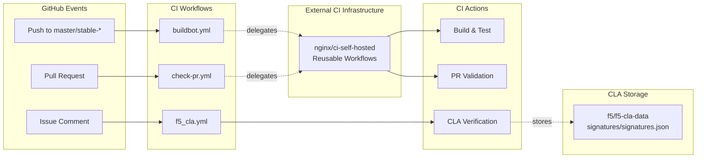

#### 3.7.3.2 Continuous Integration Scope

**Build Validation**: CI workflows compile NGINX across:
- Multiple operating systems (Linux distributions, FreeBSD, macOS)
- Multiple compilers (GCC, Clang)
- Various configuration combinations (module selection, dependency versions)

**Testing**: Integration with nginx-tests repository validates:
- Protocol compliance
- Module functionality
- Regression prevention

**Deployment**: NGINX follows traditional release model:
- Tagged releases pushed to GitHub
- Source tarballs published on nginx.org
- Binary packages built for major Linux distributions via package repositories
- No containerized deployment in core repository (Dockerfiles maintained externally)

### 3.7.4 Installation and Deployment

#### 3.7.4.1 Installation Paths

**Default Installation Layout** (--prefix=/usr/local/nginx):
- Binary: `/usr/local/nginx/sbin/nginx`
- Configuration: `/usr/local/nginx/conf/nginx.conf`
- Error Log: `/usr/local/nginx/logs/error.log`
- Access Log: `/usr/local/nginx/logs/access.log`
- PID File: `/usr/local/nginx/logs/nginx.pid`
- HTML Root: `/usr/local/nginx/html/`

**System Package Installation**: Linux distributions provide NGINX packages installing to FHS-compliant paths:
- Binary: `/usr/sbin/nginx`
- Configuration: `/etc/nginx/nginx.conf`
- Logs: `/var/log/nginx/`
- PID: `/var/run/nginx.pid`
- HTML Root: `/usr/share/nginx/html/` or `/var/www/html/`

#### 3.7.4.2 Binary Execution and Management

**Executable**: nginx

**Command-Line Options**:
- `-c filename`: Specify configuration file (default: compiled-in path)
- `-t`: Test configuration syntax without starting
- `-T`: Test configuration and dump configuration to stdout
- `-s signal`: Send signal to master process (stop, quit, reload, reopen)
- `-p prefix`: Set prefix path (overrides compiled-in prefix)
- `-g directives`: Set global configuration directives

**Signal Handling**:
- **TERM, INT**: Fast shutdown (immediately terminate workers)
- **QUIT**: Graceful shutdown (complete active connections before exiting)
- **HUP**: Configuration reload (parse new config, spawn new workers, gracefully shut down old workers)
- **USR1**: Reopen log files (for log rotation)
- **USR2**: Binary upgrade (execute new binary, pass listening sockets, gracefully shut down old workers)
- **WINCH**: Gracefully shut down worker processes (master continues running)

**Operational Commands**:
```bash
# Start NGINX
nginx

#### Test configuration
nginx -t

#### Reload configuration
nginx -s reload

#### Graceful shutdown
nginx -s quit

#### Reopen log files
nginx -s reopen

#### Binary upgrade
kill -USR2 $(cat /var/run/nginx.pid)
```

#### 3.7.4.3 Process Management

**Process Architecture**:
- **Master Process**: Privileged process (typically root) managing workers
- **Worker Processes**: Unprivileged processes (configured via `user` directive) handling all requests
- **Cache Manager Process**: Periodic cache maintenance
- **Cache Loader Process**: Startup cache metadata loading (temporary)

**Daemon Mode**: By default, NGINX runs as daemon (background process). Override with `daemon off;` for containerized deployments.

**Process Monitoring**: Master process monitors workers:
- Detects worker crashes
- Automatically respawns crashed workers
- Maintains configured worker count

#### 3.7.4.4 Configuration Management

**Configuration Hot Reload**:
1. Edit configuration files: `/etc/nginx/nginx.conf` or included files
2. Test configuration: `nginx -t`
3. If validation succeeds, reload: `nginx -s reload`
4. Master process spawns new workers with new configuration
5. Old workers complete active requests then exit
6. Zero connection drops during transition

**Graceful Binary Upgrade**:
1. Replace binary: Copy new nginx binary to installation path
2. Signal upgrade: `kill -USR2 $(cat /var/run/nginx.pid)`
3. Master executes new binary, passes listening sockets via environment
4. New master spawns new workers
5. Signal old master to gracefully shut down workers: `kill -QUIT $(cat /var/run/nginx.pid.oldbin)`
6. Old workers complete requests then exit
7. Old master exits
8. Zero connection drops throughout upgrade

### 3.7.5 Package Distribution

#### 3.7.5.1 Official Package Repositories

**NGINX Packages**: Official NGINX repository provides pre-built packages for:
- Red Hat Enterprise Linux / CentOS / Oracle Linux
- Debian
- Ubuntu
- SLES (SUSE Linux Enterprise Server)
- Alpine Linux

**Installation** (Ubuntu/Debian example):
```bash
# Add NGINX signing key
curl -fsSL https://nginx.org/keys/nginx_signing.key | sudo apt-key add -

#### Add repository
sudo add-apt-repository "deb https://nginx.org/packages/ubuntu/ $(lsb_release -cs) nginx"

#### Install
sudo apt update
sudo apt install nginx
```

#### 3.7.5.2 Distribution Packages

**Native Distribution Packages**: Major Linux distributions include NGINX in standard repositories:
- Debian/Ubuntu: `apt install nginx`
- Red Hat/CentOS/Fedora: `yum install nginx` or `dnf install nginx`
- FreeBSD: `pkg install nginx` or ports (cd /usr/ports/www/nginx && make install)
- macOS: `brew install nginx`

**Package Variants**:
- nginx: Stable version
- nginx-mainline: Latest mainline version
- nginx-module-*: Dynamic modules

#### 3.7.5.3 Containerization

**Container Status**: No official Dockerfile exists in the nginx/nginx repository (confirmed via broad search).

**Third-Party Container Images**:
- Docker Hub official image: `docker pull nginx:1.29.3` (maintained separately from core repository)
- Alpine-based minimal images
- Debian-based images
- Custom images with specific module combinations

**Container Deployment Considerations**:
- Run with `daemon off;` to keep container alive
- Forward logs to stdout/stderr for container logging
- Use environment variables for configuration customization
- Mount configuration files as volumes

## 3.8 Platform Support and Compatibility

### 3.8.1 Operating System Support

#### 3.8.1.1 Production Platforms

**Linux** (`auto/os/linux`): Full production support with comprehensive optimizations
- **Distributions**: All major distributions (RHEL, CentOS, Debian, Ubuntu, SUSE, Alpine)
- **Event Mechanism**: epoll (NGX_HAVE_EPOLL)
- **Optimizations**:
  - sendfile() for zero-copy file transmission
  - TCP_DEFER_ACCEPT for delayed accept until data available
  - SO_REUSEPORT for multi-process load distribution
  - Native file AIO (io_setup, io_submit, io_getevents) for async disk I/O
  - eventfd for notification
  - UDP GSO (Generic Segmentation Offload) for QUIC
  - eBPF for QUIC connection routing to workers
- **Features**: Full HTTP/1.1, HTTP/2, HTTP/3/QUIC, stream, mail support

**FreeBSD** (`auto/os/freebsd`): Full production support, FreeBSD-optimized
- **Event Mechanism**: kqueue (NGX_HAVE_KQUEUE)
- **Optimizations**:
  - sendfile() with SF_NODISKIO flag
  - Accept filters (SO_ACCEPTFILTER)
  - TCP_NOPUSH for header/data aggregation
- **Features**: Full protocol support

**Solaris** (`auto/os/solaris`): Full production support
- **Event Mechanisms**: event ports (preferred), /dev/poll (fallback)
- **Optimizations**: sendfile() support
- **Features**: Full protocol support

**macOS/Darwin** (`auto/os/darwin`): Full production support
- **Event Mechanism**: kqueue
- **Optimizations**: sendfile() with Darwin-specific quirks
- **Features**: Full protocol support
- **Note**: Desktop/development usage common; server deployments less typical

**Windows** (`auto/os/win32`): **Developmental/Testing Only** (per README.md)
- **Status**: Proof-of-concept stage, not recommended for production
- **Event Mechanism**: I/O Completion Ports (IOCP), WSAPoll, Winsock select
- **Limitations**:
  - Select/poll fallback required for certain operations
  - Performance inferior to Unix platforms
  - Feature parity incomplete
- **Use Case**: Development and testing on Windows workstations

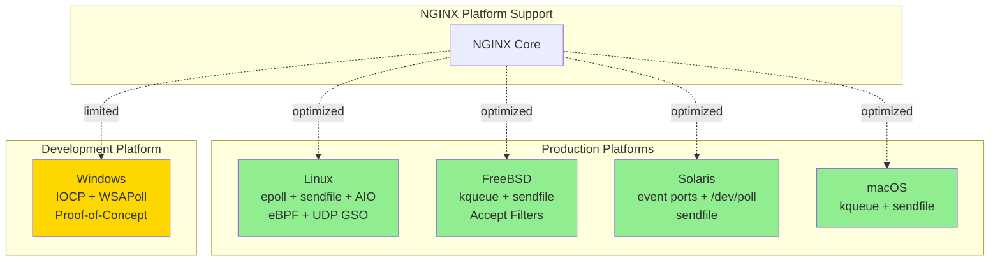

#### 3.8.1.2 Event Mechanism Selection

NGINX automatically selects optimal I/O event mechanism during configuration based on platform detection:

**Linux**: epoll (default) > poll > select (fallback)
**FreeBSD/macOS**: kqueue (default) > poll > select (fallback)
**Solaris**: event ports (default) > devpoll > poll > select (fallback)
**Windows**: IOCP (preferred) > WSAPoll > Winsock select

**Manual Override**: Configuration directive `use` in events block:
```
events {
    use epoll;  # Force specific mechanism
    worker_connections 4096;
}
```

### 3.8.2 Architecture Support

**CPU Architectures**:
- x86_64 (AMD64): Primary production architecture
- x86 (i386): Supported with 32-bit builds
- ARM (32-bit and 64-bit/AArch64): Supported for ARM servers and embedded systems
- MIPS: Supported for embedded and network appliance deployments
- PowerPC: Supported for IBM Power systems

**Atomic Operations**: Platform abstraction handles architecture-specific atomic operations:
- GCC builtin atomics (NGX_HAVE_GCC_ATOMIC) when available
- libatomic_ops fallback for platforms lacking builtins
- Platform-specific assembly for critical operations

**Endianness**: Code handles both big-endian and little-endian architectures through proper byte ordering functions.

### 3.8.3 Compiler Compatibility

**Supported Compilers** (from `auto/cc/conf`):

| Compiler | Identifier | Platform | Status |
|----------|-----------|----------|--------|
| GNU C Compiler (GCC) | gcc | Unix/Linux | Primary, fully supported |
| Clang | clang | Unix/Linux/macOS | Fully supported |
| Intel C Compiler | icc | Linux | Supported |
| Sun C Compiler | sunc | Solaris | Supported |
| Compaq C Compiler | ccc | Tru64 UNIX | Supported |
| HP aC++ | acc | HP-UX | Supported |
| Microsoft Visual C++ | msvc | Windows | Supported (limited) |
| Open Watcom | owc | Cross-platform | Supported |
| Borland C++ | bcc | DOS/Windows | Supported |

**Compiler Feature Detection**:
- C99 features (variadic macros, inline, long long)
- GNU extensions (statement expressions, variadic macros)
- Builtin functions (__builtin_expect, __builtin_bswap64)
- Atomic operations
- Alignment directives

**Optimization Flags**: Configure script applies compiler-appropriate optimization flags (-O2, -O3) and architecture-specific tuning (-march, -mtune).

## 3.9 Protocol and Feature Support

### 3.9.1 HTTP Protocol Stack

#### 3.9.1.1 HTTP/1.x Implementation

**Implementation**: `src/http/ngx_http_parse.c`, `src/http/ngx_http_request.c`

**HTTP/1.0 and HTTP/1.1 Support**:
- Incremental request line parsing (method, URI, version)
- Header parsing with continuation line support
- Chunked transfer encoding (both request and response)
- Persistent connections (Connection: keep-alive)
- Pipelining support (multiple requests without waiting for responses)
- Range requests (partial content retrieval)
- Content negotiation (Accept-*, Vary)

**Features**:
- URI normalization and validation
- Host header virtual hosting
- Expect: 100-continue handling
- Trailer header support
- Upgrade mechanism for WebSocket and HTTP/2

#### 3.9.1.2 HTTP/2 Implementation

**Implementation**: `src/http/v2/`

**Core Components**:
- **Frame Parser** (`ngx_http_v2.c`): State machine parsing all HTTP/2 frame types (DATA, HEADERS, PRIORITY, RST_STREAM, SETTINGS, PUSH_PROMISE, PING, GOAWAY, WINDOW_UPDATE, CONTINUATION)
- **HPACK Compression** (`ngx_http_v2_table.c`, `ngx_http_v2_hpack.c`): Dynamic table management, static table lookups, Huffman encoding/decoding
- **Stream Management**: Multiplexing with per-stream and connection-level state
- **Flow Control**: Per-stream and connection-level window management
- **Priority Scheduling** (`ngx_http_v2.c`): Priority and dependency tree for weighted stream scheduling
- **Filter Module** (`ngx_http_v2_filter_module.c`): Response frame generation and transmission

**Configuration Directives**:
```
listen 443 ssl http2;  # Enable HTTP/2 on listener
http2_recv_buffer_size 256k;
http2_pool_size 4k;
http2_max_concurrent_streams 128;
http2_body_preread_size 64k;
http2_streams_index_size 32;
http2_chunk_size 8k;
http2_max_field_size 4k;
http2_max_header_size 16k;
```

**Features**:
- Server push (PUSH_PROMISE frames)
- Stream dependencies and weights
- HPACK header compression reducing header overhead
- Binary framing with length-prefixed frames
- Multiplexing eliminating head-of-line blocking at application layer

#### 3.9.1.3 HTTP/3 and QUIC Implementation

**Implementation**: `src/http/v3/` (HTTP/3), `src/event/quic/` (QUIC transport)

**QUIC Transport Layer** (`src/event/quic/`):
- **Connection Management** (`ngx_event_quic_connection.c`): Connection ID management, migration, packet number spaces
- **Crypto Operations** (`ngx_event_quic_openssl.c`, `ngx_event_quic_protection.c`): Packet protection, header protection, key derivation using OpenSSL/BoringSSL/QuicTLS
- **Frame Processing** (`ngx_event_quic_frames.c`): All QUIC frame types (STREAM, ACK, CRYPTO, CONNECTION_CLOSE, MAX_DATA, RESET_STREAM, etc.)
- **ACK and Loss Detection** (`ngx_event_quic_ack.c`): Acknowledgment processing, loss detection, retransmission
- **Congestion Control** (`ngx_event_quic_congestion.c`): CUBIC congestion control algorithm
- **Token Handling** (`ngx_event_quic_tokens.c`): Address validation tokens
- **UDP Datagrams** (`ngx_event_quic_udp.c`): UDP socket management with GSO support
- **eBPF Optimization** (`ngx_event_quic_bpf.c`, `bpf/ngx_quic_reuseport.c`): Connection ID-based worker routing for SO_REUSEPORT sockets

**HTTP/3 Layer** (`src/http/v3/`):
- **QPACK Compression** (`ngx_http_v3_table.c`): Dynamic table, static table, encoder/decoder streams
- **HTTP/3 Streams** (`ngx_http_v3_streams.c`): Bidirectional request/response streams, unidirectional control streams
- **Frame Processing** (`ngx_http_v3.c`): HTTP/3 frame types (DATA, HEADERS, CANCEL_PUSH, SETTINGS, PUSH_PROMISE, GOAWAY, MAX_PUSH_ID)
- **Variable Length Integer** (`ngx_http_v3_encode.c`): QUIC varlen encoding

**Configuration Directives**:
```
listen 443 http3 reuseport;  # Enable HTTP/3/QUIC
listen 443 ssl http2;         # Fallback to HTTP/2

http3 on;
http3_hq off;  # Disable HTTP/0.9 over QUIC
http3_max_concurrent_streams 128;
http3_stream_buffer_size 64k;

quic_retry on;  # Enable address validation
quic_gso on;    # UDP Generic Segmentation Offload
quic_host_key /path/to/quic_key;  # Stateless reset key
quic_active_connection_id_limit 2;
```

**Features**:
- Zero RTT connection establishment (0-RTT) with early data
- Connection migration for mobile clients changing networks
- Improved loss recovery eliminating head-of-line blocking at transport layer
- UDP GSO for efficient packet transmission
- eBPF-based connection routing to workers
- QPACK dynamic table updates via dedicated streams

**Crypto Provider Compatibility**: HTTP/3/QUIC requires OpenSSL with QUIC extensions, BoringSSL (Google's fork), or QuicTLS (Microsoft's fork). Feature flag NGX_QUIC_OPENSSL_COMPAT enables compatibility layer across providers.

### 3.9.2 Stream and Mail Protocols

#### 3.9.2.1 TCP/UDP Stream Proxying

**Implementation**: `src/stream/`

**Purpose**: Generic Layer 4 (TCP and UDP) proxying and load balancing independent of application protocols.

**Capabilities**:
- TCP proxying with persistent connections
- UDP proxying with datagrams or session-based streams
- SSL/TLS termination and passthrough
- SNI extraction without decryption (ssl_preread)
- Load balancing with multiple algorithms
- Access control and rate limiting
- Geographic routing via GeoIP
- Variable-based logic

**Configuration Example**:
```
stream {
    upstream backend {
        server backend1.example.com:12345;
        server backend2.example.com:12345;
    }

    server {
        listen 12345;
        proxy_pass backend;
    }
    
    # SSL passthrough with SNI routing
    map $ssl_preread_server_name $backend {
        app1.example.com backend1;
        app2.example.com backend2;
        default backend3;
    }

    server {
        listen 443;
        ssl_preread on;
        proxy_pass $backend;
    }
}
```

#### 3.9.2.2 Mail Protocol Proxying

**Implementation**: `src/mail/`

**Supported Protocols**:
- **SMTP**: Simple Mail Transfer Protocol for mail submission
- **IMAP**: Internet Message Access Protocol for mail retrieval
- **POP3**: Post Office Protocol v3 for mail retrieval

**Authentication Delegation Architecture**:
1. Client connects to NGINX mail proxy
2. Client initiates authentication (AUTH command)
3. NGINX forwards credentials to HTTP authentication backend
4. Backend validates credentials and returns:
   - Authentication result (success/failure)
   - Backend mail server host and port
   - Additional headers for backend communication
5. NGINX establishes connection to designated mail server
6. NGINX proxies authenticated session between client and mail server

**Configuration Example**:
```
mail {
    server_name mail.example.com;
    auth_http http://auth-backend.example.com/auth;

    server {
        listen 25;
        protocol smtp;
        smtp_auth login plain;
    }

    server {
        listen 143;
        protocol imap;
    }

    server {
        listen 110;
        protocol pop3;
        pop3_auth plain;
    }
}
```

**SSL/TLS Support**: All mail protocols support STARTTLS (upgrade to TLS) and implicit TLS (TLS on connection):
```
server {
    listen 465 ssl;  # SMTPS
    protocol smtp;
    ssl_certificate /path/to/cert.pem;
    ssl_certificate_key /path/to/key.pem;
}
```

### 3.9.3 Additional Protocol Support

#### 3.9.3.1 PROXY Protocol

**Implementation**: `src/core/ngx_proxy_protocol.c/h`

**Versions**:
- **v1**: Text-based protocol with client IP, proxy IP, ports
- **v2**: Binary protocol with TLV (Type-Length-Value) extensions

**Purpose**: Preserve client connection information (source IP, destination IP, ports) through proxy chains. Essential for multi-tier architectures where backend services require true client addressing.

**Configuration**:
```
# Receiving PROXY protocol
server {
    listen 80 proxy_protocol;
    real_ip_header proxy_protocol;
    set_real_ip_from 10.0.0.0/8;
}

#### Sending PROXY protocol to upstream
upstream backend {
    server backend.example.com:80;
}

location / {
    proxy_pass http://backend;
    proxy_protocol on;
}
```

#### 3.9.3.2 FastCGI Protocol

**Configuration**: `conf/fastcgi.conf`, `conf/fastcgi_params`

**Purpose**: Interfaces with FastCGI application servers (PHP-FPM, Python, Ruby, etc.)

**Features**:
- Request parameter mapping to CGI environment
- Request body forwarding
- Response buffering
- Connection multiplexing and keepalive
- Caching with fastcgi_cache

**Configuration Example**:
```
location ~ \.php$ {
    fastcgi_pass unix:/run/php-fpm.sock;
    fastcgi_index index.php;
    fastcgi_param SCRIPT_FILENAME $document_root$fastcgi_script_name;
    include fastcgi_params;
}
```

#### 3.9.3.3 WebSocket Protocol

**Support**: Via HTTP/1.1 Upgrade mechanism

**Configuration**: Requires proxy header manipulation to upgrade connection:
```
location /websocket {
    proxy_pass http://websocket_backend;
    proxy_http_version 1.1;
    proxy_set_header Upgrade $http_upgrade;
    proxy_set_header Connection "upgrade";
}
```

NGINX maintains bidirectional communication channel after upgrade handshake completes.

## 3.10 Version Information and Licensing

### 3.10.1 Version Details

**Current Version**: 1.29.3 (Mainline Development Track)
**Source**: `src/core/nginx.h`

**Version Definition**:
```c
#define nginx_version      1029003
#define NGINX_VERSION      "1.29.3"
#define NGINX_VER          "nginx/" NGINX_VERSION
```

**Versioning Scheme**: MAJOR.MINOR.PATCH
- **Major**: Significant architectural changes (rarely incremented)
- **Minor**: Feature additions, protocol implementations, optimizations
  - Odd numbers (1.29.x): Mainline development with latest features
  - Even numbers (1.28.x): Stable branch with critical fixes only
- **Patch**: Bug fixes and minor improvements

**Version Selection Guidance**:
- **Mainline (1.29.x)**: Latest features, optimizations, bug fixes; recommended for most deployments
- **Stable (1.28.x)**: Conservative updates, critical fixes only; for risk-averse environments requiring predictable behavior

### 3.10.2 License

**License Type**: BSD 2-Clause License
**Source**: `LICENSE` file

**Copyright Holders**:
- Igor Sysoev (2002-2021): Original author
- Nginx, Inc. (2011-2025): Corporate maintainer, now subsidiary of F5, Inc.

**License Terms** (summarized):
- Free redistribution in source and binary forms with or without modification
- Modification permitted
- Copyright notice and license text must be retained in redistributions
- No endorsement using copyright holders' names without permission
- No warranty provided (AS-IS basis)

**Full License Text**:
```
Copyright (C) 2002-2021 Igor Sysoev
Copyright (C) 2011-2025 Nginx, Inc.
All rights reserved.

Redistribution and use in source and binary forms, with or without
modification, are permitted provided that the following conditions
are met:
1. Redistributions of source code must retain the above copyright
   notice, this list of conditions and the following disclaimer.
2. Redistributions in binary form must reproduce the above copyright
   notice, this list of conditions and the following disclaimer in the
   documentation and/or other materials provided with the distribution.

THIS SOFTWARE IS PROVIDED BY THE AUTHOR AND CONTRIBUTORS ``AS IS'' AND
ANY EXPRESS OR IMPLIED WARRANTIES, INCLUDING, BUT NOT LIMITED TO, THE
IMPLIED WARRANTIES OF MERCHANTABILITY AND FITNESS FOR A PARTICULAR PURPOSE
ARE DISCLAIMED.  IN NO EVENT SHALL THE AUTHOR OR CONTRIBUTORS BE LIABLE
FOR ANY DIRECT, INDIRECT, INCIDENTAL, SPECIAL, EXEMPLARY, OR CONSEQUENTIAL
DAMAGES (INCLUDING, BUT NOT LIMITED TO, PROCUREMENT OF SUBSTITUTE GOODS
OR SERVICES; LOSS OF USE, DATA, OR PROFITS; OR BUSINESS INTERRUPTION)
HOWEVER CAUSED AND ON ANY THEORY OF LIABILITY, WHETHER IN CONTRACT, STRICT
LIABILITY, OR TORT (INCLUDING NEGLIGENCE OR OTHERWISE) ARISING IN ANY WAY
OUT OF THE USE OF THIS SOFTWARE, EVEN IF ADVISED OF THE POSSIBILITY OF
SUCH DAMAGE.
```

**Contribution License**: Contributors submitting pull requests implicitly grant permission to use contributions under the same BSD 2-Clause license (per `CONTRIBUTING.md`). Contributor License Agreement (CLA) enforced via GitHub Actions workflow ensures formal agreement to F5 CLA terms.

**Commercial Use**: BSD 2-Clause license permits unrestricted commercial use, modification, and redistribution without royalties or licensing fees. Permissive licensing enables embedding NGINX in commercial products and appliances.

## 3.11 References

### 3.11.1 Files Examined

- `README.md` - Build requirements, dependencies, installation procedures, platform support documentation
- `.github/workflows/f5_cla.yml` - CI/CD workflow configuration, GitHub Actions runner specifications, CLA enforcement automation
- `.github/workflows/buildbot.yml` - Continuous integration workflow for master and stable branches
- `.github/workflows/check-pr.yml` - Pull request validation workflow
- `CONTRIBUTING.md` - Testing infrastructure references, commit conventions, community contribution guidelines
- `CODE_OF_CONDUCT.md` - Contributor Covenant 2.1 code of conduct
- `SECURITY.md` - Vulnerability disclosure procedures and response SLOs
- `LICENSE` - BSD 2-Clause license with copyright information
- `src/core/nginx.h` - Version constants and definitions (1.29.3)
- `src/misc/ngx_cpp_test_module.cpp` - C++ compatibility testing module
- `conf/nginx.conf` - Default configuration template
- `conf/fastcgi.conf` - FastCGI parameter mappings
- `contrib/geo2nginx.pl` - GeoIP database conversion utility
- `contrib/unicode2nginx/unicode-to-nginx.pl` - Unicode to UTF-8 hex converter
- `contrib/vim/ftdetect/nginx.vim` - Vim file type detection
- `contrib/vim/syntax/nginx.vim` - Vim syntax highlighting
- `contrib/vim/indent/nginx.vim` - Vim indentation rules
- `contrib/vim/ftplugin/nginx.vim` - Vim file type plugin

### 3.11.2 Folders Explored

- `` (repository root) - Overall structure, build system entry point
- `.github/` - GitHub-specific metadata, CI/CD workflows, issue templates
- `.github/workflows/` - GitHub Actions workflow definitions
- `auto/` - Build system configuration scripts, compiler detection, platform detection
- `auto/cc/` - Compiler detection and configuration (GCC, Clang, ICC, MSVC, etc.)
- `auto/os/` - Operating system detection and platform-specific configuration (Linux, FreeBSD, Darwin, Solaris, Win32)
- `auto/lib/` - External library detection and configuration
- `auto/lib/pcre/` - PCRE/PCRE2 detection and configuration
- `auto/lib/zlib/` - zlib detection and configuration
- `auto/lib/openssl/` - OpenSSL detection and configuration
- `auto/lib/geoip/` - GeoIP library detection
- `auto/lib/google-perftools/` - Google Perftools integration
- `auto/lib/libatomic/` - libatomic_ops configuration
- `auto/lib/libgd/` - libgd graphics library detection
- `auto/lib/libxslt/` - libxml2/libxslt/libexslt detection
- `auto/lib/perl/` - Perl interpreter detection and ExtUtils::Embed integration
- `src/` - Complete NGINX implementation in C
- `src/core/` - Core runtime, memory management (ngx_palloc, ngx_slab), data structures (ngx_array, ngx_list, ngx_queue, ngx_rbtree, ngx_radix_tree, ngx_hash), cryptography (ngx_md5, ngx_sha1, ngx_crc32, ngx_murmurhash, ngx_crypt), configuration parser, DNS resolver, logging
- `src/event/` - Event-driven I/O engine, platform-specific drivers, timer management, OpenSSL integration
- `src/event/modules/` - Event mechanism implementations (epoll, kqueue, event ports, devpoll, IOCP, poll, select)
- `src/event/quic/` - Complete QUIC transport implementation (connection management, crypto, frame processing, ACK/loss detection, congestion control, eBPF integration)
- `src/event/quic/bpf/` - eBPF programs for QUIC connection routing
- `src/http/` - HTTP stack implementation (parsers, phase engine, upstream framework, filter chains, 50+ modules)
- `src/http/modules/` - HTTP functional modules (content serving, proxying, compression, security, load balancing)
- `src/http/v2/` - HTTP/2 protocol implementation (frame parsing, HPACK compression, stream management, flow control, priority scheduling)
- `src/http/v3/` - HTTP/3 protocol implementation (QPACK compression, HTTP/3 framing, stream management)
- `src/stream/` - Layer 4 TCP/UDP stream proxying subsystem
- `src/stream/modules/` - Stream functional modules (SSL, access control, upstream, geo)
- `src/mail/` - Mail protocol proxying (SMTP, IMAP, POP3) with HTTP authentication delegation
- `src/os/` - Operating system abstraction layer (Unix/POSIX, Win32)
- `src/os/unix/` - Unix/POSIX platform implementation
- `src/os/win32/` - Windows platform implementation
- `src/misc/` - Miscellaneous modules (Google Perftools integration, C++ compatibility test)
- `conf/` - Configuration file templates (nginx.conf, mime.types, fastcgi.conf, fastcgi_params, scgi_params, uwsgi_params)
- `contrib/` - Developer utilities (Perl scripts, Vim integration)
- `contrib/vim/` - Vim/Neovim editor integration files
- `contrib/unicode2nginx/` - Unicode processing utilities
- `docs/` - Documentation structure (HTML, XML changelogs)
- `docs/xml/nginx/` - Structured changelog in XML format

### 3.11.3 Technical Specification Sections Retrieved

- **1.1 Executive Summary** - Project overview, core business problem, stakeholder analysis, business impact
- **1.2 System Overview** - Project context, high-level description, major system components, success criteria

### 3.11.4 External References

**Official Documentation**:
- NGINX Documentation: https://nginx.org/en/docs/
- NGINX Development Guide: https://nginx.org/en/docs/dev/development_guide.html

**Source Repositories**:
- Main Repository: https://github.com/nginx/nginx
- Test Repository: https://github.com/nginx/nginx-tests

**CI Infrastructure**:
- External CI Workflows: https://github.com/nginx/ci-self-hosted

**Contributor License Agreement**:
- F5 CLA Document: https://github.com/f5/f5-cla/blob/main/docs/f5_cla.md
- CLA Signatures Storage: https://github.com/f5/f5-cla-data

**Package Repositories**:
- Official NGINX Packages: https://nginx.org/en/linux_packages.html
- Package Signing Keys: https://nginx.org/keys/nginx_signing.key

**Standards and Protocols**:
- HTTP/1.1: RFC 7230-7235
- HTTP/2: RFC 7540, RFC 7541 (HPACK)
- HTTP/3: RFC 9114
- QUIC: RFC 9000-9002
- FastCGI: https://fastcgi-archives.github.io/
- PROXY Protocol: https://www.haproxy.org/download/1.8/doc/proxy-protocol.txt

# 4. Process Flowchart

## 4.1 Overview

### 4.1.1 Purpose and Scope

This section provides comprehensive process flowcharts documenting all major workflows within the NGINX web server and reverse proxy system. These flowcharts illustrate the event-driven, non-blocking architecture spanning from master process initialization through request processing, protocol handling, upstream proxying, caching, and error recovery.

The flowcharts serve multiple audiences:
- **System Architects** understanding NGINX's multi-process concurrency model and event-driven design patterns
- **Operations Engineers** troubleshooting configuration reload, graceful shutdown, and binary upgrade procedures
- **Security Analysts** examining authentication checkpoints, rate limiting enforcement, and TLS/SSL handshake flows
- **Performance Engineers** identifying bottlenecks in request processing, caching decisions, and upstream connection management
- **Application Developers** integrating with NGINX through proxy protocols, custom headers, and authentication mechanisms

### 4.1.2 Process Flow Organization

Process flows are organized hierarchically from system-level operations to protocol-specific processing:

**System Lifecycle Flows** (Section 4.2): Master-worker process management, configuration initialization and reload, graceful shutdown, and binary upgrade sequences

**Event Processing Flows** (Section 4.3): Core event loop operation, accept handling, timer management, and posted event processing

**HTTP Protocol Flows** (Section 4.4): HTTP/1.x request lifecycle, HTTP/2 frame processing with stream multiplexing, and HTTP/3 with QUIC transport

**Upstream and Load Balancing Flows** (Section 4.5): Backend server selection algorithms, connection establishment, failover logic, and health checking

**Caching Workflows** (Section 4.6): Cache lookup with shared memory coordination, cache storage with locking, and background maintenance processes

**Security and Access Control Flows** (Section 4.7): SSL/TLS handshake sequences, rate limiting enforcement, connection limiting, and authentication delegation

**Layer 4 Stream Processing** (Section 4.8): TCP/UDP session establishment, bidirectional forwarding, and connection termination

**Error Handling and Recovery** (Section 4.9): Error detection points, classification, retry strategies, and graceful degradation

**State Transition Diagrams** (Section 4.10): Request states, connection states, upstream states, and worker process states

### 4.1.3 Flowchart Conventions

All flowcharts follow consistent notation:

**Shapes**:
- Rounded rectangles: Start/end points
- Rectangles: Process steps or operations
- Diamonds: Decision points requiring conditional branching
- Parallelograms: Input/output operations
- Cylinders: Data storage or shared memory access

**Colors and Styling**:
- Green paths: Success flows
- Red paths: Error conditions
- Yellow: Warning or alternative paths
- Blue: Background processes

**Annotations**:
- Feature IDs (F-XXX) reference the Feature Catalog in Section 2.2
- File paths reference source code implementation
- Configuration directives reference applicable settings
- Timing considerations note SLA-relevant delays

**Cross-References**:
- Section 2.7 contains foundational flowcharts (HTTP Request Processing, SSL/TLS, Cache)
- Section 1.2.2 describes architectural components referenced in flows
- Section 3.3 details the technical implementation of event-driven architecture

## 4.2 System Lifecycle Flows

### 4.2.1 Master Process Startup and Initialization

The master process initialization sequence establishes the foundational infrastructure before spawning worker processes. This flow executes once during NGINX startup.

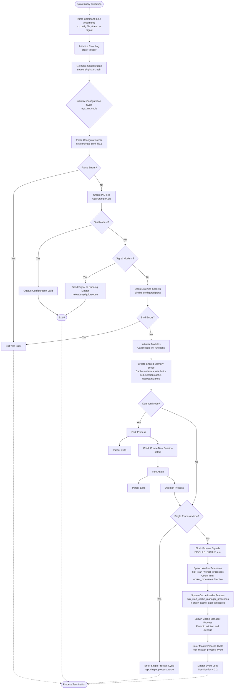

**Key Implementation Details**:

- **Configuration Cycle** (`src/core/ngx_cycle.c`): The cycle structure contains all configuration, listening sockets, shared memory zones, and module contexts. Configuration reload creates a new cycle while preserving the old cycle until graceful transition completes.

- **Socket Inheritance**: Listening sockets bind with SO_REUSEADDR (and SO_REUSEPORT where supported) enabling graceful binary upgrades through socket inheritance via environment variables.

- **Shared Memory Zones**: Created via mmap (Unix) or CreateFileMapping (Windows) with slab allocator for efficient allocation. Zone names must be unique across cache zones, limit zones, and upstream zones.

- **Worker Process Count**: The `worker_processes` directive supports numeric values or `auto` (matching CPU core count via sysconf(_SC_NPROCESSORS_ONLN) on Unix).

### 4.2.2 Master Process Event Loop

The master process supervises worker processes through signal-driven event handling, responding to operational commands and child process state changes.

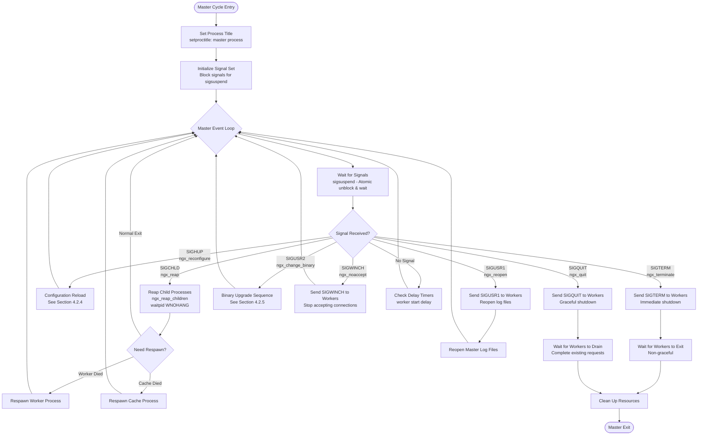

**Signal Handling Details**:

- **Signal Safety**: Master process blocks signals during normal operation, atomically unblocking only during sigsuspend. Signal handlers set global flags (ngx_reap, ngx_quit, etc.) examined after sigsuspend returns.

- **Child Reaping**: SIGCHLD triggers waitpid with WNOHANG to collect exit status of terminated children. Master respawns crashed workers while respecting shutdown flags.

- **Graceful Shutdown**: SIGQUIT initiates graceful shutdown where workers stop accepting new connections, complete in-flight requests, and exit cleanly. Master waits with timeout before forcing termination.

### 4.2.3 Worker Process Initialization

Worker processes initialize their event-driven infrastructure and enter the main processing loop.

```mermaid
flowchart TD
    Start([Worker Process Forked]) --> InitWorker[Worker Initialization<br/>ngx_worker_process_init]
    
    InitWorker --> SetEnv[Set Environment Variables]
    
    SetEnv --> SetPriority{Priority Configured?<br/>worker_priority}
    SetPriority -->|Yes| SetNice[Set Process Priority<br/>setpriority]
    SetPriority -->|No| SetRlimit
    SetNice --> SetRlimit{Resource Limits?<br/>worker_rlimit_*}
    
    SetRlimit -->|Yes| ApplyRlimit[Apply rlimit Values<br/>setrlimit: NOFILE, CORE, etc.]
    SetRlimit -->|No| SetUser
    ApplyRlimit --> SetUser{User/Group Configured?<br/>user directive}
    
    SetUser -->|Yes| DropPrivileges[Drop Privileges<br/>setgid, setuid<br/>Initialize supplementary groups]
    SetUser -->|No| SetAffinity
    DropPrivileges --> SetAffinity{CPU Affinity?<br/>worker_cpu_affinity}
    
    SetAffinity -->|Yes| BindCPU[Bind to CPU Cores<br/>sched_setaffinity Linux<br/>cpuset_setaffinity FreeBSD]
    SetAffinity -->|No| UnblockSignals
    BindCPU --> UnblockSignals[Unblock Signals<br/>Clear signal mask]
    
    UnblockSignals --> CloseUnusedChannels[Close Unused IPC Channels<br/>Close other workers' channels]
    
    CloseUnusedChannels --> RegisterChannel[Register Channel Event<br/>ngx_channel_handler<br/>Receives commands from master]
    
    RegisterChannel --> InitModules[Call Module Init Hooks<br/>Worker init for each module]
    
    InitModules --> InitConnectionPool[Initialize Connection Pool<br/>worker_connections connections<br/>Read/Write event structures]
    
    InitConnectionPool --> InitAcceptMutex{Accept Mutex Needed?<br/>Multiple workers, no SO_REUSEPORT}
    InitAcceptMutex -->|Yes| SetupMutex[Setup Accept Mutex<br/>Shared memory or file-based]
    InitAcceptMutex -->|No| AddListenEvents
    SetupMutex --> AddListenEvents[Add Listening Events<br/>Accept handlers for listening sockets]
    
    AddListenEvents --> InitTimers[Initialize Timer RBTree<br/>Empty red-black tree]
    
    InitTimers --> EnterEventLoop[Enter Event Processing Loop<br/>ngx_process_events_and_timers<br/>See Section 4.3.1]
    
    EnterEventLoop --> EventLoop[Worker Event Loop<br/>Never returns unless shutdown]
    
    EventLoop --> ShutdownSignal{Shutdown Signal?<br/>SIGQUIT, SIGTERM, SIGINT}
    
    ShutdownSignal -->|SIGQUIT<br/>Graceful| CloseListening[Close Listening Sockets<br/>Stop accepting new connections]
    
    CloseListening --> DrainConnections[Drain Existing Connections<br/>Wait for completion]
    
    DrainConnections --> CheckActive{Active Connections?}
    CheckActive -->|Yes| WaitTimeout{Shutdown Timeout?<br/>worker_shutdown_timeout}
    WaitTimeout -->|Not Expired| DrainConnections
    WaitTimeout -->|Expired| ForceClose[Force Close Connections]
    CheckActive -->|No| CleanupWorker
    ForceClose --> CleanupWorker[Worker Cleanup<br/>Destroy pools, close files]
    
    ShutdownSignal -->|SIGTERM<br/>Immediate| ForceClose
    
    CleanupWorker --> Exit([Worker Process Exit])
```

**Worker Initialization Details**:

- **Privilege Dropping**: Workers drop privileges after binding sockets (master binds as root for ports <1024). The `user` directive specifies unprivileged user/group.

- **CPU Affinity**: Binds workers to specific CPU cores reducing cache thrashing. Configuration pattern: `worker_cpu_affinity 0001 0010 0100 1000;` for 4 workers on 4 cores.

- **Connection Pool**: Pre-allocates ngx_connection_t structures equal to worker_connections (default 1024). Each connection has associated read and write ngx_event_t structures.

- **Accept Mutex**: Serializes accept across workers when SO_REUSEPORT unavailable. Workers compete for mutex before accepting, preventing thundering herd. With SO_REUSEPORT, kernel distributes accepts directly.

### 4.2.4 Configuration Reload Sequence

Zero-downtime configuration reload through cycle transition enables runtime configuration changes.

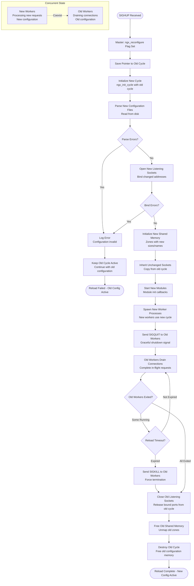

**Configuration Reload Details**:

- **Socket Reuse**: Unchanged listening sockets inherit from old cycle avoiding bind errors and connection loss.

- **Shared Memory Transition**: New shared memory zones initialize independently. Cache data does not transfer between reloads (cache cold-starts).

- **Worker Coexistence**: New and old workers coexist during transition. New workers accept connections using new configuration; old workers drain existing connections using old configuration.

- **Rollback Safety**: Configuration validation occurs before spawning new workers. Parse errors preserve old configuration without service disruption.

- **Module State**: Modules must handle initialization and cleanup properly supporting multiple active cycles during reload.

### 4.2.5 Binary Upgrade Sequence

Graceful binary replacement enables runtime upgrades without connection loss.

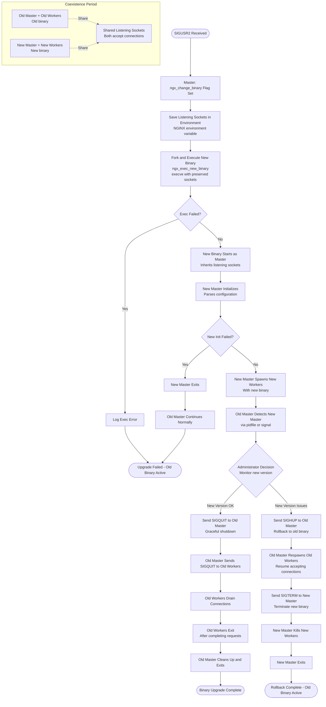

**Binary Upgrade Details**:

- **Socket Preservation**: Listening socket file descriptors pass to new binary via environment variable NGINX. New binary recognizes inherited sockets and skips bind.

- **Dual Master Period**: Old and new master processes coexist. Both accept connections on shared sockets (SO_REUSEADDR). Kernel distributes accepts between old and new workers.

- **Testing Window**: Administrators monitor new binary behavior (error logs, metrics) before committing to upgrade. Rollback possible by restarting old master.

- **Graceful Transition**: Old workers continue serving existing connections. New connections route to new workers. System remains fully available throughout upgrade.

- **PID File Handling**: New master writes PID to `.oldbin` suffixed file. Old master retains original PID file. On old master exit, new master removes `.oldbin` file.

## 4.3 Event Processing Flows

### 4.3.1 Core Event Loop Processing

The event loop constitutes the heart of NGINX's non-blocking architecture, processing I/O events, timers, and posted events.

```mermaid
flowchart TD
    Start([Event Loop Iteration]) --> ComputeNextTimer[Compute Next Timer Expiration<br/>Min value from timer RBTree]
    
    ComputeNextTimer --> CheckPosted{Posted Next Events?<br/>ngx_posted_next_events queue}
    CheckPosted -->|Yes| SetTimerZero[Set Timer to 0<br/>Process posted immediately]
    CheckPosted -->|No| CheckAcceptMutex
    SetTimerZero --> CheckAcceptMutex{Accept Mutex Enabled?<br/>!SO_REUSEPORT && multiple workers}
    
    CheckAcceptMutex -->|Yes| CheckDisabled{Accept Disabled?<br/>accept_disabled > 0}
    CheckDisabled -->|Yes| SkipMutex[Skip Mutex Acquisition<br/>Connection pool near limit]
    CheckDisabled -->|No| TryAcquireMutex{Try Acquire Mutex<br/>Non-blocking}
    
    TryAcquireMutex -->|Success| SetPostFlag[Set NGX_POST_EVENTS Flag<br/>Delay accept processing]
    TryAcquireMutex -->|Failed| SkipMutex
    SetPostFlag --> CheckNextAgain
    SkipMutex --> CheckNextAgain{Posted Next Events?}
    
    CheckAcceptMutex -->|No| CheckNextAgain
    
    CheckNextAgain -->|Yes| SetTimerZeroAgain[Update Timer to 0]
    CheckNextAgain -->|No| CallProcessEvents
    SetTimerZeroAgain --> CallProcessEvents[Call Platform Event Mechanism<br/>ngx_process_events]
    
    CallProcessEvents --> PlatformEvent{Platform Type}
    
    PlatformEvent -->|Linux| Epoll[epoll_wait<br/>Edge or Level Triggered<br/>Returns ready events]
    PlatformEvent -->|FreeBSD/macOS| Kqueue[kevent<br/>Returns ready events]
    PlatformEvent -->|Windows| IOCP[GetQueuedCompletionStatus<br/>Returns completed I/O]
    PlatformEvent -->|Solaris| EventPorts[port_getn<br/>Returns events]
    PlatformEvent -->|Fallback| Poll[poll/select<br/>Portable mechanism]
    
    Epoll --> ProcessReady[Process Ready Events<br/>Iterate returned events]
    Kqueue --> ProcessReady
    IOCP --> ProcessReady
    EventPorts --> ProcessReady
    Poll --> ProcessReady
    
    ProcessReady --> EventType{Event Type}
    
    EventType -->|Accept Event| PostFlag1{POST_EVENTS Flag?}
    PostFlag1 -->|Yes| QueueAccept[Queue to posted_accept_events]
    PostFlag1 -->|No| HandleAccept[Handle Accept Immediately<br/>ngx_event_accept]
    QueueAccept --> NextEvent
    HandleAccept --> NextEvent{More Events?}
    
    EventType -->|Read Event| PostFlag2{POST_EVENTS Flag?}
    PostFlag2 -->|Yes| QueueEvent[Queue to posted_events]
    PostFlag2 -->|No| HandleRead[Handle Read Immediately<br/>Call read event handler]
    QueueEvent --> NextEvent
    HandleRead --> NextEvent
    
    EventType -->|Write Event| PostFlag3{POST_EVENTS Flag?}
    PostFlag3 -->|Yes| QueueEvent
    PostFlag3 -->|No| HandleWrite[Handle Write Immediately<br/>Call write event handler]
    HandleWrite --> NextEvent
    
    NextEvent -->|Yes| EventType
    NextEvent -->|No| ProcessPostedAccept{Posted Accept Events?}
    
    ProcessPostedAccept -->|Yes| ProcessAccepts[Process All Posted Accepts<br/>ngx_event_process_posted]
    ProcessPostedAccept -->|No| ReleaseMutex
    ProcessAccepts --> ReleaseMutex{Mutex Held?}
    
    ReleaseMutex -->|Yes| UnlockMutex[Release Accept Mutex<br/>Allow other workers]
    ReleaseMutex -->|No| CheckStale
    UnlockMutex --> CheckStale{Events Marked Stale?}
    
    CheckStale -->|Yes| SkipTimer[Skip Timer Processing<br/>Rechecked in next iteration]
    CheckStale -->|No| ExpireTimers[Expire Timers<br/>ngx_event_expire_timers<br/>Process all expired entries]
    
    SkipTimer --> ProcessPosted
    ExpireTimers --> ProcessPosted{Posted Events?<br/>ngx_posted_events queue}
    
    ProcessPosted -->|Yes| ProcessPostedLoop[Process All Posted Events<br/>Event handler calls]
    ProcessPosted -->|No| CheckDelayed
    ProcessPostedLoop --> CheckDelayed{Posted Delayed Events?<br/>Delayed by throttling}
    
    CheckDelayed -->|Yes| ProcessDelayed[Process Delayed Events<br/>Deferred for next iteration]
    CheckDelayed -->|No| UpdateAcceptDisabled
    ProcessDelayed --> UpdateAcceptDisabled[Update accept_disabled Counter<br/>connection_n - free_connection_n<br/>- 7/8 * worker_connections]
    
    UpdateAcceptDisabled --> LoopEnd([Iteration Complete])
    
    LoopEnd --> Start
```

**Event Loop Details**:

- **Timer Calculation**: Determines maximum blocking time for event mechanism. Computed from nearest timer expiration or configured timeout values.

- **Accept Mutex**: Serializes accept across workers when SO_REUSEPORT unavailable. Acquired worker processes all pending accepts before releasing. Prevents thundering herd where all workers wake on new connection.

- **Posted Events**: Events queue for deferred processing. NGX_POST_EVENTS flag delays accept processing until after releasing mutex, ensuring fair distribution. Regular posted events separate high-frequency operations from event polling.

- **Accept Disabled**: Adaptive mechanism disabling accept when worker approaches connection limit (7/8 threshold). Prevents worker from accepting connections it cannot handle.

- **Stale Events**: Events may become stale if connection closes between event notification and processing. Stale flag prevents processing invalid events.

- **Platform Differences**:
  - **epoll** (Linux): Edge-triggered mode requires draining socket buffer. Level-triggered simpler but less efficient.
  - **kqueue** (FreeBSD/macOS): Provides rich event filtering including file changes, signals, timers.
  - **IOCP** (Windows): Completion-based model differs from readiness notification.

### 4.3.2 Connection Accept Flow

Connection acceptance creates new connections from incoming client requests.

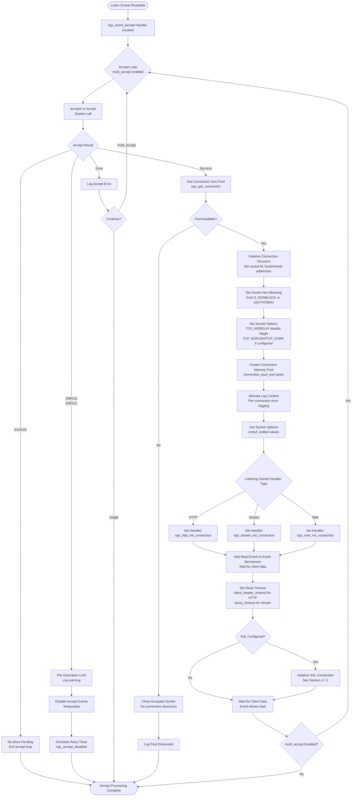

**Connection Accept Details**:

- **accept4 vs accept**: Linux accept4 allows setting O_NONBLOCK and O_CLOEXEC atomically. Fallback to accept with subsequent fcntl on other platforms.

- **Connection Pool Management**: Pre-allocated connection structures (worker_connections) assigned from pool. Pool exhaustion prevents new accepts until connections free.

- **Socket Options**:
  - **TCP_NODELAY**: Disables Nagle algorithm for low-latency response
  - **TCP_NOPUSH** (FreeBSD) / **TCP_CORK** (Linux): Delays packet transmission until buffer full or explicitly flushed
  - **SO_KEEPALIVE**: TCP keepalive probes for dead connection detection

- **multi_accept**: When enabled, processes all pending connections in single event notification. Improves throughput under load but may starve other events.

- **File Descriptor Limits**: EMFILE (process limit) or ENFILE (system limit) errors temporarily disable accept events. Timer re-enables after delay (ngx_accept_disabled).

### 4.3.3 Timer Management

Timer management through red-black tree enables efficient timeout enforcement across thousands of connections.

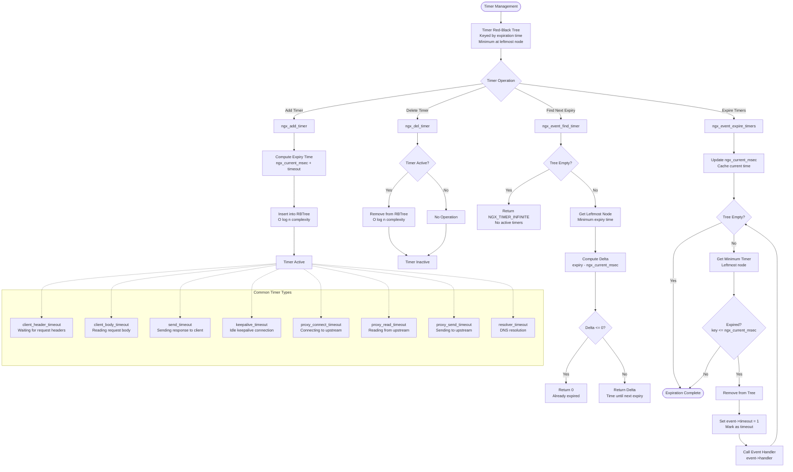

**Timer Management Details**:

- **Red-Black Tree**: Self-balancing binary search tree maintains O(log n) insertion, deletion, and search. Minimum element (next expiration) always at leftmost node enables O(1) retrieval.

- **Time Caching**: ngx_current_msec caches current time updated once per event loop iteration or timer expiration. Avoids expensive gettimeofday system calls for each timer check.

- **Timer Precision**: Millisecond precision sufficient for network timeouts. Configuration directives accept seconds but store as milliseconds internally.

- **Timer Coalescing**: Multiple events may expire in single iteration. Expiration loop processes all expired timers before returning to main event loop.

- **Timeout Event Handler**: Event handlers check `event->timeout` flag distinguishing timeout from normal I/O completion. Timeouts typically trigger error responses or connection closure.

## 4.4 HTTP Protocol Flows

### 4.4.1 HTTP/1.x Request Lifecycle

The complete HTTP/1.x request processing flow from connection initialization through response transmission. This expands upon the foundational flowchart in Section 2.7.1 with implementation details.

```mermaid
flowchart TD
    Start([Connection Established]) --> HTTPInitConn[ngx_http_init_connection<br/>src/http/ngx_http_request.c]
    
    HTTPInitConn --> DetermineServerConf[Determine Server Configuration<br/>From listening address]
    
    DetermineServerConf --> AllocHTTPConn[Allocate HTTP Connection Context<br/>From connection pool]
    
    AllocHTTPConn --> SetWaitHandler[Set Read Handler:<br/>ngx_http_wait_request_handler]
    
    SetWaitHandler --> AddHeaderTimeout[Add Timer:<br/>client_header_timeout]
    
    AddHeaderTimeout --> CheckProxyProtocol{PROXY Protocol Enabled?}
    CheckProxyProtocol -->|Yes| ParseProxyProtocol[Parse PROXY Protocol Header<br/>Extract real client address]
    CheckProxyProtocol -->|No| WaitForData
    ParseProxyProtocol --> WaitForData[Wait for Request Data<br/>Event-driven read]
    
    WaitForData --> DataArrives[Read Event Triggered]
    
    DataArrives --> ReadData[Read from Socket<br/>recv into buffer]
    
    ReadData --> ReadResult{Read Result}
    ReadResult -->|Error| CloseError[Close Connection<br/>Log error]
    ReadResult -->|EOF| CloseEOF[Close Connection<br/>Premature client disconnect]
    ReadResult -->|EAGAIN| WaitForData
    
    ReadResult -->|Data| CheckHTTP2Preface{HTTP/2 Preface?<br/>PRI * HTTP/2.0...}
    CheckHTTP2Preface -->|Yes| SwitchHTTP2[Switch to HTTP/2 Handler<br/>See Section 4.4.2]
    CheckHTTP2Preface -->|No| CheckHTTP3{HTTP/3 over QUIC?}
    CheckHTTP3 -->|Yes| HandleHTTP3[Handle HTTP/3<br/>See Section 4.4.3]
    
    CheckHTTP3 -->|No| CreateRequest[Create Request<br/>ngx_http_create_request<br/>Allocate request pool]
    
    CreateRequest --> InitRequest[Initialize Request Structure<br/>Headers in/out, variables]
    
    InitRequest --> SetLineHandler[Set Read Handler:<br/>ngx_http_process_request_line]
    
    SetLineHandler --> ParseRequestLine[Parse Request Line<br/>ngx_http_parse_request_line<br/>Incremental state machine]
    
    ParseRequestLine --> LineResult{Parse Result}
    LineResult -->|NGX_AGAIN| ReadMore1[Read More Data<br/>Need more bytes]
    ReadMore1 --> WaitForData
    
    LineResult -->|NGX_ERROR| BadRequest[Return 400 Bad Request<br/>Invalid request line]
    
    LineResult -->|NGX_OK| ExtractMethod[Extract Method<br/>GET, POST, PUT, etc.]
    
    ExtractMethod --> ValidateMethod{Method Allowed?}
    ValidateMethod -->|No| MethodNotAllowed[Return 405 Method Not Allowed]
    ValidateMethod -->|Yes| ExtractURI[Extract URI and Args<br/>Parse path and query string]
    
    ExtractURI --> ValidateURI{URI Valid?}
    ValidateURI -->|Too Long| URITooLong[Return 414 URI Too Long]
    ValidateURI -->|Invalid Chars| BadRequest
    ValidateURI -->|Valid| ExtractVersion[Extract HTTP Version<br/>HTTP/1.0 or HTTP/1.1]
    
    ExtractVersion --> SetHeaderHandler[Set Read Handler:<br/>ngx_http_process_request_headers]
    
    SetHeaderHandler --> ParseHeaders[Parse Headers Loop<br/>ngx_http_parse_header_line]
    
    ParseHeaders --> HeaderResult{Parse Result}
    HeaderResult -->|NGX_AGAIN| ReadMore2[Read More Data]
    ReadMore2 --> WaitForData
    
    HeaderResult -->|NGX_ERROR| BadRequest
    HeaderResult -->|NGX_HTTP_PARSE_INVALID_HEADER| BadRequest
    
    HeaderResult -->|NGX_OK| ProcessHeader[Process Header<br/>Map to handler]
    
    ProcessHeader --> HeaderType{Header Type}
    HeaderType -->|Host| ProcessHost[Process Host Header<br/>Virtual server selection]
    HeaderType -->|Content-Length| ProcessContentLength[Process Content-Length<br/>Request body size]
    HeaderType -->|Transfer-Encoding| ProcessTransferEncoding[Check for chunked]
    HeaderType -->|Connection| ProcessConnection[Check keepalive/close]
    HeaderType -->|Expect| ProcessExpect[Handle 100-continue]
    HeaderType -->|Other| StoreHeader[Store in Headers In]
    
    ProcessHost --> ParseHeaders
    ProcessContentLength --> ParseHeaders
    ProcessTransferEncoding --> ParseHeaders
    ProcessConnection --> ParseHeaders
    ProcessExpect --> ParseHeaders
    StoreHeader --> ParseHeaders
    
    HeaderResult -->|NGX_HTTP_PARSE_HEADER_DONE| AllHeadersDone[All Headers Parsed<br/>ngx_http_process_request_header]
    
    AllHeadersDone --> ValidateHost{Host Header Present?<br/>Required for HTTP/1.1}
    ValidateHost -->|No| BadRequest
    ValidateHost -->|Yes| FindVirtualServer[Find Virtual Server<br/>Match Host against server_name]
    
    FindVirtualServer --> FindLocation[Find Location Block<br/>Match URI against locations<br/>Exact > Prefix > Regex]
    
    FindLocation --> CheckRequestBody{Request Body Expected?<br/>Content-Length > 0 or chunked}
    CheckRequestBody -->|Yes| ReadBody[Read Request Body<br/>ngx_http_read_client_request_body<br/>May use temp file for large bodies]
    CheckRequestBody -->|No| StartProcessing
    ReadBody --> StartProcessing[Start Request Processing<br/>ngx_http_handler]
    
    StartProcessing --> InitPhaseIndex[Initialize phase_handler Index<br/>Start at phase 0]
    
    InitPhaseIndex --> SetWriteHandler[Set Write Event Handler:<br/>ngx_http_core_run_phases]
    
    SetWriteHandler --> RunPhases[Execute Phase Engine<br/>ngx_http_core_run_phases<br/>See Section 4.4.4]
    
    RunPhases --> PhaseComplete{Phase Result}
    PhaseComplete -->|NGX_OK| NextPhase[Continue to Next Phase]
    PhaseComplete -->|NGX_DECLINED| NextHandler[Try Next Handler in Phase]
    PhaseComplete -->|NGX_AGAIN<br/>NGX_DONE| Suspend[Suspend Processing<br/>Resume on event]
    PhaseComplete -->|NGX_ERROR| InternalError[Return 500 Internal Server Error]
    PhaseComplete -->|Status Code| FinalizeRequest
    
    NextPhase --> PhaseCheck{More Phases?}
    PhaseCheck -->|Yes| RunPhases
    PhaseCheck -->|No| ContentGenerated[Content Generated]
    NextHandler --> RunPhases
    
    ContentGenerated --> FilterHeaders[Header Filter Chain<br/>ngx_http_top_header_filter]
    
    FilterHeaders --> SendHeaders[Send Response Headers<br/>Format HTTP response]
    
    SendHeaders --> FilterBody[Body Filter Chain<br/>ngx_http_top_body_filter]
    
    FilterBody --> SendBody[Send Response Body<br/>ngx_http_write_filter]
    
    SendBody --> WriteResult{Write Complete?}
    WriteResult -->|NGX_AGAIN| WaitWritable[Wait for Socket Writable<br/>Add write event]
    WaitWritable --> SendBody
    WriteResult -->|NGX_ERROR| CloseError
    WriteResult -->|NGX_OK| FinalizeRequest[Finalize Request<br/>ngx_http_finalize_request]
    
    FinalizeRequest --> LogRequest[Log Request<br/>ngx_http_log_request<br/>Access log entry]
    
    LogRequest --> CloseRequest[Close Request<br/>ngx_http_close_request<br/>Destroy request pool]
    
    CloseRequest --> CheckKeepalive{Keepalive?<br/>Connection: keep-alive}
    CheckKeepalive -->|Yes| SetKeepalive[Set Keepalive State<br/>ngx_http_set_keepalive]
    CheckKeepalive -->|No| CheckLingering{Lingering Close?<br/>Request body not fully read}
    
    SetKeepalive --> KeepaliveTimeout[Add Keepalive Timeout<br/>keepalive_timeout]
    KeepaliveTimeout --> CheckKeepaliveCount{Keepalive Count Exceeded?<br/>keepalive_requests}
    CheckKeepaliveCount -->|Yes| CloseConnection
    CheckKeepaliveCount -->|No| ResetParser[Reset Parser State<br/>Reuse connection]
    ResetParser --> WaitForData
    
    CheckLingering -->|Yes| LingeringClose[Lingering Close<br/>ngx_http_set_lingering_close<br/>Read and discard remaining data]
    CheckLingering -->|No| CloseConnection[Close Connection<br/>ngx_http_close_connection]
    LingeringClose --> CloseConnection
    
    CloseConnection --> FreeConnection[Free Connection Structure<br/>Return to pool]
    FreeConnection --> End([Connection Closed])
    
    BadRequest --> FinalizeRequest
    MethodNotAllowed --> FinalizeRequest
    URITooLong --> FinalizeRequest
    InternalError --> FinalizeRequest
    CloseError --> End
    CloseEOF --> End
    Suspend -.-> WaitForData
    SwitchHTTP2 -.-> End
    HandleHTTP3 -.-> End
```

**HTTP/1.x Processing Details**:

- **Incremental Parsing**: State machines process bytes as they arrive, enabling non-blocking operation. Parser maintains state across multiple read events.

- **Virtual Server Selection**: Host header matching against server_name directives with priority: exact match > left wildcard (*.example.com) > right wildcard (www.example.*) > regex. Default server selected if no match.

- **Location Matching**: URI matched against location blocks with priority: exact match (=) > longest prefix match (^~) > regex match (~, ~*) > prefix match. Internal locations (@name) accessible only via internal redirects.

- **Request Body Handling**: Small bodies buffer in memory. Large bodies (exceeding client_body_buffer_size) write to temporary files. Thread pools may handle blocking file operations.

- **Keepalive Management**: Reuses connection for multiple requests. Limits: keepalive_timeout (idle time), keepalive_requests (max requests per connection). Resets parser but preserves connection pool and SSL session.

- **Lingering Close**: Reads and discards remaining request body before closing connection, preventing TCP RST and ensuring clean shutdown. Configured via lingering_close (on/off/always) and lingering_timeout.

### 4.4.2 HTTP/2 Frame Processing and Stream Multiplexing

HTTP/2 implements binary frame-based multiplexing over single TCP connection. This flow details frame processing and stream lifecycle.

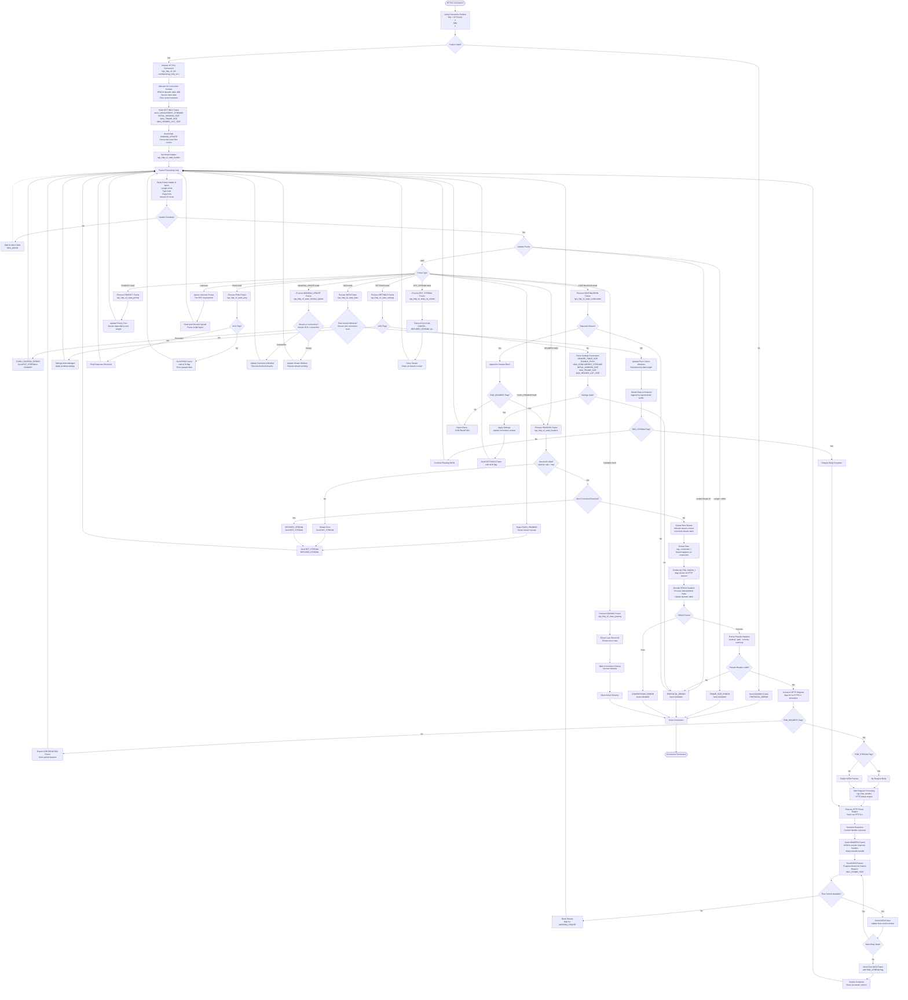

**HTTP/2 Implementation Details**:

- **HPACK Compression**: Dynamic table (default 4KB) stores frequently used headers. Static table (61 entries) contains common HTTP headers. Huffman encoding reduces header size further. Compression context shared across all streams on connection.

- **Flow Control**: Two-level flow control prevents fast sender overwhelming slow receiver. Connection-level window applies to all streams. Per-stream window controls individual stream. WINDOW_UPDATE frames increment windows. Default initial window: 65,535 bytes.

- **Stream Multiplexing**: Multiple concurrent streams (default limit: unlimited, configurable via http2_max_concurrent_streams). Stream IDs: client-initiated odd, server-initiated even. Streams independent; loss on one doesn't block others at HTTP/2 layer (TCP still has head-of-line blocking).

- **Priority and Dependencies**: Streams form dependency tree with weights (1-256). Scheduler allocates bandwidth proportionally based on weights. Exclusive flag restructures tree. NGINX implements weighted fair queuing scheduler.

- **Frame Size Limits**: Maximum frame size negotiated via SETTINGS (default 16KB, max 16MB). Large payloads fragment across multiple frames. Receivers must accept frames up to MAX_FRAME_SIZE.

- **Error Handling**: Stream errors send RST_STREAM closing individual stream. Connection errors send GOAWAY closing entire connection. Error codes indicate reason (PROTOCOL_ERROR, FLOW_CONTROL_ERROR, etc.).

### 4.4.3 HTTP/3 and QUIC Connection Flow

HTTP/3 builds on QUIC transport, providing encrypted multiplexed HTTP over UDP.

```mermaid
flowchart TD
    Start([UDP Datagram Received]) --> QUICInput[QUIC Input Handler<br/>ngx_quic_input_handler<br/>src/event/quic/ngx_event_quic.c]
    
    QUICInput --> ParsePacketHeader[Parse QUIC Packet Header<br/>Long header: Initial/0-RTT/Handshake<br/>Short header: 1-RTT]
    
    ParsePacketHeader --> HeaderType{Header Type}
    
    HeaderType -->|Initial| ParseInitial[Parse Initial Packet<br/>Extract DCID, SCID, version<br/>Token, packet number]
    
    ParseInitial --> CheckVersion{Supported Version?}
    CheckVersion -->|No| SendVersionNegotiation[Send Version Negotiation<br/>List supported versions]
    SendVersionNegotiation --> End([Packet Processed])
    
    CheckVersion -->|Yes| LookupConnection{Connection Exists?<br/>Lookup by DCID}
    
    LookupConnection -->|No| CreateConnection[Create QUIC Connection<br/>ngx_quic_new_connection]
    
    CreateConnection --> ValidateToken{Address Validation Token?}
    ValidateToken -->|Invalid/None| SendRetry[Send Retry Packet<br/>Include address token<br/>Force client validation]
    SendRetry --> End
    
    ValidateToken -->|Valid| AllocQUICContext[Allocate QUIC Context<br/>Connection IDs<br/>Crypto contexts<br/>Stream management]
    
    AllocQUICContext --> InitTLSHandshake[Initialize TLS 1.3 Handshake<br/>OpenSSL integration<br/>Extract ClientHello]
    
    InitTLSHandshake --> ProcessCryptoFrame[Process CRYPTO Frame<br/>TLS handshake messages]
    
    ProcessCryptoFrame --> TLSResult{TLS Result}
    TLSResult -->|Need More| SendCrypto[Send CRYPTO Frame<br/>ServerHello, Certificate, etc.<br/>in Initial or Handshake packets]
    SendCrypto --> End
    
    TLSResult -->|Error| SendConnectionClose[Send CONNECTION_CLOSE Frame<br/>Crypto error code]
    SendConnectionClose --> End
    
    TLSResult -->|Success| DeriveKeys[Derive QUIC Keys<br/>Initial, Handshake, Application<br/>Per TLS 1.3 key schedule]
    
    DeriveKeys --> SendHandshakeDone[Send HANDSHAKE_DONE Frame<br/>Confirm handshake completion]
    
    SendHandshakeDone --> EstablishStreams[Establish Control Streams<br/>HTTP/3 SETTINGS stream]
    
    EstablishStreams --> ConnectionEstablished[QUIC Connection Established<br/>Ready for HTTP/3]
    
    LookupConnection -->|Yes| GetConnection[Get Existing Connection]
    
    GetConnection --> DecryptPacket[Decrypt Packet<br/>Use appropriate encryption level<br/>Initial/Handshake/Application]
    
    DecryptPacket --> DecryptResult{Decrypt Success?}
    DecryptResult -->|No| DiscardPacket[Discard Packet<br/>Log decryption failure]
    DiscardPacket --> End
    
    DecryptResult -->|Yes| VerifyPacketNumber[Verify Packet Number<br/>Check for replay<br/>Update largest received]
    
    VerifyPacketNumber --> ParseFrames[Parse QUIC Frames<br/>Multiple frames per packet]
    
    ParseFrames --> FrameType{Frame Type}
    
    FrameType -->|CRYPTO| ProcessCryptoFrame
    
    FrameType -->|STREAM| ProcessStreamFrame[Process STREAM Frame<br/>ngx_quic_stream_handler]
    
    ProcessStreamFrame --> ExtractStreamID[Extract Stream ID<br/>0x00-0x03: type selector<br/>Client/Server, Bidi/Uni]
    
    ExtractStreamID --> FindStream{Stream Exists?}
    FindStream -->|No| CreateStream[Create QUIC Stream<br/>Check stream limits]
    FindStream -->|Yes| GetStream[Get Existing Stream]
    
    CreateStream --> CheckStreamType{Stream Type?}
    GetStream --> CheckStreamType
    
    CheckStreamType -->|Control Stream| ProcessControl[Process Control Stream<br/>HTTP/3 SETTINGS, GOAWAY]
    CheckStreamType -->|QPACK Encoder| ProcessQPACKEnc[Process QPACK Encoder Stream<br/>Dynamic table updates]
    CheckStreamType -->|QPACK Decoder| ProcessQPACKDec[Process QPACK Decoder Stream<br/>Acknowledgments]
    CheckStreamType -->|Request Stream| ProcessRequest[Process Request Stream<br/>Bidirectional, client-initiated]
    
    ProcessControl --> ParseH3Frame[Parse HTTP/3 Frame<br/>HEADERS, DATA, SETTINGS<br/>GOAWAY, CANCEL_PUSH]
    
    ProcessRequest --> ParseH3Frame
    
    ParseH3Frame --> H3FrameType{HTTP/3 Frame Type}
    
    H3FrameType -->|HEADERS| DecodeQPACK[Decode QPACK Headers<br/>Static table + dynamic table<br/>Encoder/decoder streams]
    
    DecodeQPACK --> QPACKResult{QPACK Result}
    QPACKResult -->|Blocked| WaitDynamicTable[Wait for Dynamic Table Updates<br/>Blocked by encoder stream]
    WaitDynamicTable --> End
    
    QPACKResult -->|Error| SendH3Error[Send H3_QPACK_DECOMPRESSION_FAILED]
    SendH3Error --> CloseStream[Close Stream<br/>STOP_SENDING + RESET_STREAM]
    CloseStream --> End
    
    QPACKResult -->|Success| ExtractHeaders[Extract HTTP Headers<br/>:method, :path, :scheme, :authority<br/>Regular headers]
    
    ExtractHeaders --> CreateH3Request[Create HTTP/3 Request<br/>Map to ngx_http_request_t]
    
    CreateH3Request --> H3PhaseEngine[Execute HTTP Phase Engine<br/>Same as HTTP/1.x and HTTP/2]
    
    H3FrameType -->|DATA| DeliverData[Deliver Request Body Data<br/>Append to request body buffer]
    
    DeliverData --> CheckFin{FIN Flag?}
    CheckFin -->|Yes| BodyComplete[Request Body Complete]
    CheckFin -->|No| MoreDataExpected[More DATA Frames Expected]
    BodyComplete --> H3PhaseEngine
    MoreDataExpected --> End
    
    H3FrameType -->|SETTINGS| ParseSettings[Parse HTTP/3 SETTINGS<br/>QPACK_MAX_TABLE_CAPACITY<br/>MAX_FIELD_SECTION_SIZE<br/>QPACK_BLOCKED_STREAMS]
    ParseSettings --> StoreSettings[Store Settings<br/>Apply to connection]
    StoreSettings --> End
    
    H3PhaseEngine --> GenerateH3Response[Generate HTTP/3 Response]
    
    GenerateH3Response --> EncodeQPACKHeaders[Encode Response Headers<br/>QPACK compression]
    
    EncodeQPACKHeaders --> SendHeadersFrame[Send HTTP/3 HEADERS Frame<br/>On request stream]
    
    SendHeadersFrame --> SendDataFrames[Send HTTP/3 DATA Frames<br/>Fragment body]
    
    SendDataFrames --> FlowControlCheck{QUIC Flow Control OK?<br/>Stream and connection level}
    FlowControlCheck -->|No| BlockSending[Block Sending<br/>Wait for MAX_STREAM_DATA]
    FlowControlCheck -->|Yes| SendStreamData[Send STREAM Frames<br/>Encapsulated DATA]
    
    SendStreamData --> UpdateFlowControl[Update Flow Control State<br/>Decrement available window]
    
    UpdateFlowControl --> MoreBody{More Response Body?}
    MoreBody -->|Yes| SendDataFrames
    MoreBody -->|No| SendFin[Send STREAM Frame with FIN<br/>Close sending direction]
    
    SendFin --> StreamComplete[HTTP/3 Stream Complete]
    StreamComplete --> End
    
    FrameType -->|ACK| ProcessACK[Process ACK Frame<br/>Update packet tracking<br/>Detect lost packets]
    
    ProcessACK --> UpdateRTT[Update RTT Estimate<br/>Smoothed RTT, RTT variance]
    
    UpdateRTT --> DetectLoss[Loss Detection<br/>Packet threshold: 3 packets later ACKed<br/>Time threshold: PTO timer]
    
    DetectLoss --> LostPackets{Packets Lost?}
    LostPackets -->|Yes| MarkLost[Mark Packets Lost<br/>Trigger retransmission]
    MarkLost --> RetransmitFrames[Retransmit CRYPTO/STREAM Frames<br/>In new packets]
    RetransmitFrames --> CongestionControl[Update Congestion Control<br/>Reduce congestion window<br/>NewReno or CUBIC]
    CongestionControl --> End
    
    LostPackets -->|No| End
    
    FrameType -->|PADDING| IgnorePadding[Ignore PADDING<br/>Used for packet size]
    IgnorePadding --> End
    
    FrameType -->|PING| SendPingResponse[Send PING in Response<br/>Path validation]
    SendPingResponse --> End
    
    FrameType -->|CONNECTION_CLOSE| ProcessConnClose[Process CONNECTION_CLOSE<br/>Extract error code]
    ProcessConnClose --> CloseConnection[Close QUIC Connection<br/>Clean up all streams]
    CloseConnection --> End
    
    FrameType -->|PATH_CHALLENGE| ProcessPathChallenge[Process PATH_CHALLENGE<br/>Connection migration validation]
    ProcessPathChallenge --> SendPathResponse[Send PATH_RESPONSE<br/>Echo challenge data]
    SendPathResponse --> UpdateActivePath[Update Active Path<br/>If validation succeeds]
    UpdateActivePath --> End
    
    FrameType -->|PATH_RESPONSE| ValidatePath[Validate PATH_RESPONSE<br/>Match challenge data]
    ValidatePath --> PathValidated[Mark Path Validated<br/>Can migrate connection]
    PathValidated --> End
    
    FrameType -->|NEW_CONNECTION_ID| AddConnectionID[Add Connection ID<br/>Store for potential use]
    AddConnectionID --> End
    
    FrameType -->|RETIRE_CONNECTION_ID| RetireConnectionID[Retire Connection ID<br/>Remove from active set]
    RetireConnectionID --> End
    
    FrameType -->|MAX_DATA| UpdateConnMaxData[Update Connection MAX_DATA<br/>Increase connection flow window]
    UpdateConnMaxData --> End
    
    FrameType -->|MAX_STREAM_DATA| UpdateStreamMaxData[Update Stream MAX_STREAM_DATA<br/>Increase stream flow window]
    UpdateStreamMaxData --> End
    
    FrameType -->|MAX_STREAMS| UpdateMaxStreams[Update MAX_STREAMS<br/>Can open more streams]
    UpdateMaxStreams --> End
    
    FrameType -->|STOP_SENDING| ProcessStopSending[Process STOP_SENDING<br/>Peer doesn't want data]
    ProcessStopSending --> ResetStream[Reset Stream Sending<br/>Send RESET_STREAM]
    ResetStream --> End
    
    FrameType -->|RESET_STREAM| ProcessResetStream[Process RESET_STREAM<br/>Peer cancelled stream]
    ProcessResetStream --> CloseStream
    
    HeaderType -->|0-RTT| ParseZeroRTT[Parse 0-RTT Packet<br/>Early application data]
    ParseZeroRTT --> CheckZeroRTTAllowed{0-RTT Allowed?<br/>Session resumption}
    CheckZeroRTTAllowed -->|No| RejectZeroRTT[Reject 0-RTT Data<br/>Wait for handshake]
    CheckZeroRTTAllowed -->|Yes| Process0RTTData[Process 0-RTT Data<br/>Decrypt with 0-RTT keys]
    Process0RTTData --> ParseFrames
    RejectZeroRTT --> End
    
    HeaderType -->|Handshake| ParseHandshake[Parse Handshake Packet<br/>TLS messages]
    ParseHandshake --> GetConnection
    
    HeaderType -->|Short Header<br/>1-RTT| ParseOneRTT[Parse 1-RTT Packet<br/>Application data]
    ParseOneRTT --> GetConnection
    
    ConnectionEstablished --> ActiveConnection[Active QUIC/HTTP3 Connection]
    ActiveConnection -.-> End
    BlockSending --> End
    ProcessQPACKEnc --> End
    ProcessQPACKDec --> End
```

**QUIC and HTTP/3 Details**:

- **Connection IDs**: QUIC connections identified by connection IDs (CID) instead of 4-tuple (IP, port). Enables connection migration across network changes (WiFi to cellular). Server assigns CIDs; client can request new CIDs via NEW_CONNECTION_ID frames.

- **Encryption Levels**: Four encryption levels: Initial (derived from version and DCID), 0-RTT (from previous session), Handshake (from TLS handshake), Application (from TLS finished). Packets encrypted at appropriate level based on handshake state.

- **Loss Recovery**: QUIC implements its own loss detection and recovery independent of TCP. ACK frames with ACK ranges report received packets. Loss detection triggers after packet threshold (3) or time threshold (PTO). Retransmission occurs in new packets with new packet numbers.

- **Congestion Control**: Pluggable congestion control algorithms. NGINX implements NewReno by default. Congestion window increases on ACKs, decreases on loss. Pacing prevents burst transmission.

- **Flow Control**: Two-level like HTTP/2 but at QUIC layer. MAX_DATA for connection-level, MAX_STREAM_DATA for stream-level. Separate limits for bidirectional and unidirectional streams. MAX_STREAMS limits stream creation.

- **QPACK Compression**: HTTP/3 header compression addressing HTTP/2's HPACK head-of-line blocking. Dynamic table updates sent on separate encoder stream. Decoder sends acknowledgments on decoder stream. Static table same as HTTP/2.

- **HTTP/3 Frames**: Variable-length type/length/value encoding. Frame types: HEADERS (0x01), DATA (0x00), SETTINGS (0x04), GOAWAY (0x07), CANCEL_PUSH (0x03), PUSH_PROMISE (0x05), MAX_PUSH_ID (0x0d).

- **Control Streams**: Each endpoint opens unidirectional control stream (type 0x00) as first frame. SETTINGS frame must be first on control stream. Used for connection-level communications.

### 4.4.4 HTTP Phase Engine Execution

The phase-based request processing engine provides ordered execution of handlers. This flow expands on the content phase from Section 2.7.1.

```mermaid
flowchart TD
    Start([Phase Engine Entry<br/>ngx_http_core_run_phases]) --> GetPhase[Get Current Phase Handler<br/>r->phase_handler index]
    
    GetPhase --> PhaseType{Phase Type}
    
    PhaseType -->|POST_READ_PHASE| PostRead[Post Read Phase<br/>Early request processing]
    PostRead --> PostReadHandlers{Handlers Installed?}
    PostReadHandlers -->|Yes| CallRealIP[F-057: ngx_http_realip_module<br/>Extract real client IP<br/>X-Forwarded-For, X-Real-IP]
    PostReadHandlers -->|No| NextPhase1
    CallRealIP --> HandlerResult1{Handler Result}
    
    PhaseType -->|SERVER_REWRITE_PHASE| ServerRewrite[Server Rewrite Phase<br/>Server-level URL manipulation]
    ServerRewrite --> ServerRewriteHandlers{Handlers Installed?}
    ServerRewriteHandlers -->|Yes| CallServerRewrite[F-070: ngx_http_rewrite_module<br/>Execute rewrite rules<br/>server context]
    ServerRewriteHandlers -->|No| NextPhase2
    CallServerRewrite --> CheckRewrite{Rewrite Occurred?}
    CheckRewrite -->|Yes| ResetPhase[Reset to POST_READ<br/>Re-process with new URI]
    CheckRewrite -->|No| HandlerResult2
    ResetPhase --> GetPhase
    
    PhaseType -->|FIND_CONFIG_PHASE| FindConfig[Find Config Phase<br/>Location matching]
    FindConfig --> MatchLocation[Match URI Against Locations<br/>Exact = > Prefix ^~ ><br/>Regex ~* ~ > Prefix]
    MatchLocation --> LocationFound[Update Request Configuration<br/>Apply location context]
    LocationFound --> NextPhase3[Next Phase<br/>NGX_OK automatic]
    
    PhaseType -->|REWRITE_PHASE| Rewrite[Rewrite Phase<br/>Location-level URL manipulation]
    Rewrite --> RewriteHandlers{Handlers Installed?}
    RewriteHandlers -->|Yes| CallLocationRewrite[F-070: ngx_http_rewrite_module<br/>Execute rewrite rules<br/>location context]
    RewriteHandlers -->|No| NextPhase4
    CallLocationRewrite --> CheckLocationRewrite{Rewrite Occurred?}
    CheckLocationRewrite -->|Yes| ResetToFindConfig[Reset to FIND_CONFIG<br/>Find new location]
    CheckLocationRewrite -->|No| HandlerResult3
    ResetToFindConfig --> GetPhase
    
    PhaseType -->|POST_REWRITE_PHASE| PostRewrite[Post Rewrite Phase<br/>After rewrite processing]
    PostRewrite --> CheckRewriteCount{Rewrite Count > 10?}
    CheckRewriteCount -->|Yes| RewriteError[Return 500 Internal Server Error<br/>Rewrite loop detected]
    CheckRewriteCount -->|No| NextPhase5[Next Phase<br/>NGX_OK automatic]
    
    PhaseType -->|PREACCESS_PHASE| PreAccess[Pre-Access Phase<br/>Before access control]
    PreAccess --> PreAccessHandlers{Handlers Installed?}
    PreAccessHandlers -->|Yes| CallLimitReq[F-054: ngx_http_limit_req_module<br/>Check rate limits]
    PreAccessHandlers -->|No| NextPhase6
    CallLimitReq --> RateLimit{Rate Limit Exceeded?}
    RateLimit -->|Yes| CheckBurst{Burst Allowed?}
    CheckBurst -->|Yes, Delay| DelayRequest[Delay Request<br/>Queue until token available]
    CheckBurst -->|No| Return503Rate[Return 503 Service Unavailable<br/>Rate limit exceeded]
    RateLimit -->|No| CallLimitConn
    DelayRequest --> CallLimitConn[F-055: ngx_http_limit_conn_module<br/>Check connection limits]
    CallLimitConn --> ConnLimit{Connection Limit Exceeded?}
    ConnLimit -->|Yes| Return503Conn[Return 503 Service Unavailable<br/>Connection limit exceeded]
    ConnLimit -->|No| HandlerResult4
    
    PhaseType -->|ACCESS_PHASE| Access[Access Phase<br/>Access control and authentication]
    Access --> AccessHandlers{Handlers Installed?}
    AccessHandlers -->|Yes| CallAccessModule[F-053: ngx_http_access_module<br/>IP-based allow/deny]
    AccessHandlers -->|No| NextPhase7
    CallAccessModule --> IPAllowed{IP Allowed?}
    IPAllowed -->|No| DeniedAccess[Access Denied<br/>Store deny flag]
    IPAllowed -->|Yes| CallAuthBasic
    DeniedAccess --> CallAuthBasic[F-051: ngx_http_auth_basic_module<br/>HTTP Basic Authentication]
    CallAuthBasic --> AuthRequired{Auth Required?}
    AuthRequired -->|Yes| CheckAuthHeader{Authorization Header?}
    CheckAuthHeader -->|No| Return401[Return 401 Unauthorized<br/>WWW-Authenticate header]
    CheckAuthHeader -->|Yes| ValidateCredentials[Validate Credentials<br/>Against password file]
    ValidateCredentials --> CredentialsValid{Valid Credentials?}
    CredentialsValid -->|No| Return401
    CredentialsValid -->|Yes| CallAuthRequest
    AuthRequired -->|No| CallAuthRequest[F-052: ngx_http_auth_request_module<br/>Subrequest authentication]
    CallAuthRequest --> AuthRequestConfigured{auth_request Configured?}
    AuthRequestConfigured -->|Yes| CreateSubrequest[Create Subrequest<br/>To auth_request URI]
    CreateSubrequest --> WaitSubrequest[Wait for Subrequest<br/>NGX_AGAIN]
    WaitSubrequest --> SubrequestResult{Subrequest Status}
    SubrequestResult -->|2xx| AuthSuccess[Authentication Success]
    SubrequestResult -->|Other| Return401Auth[Return 401/403<br/>Authentication failed]
    AuthRequestConfigured -->|No| HandlerResult5
    AuthSuccess --> HandlerResult5
    
    PhaseType -->|POST_ACCESS_PHASE| PostAccess[Post Access Phase<br/>After access control]
    PostAccess --> CheckSatisfy{satisfy Directive}
    CheckSatisfy -->|all| CheckAllSatisfied{All Requirements Met?}
    CheckAllSatisfied -->|No| Return403[Return 403 Forbidden<br/>Access denied]
    CheckAllSatisfied -->|Yes| NextPhase8
    CheckSatisfy -->|any| CheckAnySatisfied{Any Requirement Met?}
    CheckAnySatisfied -->|No| Return403
    CheckAnySatisfied -->|Yes| NextPhase8
    
    PhaseType -->|PRECONTENT_PHASE| PreContent[Pre-Content Phase<br/>Before content generation]
    PreContent --> PreContentHandlers{Handlers Installed?}
    PreContentHandlers -->|Yes| CallTryFiles[F-006: ngx_http_try_files_module<br/>Try multiple file locations]
    PreContentHandlers -->|No| NextPhase9
    CallTryFiles --> TryFilesResult{File Found?}
    TryFilesResult -->|Yes| InternalRedirect[Internal Redirect<br/>Reset to FIND_CONFIG]
    TryFilesResult -->|No| CheckFallback{Fallback URI?}
    CheckFallback -->|Yes| InternalRedirect
    CheckFallback -->|No| HandlerResult6
    InternalRedirect --> GetPhase
    
    PhaseType -->|CONTENT_PHASE| Content[Content Phase<br/>Response generation]
    Content --> ContentHandlers{Content Handler?}
    ContentHandlers -->|Static| StaticContent[F-001: ngx_http_static_module<br/>Serve file from disk]
    ContentHandlers -->|Index| IndexContent[F-004: ngx_http_index_module<br/>Check index files]
    ContentHandlers -->|Autoindex| AutoindexContent[F-003: ngx_http_autoindex_module<br/>Generate directory listing]
    ContentHandlers -->|Proxy| ProxyContent[F-020: ngx_http_proxy_module<br/>See Section 4.5]
    ContentHandlers -->|FastCGI| FastCGIContent[F-021: ngx_http_fastcgi_module<br/>Proxy to FastCGI backend]
    ContentHandlers -->|uWSGI| uWSGIContent[F-022: ngx_http_uwsgi_module<br/>Proxy to uWSGI backend]
    ContentHandlers -->|SCGI| SCGIContent[F-023: ngx_http_scgi_module<br/>Proxy to SCGI backend]
    ContentHandlers -->|gRPC| gRPCContent[F-024: ngx_http_grpc_module<br/>Proxy to gRPC backend]
    ContentHandlers -->|Memcached| MemcachedContent[F-025: ngx_http_memcached_module<br/>Lookup in Memcached]
    ContentHandlers -->|None| NextContentHandler
    
    StaticContent --> ContentResult
    IndexContent --> ContentResult
    AutoindexContent --> ContentResult
    ProxyContent --> ContentResult
    FastCGIContent --> ContentResult
    uWSGIContent --> ContentResult
    SCGIContent --> ContentResult
    gRPCContent --> ContentResult
    MemcachedContent --> ContentResult
    NextContentHandler --> HandlerResult7
    
    PhaseType -->|LOG_PHASE| Log[Log Phase<br/>Request logging]
    Log --> LogHandlers{Log Handlers?}
    LogHandlers -->|Yes| CallLogModule[F-090: ngx_http_log_module<br/>Write access log]
    LogHandlers -->|No| Complete
    CallLogModule --> Complete[Phase Processing Complete]
    
    HandlerResult1 --> CheckResult1{Result}
    HandlerResult2 --> CheckResult1
    HandlerResult3 --> CheckResult1
    HandlerResult4 --> CheckResult1
    HandlerResult5 --> CheckResult1
    HandlerResult6 --> CheckResult1
    HandlerResult7 --> CheckResult1
    ContentResult --> CheckResult1
    
    CheckResult1 -->|NGX_OK| NextPhase1[Advance to Next Phase<br/>Increment phase_handler]
    CheckResult1 -->|NGX_DECLINED| NextHandler[Next Handler in Phase<br/>Try next registered handler]
    CheckResult1 -->|NGX_AGAIN<br/>NGX_DONE| Suspend[Suspend Phase Engine<br/>Resume on event]
    CheckResult1 -->|Status Code| FinalizeWithStatus[Finalize Request<br/>Generate error response]
    CheckResult1 -->|NGX_ERROR| InternalError[Return 500 Internal Server Error]
    
    NextPhase1 --> GetPhase
    NextPhase2 --> GetPhase
    NextPhase3 --> GetPhase
    NextPhase4 --> GetPhase
    NextPhase5 --> GetPhase
    NextPhase6 --> GetPhase
    NextPhase7 --> GetPhase
    NextPhase8 --> GetPhase
    NextPhase9 --> GetPhase
    NextHandler --> GetPhase
    
    Suspend --> End([Processing Suspended])
    FinalizeWithStatus --> End
    InternalError --> End
    Complete --> End
    RewriteError --> End
    Return503Rate --> End
    Return503Conn --> End
    Return401 --> End
    Return401Auth --> End
    Return403 --> End
```

**Phase Engine Details**:

- **Phase Order**: Fixed phase sequence ensures consistent request processing. Phases execute in order; handlers within phases execute until one succeeds or all decline.

- **Phase Types**:
  - **Checker Phases**: All handlers execute (POST_READ, SERVER_REWRITE, REWRITE, PREACCESS, ACCESS, LOG). Handlers return NGX_OK to continue or error to abort.
  - **Finder Phase**: FIND_CONFIG executes automatically without handlers.
  - **Handler Phases**: First successful handler stops phase (CONTENT). Handlers return NGX_DECLINED to try next.

- **Rewrite Processing**: Rewrite phase can reset processing to earlier phases (FIND_CONFIG or POST_READ) after URL modification. Loop detection (10 iterations) prevents infinite rewrites.

- **Access Control**: Supports satisfy any (OR logic) or satisfy all (AND logic) for combining multiple access requirements. Denied access stored as flag checked in POST_ACCESS phase.

- **Content Phase**: Only one content handler executes per request. Handler selection based on location configuration priority. Default handler (ngx_http_static_module) serves files if no explicit handler configured.

- **Subrequests**: auth_request and other modules create subrequests executing their own phase engine. Parent request suspends (NGX_AGAIN) until subrequest completes.

- **Return Values**:
  - **NGX_OK**: Handler succeeded, continue to next phase
  - **NGX_DECLINED**: Handler passed, try next handler in phase
  - **NGX_AGAIN** / **NGX_DONE**: Async operation pending, suspend processing
  - **Status Code** (4xx, 5xx): Generate error response
  - **NGX_ERROR**: Internal error, return 500

## 4.5 Upstream and Load Balancing Flows

### 4.5.1 Upstream Request and Load Balancer Selection

The upstream framework manages connections to backend servers with load balancing and failover.

```mermaid
flowchart TD
    Start([Upstream Request<br/>proxy_pass directive]) --> UpstreamInit[Initialize Upstream<br/>ngx_http_upstream_init<br/>src/http/ngx_http_upstream.c]
    
    UpstreamInit --> AllocUpstream[Allocate Upstream Structure<br/>From request pool]
    
    AllocUpstream --> CheckCache{Cache Enabled?<br/>proxy_cache directive}
    CheckCache -->|Yes| CacheLookup[Cache Lookup<br/>See Section 2.7.3 and 4.6]
    CheckCache -->|No| ResolveUpstream
    
    CacheLookup --> CacheResult{Cache Result}
    CacheResult -->|Hit| ServeFromCache[Serve from Cache<br/>Skip upstream]
    CacheResult -->|Miss/Stale| ResolveUpstream[Resolve Upstream<br/>ngx_http_upstream_init_request]
    
    ResolveUpstream --> CheckResolution{Upstream Requires DNS?<br/>Domain name vs IP}
    CheckResolution -->|Yes| StartResolve[Start DNS Resolution<br/>ngx_resolve_name<br/>Async resolver]
    StartResolve --> ResolvePending[Resolution Pending<br/>NGX_AGAIN]
    ResolvePending --> ResolveResult{Resolution Result}
    ResolveResult -->|Error| UpstreamError[Upstream Resolution Failed<br/>Return 502 Bad Gateway]
    ResolveResult -->|Success| UpdatePeers[Update Upstream Peers<br/>IP addresses from DNS]
    UpdatePeers --> SelectPeer
    
    CheckResolution -->|No| SelectPeer[Select Upstream Peer<br/>ngx_http_upstream_get_peer]
    
    SelectPeer --> LoadBalancer{Load Balancing Algorithm}
    
    LoadBalancer -->|Round Robin<br/>F-030| RoundRobin[ngx_http_upstream_get_round_robin_peer<br/>Smooth weighted selection]
    LoadBalancer -->|Least Conn<br/>F-031| LeastConn[ngx_http_upstream_get_least_conn_peer<br/>Minimum active connections]
    LoadBalancer -->|IP Hash<br/>F-032| IPHash[ngx_http_upstream_get_ip_hash_peer<br/>Hash client IP]
    LoadBalancer -->|Hash<br/>F-033| GenericHash[ngx_http_upstream_get_hash_peer<br/>Hash custom key]
    LoadBalancer -->|Random<br/>F-034| Random[ngx_http_upstream_get_random_peer<br/>Random selection, optional two-choice]
    
    RoundRobin --> ComputeWeights[Compute Current Weights<br/>current_weight += effective_weight<br/>Select max current_weight<br/>Subtract total_weight from selected]
    ComputeWeights --> CheckAvailable
    
    LeastConn --> FindMinConn[Find Peer with Min Connections<br/>Weighted by server weight]
    FindMinConn --> CheckAvailable
    
    IPHash --> ComputeIPHash[Hash Client IP<br/>CRC32 of first 3 octets IPv4<br/>or full IPv6 address]
    ComputeIPHash --> MapToServer[Map Hash to Server Index<br/>Modulo number of servers]
    MapToServer --> CheckAvailable
    
    GenericHash --> ComputeKeyHash[Hash Configured Key<br/>Variables: $uri, $arg_*, etc.<br/>CRC32 or MurmurHash2]
    ComputeKeyHash --> ConsistentHash{Consistent Hashing?}
    ConsistentHash -->|Yes| ConsistentMap[Map to Consistent Hash Ring<br/>Minimal disruption on server changes]
    ConsistentHash -->|No| SimpleMap[Simple Modulo Mapping]
    ConsistentMap --> CheckAvailable
    SimpleMap --> CheckAvailable
    
    Random --> GenerateRandom[Generate Random Number]
    GenerateRandom --> TwoChoice{Two-Choice Enabled?}
    TwoChoice -->|Yes| SelectTwo[Select Two Random Servers<br/>Choose one with fewer connections]
    TwoChoice -->|No| SelectRandom[Select Single Random Server<br/>Weighted by server weight]
    SelectTwo --> CheckAvailable
    SelectRandom --> CheckAvailable[Check Server Available]
    
    CheckAvailable --> ServerStatus{Server Status}
    ServerStatus -->|Down| CheckBackup{Backup Servers Available?}
    CheckBackup -->|Yes| SelectBackup[Select from Backup Servers<br/>Apply same algorithm]
    CheckBackup -->|No| AllFailed[All Servers Failed<br/>Return 502 Bad Gateway]
    SelectBackup --> CreateConnection
    
    ServerStatus -->|Failed Recently| CheckMaxFails{Attempts < max_fails?}
    CheckMaxFails -->|No| CheckFailTimeout{Within fail_timeout?}
    CheckFailTimeout -->|Yes| ServerStatus
    CheckFailTimeout -->|No| ResetFails[Reset Fail Count<br/>Try server again]
    ResetFails --> CreateConnection
    CheckMaxFails -->|Yes| TryPeer[Mark Peer for Try]
    
    ServerStatus -->|Available| TryPeer
    TryPeer --> CreateConnection[Create Upstream Connection<br/>ngx_http_upstream_connect]
    
    CreateConnection --> CheckKeepalive{Keepalive Pool Available?<br/>upstream keepalive}
    CheckKeepalive -->|Yes| GetKeepalive[Get Connection from Pool<br/>Reuse existing connection]
    CheckKeepalive -->|No| OpenSocket[Open TCP Socket<br/>socket with O_NONBLOCK]
    
    GetKeepalive --> ValidateKeepalive{Connection Valid?}
    ValidateKeepalive -->|No| CloseStale[Close Stale Connection]
    CloseStale --> OpenSocket
    ValidateKeepalive -->|Yes| ReuseConnection[Reuse Keepalive Connection]
    
    OpenSocket --> SetSocketOptions[Set Socket Options<br/>TCP_NODELAY<br/>Socket buffers]
    
    SetSocketOptions --> BindSource{Source Address Configured?<br/>proxy_bind}
    BindSource -->|Yes| BindSocket[Bind to Source Address<br/>bind system call]
    BindSource -->|No| ConnectSocket
    BindSocket --> ConnectSocket[Connect to Upstream<br/>connect non-blocking]
    
    ConnectSocket --> ConnectResult{Connect Result}
    ConnectResult -->|EINPROGRESS| AddConnectTimer[Add Connect Timeout<br/>proxy_connect_timeout]
    ConnectResult -->|Error| ConnectError[Connection Error<br/>Mark server failed]
    ConnectResult -->|Success| Connected
    
    AddConnectTimer --> WaitConnect[Wait for Connection<br/>Write event ready]
    WaitConnect --> CheckConnectError{Socket Error?<br/>getsockopt SO_ERROR}
    CheckConnectError -->|Yes| ConnectError
    CheckConnectError -->|No| Connected[Connection Established]
    
    ConnectError --> IncrementFails[Increment Fail Count<br/>Check max_fails threshold]
    IncrementFails --> CheckNext{Next Peer Available?<br/>proxy_next_upstream}
    CheckNext -->|Yes| FreePeer[Free Current Peer]
    FreePeer --> SelectPeer
    CheckNext -->|No| AllFailed
    
    Connected --> SetHandlers[Set Event Handlers<br/>Write: ngx_http_upstream_send_request_handler<br/>Read: ngx_http_upstream_process_header]
    
    SetHandlers --> SendRequest[Send Request to Upstream<br/>See Section 4.5.2]
    
    ReuseConnection --> SetHandlers
    
    ServeFromCache --> End([Request Complete])
    AllFailed --> End
    UpstreamError --> End
    SendRequest -.-> End
```

**Load Balancing Algorithm Details**:

- **Round Robin (F-030)**: Smooth weighted algorithm avoids burst behavior. Each server has current_weight starting at 0. Each selection: `current_weight += effective_weight`, select server with max current_weight, subtract total_weight from selected server's current_weight. Achieves proportional distribution over time.

- **Least Connections (F-031)**: Tracks active connections per server in shared memory (upstream zone). Selects server with minimum connections weighted by configured weight. Optimal for variable request processing times.

- **IP Hash (F-032)**: Computes CRC32 hash of client IP address (first 3 octets for IPv4, full address for IPv6). Maps hash to server index via modulo. Provides session affinity without cookies. Fails over to next server if primary unavailable.

- **Generic Hash (F-033)**: Hashes arbitrary key (URI, cookie, header, etc.) using CRC32 or MurmurHash2. Supports consistent hashing reducing redistribution when servers added/removed. Configurable via `hash $variable [consistent];`

- **Random (F-034)**: Simple random selection weighted by server weight. Two-choice variant selects two random servers, chooses one with fewer active connections. Stateless and simple.

- **Upstream Zones**: Shared memory zones (`zone` directive) enable sharing upstream configuration across workers including DNS updates, health status, connection counts, and runtime reconfiguration (NGINX Plus).

### 4.5.2 Upstream Request Transmission and Response Processing

After establishing connection, NGINX forwards request and processes response.

```mermaid
flowchart TD
    Start([Connection Established]) --> PrepareRequest[Prepare Upstream Request<br/>ngx_http_upstream_send_request]
    
    PrepareRequest --> BuildRequestLine[Build Request Line<br/>Method, URI, HTTP version]
    
    BuildRequestLine --> BuildHeaders[Build Request Headers<br/>proxy_set_header directives]
    
    BuildHeaders --> AddDefaultHeaders[Add Default Headers<br/>Host, Connection, Content-Length]
    
    AddDefaultHeaders --> ModifyHeaders{Header Modifications?<br/>proxy_set_header, proxy_pass_header}
    ModifyHeaders -->|Yes| ApplyModifications[Apply Header Changes<br/>Add, remove, or modify]
    ModifyHeaders -->|No| CheckRequestBody
    ApplyModifications --> CheckRequestBody{Request Body?<br/>POST, PUT data}
    
    CheckRequestBody -->|Yes| IncludeBody[Include Request Body<br/>From client or temp file]
    CheckRequestBody -->|No| SendHeaders
    IncludeBody --> SendHeaders[Send Headers to Upstream<br/>writev or multiple send calls]
    
    SendHeaders --> SendResult{Send Complete?}
    SendResult -->|EAGAIN| WaitWritable[Wait for Socket Writable<br/>Add write event]
    WaitWritable --> SendHeaders
    SendResult -->|Error| SendError[Send Error<br/>Connection broken]
    SendResult -->|Complete| CheckBodySend{Request Body Sent?}
    
    CheckBodySend -->|No| SendBody[Send Request Body<br/>In chunks if large]
    CheckBodySend -->|Yes| RequestSent
    SendBody --> BodySendResult{Send Result}
    BodySendResult -->|EAGAIN| WaitBodyWritable[Wait Writable]
    WaitBodyWritable --> SendBody
    BodySendResult -->|Error| SendError
    BodySendResult -->|Complete| RequestSent[Request Fully Sent]
    
    RequestSent --> AddSendTimer[Add Send Timeout Timer<br/>proxy_send_timeout]
    
    AddSendTimer --> SetReadHandler[Set Read Handler<br/>Wait for upstream response]
    
    SetReadHandler --> WaitResponse[Wait for Response Data<br/>Read event]
    
    WaitResponse --> ReadResponse[Read Response from Upstream<br/>recv into buffer]
    
    ReadResponse --> ReadResult{Read Result}
    ReadResult -->|EAGAIN| AddReadTimer[Add Read Timeout<br/>proxy_read_timeout]
    AddReadTimer --> WaitResponse
    ReadResult -->|EOF| CheckHeadersParsed{Headers Parsed?}
    ReadResult -->|Error| ReadError[Read Error<br/>Upstream connection error]
    
    ReadResult -->|Data| ParseResponseLine[Parse Response Status Line<br/>HTTP/1.x response parser]
    
    ParseResponseLine --> LineResult{Parse Result}
    LineResult -->|NGX_AGAIN| NeedMoreData[Need More Data]
    NeedMoreData --> WaitResponse
    LineResult -->|Error| InvalidResponse[Invalid Response<br/>Return 502 Bad Gateway]
    LineResult -->|Success| ExtractStatus[Extract Status Code<br/>200, 301, 404, 500, etc.]
    
    ExtractStatus --> ParseResponseHeaders[Parse Response Headers<br/>Incremental parser]
    
    ParseResponseHeaders --> HeaderResult{Header Parse Result}
    HeaderResult -->|NGX_AGAIN| NeedMoreData
    HeaderResult -->|Error| InvalidResponse
    HeaderResult -->|Header Line| ProcessResponseHeader[Process Response Header]
    
    ProcessResponseHeader --> HeaderName{Header Name}
    HeaderName -->|Content-Length| StoreContentLength[Store Content-Length<br/>Body size]
    HeaderName -->|Transfer-Encoding| CheckChunked[Check for chunked]
    HeaderName -->|Connection| StoreConnection[Store Connection Header<br/>close vs keep-alive]
    HeaderName -->|Set-Cookie| CheckCookieRewrite{Cookie Rewrite?<br/>proxy_cookie_domain/path}
    HeaderName -->|Other| StoreResponseHeader[Store Response Header]
    
    StoreContentLength --> ParseResponseHeaders
    CheckChunked --> ParseResponseHeaders
    StoreConnection --> ParseResponseHeaders
    CheckCookieRewrite -->|Yes| RewriteCookie[Rewrite Cookie Attributes<br/>Domain and path]
    CheckCookieRewrite -->|No| StoreResponseHeader
    RewriteCookie --> ParseResponseHeaders
    StoreResponseHeader --> ParseResponseHeaders
    
    HeaderResult -->|Headers Complete| AllHeadersParsed[All Response Headers Parsed<br/>ngx_http_upstream_process_headers]
    
    AllHeadersParsed --> CheckStatus{Response Status}
    CheckStatus -->|401/407| CheckAuth{Auth Configured?}
    CheckAuth -->|Yes| HandleAuth[Handle Authentication<br/>Pass to client]
    CheckAuth -->|No| PassToClient
    HandleAuth --> PassToClient
    
    CheckStatus -->|301/302| CheckRedirect{Handle Redirects?<br/>proxy_redirect}
    CheckRedirect -->|Yes| RewriteLocation[Rewrite Location Header<br/>Translate upstream to client URLs]
    CheckRedirect -->|No| PassToClient
    RewriteLocation --> PassToClient[Pass Response to Client]
    
    CheckStatus -->|304| HandleNotModified[Handle Not Modified<br/>Update cache if revalidation]
    HandleNotModified --> PassToClient
    
    CheckStatus -->|5xx/404| CheckInterceptErrors{intercept_errors Configured?}
    CheckInterceptErrors -->|Yes| UseErrorPage[Use error_page Directive<br/>Custom error handling]
    CheckInterceptErrors -->|No| CheckNextUpstream{proxy_next_upstream?<br/>Try next server}
    CheckNextUpstream -->|Yes, Conditions Met| TryNextServer[Try Next Upstream Server<br/>Return to Section 4.5.1]
    CheckNextUpstream -->|No| PassToClient
    UseErrorPage --> PassToClient
    
    CheckStatus -->|2xx/3xx| PassToClient
    
    PassToClient --> CheckCacheable{Response Cacheable?<br/>Cache-Control, Status Code}
    CheckCacheable -->|Yes| InitiateCacheStore[Initiate Cache Storage<br/>See Section 4.6.2]
    CheckCacheable -->|No| SkipCache[Skip Cache Storage]
    
    InitiateCacheStore --> DetermineBuffering
    SkipCache --> DetermineBuffering{Buffering Strategy}
    
    DetermineBuffering -->|Buffered<br/>Default| BufferedMode[Buffered Mode<br/>proxy_buffering on]
    DetermineBuffering -->|Unbuffered<br/>proxy_buffering off| UnbufferedMode[Unbuffered Mode<br/>Direct proxy]
    DetermineBuffering -->|Upgraded<br/>WebSocket| UpgradedMode[Upgraded Connection<br/>Bidirectional proxy]
    
    BufferedMode --> AllocBuffers[Allocate Proxy Buffers<br/>proxy_buffers directive]
    AllocBuffers --> ReadBodyBuffered[Read Response Body<br/>Fill buffers]
    ReadBodyBuffered --> BufferFull{Buffers Full?}
    BufferFull -->|Yes| UseTempFile[Use Temporary File<br/>proxy_max_temp_file_size]
    BufferFull -->|No| SendToClient1
    UseTempFile --> WriteTemp[Write to Temp File]
    WriteTemp --> ReadBodyBuffered
    
    ReadBodyBuffered --> BodyComplete1{Body Complete?}
    BodyComplete1 -->|No| ReadBodyBuffered
    BodyComplete1 -->|Yes| SendToClient1[Send Complete Response to Client<br/>Headers and body]
    
    UnbufferedMode --> SendHeadersToClient[Send Response Headers to Client<br/>Immediately]
    SendHeadersToClient --> ReadBodyUnbuffered[Read Response Body Chunk]
    ReadBodyUnbuffered --> SendChunkToClient[Send Chunk to Client<br/>Immediately]
    SendChunkToClient --> BodyComplete2{Body Complete?}
    BodyComplete2 -->|No| ReadBodyUnbuffered
    BodyComplete2 -->|Yes| ResponseComplete
    
    UpgradedMode --> EstablishBidirectional[Establish Bidirectional Proxy<br/>Client ↔ Upstream]
    EstablishBidirectional --> ProxyBothDirections[Proxy Data Both Directions<br/>Until either side closes]
    ProxyBothDirections --> WebSocketClosed[Connection Closed]
    WebSocketClosed --> ResponseComplete
    
    SendToClient1 --> FilterResponse[Apply Response Filters<br/>gzip, headers, etc.]
    FilterResponse --> ResponseComplete[Response Complete<br/>ngx_http_upstream_finalize_request]
    
    ResponseComplete --> CheckUpstreamKeepalive{Upstream Keepalive?<br/>upstream keepalive module}
    CheckUpstreamKeepalive -->|Yes| ReturnToPool[Return Connection to Pool<br/>Reuse for future requests]
    CheckUpstreamKeepalive -->|No| CloseUpstream[Close Upstream Connection]
    
    ReturnToPool --> LogUpstream[Log Upstream Metrics<br/>Response time, status, bytes]
    CloseUpstream --> LogUpstream
    
    LogUpstream --> FinalizeRequest[Finalize HTTP Request<br/>Complete client request]
    
    SendError --> MarkFailed[Mark Upstream Server Failed]
    ReadError --> MarkFailed
    InvalidResponse --> MarkFailed
    MarkFailed --> TryNextServer
    
    CheckHeadersParsed -->|Yes| HandleEarlyEOF[Handle Early EOF<br/>Incomplete response]
    CheckHeadersParsed -->|No| InvalidResponse
    HandleEarlyEOF --> MarkFailed
    
    FinalizeRequest --> End([Upstream Request Complete])
    TryNextServer -.-> End
```

**Upstream Response Processing Details**:

- **Header Modifications**: `proxy_set_header` adds/modifies headers sent to upstream. Default headers: `Host $proxy_host`, `Connection close`, `X-Real-IP`, `X-Forwarded-For`. Clear default with `proxy_set_header Host $host;`

- **Response Buffering**: Buffered mode (default) reads entire response before sending to client, protecting slow clients from slow backends. Unbuffered mode (`proxy_buffering off`) streams response immediately. Buffer sizes: `proxy_buffers`, `proxy_buffer_size`.

- **Temporary Files**: When response exceeds buffer size, overflow writes to temporary file (proxy_temp_path). File operations may use thread pools. Size limits: `proxy_max_temp_file_size`.

- **Cookie Rewriting**: `proxy_cookie_domain` and `proxy_cookie_path` translate Set-Cookie domains and paths between upstream and client addressing.

- **Error Handling**: `proxy_next_upstream` conditions determine retry: `error`, `timeout`, `invalid_header`, `http_500`, `http_502`, `http_503`, `http_504`, `http_403`, `http_404`, `non_idempotent`. Non-idempotent methods (POST, LOCK, PATCH) skip retry by default unless explicitly configured.

- **Upstream Keepalive**: `upstream keepalive` directive configures connection pool per upstream block. Connections reused across requests reducing connection establishment overhead. Pool size: `keepalive N;`, timeout: `keepalive_timeout`.

- **Response Caching**: Cacheable responses store in file cache. Cache storage runs concurrently with client transmission. Cache lock prevents multiple simultaneous upstream requests for identical content.

- **WebSocket Upgrade**: `Upgrade` and `Connection` headers trigger upgraded connection mode establishing bidirectional proxy pipe.

## 4.6 Caching Workflows

### 4.6.1 Cache Lookup and Decision Flow

Cache lookup determines whether to serve from cache or fetch from upstream. This expands upon Section 2.7.3 with additional implementation details.

```mermaid
flowchart TD
    Start([Upstream Request Initiated]) --> CheckCacheEnabled{Cache Enabled?<br/>proxy_cache directive}
    
    CheckCacheEnabled -->|No| ProceedUpstream[Proceed to Upstream<br/>No caching]
    
    CheckCacheEnabled -->|Yes| CheckBypass{Check Bypass Conditions<br/>proxy_cache_bypass}
    
    CheckBypass --> EvaluateBypass[Evaluate Bypass Variables<br/>$arg_nocache, $cookie_nocache, etc.]
    
    EvaluateBypass --> BypassResult{Any Bypass Variable True?}
    BypassResult -->|Yes| ProceedUpstream
    BypassResult -->|No| CheckMethods{HTTP Method Cacheable?<br/>proxy_cache_methods}
    
    CheckMethods -->|No| ProceedUpstream
    CheckMethods -->|Yes| ComputeCacheKey[Compute Cache Key<br/>proxy_cache_key directive<br/>Default: $scheme$proxy_host$request_uri]
    
    ComputeCacheKey --> HashKey[MD5 Hash of Cache Key<br/>16-byte hash value]
    
    HashKey --> LockupMetadata[Lookup in Shared Memory<br/>Red-Black Tree by hash]
    
    LockupMetadata --> MetadataFound{Cache Entry Found?}
    
    MetadataFound -->|No| CheckCacheLock{Cache Lock Enabled?<br/>proxy_cache_lock on}
    
    CheckCacheLock -->|No| ProceedUpstream
    CheckCacheLock -->|Yes| TryAcquireLock{Try Acquire Lock<br/>First request for key}
    
    TryAcquireLock -->|Success| SetLockFlag[Set Lock Flag<br/>Mark as lock holder]
    TryAcquireLock -->|Failed| LockHeld[Lock Held by Another Request]
    
    SetLockFlag --> ProceedUpstream
    
    LockHeld --> WaitForLock[Wait for Lock Release<br/>Suspend request]
    WaitForLock --> CheckLockTimeout{Lock Timeout?<br/>proxy_cache_lock_timeout}
    CheckLockTimeout -->|Yes| LockTimeout[Lock Timeout Expired]
    CheckLockTimeout -->|No| LockReleased{Lock Released?}
    LockReleased -->|No| WaitForLock
    LockReleased -->|Yes| LockupMetadata
    
    LockTimeout --> CheckLockAge{Cache Lock Age?<br/>proxy_cache_lock_age}
    CheckLockAge -->|Exceeded| ProceedUpstream
    CheckLockAge -->|Not Exceeded| WaitForLock
    
    MetadataFound -->|Yes| GetMetadata[Get Cache Metadata<br/>Timestamps, validity, size]
    
    GetMetadata --> CheckValid{Cache Entry Valid?}
    
    CheckValid --> ComputeExpiry[Compute Expiry Time<br/>Created + TTL]
    ComputeExpiry --> CheckExpired{Expired?<br/>current_time > expiry}
    
    CheckExpired -->|Yes| CheckStaleAllowed{Stale Allowed?<br/>proxy_cache_use_stale}
    
    CheckStaleAllowed -->|updating| CheckUpdating{Being Updated?<br/>Lock held for same key}
    CheckUpdating -->|Yes| ServeStale[Serve Stale Content<br/>While update in progress]
    CheckUpdating -->|No| CheckOtherConditions
    
    CheckStaleAllowed -->|error| CheckUpstreamError{Upstream Error?}
    CheckUpstreamError -->|Yes| ServeStale
    CheckUpstreamError -->|No| CheckOtherConditions
    
    CheckStaleAllowed -->|timeout| CheckUpstreamTimeout{Upstream Timeout?}
    CheckUpstreamTimeout -->|Yes| ServeStale
    CheckUpstreamTimeout -->|No| CheckOtherConditions
    
    CheckStaleAllowed -->|http_500| CheckUpstream500{Upstream 500?}
    CheckUpstream500 -->|Yes| ServeStale
    CheckUpstream500 -->|No| CheckOtherConditions
    
    CheckStaleAllowed -->|http_502| CheckUpstream502{Upstream 502?}
    CheckUpstream502 -->|Yes| ServeStale
    CheckUpstream502 -->|No| CheckOtherConditions
    
    CheckStaleAllowed -->|http_503| CheckUpstream503{Upstream 503?}
    CheckUpstream503 -->|Yes| ServeStale
    CheckUpstream503 -->|No| CheckOtherConditions
    
    CheckStaleAllowed -->|http_504| CheckUpstream504{Upstream 504?}
    CheckUpstream504 -->|Yes| ServeStale
    CheckUpstream504 -->|No| CheckOtherConditions
    
    CheckStaleAllowed -->|http_403| CheckUpstream403{Upstream 403?}
    CheckUpstream403 -->|Yes| ServeStale
    CheckUpstream403 -->|No| CheckOtherConditions
    
    CheckStaleAllowed -->|http_404| CheckUpstream404{Upstream 404?}
    CheckUpstream404 -->|Yes| ServeStale
    CheckUpstream404 -->|No| CheckOtherConditions
    
    CheckStaleAllowed -->|http_429| CheckUpstream429{Upstream 429?}
    CheckUpstream429 -->|Yes| ServeStale
    CheckUpstream429 -->|No| CheckOtherConditions
    
    CheckOtherConditions --> CheckRevalidate{Revalidation Allowed?<br/>proxy_cache_revalidate}
    CheckRevalidate -->|Yes| PrepareConditional[Prepare Conditional Request<br/>If-Modified-Since, If-None-Match]
    CheckRevalidate -->|No| FetchFresh[Fetch Fresh Content<br/>Standard upstream request]
    
    PrepareConditional --> SendConditional[Send Conditional Request to Upstream<br/>Include validators]
    
    SendConditional --> ConditionalResponse{Upstream Response}
    ConditionalResponse -->|304 Not Modified| UpdateCacheMetadata[Update Cache Metadata<br/>Extend TTL, mark validated]
    ConditionalResponse -->|200 OK| UpdateCacheContent[Update Cache with New Content<br/>Replace cached file]
    ConditionalResponse -->|Other| HandleResponse[Handle Response<br/>According to status]
    
    UpdateCacheMetadata --> ServeCached[Serve Cached Content<br/>With updated metadata]
    UpdateCacheContent --> StoreNewContent[Store New Content<br/>See Section 4.6.2]
    
    CheckExpired -->|No| CheckMinFresh{Check min-fresh Requirement<br/>From request Cache-Control}
    CheckMinFresh -->|Not Fresh Enough| FetchFresh
    CheckMinFresh -->|Fresh| ServeCached
    
    ServeCached --> OpenCacheFile[Open Cache File<br/>Read from disk]
    
    OpenCacheFile --> FileResult{File Open Result}
    FileResult -->|Error| CacheFileError[Cache File Error<br/>Metadata/file mismatch]
    FileResult -->|Success| ReadCacheHeader[Read Cache Header<br/>Stored headers and metadata]
    
    CacheFileError --> FetchFresh
    
    ReadCacheHeader --> ValidateHeader{Header Valid?}
    ValidateHeader -->|No| CacheCorrupt[Cache Corruption Detected]
    ValidateHeader -->|Yes| AddCacheHeaders[Add Cache Status Headers<br/>X-Cache-Status, Age]
    
    CacheCorrupt --> RemoveCorrupt[Remove Corrupt Entry<br/>Delete from metadata and disk]
    RemoveCorrupt --> FetchFresh
    
    AddCacheHeaders --> ComputeAge[Compute Age Header<br/>current_time - created_time]
    ComputeAge --> SendCachedHeaders[Send Cached Response Headers<br/>To client]
    
    SendCachedHeaders --> SendCachedBody[Send Cached Response Body<br/>sendfile from cache file]
    
    SendCachedBody --> CacheHit[Cache Hit Complete<br/>Log hit status]
    
    ServeStale --> AddWarning[Add Warning Header<br/>110 Response is Stale]
    AddWarning --> OpenCacheFile
    
    ProceedUpstream --> CacheMiss[Cache Miss<br/>Proceed to upstream request]
    FetchFresh --> CacheMiss
    HandleResponse --> CacheMiss
    
    CacheMiss --> End([Continue to Upstream Processing])
    CacheHit --> End
    StoreNewContent -.-> End
```

**Cache Lookup Implementation Details**:

- **Cache Key**: Computed via `proxy_cache_key` directive. Default: `$scheme$proxy_host$request_uri`. Supports variables: `$host`, `$request_uri`, `$args`, custom headers, cookies. MD5 hash creates 128-bit key.

- **Metadata Storage**: Shared memory red-black tree indexes cache entries by key hash. Metadata includes: creation time, last validation time, TTL, cache file path, headers size, body size, HTTP status, validators (Last-Modified, ETag).

- **Cache Locking**: Prevents thundering herd when multiple requests arrive for uncached content. First request acquires lock and fetches from upstream. Subsequent requests wait for lock release (with timeout), then serve from newly populated cache.

- **Stale Content**: `proxy_cache_use_stale` directive controls stale serving conditions: `updating`, `error`, `timeout`, `invalid_header`, `http_*` status codes. Enables continued service during upstream issues.

- **Revalidation**: Conditional requests to upstream using If-Modified-Since (Last-Modified) or If-None-Match (ETag) validators. 304 response updates cache metadata and extends TTL without fetching body.

- **Cache Bypassing**: `proxy_cache_bypass` evaluates variables. If any non-empty and non-zero, bypass cache. Example: `proxy_cache_bypass $cookie_nocache $arg_nocache;`

### 4.6.2 Cache Storage Flow

Cache storage writes upstream responses to disk with shared memory coordination.

# 5. System Architecture

## 5.1 High-Level Architecture

### 5.1.1 System Overview

#### 5.1.1.1 Architectural Style and Rationale

NGINX implements a **multi-process, event-driven, non-blocking I/O architecture** that fundamentally differs from traditional thread-per-connection or process-per-connection web server models. This architectural approach delivers exceptional performance characteristics for handling thousands of concurrent connections with minimal resource consumption.

**Event-Driven Processing Model**: The core architecture centers on an event loop running within each worker process. Unlike blocking I/O models where threads wait on network operations, NGINX's event loop registers interest in I/O readiness with the operating system's event notification mechanism (epoll on Linux, kqueue on FreeBSD/macOS, IOCP on Windows) and processes other events while waiting. This approach eliminates context switching overhead and enables a single worker process to handle thousands of concurrent connections simultaneously.

**Multi-Process Concurrency**: The master-worker process architecture separates control plane operations (configuration management, worker lifecycle) from data plane operations (request processing, proxying). The master process operates with elevated privileges for binding to low-numbered ports and spawning workers, while worker processes handle all client traffic with reduced privileges. This separation provides failure isolation—a crashed worker affects only its connections while other workers continue serving traffic and the master automatically respawns failed workers.

**Custom Event Loop Implementation**: Rather than depending on external event loop libraries (libevent, libev, libuv), NGINX implements its own event abstraction layer in `src/event/`. This design decision provides complete control over performance characteristics, enables platform-specific optimizations, and eliminates external dependencies. Platform drivers in `src/event/modules/` implement optimal I/O mechanisms for each supported operating system.

**State Machine Processing**: Request and connection lifecycles are implemented as explicit state machines that maintain context across event callbacks. When an I/O operation returns EAGAIN (would block), the state machine registers the next state handler with the event loop and yields control. This approach avoids stack-based state preservation and enables efficient memory utilization through pool-based allocation.

**Zero-Copy Optimization**: The architecture minimizes memory copy operations through buffer chain abstractions that reference file regions or memory segments without duplication. System calls like sendfile() enable kernel-space file transmission directly to network sockets, eliminating user-space buffering entirely. This zero-copy approach, implemented throughout `src/core/ngx_buf.c` and output filter chains, delivers optimal throughput for static content and cached responses.

#### 5.1.1.2 Key Architectural Principles

**1. Configuration-Driven Behavior**: All functionality derives from declarative configuration rather than code modifications. The configuration parser in `src/core/ngx_conf_file.c` processes hierarchical contexts (main, events, http, server, location, stream, mail) during master process initialization, building in-memory structures that workers inherit via fork(). This immutable configuration approach enables hot reload via SIGHUP signal without dropping connections.

**2. Modular Composition**: The module system in `src/core/ngx_module.c` enables feature composition at compile time (static modules) and runtime (dynamic modules). Each module defines an `ngx_module_t` structure specifying its type, configuration contexts, directive handlers, and lifecycle callbacks. Over 50 HTTP modules in `src/http/modules/` provide content generation, proxying, compression, security, and load balancing capabilities. Static modules compile directly into the binary with zero runtime overhead, while dynamic modules load via dlopen() with module signature verification ensuring ABI compatibility.

**3. Pool-Based Memory Management**: Request-scoped and connection-scoped memory pools (`src/core/ngx_palloc.c`) eliminate malloc/free overhead through bulk allocation from large contiguous blocks. Pools support cleanup handler registration for automatic resource release (file descriptors, locks, upstream connections) on pool destruction, ensuring proper cleanup even during abnormal termination. Shared memory segments managed by the slab allocator (`src/core/ngx_slab.c`) enable inter-process coordination for caches, rate limiting zones, and SSL session storage.

**4. Platform Abstraction with Optimization**: The operating system abstraction layer in `src/os/` provides unified interfaces while preserving platform-specific optimizations. Linux deployments leverage epoll, sendfile(), TCP_DEFER_ACCEPT, SO_REUSEPORT, and native AIO. FreeBSD/macOS deployments utilize kqueue, optimized sendfile() with headers/trailers, and accept filters. This abstraction strategy enables portable code without sacrificing performance on well-supported platforms.

**5. Asynchronous Everything**: All potentially blocking operations use non-blocking I/O with event notification. File I/O operations that might block on disk access utilize thread pools (`src/core/ngx_thread_pool.c`) or native AIO (`src/os/unix/ngx_linux_aio_read.c`) to prevent event loop stalls. DNS resolution uses the asynchronous resolver (`src/core/ngx_resolver.c`). This comprehensive asynchronous approach ensures predictable latency characteristics under load.

#### 5.1.1.3 System Boundaries and Major Interfaces

**Client-Facing Boundaries**:
- **HTTP/1.x Interface**: TCP connections on configured ports (default 80/443) accepting HTTP/1.0 and HTTP/1.1 requests with keepalive support
- **HTTP/2 Interface**: TLS-encrypted connections with ALPN negotiation selecting h2 protocol, supporting binary framing and stream multiplexing
- **HTTP/3 Interface**: UDP connections on configured ports with QUIC transport and HTTP/3 framing
- **TCP/UDP Stream Interface**: Generic Layer 4 connections for non-HTTP protocols (databases, mail, custom protocols)
- **Mail Protocol Interface**: SMTP, IMAP, and POP3 connections with authentication delegation

**Upstream-Facing Boundaries**:
- **Backend HTTP Servers**: Proxy module establishes HTTP/1.x connections to application servers, supporting keepalive connection pooling
- **FastCGI Application Servers**: FastCGI binary protocol communication with PHP-FPM, Python, Ruby runtimes
- **uWSGI/SCGI Servers**: Alternative application server protocols for Python and other frameworks
- **gRPC Services**: HTTP/2-based RPC proxying with protocol buffer message forwarding
- **Memcached Servers**: Native memcached protocol for cache retrieval
- **Generic TCP/UDP Backends**: Stream proxying to any TCP or UDP service

**Management and Observability Interfaces**:
- **Configuration Files**: Text-based declarative configuration in `nginx.conf` and included files
- **Signal Interface**: POSIX signals for operational commands (SIGHUP reload, SIGQUIT graceful shutdown, SIGUSR1 log reopen, SIGUSR2 binary upgrade)
- **Logging Interface**: Configurable access and error logging to files or syslog
- **Status Endpoints**: HTTP stub_status module exposing runtime metrics
- **Health Check Interface**: Active and passive health checking for upstream servers

**Inter-Process Communication**:
- **Shared Memory**: mmap-based shared memory zones for cache metadata, rate limit counters, upstream server lists
- **UNIX Domain Sockets**: Inter-worker communication via socket pairs with SCM_RIGHTS for descriptor passing
- **Notification Channels**: eventfd (Linux) or pipe-based signaling for cross-worker coordination

### 5.1.2 Core Components

| Component Name | Primary Responsibility | Key Dependencies | Integration Points | Critical Considerations |
|----------------|------------------------|------------------|-------------------|-------------------------|
| **Core Runtime** | Memory management, data structures, configuration parsing, lifecycle orchestration | POSIX APIs, platform-specific system calls | All subsystems depend on core runtime | Pool allocation must account for peak memory usage; cleanup handlers ensure resource release |
| **Event Engine** | I/O event notification, timer management, connection lifecycle | Platform event mechanisms (epoll/kqueue/IOCP), OpenSSL for TLS | HTTP/Stream/Mail subsystems register event handlers | Event queue depth and timer precision affect latency; platform driver selection impacts scalability |
| **HTTP Stack** | HTTP protocol handling, virtual server selection, phase-based processing, filter chains | Core runtime, event engine, upstream framework | Integrates with 50+ HTTP modules for features | Phase ordering determines request processing flow; filter chain ordering affects response transformation |
| **Upstream Framework** | Backend connection management, load balancing, health checking, connection pooling | Event engine, connection abstraction | Used by HTTP, Stream, and Mail proxy modules | Connection pool sizing balances reuse vs. backend load; failover strategy impacts availability |
| **Stream Subsystem** | Layer 4 TCP/UDP proxying, SSL passthrough, protocol-agnostic proxying | Event engine, upstream framework | Independent of HTTP stack with parallel module ecosystem | No protocol awareness requires careful timeout configuration; SSL preread adds handshake latency |
| **Mail Subsystem** | SMTP/IMAP/POP3 proxying, authentication delegation | Event engine, HTTP client for auth delegation | Requires external HTTP authentication backend | Authentication latency directly impacts user experience; backend selection logic critical |
| **Configuration System** | Directive parsing, context hierarchy, module registration | Core data structures (arrays, hash tables) | All modules register directives and handlers | Configuration validation prevents runtime errors; hot reload requires careful state management |
| **Shared Memory Manager** | Inter-process data coordination, slab allocation | Operating system shared memory facilities | Cache metadata, rate limiting, SSL sessions, upstream zones | Lock contention in shared zones affects performance; size limits prevent memory exhaustion |

### 5.1.3 Data Flow Description

#### 5.1.3.1 Primary Data Flows Between Components

**HTTP Request Processing Flow**: Client connections accepted by worker processes enter the HTTP subsystem through `ngx_http_init_connection()` in `src/http/ngx_http_request.c`. The incremental HTTP parser (`src/http/ngx_http_parse.c`) processes request line and headers as data arrives from the network, storing parsed structures in request-scoped memory pools. After header parsing completes, virtual server selection matches the Host header against server_name hash tables, followed by location matching using prefix strings, exact matches, and regex patterns in precedence order.

The selected location's configuration determines which handler processes the request through the phase engine. The phase engine (`ngx_http_core_run_phases()`) executes registered handlers in sequence: post_read (early processing like realip), server_rewrite (URI transformations), find_config (location re-evaluation), rewrite (location-level URI changes), post_rewrite (internal redirect handling), preaccess (rate limiting, connection limiting), access (authorization checks), post_access (access decision enforcement), precontent (try_files evaluation), and content (response generation). Each phase may modify request state, trigger internal redirects, or generate responses.

Response generation produces buffer chains that flow through the filter pipeline. Header filters transform response headers (adding headers, computing content-length, setting status) before the write filter (`ngx_http_write_filter_module.c`) transmits data to the client. Body filters apply transformations (gzip compression, SSI processing, charset conversion) before output. Zero-copy optimization via sendfile() bypasses user-space buffering for static files and cached content.

**Upstream Proxy Flow**: When the content phase executes proxy_pass, the upstream framework (`src/http/ngx_http_upstream.c`) creates an upstream context and selects a backend server using the configured load balancing algorithm. Round-robin maintains per-peer weights for smooth distribution (`src/http/ngx_http_upstream_round_robin.c`). IP hash computes a hash of the client IP to ensure consistent routing. Least connections queries shared memory for connection counts across workers. Hash-based selection enables consistent hashing on arbitrary keys.

The upstream framework establishes a connection to the selected backend (or reuses a keepalive connection from the connection pool), transforms request headers according to proxy_set_header directives, and writes the request to the upstream socket. As the upstream response arrives, the response parser extracts status and headers, applies header transformations (proxy_hide_header, proxy_pass_header), and forwards body data through the filter chain to the client.

**Cache Integration Flow**: When proxy_cache enables caching, the cache subsystem (`src/http/ngx_http_file_cache.c`) computes a cache key from configured variables (typically URI and query string), hashes the key with MD5, and looks up the hash in the shared memory red-black tree. On cache hit, the cached file header verifies validity (TTL not expired, matching etag), and sendfile() transmits the cached content directly to the client.

On cache miss, cache locking prevents thundering herd by serializing upstream requests for identical keys. The first request acquires the cache lock, fetches from upstream, and writes response headers and body to a temporary file in the cache directory hierarchy (typically 2-level hierarchy like `/path/to/cache/c/29/b7f54b2df7773722d382f4809dbd029c`). After writing completes, the temporary file atomically renames to its final name, and metadata inserts into the shared memory tree. Subsequent requests queued on the cache lock now find the cached entry. The cache manager process (`ngx_cache_manager_process_cycle()`) periodically enforces size limits via LRU eviction and removes expired entries.

**Shared Memory Coordination Flow**: The master process allocates shared memory zones during `ngx_init_cycle()` using mmap() or shmget() based on platform. Each zone initializes with the slab allocator partitioning memory into size classes. Workers inherit shared memory attachments via fork(), enabling lock-free reads of immutable data.

Modifications to shared structures require exclusive access via shared memory mutexes (`ngx_shmtx` in `src/core/ngx_shmtx.c`). SSL session cache insertions acquire the zone mutex, allocate memory via the slab allocator, and insert into the red-black tree keyed by session ID. Rate limiting updates lock the zone, look up the client key in the tree, update last access time and request count using leaky bucket calculations, and release the lock. This fine-grained locking strategy minimizes contention while ensuring consistency.

#### 5.1.3.2 Integration Patterns and Protocols

**HTTP to Upstream Protocols**:
- **HTTP Proxy**: HTTP/1.x with configurable request/response header manipulation, connection keepalive pooling, and chunked encoding support
- **FastCGI**: Binary protocol encoding environment variables and request bodies according to FastCGI specification, with response parsing extracting headers from FCGI_STDOUT stream
- **uWSGI**: Packet-based protocol with 4-byte header specifying modifier, data length, and payload containing uwsgi variables
- **SCGI**: Netstring-encoded headers followed by request body, simpler alternative to FastCGI
- **gRPC**: HTTP/2 framing with protocol buffer messages, requiring http2 upstream connections and trailing header support

**TLS/SSL Integration**: The event-driven SSL integration (`src/event/ngx_event_openssl.c`) wraps OpenSSL's state machine in NGINX's event model. SSL_read() and SSL_write() operations returning SSL_ERROR_WANT_READ or SSL_ERROR_WANT_WRITE register appropriate event handlers and yield control. SSL handshake completes asynchronously across multiple event loop iterations. Session cache callbacks integrate with shared memory storage. OCSP stapling fetch uses the asynchronous HTTP client to retrieve certificate status from responders without blocking.

**DNS Resolution**: The asynchronous resolver (`src/core/ngx_resolver.c`) sends DNS queries via UDP to configured name servers, registers read events on the resolver socket, and invokes callbacks when responses arrive. Multiple simultaneous queries batch efficiently. Resolved addresses cache for configurable TTL. Upstream blocks using hostname:port specifications trigger resolution during configuration parsing and periodically refresh for dynamic upstream discovery.

**Syslog Integration**: Access and error log directives support syslog:server syntax triggering asynchronous UDP or TCP transmission to syslog servers. Log messages format according to RFC 5424 with facility, severity, and structured data fields. Non-blocking writes prevent log destination unavailability from stalling request processing.

#### 5.1.3.3 Data Transformation Points

**Request Transformation**:
- **Rewrite Module** (`src/http/modules/ngx_http_rewrite_module.c`): URI modification via rewrite directives executing during rewrite phases, supporting regex capture groups and variable substitution
- **Header Manipulation**: add_header, proxy_set_header, more_set_headers directives modify request and response headers
- **Script Engine** (`src/http/ngx_http_script.c`): Complex value evaluation supporting variable concatenation, conditionals, and transformations

**Response Transformation**:
- **Gzip Filter** (`src/http/modules/ngx_http_gzip_filter_module.c`): On-the-fly compression using zlib with configurable compression levels
- **SSI Filter** (`src/http/modules/ngx_http_ssi_filter_module.c`): Server-side include processing parsing HTML comments and executing commands
- **Sub Filter** (`src/http/modules/ngx_http_sub_filter_module.c`): String substitution in response bodies
- **Charset Filter** (`src/http/modules/ngx_http_charset_filter_module.c`): Character set conversion between encodings
- **Image Filter** (`src/http/modules/ngx_http_image_filter_module.c`): Image resizing, cropping, rotation using libgd

**Body Handling**:
- **Chunked Encoding**: Automatic chunked transfer encoding for dynamic content without known content-length
- **Range Processing** (`src/http/modules/ngx_http_range_filter_module.c`): Partial content extraction for byte-range requests
- **Buffering**: Request buffering via `client_body_buffer_size` and response buffering via `proxy_buffering` with spillover to temporary files

#### 5.1.3.4 Key Data Stores and Caches

**File-Based HTTP Cache**: Two-level directory hierarchy (configurable via levels parameter) stores cached content with MD5-hashed filenames. Cache files contain binary headers with metadata (creation time, valid_sec, etag, vary) followed by response headers and body. Shared memory zone maintains red-black tree of cache entries keyed by hash, enabling O(log N) lookup. LRU queue tracks access recency for eviction. Cache loader process scans directories during startup populating shared memory. Cache manager process enforces max_size limits and removes expired entries.

**Open File Cache**: File metadata (size, modification time, file descriptor) caches in hash table keyed by file path. Configurable via open_file_cache directive with max entries and inactive timeout. Dramatically reduces stat() system call overhead for static content serving. Directory existence information also caches preventing repeated access() calls.

**SSL Session Cache**: Stores SSL session data (session ID, negotiated parameters, master secret) in shared memory for session resumption. Implemented as red-black tree keyed by session ID with LRU eviction when capacity reached. Session tickets provide stateless alternative storing encrypted session data on clients.

**Zone Data Structures**: Shared memory zones host various data structures:
- **Rate Limit Zones**: Red-black tree keyed by client identifier storing last access time and request count
- **Connection Limit Zones**: Red-black tree tracking active connection counts per key
- **Upstream Zones**: Server lists with health status, weights, and statistics accessible across workers
- **Custom Zones**: Third-party modules allocate custom shared memory structures

### 5.1.4 External Integration Points

| System Name | Integration Type | Data Exchange Pattern | Protocol/Format | SLA Requirements |
|-------------|------------------|----------------------|----------------|------------------|
| Application Servers | Backend Proxy | Request/response with connection pooling | HTTP/1.x, HTTP/2, FastCGI, uWSGI, SCGI, gRPC | Response timeout (default 60s), connection timeout (default 60s) |
| Database Servers | Layer 4 Proxy | TCP stream forwarding | Protocol-agnostic TCP | Connection timeout configurable, no application-level timeouts |
| Authentication Services | Subrequest Delegation | HTTP subrequest with credentials | HTTP with custom headers | Auth request timeout (default 60s), cached results reduce latency |
| OCSP Responders | Certificate Validation | Asynchronous HTTP fetch | OCSP protocol over HTTP | Response cached for configured duration, stale responses acceptable |
| DNS Servers | Name Resolution | UDP/TCP queries | DNS protocol (RFC 1035) | Resolver timeout (default 30s), multiple nameservers for redundancy |
| Syslog Servers | Log Aggregation | Unidirectional log transmission | Syslog protocol (RFC 5424) | Non-blocking writes, dropped messages on unavailability |
| Mail Servers | Protocol Proxy | SMTP/IMAP/POP3 forwarding | Mail protocols with auth delegation | Authentication latency critical, connection timeout configurable |
| TLS Certificate Authorities | Certificate Chain Validation | Certificate chain verification | X.509 certificates | OCSP stapling eliminates runtime dependency |

## 5.2 Component Details

### 5.2.1 Core Runtime Components

#### 5.2.1.1 Purpose and Responsibilities

The Core Runtime (`src/core/`) provides foundational services upon which all other subsystems build. Primary responsibilities include:

- **Memory Management**: Pool allocator for request/connection lifecycles, slab allocator for shared memory, alignment-aware allocation for CPU cache optimization
- **Data Structures**: Arrays, lists, queues, red-black trees, radix trees, hash tables optimized for network server workloads
- **Configuration Infrastructure**: Hierarchical context processing, directive parsing and dispatch, module registration and initialization
- **Lifecycle Orchestration**: Master-worker process management, signal handling, graceful shutdown coordination, binary upgrade via socket inheritance
- **Connection Abstraction**: Socket management, address resolution, connection state tracking, read/write event registration
- **Utility Functions**: String manipulation, time management, regular expressions (PCRE/PCRE2 wrappers), cryptographic hashing (MD5, SHA1, CRC32, MurmurHash)

#### 5.2.1.2 Technologies and Frameworks

**Programming Language**: Pure C (C99/gnu11 standards) without external runtime dependencies. The build system (`auto/cc/`) detects compiler capabilities and sets appropriate flags for GCC, Clang, Intel ICC, Sun C, Microsoft Visual C++, and others.

**Memory Allocator**: Custom pool allocator (`ngx_palloc.c`) using bump pointer allocation from large blocks (default 16KB). Small allocations satisfy via pointer advancement; large allocations delegate to malloc(). Cleanup handler chains enable deterministic resource release.

**Data Structure Library**: All implementations in `src/core/` with algorithmic complexity guarantees:
- Arrays: O(1) indexed access, amortized O(1) append
- Red-black trees: O(log N) insert/delete/lookup with guaranteed balance
- Radix trees: O(k) where k=key length, optimal for IP address matching
- Hash tables: Pre-computed at configuration time for O(1) runtime lookup without collision handling overhead

**Synchronization Primitives**: Atomic operations via compiler intrinsics (GCC __sync_*, Clang __c11_atomic_*) or platform-specific assembly. Shared memory mutexes using atomic test-and-set with exponential backoff. Spinlocks for very short critical sections.

#### 5.2.1.3 Key Interfaces and APIs

**Memory Pool API**:
```
ngx_pool_t *ngx_create_pool(size_t size, ngx_log_t *log)
void *ngx_palloc(ngx_pool_t *pool, size_t size)
void *ngx_pcalloc(ngx_pool_t *pool, size_t size)
ngx_int_t ngx_pfree(ngx_pool_t *pool, void *p)
void ngx_destroy_pool(ngx_pool_t *pool)
ngx_pool_cleanup_t *ngx_pool_cleanup_add(ngx_pool_t *p, size_t size)
```

**Red-Black Tree API**:
```
void ngx_rbtree_insert(ngx_rbtree_t *tree, ngx_rbtree_node_t *node)
void ngx_rbtree_delete(ngx_rbtree_t *tree, ngx_rbtree_node_t *node)
ngx_rbtree_node_t *ngx_rbtree_min(ngx_rbtree_node_t *node, ngx_rbtree_node_t *sentinel)
```

**Configuration API**:
```
char *(*set_directive)(ngx_conf_t *cf, ngx_command_t *cmd, void *conf)
void *(*create_conf)(ngx_cycle_t *cycle)
char *(*init_conf)(ngx_cycle_t *cycle, void *conf)
```

**Connection API**:
```
ngx_connection_t *ngx_get_connection(ngx_socket_t s, ngx_log_t *log)
void ngx_free_connection(ngx_connection_t *c)
ngx_int_t ngx_handle_read_event(ngx_event_t *rev, ngx_uint_t flags)
ngx_int_t ngx_handle_write_event(ngx_event_t *wev, size_t lowat)
```

#### 5.2.1.4 Data Persistence Requirements

The Core Runtime itself has no persistent storage requirements. Transient data resides in:
- **Process Memory**: Memory pools for request/connection data, automatically released on pool destruction
- **Shared Memory**: Optional shared zones for inter-process coordination, managed by slab allocator
- **Configuration Files**: Text-based declarative configuration loaded during master process initialization

Lifecycle persistence strategies:
- **Per-Request**: Memory pool created at request start, destroyed at request completion (including keepalive between requests)
- **Per-Connection**: Pool created at connection acceptance, destroyed at connection close
- **Per-Configuration**: Pool created during configuration parsing, destroyed only during reload or shutdown

#### 5.2.1.5 Scaling Considerations

**Worker Process Scaling**: The `worker_processes` directive (default `auto`) determines process count. Each worker operates independently without inter-worker communication for request handling. Optimal configuration typically matches CPU core count to maximize CPU utilization without context switching overhead. worker_cpu_affinity directive binds workers to specific cores preventing cache thrashing.

**Connection Pool Sizing**: The `worker_connections` directive limits simultaneous connections per worker. Total system capacity equals worker_connections × worker_processes. Each connection allocates approximately 232 bytes for ngx_connection_t plus event structures. Typical deployments configure 1024-8192 connections per worker depending on available file descriptors (ulimit -n) and expected concurrency.

**Memory Pool Sizing**: Request pools default to 4KB initial size, connection pools to 256 bytes. Large header buffers or request bodies may require pool expansion via reallocation. Pool size configuration balances memory waste (oversized pools) against reallocation overhead (undersized pools).

**Shared Memory Allocation**: Each shared memory zone requires careful sizing:
- **SSL Session Cache**: ~200 bytes per session, 10MB supports ~50,000 sessions
- **Cache Metadata Zone**: ~128 bytes per cached entry, 10MB supports ~80,000 cached files
- **Rate Limit Zone**: ~128 bytes per tracked key, 10MB supports ~80,000 unique clients
- **Upstream Zone**: ~1KB per backend server plus shared state

### 5.2.2 Event Engine

#### 5.2.2.1 Purpose and Responsibilities

The Event Engine (`src/event/`) abstracts operating system I/O notification mechanisms and manages the event loop lifecycle. Core responsibilities:

- **Event Notification**: Register interest in socket readability/writability, receive OS notifications when I/O ready
- **Timer Management**: Red-black tree maintaining sorted timer events for timeout enforcement (read, write, keepalive, upstream)
- **Connection Lifecycle**: Accept new connections, track connection state, manage connection cleanup
- **SSL/TLS Integration**: Asynchronous handshake processing, session caching, OCSP stapling
- **Event Posting**: Deferred event processing queues separating notification from execution
- **Platform Drivers**: Abstraction layer with optimal implementations per operating system

#### 5.2.2.2 Technologies and Frameworks

**Event Notification Mechanisms**:
- **Linux**: epoll (edge-triggered and level-triggered modes) via `ngx_epoll_module.c`
- **FreeBSD/macOS**: kqueue with multiple filter types (EVFILT_READ, EVFILT_WRITE, EVFILT_VNODE) via `ngx_kqueue_module.c`
- **Solaris**: event ports via `ngx_eventport_module.c` and /dev/poll via `ngx_devpoll_module.c`
- **Windows**: I/O Completion Ports (IOCP) via `ngx_iocp_module.c` with overlapped I/O
- **POSIX Fallbacks**: poll() via `ngx_poll_module.c` and select() via `ngx_select_module.c`

**Platform Selection**: The build system (`auto/os/`) detects available mechanisms and selects the most efficient. Module priority ordering ensures optimal driver selection (epoll > kqueue > eventport > devpoll > poll > select).

**SSL/TLS Libraries**: OpenSSL 1.0.2+ or BoringSSL integrated via `ngx_event_openssl.c`. TLS 1.3 requires OpenSSL 1.1.1+. Compile-time detection (`auto/lib/openssl/`) configures appropriate API calls based on library version.

**AIO Implementations**:
- **Linux Native AIO**: Kernel AIO (io_submit, io_getevents) with eventfd notification
- **POSIX AIO**: aio_read/aio_write with signal or thread notification
- **Thread Pool AIO**: Blocking I/O delegated to thread pool workers

#### 5.2.2.3 Key Interfaces and APIs

**Event Loop API**:
```
void ngx_process_events_and_timers(ngx_cycle_t *cycle)
ngx_int_t ngx_handle_read_event(ngx_event_t *rev, ngx_uint_t flags)
ngx_int_t ngx_handle_write_event(ngx_event_t *wev, size_t lowat)
```

**Event Actions Structure** (platform-specific implementations):
```c
typedef struct {
    ngx_int_t  (*add)(ngx_event_t *ev, ngx_int_t event, ngx_uint_t flags);
    ngx_int_t  (*del)(ngx_event_t *ev, ngx_int_t event, ngx_uint_t flags);
    ngx_int_t  (*enable)(ngx_event_t *ev, ngx_int_t event, ngx_uint_t flags);
    ngx_int_t  (*disable)(ngx_event_t *ev, ngx_int_t event, ngx_uint_t flags);
    ngx_int_t  (*add_conn)(ngx_connection_t *c);
    ngx_int_t  (*del_conn)(ngx_connection_t *c, ngx_uint_t flags);
    ngx_int_t  (*process_events)(ngx_cycle_t *cycle, ngx_msec_t timer, ngx_uint_t flags);
    ngx_int_t  (*init)(ngx_cycle_t *cycle, ngx_msec_t timer);
    void       (*done)(ngx_cycle_t *cycle);
} ngx_event_actions_t;
```

**Timer API**:
```
void ngx_event_add_timer(ngx_event_t *ev, ngx_msec_t timer)
void ngx_event_del_timer(ngx_event_t *ev)
ngx_msec_t ngx_event_find_timer(void)
void ngx_event_expire_timers(void)
```

**Posted Event API**:
```
void ngx_post_event(ngx_event_t *ev, ngx_queue_t *queue)
void ngx_event_process_posted(ngx_cycle_t *cycle, ngx_queue_t *posted)
```

#### 5.2.2.4 Data Persistence Requirements

The Event Engine maintains only in-memory state:
- **Event Structures**: Arrays of ngx_event_t allocated per worker based on worker_connections
- **Connection Structures**: Arrays of ngx_connection_t allocated per worker
- **Timer Tree**: Red-black tree of active timers rebuilt on each worker start
- **Posted Event Queues**: Separate queues for regular and accept events

No persistent storage. State reconstruction occurs during worker initialization from inherited listening sockets and configuration.

#### 5.2.2.5 Scaling Considerations

**Event Mechanism Scalability**:
- **epoll**: O(1) add/delete/modify, O(N) process where N = ready events (not total monitored)
- **kqueue**: O(1) add/delete, O(N) process where N = ready events
- **poll/select**: O(N) where N = total file descriptors, limited to 1024 (select) or unlimited (poll)

**Timer Management**: Red-black tree provides O(log N) timer add/delete and O(1) minimum timer lookup. Timer resolution configurable via timer_resolution directive (default 100ms on most platforms).

**Accept Mutex**: The `accept_mutex` directive (off by default on modern kernels) serializes accept() across workers preventing thundering herd. Modern kernels with SO_REUSEPORT enable truly parallel accepts without mutex overhead.

**Multi-Accept**: The `multi_accept` directive enables accepting multiple connections per epoll_wait/kevent iteration, reducing system call overhead at the cost of potential unfairness during connection floods.

**Connection State Memory**: Each connection allocates ngx_connection_t (232 bytes) plus two ngx_event_t structures (read and write events, 96 bytes each). Memory usage scales linearly with worker_connections.

```mermaid
graph TB
    subgraph "Event Engine Architecture"
        EventLoop[Event Loop<br/>ngx_process_events_and_timers]
        
        CheckTimers[Check Timer Expiry<br/>ngx_event_expire_timers]
        PollEvents[Poll Event Mechanism<br/>epoll_wait/kevent/GQCS]
        ProcessReady[Process Ready Events<br/>Call Handlers]
        ProcessPosted[Process Posted Events<br/>Deferred Execution]
        
        EventLoop --> CheckTimers
        CheckTimers --> PollEvents
        PollEvents --> ProcessReady
        ProcessReady --> ProcessPosted
        ProcessPosted --> EventLoop
        
        subgraph "Platform Drivers"
            Epoll[epoll<br/>Linux]
            Kqueue[kqueue<br/>BSD/macOS]
            IOCP[IOCP<br/>Windows]
            Poll[poll<br/>Fallback]
        end
        
        PollEvents -.selects.-> Epoll
        PollEvents -.selects.-> Kqueue
        PollEvents -.selects.-> IOCP
        PollEvents -.selects.-> Poll
        
        subgraph "Timer Management"
            TimerTree[Red-Black Tree<br/>Sorted by Expiry]
            TimerAdd[Add Timer<br/>O log N]
            TimerDel[Delete Timer<br/>O log N]
            TimerMin[Find Minimum<br/>O 1]
        end
        
        CheckTimers --> TimerTree
        TimerTree --> TimerMin
        
        subgraph "Event Types"
            ReadEvent[Read Event<br/>Socket Readable]
            WriteEvent[Write Event<br/>Socket Writable]
            AcceptEvent[Accept Event<br/>New Connection]
            ConnectEvent[Connect Event<br/>Outbound Ready]
        end
        
        ProcessReady --> ReadEvent
        ProcessReady --> WriteEvent
        ProcessReady --> AcceptEvent
        ProcessReady --> ConnectEvent
        
        subgraph "Event Handlers"
            HTTPRead[HTTP Read Handler]
            HTTPWrite[HTTP Write Handler]
            AcceptConn[Accept Connection]
            ProxyRead[Upstream Read]
        end
        
        ReadEvent --> HTTPRead
        WriteEvent --> HTTPWrite
        AcceptEvent --> AcceptConn
        ReadEvent --> ProxyRead
    end
```

### 5.2.3 HTTP Stack

#### 5.2.3.1 Purpose and Responsibilities

The HTTP Stack (`src/http/`) implements comprehensive HTTP protocol support across all versions (HTTP/1.0, HTTP/1.1, HTTP/2, HTTP/3). Primary responsibilities:

- **Protocol Parsing**: Incremental state machine parsers for request line, headers, chunked encoding, HTTP/2 frames, HTTP/3 frames
- **Virtual Server Selection**: Host header matching with exact, wildcard, and regex patterns
- **Location Matching**: URI-based routing with prefix, exact, case-insensitive, and regex locations
- **Phase-Based Processing**: Sequential phase execution (post_read, rewrite, access, content, log) with handler registration
- **Filter Chains**: Header and body transformation through ordered filter sequences
- **Upstream Integration**: Backend proxying with protocol translation, connection pooling, load balancing
- **Cache Management**: Shared memory metadata with file-based content storage
- **Variable System**: Hundreds of built-in variables plus custom variable registration

#### 5.2.3.2 Technologies and Frameworks

**HTTP/1.x Implementation**: Incremental state machine parser in `src/http/ngx_http_parse.c` processes bytes as they arrive, enabling non-blocking parsing. Parser maintains state across event callbacks using explicit state enumerations.

**HTTP/2 Implementation** (`src/http/v2/`):
- **HPACK Compression**: Static table (61 entries) and dynamic table (configurable size) for header compression
- **Frame Handling**: Parsers for all HTTP/2 frame types (DATA, HEADERS, PRIORITY, RST_STREAM, SETTINGS, PUSH_PROMISE, PING, GOAWAY, WINDOW_UPDATE, CONTINUATION)
- **Flow Control**: Per-stream and connection-level window management with configurable initial window sizes
- **Priority Trees**: Dependency and weight management for stream scheduling
- **Stream Multiplexing**: Up to 128 concurrent streams per connection (configurable via http2_max_concurrent_streams)

**HTTP/3 Implementation** (`src/http/v3/`):
- **QUIC Transport**: Complete QUIC stack in `src/event/quic/` with connection management, crypto, frame parsing, ACK processing, congestion control
- **QPACK Compression**: Dynamic and static tables for HTTP/3 header compression
- **0-RTT Support**: Early data transmission with session resumption
- **Connection Migration**: Client address changes without connection reset

**Module Architecture**: 50+ HTTP modules in `src/http/modules/` organized by function. Phase handlers register via ngx_http_core_module phases array. Filter modules insert into header_filter and body_filter chains during postconfiguration.

#### 5.2.3.3 Key Interfaces and APIs

**Phase Handler Registration**:
```c
typedef ngx_int_t (*ngx_http_handler_pt)(ngx_http_request_t *r);

typedef struct {
    ngx_http_handler_pt  handler;
    ngx_uint_t           phase;
} ngx_http_phases_t;
```

**Filter Chain APIs**:
```c
ngx_int_t ngx_http_next_header_filter(ngx_http_request_t *r)
ngx_int_t ngx_http_next_body_filter(ngx_http_request_t *r, ngx_chain_t *in)
```

**Variable Registration**:
```c
ngx_http_variable_t *ngx_http_add_variable(ngx_conf_t *cf, ngx_str_t *name, ngx_uint_t flags);

typedef ngx_int_t (*ngx_http_get_variable_pt)(ngx_http_request_t *r,
    ngx_http_variable_value_t *v, uintptr_t data);
```

**Upstream API**:
```c
ngx_int_t ngx_http_upstream_create(ngx_http_request_t *r);
void ngx_http_upstream_init(ngx_http_request_t *r);

typedef struct {
    ngx_int_t (*init_upstream)(ngx_conf_t *cf, ngx_http_upstream_srv_conf_t *us);
    ngx_int_t (*init_peer)(ngx_http_request_t *r, ngx_http_upstream_srv_conf_t *us);
    ngx_int_t (*get_peer)(ngx_peer_connection_t *pc, void *data);
    void (*free_peer)(ngx_peer_connection_t *pc, void *data, ngx_uint_t state);
} ngx_http_upstream_peer_t;
```

#### 5.2.3.4 Data Persistence Requirements

**Cache Storage**: File-based cache in hierarchical directory structure (levels parameter determines directory depth). Cache files contain binary headers:
```c
typedef struct {
    ngx_uint_t                       version;
    time_t                           valid_sec;
    time_t                           last_modified;
    time_t                           date;
    uint32_t                         crc32;
    u_short                          valid_msec;
    u_short                          header_start;
    u_short                          body_start;
    u_char                           etag_len;
    u_char                           etag[NGX_HTTP_CACHE_ETAG_LEN];
    u_char                           vary_len;
    u_char                           vary[NGX_HTTP_CACHE_VARY_LEN];
    u_char                           variant[NGX_HTTP_CACHE_KEY_LEN];
} ngx_http_file_cache_header_t;
```

**Cache Metadata**: Shared memory zone with red-black tree for key lookup and doubly-linked queue for LRU tracking. Each cache node:
```c
typedef struct {
    ngx_rbtree_node_t                node;
    ngx_queue_t                      queue;
    u_char                           key[2 * NGX_HTTP_CACHE_KEY_LEN - sizeof(ngx_rbtree_key_t)];
    unsigned                         count:20;
    unsigned                         uses:10;
    unsigned                         valid_msec:10;
    unsigned                         error:10;
    unsigned                         exists:1;
    unsigned                         updating:1;
    unsigned                         deleting:1;
    unsigned                         purged:1;
    ngx_file_uniq_t                  uniq;
    time_t                           expire;
    time_t                           valid_sec;
    size_t                           body_start;
    off_t                            fs_size;
} ngx_http_file_cache_node_t;
```

**Configuration State**: In-memory configuration structures built during parsing, inherited by workers via fork(). No runtime configuration persistence—all state derives from nginx.conf and included files.

#### 5.2.3.5 Scaling Considerations

**Connection Concurrency**: HTTP/1.1 keepalive enables connection reuse (default 100 requests per connection via keepalive_requests). HTTP/2 multiplexes up to 128 streams per connection. HTTP/3 supports even higher concurrency through QUIC transport.

**Upstream Connection Pooling**: keepalive directive in upstream blocks maintains connection pools (e.g., `keepalive 32`). Each worker maintains separate pools. Pools dramatically reduce backend connection establishment overhead for high request rates.

**Cache Scaling**:
- **Horizontal**: Multiple cache paths enable RAID striping or multiple disks
- **Vertical**: Cache metadata zone size determines maximum cached entries (10MB ≈ 80,000 entries)
- **Eviction**: LRU ensures most valuable content remains cached
- **Loader**: Cache loader rate limits metadata loading during startup (max 100 entries per iteration via loader_threshold)

**Worker Count Impact**: Each worker maintains independent:
- Request contexts and memory pools
- Upstream connection pools
- Open file descriptors
- SSL session cache (shared memory provides coordination)

Optimal worker count typically matches CPU cores. Higher counts increase connection pool memory but enable better CPU utilization.

```mermaid
sequenceDiagram
    participant Client
    participant EventEngine as Event Engine
    participant HTTPCore as HTTP Core
    participant PhaseEngine as Phase Engine
    participant Upstream as Upstream Framework
    participant Backend as Backend Server
    participant Cache as File Cache
    
    Client->>EventEngine: TCP SYN
    EventEngine->>HTTPCore: Accept Connection
    HTTPCore->>HTTPCore: Allocate Request Pool
    
    Client->>EventEngine: HTTP Request
    EventEngine->>HTTPCore: Read Event
    HTTPCore->>HTTPCore: Parse Request Line
    HTTPCore->>HTTPCore: Parse Headers
    HTTPCore->>HTTPCore: Virtual Server Selection
    HTTPCore->>HTTPCore: Location Matching
    
    HTTPCore->>PhaseEngine: Execute Phases
    PhaseEngine->>PhaseEngine: POST_READ Phase
    PhaseEngine->>PhaseEngine: REWRITE Phase
    PhaseEngine->>PhaseEngine: ACCESS Phase
    PhaseEngine->>PhaseEngine: CONTENT Phase
    
    alt Cache Hit
        PhaseEngine->>Cache: Lookup Cache Key
        Cache-->>PhaseEngine: Cache Entry Found
        Cache->>Client: Sendfile Cached Content
    else Cache Miss
        PhaseEngine->>Upstream: Init Upstream
        Upstream->>Upstream: Select Backend (LB)
        Upstream->>Backend: Connect to Backend
        Backend-->>Upstream: Accept Connection
        
        Upstream->>Backend: Forward Request
        Backend-->>Upstream: Response Headers
        Backend-->>Upstream: Response Body
        
        Upstream->>Cache: Store in Cache
        Upstream->>HTTPCore: Pass to Filter Chain
        HTTPCore->>Client: Send Response
    end
    
    HTTPCore->>HTTPCore: LOG Phase
    HTTPCore->>HTTPCore: Destroy Request Pool
    
    alt Keepalive
        HTTPCore->>HTTPCore: Reset Parser
        HTTPCore->>Client: Wait for Next Request
    else Connection Close
        HTTPCore->>EventEngine: Close Connection
    end
```

### 5.2.4 Upstream Framework

#### 5.2.4.1 Purpose and Responsibilities

The Upstream Framework (`src/http/ngx_http_upstream.c` and `src/http/ngx_http_upstream_round_robin.c`) manages all backend communication and load balancing. Core responsibilities:

- **Load Balancing**: Multiple algorithms (round-robin, least connections, IP hash, consistent hash, random)
- **Connection Management**: Establishment, keepalive pooling, timeout enforcement, graceful closure
- **Health Checking**: Passive health monitoring via max_fails/fail_timeout parameters
- **Failover Logic**: Automatic retry on failure with backup server support
- **Request Buffering**: Client request body buffering protecting slow backends from slow clients
- **Response Handling**: Response parsing, header transformation, body forwarding through filter chain
- **Connection Pooling**: Keepalive connections to backends reduce establishment overhead

#### 5.2.4.2 Technologies and Frameworks

**Load Balancing Algorithms**:

1. **Round-Robin** (`ngx_http_upstream_round_robin.c`): Smooth weighted distribution maintaining current_weight and effective_weight per peer. Algorithm ensures smooth distribution without request bursts to high-weight servers.

2. **Least Connections** (`ngx_http_upstream_least_conn_module.c`): Selects peer with minimum active connections tracked in shared memory. Weighted variant divides connections by peer weight.

3. **IP Hash** (`ngx_http_upstream_ip_hash_module.c`): Computes CRC32 hash of client IP (first three octets IPv4, full IPv6) and maps to peer list index ensuring consistent routing.

4. **Generic Hash** (`ngx_http_upstream_hash_module.c`): Hashes arbitrary variable (URI, cookie value, custom key) with optional consistent hashing (Ketama algorithm) minimizing redistribution on topology changes.

5. **Random** (`ngx_http_upstream_random_module.c`): Random selection with optional two-choice algorithm (randomly selects two peers, chooses one with fewer connections).

**Shared Memory Zones**: Optional `zone` directive creates shared memory for cross-worker coordination enabling:
- Shared health status (failed state, fail count, accessed time)
- Shared connection counters for least_conn algorithm
- Dynamic configuration updates (NGINX Plus feature)

**Connection Pooling**: keepalive directive configures connection pool size per worker. Connections released to pool after response completion remain open for reuse within keepalive_timeout period.

#### 5.2.4.3 Key Interfaces and APIs

**Peer Selection Interface**:
```c
typedef struct {
    ngx_int_t (*init_upstream)(ngx_conf_t *cf, ngx_http_upstream_srv_conf_t *us);
    ngx_int_t (*init)(ngx_http_request_t *r, ngx_http_upstream_srv_conf_t *us);
    ngx_int_t (*get)(ngx_peer_connection_t *pc, void *data);
    void (*free)(ngx_peer_connection_t *pc, void *data, ngx_uint_t state);
} ngx_http_upstream_peer_t;
```

**Upstream Configuration**:
```c
typedef struct {
    ngx_array_t                      *servers;    /* ngx_http_upstream_server_t */
    ngx_uint_t                        flags;
    ngx_http_upstream_peer_t          peer;
    void                            **srv_conf;
    ngx_array_t                      *servers_zone;
} ngx_http_upstream_srv_conf_t;
```

**Connection State**:
```c
typedef struct {
    ngx_peer_connection_t            peer;
    ngx_buf_t                         buffer;
    ngx_chain_t                      *out_bufs;
    ngx_chain_t                      *busy_bufs;
    ngx_chain_t                      *free_bufs;
    ngx_http_upstream_state_t        *state;
} ngx_http_upstream_t;
```

#### 5.2.4.4 Data Persistence Requirements

**No Persistent Storage**: Upstream state maintained only in memory:
- **Per-Request State**: Upstream context allocated from request pool, destroyed on request completion
- **Shared Memory State**: Optional zone provides cross-worker coordination for health status and connection counters
- **Configuration State**: Server lists and weights loaded from configuration, no runtime persistence

**Health Status Tracking**: When using shared zones, health information persists in shared memory:
```c
typedef struct {
    ngx_uint_t                        fails;
    time_t                            accessed;
    time_t                            checked;
    ngx_uint_t                        down:1;
    ngx_uint_t                        slow_start:1;
} ngx_http_upstream_rr_peer_state_t;
```

#### 5.2.4.5 Scaling Considerations

**Per-Worker Connection Pools**: Each worker maintains independent keepalive pools. Total pooled connections = keepalive × worker_processes. Typical configuration: `keepalive 32` per upstream block.

**Backend Count**: Round-robin selection complexity is O(N) where N = number of backends (iterates to find available peer). Least connections requires shared memory access for accurate counts. IP hash is O(N) worst case but typically O(1) with evenly distributed hashes.

**Failover Impact**: max_fails attempts before marking peer down. fail_timeout duration before retry. Default values (max_fails=1, fail_timeout=10s) provide aggressive failure detection. Higher values reduce spurious failures but increase client-visible errors.

**Request Buffering**: proxy_buffering controls whether responses buffer in NGINX before client transmission. Buffering enabled (default) allows releasing upstream connections earlier but increases memory usage. Disabled buffering reduces latency and memory but requires upstream to match client speed.

**Connection Limits**: No explicit limit on total upstream connections. Implicit limits:
- Worker connections (worker_connections) includes both client and upstream connections
- Backend server capacity and connection limits
- Operating system file descriptor limits (ulimit -n)

```mermaid
graph TB
    subgraph "Upstream Framework Architecture"
        Request[HTTP Request]
        
        subgraph "Load Balancer Selection"
            LBInit[Initialize LB Context]
            SelectPeer[Select Backend Peer]
            
            RR[Round-Robin<br/>Smooth Weighted]
            LC[Least Connections<br/>Shared State]
            IH[IP Hash<br/>Client Affinity]
            Hash[Generic Hash<br/>Consistent Hash]
            Random[Random<br/>Two-Choice]
            
            SelectPeer --> RR
            SelectPeer --> LC
            SelectPeer --> IH
            SelectPeer --> Hash
            SelectPeer --> Random
        end
        
        Request --> LBInit
        LBInit --> SelectPeer
        
        subgraph "Connection Management"
            CheckPool[Check Keepalive Pool]
            EstablishConn[Establish New Connection]
            ReuseConn[Reuse Pooled Connection]
            
            CheckPool -->|Available| ReuseConn
            CheckPool -->|Unavailable| EstablishConn
        end
        
        SelectPeer --> CheckPool
        
        subgraph "Request Transmission"
            BufferReq[Buffer Request Body]
            TransformHeaders[Transform Headers]
            SendRequest[Send to Backend]
            
            BufferReq --> TransformHeaders
            TransformHeaders --> SendRequest
        end
        
        ReuseConn --> BufferReq
        EstablishConn --> BufferReq
        
        subgraph "Response Processing"
            ParseResponse[Parse Response]
            CacheCheck[Cache Decision]
            FilterChain[Filter Chain]
            
            ParseResponse --> CacheCheck
            CacheCheck -->|Store| FilterChain
            CacheCheck -->|Skip| FilterChain
        end
        
        SendRequest --> ParseResponse
        
        subgraph "Connection Cleanup"
            ResponseDone[Response Complete]
            ReturnPool[Return to Pool]
            CloseConn[Close Connection]
            
            ResponseDone -->|Keepalive| ReturnPool
            ResponseDone -->|No Keepalive| CloseConn
        end
        
        FilterChain --> ResponseDone
        
        subgraph "Failure Handling"
            DetectFailure[Detect Failure]
            IncrementFails[Increment Fail Counter]
            MarkDown[Mark Peer Down]
            RetryBackup[Try Backup Server]
            
            DetectFailure --> IncrementFails
            IncrementFails -->|max_fails Reached| MarkDown
            MarkDown --> RetryBackup
        end
        
        SendRequest -.failure.-> DetectFailure
        ParseResponse -.failure.-> DetectFailure
        
        subgraph "Shared Memory State"
            HealthStatus[Health Status]
            ConnCounters[Connection Counters]
            ServerList[Server List]
            
            LC --> ConnCounters
            DetectFailure --> HealthStatus
            SelectPeer --> ServerList
        end
    end
```

### 5.2.5 Stream Subsystem

#### 5.2.5.1 Purpose and Responsibilities

The Stream Subsystem (`src/stream/`) provides Layer 4 TCP/UDP proxying independent of application protocols. Primary responsibilities:

- **Protocol-Agnostic Proxying**: Bidirectional data forwarding without protocol inspection
- **SSL/TLS Handling**: Termination and passthrough modes with SNI extraction (ssl_preread)
- **Load Balancing**: Same algorithms as HTTP (round-robin, least_conn, hash, random)
- **Access Control**: IP-based allow/deny, geographic routing, connection limiting
- **PROXY Protocol**: v1 and v2 support preserving client connection information through proxy chains
- **UDP Datagram Forwarding**: Connectionless protocol support with session tracking

#### 5.2.5.2 Technologies and Frameworks

**Session Management**: Stream connections create sessions (ngx_stream_session_t) managing bidirectional data flow. Unlike HTTP's request/response model, stream sessions maintain persistent connections until client or upstream closure.

**Phase-Based Processing**: Similar to HTTP phases but tailored to Layer 4:
- **Post-Accept Phase**: Server selection, PROXY protocol parsing
- **Preaccess Phase**: Connection limiting
- **Access Phase**: IP/geographic access control
- **SSL Phase**: SSL/TLS handshake (if configured)
- **Preread Phase**: ssl_preread for SNI extraction without decryption
- **Content Phase**: Upstream connection establishment and proxying
- **Log Phase**: Session logging

**SSL Preread**: The ssl_preread module (`src/stream/ngx_stream_ssl_preread_module.c`) inspects ClientHello messages to extract SNI (Server Name Indication) without performing full SSL handshake. This enables SSL passthrough routing based on hostname while maintaining end-to-end encryption.

**Module Ecosystem**: Modules in `src/stream/` and `src/stream/modules/` provide access control, geographic routing, SSL termination, upstream health checking, and logging capabilities parallel to HTTP module functionality.

#### 5.2.5.3 Key Interfaces and APIs

**Session Handler**:
```c
void ngx_stream_init_connection(ngx_connection_t *c);
void ngx_stream_session_handler(ngx_event_t *rev);
void ngx_stream_finalize_session(ngx_stream_session_t *s, ngx_uint_t rc);
```

**Phase Handler Registration**:
```c
typedef ngx_int_t (*ngx_stream_handler_pt)(ngx_stream_session_t *s);

typedef enum {
    NGX_STREAM_POST_ACCEPT_PHASE = 0,
    NGX_STREAM_PREACCESS_PHASE,
    NGX_STREAM_ACCESS_PHASE,
    NGX_STREAM_SSL_PHASE,
    NGX_STREAM_PREREAD_PHASE,
    NGX_STREAM_CONTENT_PHASE,
    NGX_STREAM_LOG_PHASE
} ngx_stream_phases;
```

**Upstream Integration**:
```c
typedef struct {
    ngx_peer_connection_t            upstream;
    ngx_buf_t                        *upstream_buf;
    ngx_buf_t                        *downstream_buf;
    off_t                             received;
    off_t                             sent;
} ngx_stream_upstream_t;
```

#### 5.2.5.4 Data Persistence Requirements

**Session State Only**: No persistent storage. Session state exists only during connection lifetime:
- **Session Memory Pool**: Created at session start, destroyed at session end
- **Upstream State**: Maintains bytes transferred, connection times, upstream address
- **Logs**: Access logs record session information (bytes sent/received, duration, upstream address)

**Configuration State**: Stream block configuration loaded from nginx.conf, inherited by workers. No runtime state persistence.

#### 5.2.5.5 Scaling Considerations

**TCP Connection Overhead**: Each TCP stream session consumes two file descriptors (client connection + upstream connection) plus buffer memory (default proxy_buffer_size 16KB). Maximum concurrent sessions limited by worker_connections / 2.

**UDP Session Tracking**: UDP being connectionless requires session tracking based on client address. udp session timeout determines session lifetime (default 60s). Session table size impacts memory usage.

**Throughput**: Bidirectional forwarding with minimal processing overhead enables near line-rate throughput. Bottlenecks typically in network I/O, not CPU. SSL/TLS termination adds cryptographic overhead.

**Load Balancing**: Same algorithms and considerations as HTTP upstream framework. Shared zones enable cross-worker health status coordination.

### 5.2.6 Cache Manager and Loader Processes

#### 5.2.6.1 Purpose and Responsibilities

In addition to master and worker processes, NGINX spawns specialized helper processes:

**Cache Manager Process**: Enforces cache size limits and removes expired entries. Runs periodically (default 60 seconds via manager_sleep) and processes cache entries in batches (default 200 files per iteration via loader_threshold) to avoid I/O storms.

**Cache Loader Process**: Populates shared memory cache metadata during startup by scanning cache directories. Rate-limited to prevent overwhelming I/O during startup (max 100 files per iteration, max 200ms per iteration, 50ms sleep between iterations by default).

#### 5.2.6.2 Technologies and Frameworks

**Process Lifecycle**: Spawned by master process after worker processes start. Cache loader exits after completing cache load. Cache manager runs continuously until shutdown.

**File System Scanning**: Both processes traverse cache directory hierarchy (respecting levels parameter), reading cache file headers to extract metadata (expiry time, file size, cache key hash).

**Shared Memory Updates**: Loader inserts cache entries into shared memory red-black tree. Manager removes entries and unlinks expired files.

#### 5.2.6.3 Scaling Considerations

**Large Cache Initialization**: Cache loader performance depends on:
- **Entry Count**: Time to load = (entries / loader_files) × (loader_sleep + load_time_per_batch)
- **File System Performance**: Metadata reads dominate; SSD dramatically improves load time
- **Throttling Parameters**: loader_files, loader_threshold, loader_sleep balance startup time vs. I/O impact

**Cache Eviction Performance**: Manager iterates LRU queue when cache exceeds max_size, unlinking files until size drops below max_size. Large evictions may take multiple manager iterations.

## 5.3 Technical Decisions

### 5.3.1 Architecture Style Decisions

| Decision | Alternatives Considered | Chosen Approach | Rationale | Tradeoffs |
|----------|------------------------|-----------------|-----------|-----------|
| **Event Loop Library** | libevent, libev, libuv | Custom implementation | Complete control over performance, platform-specific optimizations, zero external dependencies | Higher maintenance burden, must implement platform drivers manually |
| **Concurrency Model** | Multi-threaded, single-process async, hybrid | Multi-process event-driven | Process isolation limits failure impact, CPU affinity optimization, memory protection, simpler synchronization | Higher memory usage per worker, shared state requires IPC via shared memory |
| **Memory Allocation** | Standard malloc/free, jemalloc, tcmalloc | Pool-based allocator | Bulk deallocation, reduced fragmentation, automatic cleanup via handlers, minimal bookkeeping overhead | Memory held until pool destruction, not suitable for long-lived allocations |
| **Configuration Approach** | Code-based, database-driven, API-configured | Declarative text files | Human-readable, version controllable, testable before application (nginx -t), hot reload without restart | No runtime reconfiguration (NGINX Plus adds API), all changes require reload signal |
| **Module Loading** | Dynamic-only, static-only, hybrid | Static + dynamic modules | Static for zero overhead, dynamic for flexibility, module signature ensures compatibility | Dynamic modules must match binary ABI, binary compatibility testing required |

### 5.3.2 Communication Pattern Choices

| Pattern | Use Case | Implementation | Benefits | Limitations |
|---------|----------|----------------|----------|-------------|
| **Non-Blocking I/O** | All network operations | O_NONBLOCK sockets with event notification | No thread blocking, high concurrency, minimal context switching | Complex state machine code, callback-based flow |
| **Sendfile Zero-Copy** | Static file serving, cache hits | sendfile() system call | Kernel-space file transmission, zero user-space copying, CPU efficiency | Not available on all platforms, limits transformation ability |
| **Shared Memory IPC** | Cache metadata, rate limits, SSL sessions, upstream zones | mmap/shmget with slab allocator | Fast cross-process access, no serialization overhead, persistent across worker restarts | Lock contention possible, fixed size limits capacity, careful synchronization required |
| **Signal-Based Control** | Master process commands | POSIX signals (SIGHUP, SIGQUIT, SIGUSR1, SIGUSR2) | No network overhead, immediate response, standard Unix mechanism | Limited signal vocabulary, no parameter passing, master process must handle |
| **UNIX Domain Sockets** | Local upstream connections | AF_UNIX sockets | No TCP overhead, filesystem permissions for access control, higher throughput | Same-host only, no load balancing across hosts |

### 5.3.3 Data Storage Solution Rationale

**File-Based Caching**:
- **Decision**: Store cache content on disk with metadata in shared memory
- **Rationale**: Scales beyond available RAM, persists across restarts, leverages filesystem caching, sendfile() optimization
- **Tradeoff**: Slower than in-memory (but filesystem cache mitigates), requires disk space management, I/O latency for cold cache

**Shared Memory for Metadata**:
- **Decision**: Red-black tree + LRU queue in shared memory
- **Rationale**: Fast O(log N) lookup, cross-worker visibility, no serialization overhead
- **Tradeoff**: Fixed size limits maximum cached entries, lock contention under high load

**No Built-In Persistence**:
- **Decision**: Configuration from text files only, no runtime state database
- **Rationale**: Simplicity, reliability, version control integration, transparent troubleshooting
- **Tradeoff**: Dynamic configuration requires NGINX Plus or external config generation

### 5.3.4 Caching Strategy Justification

**Multi-Level Caching Architecture**:

1. **Open File Cache**: File metadata (size, mtime, fd) cached per worker
   - **TTL**: Configurable inactive timeout (default off)
   - **Benefit**: Eliminates repeated stat() calls for popular static files
   - **Invalidation**: Inactive timeout or max entries limit

2. **HTTP File Cache**: Response content with shared metadata
   - **Storage**: Hierarchical filesystem (2-level typically) with MD5-hashed names
   - **Metadata**: Shared memory red-black tree for key lookup, LRU queue for eviction
   - **Benefit**: Reduces upstream load 60-90%, improves response latency, offline resilience
   - **Invalidation**: TTL-based, manual purge (NGINX Plus), cache bypass for specific requests

3. **SSL Session Cache**: Session resumption data in shared memory
   - **Storage**: Red-black tree keyed by session ID
   - **Benefit**: Reduces handshake latency by ~300ms, lowers CPU load
   - **Invalidation**: Session timeout (default 5 minutes)

4. **DNS Cache**: Resolved addresses in resolver cache
   - **Storage**: Hash table with TTL per entry
   - **Benefit**: Reduces DNS query latency, handles temporary DNS failures
   - **Invalidation**: TTL from DNS response

**Cache Key Design**: proxy_cache_key defaults to `$scheme$proxy_host$request_uri` enabling:
- **Scheme separation**: HTTP and HTTPS cached separately
- **Host-based**: Virtual hosts share cache zone but separate content
- **URI-based**: Query strings included by default (configurable)
- **Customization**: Variable-based keys enable complex strategies (user-based, variant-based)

**Stale Content Strategy**: Cache can serve stale content when:
- **Upstream unreachable**: proxy_cache_use_stale error timeout
- **Upstream updating**: Cache locking with proxy_cache_use_stale updating
- **Background refresh**: Asynchronous revalidation with proxy_cache_background_update

### 5.3.5 Security Mechanism Selection

| Mechanism | Implementation | Justification | Performance Impact |
|-----------|----------------|---------------|-------------------|
| **Process Separation** | Master (privileged) + Workers (unprivileged) | Limits attack surface, contains worker compromises, restricts file access | Minimal (fork overhead at startup only) |
| **SSL/TLS** | OpenSSL/BoringSSL integration | Industry-standard cryptography, wide protocol support, hardware acceleration | Moderate (handshake CPU, symmetric encryption overhead) |
| **Rate Limiting** | Leaky bucket with shared memory zones | Prevents abuse, protects backends, DoS mitigation | Low (O(log N) lookup, minimal CPU) |
| **Connection Limiting** | Shared memory counters | Prevents resource exhaustion, fair allocation | Low (O(log N) lookup) |
| **Access Control** | IP/CIDR allow/deny, radix tree matching | Fast O(k) lookup where k=address length | Minimal (single tree traversal) |
| **Header Size Limits** | Configurable client_header_buffer_size, large_client_header_buffers | Prevents memory exhaustion attacks | None (buffer size enforcement) |

**SSL/TLS Configuration Priorities**:
1. **Protocol Version**: TLS 1.2 minimum (PCI DSS compliance), TLS 1.3 preferred
2. **Cipher Suites**: Forward secrecy (ECDHE), AEAD ciphers (GCM, ChaCha20-Poly1305), disable weak ciphers (RC4, MD5, 3DES)
3. **Session Resumption**: Session cache + session tickets for performance
4. **OCSP Stapling**: Reduces client validation latency, improves privacy
5. **Certificate Management**: SNI for multi-domain, automatic certificate selection via variables

```mermaid
graph TB
    subgraph "Architecture Decision Records"
        ADR1[ADR-001: Event-Driven Architecture]
        ADR2[ADR-002: Multi-Process Model]
        ADR3[ADR-003: Pool-Based Memory]
        ADR4[ADR-004: File-Based Caching]
        ADR5[ADR-005: Configuration Reload]
        
        ADR1 --> Problem1[Context: Need high concurrency<br/>without thread overhead]
        Problem1 --> Decision1[Decision: Custom event loop<br/>with platform-specific drivers]
        Decision1 --> Consequence1[Consequence: Optimal performance<br/>Higher maintenance]
        
        ADR2 --> Problem2[Context: Process crashes should not<br/>affect other connections]
        Problem2 --> Decision2[Decision: Master-worker separation<br/>Independent workers]
        Decision2 --> Consequence2[Consequence: Failure isolation<br/>Higher memory usage]
        
        ADR3 --> Problem3[Context: Frequent malloc/free overhead<br/>Memory fragmentation]
        Problem3 --> Decision3[Decision: Pool allocator with<br/>lifecycle-scoped pools]
        Decision3 --> Consequence3[Consequence: Bulk deallocation<br/>Memory held until pool destroy]
        
        ADR4 --> Problem4[Context: Cache must scale beyond RAM<br/>Persist across restarts]
        Problem4 --> Decision4[Decision: File-based content<br/>Shared memory metadata]
        Decision4 --> Consequence4[Consequence: Scales to disk size<br/>I/O latency for misses]
        
        ADR5 --> Problem5[Context: Configuration changes require<br/>zero downtime]
        Problem5 --> Decision5[Decision: Hot reload via SIGHUP<br/>Graceful worker transition]
        Decision5 --> Consequence5[Consequence: Zero downtime updates<br/>Complex state management]
    end
    
    style ADR1 fill:#e1f5ff
    style ADR2 fill:#e1f5ff
    style ADR3 fill:#e1f5ff
    style ADR4 fill:#e1f5ff
    style ADR5 fill:#e1f5ff
```

## 5.4 Cross-Cutting Concerns

### 5.4.1 Monitoring and Observability Approach

#### 5.4.1.1 Runtime Metrics Exposure

**Stub Status Module** (`src/http/modules/ngx_http_stub_status_module.c`): Exposes runtime metrics via HTTP endpoint:
```
Active connections: 291 
server accepts handled requests
 16630948 16630948 31070465 
Reading: 6 Writing: 179 Waiting: 106 
```

Metrics provided:
- **Active connections**: Current concurrent connections across all workers
- **Accepts**: Total connections accepted since start
- **Handled**: Total connections successfully handled
- **Requests**: Total HTTP requests processed
- **Reading**: Connections currently reading request headers
- **Writing**: Connections currently writing responses
- **Waiting**: Idle keepalive connections awaiting requests

**Extended Status** (NGINX Plus): Additional metrics including per-upstream-server stats, cache statistics, SSL handshake metrics, zone usage.

**Prometheus Integration**: Third-party nginx-prometheus-exporter converts stub_status output to Prometheus format. NGINX Plus provides native Prometheus export via API.

#### 5.4.1.2 Instrumentation Points

**Access Logging**: Configurable log_format directives capture request details:
- **Variables**: 200+ built-in variables ($request_time, $upstream_response_time, $bytes_sent, $status, etc.)
- **Custom Formats**: JSON, key=value, or custom delimited formats
- **Conditional Logging**: access_log directive supports if parameter for selective logging
- **Destinations**: Files, syslog, or /dev/null for performance

**Error Logging**: Hierarchical logging with levels (debug, info, notice, warn, error, crit, alert, emerg):
- **Per-Context**: Different log levels per http/server/location
- **Debug Logging**: Compile-time --with-debug flag enables verbose debug output
- **Connection Debugging**: debug_connection directive enables debug logging for specific client IPs

**Request Tracing**: Debug log includes:
- Connection lifecycle (accept, read, write, close)
- Request parsing states
- Phase execution sequence
- Upstream connection details
- Cache lookup results
- Filter chain execution

#### 5.4.1.3 Performance Profiling

**Timer Variables**: Built-in timing variables measure request segments:
- **$request_time**: Total request duration (sec.msec)
- **$upstream_connect_time**: Upstream connection establishment
- **$upstream_header_time**: Upstream response header retrieval
- **$upstream_response_time**: Total upstream response time
- **$ssl_handshake_time**: SSL/TLS handshake duration (NGINX Plus)

**Thread Pool Profiling**: Thread pool task distribution and queue depth visible via debug logging and API (NGINX Plus).

**Core Dumps**: worker_rlimit_core directive enables core dumps on crashes for post-mortem debugging. working_directory controls dump location.

### 5.4.2 Logging and Tracing Strategy

#### 5.4.2.1 Log Levels and Categories

**Access Logs**:
- **Purpose**: Record all processed requests for analytics, debugging, compliance
- **Format**: Customizable via log_format, default combined format includes timestamp, client IP, request line, status, bytes, referrer, user-agent
- **Rotation**: External logrotate or nginx -s reopen after rotation
- **Buffering**: access_log buffer parameter reduces write() system call frequency

**Error Logs**:
- **Levels**: debug, info, notice, warn, error, crit, alert, emerg (increasing severity)
- **Content**: Worker errors, upstream failures, configuration issues, SSL errors, resource limits
- **Filtering**: error_log level filters messages below specified severity

**Structured Logging**: JSON-formatted access logs enable log aggregation platforms:
```
log_format json_combined escape=json
  '{'
    '"time_local":"$time_local",'
    '"remote_addr":"$remote_addr",'
    '"request":"$request",'
    '"status":$status,'
    '"body_bytes_sent":$body_bytes_sent,'
    '"request_time":$request_time,'
    '"upstream_response_time":"$upstream_response_time"'
  '}';
```

#### 5.4.2.2 Distributed Tracing Integration

**Request ID Propagation**: Generate unique request IDs for tracing:
```
add_header X-Request-ID $request_id always;
proxy_set_header X-Request-ID $request_id;
```

The $request_id variable generates unique identifiers per request, propagated to upstream services and logged for correlation.

**OpenTelemetry Integration**: Third-party nginx-opentelemetry module adds distributed tracing with span creation for:
- HTTP request handling
- Upstream connections
- Cache lookups
- Subrequests

**Correlation**: Access logs include $request_id for correlating across services. Upstream logs can reference same ID for end-to-end tracing.

### 5.4.3 Error Handling Patterns

#### 5.4.3.1 Error Code Semantics

NGINX internal error codes guide control flow:
- **NGX_OK (0)**: Success, continue processing
- **NGX_ERROR (-1)**: Generic error, abort operation
- **NGX_AGAIN (-2)**: Operation would block, retry later (non-blocking I/O)
- **NGX_BUSY (-3)**: Resource unavailable, retry
- **NGX_DONE (-4)**: Operation completed asynchronously
- **NGX_DECLINED (-5)**: Handler declined processing, try next handler
- **NGX_ABORT (-6)**: Abort immediately without cleanup

**HTTP Status Codes**: Modules return HTTP status codes (200, 404, 500, 503, etc.) which the core translates to client responses. Custom error pages via error_page directive.

#### 5.4.3.2 Upstream Failure Handling

**Passive Health Checking**: max_fails and fail_timeout parameters detect failures:
- **max_fails**: Number of failed attempts before marking peer down (default 1)
- **fail_timeout**: Duration to mark peer down after max_fails reached (default 10s)
- **Failure Conditions**: Connection refused, timeout, invalid response, 500/502/503/504 status codes

**Backup Servers**: Servers marked with backup parameter only receive traffic when all primary servers fail:
```
upstream backend {
    server backend1.example.com;
    server backend2.example.com;
    server backup.example.com backup;
}
```

**Retry Logic**: proxy_next_upstream directive controls retry conditions:
- **error**: Connection error or timeout
- **timeout**: Response timeout
- **invalid_header**: Invalid response header
- **http_500/502/503/504**: Specific status codes
- **off**: No retries

**Fallback Responses**: error_page with upstream status codes serves custom fallbacks:
```
error_page 502 503 504 /50x.html;
location = /50x.html {
    root /usr/share/nginx/html;
}
```

#### 5.4.3.3 Resource Exhaustion Handling

**Connection Limits**: worker_connections enforces per-worker connection limit. When limit reached:
1. Accept mutex disabled for worker (stops accepting new connections)
2. Existing connections continue processing
3. After connections close, worker resumes accepting

**Memory Exhaustion**: Pool allocation failures (rare) trigger:
1. Log error message (level alert)
2. Return NGX_ERROR to caller
3. Connection cleanup and closure

**File Descriptor Limits**: When accept() returns EMFILE (too many open files):
1. Worker temporarily disables accept events
2. Brief timeout before retry
3. Error logged (level crit)
4. Long-term solution: increase ulimit -n

**Disk Space Exhaustion**: Cache writes failing due to disk full:
1. Log error (level alert)
2. Mark cache entry as failed
3. Continue serving without caching
4. Cache manager eventually cleans old entries

```mermaid
sequenceDiagram
    participant Client
    participant NGINX
    participant Primary as Primary Upstream
    participant Backup as Backup Upstream
    participant ErrorPage as Error Page
    
    Client->>NGINX: HTTP Request
    NGINX->>NGINX: Select Primary Upstream
    
    NGINX->>Primary: Forward Request
    Primary-->>NGINX: Connection Refused
    
    NGINX->>NGINX: Increment Fail Count
    NGINX->>NGINX: Check max_fails
    
    alt max_fails Not Reached
        NGINX->>Primary: Retry Request
        Primary-->>NGINX: 502 Bad Gateway
        NGINX->>NGINX: Increment Fail Count
    end
    
    alt max_fails Reached
        NGINX->>NGINX: Mark Primary Down
        NGINX->>NGINX: Start fail_timeout Timer
        NGINX->>Backup: Forward Request
        Backup-->>NGINX: 200 OK
        NGINX->>Client: 200 OK (from backup)
    end
    
    alt All Upstreams Failed
        NGINX->>NGINX: Check error_page Directive
        NGINX->>ErrorPage: Internal Redirect
        ErrorPage-->>NGINX: Custom Error Content
        NGINX->>Client: 502 with Custom Page
    end
    
    Note over NGINX: After fail_timeout expires
    NGINX->>NGINX: Restore Primary to Pool
    
    Client->>NGINX: New Request
    NGINX->>Primary: Try Primary Again
    Primary-->>NGINX: 200 OK
    NGINX->>Client: 200 OK
```

### 5.4.4 Authentication and Authorization Framework

#### 5.4.4.1 HTTP Authentication Methods

**Basic Authentication** (`ngx_http_auth_basic_module.c`):
- **Mechanism**: RFC 7617 HTTP Basic Auth with Base64-encoded credentials
- **Backend**: htpasswd-format files supporting APR1 (MD5), SSHA, SHA, PLAIN schemes
- **Configuration**: auth_basic and auth_basic_user_file directives
- **Limitation**: Credentials transmitted with every request, requires SSL/TLS protection

**Auth Request** (`ngx_http_auth_request_module.c`):
- **Mechanism**: Subrequest to authentication backend before processing main request
- **Flow**: NGINX issues subrequest to auth_request URI, interprets 2xx as authorized, 401/403 as denied
- **Integration**: External authentication services (OAuth2, LDAP, database-backed)
- **Variables**: Auth backend can return variables via headers (e.g., X-Username) for use in configuration

**JWT Validation** (NGINX Plus): Native JWT token validation with:
- **Signature Verification**: RS256, HS256 algorithms
- **Claims Validation**: Expiration, issuer, audience
- **Key Sources**: Inline keys or remote JWKS endpoints

#### 5.4.4.2 SSL Client Certificate Authentication

**Mutual TLS** (`ngx_http_ssl_module.c`):
- **Configuration**: ssl_verify_client on/optional/optional_no_ca
- **Validation**: ssl_client_certificate specifies CA bundle for verification
- **Depth**: ssl_verify_depth limits certificate chain length
- **Variables**: $ssl_client_s_dn, $ssl_client_i_dn, $ssl_client_serial expose certificate details
- **Pass-Through**: Client certificate details forwarded to upstream via headers

**CRL and OCSP**: Certificate revocation checking:
- **CRL**: ssl_crl directive specifies Certificate Revocation List
- **OCSP**: Client certificate OCSP validation (NGINX Plus)

#### 5.4.4.3 Access Control

**IP-Based Restrictions** (`ngx_http_access_module.c`):
- **Mechanism**: allow and deny directives with IP addresses or CIDR blocks
- **Matching**: Radix tree provides O(k) lookup where k=address length
- **Precedence**: First match wins (order matters)
- **Example**:
```
location /admin {
    allow 192.168.1.0/24;
    allow 10.0.0.0/8;
    deny all;
}
```

**Geographic Restrictions** (`ngx_http_geoip_module.c`, `ngx_http_geoip2_module.c`):
- **Database**: MaxMind GeoIP/GeoIP2 databases map IPs to countries
- **Variables**: $geoip_country_code, $geoip_city, etc.
- **Use Case**: Block or allow by country, route to regional upstreams

**Limit Zones**: Rate limiting and connection limiting provide DoS protection (covered in security section).

### 5.4.5 Performance Requirements and SLAs

#### 5.4.5.1 Latency Targets

**Request Processing Latency** (excluding upstream):
- **Static Content**: <1ms (cached file descriptors, sendfile zero-copy)
- **Cached Content**: <5ms (shared memory lookup, sendfile)
- **Proxy Overhead**: <1ms (header transformation, buffer management)
- **SSL/TLS Handshake**: 50-150ms (full handshake), <5ms (session resumption)

**Latency Factors**:
- **Pool Allocation**: Microsecond-level overhead for small allocations
- **Configuration Lookup**: O(1) hash table lookups for most directives
- **Phase Processing**: Sequential phase execution adds minimal overhead
- **Filter Chains**: Each filter adds processing time (gzip compression CPU-bound)

#### 5.4.5.2 Throughput Targets

**Static File Serving**:
- **Throughput**: Limited by network bandwidth and disk I/O
- **Concurrency**: Thousands of concurrent connections per worker
- **Bottleneck**: Usually network or disk, not CPU

**Cached Content**:
- **Throughput**: 10,000+ requests/second per worker for small cached objects
- **Bottleneck**: Shared memory lock contention for cache metadata updates

**Proxying**:
- **Throughput**: Limited by upstream response time and keepalive efficiency
- **Connection Pooling**: Reduces overhead dramatically (no TCP handshake)
- **Buffering**: proxy_buffering enables efficient client transmission independent of upstream speed

#### 5.4.5.3 Resource Utilization Targets

**CPU Utilization**:
- **Workers**: 70-90% utilization indicates healthy load distribution
- **SSL/TLS**: Cryptographic operations CPU-intensive (hardware acceleration recommended)
- **Compression**: gzip compression CPU-intensive (configurable level balances CPU vs. compression ratio)

**Memory Utilization**:
- **Per-Connection**: ~1KB base overhead (connection structure, events, small buffers)
- **Per-Request**: 4KB+ depending on headers and configuration
- **Shared Memory**: Fixed allocation, must accommodate peak cached entries/rate limit keys

**File Descriptor Usage**:
- **Worker Connections**: Each connection may use 2 FDs (client + upstream)
- **Cache Files**: Open file cache limits cached FDs
- **Listening Sockets**: One FD per listen directive per worker

### 5.4.6 Disaster Recovery Procedures

#### 5.4.6.1 Configuration Rollback

**Validation Before Apply**:
```bash
nginx -t  # Test configuration syntax
nginx -T  # Test and dump full configuration
```

**Rollback Process**:
1. Detect configuration error (validation failure or runtime issues)
2. Restore previous configuration from version control or backup
3. Test restored configuration: `nginx -t`
4. Reload with known-good configuration: `nginx -s reload`
5. Verify worker processes healthy and serving traffic

**Automated Rollback**: Configuration management tools (Ansible, Puppet, Chef) implement automatic rollback on validation failure or health check failure.

#### 5.4.6.2 Graceful Degradation

**Upstream Failure Handling**:
- **Backup Servers**: Automatically receive traffic when primaries fail
- **Stale Content**: Serve cached content when upstream unreachable
- **Static Fallback**: error_page directives serve static error pages

**Resource Exhaustion**:
- **Connection Limits**: Workers stop accepting when limit reached, preventing overload
- **Rate Limiting**: Protects upstream and infrastructure from request floods
- **Cache Fallback**: On cache write failures, continue serving uncached

**Partial Functionality**:
- **Module Failures**: Module errors isolated to affected requests/locations
- **Worker Crashes**: Other workers continue serving, master respawns failed worker
- **Upstream Subset Failure**: Load balancer routes around failed backends

#### 5.4.6.3 Binary Upgrade Procedure

**Hot Upgrade Without Dropping Connections**:
1. **Signal Master**: `kill -USR2 <master_pid>` or `nginx -s reopen`
2. **New Binary Start**: Master executes new binary, passing listening sockets via environment
3. **New Master Spawns Workers**: New workers accept connections alongside old workers
4. **Signal Old Master**: `kill -WINCH <old_master_pid>` gracefully shuts down old workers
5. **Verify New Version**: Monitor logs and metrics to ensure healthy operation
6. **Complete Upgrade**: `kill -QUIT <old_master_pid>` terminates old master
7. **Rollback If Needed**: `kill -HUP <old_master_pid>` and `kill -QUIT <new_master_pid>` if issues detected

**Socket Inheritance**: The NGINX_VAR environment variable passes listening socket file descriptors to new binary, enabling seamless handoff.

#### 5.4.6.4 Backup and Restore

**Configuration Backup**:
- **Version Control**: nginx.conf and included files in Git/SVN
- **Automated Snapshots**: Configuration management tools maintain configuration history
- **Testing**: All changes tested in staging environment before production

**Cache Recovery**:
- **Cache Loader**: Automatically rebuilds cache metadata from disk on startup
- **Graceful Start**: Cache loader rate-limited to prevent I/O storm
- **No Backup Needed**: Cache regenerates from upstream as needed

**State Recovery**:
- **Stateless Design**: Workers maintain no persistent state
- **Shared Memory**: Reinitialized on restart, no backup required
- **Logs**: Archived and rotated separately, not affected by NGINX restart

## 5.5 References

### 5.5.1 Source Code References

**Core Runtime**:
- `src/core/nginx.c` - Main entry point, initialization sequence, signal handling
- `src/core/ngx_cycle.c` - Cycle creation and initialization, module registration
- `src/core/ngx_palloc.c/h` - Pool-based memory allocator
- `src/core/ngx_slab.c/h` - Shared memory slab allocator
- `src/core/ngx_array.c/h` - Dynamic array implementation
- `src/core/ngx_list.c/h` - Doubly-linked list with array chunks
- `src/core/ngx_queue.c/h` - Intrusive circular queues
- `src/core/ngx_rbtree.c/h` - Red-black tree implementation
- `src/core/ngx_radix_tree.c/h` - Radix tree for IP matching
- `src/core/ngx_hash.c/h` - Pre-computed hash tables
- `src/core/ngx_buf.c/h` - Buffer abstraction and chains
- `src/core/ngx_conf_file.c/h` - Configuration parsing and directive dispatch
- `src/core/ngx_module.c/h` - Module registration and lifecycle
- `src/core/ngx_connection.c/h` - Connection management
- `src/core/ngx_resolver.c/h` - Asynchronous DNS resolver

**Event Engine**:
- `src/event/ngx_event.c/h` - Core event engine and loop
- `src/event/ngx_event_timer.c/h` - Timer management with red-black tree
- `src/event/ngx_event_accept.c` - Connection acceptance logic
- `src/event/ngx_event_connect.c` - Outbound connection establishment
- `src/event/ngx_event_posted.c/h` - Posted event queues
- `src/event/ngx_event_openssl.c/h` - SSL/TLS integration
- `src/event/ngx_event_pipe.c/h` - Buffered proxy pipes
- `src/event/modules/ngx_epoll_module.c` - Linux epoll driver
- `src/event/modules/ngx_kqueue_module.c` - FreeBSD/macOS kqueue driver
- `src/event/modules/ngx_iocp_module.c` - Windows IOCP driver
- `src/event/modules/ngx_poll_module.c` - POSIX poll driver
- `src/event/modules/ngx_select_module.c` - POSIX select driver

**QUIC Transport**:
- `src/event/quic/` - Complete QUIC protocol implementation for HTTP/3

**HTTP Stack**:
- `src/http/ngx_http.c` - HTTP subsystem bootstrap
- `src/http/ngx_http_core_module.c/h` - HTTP core and phase engine
- `src/http/ngx_http_request.c/h` - Request lifecycle management
- `src/http/ngx_http_parse.c` - HTTP/1.x incremental parsers
- `src/http/ngx_http_script.c/h` - Complex value script VM
- `src/http/ngx_http_variables.c/h` - Variable system
- `src/http/ngx_http_upstream.c/h` - Upstream framework
- `src/http/ngx_http_upstream_round_robin.c/h` - Round-robin load balancing
- `src/http/ngx_http_file_cache.c/h` - File-based caching
- `src/http/v2/` - HTTP/2 implementation with HPACK compression
- `src/http/v3/` - HTTP/3 implementation with QPACK compression
- `src/http/modules/` - 50+ HTTP modules for features

**Stream Subsystem**:
- `src/stream/ngx_stream.c/h` - Stream subsystem core
- `src/stream/ngx_stream_handler.c` - Session lifecycle
- `src/stream/ngx_stream_proxy_module.c` - TCP/UDP proxying
- `src/stream/ngx_stream_ssl_module.c` - Stream SSL/TLS support
- `src/stream/ngx_stream_ssl_preread_module.c` - SNI extraction without decryption

**Mail Subsystem**:
- `src/mail/ngx_mail.c` - Mail subsystem core
- `src/mail/ngx_mail_handler.c` - Connection lifecycle
- `src/mail/ngx_mail_parse.c` - Protocol state machines
- `src/mail/ngx_mail_auth_http_module.c` - HTTP authentication delegation
- `src/mail/ngx_mail_proxy_module.c` - Mail protocol proxying

**Operating System Abstraction**:
- `src/os/unix/ngx_process_cycle.c` - Master/worker process implementation
- `src/os/unix/ngx_channel.c` - Inter-process communication with SCM_RIGHTS
- `src/os/unix/` - Unix-specific implementations
- `src/os/win32/` - Windows-specific implementations

**Build System**:
- `auto/` - Build configuration system
- `auto/make` - Makefile generator
- `auto/cc/` - Compiler detection and configuration
- `auto/os/` - Platform detection and optimization
- `auto/lib/` - Third-party library detection

### 5.5.2 Technical Specification Cross-References

- **Section 1.2 System Overview** - High-level architecture overview, master-worker model, core components
- **Section 2.2 Feature Catalog** - Features requiring architectural support (F-001 to F-110)
- **Section 3.3 Core Architecture and Framework** - Event-driven framework, module system, data structures, memory management
- **Section 3.4 Open Source Dependencies** - External libraries (OpenSSL, PCRE, zlib) integrated into architecture
- **Section 4.2 System Lifecycle Flows** - Master process initialization, worker lifecycle
- **Section 4.3 Event Processing Flows** - Event loop operation, timer management
- **Section 4.4 HTTP Protocol Flows** - Request processing, phase engine, filter chains
- **Section 4.5 Upstream and Load Balancing Flows** - Backend selection, connection management
- **Section 4.6 Caching Workflows** - Cache lookup, storage, eviction

### 5.5.3 External References

- **RFC 7230-7235**: HTTP/1.1 protocol specifications
- **RFC 7540**: HTTP/2 specification
- **RFC 7541**: HPACK header compression for HTTP/2
- **RFC 9000**: QUIC transport protocol
- **RFC 9114**: HTTP/3 specification
- **RFC 9204**: QPACK header compression for HTTP/3
- **RFC 6455**: WebSocket protocol
- **NGINX Official Documentation**: nginx.org/en/docs/
- **NGINX Development Guide**: nginx.org/en/docs/dev/development_guide.html

# 6. SYSTEM COMPONENTS DESIGN

## 6.1 Core Services Architecture

### 6.1.1 Architectural Applicability Assessment

#### 6.1.1.1 Core Services Architecture Determination

**Core Services Architecture is not applicable for NGINX** because it is a **monolithic web server application**, not a distributed microservices system. NGINX implements a single-binary, multi-process architecture rather than a collection of independently deployable service components communicating over network boundaries.

**Architectural Classification**: NGINX employs a **process-based monolithic architecture** with the following characteristics:

- **Single Binary Deployment**: All functionality compiles into a single executable (`/usr/local/nginx/sbin/nginx`) from source files in `src/` through the build system (`auto/configure` and `auto/make`)
- **Multi-Process Model**: The master process spawns and manages worker processes that handle all client requests through shared listening sockets
- **Subsystem Integration**: Core subsystems (HTTP, Stream, Mail, Event, Core Runtime) link statically or load dynamically as modules within the single binary rather than existing as independent services
- **No Service Boundaries**: Communication between internal subsystems occurs through function calls, shared memory, and event queues within process address spaces rather than network-based service-to-service protocols

#### 6.1.1.2 Distinction from Distributed Systems

Unlike microservices architectures that feature:
- Service discovery mechanisms (Consul, etcd, Kubernetes DNS)
- Inter-service communication protocols (gRPC, REST, message queues)
- Distributed transaction coordination
- Service mesh integration (Istio, Linkerd)
- Independent service scaling and deployment

NGINX instead provides:
- **Process-level parallelism** through worker process multiplication within a single host
- **Shared memory coordination** (`src/core/ngx_shmtx.c`, `src/core/ngx_slab.c`) rather than distributed consensus
- **Configuration-driven behavior** with hot reload via SIGHUP signal rather than dynamic service registration
- **Event-driven concurrency** within worker processes rather than synchronous service calls

#### 6.1.1.3 NGINX as Service Orchestrator

While NGINX itself is not a distributed system, it **provides service orchestration capabilities** as a reverse proxy and load balancer for backend services. This distinction is critical:

**NGINX's Role in Service Architectures**:
- **Frontend Load Balancer**: Distributes client requests across multiple backend application servers
- **API Gateway**: Routes requests to appropriate microservices based on URI patterns
- **Service Health Management**: Monitors backend service health and routes traffic away from failures
- **Circuit Breaker Implementation**: Protects downstream services through failure detection and automatic failover
- **Connection Pooling**: Maintains persistent upstream connections reducing handshake overhead for backend services

This section documents NGINX's **internal process architecture** and its **capabilities for managing external services** rather than describing a non-existent distributed services architecture within NGINX itself.

### 6.1.2 Process Architecture Model

#### 6.1.2.1 Master-Worker Process Hierarchy

NGINX implements a **two-tier process model** separating control plane operations (master process) from data plane operations (worker processes). This architecture provides fault isolation, privilege separation, and graceful lifecycle management.

**Process Types** (defined in `src/os/unix/ngx_process_cycle.h`, lines 23-27):

| Process Type | Constant | Purpose | Privilege Level | Lifecycle |
|--------------|----------|---------|-----------------|-----------|
| Master Process | NGX_PROCESS_MASTER | Configuration management, worker spawning, signal handling | Privileged (root) | Entire daemon lifetime |
| Worker Process | NGX_PROCESS_WORKER | Client request processing, connection handling | Unprivileged | Until shutdown or crash |
| Cache Manager | NGX_PROCESS_HELPER | HTTP cache maintenance, LRU eviction | Unprivileged | Periodic activation |
| Cache Loader | NGX_PROCESS_HELPER | Startup cache metadata initialization | Unprivileged | Startup phase only |

**Master Process Responsibilities** (implemented in `src/os/unix/ngx_process_cycle.c`):

1. **Configuration Parsing**: Reads and validates `nginx.conf` during initialization via `ngx_init_cycle()` in `src/core/ngx_cycle.c`
2. **Worker Lifecycle Management**: Spawns worker processes through `ngx_start_worker_processes()`, monitors health via `ngx_reap_children()`, respawns crashed workers automatically
3. **Signal Processing**: Responds to operational signals (SIGHUP for reload, SIGQUIT for graceful shutdown, SIGUSR1 for log rotation, SIGUSR2 for binary upgrade)
4. **Socket Binding**: Binds to privileged ports (80, 443) before spawning unprivileged workers that inherit listening sockets via fork()
5. **Resource Coordination**: Allocates shared memory zones during startup for inter-process communication

**Worker Process Responsibilities**:

1. **Request Processing**: Handles all client connections and HTTP/Stream/Mail protocol processing through event-driven loops
2. **Event Loop Execution**: Runs `ngx_process_events_and_timers()` continuously polling for I/O readiness via platform-specific mechanisms (epoll on Linux, kqueue on BSD)
3. **Upstream Communication**: Establishes and manages connections to backend servers for proxying operations
4. **Caching Operations**: Reads cached content from disk, writes cache entries, updates shared memory metadata
5. **Independent Operation**: Each worker operates autonomously without inter-worker communication, processing connections independently

```mermaid
graph TB
    subgraph "Master Process (Privileged)"
        Master[Master Process<br/>PID: 1234]
        ConfigParser[Configuration Parser<br/>ngx_conf_file.c]
        SignalHandler[Signal Handler<br/>SIGHUP, SIGQUIT, SIGUSR1/2]
        ProcessManager[Worker Manager<br/>ngx_process_cycle.c]
    end
    
    subgraph "Worker Processes (Unprivileged)"
        Worker1[Worker Process 1<br/>Event Loop]
        Worker2[Worker Process 2<br/>Event Loop]
        Worker3[Worker Process 3<br/>Event Loop]
        WorkerN[Worker Process N<br/>Event Loop]
    end
    
    subgraph "Helper Processes (Unprivileged)"
        CacheManager[Cache Manager<br/>Periodic LRU Cleanup]
        CacheLoader[Cache Loader<br/>Startup Initialization]
    end
    
    subgraph "Shared Resources"
        SharedMem[Shared Memory Zones<br/>Cache Metadata, Rate Limits]
        ListenSockets[Listening Sockets<br/>Port 80, 443, etc.]
        ConfigData[Configuration Data<br/>Immutable After Fork]
    end
    
    Master --> ConfigParser
    Master --> SignalHandler
    Master --> ProcessManager
    
    ProcessManager -->|fork + spawn| Worker1
    ProcessManager -->|fork + spawn| Worker2
    ProcessManager -->|fork + spawn| Worker3
    ProcessManager -->|fork + spawn| WorkerN
    ProcessManager -->|fork + spawn| CacheManager
    ProcessManager -->|fork + spawn| CacheLoader
    
    Master -->|allocates| SharedMem
    Master -->|binds| ListenSockets
    Master -->|parses| ConfigData
    
    Worker1 -.inherit via fork.-> ListenSockets
    Worker2 -.inherit via fork.-> ListenSockets
    Worker3 -.inherit via fork.-> ListenSockets
    WorkerN -.inherit via fork.-> ListenSockets
    
    Worker1 -.mmap attach.-> SharedMem
    Worker2 -.mmap attach.-> SharedMem
    Worker3 -.mmap attach.-> SharedMem
    WorkerN -.mmap attach.-> SharedMem
    CacheManager -.mmap attach.-> SharedMem
    
    Worker1 -.read-only.-> ConfigData
    Worker2 -.read-only.-> ConfigData
    Worker3 -.read-only.-> ConfigData
    WorkerN -.read-only.-> ConfigData
    
    Client1[Client Connections] -->|accept| Worker1
    Client2[Client Connections] -->|accept| Worker2
    Client3[Client Connections] -->|accept| Worker3
    ClientN[Client Connections] -->|accept| WorkerN
```

#### 6.1.2.2 Process Configuration and Sizing

**Worker Process Configuration** (in `conf/nginx.conf`):

```nginx
worker_processes auto;           # Number of worker processes
worker_cpu_affinity auto;        # CPU core binding (Linux only)
worker_rlimit_nofile 65535;      # File descriptor limit per worker
worker_connections 1024;         # Max concurrent connections per worker
worker_priority 0;               # Nice value (-20 to 20)
worker_shutdown_timeout 10s;     # Graceful shutdown timeout
```

**Sizing Guidelines**:

| Parameter | Recommended Value | Justification | Configuration Location |
|-----------|-------------------|---------------|------------------------|
| worker_processes | Number of CPU cores | One worker per core maximizes CPU utilization without context switching overhead | Main context |
| worker_connections | 1024-8192 | Balance between connection capacity and memory usage (1-2KB per connection) | Events context |
| worker_rlimit_nofile | 2 × worker_connections | Each connection may use 2 FDs (client + upstream), plus overhead | Main context |
| worker_cpu_affinity | Bind to specific cores | Improves CPU cache locality, reduces context switching | Main context |

**Capacity Calculation**:
```
Total Concurrent Capacity = worker_processes × worker_connections
Example: 8 workers × 2048 connections = 16,384 concurrent connections
```

**Helper Process Configuration**:
```nginx
http {
    proxy_cache_path /var/cache/nginx
        levels=1:2
        keys_zone=cache:10m
        max_size=10g
        inactive=60m
        loader_threshold=300
        loader_files=200;
}
```

#### 6.1.2.3 Inter-Process Communication Mechanisms

**Shared Memory Zones** (implemented in `src/core/ngx_slab.c`):

NGINX uses mmap-based shared memory for coordination between workers rather than message passing or network protocols:

**Shared Memory Use Cases**:

1. **HTTP File Cache Metadata** (`src/http/ngx_http_file_cache.c`):
   - Red-black tree indexed by cache key hash (MD5)
   - LRU queue tracking access recency for eviction
   - Lock-free reads, mutex-protected writes
   - Cache loader process populates tree during startup
   - Cache manager process enforces size limits periodically

2. **Rate Limiting Zones** (`src/http/modules/ngx_http_limit_req_module.c`):
   - Red-black tree keyed by client identifier (IP, session ID, custom key)
   - Leaky bucket algorithm tracking request timestamps and counts
   - Shared mutex protects tree modifications
   - Configurable zone size (e.g., `limit_req_zone $binary_remote_addr zone=req_zone:10m rate=10r/s;`)

3. **Connection Limiting Zones** (`src/http/modules/ngx_http_limit_conn_module.c`):
   - Tracks active connection counts per key
   - Atomic increments/decrements on connection lifecycle events
   - Memory zone sized based on expected unique keys

4. **SSL Session Cache** (`src/event/ngx_event_openssl.c`):
   - Stores encrypted SSL session parameters for resumption
   - Red-black tree keyed by session ID
   - Reduces handshake overhead from 150ms to <5ms
   - Configurable size (e.g., `ssl_session_cache shared:SSL:10m;`)

5. **Upstream Health Tracking** (`src/http/ngx_http_upstream_round_robin.h`):
   - Per-backend failure counts, weights, and connection counts
   - Enables coordinated failover decisions across workers
   - Smooth weighted round-robin algorithm state

**Synchronization Primitives** (`src/core/ngx_shmtx.c`):

- **Shared Memory Mutex**: Platform-specific implementations using atomic operations (futex on Linux, semaphores on other platforms)
- **Spinlock Implementation**: Short critical sections use spin-waiting to avoid system call overhead
- **Lock-Free Reads**: Immutable shared data (configuration, server lists) accessed without locking after initialization

**Accept Mutex** (configured via `accept_mutex` directive, default off):
- Serializes accept() calls across workers to prevent thundering herd
- Modern kernels with SO_REUSEPORT socket option eliminate need for accept mutex
- Workers independently accept connections with kernel-level load balancing

### 6.1.3 Internal Subsystem Organization

#### 6.1.3.1 Subsystem Boundaries

While not independent services, NGINX organizes functionality into distinct **subsystems** compiled into the single binary. Each subsystem has clear responsibilities and defined interfaces:

**Core Subsystems** (source locations in `src/`):

| Subsystem | Location | Primary Responsibility | Key Interfaces | Dependencies |
|-----------|----------|------------------------|----------------|--------------|
| Core Runtime | `src/core/` | Memory management, configuration parsing, data structures, module lifecycle | ngx_cycle_t, ngx_module_t, ngx_pool_t | POSIX APIs |
| Event Engine | `src/event/` | I/O event notification, timer management, connection lifecycle, SSL/TLS | ngx_event_t, ngx_connection_t | Platform drivers (epoll, kqueue, IOCP) |
| HTTP Stack | `src/http/` | HTTP protocol handling, request routing, filter chains, caching | ngx_http_request_t, phase engine | Event engine, upstream framework |
| Upstream Framework | `src/http/ngx_http_upstream.c/h` | Backend connections, load balancing, health checking, connection pooling | ngx_http_upstream_t | Event engine, round-robin module |
| Stream Subsystem | `src/stream/` | Layer 4 TCP/UDP proxying, SSL passthrough | ngx_stream_session_t | Event engine, upstream framework |
| Mail Subsystem | `src/mail/` | SMTP/IMAP/POP3 proxying, authentication delegation | ngx_mail_session_t | Event engine, HTTP client for auth |
| OS Abstraction | `src/os/` | Platform-specific implementations, process management, file I/O | Platform interfaces | Operating system APIs |

#### 6.1.3.2 Request Processing Flow

**HTTP Request Lifecycle** through subsystems:

```mermaid
sequenceDiagram
    participant Client
    participant EventEngine as Event Engine<br/>(src/event/)
    participant HTTPStack as HTTP Stack<br/>(src/http/)
    participant PhaseEngine as Phase Engine<br/>(ngx_http_core_run_phases)
    participant Upstream as Upstream Framework<br/>(ngx_http_upstream.c)
    participant Cache as File Cache<br/>(ngx_http_file_cache.c)
    participant Backend as Backend Server
    participant Filters as Filter Chain
    
    Client->>EventEngine: TCP Connection (SYN)
    EventEngine->>EventEngine: epoll_wait() returns readable
    EventEngine->>HTTPStack: ngx_http_init_connection()
    
    Client->>EventEngine: HTTP Request Data
    EventEngine->>HTTPStack: Read Event Handler
    HTTPStack->>HTTPStack: ngx_http_parse() incremental parsing
    HTTPStack->>HTTPStack: Virtual server selection (Host header)
    HTTPStack->>HTTPStack: Location matching (URI patterns)
    
    HTTPStack->>PhaseEngine: ngx_http_core_run_phases()
    
    PhaseEngine->>PhaseEngine: POST_READ phase (realip)
    PhaseEngine->>PhaseEngine: SERVER_REWRITE phase
    PhaseEngine->>PhaseEngine: FIND_CONFIG phase
    PhaseEngine->>PhaseEngine: REWRITE phase
    PhaseEngine->>PhaseEngine: PREACCESS phase (rate limiting)
    PhaseEngine->>PhaseEngine: ACCESS phase (authorization)
    PhaseEngine->>PhaseEngine: PRECONTENT phase (try_files)
    
    PhaseEngine->>Cache: CONTENT phase - Check cache
    
    alt Cache Hit
        Cache->>Filters: Cached response
        Filters->>EventEngine: Response via write event
        EventEngine->>Client: sendfile() zero-copy
    else Cache Miss
        PhaseEngine->>Upstream: proxy_pass directive
        Upstream->>Upstream: Select backend (load balancing)
        Upstream->>Backend: Establish connection
        Upstream->>Backend: Forward transformed request
        Backend->>Upstream: Response headers
        Backend->>Upstream: Response body
        Upstream->>Cache: Write to cache (background)
        Upstream->>Filters: Forward response
        Filters->>Filters: Apply transformations (gzip, headers)
        Filters->>EventEngine: Output buffer chain
        EventEngine->>Client: Incremental write events
    end
    
    Client->>EventEngine: Connection close or keepalive
    EventEngine->>HTTPStack: ngx_http_finalize_request()
    HTTPStack->>HTTPStack: Pool cleanup (release resources)
```

#### 6.1.3.3 Module System Architecture

**Module Loading Mechanisms**:

1. **Static Modules** (compiled into binary):
   - Selected at build time via `./configure --with-http_ssl_module --with-stream_module`
   - Zero runtime overhead for module resolution
   - Module initialization during master process startup
   - Example: Core HTTP modules in `src/http/modules/`

2. **Dynamic Modules** (loaded at runtime):
   - Compiled as shared objects: `make modules`
   - Loaded via `load_module modules/ngx_http_geoip_module.so;` directive
   - Requires module signature verification (NGX_MODULE_SIGNATURE) for ABI compatibility
   - Enables third-party module deployment without recompilation

**Module Execution Phases** (HTTP subsystem example):

| Phase | Purpose | Example Modules | Execution Order |
|-------|---------|-----------------|-----------------|
| POST_READ | Early request processing | realip (client IP override) | First-registered first |
| SERVER_REWRITE | Server-level URI transformation | rewrite (server context) | Sequentially |
| FIND_CONFIG | Location selection re-evaluation | Internal phase | N/A |
| REWRITE | Location-level URI transformation | rewrite (location context) | Sequentially |
| POST_REWRITE | Internal redirect handling | Internal phase | N/A |
| PREACCESS | Pre-authorization checks | limit_req, limit_conn | First-registered first |
| ACCESS | Authorization checks | access, auth_basic, auth_request | Exit on first deny |
| POST_ACCESS | Access decision enforcement | Internal phase | N/A |
| PRECONTENT | Pre-content generation | try_files | First success wins |
| CONTENT | Response generation | proxy_pass, fastcgi_pass, static file | First handler wins |
| LOG | Request logging | access_log | All modules execute |

### 6.1.4 Scalability Architecture

#### 6.1.4.1 Horizontal Scaling Within Process Model

**Worker Process Scaling**:

NGINX achieves horizontal scalability by multiplying worker processes rather than spawning threads or scaling across hosts:

**Scaling Strategy**:
```nginx
# Optimal configuration for 8-core server
worker_processes 8;              # One worker per CPU core
worker_cpu_affinity 0001 0010 0100 1000 00010000 00100000 01000000 10000000;
worker_connections 4096;         # 32,768 total capacity
```

**Scaling Characteristics**:

| Scaling Dimension | Implementation | Linear Scaling Limit | Bottleneck |
|-------------------|----------------|---------------------|------------|
| CPU Cores | worker_processes = core count | Up to CPU core count | Context switching overhead beyond core count |
| Concurrent Connections | worker_connections × worker_processes | Hundreds of thousands | File descriptors (ulimit -n), memory |
| Request Rate | Event-driven processing | Millions of requests/sec | Network bandwidth, disk I/O for uncached content |
| Memory | Pool allocation per connection | System RAM capacity | Shared memory lock contention |

**Connection Handling Capacity**:
```
Maximum Concurrent Connections = worker_processes × worker_connections

Example configurations:
- 4 workers × 1024 connections = 4,096 concurrent connections
- 8 workers × 4096 connections = 32,768 concurrent connections
- 16 workers × 8192 connections = 131,072 concurrent connections

Note: Each connection may consume 2 file descriptors (client + upstream)
```

#### 6.1.4.2 Event-Driven Concurrency Model

**Event Loop Architecture** (implemented in `src/event/ngx_event.c`):

The event loop enables a single worker process to handle thousands of concurrent connections:

**Event Loop Iteration** (from `ngx_process_events_and_timers()` in `src/event/ngx_event.c`):

1. **Timer Expiry Check**: Query red-black tree for expired timers (read timeout, keepalive timeout, upstream timeout)
2. **Event Polling**: Call platform-specific event mechanism with calculated timeout
   - Linux: `epoll_wait()` in `src/event/modules/ngx_epoll_module.c`
   - FreeBSD/macOS: `kevent()` in `src/event/modules/ngx_kqueue_module.c`
   - Windows: `GetQueuedCompletionStatus()` in `src/event/modules/ngx_iocp_module.c`
3. **Process Events**: Execute registered event handlers for ready sockets
4. **Process Posted Events**: Handle deferred events posted during event processing
5. **Repeat**: Return to step 1 for next iteration

**Non-Blocking I/O Pattern**:
```c
// Conceptual example from NGINX event handling
ssize_t n = recv(fd, buffer, size, 0);

if (n == -1) {
    if (errno == EAGAIN || errno == EWOULDBLOCK) {
        // Socket would block - register read event and return
        ngx_add_event(rev, NGX_READ_EVENT, 0);
        return NGX_AGAIN;  // Yield control to event loop
    }
    // Handle actual error
    return NGX_ERROR;
}

// Data received successfully, continue processing
return process_data(buffer, n);
```

**Concurrency Without Threads**:
- Single worker process handles thousands of concurrent connections
- No thread synchronization overhead (mutexes, condition variables)
- No context switching between threads within worker
- Eliminates thread-per-connection resource consumption (stack memory, TLS)

```mermaid
graph LR
    subgraph "Traditional Threaded Server"
        T1[Thread 1<br/>1 Connection]
        T2[Thread 2<br/>1 Connection]
        T3[Thread 3<br/>1 Connection]
        TN[Thread N<br/>1 Connection]
        
        T1 -.block on I/O.-> Wait1[Waiting]
        T2 -.block on I/O.-> Wait2[Waiting]
        T3 -.block on I/O.-> Wait3[Waiting]
    end
    
    subgraph "NGINX Event-Driven Model"
        Worker[Single Worker Process<br/>Event Loop]
        
        Worker -->|manages| C1[Connection 1]
        Worker -->|manages| C2[Connection 2]
        Worker -->|manages| C3[Connection 3]
        Worker -->|manages| CN[Connection N]
        
        C1 -.EAGAIN.-> EventQueue[Event Queue]
        C2 -.EAGAIN.-> EventQueue
        C3 -.EAGAIN.-> EventQueue
        CN -.EAGAIN.-> EventQueue
        
        EventQueue -->|ready| Worker
    end
    
    Note1[High Memory<br/>High Context Switching] --> T1
    Note2[Low Memory<br/>No Thread Overhead] --> Worker
```

#### 6.1.4.3 Resource Allocation Strategy

**Memory Management** (source: `src/core/ngx_palloc.c`):

**Pool-Based Allocation Hierarchy**:

| Pool Scope | Lifetime | Typical Size | Cleanup Strategy | Source File |
|------------|----------|--------------|------------------|-------------|
| Configuration Pool | Master process lifetime | Megabytes | Never freed (process exit) | ngx_cycle.c |
| Connection Pool | Connection duration | 512 bytes + buffers | Automatic on connection close | ngx_connection.c |
| Request Pool | HTTP request duration | 4KB + headers/body | Automatic on request finalization | ngx_http_request.c |
| Upstream Pool | Upstream connection duration | 4KB + buffers | Automatic after upstream complete | ngx_http_upstream.c |

**Buffer Management** (source: `src/core/ngx_buf.c`):

NGINX uses buffer chains for zero-copy data handling:

```c
// Buffer structure (simplified from ngx_buf.h)
typedef struct ngx_buf_s {
    u_char *pos;           // Current read position
    u_char *last;          // Current write position
    off_t   file_pos;      // File read offset
    off_t   file_last;     // File read end
    
    unsigned temporary:1;  // Data in memory (mutable)
    unsigned memory:1;     // Data in read-only memory
    unsigned mmap:1;       // Data in mmap region
    unsigned in_file:1;    // Data references file
    unsigned flush:1;      // Flush output
    unsigned last_buf:1;   // Last buffer in chain
} ngx_buf_t;
```

**Zero-Copy Optimization**:
- **sendfile()**: Transmit file contents directly from kernel to socket without user-space copy
- **Buffer Chains**: Reference file regions and memory segments without duplication
- **File Caching**: Cache file descriptors and metadata, not file contents
- **Direct I/O**: Bypass kernel page cache for large files (`directio` directive)

**Capacity Planning Guidelines**:

```nginx
# Memory calculation per worker:
# Base: ~10MB (code, libraries, configuration)
# Per-connection: 1-2KB (connection structure, buffers)
# Per-request: 4KB+ (request pool, headers)
# Example: 4096 connections × 2KB = 8MB
# Total per worker: ~18MB under load

#### File descriptor calculation:
#### Per-connection: 1 FD (client socket)
#### Per-upstream: +1 FD (backend socket)
#### Cache files: configured via open_file_cache
#### Example: 4096 connections × 2 FDs = 8192 FDs
#### Set: worker_rlimit_nofile 16384;

#### System tuning:
## /etc/security/limits.conf
nginx soft nofile 65535
nginx hard nofile 65535

## /etc/sysctl.conf
net.core.somaxconn = 4096           # Listen backlog
net.ipv4.tcp_max_syn_backlog = 8192 # SYN queue size
fs.file-max = 2097152                # System-wide FD limit
```

#### 6.1.4.4 Performance Optimization Techniques

**Platform-Specific Optimizations** (in `src/os/`):

| Platform | Optimization | Configuration | Impact |
|----------|-------------|---------------|--------|
| Linux | SO_REUSEPORT | `reuseport` parameter on listen | Distributes accepts across workers, reduces lock contention |
| Linux | TCP_DEFER_ACCEPT | `deferred` on listen | Delays accept() until data arrives, reduces spurious wakeups |
| Linux | TCP_FASTOPEN | `fastopen` parameter | Reduces connection establishment latency |
| Linux | Native AIO | `aio on;` directive | Prevents disk I/O from blocking event loop |
| All | sendfile() | `sendfile on;` (default) | Zero-copy file transmission |
| All | TCP_NODELAY | `tcp_nodelay on;` | Disables Nagle algorithm for low-latency proxying |
| All | TCP_NOPUSH / TCP_CORK | `tcp_nopush on;` | Batches packets for throughput optimization |

**Caching Strategy for Performance**:

1. **Open File Cache** (`open_file_cache` directive):
   ```nginx
   open_file_cache max=10000 inactive=60s;
   open_file_cache_valid 30s;
   open_file_cache_min_uses 2;
   open_file_cache_errors on;
   ```
   - Caches file descriptors, size, modification time
   - Eliminates repeated stat() and open() system calls
   - Dramatic improvement for static file serving

2. **DNS Resolver Cache** (`src/core/ngx_resolver.c`):
   - Caches DNS responses for configured TTL
   - Prevents blocking on synchronous gethostbyname()
   - Asynchronous UDP queries to nameservers

3. **HTTP File Cache** (covered in 5.1.3.1):
   - Disk-based cache with shared memory metadata
   - MD5-keyed cache entries
   - Cache manager enforces size limits via LRU eviction

### 6.1.5 Resilience and Reliability Patterns

#### 6.1.5.1 Process-Level Fault Isolation

**Worker Crash Handling** (implemented in `src/os/unix/ngx_process_cycle.c`):

NGINX's multi-process architecture provides automatic fault recovery:

**Crash Isolation Characteristics**:

| Failure Scenario | Impact Scope | Recovery Mechanism | Recovery Time | Data Loss |
|------------------|--------------|---------------------|---------------|-----------|
| Worker Process Crash | Connections handled by crashed worker | Master respawns worker automatically | <1 second | Only in-flight requests on crashed worker |
| Master Process Crash | Entire NGINX instance | External supervision (systemd, init) | 5-10 seconds | All active connections |
| Cache Manager Crash | Cache maintenance paused | Master respawns cache manager | <1 second | None (cache remains functional) |
| Shared Memory Corruption | All workers affected | Manual restart required | Manual intervention | All active connections |

**Worker Respawn Logic** (from `ngx_reap_children()` in `src/os/unix/ngx_process_cycle.c`):

```
Worker crash detection:
1. Master process receives SIGCHLD signal
2. waitpid() retrieves crashed worker PID and exit status
3. Master logs crash details (PID, exit code, signal)
4. Master immediately spawns replacement worker via fork()
5. New worker inherits listening sockets and shared memory
6. Other workers continue processing unaffected

Timeline:
- Detection: Immediate (SIGCHLD signal)
- Spawn: <10ms (fork + exec overhead)
- Ready: <100ms (event engine initialization)
```

**Graceful Degradation**:
- Other workers continue accepting connections during respawn
- Connection capacity temporarily reduced by `worker_connections` amount
- No cascading failures to other workers (no shared state corruption)

#### 6.1.5.2 Graceful Operations

**Graceful Reload** (signal: SIGHUP, command: `nginx -s reload`):

Configuration changes without dropping connections:

```mermaid
sequenceDiagram
    participant Admin
    participant Master as Master Process
    participant OldWorker1 as Old Worker 1
    participant OldWorker2 as Old Worker 2
    participant NewWorker1 as New Worker 1
    participant NewWorker2 as New Worker 2
    participant Client1 as Existing Connections
    participant Client2 as New Connections
    
    Admin->>Master: kill -HUP <pid> (reload signal)
    Master->>Master: Parse new nginx.conf
    
    alt Configuration Valid
        Master->>Master: Initialize new cycle
        Master->>Master: Allocate new shared memory zones
        Master->>NewWorker1: spawn with new config
        Master->>NewWorker2: spawn with new config
        
        NewWorker1->>NewWorker1: Initialize event engine
        NewWorker2->>NewWorker2: Initialize event engine
        
        Master->>OldWorker1: SIGQUIT (graceful shutdown)
        Master->>OldWorker2: SIGQUIT (graceful shutdown)
        
        OldWorker1->>OldWorker1: Stop accepting new connections
        OldWorker2->>OldWorker2: Stop accepting new connections
        
        Client2->>NewWorker1: New connections accepted
        Client2->>NewWorker2: New connections accepted
        
        OldWorker1->>Client1: Continue processing existing requests
        OldWorker2->>Client1: Continue processing existing requests
        
        OldWorker1->>OldWorker1: All connections closed
        OldWorker1->>OldWorker1: Exit gracefully
        OldWorker2->>OldWorker2: All connections closed
        OldWorker2->>OldWorker2: Exit gracefully
        
    else Configuration Invalid
        Master->>Master: Log error, continue with old config
        Master->>Admin: Exit status 1, error logged
        OldWorker1->>OldWorker1: Continue operating
        OldWorker2->>OldWorker2: Continue operating
    end
```

**Graceful Shutdown** (signal: SIGQUIT, command: `nginx -s quit`):

```
Shutdown sequence:
1. Master receives SIGQUIT signal
2. Master sends SIGQUIT to all workers
3. Workers stop accepting new connections (remove listen sockets from event loop)
4. Workers continue processing active requests until completion
5. Workers wait for all connections to close naturally
6. Workers exit after final connection closes or worker_shutdown_timeout expires
7. Master exits after all workers terminated
8. Cache manager/loader processes also terminate gracefully

Timeout configuration:
worker_shutdown_timeout 30s;  # Force termination after 30 seconds
```

**Binary Upgrade** (signal: SIGUSR2, covered in 5.4.6.3):

Hot upgrade without dropping connections:
- New binary spawns alongside old binary
- Socket inheritance via environment variables (NGINX_VAR)
- Gradual transition: new workers accept new connections
- Old workers drain existing connections
- Rollback possible if new binary fails

#### 6.1.5.3 Upstream Resilience Patterns

While NGINX itself is monolithic, it implements **resilience patterns for backend services** it proxies to:

**Passive Health Checking** (implemented in `src/http/ngx_http_upstream_round_robin.h`):

**Upstream Peer Structure** (lines 36-77 of `ngx_http_upstream_round_robin.h`):

```c
struct ngx_http_upstream_rr_peer_s {
    struct sockaddr  *sockaddr;           // Backend address
    ngx_int_t         current_weight;     // Current weight for selection
    ngx_int_t         effective_weight;   // Weight reduced by failures
    ngx_int_t         weight;             // Configured weight
    
    ngx_uint_t        conns;              // Current active connections
    ngx_uint_t        max_conns;          // Connection limit (0 = unlimited)
    
    ngx_uint_t        fails;              // Consecutive failure count
    time_t            accessed;           // Last access timestamp
    time_t            checked;            // Last health check timestamp
    
    ngx_uint_t        max_fails;          // Failure threshold (default: 1)
    time_t            fail_timeout;       // Recovery period (default: 10s)
    
    ngx_msec_t        slow_start;         // Gradual recovery period (NGINX Plus)
    ngx_uint_t        down;               // Manual down flag
    ngx_uint_t        backup;             // Backup server flag
};
```

**Circuit Breaker Implementation**:

```nginx
upstream backend {
    server backend1.example.com max_fails=3 fail_timeout=30s;
    server backend2.example.com max_fails=3 fail_timeout=30s;
    server backup.example.com backup;  # Only used when primaries fail
}

#### Failure conditions triggering circuit breaker:
#### - Connection refused
#### - Connection timeout
#### - Response timeout
#### - Invalid response (unparseable headers)
#### - HTTP 500/502/503/504 status codes (configurable)
```

**Circuit Breaker State Transitions**:

| State | Condition | Behavior | Transition |
|-------|-----------|----------|------------|
| CLOSED (Healthy) | `fails < max_fails` | Normal traffic routing | OPEN after `max_fails` consecutive failures |
| OPEN (Down) | `fails >= max_fails` | No traffic routed to peer | HALF-OPEN after `fail_timeout` expires |
| HALF-OPEN (Probing) | After `fail_timeout` | Single request attempt | CLOSED if successful, OPEN if fails |

```mermaid
stateDiagram-v2
    [*] --> Healthy: Initial state
    
    Healthy --> Failed: Consecutive failures<br/>reach max_fails
    Healthy --> Healthy: Successful requests<br/>reset fail counter
    
    Failed --> Probing: fail_timeout expires<br/>(e.g., 30 seconds)
    Failed --> Failed: Additional requests<br/>not attempted
    
    Probing --> Healthy: Probe request succeeds<br/>fails counter reset
    Probing --> Failed: Probe request fails<br/>restart fail_timeout
    
    Healthy --> Backup: All primary servers failed
    Backup --> Healthy: Primary server recovered
    
    note right of Failed
        Circuit Open:
        - No traffic sent
        - fail_timeout countdown
        - effective_weight = 0
    end note
    
    note right of Probing
        Circuit Half-Open:
        - Single probe attempt
        - Success restores weight
        - Failure extends timeout
    end note
    
    note right of Backup
        Backup Activation:
        - Only when all primaries down
        - Independent health tracking
        - Automatic fallback
    end note
```

**Retry and Failover Configuration**:

```nginx
location /api {
    proxy_pass http://backend;
    
    # Retry configuration
    proxy_next_upstream error timeout invalid_header http_500 http_502 http_503 http_504;
    proxy_next_upstream_tries 3;        # Maximum retry attempts
    proxy_next_upstream_timeout 10s;    # Total timeout for all retries
    
    # Timeout configuration
    proxy_connect_timeout 5s;           # Backend connection timeout
    proxy_send_timeout 10s;             # Request transmission timeout
    proxy_read_timeout 30s;             # Response read timeout
    
    # Buffering for resilience
    proxy_buffering on;                 # Buffer response before sending to client
    proxy_buffer_size 4k;
    proxy_buffers 8 4k;
}
```

**Load Balancing Algorithms** (from `src/http/ngx_http_upstream_round_robin.c`):

| Algorithm | Method | Use Case | Stickiness | Configuration |
|-----------|--------|----------|------------|---------------|
| Round Robin | Weighted smooth distribution | General-purpose load balancing | None | Default (no directive) |
| Least Connections | Route to backend with fewest connections | Long-lived connections | None | `least_conn;` |
| IP Hash | Consistent hashing on client IP | Session persistence | Per client IP | `ip_hash;` |
| Hash | Generic key-based hashing | Custom session affinity | Per key | `hash $request_uri consistent;` |
| Random | Random selection with optional weighting | Simple distribution | None | `random;` (NGINX Plus) |

#### 6.1.5.4 Connection Pooling and Reuse

**Upstream Keepalive Connections** (source: `src/http/modules/ngx_http_upstream_keepalive_module.c`):

Connection pooling reduces overhead for repeated requests to backend servers:

```nginx
upstream backend {
    server backend1.example.com:8080;
    server backend2.example.com:8080;
    
    keepalive 32;                    # Pool size: 32 cached connections
    keepalive_requests 100;          # Requests per connection before close
    keepalive_timeout 60s;           # Idle timeout for cached connections
}

location /api {
    proxy_pass http://backend;
    proxy_http_version 1.1;          # Required for keepalive
    proxy_set_header Connection "";  # Clear Connection header
}
```

**Benefits of Connection Pooling**:
- **Eliminates TCP Handshake**: Saves 1-2ms per request (3-way handshake)
- **Eliminates SSL/TLS Handshake**: Saves 50-150ms per request (cryptographic operations)
- **Reduces Backend Load**: Fewer connection establishment cycles
- **Improves Latency**: First byte arrives faster without handshake delay

**Connection Pool Management**:
1. **Acquisition**: When upstream request starts, check pool for available connection
2. **Reuse**: If matching connection exists (same backend server, idle), reuse immediately
3. **Creation**: If no cached connection, establish new connection
4. **Return**: After request completes, return connection to pool (if keepalive enabled)
5. **Eviction**: Idle connections closed after `keepalive_timeout` or `keepalive_requests` exceeded
6. **Pool Limit**: Maximum `keepalive` connections cached per worker

### 6.1.6 Service Orchestration Capabilities

#### 6.1.6.1 NGINX as Load Balancer for Microservices

While NGINX itself is not a microservices system, it serves as the **frontend orchestrator** for microservices architectures:

**API Gateway Pattern**:

```nginx
# Microservices routing based on URI path
upstream auth_service {
    server auth1.internal:8080;
    server auth2.internal:8080;
    keepalive 16;
}

upstream user_service {
    server user1.internal:8081;
    server user2.internal:8081;
    least_conn;
    keepalive 16;
}

upstream order_service {
    server order1.internal:8082;
    server order2.internal:8082;
    keepalive 16;
}

server {
    listen 80;
    server_name api.example.com;
    
    # Authentication service
    location /api/auth {
        proxy_pass http://auth_service;
        proxy_set_header X-Request-ID $request_id;
    }
    
    # User service
    location /api/users {
        auth_request /auth/verify;  # Subrequest authentication
        proxy_pass http://user_service;
        proxy_set_header X-Request-ID $request_id;
    }
    
    # Order service
    location /api/orders {
        auth_request /auth/verify;
        proxy_pass http://order_service;
        proxy_set_header X-Request-ID $request_id;
    }
    
    # Internal auth verification endpoint
    location = /auth/verify {
        internal;
        proxy_pass http://auth_service/verify;
        proxy_pass_request_body off;
        proxy_set_header Content-Length "";
    }
}
```

**Service Health Management**:

NGINX monitors backend service health and automatically routes traffic around failures:

```nginx
upstream microservice {
    zone microservice_zone 64k;  # Shared memory for health state
    
    # Primary instances with health checking
    server service1.internal:8080 max_fails=2 fail_timeout=10s weight=3;
    server service2.internal:8080 max_fails=2 fail_timeout=10s weight=3;
    server service3.internal:8080 max_fails=2 fail_timeout=10s weight=2;
    
    # Backup instance for disaster recovery
    server backup.internal:8080 backup;
    
    # Connection limiting per backend
    queue 100 timeout=30s;  # Queue requests if all backends at max_conns (NGINX Plus)
}
```

#### 6.1.6.2 Request Routing and Transformation

**Header Manipulation for Service Context**:

```nginx
location /api {
    proxy_pass http://backend_service;
    
    # Add tracing and correlation headers
    proxy_set_header X-Request-ID $request_id;
    proxy_set_header X-Real-IP $remote_addr;
    proxy_set_header X-Forwarded-For $proxy_add_x_forwarded_for;
    proxy_set_header X-Forwarded-Proto $scheme;
    proxy_set_header X-Original-URI $request_uri;
    
    # Remove sensitive headers
    proxy_set_header Authorization "";  # Strip client auth, add service auth
    
    # Add service authentication
    proxy_set_header X-Internal-Auth "shared-secret-token";
}
```

**URI Rewriting for Service Versioning**:

```nginx
# Route /v2/* to new service, /v1/* to legacy service
location ~ ^/api/v1/(.*)$ {
    proxy_pass http://legacy_service/$1$is_args$args;
}

location ~ ^/api/v2/(.*)$ {
    proxy_pass http://new_service/$1$is_args$args;
}

#### Default to latest version
location /api/ {
    rewrite ^/api/(.*)$ /api/v2/$1 last;
}
```

#### 6.1.6.3 Caching Strategy for Service Responses

**Caching Reduces Upstream Load**:

```nginx
proxy_cache_path /var/cache/nginx/api
    levels=1:2
    keys_zone=api_cache:100m
    max_size=10g
    inactive=60m
    use_temp_path=off;

upstream backend_service {
    server backend1.internal:8080;
    server backend2.internal:8080;
}

location /api/data {
    proxy_cache api_cache;
    proxy_cache_key "$request_uri|$http_accept";
    
    # Cache GET/HEAD requests only
    proxy_cache_methods GET HEAD;
    
    # Cache based on upstream response
    proxy_cache_valid 200 302 10m;  # Success responses: 10 minutes
    proxy_cache_valid 404 1m;        # Not found: 1 minute
    proxy_cache_valid any 1s;        # Other responses: 1 second
    
    # Bypass cache for authenticated requests
    proxy_cache_bypass $http_authorization;
    
    # Cache locking prevents thundering herd
    proxy_cache_lock on;
    proxy_cache_lock_timeout 5s;
    
    # Serve stale content if backend unavailable
    proxy_cache_use_stale error timeout updating http_500 http_502 http_503 http_504;
    proxy_cache_background_update on;
    
    # Add cache status header for debugging
    add_header X-Cache-Status $upstream_cache_status always;
    
    proxy_pass http://backend_service;
}
```

**Cache Status Values** (via `$upstream_cache_status` variable):
- **MISS**: Request not found in cache, fetched from upstream
- **HIT**: Request served from cache
- **EXPIRED**: Cached entry expired, fetched from upstream
- **STALE**: Serving stale cache due to upstream unavailable
- **UPDATING**: Serving stale cache while background update in progress
- **REVALIDATED**: Cached entry validated with upstream (304 Not Modified)
- **BYPASS**: Cache bypassed due to configuration (proxy_cache_bypass)

### 6.1.7 Monitoring and Operational Visibility

#### 6.1.7.1 Runtime Metrics

**Stub Status Module** (source: `src/http/modules/ngx_http_stub_status_module.c`):

```nginx
location /nginx_status {
    stub_status;
    allow 127.0.0.1;
    deny all;
}

#### Output format:
#### Active connections: 291
#### server accepts handled requests
####  16630948 16630948 31070465
#### Reading: 6 Writing: 179 Waiting: 106
```

**Metric Definitions**:
- **Active connections**: Total concurrent connections across all workers
- **accepts**: Cumulative accepted connections since startup
- **handled**: Successfully handled connections (should equal accepts)
- **requests**: Total HTTP requests processed (multiple requests per connection with keepalive)
- **Reading**: Connections currently reading request headers
- **Writing**: Connections currently sending responses
- **Waiting**: Idle keepalive connections (active connections - reading - writing)

#### 6.1.7.2 Logging for Observability

**Structured Access Logging**:

```nginx
log_format json_combined escape=json
  '{'
    '"timestamp":"$time_iso8601",'
    '"remote_addr":"$remote_addr",'
    '"request_method":"$request_method",'
    '"request_uri":"$request_uri",'
    '"status":$status,'
    '"body_bytes_sent":$body_bytes_sent,'
    '"request_time":$request_time,'
    '"upstream_addr":"$upstream_addr",'
    '"upstream_status":"$upstream_status",'
    '"upstream_response_time":"$upstream_response_time",'
    '"upstream_connect_time":"$upstream_connect_time",'
    '"request_id":"$request_id"'
  '}';

access_log /var/log/nginx/access.log json_combined buffer=32k flush=1s;
```

**Key Timing Variables**:
- **$request_time**: Total request processing time (seconds.milliseconds)
- **$upstream_connect_time**: Time to establish upstream connection
- **$upstream_header_time**: Time to receive upstream response headers
- **$upstream_response_time**: Total upstream response time
- **$ssl_handshake_time**: SSL/TLS handshake duration (NGINX Plus)

### 6.1.8 References

#### 6.1.8.1 Source Files Examined

**Process Architecture**:
- `src/os/unix/ngx_process_cycle.c` - Master process implementation, worker spawning, lifecycle management
- `src/os/unix/ngx_process_cycle.h` - Process type definitions, function declarations

**Core Runtime**:
- `src/core/ngx_cycle.c` - Configuration lifecycle, initialization
- `src/core/ngx_palloc.c` - Memory pool allocator implementation
- `src/core/ngx_slab.c` - Shared memory slab allocator
- `src/core/ngx_shmtx.c` - Shared memory mutex implementation
- `src/core/ngx_buf.c` - Buffer and buffer chain management

**Event Engine**:
- `src/event/ngx_event.c` - Event loop core, timer management
- `src/event/modules/ngx_epoll_module.c` - Linux epoll driver
- `src/event/modules/ngx_kqueue_module.c` - BSD kqueue driver
- `src/event/ngx_event_openssl.c` - SSL/TLS event integration

**HTTP Subsystem**:
- `src/http/ngx_http.c` - HTTP subsystem initialization
- `src/http/ngx_http_request.c` - Request lifecycle, parsing, processing
- `src/http/ngx_http_upstream.c` - Upstream proxy framework
- `src/http/ngx_http_upstream_round_robin.h` - Load balancing peer structures
- `src/http/ngx_http_upstream_round_robin.c` - Round-robin algorithm implementation
- `src/http/ngx_http_file_cache.c` - File cache implementation
- `src/http/modules/ngx_http_upstream_keepalive_module.c` - Connection pooling
- `src/http/modules/ngx_http_stub_status_module.c` - Runtime metrics
- `src/http/modules/ngx_http_limit_req_module.c` - Rate limiting
- `src/http/modules/ngx_http_limit_conn_module.c` - Connection limiting

**Configuration**:
- `conf/nginx.conf` - Default configuration template with worker_processes, worker_connections
- `README.md` - Architecture overview, build instructions

#### 6.1.8.2 Technical Specification Cross-References

- **Section 5.1 High-Level Architecture**: Comprehensive architecture overview, event-driven model, data flow patterns
- **Section 3.3 Core Architecture and Framework**: Event loop implementation, module system, data structures
- **Section 5.4 Cross-Cutting Concerns**: Error handling, resilience patterns, disaster recovery procedures
- **Section 4.5 Upstream and Load Balancing Flows**: Detailed upstream request processing flows
- **Section 5.2 Component Details**: Individual subsystem implementations

#### 6.1.8.3 Configuration Directives Referenced

**Process Configuration**:
- `worker_processes` - Number of worker processes (default: 1)
- `worker_connections` - Maximum concurrent connections per worker (default: 1024)
- `worker_cpu_affinity` - CPU core binding for workers
- `worker_rlimit_nofile` - File descriptor limit per worker
- `worker_shutdown_timeout` - Graceful shutdown timeout

**Upstream Configuration**:
- `upstream` - Defines backend server group
- `server` - Backend server specification with parameters (max_fails, fail_timeout, backup, weight)
- `keepalive` - Connection pool size for upstream keepalive
- `least_conn` - Least connections load balancing algorithm
- `ip_hash` - IP hash-based session persistence
- `hash` - Generic hash-based load balancing

**Proxy Configuration**:
- `proxy_pass` - Upstream proxy destination
- `proxy_next_upstream` - Retry conditions for failover
- `proxy_connect_timeout` - Backend connection timeout
- `proxy_send_timeout` - Request transmission timeout
- `proxy_read_timeout` - Response read timeout
- `proxy_cache_path` - Cache storage configuration
- `proxy_cache` - Enable caching with specified zone

**Platform Optimizations**:
- `reuseport` - SO_REUSEPORT socket option (Linux 3.9+)
- `deferred` - TCP_DEFER_ACCEPT optimization (Linux)
- `fastopen` - TCP Fast Open support
- `sendfile` - Zero-copy file transmission
- `aio` - Asynchronous file I/O

## 6.2 Database Design

### 6.2.1 Database Architecture Overview

#### 6.2.1.1 Architectural Classification

**NGINX does not employ traditional relational or NoSQL databases for data persistence.** Instead, the system implements a **file-based storage architecture** optimized for high-performance web server operations. This design decision fundamentally differentiates NGINX from typical database-backed applications.

**Storage Paradigm**: NGINX's storage architecture consists of four primary mechanisms:

| Storage Type | Purpose | Persistence | Location | Performance Characteristic |
|--------------|---------|-------------|----------|---------------------------|
| HTTP File Cache | Upstream response caching | Disk-backed | Configurable path | O(log n) lookup, zero-copy transmission |
| Configuration Files | System configuration | Disk-backed | `/usr/local/nginx/conf/` | Parsed once at startup/reload |
| Access/Error Logs | Request and operational logging | Disk-backed | `/var/log/nginx/` | Sequential append-only writes |
| Temporary Files | Request/response buffering | Disk-backed | Configurable temp paths | Ephemeral, automatic cleanup |

**Shared Memory Coordination**: NGINX uses shared memory zones for inter-process coordination rather than persistent storage. These zones provide in-memory metadata structures (red-black trees, LRU queues) that enable fast lookups and coordinated state management across worker processes, but are rebuilt from disk on restart.

#### 6.2.1.2 Design Rationale

The file-based architecture provides several critical advantages for NGINX's use case:

1. **Zero External Dependencies**: Eliminates database deployment, maintenance, and connection pooling complexity
2. **Operating System Optimization**: Leverages kernel page cache, sendfile() zero-copy, and filesystem-level durability
3. **Stateless Workers**: Worker processes maintain minimal state, enabling fast failure recovery and graceful restarts
4. **Linear Scalability**: Avoids database connection bottlenecks and lock contention
5. **Simple Disaster Recovery**: Cache self-heals from disk on startup, configuration managed through version control

### 6.2.2 HTTP File Cache: Primary Storage System

#### 6.2.2.1 Schema Design

The HTTP File Cache implements a **two-tier hierarchical storage architecture** that separates metadata (shared memory) from content (disk), optimizing for both lookup performance and storage efficiency.

**Tier 1: Shared Memory Metadata Schema**

The cache metadata resides in shared memory zones allocated at startup, providing fast lookups without disk I/O. The structure is defined in `src/http/ngx_http_cache.h`:

```c
// Cache zone shared memory structure (lines 146-157)
typedef struct {
    ngx_rbtree_t      rbtree;      // Red-black tree for O(log n) lookup
    ngx_rbtree_node_t sentinel;    // Tree sentinel node
    ngx_queue_t       queue;       // LRU eviction queue
    ngx_atomic_t      cold;        // Startup initialization flag
    ngx_atomic_t      loading;     // Cache loader active flag
    off_t             size;        // Current total cache size (bytes)
    ngx_uint_t        count;       // Total cache entry count
    ngx_uint_t        watermark;   // Eviction watermark threshold
} ngx_http_file_cache_sh_t;
```

**Cache Node Structure** (representing individual cache entries):

```c
// Cache entry node structure (lines 159-178)
typedef struct {
    ngx_rbtree_node_t node;           // Embedded red-black tree node
    ngx_queue_t       queue;          // Embedded LRU queue link
    
    u_char            key[16];        // 128-bit MD5 cache key
    
    // Bit-packed fields for memory efficiency (20+10+10+10+1+1+1+1 = 54 bits)
    unsigned          count:20;       // Reference count (active requests)
    unsigned          uses:10;        // Use count for min_uses directive
    unsigned          valid_msec:10;  // Millisecond precision validity
    unsigned          error:10;       // Error state flags
    unsigned          exists:1;       // File existence flag
    unsigned          updating:1;     // Update-in-progress flag
    unsigned          deleting:1;     // Deletion-in-progress flag
    unsigned          purged:1;       // Manual purge flag
    
    ngx_file_uniq_t   uniq;          // File inode + device (uniqueness check)
    time_t            expire;         // Absolute expiration timestamp
    time_t            valid_sec;      // Validity duration (seconds)
    size_t            body_start;     // Body start offset in file
    off_t             fs_size;        // File system allocation size (blocks)
    ngx_msec_t        lock_time;      // Lock acquisition timestamp
} ngx_http_file_cache_node_t;
```

**Tier 2: File System Content Schema**

Cache files on disk store complete HTTP responses with a structured binary header followed by the response content:

```c
// Cache file header structure (lines 128-144)
typedef struct {
    ngx_uint_t   version;           // Cache format version (currently 5)
    time_t       valid_sec;         // Entry validity duration (seconds)
    time_t       updating_sec;      // Stale-while-updating grace period
    time_t       error_sec;         // Error response cache duration
    time_t       last_modified;     // Last-Modified from upstream
    time_t       date;              // Date header from upstream
    uint32_t     crc32;             // CRC32 checksum for integrity
    u_short      valid_msec;        // Millisecond precision validity
    u_short      header_start;      // HTTP headers start offset
    u_short      body_start;        // HTTP body start offset
    u_char       etag_len;          // ETag length (0-128 bytes)
    u_char       etag[128];         // ETag value for revalidation
    u_char       vary_len;          // Vary header length
    u_char       vary[128];         // Vary header value
    u_char       variant[16];       // Variant hash (for Vary support)
} ngx_http_file_cache_header_t;
```

**Cache File Layout**:

```
+---------------------------+
| Cache Header              | Fixed-size structure (binary)
| - version, timestamps     |
| - CRC32 checksum          |
| - ETag, Vary values       |
+---------------------------+
| HTTP Response Headers     | Variable length (text)
| - Content-Type, etc.      |
+---------------------------+
| HTTP Response Body        | Variable length (binary/text)
| - Actual cached content   |
+---------------------------+
```

```mermaid
erDiagram
    CACHE_ZONE ||--o{ CACHE_NODE : "contains"
    CACHE_NODE ||--|| CACHE_FILE : "references"
    CACHE_NODE ||--|| RBTREE_NODE : "embedded"
    CACHE_NODE ||--|| QUEUE_NODE : "embedded"
    
    CACHE_ZONE {
        ngx_rbtree_t rbtree
        ngx_rbtree_node_t sentinel
        ngx_queue_t queue
        off_t size
        ngx_uint_t count
        ngx_uint_t watermark
    }
    
    CACHE_NODE {
        uchar key[16]
        unsigned count_20
        unsigned uses_10
        unsigned valid_msec_10
        unsigned error_10
        unsigned exists_1
        unsigned updating_1
        unsigned deleting_1
        unsigned purged_1
        time_t expire
        time_t valid_sec
        size_t body_start
        off_t fs_size
        ngx_msec_t lock_time
    }
    
    RBTREE_NODE {
        ngx_rbtree_key_t key
        ngx_rbtree_node_t left
        ngx_rbtree_node_t right
        ngx_rbtree_node_t parent
        uchar color
    }
    
    QUEUE_NODE {
        ngx_queue_t prev
        ngx_queue_t next
    }
    
    CACHE_FILE {
        ngx_uint_t version
        time_t valid_sec
        time_t updating_sec
        time_t error_sec
        time_t last_modified
        time_t date
        uint32_t crc32
        ushort header_start
        ushort body_start
        uchar etag[128]
        uchar vary[128]
        uchar variant[16]
        bytes http_headers
        bytes http_body
    }
```

#### 6.2.2.2 Indexing Strategy

**Primary Index: Red-Black Tree**

The cache implements a self-balancing red-black tree for O(log n) lookup complexity, defined in `src/core/ngx_rbtree.h` and `src/core/ngx_rbtree.c`.

**Tree Structure**:

```c
struct ngx_rbtree_node_s {
    ngx_rbtree_key_t   key;      // Numeric key derived from first 4-8 bytes of MD5
    ngx_rbtree_node_t  *left;    // Left child pointer
    ngx_rbtree_node_t  *right;   // Right child pointer
    ngx_rbtree_node_t  *parent;  // Parent node pointer
    u_char             color;    // Red (1) or Black (0)
    u_char             data;     // Padding for alignment
};
```

**Key Generation Process** (from `src/http/ngx_http_file_cache.c` lines 228-261):

1. **Cache Key Computation**: Configured via `proxy_cache_key` directive (default: `$scheme$proxy_host$request_uri`)
2. **CRC32 Hash**: Computed incrementally for fast equality checks
3. **MD5 Hash**: 128-bit hash provides uniform distribution and collision resistance
4. **Tree Key Extraction**: First 4-8 bytes of MD5 hash used as red-black tree numeric key
5. **Collision Handling**: Full 16-byte MD5 comparison on key match for collision resolution

**Lookup Implementation** (`ngx_http_file_cache.c` lines 1028-1070):

```
Lookup Algorithm:
1. Extract tree key from first 4-8 bytes of cache key
2. Start at root of red-black tree
3. Binary search: compare keys and traverse left/right
4. On key match, compare full 16-byte MD5 for exact match
5. Continue traversal if mismatch (collision handling)
6. Return cache node pointer on exact match, NULL on miss

Complexity: O(log n) where n = total cache entries
Example: 1 million entries → ~20 comparisons
```

**Secondary Index: LRU Queue**

An intrusive doubly-linked circular queue tracks access recency for eviction decisions, defined in `src/core/ngx_queue.h`.

**Queue Structure**:

```c
struct ngx_queue_s {
    ngx_queue_t  *prev;  // Previous queue element
    ngx_queue_t  *next;  // Next queue element
};
```

**Queue Operations**:

| Operation | Function | Complexity | Purpose |
|-----------|----------|------------|---------|
| Insert Head | `ngx_queue_insert_head()` | O(1) | Mark entry as most recently used |
| Remove | `ngx_queue_remove()` | O(1) | Remove entry from queue |
| Get Tail | `ngx_queue_last()` | O(1) | Identify least recently used entry |
| Extract Data | `ngx_queue_data()` | O(1) | Retrieve containing cache node |

**LRU Update on Access** (`ngx_http_file_cache.c` line 979):

```c
// On every cache hit
ngx_queue_remove(&fcn->queue);                           // Remove from current position
ngx_queue_insert_head(&cache->sh->queue, &fcn->queue);  // Insert at head (MRU position)
```

#### 6.2.2.3 Partitioning Approach

**Hierarchical Directory Structure**

NGINX partitions cache files across a multi-level directory hierarchy to avoid filesystem limitations and improve lookup performance.

**Configuration**:

```nginx
proxy_cache_path /var/cache/nginx levels=1:2 keys_zone=cache:10m;
```

**Directory Layout** (for `levels=1:2`):

```
/var/cache/nginx/
├── 0/
│   ├── 00/
│   │   ├── [cache_file_1]
│   │   └── [cache_file_2]
│   ├── 01/
│   └── ... (256 subdirectories)
├── 1/
│   ├── 00/
│   └── ...
└── f/
    └── ff/
```

**Path Construction Algorithm** (`ngx_http_file_cache.c` lines 993-1025):

```
MD5 Hash: 0123456789abcdef0123456789abcd5ba
                                        │└┬─┘
                                        │ Level 1 (last 1 digit)
                                        └──┬┘
                                           Level 2 (next 2 digits)

File Path: /var/cache/nginx/a/5b/0123456789abcdef0123456789abcd5ba
                            └─┬─┘ └────────────────┬──────────────────┘
                            levels          32-character hex hash
```

**Partitioning Benefits**:

1. **Filesystem Scalability**: Avoids single-directory file count limits (ext3: ~32,000 files, ext4: unlimited but performance degrades)
2. **Lookup Performance**: Reduces directory scanning time from O(n) to O(n/partitions)
3. **Concurrent Operations**: Multiple workers can operate on different partitions with reduced contention
4. **Cache Manager Efficiency**: Eviction scans limited to specific directory branches

**Capacity Calculation**:

```
levels=1:2 → 16 × 256 = 4,096 leaf directories
levels=2:2 → 256 × 256 = 65,536 leaf directories
levels=1:2:2 → 16 × 256 × 256 = 1,048,576 leaf directories
```

#### 6.2.2.4 Replication Configuration

**Built-In Replication: Not Implemented**

NGINX's HTTP File Cache does **not provide native replication capabilities**. Each NGINX instance maintains an independent cache without synchronization to other instances.

**Architectural Rationale**:

1. **Performance Priority**: Eliminating replication overhead maximizes cache lookup speed
2. **Stateless Design**: Cache is treated as ephemeral performance optimization, not authoritative storage
3. **Upstream Authority**: Backend services remain the source of truth for all data
4. **Simplicity**: No distributed consensus protocols or network coordination required

**Alternative Approaches**:

| Approach | Implementation | Benefits | Drawbacks |
|----------|----------------|----------|-----------|
| Independent Caches | Each NGINX instance maintains own cache | Simple, no coordination overhead | Cache miss rate higher, redundant storage |
| Shared Network Filesystem | NFS, CephFS, GlusterFS | Cache shared across instances | Locking issues, network latency, SPOF |
| Consistent Hashing | Route same cache keys to same NGINX instances | Improved hit rate, no duplication | Requires upstream load balancer, sticky routing |
| External Replication | DRBD, filesystem-level replication | Transparent to NGINX | Complex setup, potential split-brain scenarios |

**Recommended Pattern**: Deploy multiple NGINX instances with independent caches behind a consistent-hashing load balancer to maximize cache hit rates without replication complexity.

#### 6.2.2.5 Backup Architecture

**Self-Healing Design: No Traditional Backup Required**

NGINX implements a **cache loader process** that automatically reconstructs shared memory metadata from disk contents on startup, eliminating the need for metadata backups.

**Cache Loader Process** (spawned by master process):

**Initialization Sequence**:

```
Startup Phase:
1. Master process allocates shared memory zones (empty)
2. Master spawns cache loader helper process
3. Cache loader walks directory tree (depth-first traversal)
4. For each cache file:
   a. Read and validate cache file header
   b. Verify version field (NGX_HTTP_CACHE_VERSION = 5)
   c. Validate CRC32 checksum
   d. Allocate cache node in shared memory (slab allocator)
   e. Insert node into red-black tree (by MD5 key)
   f. Insert node into LRU queue (chronological order)
   g. Update cache zone size and count statistics
5. Cache loader exits after completing scan
6. Workers begin accepting connections with fully populated cache metadata

Rate Limiting (prevents I/O storm):
- loader_files: Maximum files to process per iteration (default: 100)
- loader_threshold: Maximum milliseconds per iteration (default: 200ms)
- loader_sleep: Sleep duration between iterations (default: 50ms)
```

**Configuration Example**:

```nginx
proxy_cache_path /var/cache/nginx
    levels=1:2
    keys_zone=cache:100m
    max_size=10g
    loader_files=1000       # Process 1000 files per iteration
    loader_threshold=300    # Spend max 300ms per iteration
    loader_sleep=10ms;      # Sleep 10ms between iterations
```

**Disaster Recovery Scenarios**:

| Scenario | Detection | Recovery | Data Loss | RTO |
|----------|-----------|----------|-----------|-----|
| Cache file corruption | Header validation failure, CRC32 mismatch | Delete corrupt entry, regenerate from upstream | Single entry only | Immediate (next request) |
| Shared memory corruption | Segmentation fault, assertion failure | Restart NGINX, cache loader rebuilds metadata | All in-flight requests | <1 minute (startup time) |
| Complete cache loss | Directory deleted, disk failure | Create new directory, cold cache, populate from upstream | All cache entries | Immediate (degraded performance) |
| Cache manager crash | SIGCHLD signal to master | Master respawns cache manager automatically | None (cache remains functional) | <1 second |

**Cold Cache Behavior**: On fresh startup or after cache loss, NGINX operates normally with cache misses, fetching all content from upstream and rebuilding cache progressively. This graceful degradation avoids hard failures.

### 6.2.3 Shared Memory Management

#### 6.2.3.1 Slab Allocator Schema

Shared memory zones use a custom **slab allocator** for fixed-size memory management, implemented in `src/core/ngx_slab.c` and `src/core/ngx_slab.h`.

**Allocator Structure**:

```c
typedef struct {
    ngx_shmtx_sh_t    lock;         // Shared mutex for synchronization
    size_t            min_size;     // Minimum allocation size
    size_t            min_shift;    // Log2(min_size) for bit shifting
    ngx_slab_page_t  *pages;        // Page descriptor array
    ngx_slab_page_t  *last;         // Last page descriptor
    ngx_slab_page_t   free;         // Free page list head
    ngx_slab_stat_t  *stats;        // Per-size-class statistics
    ngx_uint_t        pfree;        // Free page count
    u_char           *start;        // Data region start address
    u_char           *end;          // Data region end address
    ngx_shmtx_t       mutex;        // Shared mutex instance
    u_char           *log_ctx;      // Logging context
    u_char            zero;         // Zero byte sentinel
    unsigned          log_nomem:1;  // Log out-of-memory events
    void             *data;         // User data pointer
    void             *addr;         // Shared memory base address
} ngx_slab_pool_t;
```

**Size Classes** (from `ngx_slab.c` lines 11-41):

| Size Class | Range | Allocation Strategy | Bitmap |
|------------|-------|---------------------|--------|
| Small | < exact_size | Bitmap within page | Multiple allocations per page |
| Exact | = exact_size | Page slab bitmap | Multiple allocations per page |
| Big | < max_size | Multi-slot bitmap | Multiple allocations per page |
| Page | >= max_size | Full page allocation | One allocation per page |

**Page-Based Management**:

- **Page Size**: System page size (typically 4KB on x86-64)
- **Page Descriptor**: Tracks allocation status, size class, bitmap
- **Bitmap Tracking**: Bit array marks allocated/free slots within page
- **Slot Lists**: Free lists per size class for fast allocation

**Allocation Algorithm** (simplified):

```
Allocation Request (size bytes):
1. Determine size class based on request size
2. Round up to size class boundary
3. Find appropriate slot (free list) for size class
4. If slot has free space:
   a. Allocate from bitmap (set bit)
   b. Return pointer to allocated memory
5. If slot empty:
   a. Allocate new page from free list
   b. Initialize page for size class
   c. Add page to slot's free list
   d. Allocate from new page
6. Update statistics and return pointer

Complexity: O(1) for most allocations, O(n) for page allocation where n = free page count
```

#### 6.2.3.2 Synchronization Mechanisms

**Shared Memory Mutex** (`src/core/ngx_shmtx.c`):

The slab allocator and cache metadata require synchronization across worker processes. NGINX implements platform-specific mutexes:

| Platform | Implementation | System Call | Performance |
|----------|----------------|-------------|-------------|
| Linux (2.6+) | Futex | `futex()` | ~20ns uncontended, ~1μs contended |
| Other POSIX | POSIX Semaphore | `sem_wait()`, `sem_post()` | ~1μs uncontended, ~10μs contended |
| Spinlock Fallback | Atomic CAS loop | None (user-space) | Variable (CPU-dependent) |

**Critical Section Protection** (from `ngx_http_file_cache.c`):

```c
ngx_shmtx_lock(&cache->shpool->mutex);    // Acquire lock
// Critical section: modify shared memory (rbtree, queue, counters)
ngx_shmtx_unlock(&cache->shpool->mutex);  // Release lock
```

**Lock-Free Operations**:

- **Configuration Data**: Immutable after initialization, read-only access without locking
- **Server Lists**: Static upstream configuration accessed without synchronization
- **Cache Reads**: Metadata lookups performed without locks (optimistic concurrency)

**Lock Contention Mitigation**:

1. **Short Critical Sections**: Hold locks only during structure modifications, not I/O operations
2. **Per-Zone Locks**: Each shared memory zone has independent mutex (isolation)
3. **Lock-Free Reads**: Read operations avoid locking when possible
4. **Slab Allocation Batching**: Allocate multiple nodes at once to amortize lock overhead

#### 6.2.3.3 Additional Shared Memory Use Cases

**Rate Limiting Zones** (`src/http/modules/ngx_http_limit_req_module.c`):

| Field | Type | Purpose |
|-------|------|---------|
| Tree Key | Client identifier | IP address, session ID, custom key |
| Timestamp | `ngx_msec_t` | Last request timestamp |
| Count | `ngx_uint_t` | Request count (leaky bucket) |
| Excess | `ngx_msec_t` | Accumulated excess delay |

**Connection Limiting Zones** (`src/http/modules/ngx_http_limit_conn_module.c`):

| Field | Type | Purpose |
|-------|------|---------|
| Tree Key | Client identifier | IP address, server name, custom key |
| Connection Count | `ngx_uint_t` | Active connection count |

**SSL Session Cache** (`src/event/ngx_event_openssl.c`):

| Field | Type | Purpose |
|-------|------|---------|
| Session ID | Binary (32 bytes) | TLS session identifier |
| Session Data | Encrypted binary | Serialized SSL_SESSION structure |
| Expiration | `time_t` | Session expiration timestamp |

**Upstream Health Tracking** (`src/http/ngx_http_upstream_round_robin.h`):

| Field | Type | Purpose |
|-------|------|---------|
| Peer Address | `struct sockaddr *` | Backend server address |
| Failure Count | `ngx_uint_t` | Consecutive failure count |
| Current Weight | `ngx_int_t` | Dynamic weight (reduced by failures) |
| Effective Weight | `ngx_int_t` | Weight after failure adjustments |
| Active Connections | `ngx_uint_t` | Current connection count |
| Last Accessed | `time_t` | Last access timestamp |

### 6.2.4 Configuration and Logging Storage

#### 6.2.4.1 Configuration File Schema

**Format**: Plain text with hierarchical directive syntax

**Structure** (from `src/core/ngx_conf_file.c`):

```nginx
# Context hierarchy defines scope
main_context {
    directive value;
    
    http_context {
        directive value;
        
        server_context {
            directive value;
            
            location_context {
                directive value;
            }
        }
    }
}
```

**Configuration Inheritance**: Child contexts inherit directives from parent contexts unless explicitly overridden.

**Storage Location**:

- **Main Configuration**: `/usr/local/nginx/conf/nginx.conf` (default)
- **Included Files**: `include /etc/nginx/conf.d/*.conf;`
- **Module Configurations**: Separate files per application/service

**Lifecycle Management**:

| Operation | Command | Effect | Validation |
|-----------|---------|--------|------------|
| Syntax Check | `nginx -t` | Parse configuration without applying | Exits 0 if valid, 1 if errors |
| Full Dump | `nginx -T` | Display complete parsed configuration | Shows inherited and merged directives |
| Reload | `nginx -s reload` | Apply new configuration without dropping connections | Automatic rollback on parse errors |
| Rollback | Restore backup + `nginx -s reload` | Revert to previous configuration | Manual version control |

#### 6.2.4.2 Logging Infrastructure Schema

**Access Log Schema** (customizable via `log_format` directive):

```nginx
log_format combined '$remote_addr - $remote_user [$time_local] '
                    '"$request" $status $body_bytes_sent '
                    '"$http_referer" "$http_user_agent"';

log_format json_combined escape=json
  '{'
    '"timestamp":"$time_iso8601",'
    '"remote_addr":"$remote_addr",'
    '"request_method":"$request_method",'
    '"request_uri":"$request_uri",'
    '"status":$status,'
    '"body_bytes_sent":$body_bytes_sent,'
    '"request_time":$request_time,'
    '"upstream_response_time":"$upstream_response_time",'
    '"cache_status":"$upstream_cache_status"'
  '}';
```

**Available Variables** (200+ built-in):

| Variable Category | Examples | Data Type |
|-------------------|----------|-----------|
| Request Metadata | `$request_method`, `$request_uri`, `$request_id` | String |
| Client Information | `$remote_addr`, `$remote_port`, `$http_user_agent` | String |
| Response Metadata | `$status`, `$body_bytes_sent`, `$sent_http_*` | Integer, String |
| Timing Metrics | `$request_time`, `$upstream_response_time`, `$upstream_connect_time` | Float (seconds.milliseconds) |
| Cache Status | `$upstream_cache_status` | Enum (HIT, MISS, EXPIRED, STALE, etc.) |
| SSL/TLS | `$ssl_protocol`, `$ssl_cipher`, `$ssl_session_id` | String |

**Error Log Schema** (`src/core/ngx_log.c`):

```
Format: <timestamp> [<level>] <process_id>#<thread_id>: *<connection_id> <message>, <context>

Example: 2024/01/15 10:30:45 [error] 12345#0: *67890 open() "/var/cache/nginx/temp/0/00/0000000001" failed (2: No such file or directory), client: 192.168.1.100, server: example.com, request: "GET /api/data HTTP/1.1", host: "example.com"
```

**Log Levels** (increasing severity):

| Level | Numeric Value | Use Case | Output Volume |
|-------|---------------|----------|---------------|
| debug | 8 | Development, troubleshooting | Extremely high (MB/sec) |
| info | 7 | Informational messages | High |
| notice | 6 | Normal but significant | Medium |
| warn | 5 | Warning conditions | Low |
| error | 4 | Error conditions (default) | Low |
| crit | 3 | Critical conditions | Very low |
| alert | 2 | Action must be taken immediately | Very low |
| emerg | 1 | System unusable | Very low |

**Log Rotation** (external mechanism):

```bash
# Logrotate configuration example
/var/log/nginx/*.log {
    daily
    missingok
    rotate 52
    compress
    delaycompress
    notifempty
    create 0640 nginx nginx
    sharedscripts
    postrotate
        [ -f /var/run/nginx.pid ] && kill -USR1 `cat /var/run/nginx.pid`
    endscript
}
```

### 6.2.5 Data Management Operations

#### 6.2.5.1 Migration Procedures

**Not Applicable**: NGINX's file-based architecture does not require traditional database migrations.

**Configuration Migrations**:

- **Version Control**: Track configuration changes through Git, SVN, or similar VCS
- **Validation**: Test configurations with `nginx -t` before deployment
- **Staged Rollout**: Apply changes to staging environments, then production
- **Automated Testing**: Configuration management tools (Ansible, Puppet, Chef) validate syntax and semantics

**Cache Format Versioning**:

```c
// Cache version field (ngx_http_cache.h)
#define NGX_HTTP_CACHE_VERSION  5

// Version check on cache load
if (header->version != NGX_HTTP_CACHE_VERSION) {
    // Cache entry invalid, regenerate from upstream
    return NGX_DECLINED;
}
```

**Handling Version Incompatibilities**:

1. Cache loader detects version mismatch
2. Entry marked as invalid
3. File deleted during next cache manager iteration
4. Content regenerated from upstream on next request

#### 6.2.5.2 Versioning Strategy

**Configuration Versioning**:

```bash
# Git-based configuration management
/etc/nginx/
├── .git/                    # Version control repository
├── nginx.conf               # Main configuration
├── conf.d/
│   ├── app1.conf
│   ├── app2.conf
│   └── app3.conf
└── snippets/
    ├── ssl.conf
    └── security.conf

#### Deployment workflow
git pull origin master       # Fetch latest configuration
nginx -t                     # Validate syntax
git show HEAD:nginx.conf > /tmp/nginx.conf.rollback  # Backup for rollback
nginx -s reload              # Apply changes
#### If issues: git revert HEAD && nginx -s reload
```

**Cache Entry Versioning**:

- **Implicit Versioning**: Cache key incorporates upstream response headers (ETag, Last-Modified)
- **Vary Support**: Separate cache entries per Vary header values (Accept-Encoding, Accept-Language)
- **Conditional Requests**: Revalidation with If-Modified-Since, If-None-Match

**Vary-Based Cache Variants**:

```nginx
# Cache different versions based on Accept-Encoding
proxy_cache_key "$scheme$proxy_host$request_uri|$http_accept_encoding";

#### Vary header stored in cache file (variant field)
#### Separate entries:
####   - /api/data (Accept-Encoding: gzip)
####   - /api/data (Accept-Encoding: identity)
```

#### 6.2.5.3 Archival Policies

**Time-Based Expiration** (`proxy_cache_valid` directive):

```nginx
location /api {
    proxy_cache cache_zone;
    
    # Status-code-specific TTLs
    proxy_cache_valid 200 302 10m;   # Success responses: 10 minutes
    proxy_cache_valid 301 1h;        # Permanent redirects: 1 hour
    proxy_cache_valid 404 1m;        # Not found: 1 minute
    proxy_cache_valid any 1s;        # Other responses: 1 second
}
```

**Inactive Timeout** (automatic archival):

```nginx
proxy_cache_path /var/cache/nginx
    levels=1:2
    keys_zone=cache:100m
    max_size=10g
    inactive=60m;   # Evict entries not accessed for 60 minutes
```

**Size-Based Eviction** (LRU archival):

```nginx
proxy_cache_path /var/cache/nginx
    levels=1:2
    keys_zone=cache:100m
    max_size=10g;   # Maximum cache size, oldest entries evicted when exceeded
```

**Manual Purging** (immediate archival):

```nginx
# NGINX Plus or ngx_cache_purge module
location ~ /purge(/.*) {
    allow 127.0.0.1;
    deny all;
    proxy_cache_purge cache_zone "$scheme$host$1";
}

#### Request: GET /purge/api/data HTTP/1.1
#### Effect: Deletes /api/data from cache immediately
```

**No Long-Term Archival**: NGINX cache is designed as a short-term performance optimization, not long-term archival storage. Authoritative data remains in upstream services.

#### 6.2.5.4 Data Storage and Retrieval Mechanisms

**Write Path: Cache Population**

```mermaid
sequenceDiagram
    participant Worker as Worker Process
    participant Upstream as Upstream Server
    participant TempFile as Temporary File
    participant CacheFile as Cache File (Disk)
    participant SharedMem as Shared Memory
    
    Worker->>Upstream: Forward request
    Upstream->>Worker: Response headers
    
    Worker->>Worker: Allocate temporary file
    Worker->>TempFile: Write cache header
    Worker->>TempFile: Write HTTP headers
    
    loop Response body chunks
        Upstream->>Worker: Body chunk
        Worker->>TempFile: Write chunk
        Worker->>Worker: Send to client (buffered)
    end
    
    Upstream->>Worker: Response complete
    Worker->>Worker: Compute MD5 cache key
    Worker->>Worker: Compute final file path
    
    Worker->>SharedMem: ngx_shmtx_lock() (acquire mutex)
    Worker->>SharedMem: Lookup existing entry (rbtree)
    
    alt Entry exists (concurrent update)
        Worker->>SharedMem: Update metadata
        Worker->>SharedMem: ngx_shmtx_unlock()
        Worker->>TempFile: Delete temporary file
    else Entry does not exist
        Worker->>SharedMem: Allocate cache node (slab)
        Worker->>SharedMem: Insert into rbtree
        Worker->>SharedMem: Insert into LRU queue (head)
        Worker->>SharedMem: Update size, count statistics
        Worker->>SharedMem: ngx_shmtx_unlock()
        
        Worker->>TempFile: fsync() (optional)
        Worker->>TempFile: Atomic rename to final path
        TempFile-->>CacheFile: Rename complete
    end
    
    Worker->>Worker: Finalize request
```

**Read Path: Cache Retrieval**

```mermaid
sequenceDiagram
    participant Client as Client
    participant Worker as Worker Process
    participant SharedMem as Shared Memory
    participant CacheFile as Cache File (Disk)
    participant Kernel as Kernel Page Cache
    
    Client->>Worker: HTTP request
    Worker->>Worker: Compute cache key (MD5)
    
    Worker->>SharedMem: Lookup in rbtree (read-only, no lock)
    
    alt Cache miss
        SharedMem-->>Worker: Entry not found
        Worker->>Worker: Proceed to upstream
    else Cache hit
        SharedMem-->>Worker: Return cache node metadata
        
        Worker->>Worker: Check expiration (expire < now())
        
        alt Expired
            Worker->>Worker: Check stale-while-revalidate
            alt Stale allowed
                Worker->>Worker: Proceed with stale content
            else Stale not allowed
                Worker->>Worker: Revalidate or fetch fresh
            end
        else Valid (not expired)
            Worker->>Worker: Validate entry (exists flag, reference count)
            
            Worker->>CacheFile: open() cache file
            CacheFile-->>Worker: File descriptor
            
            Worker->>CacheFile: Read cache header
            CacheFile-->>Worker: Header structure
            
            Worker->>Worker: Validate version, CRC32
            
            alt Validation failed
                Worker->>Worker: Cache corruption detected
                Worker->>Worker: Delete entry, fetch from upstream
            else Validation successful
                Worker->>Worker: Parse HTTP headers from cache
                Worker->>Client: Send HTTP response headers
                Worker->>Client: Add X-Cache-Status: HIT
                
                Worker->>CacheFile: sendfile() (zero-copy)
                CacheFile->>Kernel: Kernel-to-socket copy
                Kernel->>Client: Response body
                
                Worker->>SharedMem: ngx_shmtx_lock()
                Worker->>SharedMem: Update LRU queue (move to head)
                Worker->>SharedMem: Increment access counter
                Worker->>SharedMem: ngx_shmtx_unlock()
                
                Worker->>CacheFile: close() file descriptor
            end
        end
    end
```

**Concurrency Control: Cache Locking**

```nginx
location /api {
    proxy_cache cache_zone;
    
    # Prevent thundering herd on cache miss
    proxy_cache_lock on;                    # Enable locking
    proxy_cache_lock_timeout 5s;            # Wait max 5 seconds for lock
    proxy_cache_lock_age 5s;                # Consider lock stale after 5 seconds
}
```

**Locking Mechanism** (`ngx_http_file_cache.c`):

1. **First Request** (cache miss):
   - Acquires lock for cache key
   - Sets `updating` flag in cache node
   - Fetches content from upstream
   - Writes cache file
   - Releases lock, clears `updating` flag

2. **Subsequent Requests** (lock held):
   - Detect `updating` flag set
   - Wait for lock release (event-based suspension)
   - On lock release, retry cache lookup
   - Serve from newly populated cache

3. **Lock Timeout**:
   - After `proxy_cache_lock_timeout`, proceed to upstream independently
   - Prevents indefinite waiting on stalled updates

### 6.2.6 Compliance Considerations

#### 6.2.6.1 Data Retention Rules

**No Built-In Compliance Enforcement**: NGINX cache does not implement data retention policies for regulatory compliance (GDPR, HIPAA, etc.).

**Manual Implementation Strategies**:

| Requirement | Implementation | Configuration |
|-------------|----------------|---------------|
| Maximum retention period | TTL-based expiration | `proxy_cache_valid 200 1h;` |
| Minimum retention period | External archival before cache expiration | Custom scripts + cron |
| Retention exemptions | Cache bypass for sensitive data | `proxy_cache_bypass $is_sensitive;` |
| Data deletion on demand | Manual purge + cache manager cleanup | `proxy_cache_purge` directive (NGINX Plus) |

**Cache Key Considerations**:

```nginx
# Avoid including PII in cache keys
proxy_cache_key "$scheme$proxy_host$request_uri";  # Good: No user identifiers

#### DO NOT include user-specific data
proxy_cache_key "$scheme$proxy_host$request_uri$cookie_user_id";  # Bad: PII in key
```

**Sensitive Data Handling**:

```nginx
location /api/personal-data {
    # Bypass cache for authenticated requests
    proxy_cache_bypass $http_authorization;
    
    # Never cache responses with Set-Cookie
    proxy_no_cache $sent_http_set_cookie;
    
    # Never cache error responses with potential PII
    proxy_cache_valid 200 5m;
    proxy_cache_valid any 0;   # Don't cache errors
}
```

#### 6.2.6.2 Backup and Fault Tolerance Policies

**Self-Healing Architecture**: NGINX cache requires no traditional backup strategy due to its ephemeral nature and automatic recovery mechanisms.

**Fault Tolerance Mechanisms**:

| Failure Type | Detection | Recovery | Data Loss | RTO |
|--------------|-----------|----------|-----------|-----|
| Worker Process Crash | Master receives SIGCHLD | Master respawns worker, cache metadata intact | Active connections on crashed worker only | <1 second |
| Cache Manager Crash | Master receives SIGCHLD | Master respawns cache manager | None (cache continues functioning) | <1 second |
| Shared Memory Corruption | Segmentation fault, assertion failure | Manual restart, cache loader rebuilds | All cache entries (regenerated from upstream) | ~1 minute |
| Cache File Corruption | CRC32 validation failure | Delete corrupt entry, fetch from upstream | Single cache entry only | Immediate |
| Disk Full | write() returns ENOSPC | Log error, continue serving without caching | New cache writes fail (existing cache intact) | Manual intervention |
| Catastrophic Failure (server loss) | External monitoring | Failover to standby servers, cold cache | All cache entries (regenerated) | Failover time + cache warm-up |

**High Availability Patterns**:

```
Pattern 1: Active-Active (Recommended)
├── Load Balancer (Consistent Hashing)
│   ├── NGINX Instance 1 (independent cache)
│   ├── NGINX Instance 2 (independent cache)
│   └── NGINX Instance N (independent cache)
└── Upstream Services

Benefits:
- No single point of failure
- Cache hit rate improves with consistent hashing
- Linear horizontal scaling
- No replication complexity

Pattern 2: Active-Standby (Traditional)
├── Active NGINX (primary cache)
├── Standby NGINX (cold cache)
└── Upstream Services

Drawbacks:
- Cache cold on failover
- Upstream load spike during warm-up
- Wasted capacity on standby
```

**Disaster Recovery Procedures**:

```bash
# Complete cache rebuild after disaster
1. Provision new NGINX server or restore from backup
2. Deploy configuration from version control
3. Start NGINX: systemctl start nginx
4. Cache loader automatically rebuilds metadata from disk
5. If cache directory empty/corrupted, accept cold cache
6. Monitor upstream load and cache hit rate
7. Wait for cache warm-up (gradual improvement)

#### Expected timeline:
#### - Service available: Immediate (degraded performance)
#### - Cache metadata rebuilt: 1-5 minutes (depends on cache size)
#### - Cache warmed up: 30-60 minutes (depends on traffic patterns)
```

#### 6.2.6.3 Privacy Controls

**Not Applicable for Cache Storage**: NGINX cache stores HTTP responses without semantic understanding of content. Privacy controls must be implemented at application and configuration levels.

**Configuration-Based Privacy Protection**:

```nginx
# 1. Exclude sensitive endpoints from caching
location /api/user-profile {
    proxy_pass http://backend;
    proxy_cache off;  # Never cache personal data
}

#### Vary-based caching for user-specific content
location /api/feed {
    proxy_pass http://backend;
    proxy_cache cache_zone;
    proxy_cache_key "$scheme$host$uri|$http_authorization";  # Per-user cache
    proxy_cache_bypass $http_authorization;  # Or bypass entirely
}

#### Clear Set-Cookie headers from cached responses
location /api/public {
    proxy_pass http://backend;
    proxy_cache cache_zone;
    proxy_ignore_headers Set-Cookie;  # Don't cache Set-Cookie headers
}

#### Respect Cache-Control directives from upstream
location /api {
    proxy_pass http://backend;
    proxy_cache cache_zone;
    proxy_cache_bypass $http_cache_control;  # Honor Cache-Control: no-cache
}
```

**Vary Header Support** (cache separate versions per user attribute):

```nginx
# Backend sends: Vary: Accept-Encoding, Authorization
# NGINX creates separate cache entries per variant
proxy_cache_key "$scheme$host$uri|$http_accept_encoding|$http_authorization";
```

**Data Anonymization**: NGINX does not provide built-in anonymization. Upstream services must anonymize responses before sending to NGINX.

#### 6.2.6.4 Audit Mechanisms

**Cache Operation Logging**:

```nginx
log_format cache_log '$remote_addr - [$time_local] "$request" '
                     'status=$status bytes=$body_bytes_sent '
                     'cache=$upstream_cache_status '
                     'cache_key="$scheme$proxy_host$request_uri" '
                     'request_time=$request_time '
                     'upstream_time=$upstream_response_time';

access_log /var/log/nginx/cache_access.log cache_log;
```

**Cache Status Values** (via `$upstream_cache_status` variable):

| Status | Meaning | Audit Significance |
|--------|---------|-------------------|
| MISS | Request not found in cache, fetched from upstream | Cache cold or entry evicted |
| HIT | Request served from cache | Successful cache operation |
| EXPIRED | Cached entry expired, fetched from upstream | TTL enforcement |
| STALE | Serving stale cache due to upstream unavailable | Fault tolerance in action |
| UPDATING | Serving stale cache while background update in progress | Concurrent update optimization |
| REVALIDATED | Cached entry validated with upstream (304 Not Modified) | Revalidation efficiency |
| BYPASS | Cache bypassed due to configuration | Intentional cache exclusion |

**Error Logging for Audit Trail**:

```nginx
error_log /var/log/nginx/error.log notice;

#### Logged events:
#### - Cache file corruption (CRC32 mismatch)
#### - Cache write failures (disk full, permissions)
#### - Cache manager evictions (size limits exceeded)
#### - Shared memory allocation failures
```

**No Detailed Audit Trail**: NGINX does not log individual cache entry creation/deletion events. For comprehensive auditing, implement application-level logging in upstream services.

#### 6.2.6.5 Access Controls

**File System Permissions**:

```bash
# Cache directory ownership
chown -R nginx:nginx /var/cache/nginx
chmod 0700 /var/cache/nginx

#### Prevents unauthorized access to cached content
#### Only nginx user can read/write cache files
```

**Process-Level Isolation**:

- **Master Process**: Runs as root (privileged port binding), does not handle requests
- **Worker Processes**: Run as unprivileged user (configured via `user` directive), handle all traffic
- **Cache Manager/Loader**: Run as unprivileged user, restricted to cache operations

**Network-Level Access Control**:

```nginx
# Restrict cache purge operations to localhost
location ~ /purge(/.*) {
    allow 127.0.0.1;
    deny all;
    proxy_cache_purge cache_zone "$scheme$host$1";
}

#### Restrict status endpoint to internal network
location /nginx_status {
    stub_status;
    allow 10.0.0.0/8;
    allow 192.168.0.0/16;
    deny all;
}
```

**No Application-Level ACLs**: NGINX cache does not implement per-entry access control lists. Authorization must be enforced at the application layer before responses are cached.

### 6.2.7 Performance Optimization

#### 6.2.7.1 Query Optimization Patterns

**Red-Black Tree Lookup Optimization**:

- **Complexity**: O(log n) where n = total cache entries
- **Performance**: For 1 million cache entries, ~20 tree node comparisons
- **Lock-Free Reads**: Metadata lookups avoid locking (optimistic concurrency)
- **Cache Line Optimization**: Tree nodes aligned for CPU cache efficiency

**Hash Function Quality**:

```c
// MD5 provides uniform distribution across key space
// Minimizes tree imbalance and collision rate
// First 4-8 bytes used as tree key ensures good distribution
ngx_md5_init(&md5);
ngx_md5_update(&md5, key_data, key_len);
ngx_md5_final(cache_key, &md5);  // 128-bit result

// Tree key extraction (platform-dependent size)
ngx_memcpy((u_char *) &tree_key, cache_key, sizeof(ngx_rbtree_key_t));
```

**Open File Cache** (reduces stat() and open() overhead):

```nginx
open_file_cache max=10000 inactive=60s;   # Cache up to 10,000 file descriptors
open_file_cache_valid 30s;                # Revalidate after 30 seconds
open_file_cache_min_uses 2;               # Cache files accessed >= 2 times
open_file_cache_errors on;                # Cache "not found" results
```

**Benefits**:

- **Eliminates stat() System Calls**: File metadata cached in memory
- **Reuses File Descriptors**: Avoids repeated open() calls
- **Negative Caching**: "File not found" results cached to avoid repeated lookups

#### 6.2.7.2 Caching Strategy

**Multi-Level Caching Hierarchy**:

```
Request Processing Pipeline:

Level 1: Shared Memory Lookup (Metadata)
├── Complexity: O(log n)
├── Latency: ~1 μs (memory access + tree traversal)
└── Hit → Continue to Level 2

Level 2: Open File Cache (File Descriptor)
├── Complexity: O(1) hash lookup
├── Latency: ~1 μs (hash table lookup)
└── Hit → Continue to Level 3

Level 3: Kernel Page Cache (File Content)
├── Complexity: O(1) page table lookup
├── Latency: ~1 μs (page cache hit)
└── Hit → Continue to Level 4

Level 4: Disk I/O (Physical Storage)
├── Complexity: O(1) block read
├── Latency: ~5-10 ms (SSD), ~10-20 ms (HDD)
└── Data loaded into page cache

Level 5: Upstream Fetch (Cache Miss)
├── Complexity: Varies (network + application)
├── Latency: ~50-500 ms (typical backend response time)
└── Response cached for subsequent requests
```

**Cache Warming Strategies**:

```nginx
# Option 1: Cache Loader (automatic on startup)
proxy_cache_path /var/cache/nginx
    levels=1:2
    keys_zone=cache:100m
    loader_files=1000
    loader_threshold=300ms
    loader_sleep=10ms;

#### Option 2: Manual Pre-Warming (external script)
#!/bin/bash
## warm_cache.sh
while IFS= read -r url; do
    curl -s -o /dev/null "$url"
    sleep 0.1
done < popular_urls.txt

#### Option 3: Background Updates (serve stale while updating)
location /api {
    proxy_cache cache_zone;
    proxy_cache_use_stale updating;
    proxy_cache_background_update on;
}
```

**Zero-Copy Data Path** (sendfile optimization):

```nginx
location /static {
    sendfile on;               # Enable zero-copy transmission
    sendfile_max_chunk 1m;     # Limit per-sendfile call (prevents worker blocking)
    tcp_nopush on;             # Batch packets for efficiency
}
```

**sendfile() Performance**:

- **Without sendfile()**: read() → user-space buffer → write() → kernel buffer → network
- **With sendfile()**: kernel-to-kernel copy → network (no user-space involvement)
- **Latency Reduction**: ~50-70% faster for file transmission
- **CPU Reduction**: Eliminates context switching and memory copying overhead

#### 6.2.7.3 Connection Pooling

**Upstream Connection Pooling** (`src/http/modules/ngx_http_upstream_keepalive_module.c`):

```nginx
upstream backend {
    server backend1.example.com:8080;
    server backend2.example.com:8080;
    
    keepalive 32;                    # Pool size: 32 cached connections per worker
    keepalive_requests 100;          # Requests per connection before close
    keepalive_timeout 60s;           # Idle timeout for cached connections
}

location /api {
    proxy_pass http://backend;
    proxy_http_version 1.1;          # Required for keepalive
    proxy_set_header Connection "";  # Clear Connection header
}
```

**Connection Pool Benefits**:

| Metric | Without Pooling | With Pooling | Improvement |
|--------|-----------------|--------------|-------------|
| TCP Handshake | 1-2 ms | 0 ms (reused) | Eliminated |
| SSL/TLS Handshake | 50-150 ms | 0 ms (reused) | Eliminated |
| First Byte Latency | High (includes handshakes) | Low (immediate data transmission) | 60-90% reduction |
| Backend Connection Load | One per request | One per pooled connection | 100:1 ratio (100 requests : 1 connection) |
| File Descriptor Usage | High (ephemeral ports) | Low (persistent connections) | Reduced by 90%+ |

**Pool Management Algorithm**:

```
Connection Acquisition:
1. Request arrives requiring upstream connection
2. Check connection pool for available connection to target backend
3. If available connection exists:
   a. Remove from idle list
   b. Verify connection alive (socket not closed)
   c. Reuse connection immediately
4. If no available connection:
   a. Establish new connection (TCP + SSL handshake)
   b. Mark as in-use
5. Process request on connection

Connection Return:
1. Request completes successfully
2. Check if backend sent Connection: close
3. Check if keepalive_requests limit reached
4. If connection reusable:
   a. Add to idle connection pool (FIFO queue)
   b. Start keepalive_timeout timer
5. If not reusable:
   a. Close connection
   b. Free resources

Pool Eviction:
1. Idle timeout expires (keepalive_timeout)
2. Remove connection from pool
3. Close socket
4. Free resources
```

#### 6.2.7.4 Read/Write Splitting

**Not Applicable**: NGINX cache is single-tier without read replicas or write-through caching.

**Single Master Architecture**:

- All cache writes go directly to disk (no separate write master)
- All cache reads come from same disk (no read replicas)
- Shared memory provides consistent view across all worker processes

**Workload Characteristics**:

- **Read-Heavy**: Cache hit rate of 80-95% typical, most requests served from cache (reads)
- **Write-Occasional**: Cache misses trigger upstream fetch and cache write (infrequent)
- **No Read-Write Conflicts**: Cache writes use temporary files with atomic rename (no in-place updates)

#### 6.2.7.5 Batch Processing Approach

**Cache Manager: Batch Eviction**

The cache manager process performs evictions in rate-limited batches to avoid I/O storms and maintain system responsiveness.

**Configuration**:

```nginx
proxy_cache_path /var/cache/nginx
    levels=1:2
    keys_zone=cache:100m
    max_size=10g
    inactive=60m
    manager_files=500       # Process max 500 files per iteration
    manager_threshold=200   # Spend max 200ms per iteration
    manager_sleep=50ms;     # Sleep 50ms between iterations
```

**Eviction Algorithm** (`ngx_http_file_cache.c` lines 1859-1967):

```
Cache Manager Lifecycle:
1. Wake up (periodic timer or manual signal)
2. Check cache size: if size <= max_size, sleep and repeat
3. Calculate target eviction size: current_size - max_size
4. Initialize iteration counters (files processed, time elapsed)

Eviction Iteration:
5. Walk LRU queue from tail (least recently used)
6. For each cache node:
   a. Check reference count (skip if > 0, entry in use)
   b. Check expiration timestamp
   c. If expired or inactive timeout exceeded:
      - Remove from rbtree
      - Remove from LRU queue
      - Delete file from disk
      - Decrement cache size and count
      - Increment iteration file counter
   d. Check iteration limits:
      - If manager_files reached, break
      - If manager_threshold elapsed, break
7. Sleep for manager_sleep duration
8. If cache size > max_size, repeat from step 5
9. If cache size <= max_size, sleep until next wake-up

Rate Limiting Benefits:
- Prevents disk I/O saturation
- Maintains worker responsiveness (no I/O starvation)
- Spreads eviction work over time
- Graceful degradation under load
```

**Cache Loader: Batch Initialization**

```nginx
proxy_cache_path /var/cache/nginx
    levels=1:2
    keys_zone=cache:100m
    loader_files=1000       # Load max 1000 files per iteration
    loader_threshold=300    # Spend max 300ms per iteration
    loader_sleep=10ms;      # Sleep 10ms between iterations
```

**Loading Algorithm**:

```
Cache Loader Lifecycle:
1. Master process starts cache loader helper process
2. Cache loader walks cache directory tree (recursive depth-first)
3. For each cache file:
   a. Open file, read cache header
   b. Validate version, CRC32 checksum
   c. If valid:
      - Allocate cache node in shared memory
      - Insert into rbtree
      - Insert into LRU queue (chronological order)
      - Update size and count statistics
   d. If invalid:
      - Log error
      - Skip file (will be evicted later)
   e. Increment iteration file counter
   f. Check iteration limits:
      - If loader_files reached, sleep and continue
      - If loader_threshold elapsed, sleep and continue
4. After scanning all files, exit process

Benefits:
- Progressive cache availability (workers can serve traffic immediately)
- Prevents startup I/O storm
- Configurable trade-off between startup time and I/O load
```

### 6.2.8 Data Flow Diagrams

#### 6.2.8.1 Cache Write Flow

```mermaid
flowchart TD
    Start([Upstream Response Received]) --> CheckCacheable{Response<br/>Cacheable?}
    
    CheckCacheable -->|No| SkipCache[Skip Caching<br/>Send to Client]
    CheckCacheable -->|Yes| AllocTemp[Allocate Temporary File<br/>proxy_temp_path]
    
    AllocTemp --> WriteHeader[Write Cache Header<br/>version, timestamps, CRC32]
    WriteHeader --> WriteHTTP[Write HTTP Headers<br/>Content-Type, etc.]
    
    WriteHTTP --> WriteBody[Write Response Body<br/>Chunks as received]
    WriteBody --> MoreChunks{More Body<br/>Chunks?}
    
    MoreChunks -->|Yes| WriteBody
    MoreChunks -->|No| ComputeKey[Compute Cache Key<br/>MD5 hash]
    
    ComputeKey --> ComputePath[Compute File Path<br/>Hash-based hierarchy]
    
    ComputePath --> AcquireLock[Acquire Shared Memory Lock<br/>ngx_shmtx_lock]
    
    AcquireLock --> LookupExisting[Lookup in Rbtree<br/>Check for concurrent write]
    
    LookupExisting --> ExistingFound{Entry<br/>Exists?}
    
    ExistingFound -->|Yes| UpdateMetadata[Update Existing Metadata<br/>Timestamps, size]
    ExistingFound -->|No| AllocNode[Allocate Cache Node<br/>Slab allocator]
    
    AllocNode --> InsertTree[Insert into Rbtree<br/>By MD5 key]
    InsertTree --> InsertQueue[Insert into LRU Queue<br/>At head MRU position]
    
    InsertQueue --> UpdateStats[Update Statistics<br/>size, count]
    UpdateStats --> ReleaseLock1[Release Lock<br/>ngx_shmtx_unlock]
    
    UpdateMetadata --> ReleaseLock2[Release Lock<br/>ngx_shmtx_unlock]
    
    ReleaseLock1 --> Fsync[Fsync Temporary File<br/>Optional durability]
    ReleaseLock2 --> DeleteTemp[Delete Temporary File<br/>Duplicate entry]
    
    Fsync --> AtomicRename[Atomic Rename<br/>rename temp → final path]
    
    AtomicRename --> RenameSuccess{Rename<br/>Success?}
    
    RenameSuccess -->|Yes| CacheComplete[Cache Write Complete<br/>File on disk + metadata]
    RenameSuccess -->|No| LogError[Log Error<br/>Disk full, permissions]
    
    DeleteTemp --> End([Continue Request Processing])
    CacheComplete --> End
    LogError --> End
    SkipCache --> End
```

#### 6.2.8.2 Cache Read Flow

```mermaid
flowchart TD
    Start([HTTP Request Received]) --> CheckEnabled{Cache<br/>Enabled?}
    
    CheckEnabled -->|No| ProceedUpstream[Proceed to Upstream<br/>No caching]
    CheckEnabled -->|Yes| CheckBypass{Bypass<br/>Conditions?}
    
    CheckBypass -->|Yes| ProceedUpstream
    CheckBypass -->|No| ComputeKey[Compute Cache Key<br/>MD5 hash]
    
    ComputeKey --> TreeLookup[Lookup in Rbtree<br/>Lock-free read]
    
    TreeLookup --> Found{Node<br/>Found?}
    
    Found -->|No| CheckLock{Cache Lock<br/>Enabled?}
    
    CheckLock -->|No| ProceedUpstream
    CheckLock -->|Yes| TryLock{Acquire<br/>Lock?}
    
    TryLock -->|Success| SetLockFlag[Set Updating Flag]
    TryLock -->|Failed| WaitLock[Wait for Lock Release<br/>Event-based suspension]
    
    SetLockFlag --> ProceedUpstream
    
    WaitLock --> LockTimeout{Timeout<br/>Reached?}
    LockTimeout -->|Yes| ProceedUpstream
    LockTimeout -->|No| TreeLookup
    
    Found -->|Yes| GetMetadata[Get Cache Metadata<br/>expire, valid_sec, etc.]
    
    GetMetadata --> CheckExpired{Entry<br/>Expired?}
    
    CheckExpired -->|Yes| CheckStale{Stale<br/>Allowed?}
    
    CheckStale -->|No| CheckRevalidate{Revalidation<br/>Allowed?}
    CheckStale -->|Yes| ServeStale[Serve Stale Content<br/>Add Warning header]
    
    CheckRevalidate -->|Yes| ConditionalRequest[Send Conditional Request<br/>If-Modified-Since, If-None-Match]
    CheckRevalidate -->|No| ProceedUpstream
    
    ConditionalRequest --> UpstreamResponse{Upstream<br/>Response}
    
    UpstreamResponse -->|304 Not Modified| UpdateMetadata[Update Metadata<br/>Extend TTL]
    UpstreamResponse -->|200 OK| WriteNewCache[Write New Cache<br/>Replace entry]
    
    UpdateMetadata --> ServeCached
    WriteNewCache --> ProceedUpstream
    
    CheckExpired -->|No| CheckValid{Entry<br/>Valid?}
    
    CheckValid -->|No| ProceedUpstream
    CheckValid -->|Yes| OpenFile[Open Cache File<br/>File descriptor]
    
    OpenFile --> OpenSuccess{Open<br/>Success?}
    
    OpenSuccess -->|No| LogOpenError[Log Error<br/>File missing/corrupt]
    OpenSuccess -->|Yes| ReadHeader[Read Cache Header<br/>Validate version, CRC32]
    
    LogOpenError --> ProceedUpstream
    
    ReadHeader --> ValidateHeader{Header<br/>Valid?}
    
    ValidateHeader -->|No| RemoveCorrupt[Remove Corrupt Entry<br/>Delete metadata + file]
    ValidateHeader -->|Yes| ParseHeaders[Parse HTTP Headers<br/>From cache file]
    
    RemoveCorrupt --> ProceedUpstream
    
    ParseHeaders --> SendHeaders[Send Response Headers<br/>To client]
    
    SendHeaders --> AddCacheStatus[Add X-Cache-Status: HIT<br/>Add Age header]
    
    AddCacheStatus --> SendBody[Send Response Body<br/>sendfile zero-copy]
    
    SendBody --> UpdateLRU[Update LRU Queue<br/>Move to head MRU]
    
    ServeStale --> OpenFile
    
    UpdateLRU --> CloseFile[Close File Descriptor]
    
    CloseFile --> CacheHit([Cache Hit Complete])
    
    ProceedUpstream --> CacheMiss([Cache Miss<br/>Fetch from Upstream])
```

#### 6.2.8.3 Cache Eviction Flow

```mermaid
flowchart TD
    Start([Cache Manager Wake Up]) --> CheckSize{Current Size ><br/>max_size?}
    
    CheckSize -->|No| CheckInactive{Entries with<br/>inactive timeout?}
    CheckSize -->|Yes| CalcTarget[Calculate Target Eviction<br/>target = current_size - max_size]
    
    CalcTarget --> InitIterator[Initialize LRU Iterator<br/>Start at tail oldest]
    
    InitIterator --> GetNext[Get Next LRU Entry<br/>From tail]
    
    GetNext --> EntryAvailable{Entry<br/>Available?}
    
    EntryAvailable -->|No| CheckTargetMet{Target<br/>Reached?}
    EntryAvailable -->|Yes| CheckRefCount{Reference<br/>Count = 0?}
    
    CheckRefCount -->|No| Skip[Skip Entry<br/>In use by worker]
    CheckRefCount -->|Yes| CheckExpired{Expired or<br/>Inactive?}
    
    Skip --> CheckIterLimit
    
    CheckExpired -->|No| Skip
    CheckExpired -->|Yes| AcquireLock[Acquire Lock<br/>ngx_shmtx_lock]
    
    AcquireLock --> RemoveTree[Remove from Rbtree<br/>O log n operation]
    
    RemoveTree --> RemoveQueue[Remove from LRU Queue<br/>O 1 operation]
    
    RemoveQueue --> UpdateStats[Update Statistics<br/>size -= entry.fs_size<br/>count -= 1]
    
    UpdateStats --> ReleaseLock[Release Lock<br/>ngx_shmtx_unlock]
    
    ReleaseLock --> DeleteFile[Delete File from Disk<br/>unlink cache file]
    
    DeleteFile --> FreeNode[Free Cache Node<br/>Return to slab pool]
    
    FreeNode --> IncrementCounter[Increment Iteration Counter<br/>files_processed++]
    
    IncrementCounter --> CheckIterLimit{Iteration Limit<br/>Reached?}
    
    CheckIterLimit -->|manager_files reached| Sleep[Sleep for manager_sleep<br/>Default 50ms]
    CheckIterLimit -->|manager_threshold reached| Sleep
    CheckIterLimit -->|No| GetNext
    
    Sleep --> CheckSize
    
    CheckTargetMet -->|Yes| CheckInactive
    CheckTargetMet -->|No| Sleep
    
    CheckInactive -->|Yes| ProcessInactive[Process Inactive Entries<br/>Similar to size-based eviction]
    CheckInactive -->|No| SleepLong[Sleep Until Next Wake<br/>Periodic timer]
    
    ProcessInactive --> SleepLong
    
    SleepLong --> End([Cache Manager Sleeps])
```

### 6.2.9 Replication Architecture

#### 6.2.9.1 Native Replication: Not Implemented

NGINX does not provide built-in cache replication or synchronization across instances. The architecture diagram below illustrates the standard deployment pattern with independent caches.

```mermaid
graph TB
    subgraph "Client Layer"
        Client1[Client 1]
        Client2[Client 2]
        Client3[Client 3]
    end
    
    subgraph "Load Balancer Layer"
        LB[Load Balancer<br/>Consistent Hashing<br/>ip_hash or hash key]
    end
    
    subgraph "NGINX Instance 1"
        Worker1A[Worker 1]
        Worker1B[Worker 2]
        Worker1C[Worker N]
        SharedMem1[Shared Memory Zone<br/>Cache Metadata<br/>Rbtree + LRU Queue]
        DiskCache1[Disk Cache<br/>/var/cache/nginx1/<br/>Independent Storage]
        
        Worker1A --> SharedMem1
        Worker1B --> SharedMem1
        Worker1C --> SharedMem1
        SharedMem1 --> DiskCache1
    end
    
    subgraph "NGINX Instance 2"
        Worker2A[Worker 1]
        Worker2B[Worker 2]
        Worker2C[Worker N]
        SharedMem2[Shared Memory Zone<br/>Cache Metadata<br/>Rbtree + LRU Queue]
        DiskCache2[Disk Cache<br/>/var/cache/nginx2/<br/>Independent Storage]
        
        Worker2A --> SharedMem2
        Worker2B --> SharedMem2
        Worker2C --> SharedMem2
        SharedMem2 --> DiskCache2
    end
    
    subgraph "NGINX Instance N"
        WorkerNA[Worker 1]
        WorkerNB[Worker 2]
        WorkerNC[Worker N]
        SharedMemN[Shared Memory Zone<br/>Cache Metadata<br/>Rbtree + LRU Queue]
        DiskCacheN[Disk Cache<br/>/var/cache/nginxN/<br/>Independent Storage]
        
        WorkerNA --> SharedMemN
        WorkerNB --> SharedMemN
        WorkerNC --> SharedMemN
        SharedMemN --> DiskCacheN
    end
    
    subgraph "Upstream Services"
        Backend1[Backend Server 1]
        Backend2[Backend Server 2]
        Backend3[Backend Server N]
    end
    
    Client1 --> LB
    Client2 --> LB
    Client3 --> LB
    
    LB -->|Consistent hash routing| Worker1A
    LB -->|Consistent hash routing| Worker2A
    LB -->|Consistent hash routing| WorkerNA
    
    DiskCache1 -.Cache miss.-> Backend1
    DiskCache1 -.Cache miss.-> Backend2
    DiskCache1 -.Cache miss.-> Backend3
    
    DiskCache2 -.Cache miss.-> Backend1
    DiskCache2 -.Cache miss.-> Backend2
    DiskCache2 -.Cache miss.-> Backend3
    
    DiskCacheN -.Cache miss.-> Backend1
    DiskCacheN -.Cache miss.-> Backend2
    DiskCacheN -.Cache miss.-> Backend3
    
    Note1[No replication between instances<br/>Each cache is independent<br/>Consistent hashing improves hit rate]
    Note2[Each instance maintains separate:<br/>- Shared memory zones<br/>- Disk cache directories<br/>- Cache metadata]
```

#### 6.2.9.2 Alternative Replication Approaches

Since NGINX lacks native replication, the following external approaches can be employed:

**Option 1: Consistent Hashing (Recommended)**

```nginx
# Upstream load balancer configuration
upstream nginx_cluster {
    hash $request_uri consistent;  # Route same URLs to same NGINX instance
    server nginx1.internal:80;
    server nginx2.internal:80;
    server nginx3.internal:80;
}
```

**Benefits**:
- Maximizes cache hit rate (same URLs always hit same cache)
- No replication overhead
- Simple operational model

**Drawbacks**:
- Cache cold on instance failure/restart
- Uneven distribution if URL patterns non-uniform

**Option 2: Shared Network Filesystem (Not Recommended)**

```nginx
# NOT RECOMMENDED: Significant performance penalties
proxy_cache_path /nfs/shared/cache levels=1:2 keys_zone=cache:100m;
```

**Drawbacks**:
- Network latency for every cache operation
- Lock contention across network
- Single point of failure (NFS server)
- Complex failure scenarios (split-brain)

**Option 3: External Replication (Advanced)**

```bash
# Filesystem-level replication (DRBD, rsync, etc.)
# Replicate cache directory in background
rsync -avz --delete /var/cache/nginx1/ nginx2:/var/cache/nginx2/
```

**Drawbacks**:
- Complex synchronization logic
- Potential cache inconsistency
- Requires custom tooling

### 6.2.10 References

#### 6.2.10.1 Source Files Examined

**Cache Implementation**:
- `src/http/ngx_http_cache.h` - Cache data structures, constants, function declarations (lines 128-178)
- `src/http/ngx_http_file_cache.c` - Cache initialization, lookup, storage, eviction, manager/loader processes (lines 228-261, 979, 993-1025, 1028-1070, 1074-1100, 1760-1967)

**Data Structures**:
- `src/core/ngx_rbtree.h` - Red-black tree structure and operations (complete file)
- `src/core/ngx_rbtree.c` - Red-black tree implementation (insertion, deletion, balancing)
- `src/core/ngx_queue.h` - Doubly-linked queue structure and macros (complete file)
- `src/core/ngx_slab.h` - Slab allocator structure and functions (complete file)
- `src/core/ngx_slab.c` - Slab allocator implementation (lines 11-41, allocation algorithms)

**Memory Management**:
- `src/core/ngx_palloc.h` - Memory pool structure and allocation functions (complete file)
- `src/core/ngx_palloc.c` - Memory pool implementation (allocation, cleanup handlers)
- `src/core/ngx_shmtx.h` - Shared memory mutex structure (complete file)
- `src/core/ngx_shmtx.c` - Platform-specific mutex implementations (futex, semaphore, spinlock)

**Supporting Modules**:
- `src/http/modules/ngx_http_limit_req_module.c` - Rate limiting shared memory example (partial examination)
- `src/http/modules/ngx_http_limit_conn_module.c` - Connection limiting shared memory example
- `src/http/modules/ngx_http_upstream_keepalive_module.c` - Connection pooling implementation
- `src/event/ngx_event_openssl.c` - SSL session cache shared memory usage

**Configuration**:
- `conf/nginx.conf` - Default configuration file with cache examples (lines relevant to proxy_cache_path)
- `src/core/ngx_conf_file.c` - Configuration parser implementation

**Logging**:
- `src/core/ngx_log.c` - Logging implementation (error logging, access logging)
- `src/core/ngx_syslog.c` - Syslog integration

#### 6.2.10.2 Technical Specification Cross-References

- **Section 3.5 Databases and Storage**: Complete database/storage architecture overview, file cache details, configuration storage
- **Section 6.1 Core Services Architecture**: Process model (master/worker/cache manager/loader), shared memory coordination, worker lifecycle
- **Section 4.6 Caching Workflows**: Cache lookup workflow, cache storage workflow, conditional requests, stale content serving
- **Section 5.4 Cross-Cutting Concerns**: Disaster recovery procedures, logging infrastructure, performance SLAs, error handling

#### 6.2.10.3 Configuration Directives Referenced

**Cache Configuration**:
- `proxy_cache_path` - Cache storage configuration (path, levels, zone size, max size, timeouts)
- `proxy_cache` - Enable caching with specified zone
- `proxy_cache_key` - Cache key generation pattern (default: `$scheme$proxy_host$request_uri`)
- `proxy_cache_valid` - TTL configuration per HTTP status code
- `proxy_cache_bypass` - Conditions to bypass cache
- `proxy_no_cache` - Conditions to prevent caching response
- `proxy_cache_use_stale` - Serve stale content conditions (updating, error, timeout, http_*)
- `proxy_cache_lock` - Enable cache locking (prevent thundering herd)
- `proxy_cache_lock_timeout` - Maximum wait time for cache lock
- `proxy_cache_lock_age` - Consider lock stale after duration
- `proxy_cache_revalidate` - Enable conditional requests to upstream
- `proxy_cache_background_update` - Update cache in background while serving stale
- `proxy_cache_purge` - Purge cache entry (NGINX Plus or third-party module)

**Cache Storage Parameters**:
- `levels` - Directory hierarchy depth (e.g., `1:2` → 2 levels)
- `keys_zone` - Shared memory zone name and size (e.g., `cache:100m`)
- `max_size` - Maximum cache size on disk (e.g., `10g`)
- `inactive` - Time before evicting unused entries (e.g., `60m`)
- `use_temp_path` - Use separate temp path for cache writes (default: `on`)
- `loader_files` - Files to load per cache loader iteration (default: 100)
- `loader_threshold` - Maximum time per loader iteration (default: 200ms)
- `loader_sleep` - Sleep between loader iterations (default: 50ms)
- `manager_files` - Files to process per manager iteration (default: 100)
- `manager_threshold` - Maximum time per manager iteration (default: 200ms)
- `manager_sleep` - Sleep between manager iterations (default: 50ms)

**Connection Pooling**:
- `keepalive` - Upstream connection pool size (per worker)
- `keepalive_requests` - Requests per connection before close
- `keepalive_timeout` - Idle timeout for pooled connections

**Performance Optimization**:
- `open_file_cache` - File descriptor cache configuration
- `open_file_cache_valid` - Revalidation period for cached file metadata
- `open_file_cache_min_uses` - Minimum accesses before caching
- `sendfile` - Enable zero-copy file transmission
- `tcp_nopush` - Batch packets for throughput
- `tcp_nodelay` - Disable Nagle algorithm for low latency

## 6.3 Integration Architecture

### 6.3.1 Overview and Applicability

#### 6.3.1.1 Integration Architecture Context

**NGINX is a self-contained monolithic web server** that provides **extensive integration orchestration capabilities** rather than implementing a distributed microservices architecture internally. This distinction is critical for understanding NGINX's role in modern infrastructure:

**Architectural Classification**:
- **Monolithic Design**: Single-binary deployment with multi-process architecture
- **Integration Layer**: Acts as the orchestration point between clients and backend services
- **Service Mesh Data Plane**: Serves as reverse proxy, load balancer, and API gateway for distributed systems

**Integration Capabilities**:

NGINX provides comprehensive integration features across three primary dimensions:

1. **API Design and Gateway Functionality**: Protocol translation, authentication delegation, rate limiting, request/response transformation
2. **Event-Driven Message Processing**: Non-blocking I/O with platform-optimized event mechanisms supporting thousands of concurrent connections
3. **External Systems Integration**: Upstream backend proxying, DNS resolution, authentication services, logging aggregation, certificate validation

This section documents NGINX's **integration orchestration capabilities** for connecting clients to backend services, managing external system dependencies, and implementing API gateway patterns.

#### 6.3.1.2 Integration Architecture Goals

| Goal Category | Objective | Implementation |
|---------------|-----------|----------------|
| Protocol Flexibility | Support multiple backend protocols | HTTP/HTTPS, FastCGI, uWSGI, SCGI, gRPC, Memcached |
| High Availability | Maintain service availability during failures | Health checking, automatic failover, backup servers |
| Performance Optimization | Minimize latency and maximize throughput | Connection pooling, zero-copy I/O, event-driven architecture |
| Security Enforcement | Protect backends from malicious traffic | Rate limiting, IP filtering, authentication delegation |

### 6.3.2 API Design

#### 6.3.2.1 Protocol Specifications

NGINX supports comprehensive protocol integration for backend communication, enabling diverse application server architectures.

#### HTTP/HTTPS Proxy Integration

**Implementation**: `src/http/modules/ngx_http_proxy_module.c`, `src/http/ngx_http_upstream.c`

NGINX provides full HTTP reverse proxy capabilities across multiple HTTP versions:

**HTTP/1.x Support**:
- Request/response proxying with configurable buffering
- Header manipulation via `proxy_set_header`, `proxy_hide_header` directives
- Cookie rewriting for domain and path translation (`proxy_cookie_domain`, `proxy_cookie_path`)
- Location header rewriting for redirect translation (`proxy_redirect`)
- WebSocket upgrade support via `Upgrade` and `Connection` header forwarding
- Keep-alive connection management to backends

**HTTP/2 Support** (`src/http/v2/`):
- Binary framing protocol with stream multiplexing
- HPACK header compression (static and dynamic tables)
- Stream priority and dependency management
- Per-stream and connection-level flow control
- Server push capabilities (configurable)
- Automatic protocol downgrade to HTTP/1.x for non-supporting backends

**HTTP/3 Support** (`src/http/v3/`):
- QUIC transport over UDP
- QPACK header compression addressing HTTP/2 head-of-line blocking
- Zero-RTT connection establishment for reduced latency
- Connection migration across network changes
- Separate encoder/decoder streams for compression
- Enhanced loss recovery independent of TCP

**Configuration Example**:
```nginx
upstream backend {
    server backend1.example.com:8080;
    server backend2.example.com:8080;
    keepalive 32;
}

server {
    listen 443 ssl http2;
    listen 443 http3 reuseport;
    
    location /api {
        proxy_pass http://backend;
        proxy_http_version 1.1;
        proxy_set_header Connection "";
        
        # Header transformations
        proxy_set_header Host $host;
        proxy_set_header X-Real-IP $remote_addr;
        proxy_set_header X-Forwarded-For $proxy_add_x_forwarded_for;
        proxy_set_header X-Forwarded-Proto $scheme;
        
        # Cookie rewriting
        proxy_cookie_domain backend.internal $host;
        proxy_cookie_path /internal/ /api/;
    }
}
```

#### FastCGI Protocol Integration

**Implementation**: `src/http/modules/ngx_http_fastcgi_module.c`

FastCGI integration enables direct communication with PHP-FPM and similar application servers:

**Protocol Features**:
- Binary FastCGI record protocol (version 1)
- Record types: BEGIN_REQUEST, PARAMS, STDIN, STDOUT, STDERR, END_REQUEST, ABORT_REQUEST
- Multiplexed request/response over persistent connections
- Parameter passing using length-prefixed NAME=VALUE pairs
- Script name and path info handling for CGI compatibility
- Connection pooling via `fastcgi_keep_conn` directive

**Configuration Example**:
```nginx
upstream php_backend {
    server unix:/var/run/php-fpm.sock;
    keepalive 16;
}

location ~ \.php$ {
    fastcgi_pass php_backend;
    fastcgi_keep_conn on;
    fastcgi_index index.php;
    
    # FastCGI parameters
    fastcgi_param SCRIPT_FILENAME $document_root$fastcgi_script_name;
    fastcgi_param PATH_INFO $fastcgi_path_info;
    include fastcgi_params;
}
```

#### uWSGI Protocol Integration

**Implementation**: `src/http/modules/ngx_http_uwsgi_module.c`

Binary uWSGI protocol for Python WSGI applications:

**Protocol Characteristics**:
- Binary packet format with modifiers
- Little-endian length encoding
- HTTP header conversion to CGI-style environment variables (HTTP_ prefix)
- Multi-value header handling (comma-separated or semicolon for cookies)
- Persistent connection support

#### SCGI Protocol Integration

**Implementation**: `src/http/modules/ngx_http_scgi_module.c`

Simple Common Gateway Interface for alternative application servers:

**Protocol Features**:
- Text-based netstring-encoded headers
- Length-prefixed header block
- Persistent connection support
- Environment variable passing

#### gRPC Protocol Integration

**Implementation**: `src/http/modules/ngx_http_grpc_module.c`

Native gRPC proxying over HTTP/2:

**Integration Capabilities**:
- HTTP/2-based gRPC frame proxying
- Binary frame parsing and generation
- Stream and connection-level flow control
- gRPC metadata as HTTP/2 trailers
- Error code mapping between HTTP and gRPC status codes
- SSL/TLS termination for gRPC backends

**Configuration Example**:
```nginx
upstream grpc_backend {
    server grpc1.internal:50051;
    server grpc2.internal:50051;
    keepalive 16;
}

server {
    listen 443 ssl http2;
    
    location /api.Service/ {
        grpc_pass grpcs://grpc_backend;
        grpc_set_header X-Request-ID $request_id;
    }
}
```

#### Memcached Protocol Integration

**Implementation**: `src/http/modules/ngx_http_memcached_module.c`

Direct Memcached protocol support for cache lookups:

**Protocol Support**:
- Text-based Memcached protocol
- GET command for key-value retrieval
- Cache key construction from request variables
- Direct response delivery without intermediate processing

**Protocol Support Matrix**:

| Protocol | Transport | Multiplexing | Compression | Connection Pooling | Use Case |
|----------|-----------|--------------|-------------|-------------------|----------|
| HTTP/1.1 | TCP | No | gzip | Yes | General web applications |
| HTTP/2 | TCP | Yes (streams) | HPACK | Yes | Modern web applications |
| HTTP/3 | UDP (QUIC) | Yes (streams) | QPACK | Yes | Low-latency mobile apps |
| FastCGI | TCP/Unix | Yes (request IDs) | No | Yes | PHP-FPM applications |
| gRPC | TCP (HTTP/2) | Yes (streams) | Protocol Buffers | Yes | Microservices RPC |

#### 6.3.2.2 Authentication Methods

NGINX implements multiple authentication strategies enabling flexible security architectures.

#### HTTP Basic Authentication

**Implementation**: `src/http/modules/ngx_http_auth_basic_module.c`

RFC 2617 compliant Basic Authentication with htpasswd file integration:

**Mechanism**:
- Base64-encoded username:password in `Authorization` header
- Password file formats: crypt(), APR1 MD5, SHA-1, plain text
- WWW-Authenticate challenge with configurable realm
- 401 Unauthorized response on authentication failure

**Implementation Flow**:
1. Client request arrives without Authorization header
2. NGINX sends 401 with `WWW-Authenticate: Basic realm="Restricted"`
3. Client resubmits with `Authorization: Basic <credentials>`
4. NGINX validates credentials against htpasswd file
5. On success: request proceeds to content phase
6. On failure: 401 returned with WWW-Authenticate

**Configuration**:
```nginx
location /admin {
    auth_basic "Administrator Access";
    auth_basic_user_file /etc/nginx/.htpasswd;
}
```

**Password File Format** (`/etc/nginx/.htpasswd`):
```
admin:{SHA}YmVlcGJvb3A=
user:$apr1$xyz$abc123
```

#### External Authentication via Subrequest

**Implementation**: `src/http/modules/ngx_http_auth_request_module.c`

Delegates authentication to external HTTP service via subrequest pattern:

**Mechanism**:
- Subrequest created to authentication endpoint during ACCESS phase
- Authentication service receives request context (headers, URI)
- Decision based on subrequest status code:
  - **2xx**: Authentication successful, continue processing
  - **401**: Return Unauthorized with WWW-Authenticate from subrequest
  - **403**: Return Forbidden
  - **Other**: Internal server error (500)

**Variable Extraction**: `auth_request_set` directive extracts variables from authentication response headers for use in main request

**Authentication Flow**:

```mermaid
sequenceDiagram
    participant Client
    participant NGINX as NGINX (auth_request)
    participant AuthService as Authentication Service
    participant Backend as Backend Application
    
    Client->>NGINX: GET /api/users<br/>Authorization: Bearer <token>
    
    NGINX->>NGINX: ACCESS Phase Triggered
    NGINX->>AuthService: POST /auth/verify<br/>X-Auth-Token: <token>
    
    alt Authentication Success
        AuthService->>NGINX: 200 OK<br/>X-User-ID: 12345<br/>X-User-Role: admin
        NGINX->>NGINX: auth_request_set $user_id $upstream_http_x_user_id
        NGINX->>Backend: GET /api/users<br/>X-User-ID: 12345<br/>X-User-Role: admin
        Backend->>NGINX: 200 OK + Data
        NGINX->>Client: 200 OK + Data
    else Authentication Failure
        AuthService->>NGINX: 401 Unauthorized<br/>WWW-Authenticate: Bearer realm="API"
        NGINX->>Client: 401 Unauthorized<br/>WWW-Authenticate: Bearer realm="API"
    else Authorization Failure
        AuthService->>NGINX: 403 Forbidden
        NGINX->>Client: 403 Forbidden
    end
```

**Configuration**:
```nginx
upstream auth_service {
    server auth1.internal:8080;
    server auth2.internal:8080;
    keepalive 8;
}

location /api/ {
    auth_request /auth/verify;
    auth_request_set $user_id $upstream_http_x_user_id;
    auth_request_set $user_role $upstream_http_x_user_role;
    
    # Pass extracted variables to backend
    proxy_pass http://backend;
    proxy_set_header X-User-ID $user_id;
    proxy_set_header X-User-Role $user_role;
}

location = /auth/verify {
    internal;  # Only accessible via subrequest
    proxy_pass http://auth_service;
    proxy_pass_request_body off;
    proxy_set_header Content-Length "";
    proxy_set_header X-Original-URI $request_uri;
    proxy_set_header X-Original-Method $request_method;
}
```

#### SSL/TLS Client Certificate Authentication

**Implementation**: `src/event/ngx_event_openssl.c`, `src/http/modules/ngx_http_ssl_module.c`

Mutual TLS (mTLS) authentication via X.509 client certificates:

**Mechanism**:
- SSL/TLS handshake includes client certificate request
- Client presents certificate signed by trusted CA
- Certificate chain verification against configured CA bundle
- Optional CRL (Certificate Revocation List) checking
- OCSP (Online Certificate Status Protocol) validation support

**Certificate Variables**:
- `$ssl_client_s_dn`: Client certificate subject DN
- `$ssl_client_i_dn`: Client certificate issuer DN
- `$ssl_client_serial`: Certificate serial number
- `$ssl_client_fingerprint`: SHA1 fingerprint
- `$ssl_client_verify`: Verification result (SUCCESS, FAILED, NONE)
- `$ssl_client_cert`: PEM-encoded client certificate

**Configuration**:
```nginx
server {
    listen 443 ssl;
    
    ssl_certificate /etc/nginx/ssl/server.crt;
    ssl_certificate_key /etc/nginx/ssl/server.key;
    
    # Client certificate authentication
    ssl_client_certificate /etc/nginx/ssl/ca-chain.pem;
    ssl_verify_client optional;  # or 'on' for required
    ssl_verify_depth 2;
    
    location /api/secure {
        if ($ssl_client_verify != SUCCESS) {
            return 403;
        }
        
        # Pass certificate information to backend
        proxy_set_header X-Client-DN $ssl_client_s_dn;
        proxy_set_header X-Client-Serial $ssl_client_serial;
        proxy_pass http://backend;
    }
}
```

**Authentication Methods Comparison**:

| Method | Complexity | Performance | Use Case | Backend Integration |
|--------|------------|-------------|----------|---------------------|
| Basic Auth | Low | High | Internal tools, simple APIs | None required |
| Subrequest Auth | Medium | Medium | OAuth2, JWT validation, custom auth | External auth service |
| Client Certificates | High | High | Machine-to-machine, high security | Certificate extraction |

#### 6.3.2.3 Authorization Framework

NGINX implements authorization controls through IP-based access control and authentication result evaluation.

#### IP-Based Access Control

**Implementation**: `src/http/modules/ngx_http_access_module.c`

Network-layer access control via allow/deny directives:

**Features**:
- IPv4 and IPv6 CIDR notation support
- Unix domain socket access control
- First-match-wins directive ordering
- Executed during ACCESS phase before authentication

**Configuration**:
```nginx
location /admin {
    # Allow specific networks
    allow 192.168.1.0/24;
    allow 10.0.0.0/8;
    allow 2001:db8::/32;
    
    # Allow specific IP
    allow 203.0.113.42;
    
    # Deny all others
    deny all;
}
```

#### Satisfy Directive for Combined Authorization

**Implementation**: `src/http/ngx_http_core_module.c` (POST_ACCESS phase)

Combines multiple authorization requirements with AND/OR logic:

**Modes**:
- **`satisfy all`**: All access requirements must pass (AND logic)
- **`satisfy any`**: At least one requirement must pass (OR logic)

**Evaluation**: Occurs in POST_ACCESS phase after all ACCESS phase handlers execute

**Configuration Example**:
```nginx
location /api {
    satisfy any;  # Pass if either IP allowed OR authenticated
    
    allow 192.168.1.0/24;
    deny all;
    
    auth_basic "Authentication Required";
    auth_basic_user_file /etc/nginx/.htpasswd;
    
    proxy_pass http://backend;
}
```

**Authorization Decision Flow**:

```mermaid
flowchart TD
    Start([Request Enters ACCESS Phase]) --> IPCheck[IP Access Control<br/>ngx_http_access_module]
    
    IPCheck --> IPResult{IP Check Result}
    IPResult -->|Allowed| IPPass[Mark IP Passed]
    IPResult -->|Denied| IPFail[Mark IP Failed]
    
    IPPass --> AuthCheck
    IPFail --> AuthCheck[Authentication Check<br/>auth_basic or auth_request]
    
    AuthCheck --> AuthResult{Auth Result}
    AuthResult -->|Success| AuthPass[Mark Auth Passed]
    AuthResult -->|Failure| AuthFail[Mark Auth Failed]
    
    AuthPass --> PostAccess
    AuthFail --> PostAccess[POST_ACCESS Phase<br/>Evaluate satisfy directive]
    
    PostAccess --> SatisfyMode{Satisfy Mode}
    
    SatisfyMode -->|satisfy all| CheckAll{All Checks Passed?}
    CheckAll -->|Yes| Allow[Allow Request<br/>Continue to content phase]
    CheckAll -->|No| Deny403[Return 403 Forbidden]
    
    SatisfyMode -->|satisfy any| CheckAny{Any Check Passed?}
    CheckAny -->|Yes| Allow
    CheckAny -->|No| Deny403
    
    Allow --> End([Request Continues])
    Deny403 --> End
```

#### 6.3.2.4 Rate Limiting Strategy

NGINX implements sophisticated rate limiting through leaky bucket algorithm with burst handling.

#### Request Rate Limiting

**Implementation**: `src/http/modules/ngx_http_limit_req_module.c`

Token bucket algorithm with configurable rate and burst capacity:

**Algorithm**: Leaky Bucket
- Tokens added at configured rate (requests/second or requests/minute)
- Each request consumes one token
- Burst capacity allows traffic spikes
- Delay mechanism gracefully handles burst overflow

**Data Structures**:
- **Red-black tree**: Keyed by client identifier (IP, session ID, custom key)
- **LRU queue**: Tracks access recency for eviction
- **Shared memory zone**: Coordination across worker processes
- **Per-key tracking**: Last access timestamp, excess tokens, request count

**Rate Limit States**:

| State | Condition | Action | HTTP Status |
|-------|-----------|--------|-------------|
| PASSED | Within rate limit | Process immediately | - |
| DELAYED | Within burst, excess tokens | Delay processing to smooth rate | - |
| REJECTED | Burst capacity exceeded | Reject request | 503 (configurable) |
| DRY_RUN | Testing mode | Log only, allow request | - |

**Configuration**:
```nginx
# Define rate limiting zone
limit_req_zone $binary_remote_addr zone=api_limit:10m rate=10r/s;
limit_req_zone $http_x_session_id zone=session_limit:10m rate=100r/m;

#### Configure log level for rate limit events
limit_req_log_level warn;

server {
    location /api {
        # Apply rate limit with burst
        limit_req zone=api_limit burst=20 delay=10;
        
        # Custom status code for rate limit exceeded
        limit_req_status 429;
        
        # Dry run mode (log only, don't enforce)
        # limit_req zone=api_limit burst=20 nodelay dry_run=on;
        
        proxy_pass http://backend;
    }
    
    location /api/heavy {
        # Stricter limit for resource-intensive endpoints
        limit_req zone=api_limit burst=5 nodelay;
        limit_req_status 429;
        
        proxy_pass http://backend;
    }
}
```

**Rate Limiting Behavior**:
- **Without delay**: First 20 requests (burst) pass immediately, then rate limited to 10 r/s
- **With delay=10**: First 10 requests pass immediately, next 10 delayed to achieve 10 r/s average, remaining rejected
- **nodelay**: No delay, immediate rejection after burst exhausted

#### Connection Limiting

**Implementation**: `src/http/modules/ngx_http_limit_conn_module.c`

Limits concurrent connections per key:

**Mechanism**:
- Atomic counter increments on connection establishment
- Atomic counter decrements on connection closure
- Shared memory zone coordination across workers
- Configurable per-key limit

**Configuration**:
```nginx
# Define connection limiting zone
limit_conn_zone $binary_remote_addr zone=conn_limit:10m;
limit_conn_zone $server_name zone=perserver:10m;

server {
    # Limit concurrent connections per IP
    limit_conn conn_limit 10;
    
    # Limit total concurrent connections to this server
    limit_conn perserver 1000;
    
    location /download {
        # Stricter limit for downloads
        limit_conn conn_limit 2;
        limit_rate 1m;  # Bandwidth limit per connection
        
        proxy_pass http://backend;
    }
}
```

**Rate Limiting Architecture Diagram**:

```mermaid
graph TB
    subgraph "Worker Process 1"
        W1[Request Handler]
    end
    
    subgraph "Worker Process 2"
        W2[Request Handler]
    end
    
    subgraph "Worker Process N"
        WN[Request Handler]
    end
    
    subgraph "Shared Memory Zone"
        RBTree[Red-Black Tree<br/>Client Identifier → State]
        LRU[LRU Queue<br/>Eviction Policy]
        Mutex[Shared Memory Mutex<br/>Synchronization]
    end
    
    W1 -->|Check Rate| RBTree
    W2 -->|Check Rate| RBTree
    WN -->|Check Rate| RBTree
    
    RBTree -->|Synchronized via| Mutex
    RBTree -->|Aged via| LRU
    
    Client1[Client 1<br/>192.168.1.10] -.->|Request| W1
    Client2[Client 2<br/>192.168.1.20] -.->|Request| W2
    Client3[Client 3<br/>192.168.1.30] -.->|Request| WN
    
    RBTree -->|Entry| Entry1["Key: 192.168.1.10<br/>Last: 1234567890.123<br/>Excess: 5<br/>Count: 47"]
    RBTree -->|Entry| Entry2["Key: 192.168.1.20<br/>Last: 1234567890.456<br/>Excess: 0<br/>Count: 12"]
```

#### 6.3.2.5 Versioning Approach

NGINX does not provide built-in API versioning but enables multiple versioning strategies through configuration.

#### URI-Based Versioning

**Strategy**: Include version in URI path

**Configuration**:
```nginx
# Version-specific upstreams
upstream api_v1 {
    server legacy1.internal:8080;
    server legacy2.internal:8080;
}

upstream api_v2 {
    server app1.internal:8081;
    server app2.internal:8081;
}

upstream api_v3 {
    server new1.internal:8082;
    server new2.internal:8082;
}

server {
    # Version 1 endpoints
    location ~ ^/api/v1/(.*)$ {
        proxy_pass http://api_v1/$1$is_args$args;
        proxy_set_header X-API-Version "1.0";
    }
    
    # Version 2 endpoints
    location ~ ^/api/v2/(.*)$ {
        proxy_pass http://api_v2/$1$is_args$args;
        proxy_set_header X-API-Version "2.0";
    }
    
    # Version 3 endpoints (latest)
    location ~ ^/api/v3/(.*)$ {
        proxy_pass http://api_v3/$1$is_args$args;
        proxy_set_header X-API-Version "3.0";
    }
    
    # Default to latest version
    location /api/ {
        rewrite ^/api/(.*)$ /api/v3/$1 last;
    }
}
```

#### Header-Based Versioning

**Strategy**: Version specified in HTTP header

**Configuration**:
```nginx
# Map header to upstream
map $http_api_version $backend_version {
    "1"      "http://api_v1";
    "1.0"    "http://api_v1";
    "2"      "http://api_v2";
    "2.0"    "http://api_v2";
    "3"      "http://api_v3";
    "3.0"    "http://api_v3";
    default  "http://api_v3";  # Latest version
}

#### Alternative: Accept header versioning
map $http_accept $backend_by_accept {
    "~*application/vnd.company.api.v1"  "http://api_v1";
    "~*application/vnd.company.api.v2"  "http://api_v2";
    "~*application/vnd.company.api.v3"  "http://api_v3";
    default                              "http://api_v3";
}

server {
    location /api {
        proxy_pass $backend_version;
        add_header X-API-Version $http_api_version always;
    }
}
```

#### Subdomain-Based Versioning

**Strategy**: Version encoded in subdomain

**Configuration**:
```nginx
# Version 1 subdomain
server {
    server_name api-v1.example.com;
    
    location / {
        proxy_pass http://api_v1;
    }
}

#### Version 2 subdomain
server {
    server_name api-v2.example.com;
    
    location / {
        proxy_pass http://api_v2;
    }
}

#### Latest version (default)
server {
    server_name api.example.com;
    
    location / {
        proxy_pass http://api_v3;
    }
}
```

**API Versioning Strategies Comparison**:

| Strategy | Cacheability | Discoverability | Migration Complexity | Use Case |
|----------|--------------|-----------------|----------------------|----------|
| URI-Based | High | High | Low | Public APIs, clear separation |
| Header-Based | Medium | Low | Medium | Internal APIs, transparent migration |
| Subdomain | High | Medium | High | Major version breaks, isolated deployments |

#### 6.3.2.6 API Documentation Standards

NGINX itself does not generate API documentation but facilitates documentation delivery:

**Static Documentation Serving**:
```nginx
location /api/docs {
    alias /var/www/api-docs;
    index index.html;
    autoindex off;
    
    # Serve OpenAPI/Swagger files
    location ~ \.(json|yaml)$ {
        add_header Content-Type application/json;
        add_header Access-Control-Allow-Origin *;
    }
}
```

**OpenAPI Integration**:
```nginx
# Serve Swagger UI
location /api/docs/swagger {
    alias /var/www/swagger-ui;
    index index.html;
}

#### Proxy OpenAPI spec generation to backend
location /api/docs/openapi.json {
    proxy_pass http://backend/openapi.json;
    proxy_cache api_cache;
    proxy_cache_valid 200 1h;
}
```

### 6.3.3 Message Processing Architecture

#### 6.3.3.1 Event Processing Patterns

NGINX implements an **event-driven, non-blocking architecture** rather than traditional message queue systems. The event processing model enables high concurrency without thread-per-connection overhead.

#### Event-Driven Processing Model

**Implementation**: `src/event/ngx_event.c`, `src/event/ngx_event_timer.c`

**Core Event Loop** (`ngx_process_events_and_timers()` in `src/event/ngx_event.c`):

```mermaid
flowchart TD
    Start([Event Loop Iteration]) --> ComputeTimer[Compute Next Timer<br/>Min expiration from RBTree]
    
    ComputeTimer --> CheckPosted{Posted Events?<br/>Deferred processing}
    CheckPosted -->|Yes| SetTimerZero[Set Timeout = 0<br/>Process immediately]
    CheckPosted -->|No| CheckMutex
    
    SetTimerZero --> CheckMutex{Accept Mutex?<br/>!SO_REUSEPORT}
    CheckMutex -->|Required| TryAcquire{Try Acquire<br/>Non-blocking}
    TryAcquire -->|Success| SetPostFlag[Post Events<br/>Delay accept processing]
    TryAcquire -->|Failed| PollEvents
    
    CheckMutex -->|Not Required| PollEvents[Poll Event Mechanism<br/>epoll/kqueue/IOCP]
    SetPostFlag --> PollEvents
    
    PollEvents --> Platform{Platform}
    Platform -->|Linux| Epoll[epoll_wait<br/>Edge or level triggered]
    Platform -->|BSD/macOS| Kqueue[kevent<br/>Event filtering]
    Platform -->|Windows| IOCP[GetQueuedCompletionStatus<br/>Completion ports]
    
    Epoll --> ProcessEvents[Process Ready Events]
    Kqueue --> ProcessEvents
    IOCP --> ProcessEvents
    
    ProcessEvents --> EventType{Event Type}
    EventType -->|Accept| HandleAccept[New Connection<br/>See Section 4.3.2]
    EventType -->|Read| HandleRead[Data Available<br/>Call read handler]
    EventType -->|Write| HandleWrite[Socket Writable<br/>Call write handler]
    
    HandleAccept --> PostAccept{Posted Accept?}
    PostAccept -->|Yes| QueueAccept[Queue to<br/>posted_accept_events]
    PostAccept -->|No| NextEvent
    
    HandleRead --> NextEvent{More Events?}
    HandleWrite --> NextEvent
    
    QueueAccept --> NextEvent
    NextEvent -->|Yes| EventType
    NextEvent -->|No| ProcessPosted
    
    ProcessPosted[Process Posted Events] --> ReleaseMutex{Mutex Held?}
    ReleaseMutex -->|Yes| UnlockMutex[Release Mutex<br/>Allow other workers]
    ReleaseMutex -->|No| ExpireTimers
    
    UnlockMutex --> ExpireTimers[Expire Timers<br/>Process timeout callbacks]
    
    ExpireTimers --> ProcessDelayed[Process Delayed Events<br/>Rate-limited operations]
    
    ProcessDelayed --> UpdateAccept[Update accept_disabled<br/>Connection pool capacity]
    
    UpdateAccept --> Start
```

**Event Processing Characteristics**:

| Characteristic | Implementation | Benefit |
|----------------|----------------|---------|
| Non-Blocking I/O | All sockets set to O_NONBLOCK | Worker never blocks on I/O |
| Edge-Triggered (epoll) | EPOLLET flag on Linux | Minimizes syscalls, requires buffer draining |
| Timer Red-Black Tree | O(log n) insertion/deletion | Efficient timeout management |
| Posted Events | Deferred event processing | Separates notification from handling |
| Accept Mutex | Serializes accept across workers | Prevents thundering herd (pre-SO_REUSEPORT) |

#### Platform-Specific Event Mechanisms

**Linux - epoll** (`src/event/modules/ngx_epoll_module.c`):
- Edge-triggered or level-triggered modes
- Efficient for thousands of file descriptors
- O(1) performance characteristics
- Supports EPOLLEXCLUSIVE for load balancing (Linux 4.5+)

**FreeBSD/macOS - kqueue** (`src/event/modules/ngx_kqueue_module.c`):
- Rich event filtering (sockets, files, signals, timers)
- Edge-triggered by default
- File system change notifications
- Process/signal monitoring

**Windows - IOCP** (`src/event/modules/ngx_iocp_module.c`):
- Completion-based model (vs. readiness notification)
- Overlapped I/O operations
- Thread pool integration
- Development/testing only (not production-grade)

#### Timer Management

**Implementation**: `src/event/ngx_event_timer.c`

**Red-Black Tree for Timers**:
- **O(log n)** insertion and deletion
- **O(1)** next timer retrieval (leftmost node)
- Millisecond precision
- Time caching to avoid syscalls (`ngx_current_msec`)

**Common Timer Types**:

| Timer | Purpose | Typical Value | Trigger Action |
|-------|---------|---------------|----------------|
| client_header_timeout | Reading request headers | 60s | Close connection, 408 error |
| client_body_timeout | Reading request body | 60s | Close connection, 408 error |
| send_timeout | Sending response to client | 60s | Close connection |
| keepalive_timeout | Idle keepalive connection | 75s | Close connection gracefully |
| proxy_connect_timeout | Connecting to upstream | 60s | Try next upstream |
| proxy_read_timeout | Reading from upstream | 60s | Upstream timeout error |
| proxy_send_timeout | Sending to upstream | 60s | Upstream timeout error |
| resolver_timeout | DNS resolution | 30s | Resolution failure |

#### 6.3.3.2 Stream Processing Design

NGINX processes data streams through buffer chains enabling zero-copy operations.

#### Buffer Chain Architecture

**Implementation**: `src/core/ngx_buf.c`, `src/core/ngx_buf.h`

**Buffer Types**:

```c
// Conceptual buffer structure
typedef struct {
    u_char *pos;           // Current read position
    u_char *last;          // Current write position
    off_t   file_pos;      // File read offset
    off_t   file_last;     // File read end
    
    unsigned temporary:1;   // Memory buffer (mutable)
    unsigned memory:1;      // Read-only memory buffer
    unsigned mmap:1;        // mmap'd memory region
    unsigned in_file:1;     // References file content
    unsigned flush:1;       // Flush output immediately
    unsigned last_buf:1;    // Last buffer in chain
} ngx_buf_t;
```

**Zero-Copy Strategy**:
- **File References**: Buffers reference file regions without reading into memory
- **sendfile()**: Kernel transmits file directly to socket (bypasses user space)
- **Buffer Chains**: Link multiple buffers without copying data
- **Direct I/O**: Bypass page cache for large files (`directio` directive)

#### Stream Processing Flow

```mermaid
flowchart LR
    subgraph "Input Stream"
        Client[Client<br/>Connection]
        ReadBuf[Read Buffer<br/>4KB-8KB]
    end
    
    subgraph "Processing Pipeline"
        Parser[HTTP Parser<br/>Incremental]
        Headers[Headers Processing<br/>Transformation]
        Body[Body Processing<br/>Buffering/Streaming]
    end
    
    subgraph "Filter Chain"
        SubFilter[sub_filter<br/>Text substitution]
        GzipFilter[gzip_filter<br/>Compression]
        HeaderFilter[header_filter<br/>Header manipulation]
        WriteFilter[write_filter<br/>Output buffering]
    end
    
    subgraph "Output Stream"
        OutputChain[Output Buffer Chain<br/>Zero-copy references]
        SendFile[sendfile<br/>Kernel transmission]
        Socket[Client Socket<br/>Non-blocking]
    end
    
    Client -->|recv| ReadBuf
    ReadBuf -->|Incremental| Parser
    Parser --> Headers
    Headers --> Body
    
    Body --> SubFilter
    SubFilter --> GzipFilter
    GzipFilter --> HeaderFilter
    HeaderFilter --> WriteFilter
    
    WriteFilter --> OutputChain
    OutputChain -->|File buffers| SendFile
    OutputChain -->|Memory buffers| Socket
    SendFile --> Socket
    Socket -->|send| Client
```

**Buffering Strategies**:

| Strategy | Configuration | Use Case | Memory Impact |
|----------|---------------|----------|---------------|
| Buffered | `proxy_buffering on` | Slow clients, fast backends | Higher (buffer entire response) |
| Unbuffered | `proxy_buffering off` | Streaming, real-time | Lower (pass-through) |
| Upgraded | WebSocket | Bidirectional streams | Minimal (buffer only |

#### 6.3.3.3 Error Handling Strategy

NGINX implements comprehensive error handling at multiple levels of the integration stack.

#### Upstream Error Handling

**Implementation**: `src/http/ngx_http_upstream.h` (lines 20-43)

**Failover Conditions** (bitmap flags):

| Error Condition | Flag | Default | Description |
|-----------------|------|---------|-------------|
| Connection Error | NGX_HTTP_UPSTREAM_FT_ERROR | No | Connection refused, network unreachable |
| Timeout | NGX_HTTP_UPSTREAM_FT_TIMEOUT | No | Connect, send, or read timeout |
| Invalid Response | NGX_HTTP_UPSTREAM_FT_INVALID_HEADER | No | Unparseable HTTP response |
| HTTP 500 | NGX_HTTP_UPSTREAM_FT_HTTP_500 | No | Internal Server Error |
| HTTP 502 | NGX_HTTP_UPSTREAM_FT_HTTP_502 | Yes | Bad Gateway |
| HTTP 503 | NGX_HTTP_UPSTREAM_FT_HTTP_503 | No | Service Unavailable |
| HTTP 504 | NGX_HTTP_UPSTREAM_FT_HTTP_504 | No | Gateway Timeout |
| HTTP 403 | NGX_HTTP_UPSTREAM_FT_HTTP_403 | No | Forbidden |
| HTTP 404 | NGX_HTTP_UPSTREAM_FT_HTTP_404 | No | Not Found |
| HTTP 429 | NGX_HTTP_UPSTREAM_FT_HTTP_429 | No | Too Many Requests |

**Configuration**:
```nginx
location /api {
    proxy_pass http://backend;
    
    # Retry configuration
    proxy_next_upstream error timeout invalid_header http_500 http_502 http_503;
    proxy_next_upstream_tries 3;          # Maximum 3 attempts
    proxy_next_upstream_timeout 10s;      # Total timeout for all retries
    
    # Timeout configuration
    proxy_connect_timeout 5s;
    proxy_send_timeout 10s;
    proxy_read_timeout 30s;
    
    # Error page customization
    proxy_intercept_errors on;
    error_page 502 503 504 /50x.html;
    error_page 404 /404.html;
}
```

#### Circuit Breaker Pattern

**Implementation**: Passive health checking in `src/http/ngx_http_upstream_round_robin.h`

**Upstream Peer State** (lines 36-77):
```c
struct ngx_http_upstream_rr_peer_s {
    ngx_uint_t        fails;              // Consecutive failure count
    time_t            accessed;           // Last access timestamp
    time_t            checked;            // Last health check
    ngx_uint_t        max_fails;          // Failure threshold (default: 1)
    time_t            fail_timeout;       // Recovery period (default: 10s)
    ngx_uint_t        down;               // Manual down flag
};
```

**Circuit Breaker States**:

```mermaid
stateDiagram-v2
    [*] --> Healthy
    
    Healthy --> Failed: fails >= max_fails
    Healthy --> Healthy: Successful requests<br/>fails = 0
    
    Failed --> Probing: fail_timeout expired
    Failed --> Failed: Within fail_timeout<br/>no requests sent
    
    Probing --> Healthy: Single request succeeds<br/>fails = 0
    Probing --> Failed: Single request fails<br/>restart fail_timeout
    
    note right of Failed
        Circuit OPEN
        - No traffic routed
        - effective_weight = 0
        - Countdown fail_timeout
    end note
    
    note right of Probing
        Circuit HALF-OPEN
        - Single probe attempt
        - After fail_timeout
        - Test recovery
    end note
    
    note right of Healthy
        Circuit CLOSED
        - Normal routing
        - fails < max_fails
        - Full weight
    end note
```

**Configuration**:
```nginx
upstream backend {
    server backend1.internal:8080 max_fails=3 fail_timeout=30s weight=5;
    server backend2.internal:8080 max_fails=3 fail_timeout=30s weight=3;
    server backup.internal:8080 backup;  # Only used when all primaries fail
}
```

#### Error Response Handling

**Custom Error Pages**:
```nginx
server {
    # Internal error pages
    error_page 404 /404.html;
    error_page 500 502 503 504 /50x.html;
    
    # Proxy error interception
    location /api {
        proxy_pass http://backend;
        proxy_intercept_errors on;
        
        # Custom error handling
        error_page 502 = @fallback;
        error_page 503 = @maintenance;
    }
    
    # Fallback to cache on backend failure
    location @fallback {
        proxy_cache_use_stale error;
        proxy_pass http://backend;
    }
    
    # Maintenance page
    location @maintenance {
        return 503 '{"error": "Service temporarily unavailable"}';
        add_header Content-Type application/json;
        add_header Retry-After 60;
    }
}
```

### 6.3.4 External Systems Integration

#### 6.3.4.1 Upstream Backend Integration

NGINX provides comprehensive upstream integration with load balancing, health checking, and connection pooling.

#### Upstream Framework Architecture

**Implementation**: `src/http/ngx_http_upstream.c`, `src/http/ngx_http_upstream.h`

**Core Structure** (`ngx_http_upstream_t`):
- Connection management
- Request/response buffering
- Header processing and transformation
- Status tracking and failover logic
- Protocol-specific handlers

#### Load Balancing Algorithms

**Implementation**: Multiple modules in `src/http/modules/`

**Algorithm Comparison**:

| Algorithm | Module | Use Case | Session Affinity | Overhead |
|-----------|--------|----------|------------------|----------|
| Round Robin | `ngx_http_upstream_round_robin.c` | General distribution | No | Low |
| Least Connections | `ngx_http_upstream_least_conn_module.c` | Variable workloads | No | Medium (shared memory) |
| IP Hash | `ngx_http_upstream_ip_hash_module.c` | Session persistence | Per IP | Low |
| Generic Hash | `ngx_http_upstream_hash_module.c` | Custom affinity | Per key | Low-Medium |
| Random | `ngx_http_upstream_random_module.c` | Simple distribution | No | Very Low |

**Round Robin Algorithm** (Smooth Weighted):
```
Algorithm:
1. For each server: current_weight += effective_weight
2. Select server with max current_weight
3. Selected server: current_weight -= total_weight
4. Repeat for next request

Result: Proportional distribution over time without burst behavior
```

**Configuration Examples**:
```nginx
# Round Robin with weights
upstream backend_rr {
    server backend1.internal:8080 weight=5;
    server backend2.internal:8080 weight=3;
    server backend3.internal:8080 weight=2;
}

#### Least Connections
upstream backend_lc {
    least_conn;
    server backend1.internal:8080;
    server backend2.internal:8080;
    server backend3.internal:8080;
}

#### IP Hash (session affinity)
upstream backend_iph {
    ip_hash;
    server backend1.internal:8080;
    server backend2.internal:8080;
    server backend3.internal:8080;
}

#### Consistent Hash (URI-based)
upstream backend_hash {
    hash $request_uri consistent;
    server backend1.internal:8080;
    server backend2.internal:8080;
    server backend3.internal:8080;
}

#### Random with two-choice
upstream backend_rand {
    random two;
    server backend1.internal:8080;
    server backend2.internal:8080;
    server backend3.internal:8080;
}
```

#### Connection Pooling

**Implementation**: `src/http/modules/ngx_http_upstream_keepalive_module.c`

**Connection Pool Benefits**:
- **Eliminates TCP Handshake**: Saves 1-2ms per request (3-way handshake)
- **Eliminates SSL/TLS Handshake**: Saves 50-150ms per request (certificate exchange, key derivation)
- **Reduces Backend Load**: Fewer connection establishment cycles
- **Improves Latency**: Immediate data transmission without handshake

**Configuration**:
```nginx
upstream backend {
    server backend1.internal:8080;
    server backend2.internal:8080;
    
    # Connection pooling
    keepalive 32;                      # Pool size: 32 connections
    keepalive_requests 1000;           # Requests per connection
    keepalive_timeout 60s;             # Idle timeout
}

location /api {
    proxy_pass http://backend;
    proxy_http_version 1.1;            # Required for keepalive
    proxy_set_header Connection "";    # Clear Connection header
}
```

**Connection Pool Flow**:

```mermaid
sequenceDiagram
    participant Client
    participant NGINX
    participant Pool as Connection Pool
    participant Backend
    
    Note over Client,Backend: First Request (Cold Start)
    Client->>NGINX: Request 1
    NGINX->>Pool: Get connection for backend1
    Pool->>NGINX: No available connection
    NGINX->>Backend: TCP SYN (handshake)
    Backend->>NGINX: SYN-ACK
    NGINX->>Backend: ACK
    Note over NGINX,Backend: Connection established (2ms)
    NGINX->>Backend: HTTP Request
    Backend->>NGINX: HTTP Response
    NGINX->>Client: Response 1
    NGINX->>Pool: Return connection to pool
    
    Note over Client,Backend: Second Request (Warm)
    Client->>NGINX: Request 2
    NGINX->>Pool: Get connection for backend1
    Pool->>NGINX: Reuse pooled connection
    Note over NGINX,Backend: No handshake needed (0ms)
    NGINX->>Backend: HTTP Request (immediately)
    Backend->>NGINX: HTTP Response
    NGINX->>Client: Response 2
    NGINX->>Pool: Return connection to pool
    
    Note over Client,Backend: After keepalive_timeout
    Pool->>Backend: Close idle connection
```

#### 6.3.4.2 Third-Party Integration Patterns

#### DNS Resolution Integration

**Implementation**: `src/core/ngx_resolver.c`, `src/core/ngx_resolver.h`

**Asynchronous DNS Resolver Features**:
- **Non-blocking resolution**: DNS queries don't block event loop
- **Record types**: A (IPv4), AAAA (IPv6), SRV, CNAME, PTR, MX, TXT
- **Caching**: Configurable TTL with automatic expiration
- **Transport**: UDP with TCP fallback for truncated responses
- **Failover**: Multiple nameservers with automatic retry

**Configuration**:
```nginx
resolver 8.8.8.8 8.8.4.4 valid=300s ipv6=off;
resolver_timeout 5s;

upstream dynamic_backend {
    # Domain resolved at runtime
    zone backend_zone 64k;
    server backend.internal:8080 resolve;
}

location /api {
    # Variable-based destination requires resolver
    set $backend_host backend.internal;
    proxy_pass http://$backend_host:8080;
}
```

**DNS Resolution Flow**:
```mermaid
sequenceDiagram
    participant NGINX
    participant Resolver as Async Resolver
    participant DNS1 as Primary DNS
    participant DNS2 as Secondary DNS
    participant Cache as DNS Cache
    
    NGINX->>Cache: Lookup backend.internal
    alt Cache Hit
        Cache->>NGINX: Cached A record (TTL remaining)
    else Cache Miss
        Cache->>NGINX: Not found
        NGINX->>Resolver: Resolve backend.internal
        Resolver->>DNS1: UDP query A record
        alt DNS Success
            DNS1->>Resolver: A record: 10.0.1.50
            Resolver->>Cache: Store with TTL 300s
            Resolver->>NGINX: 10.0.1.50
        else DNS Timeout
            Resolver->>DNS2: UDP query A record (fallback)
            DNS2->>Resolver: A record: 10.0.1.50
            Resolver->>Cache: Store with TTL 300s
            Resolver->>NGINX: 10.0.1.50
        end
    end
```

#### SSL/TLS Certificate Validation (OCSP)

**Implementation**: `src/event/ngx_event_openssl_stapling.c`

**OCSP Stapling**:
- Queries OCSP responders for certificate status
- Caches OCSP responses (reduces client validation time)
- Includes stapled response in TLS handshake
- Background refresh before expiration

**Configuration**:
```nginx
server {
    listen 443 ssl;
    
    ssl_certificate /etc/nginx/ssl/server.crt;
    ssl_certificate_key /etc/nginx/ssl/server.key;
    
    # OCSP Stapling
    ssl_stapling on;
    ssl_stapling_verify on;
    ssl_trusted_certificate /etc/nginx/ssl/ca-chain.pem;
    
    # OCSP resolver
    resolver 8.8.8.8 8.8.4.4 valid=300s;
    resolver_timeout 5s;
}
```

#### Syslog Integration

**Implementation**: `src/core/ngx_syslog.c`

**Syslog Forwarding**:
- Remote syslog server integration
- Supported transports: UDP, TCP, UNIX domain socket
- Configurable facility and severity
- Custom tag support

**Configuration**:
```nginx
# Error log to syslog
error_log syslog:server=loghost.internal:514,facility=local7,tag=nginx,severity=error;

#### Access log to syslog
log_format syslog_format '$remote_addr - $remote_user [$time_local] '
                         '"$request" $status $body_bytes_sent';

access_log syslog:server=loghost.internal:514,facility=local7,tag=nginx,severity=info syslog_format;
```

#### PROXY Protocol Integration

**Implementation**: `src/core/ngx_proxy_protocol.c`, `src/core/ngx_proxy_protocol.h`

**PROXY Protocol Support**:
- **Version 1**: Text-based format
- **Version 2**: Binary format with TLV extensions
- Preserves original client IP through proxy chains
- Support for IPv4, IPv6, and Unix sockets

**Configuration**:
```nginx
# NGINX behind load balancer
server {
    listen 80 proxy_protocol;
    
    # Use real client IP from PROXY protocol
    real_ip_header proxy_protocol;
    
    location / {
        # Access real client IP
        add_header X-Client-IP $remote_addr;
        proxy_pass http://backend;
    }
}

#### NGINX as frontend, send PROXY protocol to backend
upstream backend {
    server backend.internal:8080;
}

server {
    listen 443 ssl;
    
    location / {
        proxy_pass http://backend;
        proxy_protocol on;  # Send PROXY protocol to backend
    }
}
```

#### 6.3.4.3 External Service Contracts

#### Service Discovery Integration

While NGINX doesn't provide built-in service discovery, it integrates with external systems:

**DNS-Based Service Discovery**:
```nginx
resolver 10.0.0.2 valid=10s;  # Short TTL for dynamic updates

upstream dynamic {
    zone backend 64k;
    server service.consul:8080 resolve;
    server service.consul:8081 resolve;
}
```

**Configuration Management Integration**:
```nginx
# Template-based configuration with external config management
include /etc/nginx/conf.d/*.conf;
include /etc/nginx/upstreams/*.conf;  # Generated by Consul Template, Confd, etc.
```

#### Monitoring and Observability Contracts

**Stub Status Endpoint** (`src/http/modules/ngx_http_stub_status_module.c`):
```nginx
location /nginx_status {
    stub_status;
    access_log off;
    allow 10.0.0.0/8;  # Internal monitoring only
    deny all;
}
```

**Metrics Exposed**:
```
Active connections: 291
server accepts handled requests
 16630948 16630948 31070465
Reading: 6 Writing: 179 Waiting: 106
```

**JSON Access Log for Log Aggregation**:
```nginx
log_format json_combined escape=json
  '{'
    '"timestamp":"$time_iso8601",'
    '"remote_addr":"$remote_addr",'
    '"request":"$request",'
    '"status":$status,'
    '"body_bytes_sent":$body_bytes_sent,'
    '"request_time":$request_time,'
    '"upstream_addr":"$upstream_addr",'
    '"upstream_status":"$upstream_status",'
    '"upstream_response_time":"$upstream_response_time",'
    '"request_id":"$request_id"'
  '}';

access_log /var/log/nginx/access.log json_combined buffer=32k flush=1s;
```

### 6.3.5 Integration Flows and Patterns

#### 6.3.5.1 API Gateway Pattern

NGINX serves as a comprehensive API gateway routing requests to microservices:

```mermaid
graph TB
    subgraph "Client Layer"
        WebClient[Web Browser]
        MobileApp[Mobile App]
        ThirdParty[Third-party API Clients]
    end
    
    subgraph "NGINX API Gateway"
        LB[Load Balancer<br/>Round Robin / Least Conn]
        Auth[Authentication<br/>auth_request module]
        RateLimit[Rate Limiting<br/>limit_req module]
        Router[Request Router<br/>location matching]
        Transform[Request Transform<br/>Header manipulation]
    end
    
    subgraph "Backend Microservices"
        AuthService[Auth Service<br/>:8080]
        UserService[User Service<br/>:8081]
        OrderService[Order Service<br/>:8082]
        PaymentService[Payment Service<br/>:8083]
    end
    
    subgraph "Supporting Services"
        Cache[(Cache<br/>Memcached/Redis)]
        Database[(Database)]
        Queue[(Message Queue)]
    end
    
    WebClient --> LB
    MobileApp --> LB
    ThirdParty --> LB
    
    LB --> RateLimit
    RateLimit --> Auth
    Auth --> Router
    Router --> Transform
    
    Transform --> AuthService
    Transform --> UserService
    Transform --> OrderService
    Transform --> PaymentService
    
    Auth -.auth subrequest.-> AuthService
    
    UserService --> Database
    OrderService --> Database
    OrderService --> Queue
    PaymentService --> Database
    
    Router -.cache lookup.-> Cache
```

**Configuration**:
```nginx
# Upstream definitions
upstream auth_service {
    least_conn;
    server auth1.internal:8080 max_fails=2 fail_timeout=10s;
    server auth2.internal:8080 max_fails=2 fail_timeout=10s;
    keepalive 16;
}

upstream user_service {
    server user1.internal:8081;
    server user2.internal:8081;
    keepalive 16;
}

upstream order_service {
    server order1.internal:8082;
    server order2.internal:8082;
    keepalive 16;
}

#### Rate limiting zones
limit_req_zone $binary_remote_addr zone=api_limit:10m rate=10r/s;
limit_req_zone $http_x_api_key zone=apikey_limit:10m rate=100r/s;

#### API Gateway server
server {
    listen 443 ssl http2;
    server_name api.example.com;
    
#### Global rate limiting
    limit_req zone=api_limit burst=20 nodelay;
    limit_req_status 429;
    
#### Authentication service (no auth required)
    location /api/auth {
        proxy_pass http://auth_service;
        proxy_http_version 1.1;
        proxy_set_header Connection "";
        proxy_set_header X-Request-ID $request_id;
        proxy_set_header X-Real-IP $remote_addr;
    }
    
#### User service (authentication required)
    location /api/users {
        auth_request /internal/auth/verify;
        auth_request_set $user_id $upstream_http_x_user_id;
        auth_request_set $user_role $upstream_http_x_user_role;
        
        limit_req zone=apikey_limit burst=50 nodelay;
        
        proxy_pass http://user_service;
        proxy_http_version 1.1;
        proxy_set_header Connection "";
        proxy_set_header X-Request-ID $request_id;
        proxy_set_header X-User-ID $user_id;
        proxy_set_header X-User-Role $user_role;
    }
    
#### Order service (authentication required)
    location /api/orders {
        auth_request /internal/auth/verify;
        auth_request_set $user_id $upstream_http_x_user_id;
        
        proxy_pass http://order_service;
        proxy_http_version 1.1;
        proxy_set_header Connection "";
        proxy_set_header X-Request-ID $request_id;
        proxy_set_header X-User-ID $user_id;
    }
    
#### Internal authentication verification
    location = /internal/auth/verify {
        internal;
        proxy_pass http://auth_service/verify;
        proxy_pass_request_body off;
        proxy_set_header Content-Length "";
        proxy_set_header X-Original-URI $request_uri;
        proxy_set_header X-Original-Method $request_method;
    }
}
```

#### 6.3.5.2 Request Routing and Transformation

**Header Injection for Service Context**:
```nginx
location /api {
    # Correlation and tracing
    proxy_set_header X-Request-ID $request_id;
    proxy_set_header X-Correlation-ID $http_x_correlation_id;
    
    # Client context
    proxy_set_header X-Real-IP $remote_addr;
    proxy_set_header X-Forwarded-For $proxy_add_x_forwarded_for;
    proxy_set_header X-Forwarded-Proto $scheme;
    proxy_set_header X-Forwarded-Host $host;
    
    # Remove sensitive client headers
    proxy_set_header Authorization "";
    proxy_set_header Cookie "";
    
    # Add service authentication
    proxy_set_header X-Internal-Auth "shared-secret-token";
    proxy_set_header X-Service-Name "api-gateway";
    
    proxy_pass http://backend;
}
```

**URI Rewriting for Service Versioning**:
```nginx
# Route /api/v1/* to legacy service
location ~ ^/api/v1/(.*)$ {
    proxy_pass http://legacy_service/$1$is_args$args;
    add_header X-API-Version "1.0";
}

#### Route /api/v2/* to current service
location ~ ^/api/v2/(.*)$ {
    proxy_pass http://current_service/$1$is_args$args;
    add_header X-API-Version "2.0";
}

#### Default to latest version
location /api/ {
    rewrite ^/api/(.*)$ /api/v2/$1 last;
}
```

#### 6.3.5.3 Circuit Breaker Implementation

**Comprehensive Failover Configuration**:
```nginx
upstream resilient_backend {
    zone backend_zone 64k;
    
    # Primary servers with circuit breaker
    server backend1.internal:8080 max_fails=3 fail_timeout=30s weight=5;
    server backend2.internal:8080 max_fails=3 fail_timeout=30s weight=5;
    server backend3.internal:8080 max_fails=3 fail_timeout=30s weight=3;
    
    # Backup server (only used when all primaries down)
    server backup.internal:8080 backup max_fails=2 fail_timeout=60s;
    
    keepalive 32;
    keepalive_requests 100;
    keepalive_timeout 60s;
}

location /api {
    proxy_pass http://resilient_backend;
    
    # Retry conditions
    proxy_next_upstream error timeout invalid_header http_500 http_502 http_503;
    proxy_next_upstream_tries 3;
    proxy_next_upstream_timeout 10s;
    
    # Timeouts
    proxy_connect_timeout 3s;
    proxy_send_timeout 10s;
    proxy_read_timeout 30s;
    
    # Response buffering for resilience
    proxy_buffering on;
    proxy_buffers 8 16k;
    proxy_buffer_size 16k;
    
    # Cache stale responses for fallback
    proxy_cache api_cache;
    proxy_cache_use_stale error timeout updating http_500 http_502 http_503;
    proxy_cache_background_update on;
    proxy_cache_lock on;
    
    # Error handling
    proxy_intercept_errors on;
    error_page 502 503 504 = @fallback;
}

location @fallback {
    # Serve stale cache indefinitely on backend failure
    proxy_cache_use_stale error timeout invalid_header updating;
    proxy_pass http://resilient_backend;
}
```

#### 6.3.5.4 Connection Pooling and Reuse

**Optimized Upstream Configuration**:
```nginx
upstream optimized_backend {
    # Backend servers
    server app1.internal:8080;
    server app2.internal:8080;
    server app3.internal:8080;
    
    # Connection pooling
    keepalive 64;                  # 64 cached connections per worker
    keepalive_requests 1000;       # 1000 requests per connection
    keepalive_timeout 60s;         # 60s idle timeout
}

server {
    location /api {
        proxy_pass http://optimized_backend;
        
        # Enable HTTP/1.1 keepalive
        proxy_http_version 1.1;
        proxy_set_header Connection "";
        
        # Connection tuning
        proxy_socket_keepalive on;  # TCP keepalive
        
        # Buffering optimization
        proxy_request_buffering off;  # Stream large uploads
        proxy_buffering on;           # Buffer responses
        
        # Performance headers
        proxy_set_header Host $host;
        proxy_set_header X-Real-IP $remote_addr;
    }
}
```

**Performance Impact**:

| Scenario | Without Pooling | With Pooling | Improvement |
|----------|-----------------|--------------|-------------|
| HTTP Request | 2ms (TCP) + request time | 0ms + request time | 2ms saved |
| HTTPS Request | 2ms (TCP) + 100ms (TLS) + request time | 0ms + request time | 102ms saved |
| Request Rate (1000 rps) | 1000 connections/sec established | ~10 connections/sec established | 99% reduction |

### 6.3.6 Integration Architecture Diagram

**Complete Integration Flow**:

```mermaid
flowchart TB
    subgraph "External Clients"
        Client1[Web Browser]
        Client2[Mobile App]
        Client3[API Consumer]
    end
    
    subgraph "NGINX Integration Layer"
        direction TB
        
        subgraph "Request Processing"
            EventLoop[Event Loop<br/>epoll/kqueue]
            Phase[HTTP Phase Engine<br/>11 phases]
        end
        
        subgraph "Security & Control"
            SSL[SSL/TLS Termination<br/>OpenSSL]
            Auth[Authentication<br/>Basic/Subrequest/mTLS]
            RateLimit[Rate Limiting<br/>Leaky bucket]
            Access[Access Control<br/>IP filtering]
        end
        
        subgraph "Integration Components"
            Router[Request Router<br/>Location matching]
            LB[Load Balancer<br/>5 algorithms]
            Transform[Transformation<br/>Headers/URI]
            Cache[HTTP Cache<br/>File-based]
        end
        
        subgraph "Connection Management"
            ConnPool[Connection Pool<br/>Upstream keepalive]
            CircuitBreaker[Circuit Breaker<br/>Health checking]
        end
    end
    
    subgraph "Backend Services"
        direction LR
        HTTP[HTTP Backends<br/>Web Apps]
        FastCGI[FastCGI<br/>PHP-FPM]
        gRPC[gRPC Services<br/>Microservices]
        uWSGI[uWSGI<br/>Python]
    end
    
    subgraph "External Dependencies"
        DNS[DNS<br/>8.8.8.8]
        OCSP[OCSP Responder<br/>Certificate validation]
        Syslog[Syslog Server<br/>Log aggregation]
        Memcached[Memcached<br/>External cache]
    end
    
    Client1 --> EventLoop
    Client2 --> EventLoop
    Client3 --> EventLoop
    
    EventLoop --> Phase
    Phase --> SSL
    SSL --> RateLimit
    RateLimit --> Access
    Access --> Auth
    Auth --> Router
    Router --> Transform
    Transform --> Cache
    
    Cache -->|miss| LB
    Cache -->|hit| Client1
    
    LB --> ConnPool
    ConnPool --> CircuitBreaker
    
    CircuitBreaker --> HTTP
    CircuitBreaker --> FastCGI
    CircuitBreaker --> gRPC
    CircuitBreaker --> uWSGI
    
    Router -.lookup.-> DNS
    SSL -.validate.-> OCSP
    Phase -.log.-> Syslog
    Cache -.fallback.-> Memcached
    
    HTTP -.response.-> Cache
    FastCGI -.response.-> Cache
    gRPC -.response.-> Cache
    uWSGI -.response.-> Cache
```

### 6.3.7 References

#### 6.3.7.1 Source Files Examined

**Protocol Integration**:
- `src/http/modules/ngx_http_proxy_module.c` (lines 1-200) - HTTP proxy protocol implementation
- `src/http/modules/ngx_http_fastcgi_module.c` (lines 1-150) - FastCGI protocol integration
- `src/http/modules/ngx_http_uwsgi_module.c` - uWSGI binary protocol
- `src/http/modules/ngx_http_scgi_module.c` - SCGI protocol support
- `src/http/modules/ngx_http_grpc_module.c` (lines 1-200) - gRPC over HTTP/2 proxying
- `src/http/modules/ngx_http_memcached_module.c` - Memcached protocol integration
- `src/http/v2/` - HTTP/2 implementation directory
- `src/http/v3/` - HTTP/3 and QUIC implementation directory

**Authentication and Authorization**:
- `src/http/modules/ngx_http_auth_basic_module.c` (lines 1-250) - HTTP Basic Authentication
- `src/http/modules/ngx_http_auth_request_module.c` (lines 1-250) - External authentication via subrequest
- `src/http/modules/ngx_http_access_module.c` - IP-based access control
- `src/event/ngx_event_openssl.c` - SSL/TLS and client certificate authentication
- `src/event/ngx_event_openssl_stapling.c` - OCSP stapling implementation

**Rate Limiting**:
- `src/http/modules/ngx_http_limit_req_module.c` (lines 1-200) - Request rate limiting with leaky bucket
- `src/http/modules/ngx_http_limit_conn_module.c` - Connection limiting

**Upstream Integration**:
- `src/http/ngx_http_upstream.h` (lines 1-250) - Upstream framework definitions
- `src/http/ngx_http_upstream.c` - Upstream request lifecycle and failover
- `src/http/ngx_http_upstream_round_robin.h` - Load balancing peer structures
- `src/http/ngx_http_upstream_round_robin.c` - Smooth weighted round-robin algorithm
- `src/http/modules/ngx_http_upstream_ip_hash_module.c` - IP hash algorithm
- `src/http/modules/ngx_http_upstream_hash_module.c` - Consistent hashing
- `src/http/modules/ngx_http_upstream_least_conn_module.c` - Least connections algorithm
- `src/http/modules/ngx_http_upstream_random_module.c` - Random selection algorithm
- `src/http/modules/ngx_http_upstream_keepalive_module.c` - Connection pooling

**Event Processing**:
- `src/event/ngx_event.c` - Core event loop and timer management
- `src/event/ngx_event_timer.c` - Red-black tree timer implementation
- `src/event/ngx_event_posted.c` - Posted event queue management
- `src/event/modules/ngx_epoll_module.c` - Linux epoll driver
- `src/event/modules/ngx_kqueue_module.c` - BSD/macOS kqueue driver
- `src/event/modules/ngx_iocp_module.c` - Windows IOCP driver

**External Integration**:
- `src/core/ngx_resolver.h` (lines 1-150) - Asynchronous DNS resolver interface
- `src/core/ngx_resolver.c` - DNS resolution implementation
- `src/core/ngx_proxy_protocol.c` - PROXY protocol parsing
- `src/core/ngx_proxy_protocol.h` - PROXY protocol definitions
- `src/core/ngx_syslog.c` - Syslog integration

**Configuration**:
- `conf/nginx.conf` - Default configuration template
- `conf/fastcgi_params` - FastCGI parameter mappings
- `conf/uwsgi_params` - uWSGI parameter mappings
- `conf/scgi_params` - SCGI parameter mappings

#### 6.3.7.2 Technical Specification Cross-References

- **Section 1.2 System Overview** - NGINX architectural context and integration ecosystem
- **Section 3.6 Third-Party Services and External Integration** - Self-contained architecture and external dependencies
- **Section 4.3 Event Processing Flows** - Event-driven architecture and timer management
- **Section 4.4 HTTP Protocol Flows** - HTTP/1.x, HTTP/2, and HTTP/3 request processing
- **Section 4.5 Upstream and Load Balancing Flows** - Detailed upstream request processing and load balancing
- **Section 4.6 Caching Workflows** - HTTP cache integration for performance optimization
- **Section 5.1 High-Level Architecture** - Overall system architecture and component relationships
- **Section 5.2 Component Details** - Individual subsystem implementations
- **Section 5.4 Cross-Cutting Concerns** - Error handling, security, and monitoring
- **Section 6.1 Core Services Architecture** - Process model and internal subsystem organization
- **Section 6.2 Database Design** - Not applicable (NGINX is stateless)

#### 6.3.7.3 Configuration Directives Referenced

**Proxy Configuration**:
- `proxy_pass` - Upstream proxy destination
- `proxy_set_header` - Header manipulation for upstream requests
- `proxy_hide_header` - Hide headers from upstream response
- `proxy_cookie_domain`, `proxy_cookie_path` - Cookie rewriting
- `proxy_redirect` - Location header rewriting
- `proxy_http_version` - HTTP version for upstream (1.0 or 1.1)
- `proxy_buffering` - Enable/disable response buffering
- `proxy_cache` - Enable caching with specified zone
- `proxy_cache_use_stale` - Serve stale cache on errors

**Upstream Configuration**:
- `upstream` - Define backend server group
- `server` - Backend server with parameters (weight, max_fails, fail_timeout, backup)
- `keepalive` - Connection pool size
- `keepalive_requests` - Requests per connection limit
- `keepalive_timeout` - Idle connection timeout
- `least_conn` - Least connections load balancing
- `ip_hash` - IP hash session affinity
- `hash` - Generic hash-based load balancing
- `random` - Random server selection
- `zone` - Shared memory zone for upstream state

**Authentication**:
- `auth_basic` - Enable HTTP Basic Authentication
- `auth_basic_user_file` - Password file location
- `auth_request` - External authentication endpoint
- `auth_request_set` - Extract variables from auth response
- `ssl_client_certificate` - CA certificate for client verification
- `ssl_verify_client` - Enable client certificate verification

**Access Control**:
- `allow` - Allow access from IP/network
- `deny` - Deny access from IP/network
- `satisfy` - Combine multiple access requirements (all/any)

**Rate Limiting**:
- `limit_req_zone` - Define rate limiting zone
- `limit_req` - Apply rate limiting
- `limit_req_status` - Custom status code for rate limit exceeded
- `limit_conn_zone` - Define connection limiting zone
- `limit_conn` - Apply connection limiting

**Integration Services**:
- `resolver` - DNS nameservers for resolution
- `resolver_timeout` - DNS resolution timeout
- `ssl_stapling` - Enable OCSP stapling
- `ssl_stapling_verify` - Verify OCSP responses
- `ssl_trusted_certificate` - CA chain for OCSP verification
- `proxy_protocol` - Enable PROXY protocol parsing

## 6.4 Security Architecture

### 6.4.1 Overview

#### 6.4.1.1 Security Architecture Context

NGINX implements a **multi-layered security architecture** that provides comprehensive protection across authentication, authorization, data encryption, and traffic control domains. As a self-contained web server operating at the edge of application infrastructure, NGINX serves as the **first line of defense** for backend services, enforcing security policies before requests reach application layers.

**Architectural Security Principles**:

- **Defense in Depth**: Multiple independent security controls at different layers (network, transport, application)
- **Least Privilege**: Worker processes operate with reduced privileges; privilege separation between master and worker processes
- **Fail-Safe Defaults**: Explicit allow-list approach for access control; secure-by-default SSL/TLS configuration
- **Security in Modularity**: Security features implemented as discrete modules enabling precise control over attack surface
- **Trust Boundaries**: Clear delineation between trusted (configuration, modules) and untrusted (client requests, upstream responses) components

**Security Scope**:

NGINX security architecture addresses:
1. **Client Authentication**: Verifying identity through credentials, certificates, or external services
2. **Access Authorization**: Enforcing access policies based on IP addresses, authentication status, and custom rules
3. **Transport Security**: Encrypting communications via SSL/TLS across HTTP, Stream, Mail, and QUIC subsystems
4. **Traffic Protection**: Rate limiting, connection limiting, and DDoS mitigation
5. **Data Protection**: Secure link generation, cryptographic operations, and sensitive data handling

#### 6.4.1.2 Security Trust Model

**Implementation**: Documented in `SECURITY.md` (lines 74-104)

NGINX operates under an **operator-trust model** where certain components are inherently trusted:

| Component Category | Trust Level | Security Responsibility |
|-------------------|-------------|------------------------|
| Configuration Files | TRUSTED | Operators must secure configuration storage and integrity |
| Modules (Static & Dynamic) | TRUSTED | Operators must validate module sources and maintain signature verification |
| SSL/TLS Certificates & Keys | TRUSTED | Operators must protect private keys and maintain certificate validity |
| nginx JavaScript Code | TRUSTED | Operators must audit and secure JavaScript module code |
| Local File Content | TRUSTED | Operators must control file system permissions |

**Operator Security Responsibilities**:
- Securing trusted sources (configuration management, file permissions)
- Maintaining integrity of trusted components
- Implementing security best practices for deployment
- Regular security reviews and updates
- Applying security patches within SLA timeframes

**Untrusted Components**:
- Client requests and connection data
- Upstream response content
- External network traffic

#### 6.4.1.3 Security Vulnerability Management

**Vulnerability Disclosure Process** (from `SECURITY.md`):

**Reporting Channels** (in order of preference):
1. GitHub private vulnerability reporting (preferred)
2. F5 security reporting portal
3. security-alert@nginx.org (legacy)

**Service Level Objectives**:

| Phase | Timeline | Description |
|-------|----------|-------------|
| Acknowledgment | 1-3 days | Initial response confirming receipt |
| Assessment | 1-2 weeks | Severity evaluation and reproduction |
| Fix Development | 90 days maximum | Development, testing, and release preparation |
| Zero-Day Response | ASAP | Critical vulnerabilities receive expedited handling |

**Vulnerability Scope Priorities**:

1. **Confidentiality and Integrity Issues** (Highest Priority):
   - Unauthorized data access
   - Data leaks or manipulation
   - Privilege escalation
   - Authentication bypass

2. **Availability Issues** (Qualified Priority):
   Must meet ALL criteria:
   - Present in standard module (not custom)
   - Exploitable from traffic the module is designed to handle
   - Not mitigated by existing timeouts or rate limits
   - Highly asymmetric resource consumption (minimal attacker cost, significant victim impact)

### 6.4.2 Authentication Framework

#### 6.4.2.1 Identity Management Architecture

NGINX provides three primary authentication mechanisms enabling flexible identity verification strategies:

**Authentication Method Comparison**:

| Method | Complexity | Performance | Use Case |
|--------|------------|-------------|----------|
| HTTP Basic Auth | Low | High (minimal overhead) | Internal tools, simple APIs |
| External Auth (Subrequest) | Medium | Medium (network roundtrip) | OAuth2, JWT validation, SSO |
| Client Certificates (mTLS) | High | High (TLS layer validation) | Machine-to-machine, high security |

#### 6.4.2.2 HTTP Basic Authentication

**Implementation**: `src/http/modules/ngx_http_auth_basic_module.c` (lines 1-200)

**Protocol Mechanism**:

HTTP Basic Authentication implements RFC 2617 standard authentication:

1. Client sends request without credentials
2. NGINX responds with `401 Unauthorized` and `WWW-Authenticate: Basic realm="Realm Name"`
3. Client resubmits request with `Authorization: Basic <base64(username:password)>`
4. NGINX validates credentials against password file
5. On success: request continues through processing pipeline
6. On failure: returns 401 with authentication challenge

**Password Storage Formats** (from `src/core/ngx_crypt.c`, lines 1-100):

| Format | Syntax | Security Level | Compatibility |
|--------|--------|---------------|---------------|
| APR1 MD5 | `$apr1$salt$hash` | **Recommended** | Apache-compatible, industry standard |
| SSHA (Salted SHA-1) | `{SSHA}base64(sha1+salt)` | Good | LDAP compatibility |
| SHA-1 | `{SHA}base64(sha1)` | Poor (no salt) | Legacy only |
| PLAIN | `{PLAIN}password` | **Not Recommended** | Testing only |
| crypt() | Traditional Unix crypt | Legacy | Platform-dependent |

**Configuration**:

```nginx
location /admin {
    auth_basic "Administrator Access";
    auth_basic_user_file /etc/nginx/.htpasswd;
    
    # Additional security controls
    limit_req zone=admin_limit burst=5 nodelay;
    allow 192.168.1.0/24;
    deny all;
}
```

**Password File Format** (`/etc/nginx/.htpasswd`):
```
admin:$apr1$xyz123$AbC...
user:$apr1$abc456$XyZ...
```

**Security Considerations**:
- Base64 encoding is NOT encryption; credentials transmitted in cleartext
- **MUST use HTTPS** to protect credentials in transit
- Password file must have restrictive permissions (chmod 600)
- APR1 MD5 format provides salted hashing preventing rainbow table attacks

#### 6.4.2.3 External Authentication via Subrequest

**Implementation**: `src/http/modules/ngx_http_auth_request_module.c` (lines 1-150)

**Architecture**:

External authentication delegates identity verification to dedicated authentication services, enabling integration with modern authentication systems (OAuth2, OpenID Connect, JWT, custom auth services).

**Authentication Flow**:

```mermaid
sequenceDiagram
    participant Client
    participant NGINX
    participant AuthService as Authentication Service
    participant Backend as Backend Application
    
    Client->>NGINX: GET /api/users<br/>Authorization: Bearer <token>
    
    Note over NGINX: ACCESS Phase Triggered
    
    NGINX->>AuthService: POST /auth/verify<br/>X-Auth-Token: <token><br/>X-Original-URI: /api/users
    
    alt Valid Token
        AuthService->>AuthService: Validate JWT/OAuth token<br/>Extract user claims
        AuthService->>NGINX: 200 OK<br/>X-User-ID: 12345<br/>X-User-Role: admin<br/>X-User-Email: user@example.com
        
        NGINX->>NGINX: auth_request_set $user_id $upstream_http_x_user_id<br/>auth_request_set $user_role $upstream_http_x_user_role
        
        NGINX->>Backend: GET /api/users<br/>X-User-ID: 12345<br/>X-User-Role: admin<br/>X-Request-ID: abc-123
        
        Backend->>NGINX: 200 OK + User Data
        NGINX->>Client: 200 OK + User Data
        
    else Invalid Token
        AuthService->>NGINX: 401 Unauthorized<br/>WWW-Authenticate: Bearer realm="API",<br/>error="invalid_token"
        NGINX->>Client: 401 Unauthorized<br/>WWW-Authenticate: Bearer realm="API"
        
    else Insufficient Permissions
        AuthService->>NGINX: 403 Forbidden
        NGINX->>Client: 403 Forbidden
        
    else Auth Service Error
        AuthService->>NGINX: 500 Internal Server Error
        NGINX->>Client: 500 Internal Server Error
    end
```

**Decision Logic** (from auth_request module):

| Subrequest Status | Action | Client Response |
|-------------------|--------|-----------------|
| 2xx (Success) | Continue processing, extract variables | Proceeds to backend |
| 401 (Unauthorized) | Return 401 with WWW-Authenticate header from auth response | 401 Unauthorized |
| 403 (Forbidden) | Return 403 | 403 Forbidden |
| Other (5xx, etc.) | Return 500 | 500 Internal Server Error |

**Configuration**:

```nginx
upstream auth_service {
    server auth1.internal:8080;
    server auth2.internal:8080;
    keepalive 16;  # Connection pooling for performance
}

location /api/ {
    # Delegate authentication
    auth_request /internal/auth/verify;
    
    # Extract user context from auth response
    auth_request_set $user_id $upstream_http_x_user_id;
    auth_request_set $user_role $upstream_http_x_user_role;
    auth_request_set $user_email $upstream_http_x_user_email;
    
    # Pass context to backend
    proxy_pass http://backend;
    proxy_set_header X-User-ID $user_id;
    proxy_set_header X-User-Role $user_role;
    proxy_set_header X-User-Email $user_email;
    proxy_set_header X-Request-ID $request_id;
}

#### Internal authentication endpoint
location = /internal/auth/verify {
    internal;  # Only accessible via subrequest
    
    proxy_pass http://auth_service/verify;
    proxy_pass_request_body off;
    proxy_set_header Content-Length "";
    
#### Pass original request context
    proxy_set_header X-Original-URI $request_uri;
    proxy_set_header X-Original-Method $request_method;
    proxy_set_header X-Auth-Token $http_authorization;
}
```

**Variable Extraction Capabilities**:

The `auth_request_set` directive enables extracting any header from the authentication response:

- `$upstream_http_x_user_id` → User identifier
- `$upstream_http_x_user_role` → User role/permission level
- `$upstream_http_x_tenant_id` → Multi-tenancy identifier
- `$upstream_http_x_session_ttl` → Session expiration information

**Performance Optimization**:

- **Connection Pooling**: Keepalive connections to auth service reduce handshake overhead
- **Response Caching**: Cache successful auth responses using `proxy_cache` for configurable TTL
- **Auth Service Colocation**: Deploy auth service close to NGINX to minimize latency

#### 6.4.2.4 Client Certificate Authentication (Mutual TLS)

**Implementation**: `src/event/ngx_event_openssl.c`, `src/http/modules/ngx_http_ssl_module.c/h`

**Architecture**:

Client certificate authentication (mTLS) provides cryptographically-strong identity verification through X.509 certificates. During TLS handshake, the server requests a client certificate signed by a trusted Certificate Authority.

**SSL Configuration Structure** (from `src/http/modules/ngx_http_ssl_module.h`, lines 17-68):

```c
typedef struct {
    ngx_ssl_t                       ssl;
    ngx_uint_t                      verify;              // Verification mode
    ngx_uint_t                      verify_depth;        // Certificate chain depth
    ngx_str_t                       client_certificate;  // CA certificate bundle
    ngx_str_t                       trusted_certificate; // CA chain for verification
    ngx_str_t                       crl;                 // Certificate Revocation List
    ngx_uint_t                      ocsp;                // OCSP validation enable
    ngx_str_t                       ocsp_responder;      // OCSP responder URL
    ngx_shm_zone_t                 *ocsp_cache_zone;    // OCSP response cache
} ngx_http_ssl_srv_conf_t;
```

**Verification Modes**:

| Mode | Directive | Behavior | Use Case |
|------|-----------|----------|----------|
| None | `ssl_verify_client off` | No client certificate requested | Standard HTTPS |
| Required | `ssl_verify_client on` | Certificate required; connection fails if not provided or invalid | High-security APIs |
| Optional | `ssl_verify_client optional` | Certificate requested but not required | Mixed authentication |
| Optional No CA | `ssl_verify_client optional_no_ca` | Certificate requested, validation skipped | Certificate extraction only |

**Certificate Information Variables**:

NGINX exposes comprehensive certificate information as variables:

| Variable | Content | Use Case |
|----------|---------|----------|
| `$ssl_client_s_dn` | Subject Distinguished Name | User identification |
| `$ssl_client_i_dn` | Issuer Distinguished Name | CA verification |
| `$ssl_client_serial` | Certificate serial number | Unique identifier |
| `$ssl_client_fingerprint` | SHA-1 fingerprint | Certificate pinning |
| `$ssl_client_verify` | Verification result (SUCCESS, FAILED, NONE) | Authorization decisions |
| `$ssl_client_cert` | PEM-encoded certificate | Backend verification |
| `$ssl_client_raw_cert` | DER-encoded certificate | Binary processing |

**Configuration**:

```nginx
server {
    listen 443 ssl http2;
    server_name secure-api.example.com;
    
    # Server certificate
    ssl_certificate /etc/nginx/ssl/server.crt;
    ssl_certificate_key /etc/nginx/ssl/server.key;
    
    # Client certificate authentication
    ssl_client_certificate /etc/nginx/ssl/client-ca-bundle.pem;
    ssl_verify_client optional;  # Request but don't require
    ssl_verify_depth 2;          # Allow intermediate CAs
    
    # Certificate Revocation List
    ssl_crl /etc/nginx/ssl/ca-crl.pem;
    
    # OCSP validation
    ssl_ocsp on;
    ssl_ocsp_responder http://ocsp.example.com;
    ssl_trusted_certificate /etc/nginx/ssl/ca-chain.pem;
    
    # Standard HTTPS endpoint (no client cert required)
    location /api/public {
        proxy_pass http://backend;
    }
    
    # Client certificate required
    location /api/secure {
        if ($ssl_client_verify != SUCCESS) {
            return 403 "Valid client certificate required";
        }
        
        # Extract identity from certificate
        proxy_pass http://backend;
        proxy_set_header X-Client-DN $ssl_client_s_dn;
        proxy_set_header X-Client-Serial $ssl_client_serial;
        proxy_set_header X-Client-Fingerprint $ssl_client_fingerprint;
    }
    
    # Optional authentication (fallback to Basic Auth)
    location /api/hybrid {
        satisfy any;  # Certificate OR Basic Auth
        
        # Client certificate
        if ($ssl_client_verify = SUCCESS) {
            set $authenticated "cert";
        }
        
        # HTTP Basic Auth fallback
        auth_basic "API Access";
        auth_basic_user_file /etc/nginx/.htpasswd;
        
        proxy_pass http://backend;
        proxy_set_header X-Auth-Method $authenticated;
    }
}
```

**Certificate Validation Flow**:

```mermaid
sequenceDiagram
    participant Client
    participant NGINX
    participant CA as Certificate Authority
    participant OCSP as OCSP Responder
    participant Backend
    
    Client->>NGINX: ClientHello
    NGINX->>Client: ServerHello + Certificate + CertificateRequest
    
    Client->>NGINX: Client Certificate + Certificate Verify
    
    NGINX->>NGINX: 1. Verify certificate signature<br/>2. Check validity dates<br/>3. Verify chain to trusted CA
    
    opt CRL Check
        NGINX->>NGINX: Check Certificate Revocation List
    end
    
    opt OCSP Validation
        NGINX->>OCSP: OCSP Request (certificate serial)
        OCSP->>NGINX: Certificate Status (good/revoked/unknown)
        NGINX->>NGINX: Cache OCSP response
    end
    
    alt Certificate Valid
        NGINX->>Client: TLS Handshake Complete
        Client->>NGINX: Application Request
        NGINX->>Backend: Proxy Request<br/>X-Client-DN: CN=user,OU=org
        Backend->>NGINX: Response
        NGINX->>Client: Response
        
    else Certificate Invalid/Revoked
        NGINX->>Client: TLS Alert: Certificate Unknown/Revoked<br/>Connection Closed
    end
```

**Security Best Practices**:

1. **Certificate Revocation**: Implement CRL or OCSP validation to detect compromised certificates
2. **Chain Validation**: Set appropriate `ssl_verify_depth` to validate intermediate CAs
3. **Strict Verification**: Use `ssl_verify_client on` for high-security endpoints
4. **DN Validation**: Validate Subject DN format in backend to prevent injection attacks
5. **Certificate Rotation**: Implement automated certificate renewal and distribution

#### 6.4.2.5 Session Management

**SSL Session Cache** (from `src/event/ngx_event_openssl.h`, lines 184-190):

NGINX implements comprehensive session management for SSL/TLS connections to optimize handshake performance.

**Session Cache Architecture**:

```c
typedef struct {
    ngx_rbtree_t                session_rbtree;      // Session lookup tree (O(log n))
    ngx_rbtree_node_t           sentinel;
    ngx_queue_t                 expire_queue;        // LRU expiration queue
    ngx_ssl_ticket_key_t        ticket_keys[3];      // Ticket encryption keys
    time_t                      fail_time;
} ngx_ssl_session_cache_t;
```

**Session Resumption Mechanisms**:

| Mechanism | Storage | Performance | Security |
|-----------|---------|-------------|----------|
| Session IDs | Server-side (shared memory) | Good (cache lookup) | Requires server state |
| Session Tickets | Client-side (encrypted ticket) | Excellent (stateless) | Requires key rotation |

**Session Ticket Keys** (from `src/event/ngx_event_openssl.h`, lines 174-181):

```c
typedef struct {
    u_char                      name[16];            // Key identifier (AES-128)
    u_char                      hmac_key[32];        // HMAC-SHA256 key
    u_char                      aes_key[32];         // AES-256 encryption key
    time_t                      expire;              // Key expiration timestamp
    unsigned                    size:8;
    unsigned                    shared:1;            // Shared across servers
} ngx_ssl_ticket_key_t;
```

**Configuration**:

```nginx
# Shared memory session cache (10MB, ~40,000 sessions)
ssl_session_cache shared:SSL:10m;
ssl_session_timeout 10m;  # Session lifetime

#### Session tickets
ssl_session_tickets on;
ssl_session_ticket_key /etc/nginx/ssl/ticket_key_current.key;
ssl_session_ticket_key /etc/nginx/ssl/ticket_key_previous.key;  # Key rotation
ssl_session_ticket_key /etc/nginx/ssl/ticket_key_old.key;

#### Disable for forward secrecy (forces full handshake)
#### ssl_session_tickets off;
```

**Session Cache Benefits**:

| Metric | Full Handshake | Resumed Session | Improvement |
|--------|---------------|-----------------|-------------|
| Round Trips | 2-RTT | 1-RTT | 50% reduction |
| Handshake Time | 100-150ms | 20-30ms | 70-80% reduction |
| CPU Usage | High (key exchange) | Low (symmetric crypto) | 90% reduction |

#### 6.4.2.6 Token Handling and Multi-Factor Authentication

NGINX does not implement token generation or MFA validation internally but integrates seamlessly with external authentication services through the subrequest pattern.

**Token Validation Pattern** (JWT, OAuth2):

```nginx
location /api/ {
    # Validate JWT via auth service
    auth_request /auth/jwt/validate;
    auth_request_set $jwt_claims $upstream_http_x_jwt_claims;
    auth_request_set $mfa_verified $upstream_http_x_mfa_verified;
    
    # Enforce MFA for sensitive operations
    if ($mfa_verified != "true") {
        return 403 "Multi-factor authentication required";
    }
    
    proxy_pass http://backend;
    proxy_set_header X-JWT-Claims $jwt_claims;
}

location = /auth/jwt/validate {
    internal;
    proxy_pass http://auth_service/validate_jwt;
    proxy_set_header Authorization $http_authorization;
}
```

**MFA Flow with External Service**:

```mermaid
sequenceDiagram
    participant User
    participant NGINX
    participant AuthService as Authentication Service
    participant MFA as MFA Provider
    participant Backend
    
    User->>NGINX: POST /api/sensitive<br/>Authorization: Bearer <jwt>
    
    NGINX->>AuthService: Validate JWT
    AuthService->>AuthService: Verify JWT signature<br/>Check expiration
    
    alt JWT Valid
        AuthService->>AuthService: Extract MFA claim
        
        alt MFA Not Verified
            AuthService->>NGINX: 403 Forbidden<br/>X-MFA-Required: true<br/>X-MFA-Challenge-ID: abc123
            NGINX->>User: 403 Forbidden<br/>{"mfa_required": true, "challenge_id": "abc123"}
            
            User->>NGINX: POST /auth/mfa/verify<br/>challenge_id: abc123<br/>mfa_code: 123456
            NGINX->>AuthService: Verify MFA code
            AuthService->>MFA: Validate TOTP/SMS code
            MFA->>AuthService: Valid
            AuthService->>NGINX: 200 OK + New JWT with MFA claim
            NGINX->>User: 200 OK + {"token": "<new_jwt>"}
            
        else MFA Verified
            AuthService->>NGINX: 200 OK<br/>X-User-ID: 12345<br/>X-MFA-Verified: true
            NGINX->>Backend: POST /api/sensitive<br/>X-User-ID: 12345
            Backend->>NGINX: 200 OK + Data
            NGINX->>User: 200 OK + Data
        end
        
    else JWT Invalid
        AuthService->>NGINX: 401 Unauthorized
        NGINX->>User: 401 Unauthorized
    end
```

#### 6.4.2.7 Password Policies

NGINX enforces password policies through configuration of the Basic Authentication module and integration with external authentication services.

**Basic Auth Password Requirements**:

When using HTTP Basic Authentication, password policies are enforced through:

1. **Password File Format**: Use APR1 MD5 for salted hashing
2. **htpasswd Generation**: Use `htpasswd` tool with appropriate options

```bash
# Generate password with APR1 MD5 (recommended)
htpasswd -c -B /etc/nginx/.htpasswd username

#### Enforce minimum length, complexity via external tooling
#### Example: reject passwords shorter than 12 characters
```

**External Authentication Password Policies**:

For production systems, delegate password policy enforcement to external authentication services:

```nginx
location /api/ {
    # Authentication service enforces:
    # - Minimum length (12+ characters)
    # - Complexity requirements
    # - Password expiration
    # - Breach detection
    # - Account lockout policies
    
    auth_request /auth/verify;
    auth_request_set $user_id $upstream_http_x_user_id;
    
    proxy_pass http://backend;
}
```

**Security Hardening**:

```nginx
# Rate limit authentication attempts to prevent brute force
limit_req_zone $binary_remote_addr zone=auth_limit:10m rate=5r/m;

location /admin {
    limit_req zone=auth_limit burst=2 nodelay;
    limit_req_status 429;
    
    auth_basic "Administrator Access";
    auth_basic_user_file /etc/nginx/.htpasswd;
    
    # Lockout after failed attempts (requires custom module or external auth)
}
```

### 6.4.3 Authorization System

#### 6.4.3.1 Authorization Architecture Overview

NGINX implements a **multi-layer authorization framework** operating during the ACCESS and POST_ACCESS phases of request processing. Authorization decisions combine network-layer controls (IP-based access), application-layer authentication, and custom authorization logic.

**Authorization Decision Flow**:

```mermaid
flowchart TD
    Start([Request Enters ACCESS Phase]) --> IPCheck[IP Access Control Module<br/>ngx_http_access_module]
    
    IPCheck --> IPResult{IP Check<br/>Result}
    IPResult -->|Allowed| IPPass[Set: IP Authorized]
    IPResult -->|Denied| IPFail[Set: IP Denied]
    
    IPPass --> AuthCheck
    IPFail --> AuthCheck[Authentication Check<br/>auth_basic / auth_request / ssl_verify]
    
    AuthCheck --> AuthResult{Authentication<br/>Result}
    AuthResult -->|Success| AuthPass[Set: Authenticated]
    AuthResult -->|Failure| AuthFail[Set: Auth Failed]
    
    AuthPass --> PostAccess
    AuthFail --> PostAccess[POST_ACCESS Phase<br/>Evaluate satisfy directive]
    
    PostAccess --> SatisfyMode{Satisfy<br/>Directive}
    
    SatisfyMode -->|satisfy all| CheckAll{All Checks<br/>Passed?}
    CheckAll -->|Yes| Allow[Authorization Granted<br/>Continue to content phase]
    CheckAll -->|No| Deny[Authorization Denied<br/>Return 403 Forbidden]
    
    SatisfyMode -->|satisfy any| CheckAny{Any Check<br/>Passed?}
    CheckAny -->|Yes| Allow
    CheckAny -->|No| Deny
    
    Allow --> ContentPhase[Content Phase Processing]
    Deny --> ErrorResponse[Error Response]
    
    ContentPhase --> End([Request Continues])
    ErrorResponse --> End
```

#### 6.4.3.2 IP-Based Access Control

**Implementation**: `src/http/modules/ngx_http_access_module.c` (lines 1-200)

**Access Control Architecture**:

IP-based access control provides network-layer authorization through allow/deny directives evaluated during the ACCESS phase.

**Data Structures**:

```c
// IPv4 access rule
typedef struct {
    in_addr_t         mask;      // Network mask
    in_addr_t         addr;      // Network address
    ngx_uint_t        deny;      // Allow (0) or Deny (1)
} ngx_http_access_rule_t;

// IPv6 access rule
typedef struct {
    struct in6_addr   addr;
    struct in6_addr   mask;
    ngx_uint_t        deny;
} ngx_http_access_rule6_t;
```

**Evaluation Algorithm**:

1. **Sequential Evaluation**: Rules evaluated in order of definition
2. **First Match Wins**: First matching rule determines outcome
3. **Address Masking**: `(client_ip & rule_mask) == rule_addr`
4. **Default Behavior**: If no rules match, implicit allow (unless explicit deny all)

**Supported Address Formats**:

| Format | Example | Description |
|--------|---------|-------------|
| IPv4 CIDR | `192.168.1.0/24` | Network range (254 addresses) |
| IPv6 CIDR | `2001:db8::/32` | IPv6 network range |
| Single IPv4 | `203.0.113.42` | Individual address |
| Single IPv6 | `2001:db8::1` | Individual IPv6 address |
| Unix Socket | `unix:` | Unix domain socket connections |

**Configuration**:

```nginx
# Global restrictions
server {
    # Deny known malicious networks
    deny 10.0.0.0/8;         # RFC 1918 private (if not internal)
    deny 172.16.0.0/12;      # RFC 1918 private
    deny 192.168.0.0/16;     # RFC 1918 private
    deny 127.0.0.0/8;        # Loopback
    
    # Public endpoints
    location /api/public {
        # No additional restrictions
        proxy_pass http://backend;
    }
    
    # Admin endpoints - strict IP restrictions
    location /admin {
        # Allow office networks
        allow 203.0.113.0/24;
        allow 198.51.100.0/24;
        
        # Allow VPN network
        allow 10.8.0.0/16;
        
        # Allow specific IPv6 network
        allow 2001:db8::/32;
        
        # Deny all others (explicit)
        deny all;
        
        proxy_pass http://admin_backend;
    }
    
    # Geo-restricted content
    location /api/restricted {
        # Only allow specific regions (use geo module for complex logic)
        allow 192.0.2.0/24;    # US region
        allow 198.51.100.0/24; # EU region
        deny all;
        
        proxy_pass http://backend;
    }
}
```

**Dynamic IP Access Control**:

```nginx
# Use geo module for complex IP-based routing
geo $allowed_country {
    default 0;
    192.0.2.0/24 1;      # US
    198.51.100.0/24 1;   # EU
    203.0.113.0/24 1;    # Asia-Pacific
}

server {
    location /api/ {
        if ($allowed_country = 0) {
            return 403 "Access denied from your region";
        }
        
        proxy_pass http://backend;
    }
}
```

#### 6.4.3.3 Role-Based Access Control (RBAC)

NGINX implements RBAC through integration with external authentication services using the auth_request pattern. Roles and permissions are extracted from authentication responses and enforced through conditional logic.

**RBAC Architecture**:

```mermaid
graph TB
    subgraph "Client Request"
        Client[Client Request<br/>Authorization: Bearer token]
    end
    
    subgraph "NGINX Authorization Layer"
        AuthRequest[auth_request Module]
        RoleExtraction[Role Extraction<br/>auth_request_set variables]
        PolicyEnforcement[Policy Enforcement<br/>Conditional logic]
    end
    
    subgraph "Authentication Service"
        TokenValidation[Token Validation]
        RoleResolution[Role Resolution<br/>User → Roles mapping]
        PermissionCheck[Permission Check<br/>Role → Permissions]
    end
    
    subgraph "Backend Services"
        Backend[Application Backend<br/>Receives role context]
    end
    
    Client --> AuthRequest
    AuthRequest --> TokenValidation
    TokenValidation --> RoleResolution
    RoleResolution --> PermissionCheck
    PermissionCheck -->|X-User-Role: admin<br/>X-Permissions: read,write,delete| RoleExtraction
    RoleExtraction --> PolicyEnforcement
    PolicyEnforcement -->|Authorized| Backend
    PolicyEnforcement -->|Denied| Client
```

**Configuration**:

```nginx
# Map roles to numeric permission levels for efficient comparison
map $user_role $role_level {
    "admin"      100;
    "manager"     50;
    "user"        10;
    "guest"        1;
    default        0;
}

location /api/users {
    # Extract user role from authentication service
    auth_request /auth/verify;
    auth_request_set $user_id $upstream_http_x_user_id;
    auth_request_set $user_role $upstream_http_x_user_role;
    auth_request_set $user_permissions $upstream_http_x_permissions;
    
    # READ operations: all authenticated users
    if ($request_method = GET) {
        # Allow if role_level >= 1
        set $authorized "true";
    }
    
    # WRITE operations: users and above
    if ($request_method = POST) {
        if ($role_level < 10) {
            return 403 "Insufficient permissions for write operations";
        }
    }
    
    # DELETE operations: managers and above
    if ($request_method = DELETE) {
        if ($role_level < 50) {
            return 403 "Insufficient permissions for delete operations";
        }
    }
    
    # Pass role context to backend
    proxy_pass http://backend;
    proxy_set_header X-User-ID $user_id;
    proxy_set_header X-User-Role $user_role;
    proxy_set_header X-Permissions $user_permissions;
}

location /api/admin {
    auth_request /auth/verify;
    auth_request_set $user_role $upstream_http_x_user_role;
    
    # Admin-only endpoint
    if ($user_role != "admin") {
        return 403 "Administrator access required";
    }
    
    proxy_pass http://admin_backend;
}
```

**Permission Matrix**:

| Role | Read | Write | Delete | Admin Functions |
|------|------|-------|--------|-----------------|
| Guest | ✓ (public only) | ✗ | ✗ | ✗ |
| User | ✓ | ✓ (own resources) | ✗ | ✗ |
| Manager | ✓ | ✓ | ✓ (own team) | ✗ |
| Admin | ✓ | ✓ | ✓ | ✓ |

#### 6.4.3.4 Resource Authorization

**Resource-Level Access Control**:

```nginx
# URI-based resource authorization
location ~ ^/api/tenants/([^/]+)/(.*)$ {
    auth_request /auth/verify;
    auth_request_set $user_tenant_id $upstream_http_x_tenant_id;
    
    # Extract tenant ID from URI
    set $requested_tenant $1;
    
    # Verify user has access to requested tenant
    if ($user_tenant_id != $requested_tenant) {
        return 403 "Access denied to tenant resources";
    }
    
    proxy_pass http://backend/$2$is_args$args;
    proxy_set_header X-Tenant-ID $user_tenant_id;
}

#### Document ownership verification
location ~ ^/api/documents/(.+)$ {
    auth_request /auth/check_document_access;
    auth_request_set $doc_access $upstream_http_x_document_access;
    
    if ($doc_access != "granted") {
        return 403 "You do not have access to this document";
    }
    
    proxy_pass http://document_service/documents/$1;
}

location = /auth/check_document_access {
    internal;
    proxy_pass http://auth_service/check_access;
    proxy_set_header X-Document-ID $request_uri;
    proxy_set_header Authorization $http_authorization;
}
```

#### 6.4.3.5 Policy Enforcement Points

**Combined Authorization Policies** (Satisfy Directive):

**Implementation**: `src/http/ngx_http_core_module.c` (POST_ACCESS phase)

The `satisfy` directive combines multiple authorization requirements with AND/OR logic:

| Mode | Logic | Use Case |
|------|-------|----------|
| `satisfy all` | ALL requirements must pass (AND) | High-security endpoints requiring multiple checks |
| `satisfy any` | AT LEAST ONE requirement must pass (OR) | Flexible access allowing multiple authentication paths |

**Configuration Examples**:

```nginx
# Satisfy ALL: IP + Authentication required
location /api/secure {
    satisfy all;
    
    # Requirement 1: IP whitelist
    allow 192.168.1.0/24;
    allow 10.0.0.0/8;
    deny all;
    
    # Requirement 2: Authentication
    auth_basic "Secure API";
    auth_basic_user_file /etc/nginx/.htpasswd;
    
    # Both must pass to proceed
    proxy_pass http://backend;
}

#### Satisfy ANY: IP OR Authentication
location /api/flexible {
    satisfy any;
    
#### Option 1: Whitelisted IPs (no auth needed)
    allow 192.168.1.0/24;
    deny all;
    
#### Option 2: Authentication (any IP)
    auth_basic "API Access";
    auth_basic_user_file /etc/nginx/.htpasswd;
    
#### Either passes = access granted
    proxy_pass http://backend;
}

#### Complex policy: VPN OR (Public IP + MFA)
location /api/admin {
    satisfy any;
    
#### Option 1: Internal VPN network (no additional auth)
    allow 10.8.0.0/16;
    deny all;
    
#### Option 2: Public internet with MFA
    auth_request /auth/verify_mfa;
    
    proxy_pass http://admin_backend;
}
```

**Policy Enforcement Matrix**:

| Scenario | IP Check | Auth Check | satisfy all | satisfy any |
|----------|----------|------------|-------------|-------------|
| IP ✓, Auth ✓ | PASS | PASS | **ALLOW** | **ALLOW** |
| IP ✓, Auth ✗ | PASS | FAIL | **DENY** | **ALLOW** |
| IP ✗, Auth ✓ | FAIL | PASS | **DENY** | **ALLOW** |
| IP ✗, Auth ✗ | FAIL | FAIL | **DENY** | **DENY** |

#### 6.4.3.6 Audit Logging

**Implementation**: Access log module with customizable formats

NGINX provides comprehensive audit logging capabilities for security monitoring and compliance.

**Security Audit Log Format**:

```nginx
# Structured JSON audit log
log_format security_audit escape=json
  '{'
    '"timestamp":"$time_iso8601",'
    '"request_id":"$request_id",'
    '"client_ip":"$remote_addr",'
    '"user":"$remote_user",'
    '"ssl_protocol":"$ssl_protocol",'
    '"ssl_cipher":"$ssl_cipher",'
    '"ssl_client_dn":"$ssl_client_s_dn",'
    '"ssl_client_verify":"$ssl_client_verify",'
    '"request_method":"$request_method",'
    '"request_uri":"$request_uri",'
    '"request_length":$request_length,'
    '"status":$status,'
    '"bytes_sent":$bytes_sent,'
    '"request_time":$request_time,'
    '"upstream_addr":"$upstream_addr",'
    '"upstream_status":"$upstream_status",'
    '"upstream_response_time":"$upstream_response_time",'
    '"user_agent":"$http_user_agent",'
    '"referer":"$http_referer"'
  '}';

access_log /var/log/nginx/security_audit.log security_audit;
```

**Audit Log Variables**:

| Variable | Purpose | Audit Value |
|----------|---------|-------------|
| `$remote_addr` | Client IP address | Origin tracking |
| `$remote_user` | Authenticated user | Identity tracking |
| `$ssl_client_s_dn` | Client certificate subject | mTLS identity |
| `$ssl_client_verify` | Certificate verification status | Authentication result |
| `$request` | Full HTTP request line | Action performed |
| `$status` | HTTP response status | Authorization result |
| `$request_time` | Request duration | Performance monitoring |
| `$request_id` | Unique request identifier | Correlation ID |
| `$upstream_addr` | Backend server | Service routing |

**Failed Authentication Logging**:

```nginx
# Separate log for authentication failures
log_format auth_failures
  '$remote_addr - [$time_local] '
  '"$request" $status '
  'ssl_verify=$ssl_client_verify '
  'user=$remote_user '
  'auth_result=$sent_http_www_authenticate';

#### Log only failed auth attempts (401, 403)
map $status $auth_failure {
    ~^40[13]$ 1;
    default   0;
}

server {
    access_log /var/log/nginx/auth_failures.log auth_failures if=$auth_failure;
}
```

**Compliance Logging**:

```nginx
# PCI-DSS compliance audit trail
log_format pci_audit
  '[$time_iso8601] '
  'user=$remote_user '
  'ip=$remote_addr '
  'action="$request_method $request_uri" '
  'result=$status '
  'duration=$request_time '
  'backend=$upstream_addr';

#### GDPR data access logging
log_format gdpr_access
  '{'
    '"timestamp":"$time_iso8601",'
    '"data_subject":"$user_id",'
    '"accessed_by":"$remote_user",'
    '"resource":"$request_uri",'
    '"purpose":"$http_x_access_purpose",'
    '"legal_basis":"$http_x_legal_basis"'
  '}';
```

**Log Rotation and Retention**:

```nginx
# Daily log rotation via USR1 signal
# /etc/logrotate.d/nginx
/var/log/nginx/*.log {
    daily
    missingok
    rotate 90              # 90-day retention for compliance
    compress
    delaycompress
    notifempty
    sharedscripts
    postrotate
        [ -f /var/run/nginx.pid ] && kill -USR1 `cat /var/run/nginx.pid`
    endscript
}
```

**Syslog Integration** (from `src/core/ngx_syslog.c`):

```nginx
# Forward audit logs to SIEM
error_log syslog:server=siem.internal:514,facility=local7,tag=nginx,severity=error;
access_log syslog:server=siem.internal:514,facility=local7,tag=nginx,severity=info security_audit;
```

### 6.4.4 Data Protection

#### 6.4.4.1 Encryption Standards

**SSL/TLS Protocol Support** (from `src/event/ngx_event_openssl.h`, lines 200-212):

```c
#define NGX_SSL_SSLv2    0x0002     // Deprecated, disabled
#define NGX_SSL_SSLv3    0x0004     // Deprecated, disabled
#define NGX_SSL_TLSv1    0x0008     // TLS 1.0 (legacy support)
#define NGX_SSL_TLSv1_1  0x0010     // TLS 1.1 (legacy support)
#define NGX_SSL_TLSv1_2  0x0020     // TLS 1.2 (recommended)
#define NGX_SSL_TLSv1_3  0x0040     // TLS 1.3 (recommended)

#define NGX_SSL_DEFAULT_PROTOCOLS  (NGX_SSL_TLSv1_2|NGX_SSL_TLSv1_3)
```

**Default Security Configuration**:
- **Protocols**: TLS 1.2 and TLS 1.3 only (most secure)
- **Cipher Suite**: `HIGH:!aNULL:!MD5` (strong ciphers, exclude weak algorithms)
- **ECDH Curve**: `auto` (optimal curve selection)

**SSL/TLS Feature Matrix**:

| Feature | HTTP | Stream | Mail | QUIC |
|---------|------|--------|------|------|
| TLS 1.2 | ✓ | ✓ | ✓ | ✗ |
| TLS 1.3 | ✓ | ✓ | ✓ | ✓ (mandatory) |
| Client Certificates | ✓ | ✓ | ✓ | ✓ |
| OCSP Stapling | ✓ | ✓ | ✗ | ✗ |
| Session Cache | ✓ | ✓ | ✓ | ✓ |
| Session Tickets | ✓ | ✓ | ✓ | ✓ |
| SNI | ✓ | ✓ | ✓ | ✓ |
| ALPN | ✓ | ✓ | ✗ | ✓ |
| Early Data (0-RTT) | ✓ | ✓ | ✗ | ✓ |

**Recommended SSL Configuration**:

```nginx
# Shared SSL session cache (10MB ≈ 40,000 sessions)
ssl_session_cache shared:SSL:10m;
ssl_session_timeout 10m;

server {
    listen 443 ssl http2;
    server_name secure.example.com;
    
    # TLS 1.2 and 1.3 only (PCI-DSS compliant)
    ssl_protocols TLSv1.2 TLSv1.3;
    
    # Strong cipher suites (prioritize AEAD ciphers)
    ssl_ciphers 'ECDHE-ECDSA-AES128-GCM-SHA256:ECDHE-RSA-AES128-GCM-SHA256:ECDHE-ECDSA-AES256-GCM-SHA384:ECDHE-RSA-AES256-GCM-SHA384:ECDHE-ECDSA-CHACHA20-POLY1305:ECDHE-RSA-CHACHA20-POLY1305:DHE-RSA-AES128-GCM-SHA256:DHE-RSA-AES256-GCM-SHA384';
    
    # Prefer server cipher ordering
    ssl_prefer_server_ciphers on;
    
    # Certificates
    ssl_certificate /etc/nginx/ssl/server.crt;
    ssl_certificate_key /etc/nginx/ssl/server.key;
    
    # OCSP stapling
    ssl_stapling on;
    ssl_stapling_verify on;
    ssl_trusted_certificate /etc/nginx/ssl/ca-chain.pem;
    
    # Security headers
    add_header Strict-Transport-Security "max-age=31536000; includeSubDomains; preload" always;
    add_header X-Frame-Options "SAMEORIGIN" always;
    add_header X-Content-Type-Options "nosniff" always;
    add_header X-XSS-Protection "1; mode=block" always;
}
```

**Cipher Suite Security Levels**:

| Cipher Suite | Key Exchange | Encryption | MAC | Security Level |
|--------------|--------------|------------|-----|----------------|
| ECDHE-ECDSA-AES256-GCM-SHA384 | ECDHE | AES-256-GCM | AEAD | **Excellent** |
| ECDHE-RSA-AES256-GCM-SHA384 | ECDHE | AES-256-GCM | AEAD | **Excellent** |
| ECDHE-ECDSA-AES128-GCM-SHA256 | ECDHE | AES-128-GCM | AEAD | **Excellent** |
| ECDHE-RSA-CHACHA20-POLY1305 | ECDHE | ChaCha20 | Poly1305 | **Excellent** |
| DHE-RSA-AES256-GCM-SHA384 | DHE | AES-256-GCM | AEAD | Good |
| AES128-GCM-SHA256 | RSA | AES-128-GCM | AEAD | Acceptable |

#### 6.4.4.2 Key Management

**Implementation**: `src/event/ngx_event_openssl.h`, `src/event/ngx_event_openssl_cache.c`

**Certificate and Key Loading API**:

```c
// Multiple certificates support (RSA + ECDSA)
ngx_int_t ngx_ssl_certificates(ngx_conf_t *cf, ngx_ssl_t *ssl,
    ngx_array_t *certs, ngx_array_t *keys, ngx_array_t *passwords);

// Client certificate verification
ngx_int_t ngx_ssl_client_certificate(ngx_conf_t *cf, ngx_ssl_t *ssl,
    ngx_str_t *cert, ngx_int_t depth);

// Certificate revocation list
ngx_int_t ngx_ssl_crl(ngx_conf_t *cf, ngx_ssl_t *ssl, ngx_str_t *crl);

// Diffie-Hellman parameters
ngx_int_t ngx_ssl_dhparam(ngx_conf_t *cf, ngx_ssl_t *ssl, ngx_str_t *file);

// Elliptic curve selection
ngx_int_t ngx_ssl_ecdh_curve(ngx_conf_t *cf, ngx_ssl_t *ssl, ngx_str_t *name);
```

**Certificate Caching** (from `src/event/ngx_event_openssl_cache.c`):
- In-memory cache for certificates, keys, and CRLs
- Red-black tree indexed by file path
- Murmur hash for fast lookups
- Password-protected key support
- ENGINE and OSSL_STORE integration for HSM

**DH and ECDH Configuration**:

```nginx
server {
    listen 443 ssl;
    
    # RSA certificate
    ssl_certificate /etc/nginx/ssl/rsa-cert.pem;
    ssl_certificate_key /etc/nginx/ssl/rsa-key.pem;
    
    # ECDSA certificate (dual cert support)
    ssl_certificate /etc/nginx/ssl/ecdsa-cert.pem;
    ssl_certificate_key /etc/nginx/ssl/ecdsa-key.pem;
    
    # Diffie-Hellman parameters (2048-bit minimum, 4096-bit recommended)
    ssl_dhparam /etc/nginx/ssl/dhparam.pem;
    
    # Elliptic curve selection (secp384r1 recommended)
    ssl_ecdh_curve secp384r1;
    
    # Password-protected keys
    ssl_password_file /etc/nginx/ssl/passwords.txt;
}
```

**Generate DH Parameters**:

```bash
# Generate strong DH parameters (4096-bit, takes 10-30 minutes)
openssl dhparam -out /etc/nginx/ssl/dhparam.pem 4096

#### Verify
openssl dhparam -in /etc/nginx/ssl/dhparam.pem -check -text
```

**ECDH Curves** (in order of preference):

| Curve | Security Level | Performance | Recommendation |
|-------|---------------|-------------|----------------|
| secp384r1 (P-384) | 192-bit | Good | **Recommended** |
| secp521r1 (P-521) | 256-bit | Slower | High security |
| secp256r1 (P-256) | 128-bit | Fast | Minimum acceptable |
| X25519 | 128-bit | Very fast | Modern (TLS 1.3) |

**Password-Protected Private Keys**:

```nginx
# Password file format (one password per line)
# /etc/nginx/ssl/passwords.txt
my_secure_passphrase_for_rsa_key
another_passphrase_for_ecdsa_key

server {
    ssl_certificate /etc/nginx/ssl/encrypted-cert.pem;
    ssl_certificate_key /etc/nginx/ssl/encrypted-key.pem;
    ssl_password_file /etc/nginx/ssl/passwords.txt;
}
```

**HSM Integration**:

NGINX supports OpenSSL ENGINE for Hardware Security Module integration:

```nginx
# Load ENGINE at startup
ssl_engine enginename;

#### Reference HSM-stored key
ssl_certificate /etc/nginx/ssl/cert.pem;
ssl_certificate_key "engine:enginename:key_id";
```

#### 6.4.4.3 OCSP Validation and Certificate Revocation

**Implementation**: `src/event/ngx_event_openssl_stapling.c`

**OCSP Stapling Architecture**:

OCSP (Online Certificate Status Protocol) stapling allows NGINX to query OCSP responders for certificate status and cache responses, eliminating client-side OCSP queries.

```mermaid
sequenceDiagram
    participant NGINX
    participant OCSP as OCSP Responder
    participant Client
    
    Note over NGINX: Startup / Certificate Load
    
    NGINX->>NGINX: Parse certificate,<br/>extract OCSP responder URL
    NGINX->>OCSP: OCSP Request (certificate serial)
    OCSP->>NGINX: OCSP Response (good/revoked, valid 7 days)
    NGINX->>NGINX: Cache OCSP response in shared memory
    
    Note over NGINX,Client: Client Connection
    
    Client->>NGINX: ClientHello
    NGINX->>Client: ServerHello + Certificate +<br/>CertificateStatus (OCSP response)
    
    Note over Client: Client verifies OCSP response,<br/>no external OCSP query needed
    
    Client->>NGINX: ClientKeyExchange
    NGINX->>Client: Finished
    
    Note over NGINX: Background Refresh
    
    NGINX->>NGINX: OCSP response expires in 1 hour
    NGINX->>OCSP: Refresh OCSP Request
    OCSP->>NGINX: Updated OCSP Response
    NGINX->>NGINX: Update cache
```

**Configuration**:

```nginx
# DNS resolver required for OCSP
resolver 8.8.8.8 8.8.4.4 valid=300s;
resolver_timeout 5s;

server {
    listen 443 ssl;
    
    ssl_certificate /etc/nginx/ssl/server.crt;
    ssl_certificate_key /etc/nginx/ssl/server.key;
    
    # OCSP stapling
    ssl_stapling on;
    ssl_stapling_verify on;
    
    # CA certificate chain for OCSP response verification
    ssl_trusted_certificate /etc/nginx/ssl/ca-chain.pem;
    
    # Optional: override OCSP responder URL
    # ssl_stapling_responder http://ocsp.example.com;
}
```

**Certificate Revocation List (CRL)**:

```nginx
server {
    listen 443 ssl;
    
    ssl_certificate /etc/nginx/ssl/server.crt;
    ssl_certificate_key /etc/nginx/ssl/server.key;
    
    # Client certificate authentication with CRL checking
    ssl_client_certificate /etc/nginx/ssl/client-ca.pem;
    ssl_verify_client on;
    ssl_crl /etc/nginx/ssl/ca-crl.pem;
}
```

**Update CRL Periodically**:

```bash
#!/bin/bash
# /etc/cron.daily/update-crl

#### Download latest CRL
curl -o /tmp/ca-crl.pem http://ca.example.com/crl.pem

#### Verify CRL
openssl crl -in /tmp/ca-crl.pem -noout -text

#### Update if valid
if [ $? -eq 0 ]; then
    mv /tmp/ca-crl.pem /etc/nginx/ssl/ca-crl.pem
    nginx -s reload
fi
```

#### 6.4.4.4 Data Masking and Secure Communication

**Sensitive Header Filtering**:

```nginx
# Remove sensitive headers from upstream responses
proxy_hide_header X-Powered-By;
proxy_hide_header Server;
proxy_hide_header X-AspNet-Version;
proxy_hide_header X-AspNetMvc-Version;

#### Remove internal headers
proxy_hide_header X-Internal-*;
proxy_hide_header X-Debug-*;

#### Add security headers
add_header X-Frame-Options "SAMEORIGIN" always;
add_header X-Content-Type-Options "nosniff" always;
add_header X-XSS-Protection "1; mode=block" always;
add_header Referrer-Policy "strict-origin-when-cross-origin" always;
```

**Debug Logging Security** (from `SECURITY.md`, lines 98-104):

**WARNING**: Debug logs and core files contain un-sanitized data:
- Client requests (including sensitive headers like Authorization)
- Server configurations (may include secrets, API keys)
- **Private key material** (in certain error conditions)

**Recommendations**:
- Handle debug logs as **confidential**
- Restrict access to core dumps (chmod 600)
- **Never share debug logs externally without sanitization**
- Use separate debug log files with strict permissions

```nginx
# Production: minimal error logging
error_log /var/log/nginx/error.log warn;

#### Debug logging (NEVER in production)
#### error_log /var/log/nginx/debug.log debug;

#### Secure debug logs if absolutely necessary
#### chmod 600 /var/log/nginx/debug.log
#### chown nginx:nginx /var/log/nginx/debug.log
```

**Secure Link Protection** (from `src/http/modules/ngx_http_secure_link_module.c`, lines 1-150):

Secure link module provides time-limited, cryptographically-signed URLs for temporary resource access:

**Mechanism**:
1. Generate MD5 hash: `md5(secret + uri + expires)`
2. Include hash and expiration in URL: `/file?md=hash&expires=timestamp`
3. NGINX verifies hash and expiration on request

**Configuration**:

```nginx
location /protected/ {
    secure_link $arg_md,$arg_expires;
    secure_link_md5 "$secure_link_expires$uri$remote_addr secret_key_here";
    
    # Validation results
    if ($secure_link = "") {
        return 403 "Invalid secure link";
    }
    
    if ($secure_link = "0") {
        return 410 "Link expired";
    }
    
    # Link valid, serve content
    alias /var/www/protected/;
}
```

**Generate Secure Link** (Python example):

```python
import hashlib
import base64
import time

def generate_secure_link(uri, secret, ttl_seconds=3600):
    expires = int(time.time()) + ttl_seconds
    message = f"{expires}{uri}secret_key_here"
    
    hash_md5 = hashlib.md5(message.encode()).digest()
    hash_base64 = base64.urlsafe_b64encode(hash_md5).decode().rstrip('=')
    
    return f"{uri}?md={hash_base64}&expires={expires}"

#### Usage
secure_url = generate_secure_link("/protected/document.pdf", "secret_key_here", 3600)
#### Result: /protected/document.pdf?md=abcdef123456&expires=1234567890
```

**Use Cases**:
- Temporary download links
- Hotlink protection
- Time-limited access to resources
- CDN security

#### 6.4.4.5 Compliance Controls

**PCI-DSS Compliance Requirements**:

| Requirement | NGINX Configuration | Implementation |
|-------------|---------------------|----------------|
| Strong Cryptography (Req 4.1) | TLS 1.2+ only | `ssl_protocols TLSv1.2 TLSv1.3;` |
| Restrict Transmission (Req 2.3) | No SSLv2/SSLv3 | Default disabled |
| Audit Trails (Req 10) | Access logging | Structured JSON logs |
| Secure Authentication (Req 8) | Strong passwords, MFA | External auth integration |

**GDPR Compliance Considerations**:

```nginx
# Data access logging for GDPR Article 30
log_format gdpr_processing
  '{'
    '"timestamp":"$time_iso8601",'
    '"data_subject_id":"$user_id",'
    '"processing_activity":"$request_uri",'
    '"legal_basis":"$http_x_legal_basis",'
    '"data_processor":"nginx",'
    '"retention_period":"90d"'
  '}';

#### IP anonymization for analytics (GDPR Article 32)
map $remote_addr $anonymized_ip {
    ~(?P<ip>\d+\.\d+\.\d+)\.\d+    $ip.0;           # IPv4: mask last octet
    ~(?P<ip>[^:]+:[^:]+):          $ip::;           # IPv6: mask last 80 bits
    default                         0.0.0.0;
}

access_log /var/log/nginx/anonymized.log anonymized_ip;
```

**HIPAA Compliance**:

```nginx
# Encrypted transmission (HIPAA Security Rule §164.312(e)(1))
server {
    listen 443 ssl http2;
    ssl_protocols TLSv1.2 TLSv1.3;
    
    # Access controls (HIPAA Security Rule §164.312(a)(1))
    auth_request /auth/verify;
    
    # Audit controls (HIPAA Security Rule §164.312(b))
    access_log /var/log/nginx/hipaa_audit.log security_audit;
    
    # Automatic logoff (HIPAA Security Rule §164.312(a)(2)(iii))
    # Implemented via session timeout in auth service
}
```

### 6.4.5 Security Controls and Hardening

#### 6.4.5.1 Rate Limiting and DDoS Protection

**Implementation**: `src/http/modules/ngx_http_limit_req_module.c` (lines 1-150)

**Leaky Bucket Algorithm**:

Rate limiting implements the leaky bucket algorithm with burst handling:

```mermaid
graph TB
    subgraph "Leaky Bucket Model"
        Bucket[Token Bucket<br/>Capacity: burst]
        Leak[Leak Rate<br/>tokens/second]
    end
    
    subgraph "Request States"
        Pass[PASSED<br/>Within limit]
        Delay[DELAYED<br/>Smoothing burst]
        Reject[REJECTED<br/>Burst exceeded]
    end
    
    Request[Incoming Request] --> CheckToken{Tokens<br/>Available?}
    
    CheckToken -->|Yes, < burst| ConsumeToken[Consume Token]
    CheckToken -->|Burst full| Reject
    
    ConsumeToken --> ExcessCheck{Excess<br/>Tokens?}
    ExcessCheck -->|No| Pass
    ExcessCheck -->|Yes, < delay threshold| Delay
    ExcessCheck -->|Yes, > delay threshold| Reject
    
    Leak -.Add tokens at rate.-> Bucket
```

**Data Structures** (from `src/http/modules/ngx_http_limit_req_module.c`, lines 20-64):

```c
// Per-client tracking node in shared memory
typedef struct {
    u_char                       color;
    u_short                      len;
    ngx_queue_t                  queue;       // LRU eviction queue
    ngx_msec_t                   last;        // Last request timestamp
    ngx_uint_t                   excess;      // Excess tokens (1 = 0.001 r/s)
    ngx_uint_t                   count;       // Request count
    u_char                       data[1];     // Variable-length key data
} ngx_http_limit_req_node_t;

// Shared memory zone context
typedef struct {
    ngx_rbtree_t                  rbtree;     // O(log n) client lookup
    ngx_rbtree_node_t             sentinel;
    ngx_queue_t                   queue;      // LRU queue for eviction
} ngx_http_limit_req_shctx_t;
```

**Rate Limit States** (lines 13-17):

| State | Condition | Action |
|-------|-----------|--------|
| PASSED | Within rate limit | Process immediately |
| DELAYED | Within burst capacity | Delay to smooth rate |
| REJECTED | Burst capacity exceeded | Return 503 (configurable) |
| DRY_RUN | Testing mode | Log only, allow request |

**Configuration**:

```nginx
# Define rate limiting zones
limit_req_zone $binary_remote_addr zone=general:10m rate=10r/s;
limit_req_zone $http_x_api_key zone=apikey:10m rate=100r/s;
limit_req_zone $server_name zone=perserver:10m rate=1000r/s;

#### Rate limit logging
limit_req_log_level warn;
limit_req_status 429;  # Too Many Requests

server {
    # General API rate limiting
    location /api/ {
        limit_req zone=general burst=20 delay=10;
        limit_req_status 429;
        
        proxy_pass http://backend;
    }
    
    # Strict rate limiting for sensitive endpoints
    location /api/auth/login {
        limit_req zone=general burst=5 nodelay;
        limit_req_status 429;
        
        proxy_pass http://auth_service;
    }
    
    # Higher limits for authenticated API keys
    location /api/premium {
        auth_request /auth/verify;
        
        limit_req zone=apikey burst=50 nodelay;
        
        proxy_pass http://backend;
    }
    
    # Testing mode (log only)
    location /api/test {
        limit_req zone=general burst=20 nodelay dry_run=on;
        
        proxy_pass http://backend;
    }
}
```

**Rate Limit Behavior**:

| Configuration | Requests 1-10 | Requests 11-20 | Requests 21-30 | Request 31+ |
|---------------|---------------|----------------|----------------|-------------|
| `burst=20 nodelay` | Pass immediately | Pass immediately | Pass immediately | **Reject 429** |
| `burst=20 delay=10` | Pass immediately | Pass immediately | **Delayed** | **Reject 429** |
| `burst=20` | Pass immediately | **Delayed** | **Delayed** | **Reject 429** |

**Connection Limiting** (from `src/http/modules/ngx_http_limit_conn_module.c`):

```nginx
# Define connection limiting zones
limit_conn_zone $binary_remote_addr zone=conn_per_ip:10m;
limit_conn_zone $server_name zone=conn_perserver:10m;

server {
    # Limit concurrent connections per IP
    limit_conn conn_per_ip 10;
    
    # Limit total server connections
    limit_conn conn_perserver 1000;
    
    location /download {
        # Strict connection limit for downloads
        limit_conn conn_per_ip 2;
        limit_rate 512k;  # Bandwidth limit per connection
        
        alias /var/www/downloads/;
    }
}
```

**DDoS Protection Architecture**:

```mermaid
graph TB
    subgraph "Client Layer"
        AttackerA[Attacker A<br/>High request rate]
        AttackerB[Attacker B<br/>Many connections]
        Legit[Legitimate User<br/>Normal traffic]
    end
    
    subgraph "NGINX Protection Layers"
        ConnLimit[Connection Limiting<br/>limit_conn module]
        RateLimit[Rate Limiting<br/>limit_req module<br/>Leaky bucket]
        IPFilter[IP Filtering<br/>access module<br/>Deny known bad IPs]
    end
    
    subgraph "Backend Services"
        Backend[Protected Backend<br/>Receives clean traffic]
    end
    
    AttackerA -->|1000 req/s| RateLimit
    AttackerB -->|500 connections| ConnLimit
    Legit -->|Normal traffic| RateLimit
    
    RateLimit -->|Exceeded| Reject429[429 Too Many Requests]
    ConnLimit -->|Exceeded| Reject503[503 Service Unavailable]
    RateLimit -->|Within limit| IPFilter
    ConnLimit -->|Within limit| IPFilter
    
    IPFilter -->|Blocked| Reject403[403 Forbidden]
    IPFilter -->|Allowed| Backend
```

#### 6.4.5.2 Security Hardening Configuration

**Complete Hardened Server Configuration**:

```nginx
# Worker process security
user nginx;
worker_processes auto;
worker_rlimit_nofile 65535;

#### Events optimization
events {
    worker_connections 4096;
    use epoll;
}

http {
    # Hide NGINX version
    server_tokens off;
    
    # Rate limiting zones
    limit_req_zone $binary_remote_addr zone=general:10m rate=10r/s;
    limit_conn_zone $binary_remote_addr zone=conn_limit:10m;
    
    # SSL session cache
    ssl_session_cache shared:SSL:10m;
    ssl_session_timeout 10m;
    
    # Security audit logging
    log_format security_audit escape=json
      '{'
        '"timestamp":"$time_iso8601",'
        '"request_id":"$request_id",'
        '"client_ip":"$remote_addr",'
        '"ssl_protocol":"$ssl_protocol",'
        '"ssl_cipher":"$ssl_cipher",'
        '"request":"$request",'
        '"status":$status,'
        '"user":"$remote_user"'
      '}';
    
    # DNS resolver
    resolver 8.8.8.8 8.8.4.4 valid=300s;
    resolver_timeout 5s;
    
    server {
        listen 443 ssl http2;
        server_name secure.example.com;
        
        # SSL/TLS configuration
        ssl_protocols TLSv1.2 TLSv1.3;
        ssl_ciphers 'ECDHE-ECDSA-AES128-GCM-SHA256:ECDHE-RSA-AES128-GCM-SHA256:ECDHE-ECDSA-AES256-GCM-SHA384:ECDHE-RSA-AES256-GCM-SHA384';
        ssl_prefer_server_ciphers on;
        
        ssl_certificate /etc/nginx/ssl/server.crt;
        ssl_certificate_key /etc/nginx/ssl/server.key;
        ssl_dhparam /etc/nginx/ssl/dhparam.pem;
        ssl_ecdh_curve secp384r1;
        
        # OCSP stapling
        ssl_stapling on;
        ssl_stapling_verify on;
        ssl_trusted_certificate /etc/nginx/ssl/ca-chain.pem;
        
        # Client certificate (optional)
        ssl_client_certificate /etc/nginx/ssl/client-ca.pem;
        ssl_verify_client optional;
        ssl_verify_depth 2;
        
        # Security headers
        add_header Strict-Transport-Security "max-age=31536000; includeSubDomains; preload" always;
        add_header X-Frame-Options "SAMEORIGIN" always;
        add_header X-Content-Type-Options "nosniff" always;
        add_header X-XSS-Protection "1; mode=block" always;
        add_header Referrer-Policy "strict-origin-when-cross-origin" always;
        add_header Content-Security-Policy "default-src 'self'; script-src 'self' 'unsafe-inline'; style-src 'self' 'unsafe-inline'" always;
        
        # Remove server identification headers
        proxy_hide_header X-Powered-By;
        proxy_hide_header Server;
        
        # Rate limiting
        limit_req zone=general burst=20 delay=10;
        limit_conn conn_limit 10;
        
        # Timeouts
        client_body_timeout 10s;
        client_header_timeout 10s;
        keepalive_timeout 30s;
        send_timeout 10s;
        
        # Request size limits
        client_max_body_size 10m;
        client_body_buffer_size 128k;
        large_client_header_buffers 4 16k;
        
        # Audit logging
        access_log /var/log/nginx/security_audit.log security_audit;
        
        # Global IP restrictions
        deny 10.0.0.0/8;
        deny 172.16.0.0/12;
        deny 192.168.0.0/16;
        
        location /api/ {
            # Authentication required
            auth_request /auth/verify;
            auth_request_set $user_id $upstream_http_x_user_id;
            
            # Additional rate limiting
            limit_req zone=general burst=10 nodelay;
            
            # Proxy to backend
            proxy_pass http://backend;
            proxy_set_header X-User-ID $user_id;
            proxy_set_header X-Real-IP $remote_addr;
            proxy_set_header X-Request-ID $request_id;
            
            # Hide internal headers
            proxy_hide_header X-Internal-*;
        }
        
        location /admin {
            # Strict IP whitelist
            allow 203.0.113.0/24;
            deny all;
            
            # Multi-factor authentication required
            auth_request /auth/verify_mfa;
            
            # Strict rate limiting
            limit_req zone=general burst=5 nodelay;
            
            proxy_pass http://admin_backend;
        }
    }
}
```

### 6.4.6 Security Architecture Diagrams

#### 6.4.6.1 SSL/TLS Security Zones

```mermaid
graph TB
    subgraph "Untrusted Zone - Internet"
        Client[Client Browser<br/>Unencrypted local]
    end
    
    subgraph "DMZ - NGINX Edge"
        direction TB
        TLSTermination[TLS Termination<br/>ssl_certificate, ssl_certificate_key]
        CertValidation[Certificate Validation<br/>OCSP, CRL checking]
        SessionCache[Session Cache<br/>Shared memory zone]
        ClientCertAuth[Client Certificate Auth<br/>mTLS validation]
    end
    
    subgraph "Trusted Zone - Internal Network"
        direction TB
        Backend[Backend Application<br/>HTTP or re-encrypted HTTPS]
        AuthService[Authentication Service<br/>Token validation]
    end
    
    subgraph "Secure Storage"
        PrivateKeys[(Private Keys<br/>Filesystem<br/>chmod 600)]
        TicketKeys[(Session Ticket Keys<br/>Filesystem<br/>Rotated daily)]
        Passwords[(Password Files<br/>htpasswd<br/>chmod 600)]
    end
    
    subgraph "External Services"
        OCSP[OCSP Responder<br/>Certificate status]
        CA[Certificate Authority<br/>Chain validation]
    end
    
    Client -->|TLS 1.2/1.3 Handshake| TLSTermination
    TLSTermination --> CertValidation
    CertValidation -.Query.-> OCSP
    CertValidation -.Verify.-> CA
    
    TLSTermination --> SessionCache
    TLSTermination -.Load.-> PrivateKeys
    SessionCache -.Load.-> TicketKeys
    
    TLSTermination --> ClientCertAuth
    ClientCertAuth -.Verify.-> CA
    
    ClientCertAuth --> Backend
    TLSTermination --> AuthService
    AuthService -.Verify passwords.-> Passwords
    
    style Client fill:#ffcccc
    style Backend fill:#ccffcc
    style PrivateKeys fill:#ffffcc
    style OCSP fill:#ccccff
```

#### 6.4.6.2 Complete Authentication and Authorization Flow

```mermaid
flowchart TD
    Start([Client Request<br/>GET /api/users]) --> TLS{TLS<br/>Connection?}
    
    TLS -->|HTTPS| TLSHandshake[TLS Handshake<br/>Protocol negotiation]
    TLS -->|HTTP| Redirect[Redirect to HTTPS<br/>return 301]
    
    Redirect --> End([Connection Closed])
    
    TLSHandshake --> ClientCert{Client<br/>Certificate<br/>Required?}
    
    ClientCert -->|Yes| CertValidation[Validate Certificate<br/>ssl_verify_client on]
    ClientCert -->|Optional| OptionalCert[Request Certificate<br/>ssl_verify_client optional]
    ClientCert -->|No| RateLimitCheck
    
    CertValidation --> CertResult{Certificate<br/>Valid?}
    CertResult -->|No| TLSAlert[TLS Alert<br/>Connection closed]
    CertResult -->|Yes| SetCertVars[Set Variables<br/>$ssl_client_s_dn<br/>$ssl_client_verify]
    
    OptionalCert --> SetCertVars
    TLSAlert --> End
    
    SetCertVars --> RateLimitCheck[Rate Limit Check<br/>limit_req zone]
    
    RateLimitCheck --> RateResult{Within<br/>Limit?}
    RateResult -->|No| Rate429[429 Too Many Requests]
    RateResult -->|Yes| IPCheck
    
    Rate429 --> End
    
    IPCheck[IP Access Control<br/>allow/deny directives] --> IPResult{IP<br/>Allowed?}
    IPResult -->|Explicit Deny| IP403[403 Forbidden]
    IPResult -->|Allowed| IPPass[Mark IP Passed]
    
    IP403 --> End
    
    IPPass --> AuthCheck[Authentication Check<br/>ACCESS Phase]
    
    AuthCheck --> AuthType{Auth<br/>Method}
    
    AuthType -->|Basic Auth| BasicAuth[HTTP Basic Auth<br/>auth_basic module]
    AuthType -->|External Auth| ExtAuth[auth_request subrequest]
    AuthType -->|Client Cert| CertAuthCheck{$ssl_client_verify<br/>= SUCCESS?}
    AuthType -->|None| NoAuth[No authentication]
    
    BasicAuth --> BasicResult{Credentials<br/>Valid?}
    BasicResult -->|No| Auth401[401 Unauthorized<br/>WWW-Authenticate header]
    BasicResult -->|Yes| SetUser[Set $remote_user]
    
    Auth401 --> End
    
    ExtAuth --> AuthSubreq[Subrequest to<br/>auth service]
    AuthSubreq --> ExtResult{Auth<br/>Response}
    ExtResult -->|200 OK| ExtractVars[Extract Variables<br/>auth_request_set]
    ExtResult -->|401| Auth401
    ExtResult -->|403| Auth403[403 Forbidden]
    ExtResult -->|5xx| Auth500[500 Internal Error]
    
    Auth403 --> End
    Auth500 --> End
    
    CertAuthCheck -->|Yes| SetUser
    CertAuthCheck -->|No| CheckOptional{ssl_verify_client<br/>optional?}
    CheckOptional -->|Yes| NoAuth
    CheckOptional -->|No| Auth403
    
    ExtractVars --> SetUser
    NoAuth --> PostAccess
    SetUser --> PostAccess[POST_ACCESS Phase<br/>Evaluate satisfy]
    
    PostAccess --> SatisfyMode{Satisfy<br/>Directive}
    
    SatisfyMode -->|satisfy all| CheckAll{IP Passed<br/>AND<br/>Auth Passed?}
    SatisfyMode -->|satisfy any| CheckAny{IP Passed<br/>OR<br/>Auth Passed?}
    SatisfyMode -->|default| CheckAuth{Auth<br/>Passed?}
    
    CheckAll -->|Yes| RBACCheck
    CheckAll -->|No| AuthFinal403[403 Forbidden]
    
    CheckAny -->|Yes| RBACCheck
    CheckAny -->|No| AuthFinal403
    
    CheckAuth -->|Yes| RBACCheck
    CheckAuth -->|No| AuthFinal401[401 Unauthorized]
    
    AuthFinal403 --> End
    AuthFinal401 --> End
    
    RBACCheck[Role-Based Check<br/>Conditional logic] --> RBACResult{Role<br/>Authorized?}
    
    RBACResult -->|No| RBAC403[403 Forbidden<br/>Insufficient permissions]
    RBACResult -->|Yes| ContentPhase[CONTENT Phase<br/>Generate response]
    
    RBAC403 --> End
    
    ContentPhase --> ProxyBackend[Proxy to Backend<br/>proxy_pass]
    ProxyBackend --> AddHeaders[Add Headers<br/>X-User-ID, X-User-Role]
    AddHeaders --> BackendResponse[Backend Response]
    BackendResponse --> FilterChain[Response Filter Chain<br/>Headers, compression]
    FilterChain --> AuditLog[Audit Log<br/>access_log security_audit]
    AuditLog --> ClientResponse[Send Response to Client]
    ClientResponse --> End
```

### 6.4.7 Security Monitoring and Incident Response

#### 6.4.7.1 Security Metrics and Monitoring

**Key Security Metrics**:

| Metric | Source | Alert Threshold |
|--------|--------|-----------------|
| Failed authentication rate | Access logs (401/403 status) | > 10 per minute per IP |
| Rate limit violations | Error logs (limit_req) | > 100 per minute |
| TLS handshake failures | Error logs (SSL errors) | > 50 per minute |
| Suspicious user agents | Access logs | Known attack patterns |
| Geographic anomalies | Access logs ($remote_addr) | Requests from unexpected regions |

**Monitoring Configuration**:

```nginx
# Separate log for security events
log_format security_events
  '[$time_iso8601] '
  'event="$status" '
  'client_ip="$remote_addr" '
  'request="$request" '
  'user_agent="$http_user_agent"';

#### Log security-relevant status codes
map $status $log_security {
    ~^40[13]$ 1;  # 401, 403
    ~^429$    1;  # Rate limit
    ~^50[023]$ 1;  # 500, 502, 503
    default   0;
}

server {
    access_log /var/log/nginx/security_events.log security_events if=$log_security;
}
```

#### 6.4.7.2 Incident Response Integration

**Real-Time Blocking** (requires dynamic configuration or external integration):

```nginx
# Include dynamically updated blocklist
include /etc/nginx/conf.d/blocklist.conf;

#### Blocklist format (updated by security automation):
#### deny 198.51.100.42;
#### deny 203.0.113.0/24;
```

**Automated Response** (via external systems):

1. **Detection**: Log aggregation system (ELK, Splunk) detects attack pattern
2. **Analysis**: Security automation validates threat
3. **Response**: Update `blocklist.conf` with attacker IPs
4. **Enforcement**: `nginx -s reload` applies new rules without downtime

### 6.4.8 References

#### 6.4.8.1 Source Files Examined

**Security Policy**:
- `SECURITY.md` (complete) - Vulnerability disclosure policy, trust model, security SLOs, debug logging warnings

**SSL/TLS Implementation**:
- `src/event/ngx_event_openssl.h` (lines 1-400) - SSL API, data structures, protocol definitions, session cache architecture
- `src/http/modules/ngx_http_ssl_module.h` (lines 17-68) - HTTP SSL configuration structure
- `src/event/ngx_event_openssl.c` - OpenSSL integration, TLS handshake, session management
- `src/event/ngx_event_openssl_cache.c` - Certificate and key caching
- `src/event/ngx_event_openssl_stapling.c` - OCSP stapling implementation
- `src/stream/ngx_stream_ssl_module.c` - Stream SSL support
- `src/http/v3/ngx_http_v3_ssl.c` - QUIC TLS 1.3 integration

**Authentication**:
- `src/http/modules/ngx_http_auth_basic_module.c` (lines 1-200) - HTTP Basic Authentication implementation
- `src/http/modules/ngx_http_auth_request_module.c` (lines 1-150) - External authentication via subrequest pattern
- `src/core/ngx_crypt.c` (lines 1-100) - Password hashing functions (APR1 MD5, SSHA, SHA-1, crypt)
- `src/core/ngx_crypt.h` - Cryptographic API definitions

**Authorization**:
- `src/http/modules/ngx_http_access_module.c` (lines 1-200) - IP-based access control implementation
- `src/http/ngx_http_core_module.c` - POST_ACCESS phase, satisfy directive evaluation

**Security Controls**:
- `src/http/modules/ngx_http_limit_req_module.c` (lines 1-150) - Request rate limiting with leaky bucket algorithm
- `src/http/modules/ngx_http_limit_conn_module.c` - Connection limiting
- `src/http/modules/ngx_http_secure_link_module.c` (lines 1-150) - Secure link generation and validation

**Cryptographic Functions**:
- `src/core/ngx_md5.c` - MD5 hashing
- `src/core/ngx_sha1.c` - SHA-1 hashing
- `src/core/ngx_crc32.c` - CRC32 checksums
- `src/core/ngx_murmurhash.c` - Murmur hash for fast lookups

**Configuration**:
- `conf/nginx.conf` (lines 94-113) - SSL/TLS configuration examples

#### 6.4.8.2 Technical Specification Cross-References

- **Section 4.3 Event Processing Flows** - Event-driven architecture supporting async security operations
- **Section 4.4 HTTP Protocol Flows** - HTTP phase engine (ACCESS, POST_ACCESS phases)
- **Section 5.1 High-Level Architecture** - Multi-process architecture with privilege separation
- **Section 5.4 Cross-Cutting Concerns** - Error handling, timeout management
- **Section 6.1 Core Services Architecture** - Process model security implications
- **Section 6.3 Integration Architecture** - Complete authentication and authorization implementation details

#### 6.4.8.3 Security Directives Reference

**SSL/TLS Directives**:
- `ssl_protocols` - Enabled TLS protocol versions
- `ssl_ciphers` - Cipher suite configuration
- `ssl_prefer_server_ciphers` - Cipher ordering preference
- `ssl_certificate` - Server certificate path
- `ssl_certificate_key` - Private key path
- `ssl_dhparam` - DH parameters file
- `ssl_ecdh_curve` - ECDH curve selection
- `ssl_session_cache` - Session cache configuration
- `ssl_session_timeout` - Session lifetime
- `ssl_session_tickets` - Session ticket support
- `ssl_stapling` - OCSP stapling enable
- `ssl_stapling_verify` - OCSP response verification
- `ssl_client_certificate` - CA certificate for client verification
- `ssl_verify_client` - Client certificate verification mode
- `ssl_verify_depth` - Certificate chain depth
- `ssl_crl` - Certificate revocation list
- `ssl_password_file` - Encrypted key passwords

**Authentication Directives**:
- `auth_basic` - Enable HTTP Basic Authentication
- `auth_basic_user_file` - Password file location
- `auth_request` - External authentication endpoint
- `auth_request_set` - Extract authentication response variables

**Authorization Directives**:
- `allow` - Allow access from IP/network
- `deny` - Deny access from IP/network
- `satisfy` - Combine access requirements (all/any)

**Rate Limiting Directives**:
- `limit_req_zone` - Define rate limiting zone
- `limit_req` - Apply rate limiting
- `limit_req_status` - Rate limit exceeded status code
- `limit_req_log_level` - Rate limit log level
- `limit_conn_zone` - Define connection limiting zone
- `limit_conn` - Apply connection limiting

**Security Headers**:
- `add_header` - Add response headers (HSTS, CSP, etc.)
- `proxy_hide_header` - Remove headers from upstream response

**Secure Links**:
- `secure_link` - Secure link validation
- `secure_link_md5` - Secure link hash generation

#### 6.4.8.4 External References

**Standards and Protocols**:
- RFC 2617 - HTTP Basic Authentication
- RFC 5246 - TLS 1.2
- RFC 8446 - TLS 1.3
- RFC 6960 - OCSP (Online Certificate Status Protocol)
- RFC 5280 - X.509 Certificates

**Security Resources**:
- OWASP Top 10 Web Application Security Risks
- PCI-DSS Security Standards Council
- NIST Cybersecurity Framework
- CIS NGINX Benchmark

**Vulnerability Disclosure**:
- GitHub Security Advisories: https://github.com/nginx/nginx/security
- F5 Security Portal: https://www.f5.com/services/support/security

## 6.5 Monitoring and Observability

### 6.5.1 Monitoring Architecture Overview

#### 6.5.1.1 Observability Philosophy

NGINX implements a **metrics exporter architecture** rather than a complete monitoring platform. The system provides raw observability data through standardized interfaces while delegating aggregation, alerting, and visualization to external monitoring tools. This design philosophy aligns with NGINX's core principle of remaining lightweight and focused on high-performance request processing.

**Architectural Characteristics**:

- **Passive Monitoring**: Metrics collected inline during request processing with zero-overhead atomic counters stored in shared memory (`src/event/ngx_event.c`)
- **Export-Oriented**: Data exposed via HTTP endpoints (stub_status) and structured logs rather than active probes or internal analytics
- **Stateless Metrics**: No historical data retention within NGINX; external systems responsible for time-series storage and trend analysis
- **Integration-First**: Designed for seamless integration with industry-standard monitoring platforms (Prometheus, Elasticsearch, Datadog, New Relic)

**Monitoring Capabilities Provided** (detailed technical implementation in Section 5.4.1):

| Capability | Mechanism | Data Format | Update Frequency | Source Reference |
|------------|-----------|-------------|------------------|------------------|
| Real-time Metrics | stub_status endpoint | Plain text | On-demand query | `src/http/modules/ngx_http_stub_status_module.c` |
| Request Telemetry | Access logs with 200+ variables | Customizable (JSON, key=value, CSV) | Per request | `src/http/modules/ngx_http_log_module.c` |
| Error Tracking | Error logs with 8 severity levels | Structured text with context | Per event | `src/core/ngx_log.c` |
| Request Tracing | $request_id propagation | UUID in headers/logs | Per request | `src/http/ngx_http_variables.c` |

#### 6.5.1.2 Integration Architecture

NGINX operates as the **data source layer** within a comprehensive observability stack, providing metrics and logs that flow through collection, storage, analysis, and alerting components:

```mermaid
graph TB
    subgraph "NGINX Instance"
        StubStatus[stub_status Endpoint<br/>Port 80/metrics]
        AccessLogs[Access Logs<br/>/var/log/nginx/access.log]
        ErrorLogs[Error Logs<br/>/var/log/nginx/error.log]
        Variables[200+ Built-in Variables<br/>request_time, upstream_*]
    end
    
    subgraph "Metrics Collection Layer"
        PrometheusExporter[nginx-prometheus-exporter<br/>Scrapes stub_status]
        Filebeat[Filebeat/Fluentd<br/>Ships log files]
        DatadogAgent[Datadog Agent<br/>Integrated collection]
    end
    
    subgraph "Storage and Processing Layer"
        Prometheus[Prometheus<br/>Time-Series Database]
        Elasticsearch[Elasticsearch<br/>Log Aggregation]
        CloudWatch[CloudWatch/Datadog<br/>Managed Service]
    end
    
    subgraph "Analysis and Alerting Layer"
        AlertManager[AlertManager<br/>Alert Routing]
        Grafana[Grafana<br/>Dashboards]
        Kibana[Kibana<br/>Log Analysis]
        PagerDuty[PagerDuty/Opsgenie<br/>On-Call Management]
    end
    
    StubStatus -->|HTTP GET /nginx_status| PrometheusExporter
    StubStatus -->|HTTP scraping| DatadogAgent
    AccessLogs -->|Tail and parse| Filebeat
    ErrorLogs -->|Tail and parse| Filebeat
    AccessLogs -->|JSON parsing| DatadogAgent
    
    PrometheusExporter -->|Metrics push| Prometheus
    Filebeat -->|Index documents| Elasticsearch
    DatadogAgent -->|API upload| CloudWatch
    
    Prometheus -->|Query| Grafana
    Prometheus -->|Evaluate rules| AlertManager
    Elasticsearch -->|Query| Kibana
    CloudWatch -->|Alarms| PagerDuty
    
    AlertManager -->|Notifications| PagerDuty
    Grafana -.Dashboard access.-> Users[Operations Team]
    Kibana -.Log search.-> Users
    PagerDuty -.Incident alerts.-> OnCall[On-Call Engineers]
```

**Data Flow Patterns**:

1. **Metrics Path**: NGINX stub_status → Prometheus exporter → Prometheus TSDB → Grafana dashboards + AlertManager rules
2. **Logs Path**: NGINX access/error logs → Filebeat/Fluentd → Elasticsearch → Kibana dashboards + Watcher alerts
3. **Managed Service Path**: NGINX metrics/logs → Vendor agent (Datadog, New Relic) → Vendor platform → Unified dashboards + alerts

#### 6.5.1.3 Cross-Reference to Technical Implementation

**Section 5.4 Cross-Cutting Concerns** provides comprehensive technical documentation on monitoring implementation details. Section 6.5 focuses on operational integration and does not duplicate the following topics already covered in 5.4:

- **Section 5.4.1**: stub_status module metrics, access/error logging variables, performance profiling via timer variables
- **Section 5.4.2**: Log levels, structured logging formats, distributed tracing with $request_id propagation, OpenTelemetry integration
- **Section 5.4.3**: Error handling patterns affecting monitoring alerts (upstream failures, resource exhaustion)
- **Section 5.4.5**: Performance SLA targets for latency and throughput
- **Section 5.4.6**: Disaster recovery procedures including graceful reload and binary upgrade

Readers should reference Section 5.4 for technical implementation details of variables, log formats, and built-in monitoring mechanisms.

### 6.5.2 Monitoring Infrastructure Integration Patterns

#### 6.5.2.1 Metrics Collection with Prometheus

**Architecture Pattern**: Prometheus scrapes NGINX stub_status endpoint via nginx-prometheus-exporter sidecar.

**NGINX Configuration**:

```nginx
# Enable stub_status for metrics export
server {
    listen 8080;
    server_name localhost;
    
    location /nginx_status {
        stub_status;
        access_log off;
        allow 127.0.0.1;
        allow 10.0.0.0/8;  # Internal monitoring network
        deny all;
    }
}
```

**Prometheus Exporter Deployment**:

```yaml
# docker-compose.yml for sidecar pattern
services:
  nginx:
    image: nginx:1.29.3
    ports:
      - "80:80"
      - "8080:8080"
    volumes:
      - ./nginx.conf:/etc/nginx/nginx.conf:ro
  
  nginx-exporter:
    image: nginx/nginx-prometheus-exporter:1.0.0
    command:
      - '-nginx.scrape-uri=http://nginx:8080/nginx_status'
    ports:
      - "9113:9113"
    depends_on:
      - nginx
```

**Prometheus Scrape Configuration**:

```yaml
# prometheus.yml
scrape_configs:
  - job_name: 'nginx'
    scrape_interval: 10s
    static_configs:
      - targets: ['nginx-exporter:9113']
        labels:
          environment: 'production'
          region: 'us-east-1'
```

**Exported Metrics** (from nginx-prometheus-exporter):

| Metric Name | Type | Description | Source Variable |
|-------------|------|-------------|-----------------|
| nginx_connections_active | Gauge | Current active connections | Active connections |
| nginx_connections_reading | Gauge | Connections reading request headers | Reading |
| nginx_connections_writing | Gauge | Connections writing responses | Writing |
| nginx_connections_waiting | Gauge | Idle keepalive connections | Waiting |
| nginx_http_requests_total | Counter | Total HTTP requests processed | requests |
| nginx_connections_accepted | Counter | Total accepted connections | accepts |
| nginx_connections_handled | Counter | Total handled connections | handled |

#### 6.5.2.2 Log Aggregation with ELK Stack

**Architecture Pattern**: Filebeat tails NGINX logs, ships to Logstash for processing, stores in Elasticsearch, visualizes in Kibana.

**Structured JSON Logging Configuration**:

```nginx
# Optimized JSON format for log aggregation
log_format json_monitoring escape=json
  '{'
    '"@timestamp":"$time_iso8601",'
    '"request_id":"$request_id",'
    '"remote_addr":"$remote_addr",'
    '"request_method":"$request_method",'
    '"request_uri":"$request_uri",'
    '"status":$status,'
    '"body_bytes_sent":$body_bytes_sent,'
    '"request_time":$request_time,'
    '"upstream_addr":"$upstream_addr",'
    '"upstream_status":"$upstream_status",'
    '"upstream_response_time":"$upstream_response_time",'
    '"upstream_connect_time":"$upstream_connect_time",'
    '"http_referer":"$http_referer",'
    '"http_user_agent":"$http_user_agent",'
    '"server_name":"$server_name",'
    '"cache_status":"$upstream_cache_status"'
  '}';

access_log /var/log/nginx/access.log json_monitoring buffer=32k flush=5s;

#### Error logs to syslog for centralized collection
error_log syslog:server=logstash:5140,facility=local7,tag=nginx,severity=error;
```

**Filebeat Configuration**:

```yaml
# filebeat.yml
filebeat.inputs:
  - type: log
    enabled: true
    paths:
      - /var/log/nginx/access.log
    json.keys_under_root: true
    json.add_error_key: true
    fields:
      log_type: nginx_access
      environment: production

  - type: log
    enabled: true
    paths:
      - /var/log/nginx/error.log
    multiline.pattern: '^\d{4}/\d{2}/\d{2}'
    multiline.negate: true
    multiline.match: after
    fields:
      log_type: nginx_error

output.logstash:
  hosts: ["logstash:5044"]
  compression_level: 3
```

**Logstash Pipeline**:

```ruby
# logstash/pipeline/nginx.conf
input {
  beats {
    port => 5044
  }
}

filter {
  if [fields][log_type] == "nginx_access" {
    date {
      match => ["@timestamp", "ISO8601"]
      target => "@timestamp"
    }
    
    mutate {
      convert => {
        "status" => "integer"
        "body_bytes_sent" => "integer"
        "request_time" => "float"
        "upstream_response_time" => "float"
        "upstream_connect_time" => "float"
      }
    }
    
    geoip {
      source => "remote_addr"
      target => "geoip"
    }
    
    useragent {
      source => "http_user_agent"
      target => "user_agent"
    }
  }
}

output {
  elasticsearch {
    hosts => ["elasticsearch:9200"]
    index => "nginx-logs-%{+YYYY.MM.dd}"
    document_id => "%{request_id}"
  }
}
```

#### 6.5.2.3 Distributed Tracing Integration

**Architecture Pattern**: Request ID propagation for correlation across microservices, optional OpenTelemetry integration for span-based tracing.

**Request ID Correlation Configuration**:

```nginx
# Propagate unique request IDs throughout request lifecycle
map $http_x_request_id $request_id_header {
    default $http_x_request_id;
    "" $request_id;
}

server {
    listen 80;
    
    # Set request ID variable
    set $correlation_id $request_id_header;
    
    # Add to response headers for client correlation
    add_header X-Request-ID $correlation_id always;
    
    # Log for centralized tracing
    access_log /var/log/nginx/trace.log trace_format;
    
    location /api {
        # Propagate to upstream services
        proxy_pass http://backend;
        proxy_set_header X-Request-ID $correlation_id;
        proxy_set_header X-B3-TraceId $correlation_id;  # Zipkin compatibility
        proxy_set_header X-Trace-ID $correlation_id;     # Generic tracing
    }
}

log_format trace_format
  'trace_id=$correlation_id '
  'remote_addr=$remote_addr '
  'request="$request" '
  'status=$status '
  'request_time=$request_time '
  'upstream_addr=$upstream_addr '
  'upstream_response_time=$upstream_response_time';
```

**OpenTelemetry Integration** (third-party module):

NGINX does not include native OpenTelemetry support. Organizations requiring distributed tracing with spans should use the `nginx-opentelemetry` module:

```nginx
# Requires compilation with nginx-opentelemetry module
load_module modules/ngx_otel_module.so;

otel_exporter {
    endpoint "otel-collector:4317";
}

otel_service_name "nginx-frontend";

server {
    location /api {
        otel_trace on;
        otel_trace_context propagate;
        proxy_pass http://backend;
    }
}
```

**Trace Correlation Query** (Elasticsearch):

```json
{
  "query": {
    "match": {
      "request_id": "3b5b8c7f-9a2d-4e1c-b3f5-6d7e8f9a0b1c"
    }
  },
  "sort": [
    { "@timestamp": "asc" }
  ]
}
```

### 6.5.3 Observability Patterns

#### 6.5.3.1 Health Check Implementation

**Stub Status Health Endpoint**:

```nginx
# Health check endpoint for load balancers and orchestrators
server {
    listen 8080;
    server_name localhost;
    
    # Liveness probe - process responding
    location /health/live {
        access_log off;
        return 200 "alive\n";
        add_header Content-Type text/plain;
    }
    
    # Readiness probe - accepting traffic
    location /health/ready {
        access_log off;
        stub_status;
    }
    
    # Detailed metrics for monitoring
    location /nginx_status {
        stub_status;
        access_log off;
        allow 10.0.0.0/8;
        deny all;
    }
}
```

**Kubernetes Health Probes Configuration**:

```yaml
apiVersion: v1
kind: Pod
metadata:
  name: nginx-pod
spec:
  containers:
  - name: nginx
    image: nginx:1.29.3
    ports:
    - containerPort: 80
    - containerPort: 8080
    livenessProbe:
      httpGet:
        path: /health/live
        port: 8080
      initialDelaySeconds: 10
      periodSeconds: 10
      timeoutSeconds: 1
      failureThreshold: 3
    readinessProbe:
      httpGet:
        path: /health/ready
        port: 8080
      initialDelaySeconds: 5
      periodSeconds: 5
      timeoutSeconds: 1
      failureThreshold: 2
```

**Passive Upstream Health Monitoring** (configuration detailed in Section 5.4.3.2):

```nginx
upstream backend_service {
    server backend1.internal:8080 max_fails=3 fail_timeout=30s;
    server backend2.internal:8080 max_fails=3 fail_timeout=30s;
    server backup.internal:8080 backup;
}
```

#### 6.5.3.2 Performance Metrics Collection

**Key Performance Indicators** (KPIs) derived from NGINX metrics:

| KPI Category | Metric Calculation | Data Source | Target Value |
|--------------|-------------------|-------------|--------------|
| **Throughput** | requests/second | stub_status requests counter | Application-specific |
| **Connection Utilization** | active / (worker_processes × worker_connections) | stub_status active | < 80% |
| **Request Latency p95** | 95th percentile of $request_time | Access logs aggregation | < 500ms |
| **Upstream Latency p95** | 95th percentile of $upstream_response_time | Access logs aggregation | < 300ms |
| **Error Rate** | (4xx + 5xx requests) / total requests | Access logs status codes | < 1% |
| **Cache Hit Ratio** | HIT / (HIT + MISS) from $upstream_cache_status | Access logs cache_status | > 80% |

**Performance Metrics Configuration**:

```nginx
log_format performance_metrics
  'timestamp=$time_iso8601 '
  'request_time=$request_time '
  'upstream_connect_time=$upstream_connect_time '
  'upstream_header_time=$upstream_header_time '
  'upstream_response_time=$upstream_response_time '
  'status=$status '
  'bytes_sent=$bytes_sent '
  'cache_status=$upstream_cache_status '
  'upstream_addr=$upstream_addr';

access_log /var/log/nginx/performance.log performance_metrics;
```

**Prometheus Query Examples**:

```promql
# Requests per second
rate(nginx_http_requests_total[5m])

#### Connection utilization percentage
(nginx_connections_active / (nginx_worker_processes * nginx_worker_connections)) * 100

#### Active connections by state
nginx_connections_reading + nginx_connections_writing

#### Keepalive efficiency
nginx_connections_waiting / nginx_connections_active
```

#### 6.5.3.3 Business Metrics Tracking

**Application-Level Metrics** derived from access logs:

```nginx
# Business metrics log format
log_format business_metrics escape=json
  '{'
    '"timestamp":"$time_iso8601",'
    '"customer_id":"$http_x_customer_id",'
    '"api_endpoint":"$request_uri",'
    '"response_time":$request_time,'
    '"status":$status,'
    '"bytes_transferred":$body_bytes_sent,'
    '"geographic_region":"$http_cloudfront_viewer_country",'
    '"request_id":"$request_id"'
  '}';

#### Track API usage per customer
map $request_uri $api_category {
    ~^/api/v1/orders     "orders";
    ~^/api/v1/customers  "customers";
    ~^/api/v1/products   "products";
    default              "other";
}

access_log /var/log/nginx/business.log business_metrics;
```

**Business Metrics Queries** (Elasticsearch):

```json
{
  "query": {
    "range": {
      "@timestamp": {
        "gte": "now-1h"
      }
    }
  },
  "aggs": {
    "api_usage_by_endpoint": {
      "terms": {
        "field": "api_endpoint.keyword",
        "size": 10
      },
      "aggs": {
        "avg_response_time": {
          "avg": {
            "field": "response_time"
          }
        }
      }
    },
    "revenue_traffic": {
      "filter": {
        "term": {
          "status": 200
        }
      },
      "aggs": {
        "bytes_transferred": {
          "sum": {
            "field": "bytes_transferred"
          }
        }
      }
    }
  }
}
```

#### 6.5.3.4 SLA Monitoring Approach

**Service Level Objectives (SLOs)** calculated from NGINX telemetry:

| SLO Metric | Calculation Method | Monitoring Query | Target |
|------------|-------------------|------------------|--------|
| **Availability** | (total_requests - 5xx_errors) / total_requests × 100 | Prometheus: `(1 - rate(nginx_http_requests_total{status=~"5.."}[30d]) / rate(nginx_http_requests_total[30d])) * 100` | 99.9% |
| **Latency (p95)** | 95th percentile of request_time | Elasticsearch percentiles aggregation on request_time field | < 500ms |
| **Latency (p99)** | 99th percentile of request_time | Elasticsearch percentiles aggregation on request_time field | < 1000ms |
| **Error Budget** | (1 - Availability Target) × Total Requests | Calculated from availability metric | 0.1% = 43.8 minutes downtime/month |

**SLA Dashboard Configuration** (Grafana JSON):

```json
{
  "dashboard": {
    "title": "NGINX SLA Dashboard",
    "panels": [
      {
        "title": "Availability (30-day rolling)",
        "targets": [
          {
            "expr": "(1 - sum(rate(nginx_http_requests_total{status=~\"5..\"}[30d])) / sum(rate(nginx_http_requests_total[30d]))) * 100"
          }
        ],
        "thresholds": [
          { "value": 99.9, "color": "green" },
          { "value": 99.5, "color": "yellow" },
          { "value": 0, "color": "red" }
        ]
      },
      {
        "title": "Request Latency Percentiles",
        "targets": [
          {
            "expr": "histogram_quantile(0.95, rate(nginx_request_duration_seconds_bucket[5m]))"
          },
          {
            "expr": "histogram_quantile(0.99, rate(nginx_request_duration_seconds_bucket[5m]))"
          }
        ]
      }
    ]
  }
}
```

**Error Budget Tracking**:

```promql
# Remaining error budget (minutes per 30 days)
(1 - 0.999) * 30 * 24 * 60 - 
  (sum(rate(nginx_http_requests_total{status=~"5.."}[30d])) / 
   sum(rate(nginx_http_requests_total[30d]))) * 30 * 24 * 60
```

#### 6.5.3.5 Capacity Tracking and Planning

**Capacity Metrics** derived from stub_status and system metrics:

| Capacity Dimension | Current Usage Metric | Maximum Capacity | Formula | Warning Threshold |
|-------------------|---------------------|------------------|---------|-------------------|
| **Concurrent Connections** | nginx_connections_active | worker_processes × worker_connections | `active / max_capacity` | 80% |
| **Requests per Second** | rate(nginx_http_requests_total) | Benchmark-derived | Load testing results | 70% of max |
| **Bandwidth** | sum(rate(nginx_bytes_sent)) | Network interface limit | `bytes/sec / interface_bandwidth` | 80% |
| **CPU Utilization** | System metric (not from NGINX) | CPU cores × 100% | OS monitoring | 75% |
| **Memory Usage** | Process RSS (not from NGINX) | System RAM | OS monitoring | 80% |

**Capacity Planning Configuration**:

```nginx
log_format capacity_metrics
  'worker_connections=$connections_active '
  'worker_max=4096 '
  'utilization_pct='
  'requests_per_conn=$connection_requests '
  'bytes_sent=$bytes_sent';

access_log /var/log/nginx/capacity.log capacity_metrics;
```

**Capacity Forecasting Query** (Prometheus):

```promql
# Project when 80% capacity will be reached based on 7-day growth trend
predict_linear(nginx_connections_active[7d], 7 * 24 * 3600) > 
  (nginx_worker_processes * nginx_worker_connections * 0.8)
```

**Scaling Triggers**:

1. **Vertical Scaling**: Increase worker_connections when connection utilization > 70% sustained for 1 hour
2. **Horizontal Scaling**: Add NGINX instances when:
   - CPU utilization > 75% across all workers for 15 minutes
   - Request latency p95 > 500ms for 10 minutes
   - Connection acceptance rate dropping (accepts < handled)

### 6.5.4 Dashboard Design Patterns

#### 6.5.4.1 Core System Health Dashboard

**Dashboard Purpose**: Real-time operational health monitoring for on-call engineers.

**Panel Layout**:

```mermaid
graph TB
    subgraph "Core System Health Dashboard"
        subgraph "Row 1: Overview Metrics"
            P1[Active Connections<br/>Gauge: current/max]
            P2[Requests/Second<br/>Time series: 5min]
            P3[Error Rate<br/>Percentage: 4xx+5xx]
            P4[Upstream Health<br/>Status: up/down/degraded]
        end
        
        subgraph "Row 2: Connection States"
            P5[Connection Distribution<br/>Pie: reading/writing/waiting]
            P6[Connection Trends<br/>Time series: active/waiting]
            P7[Worker Utilization<br/>Heatmap: per worker]
        end
        
        subgraph "Row 3: Performance"
            P8[Request Latency<br/>Histogram: p50/p95/p99]
            P9[Upstream Latency<br/>Time series: per backend]
            P10[Cache Performance<br/>Pie: hit/miss/bypass]
        end
        
        subgraph "Row 4: Errors and Logs"
            P11[Error Log Stream<br/>Table: recent errors]
            P12[Top 5xx Endpoints<br/>Table: count by URI]
        end
    end
```

**Grafana Panel Definitions**:

| Panel Title | Visualization | Query | Alert Threshold |
|-------------|--------------|-------|-----------------|
| Active Connections | Gauge | `nginx_connections_active` | > 3276 (80% of 4096) |
| Requests/Second | Graph | `rate(nginx_http_requests_total[5m])` | > 10000 (capacity limit) |
| Error Rate (%) | Singlestat | `(rate(nginx_http_requests_total{status=~"[45].."}[5m]) / rate(nginx_http_requests_total[5m])) * 100` | > 1% |
| Connection States | Pie chart | `nginx_connections_reading`, `nginx_connections_writing`, `nginx_connections_waiting` | N/A |
| Request Latency p95 | Graph | `histogram_quantile(0.95, rate(nginx_request_duration_seconds_bucket[5m]))` | > 0.5 seconds |

#### 6.5.4.2 Application Performance Monitoring Dashboard

**Dashboard Purpose**: Track application-level performance and business impact.

**Key Metrics**:

```mermaid
graph LR
    subgraph "Application Performance Dashboard"
        subgraph "API Performance"
            API1[Endpoint Latency<br/>Table: p95 by endpoint]
            API2[Throughput by Endpoint<br/>Bar chart: req/s]
            API3[Error Rate by Endpoint<br/>Heatmap: % errors]
        end
        
        subgraph "Upstream Health"
            UP1[Backend Response Times<br/>Time series: per server]
            UP2[Backend Error Rates<br/>Stacked area: by server]
            UP3[Connection Pool Usage<br/>Gauge: cached connections]
        end
        
        subgraph "Cache Efficiency"
            CACHE1[Cache Hit Ratio<br/>Percentage: HIT/total]
            CACHE2[Cache Hit Trends<br/>Time series: 24h]
            CACHE3[Top Cached URLs<br/>Table: hit count]
        end
        
        subgraph "Geographic Distribution"
            GEO1[Traffic by Region<br/>World map: req/s]
            GEO2[Latency by Region<br/>Bar chart: avg ms]
        end
    end
```

**Elasticsearch Visualizations**:

```json
{
  "visualization": {
    "title": "API Endpoint Performance",
    "type": "data_table",
    "aggs": [
      {
        "id": "1",
        "type": "terms",
        "field": "request_uri.keyword",
        "size": 20
      },
      {
        "id": "2",
        "type": "percentiles",
        "field": "request_time",
        "percents": [50, 95, 99]
      },
      {
        "id": "3",
        "type": "count"
      }
    ]
  }
}
```

#### 6.5.4.3 Capacity Planning Dashboard

**Dashboard Purpose**: Long-term trend analysis for infrastructure planning.

**Metrics and Visualizations**:

| Metric | Visualization | Time Range | Purpose |
|--------|--------------|------------|---------|
| Connection Growth | Line chart with trend | 30 days | Forecast capacity needs |
| Peak Traffic Patterns | Heatmap (hour × day) | 7 days | Identify scaling windows |
| Bandwidth Consumption | Area chart | 30 days | Network capacity planning |
| Worker Process Efficiency | Multi-series line | 7 days | Optimize worker_processes |
| Upstream Pool Saturation | Stacked bar chart | 7 days | Backend scaling triggers |

### 6.5.5 Alert Management

#### 6.5.5.1 Alert Threshold Definitions

**Critical Alerts** (immediate response required):

| Alert Name | Condition | Threshold | Duration | Severity | Rationale |
|------------|-----------|-----------|----------|----------|-----------|
| NGINX Down | `up{job="nginx"} == 0` | 0 requests | 1 minute | Critical | Service unavailable |
| High Error Rate | `rate(nginx_http_requests_total{status=~"5.."}[5m]) / rate(nginx_http_requests_total[5m])` | > 5% | 5 minutes | Critical | Systemic failure |
| Connection Capacity Exhausted | `nginx_connections_active / (nginx_worker_processes * nginx_worker_connections)` | > 95% | 2 minutes | Critical | Risk of dropped connections |
| All Upstreams Down | Count of healthy upstreams | 0 | 1 minute | Critical | Backend unavailable |

**Warning Alerts** (investigation required):

| Alert Name | Condition | Threshold | Duration | Severity | Rationale |
|------------|-----------|-----------|----------|----------|-----------|
| High Connection Utilization | `nginx_connections_active / (nginx_worker_processes * nginx_worker_connections)` | > 80% | 10 minutes | Warning | Approaching capacity |
| Elevated Error Rate | `rate(nginx_http_requests_total{status=~"[45].."}[5m]) / rate(nginx_http_requests_total[5m])` | > 1% | 10 minutes | Warning | Increased errors |
| High Request Latency | `histogram_quantile(0.95, rate(nginx_request_duration_seconds_bucket[5m]))` | > 1.0s | 10 minutes | Warning | Performance degradation |
| Upstream Degraded | Upstream response time | > 5s (p95) | 10 minutes | Warning | Backend slowness |
| Low Cache Hit Rate | `cache_hit_ratio` | < 70% | 15 minutes | Warning | Cache efficiency issue |
| Slow Client Reads | `nginx_connections_reading / nginx_connections_active` | > 30% | 10 minutes | Warning | Potential slow client attack |

**Prometheus AlertManager Rules**:

```yaml
# /etc/prometheus/alerts/nginx.yml
groups:
  - name: nginx_alerts
    interval: 30s
    rules:
      - alert: NginxDown
        expr: up{job="nginx"} == 0
        for: 1m
        labels:
          severity: critical
          component: nginx
        annotations:
          summary: "NGINX instance {{ $labels.instance }} is down"
          description: "NGINX has been down for more than 1 minute"
          runbook: "https://runbooks.example.com/nginx/instance-down"
      
      - alert: NginxHighErrorRate
        expr: |
          (
            rate(nginx_http_requests_total{status=~"5.."}[5m]) 
            / 
            rate(nginx_http_requests_total[5m])
          ) > 0.05
        for: 5m
        labels:
          severity: critical
          component: nginx
        annotations:
          summary: "High 5xx error rate on {{ $labels.instance }}"
          description: "Error rate is {{ $value | humanizePercentage }} over the last 5 minutes"
          runbook: "https://runbooks.example.com/nginx/high-error-rate"
      
      - alert: NginxConnectionCapacityHigh
        expr: |
          nginx_connections_active 
          / 
          (nginx_worker_processes * nginx_worker_connections) 
          > 0.80
        for: 10m
        labels:
          severity: warning
          component: nginx
        annotations:
          summary: "NGINX connection capacity at {{ $value | humanizePercentage }}"
          description: "Approaching maximum connection capacity"
          runbook: "https://runbooks.example.com/nginx/connection-capacity"
      
      - alert: NginxHighLatency
        expr: |
          histogram_quantile(0.95, 
            rate(nginx_request_duration_seconds_bucket[5m])
          ) > 1.0
        for: 10m
        labels:
          severity: warning
          component: nginx
        annotations:
          summary: "High request latency p95: {{ $value }}s"
          description: "95th percentile latency exceeds 1 second"
          runbook: "https://runbooks.example.com/nginx/high-latency"
```

#### 6.5.5.2 Alert Routing and Escalation

**AlertManager Routing Configuration**:

```yaml
# /etc/alertmanager/config.yml
global:
  resolve_timeout: 5m
  pagerduty_url: 'https://events.pagerduty.com/v2/enqueue'

route:
  receiver: 'default'
  group_by: ['alertname', 'cluster', 'service']
  group_wait: 10s
  group_interval: 10s
  repeat_interval: 12h
  
  routes:
    # Critical alerts to PagerDuty immediately
    - match:
        severity: critical
      receiver: 'pagerduty-critical'
      continue: true
    
    # Critical alerts also to Slack
    - match:
        severity: critical
      receiver: 'slack-critical'
      group_wait: 0s
    
    # Warning alerts to Slack only
    - match:
        severity: warning
      receiver: 'slack-warnings'
      group_wait: 5m
      group_interval: 5m

receivers:
  - name: 'default'
    webhook_configs:
      - url: 'http://webhook.example.com/alerts'
  
  - name: 'pagerduty-critical'
    pagerduty_configs:
      - service_key: '<pagerduty-service-key>'
        description: '{{ .GroupLabels.alertname }}'
        client: 'AlertManager'
        client_url: '{{ .ExternalURL }}'
        details:
          firing: '{{ .Alerts.Firing | len }}'
          resolved: '{{ .Alerts.Resolved | len }}'
  
  - name: 'slack-critical'
    slack_configs:
      - api_url: '<slack-webhook-url>'
        channel: '#alerts-critical'
        title: ':fire: {{ .GroupLabels.alertname }}'
        text: '{{ range .Alerts }}{{ .Annotations.description }}\n{{ end }}'
        color: 'danger'
  
  - name: 'slack-warnings'
    slack_configs:
      - api_url: '<slack-webhook-url>'
        channel: '#alerts-warnings'
        title: ':warning: {{ .GroupLabels.alertname }}'
        text: '{{ range .Alerts }}{{ .Annotations.description }}\n{{ end }}'
        color: 'warning'
```

**Escalation Policy**:

1. **Tier 1 (0-15 minutes)**: Primary on-call engineer via PagerDuty
2. **Tier 2 (15-30 minutes)**: Secondary on-call engineer escalation
3. **Tier 3 (30+ minutes)**: Engineering manager and infrastructure lead
4. **Executive Escalation**: CTO notification for P1 outages exceeding 1 hour

#### 6.5.5.3 Alert Flow Architecture

```mermaid
sequenceDiagram
    participant NGINX
    participant Prometheus
    participant AlertManager
    participant PagerDuty
    participant Slack
    participant OnCall as On-Call Engineer
    
    NGINX->>Prometheus: Expose metrics via exporter
    Prometheus->>Prometheus: Evaluate alert rules every 30s
    
    alt Alert Condition Met
        Prometheus->>AlertManager: Fire alert: NginxHighErrorRate
        AlertManager->>AlertManager: Group by alertname (10s wait)
        
        alt Critical Severity
            AlertManager->>PagerDuty: Create incident
            PagerDuty->>OnCall: SMS + Phone call
            AlertManager->>Slack: Post to #alerts-critical
            
            alt No Acknowledgment (15 min)
                PagerDuty->>PagerDuty: Escalate to Tier 2
                PagerDuty->>OnCall: Notify secondary engineer
            end
        else Warning Severity
            AlertManager->>Slack: Post to #alerts-warnings (5min group)
        end
        
        OnCall->>PagerDuty: Acknowledge incident
        OnCall->>NGINX: Investigate and remediate
        
        alt Issue Resolved
            NGINX->>Prometheus: Metrics return to normal
            Prometheus->>AlertManager: Resolve alert
            AlertManager->>PagerDuty: Resolve incident
            AlertManager->>Slack: Post resolution message
        end
    end
```

### 6.5.6 Incident Response

#### 6.5.6.1 Alert Response Procedures

**Incident Response Workflow**:

1. **Alert Reception** (< 1 minute):
   - Acknowledge alert in PagerDuty to stop escalation
   - Review alert details in AlertManager
   - Access relevant dashboard (link in alert annotation)

2. **Initial Assessment** (1-3 minutes):
   - Check NGINX instance health via `/health/ready` endpoint
   - Review stub_status metrics for anomalies
   - Scan error logs for recent entries: `tail -n 100 /var/log/nginx/error.log`
   - Verify upstream backend health

3. **Impact Analysis** (3-5 minutes):
   - Determine scope: single instance vs. cluster-wide
   - Measure error rate and affected traffic percentage
   - Identify impacted customers or services
   - Estimate business impact (SLA breach, revenue impact)

4. **Mitigation** (5-15 minutes):
   - Execute appropriate runbook (see Section 6.5.6.2)
   - Engage additional support if needed
   - Document actions taken in incident tracker

5. **Monitoring** (15+ minutes):
   - Verify metrics return to normal thresholds
   - Confirm alert resolution in AlertManager
   - Continue monitoring for 30 minutes post-resolution

6. **Communication**:
   - Update incident status in PagerDuty
   - Post status updates in Slack every 15 minutes
   - Notify stakeholders if SLA impact exceeds threshold

#### 6.5.6.2 Operational Runbooks

##### 6.5.6.2.1 Runbook: High Connection Count

**Symptoms**:
- Alert: `NginxConnectionCapacityHigh` (connections > 80% of capacity)
- Dashboard shows sustained high `nginx_connections_active`
- Potential connection drops or increased latency

**Diagnosis Steps**:

```bash
# 1. Check current connection states
curl -s http://localhost:8080/nginx_status

#### Identify connection distribution
#### Active connections: 3500 (87% of 4096 capacity)
#### Reading: 200  Writing: 800  Waiting: 2500

#### Check if waiting connections are high (keepalive backlog)
#### High waiting (>70% of active) indicates keepalive timeout too long

#### Check for slow clients (high reading percentage)
#### High reading (>20% of active) indicates slow POST/PUT requests

#### Review top connecting IPs
tail -n 10000 /var/log/nginx/access.log | \
  awk '{print $1}' | sort | uniq -c | sort -rn | head -20

#### Check for connection leaks (connections not closing)
ss -ant | grep :80 | wc -l
netstat -an | grep :80 | grep ESTABLISHED | wc -l
```

**Resolution Actions**:

| Scenario | Action | Configuration Change | Expected Impact |
|----------|--------|---------------------|------------------|
| **High Keepalive Backlog** | Reduce keepalive_timeout | `keepalive_timeout 30s;` → `keepalive_timeout 15s;` | Frees idle connections faster |
| **Slow Client Attacks** | Reduce client timeouts | `client_body_timeout 30s;` → `client_body_timeout 10s;` | Drops slow clients sooner |
| **Legitimate Traffic Spike** | Scale horizontally | Add NGINX instances behind load balancer | Distributes connections |
| **Single IP Flooding** | Implement rate limiting | `limit_req_zone $binary_remote_addr zone=req:10m rate=10r/s;` | Throttles abusive clients |
| **Immediate Relief** | Increase worker_connections | `worker_connections 4096;` → `worker_connections 8192;` | Temporary capacity increase |

**Verification**:

```bash
# Reload configuration
nginx -t && nginx -s reload

#### Monitor connection utilization
watch -n 5 'curl -s http://localhost:8080/nginx_status'

#### Verify alert clears
#### Check AlertManager: connection utilization should drop below 80%
```

##### 6.5.6.2.2 Runbook: High Error Rate (5xx)

**Symptoms**:
- Alert: `NginxHighErrorRate` (5xx errors > 5%)
- Increased 502/503/504 status codes in access logs
- User reports of service unavailability

**Diagnosis Steps**:

```bash
# 1. Identify error distribution
tail -n 1000 /var/log/nginx/access.log | \
  grep -E ' 5[0-9]{2} ' | \
  awk '{print $9}' | sort | uniq -c | sort -rn

#### Check upstream health
tail -n 1000 /var/log/nginx/access.log | \
  grep -E ' 50[234] ' | \
  awk '{print $upstream_addr}' | sort | uniq -c

#### Review error logs for upstream failures
tail -n 100 /var/log/nginx/error.log | \
  grep -E 'upstream|connection'

#### Test upstream connectivity
for host in backend1 backend2 backend3; do
  curl -v http://$host:8080/health
done

#### Check NGINX configuration for recent changes
ls -lt /etc/nginx/ | head -10
```

**Resolution Actions**:

| Error Code | Likely Cause | Resolution | Verification Command |
|------------|--------------|------------|----------------------|
| **502 Bad Gateway** | Upstream connection refused | Verify backend processes running | `systemctl status backend-service` |
| **503 Service Unavailable** | All upstreams down or overloaded | Check upstream capacity, restart services | `curl http://backend:8080/health` |
| **504 Gateway Timeout** | Upstream response timeout | Increase `proxy_read_timeout` or scale backend | Review `$upstream_response_time` in logs |
| **500 Internal Server Error** | NGINX configuration or module error | Check error log for details | `tail -f /var/log/nginx/error.log` |

**Emergency Mitigation**:

```nginx
# Serve cached content when upstream unavailable
proxy_cache_use_stale error timeout updating http_500 http_502 http_503 http_504;
proxy_cache_background_update on;

#### Reduce upstream timeouts to fail faster
proxy_connect_timeout 3s;
proxy_send_timeout 5s;
proxy_read_timeout 10s;

#### Enable backup server
upstream backend {
    server backend1:8080 max_fails=2 fail_timeout=10s;
    server backend2:8080 max_fails=2 fail_timeout=10s;
    server backup.internal:8080 backup;
}
```

##### 6.5.6.2.3 Runbook: Worker Process Crash

**Symptoms**:
- Error log entry: `worker process <pid> exited on signal 11 (SIGSEGV)`
- Temporary connection drops
- Core dump file created (if `worker_rlimit_core` configured)

**Diagnosis Steps**:

```bash
# 1. Check error log for crash details
grep -A 10 "exited on signal" /var/log/nginx/error.log

#### Verify master process respawned worker
ps aux | grep nginx

#### Check for core dump files
ls -lh /var/cores/nginx.*.core
#### or
ls -lh /tmp/nginx.*.core

#### Analyze core dump (if available)
gdb /usr/local/nginx/sbin/nginx /var/cores/nginx.12345.core
(gdb) bt
(gdb) info threads
(gdb) quit

#### Check system logs for resource issues
dmesg | tail -50
journalctl -u nginx -n 100
```

**Resolution Actions**:

1. **Immediate**: Master process automatically respawns worker within 1 second (no action required)
2. **Investigation**: 
   - Analyze core dump to identify crash location
   - Check for memory corruption, segmentation faults
   - Review recent configuration changes or module updates
3. **Prevention**:
   - Update NGINX to latest stable version if bug identified
   - Disable problematic third-party modules
   - Enable debug logging for detailed crash analysis: `error_log /var/log/nginx/debug.log debug;`

##### 6.5.6.2.4 Runbook: High Request Latency

**Symptoms**:
- Alert: `NginxHighLatency` (p95 latency > 1 second)
- Dashboard shows increased `$request_time` or `$upstream_response_time`
- User complaints of slow page loads

**Diagnosis Steps**:

```bash
# 1. Identify latency source (NGINX vs upstream)
tail -n 1000 /var/log/nginx/performance.log | \
  awk '{print $request_time, $upstream_response_time}' | \
  sort -n -k1

#### Find slow endpoints
tail -n 5000 /var/log/nginx/access.log | \
  awk '$request_time > 1.0 {print $request_uri, $request_time}' | \
  sort | uniq -c | sort -rn | head -20

#### Check upstream response times
tail -n 1000 /var/log/nginx/access.log | \
  grep -v '-' | \
  awk '{sum+=$upstream_response_time; count++} END {print sum/count}'

#### Identify slow upstream servers
tail -n 1000 /var/log/nginx/access.log | \
  awk '{print $upstream_addr, $upstream_response_time}' | \
  sort -n -k2 | tail -20

#### Check system resources
top -b -n 1 | head -20
iostat -x 1 5
```

**Resolution Actions**:

| Latency Source | Resolution | Implementation |
|----------------|------------|----------------|
| **Upstream Slow** | Scale backend services | Add more backend servers to upstream pool |
| **NGINX CPU Bound** | Increase worker processes | `worker_processes auto;` to match CPU cores |
| **Disk I/O Bottleneck** | Enable async I/O | `aio threads;` for file operations |
| **SSL Handshake Overhead** | Enable session resumption | `ssl_session_cache shared:SSL:50m;` |
| **Cache Misses** | Increase cache size | `proxy_cache_path ... max_size=20g;` |
| **Slow Logs** | Disable buffering or offload | `access_log off;` or ship to remote syslog |

**Verification**:

```promql
# Monitor p95 latency reduction in Grafana
histogram_quantile(0.95, rate(nginx_request_duration_seconds_bucket[5m]))
```

#### 6.5.6.3 Post-Incident Review Process

**Post-Mortem Template**:

```
# Incident Post-Mortem: [Incident Title]

#### Incident Summary
- **Date**: YYYY-MM-DD
- **Duration**: Start time - End time (total minutes)
- **Severity**: P1 / P2 / P3
- **Impacted Services**: List of affected services
- **Customer Impact**: Number of users affected, revenue impact

#### Timeline
| Time (UTC) | Event | Action Taken |
|------------|-------|--------------|
| HH:MM | Alert fired: NginxHighErrorRate | On-call acknowledged |
| HH:MM | Investigated error logs | Identified upstream failure |
| HH:MM | Restarted backend services | Error rate decreased |
| HH:MM | Alert resolved | Incident closed |

#### Root Cause Analysis
**What Happened**: Detailed explanation of the failure

**Why It Happened**: Root cause identification (5 Whys analysis)

**Contributing Factors**:
- Factor 1
- Factor 2

#### Resolution
**Immediate Fix**: Actions taken to restore service

**Verification**: How resolution was confirmed

#### Impact Assessment
- **SLA Breach**: Yes/No - X minutes downtime = Y% availability
- **Error Budget Consumed**: Z% of monthly budget
- **Revenue Impact**: $X estimated loss
- **Customer Complaints**: N tickets filed

#### Lessons Learned
**What Went Well**:
- Detection time: Alert fired within 2 minutes
- Response time: On-call acknowledged within 1 minute

**What Went Poorly**:
- Diagnosis took 15 minutes due to unclear logs
- Runbook was outdated

#### Action Items
| Action | Owner | Priority | Due Date | Status |
|--------|-------|----------|----------|--------|
| Update runbook with new diagnostic steps | @engineer | High | YYYY-MM-DD | Open |
| Add monitoring for upstream health | @sre | High | YYYY-MM-DD | Open |
| Implement automated failover | @team | Medium | YYYY-MM-DD | Open |

#### Prevention Measures
- Implement health check endpoint on backend services
- Add pre-deployment load testing
- Increase upstream timeout to handle traffic spikes
```

**Review Meeting Structure**:

1. **Participants**: Incident responders, service owners, engineering manager
2. **Duration**: 1 hour maximum
3. **Agenda**:
   - Timeline review (10 minutes)
   - Root cause analysis (15 minutes)
   - Action items assignment (15 minutes)
   - Process improvements discussion (20 minutes)
4. **Follow-up**: Track action items in project management tool with weekly review

**Post-Mortem Storage**: Document stored in shared repository (`/docs/postmortems/`) for future reference and training.

### 6.5.7 References

#### 6.5.7.1 NGINX Source Files

**Monitoring Modules**:
- `src/http/modules/ngx_http_stub_status_module.c` - Runtime metrics endpoint implementation
- `src/http/modules/ngx_http_log_module.c` - Access logging with customizable formats
- `src/stream/ngx_stream_log_module.c` - Stream protocol logging
- `src/core/ngx_log.h` - Error logging levels and debug categories
- `src/core/ngx_log.c` - Error logging implementation

**Metrics Infrastructure**:
- `src/event/ngx_event.h` - Global statistics counter declarations (lines 470-476)
- `src/event/ngx_event.c` - Statistics counter allocation in shared memory (lines 63-64, 560-606)
- `src/event/ngx_event_accept.c` - Connection accepted counter increment (line 136)
- `src/core/ngx_slab.c` - Shared memory slab allocator for cross-worker metrics
- `src/core/ngx_shmtx.c` - Shared memory mutex for atomic operations

**Variables System**:
- `src/http/ngx_http_variables.c` - 200+ built-in HTTP monitoring variables (lines 168-400)
- `src/http/ngx_http_upstream.c` - Upstream timing and health variables (lines 408-462)
- `src/stream/ngx_stream_variables.c` - Stream protocol variables

**Configuration**:
- `conf/nginx.conf` - Default configuration with logging examples (lines 1-116)
- `README.md` - Operational guidance and architecture overview

#### 6.5.7.2 Technical Specification Cross-References

**Primary References**:
- **Section 5.4 Cross-Cutting Concerns**: Comprehensive technical implementation of monitoring mechanisms (stub_status metrics, logging variables, tracing, error handling)
- **Section 6.1 Core Services Architecture**: Process architecture, worker/master model affecting metrics aggregation
- **Section 4.2 System Lifecycle Flows**: Worker lifecycle management impacting metrics availability
- **Section 5.1 High-Level Architecture**: Event-driven architecture enabling zero-overhead monitoring

**Supporting References**:
- **Section 3.4 Open Source Dependencies**: OpenSSL integration for SSL/TLS metrics
- **Section 5.2 Component Details**: Module system architecture for monitoring extensions
- **Section 6.4 Security Architecture**: Audit logging relationship to monitoring logs

#### 6.5.7.3 External Integration Tools

**Metrics Collection**:
- **nginx-prometheus-exporter**: https://github.com/nginxinc/nginx-prometheus-exporter - Converts stub_status to Prometheus format
- **Prometheus**: https://prometheus.io/ - Time-series database and alerting platform
- **Datadog Agent**: https://docs.datadoghq.com/integrations/nginx/ - Integrated NGINX monitoring

**Log Aggregation**:
- **Filebeat**: https://www.elastic.co/beats/filebeat - Log shipper for Elasticsearch
- **Fluentd**: https://www.fluentd.org/ - Unified logging layer
- **Logstash**: https://www.elastic.co/logstash - Log processing pipeline
- **Elasticsearch**: https://www.elastic.co/elasticsearch/ - Log storage and search

**Distributed Tracing**:
- **nginx-opentelemetry**: https://github.com/open-telemetry/opentelemetry-cpp-contrib/tree/main/instrumentation/nginx - OpenTelemetry integration module
- **Jaeger**: https://www.jaegertracing.io/ - Distributed tracing platform
- **Zipkin**: https://zipkin.io/ - Distributed tracing system

**Dashboarding**:
- **Grafana**: https://grafana.com/ - Metrics visualization and dashboards
- **Kibana**: https://www.elastic.co/kibana - Log analysis and visualization

**Alerting**:
- **AlertManager**: https://prometheus.io/docs/alerting/latest/alertmanager/ - Alert routing and aggregation
- **PagerDuty**: https://www.pagerduty.com/ - Incident management and on-call scheduling

#### 6.5.7.4 Configuration Directives

**Monitoring Directives**:
- `stub_status` - Enable status metrics endpoint (no parameters)
- `log_format` - Define custom log format with variables
- `access_log` - Configure access logging destination and format
- `error_log` - Configure error logging level and destination

**Performance Directives Affecting Monitoring**:
- `worker_processes` - Number of worker processes (affects capacity calculations)
- `worker_connections` - Maximum connections per worker (capacity limit)
- `keepalive_timeout` - Keepalive connection timeout (affects waiting connections)
- `proxy_connect_timeout` - Upstream connection timeout (affects $upstream_connect_time)
- `proxy_read_timeout` - Upstream read timeout (affects $upstream_response_time)

**Health Check Directives**:
- `max_fails` - Upstream failure threshold for passive health checks
- `fail_timeout` - Duration to mark upstream as down after failures
- `backup` - Designate backup server activated when primaries fail

#### 6.5.7.5 Monitoring Standards and Best Practices

**Industry Standards**:
- RED Method (Rate, Errors, Duration) - Service-level monitoring methodology
- USE Method (Utilization, Saturation, Errors) - Resource-oriented monitoring
- Four Golden Signals (Latency, Traffic, Errors, Saturation) - Google SRE monitoring framework

**NGINX Monitoring Best Practices**:
- Enable stub_status on internal port (8080) with IP restrictions
- Use structured JSON logging for machine parsing
- Include `$request_id` in all logs for request correlation
- Set log buffering (`buffer=32k flush=5s`) to reduce disk I/O
- Monitor connection utilization, not absolute values
- Track upstream response times to identify backend bottlenecks
- Implement tiered alerting (warning vs. critical) to reduce alert fatigue
- Maintain runbooks with up-to-date diagnostic procedures
- Conduct post-incident reviews for all P1/P2 incidents
- Test monitoring and alerting during scheduled maintenance windows

## 6.6 Testing Strategy

### 6.6.1 Testing Approach Overview

#### 6.6.1.1 Testing Philosophy

NGINX employs a **fundamentally different testing strategy** compared to typical software projects due to its nature as a mature, production-grade, C-based web server and reverse proxy. Rather than traditional in-repository unit testing, NGINX implements an **external black-box functional testing architecture** that validates protocol compliance, feature correctness, and production behavior through comprehensive end-to-end scenarios.

**Architectural Rationale**:

The testing strategy reflects NGINX's core architectural characteristics and operational requirements:

| System Characteristic | Testing Implication | Strategic Response |
|----------------------|---------------------|-------------------|
| **Event-Driven Architecture** | Real-world testing requires actual network I/O and concurrent connections | Black-box functional tests with live HTTP traffic |
| **C-Based Implementation** | Unit testing C code with complex state management and I/O is challenging | Focus on observable behavior over internal code paths |
| **Multi-Process Model** | Testing requires coordination across master and worker processes | Integration testing with complete NGINX instances |
| **Protocol Compliance Focus** | HTTP/HTTPS correctness more critical than internal implementation | Protocol-level validation through RFC compliance tests |
| **20+ Years of Maturity** | Extensive production validation provides implicit coverage | Functional tests complement battle-tested production deployments |
| **Module-Based Architecture** | Each module tested as integrated component | Module functionality validated in realistic configurations |

**Testing Philosophy Statement**:

NGINX does NOT employ traditional unit testing frameworks, test-driven development (TDD), code coverage metrics, mocking/stubbing frameworks, or integration test harnesses within the main repository. Instead, quality assurance relies on comprehensive external functional testing, extensive production validation, manual security review, community feedback, and operational monitoring.

#### 6.6.1.2 Testing Scope and Boundaries

**In-Scope Testing Activities**:

- **Functional Testing**: Protocol compliance (HTTP/1.1, HTTP/2, HTTP/3/QUIC), module behavior, configuration parsing, request/response processing
- **Integration Testing**: Module interactions, upstream communication, cache operations, SSL/TLS handshake flows
- **Regression Testing**: Preventing previously fixed bugs from reoccurring across releases
- **Security Testing**: Vulnerability validation through security disclosure process and manual review
- **Performance Profiling**: Operational performance validation through production monitoring and benchmarking

**Out-of-Scope Testing Activities**:

- **Unit Testing**: No C unit testing frameworks (no Google Test, CUnit, Check, cmocka)
- **Code Coverage Analysis**: No coverage tools or metrics (no gcov, no coveragerc files)
- **Static Analysis**: No automated linting or code quality checks in repository
- **Mocking**: No mocking frameworks; tests use real dependencies
- **In-Repository Test Suite**: No test/ directory or test files in main repository

**Explicit Documentation Reference**:

The CONTRIBUTING.md file explicitly directs developers to clone the nginx-tests repository for running tests: `git clone https://github.com/nginx/nginx-tests.git`. This confirms the external testing architecture as the official testing mechanism.

#### 6.6.1.3 Quality Assurance Model

NGINX implements a **production-validation testing model** with multiple quality gates:

```mermaid
graph TB
    subgraph "Development Phase"
        Code[Code Development<br/>C implementation]
        Review[Manual Code Review<br/>Maintainer review]
        Build[Build Validation<br/>Compilation check]
    end
    
    subgraph "Testing Phase"
        External[External Test Suite<br/>nginx-tests repository]
        Functional[Functional Testing<br/>Test::Nginx framework]
        Protocol[Protocol Compliance<br/>RFC validation]
    end
    
    subgraph "Validation Phase"
        CI[CI/CD Validation<br/>GitHub Actions]
        Staging[Staging Deployment<br/>Pre-production testing]
        Community[Community Testing<br/>Mainline branch feedback]
    end
    
    subgraph "Production Phase"
        Deploy[Production Deployment<br/>Stable branch release]
        Monitor[Operational Monitoring<br/>Real-world validation]
        Feedback[Community Feedback<br/>Issue reports]
    end
    
    subgraph "Security Phase"
        Disclosure[Vulnerability Disclosure<br/>SECURITY.md process]
        Assessment[Security Assessment<br/>Manual review]
        Patch[Security Patch<br/>90-day SLA]
    end
    
    Code --> Review
    Review --> Build
    Build --> External
    External --> Functional
    Functional --> Protocol
    Protocol --> CI
    CI --> Staging
    Staging --> Community
    Community --> Deploy
    Deploy --> Monitor
    Monitor --> Feedback
    Feedback --> Code
    
    Disclosure --> Assessment
    Assessment --> Patch
    Patch --> Code
    
    style External fill:#e1f5ff
    style Functional fill:#e1f5ff
    style Protocol fill:#e1f5ff
```

### 6.6.2 External Functional Testing

#### 6.6.2.1 Test Repository Architecture

**Repository Location**: https://github.com/nginx/nginx-tests.git - The primary testing infrastructure resides in a separate repository from the main NGINX codebase, implementing a clear separation of concerns between production code and test infrastructure.

**Repository Purpose**:

The nginx-tests repository serves as the **single source of truth** for NGINX functional testing, containing:

- Comprehensive test suite covering all NGINX modules and protocols
- Test::Nginx framework implementation in Perl
- Test data files, certificates, and configuration templates
- Test execution utilities and helper scripts
- Documentation for test authoring and execution

**Architectural Benefits of External Repository**:

| Benefit | Description | Impact |
|---------|-------------|--------|
| **Separation of Concerns** | Core NGINX codebase remains focused on production functionality | Cleaner repository structure, focused commits |
| **Test Independence** | Test suite evolves independently of NGINX releases | Tests can be updated without NGINX recompilation |
| **Language Flexibility** | Perl provides superior test authoring capabilities compared to C | Rich testing ecosystem, easier test development |
| **Historical Continuity** | Long-standing NGINX development practice since project inception | Proven approach with 20+ years of validation |
| **Independent Execution** | Tests can be run against any NGINX binary | Validates packaged binaries, custom builds |

#### 6.6.2.2 Test::Nginx Framework

Test::Nginx is a test framework written in Perl that drives test cases for code running atop NGINX and the NGINX core itself, leveraging the rich testing facilities and toolchain accumulated in the Perl world.

**Framework Capabilities**:

| Feature | Capability | Implementation Details |
|---------|------------|------------------------|
| **NGINX Instance Management** | Automatically starts an nginx instance rooted at t/servroot/ and makes it listen on port 1984 by default | Dynamic process spawning per test |
| **Request Definition** | Defines requests to send to the nginx server using a powerful grammar for comprehensive testing scenarios | HTTP request DSL in Perl |
| **Response Validation** | Validates status codes, headers, body content, and timing | Flexible assertion framework |
| **Multi-Request Scenarios** | Supports sequential and concurrent request patterns | Asynchronous testing support |
| **Test Isolation** | Automatically shuffles the order of test blocks to ensure test independence, with an option to disable shuffling | Prevents test interdependencies |
| **Backend Simulation** | Starts backend daemons if needed for upstream testing | Mock upstream servers |
| **Port Management** | Tests run nginx and backend daemons listening on localhost and may use various ports in the 8000-8999 range | Dynamic port allocation |

**Test Execution**:

Tests are executed using the `prove` command as typically done for Perl tests, and individual tests may also be run standalone.

```bash
# Execute all tests in nginx-tests repository
cd nginx-tests
prove -r t/

#### Execute specific test file
prove t/http_core.t

#### Execute with verbose output
prove -v t/ssl.t

#### Execute specific test block
TEST_NGINX_VERBOSE=1 prove t/proxy.t

#### Execute with custom NGINX binary
TEST_NGINX_BINARY=/path/to/nginx prove t/
```

**Test Environment Variables**:

Test::Nginx supports multiple environment variables for test configuration and debugging:

| Environment Variable | Purpose | Usage Example |
|---------------------|---------|---------------|
| `TEST_NGINX_CATLOG` | Cats error log to stdout after test completion, useful for debugging | `TEST_NGINX_CATLOG=1 prove t/test.t` |
| `TEST_NGINX_UNSAFE` | Runs unsafe tests | `TEST_NGINX_UNSAFE=1 prove t/` |
| `TEST_NGINX_GLOBALS` | Sets additional directives in main context | `TEST_NGINX_GLOBALS="worker_processes 2;" prove t/` |
| `TEST_NGINX_GLOBALS_HTTP` | Sets additional directives in http context | `TEST_NGINX_GLOBALS_HTTP="gzip on;" prove t/` |
| `TEST_NGINX_GLOBALS_STREAM` | Sets additional directives in stream context | `TEST_NGINX_GLOBALS_STREAM="proxy_timeout 30s;" prove t/` |
| `TEST_NGINX_BINARY` | Path to NGINX binary to test | `TEST_NGINX_BINARY=/usr/local/nginx/sbin/nginx prove t/` |
| `TEST_NGINX_VERBOSE` | Enable verbose test output | `TEST_NGINX_VERBOSE=1 prove t/` |

#### 6.6.2.3 Test Structure and Organization

**Test File Example Structure** (conceptual representation from nginx-tests repository):

```perl
#!/usr/bin/perl

use warnings;
use strict;

use Test::More;
use Test::Nginx;

#### Test configuration
plan tests => repeat_each() * blocks();

no_shuffle();
run_tests();

__DATA__

=== TEST 1: basic proxy request
--- config
    location /proxy {
        proxy_pass http://127.0.0.1:8081;
    }
--- request
    GET /proxy/test
--- response_headers
    Content-Type: text/plain
--- response_body
    backend response
--- error_code: 200

=== TEST 2: proxy with custom headers
--- config
    location /proxy {
        proxy_pass http://127.0.0.1:8081;
        proxy_set_header X-Custom-Header "test-value";
    }
--- request
    GET /proxy/headers
--- response_body_like: X-Custom-Header: test-value
--- error_code: 200

=== TEST 3: proxy timeout handling
--- config
    location /proxy {
        proxy_pass http://127.0.0.1:8081;
        proxy_read_timeout 1s;
    }
--- request
    GET /proxy/slow
--- error_code: 504
--- error_log
    upstream timed out
```

**Test Coverage Areas** (from nginx-tests repository):

| Test Category | File Pattern | Coverage Scope |
|--------------|--------------|----------------|
| **HTTP Core** | `t/http_*.t` | HTTP/1.1 protocol, request parsing, response generation |
| **HTTP/2** | `t/h2*.t` | HTTP/2 protocol, HPACK, stream multiplexing |
| **HTTP/3 & QUIC** | `t/h3*.t`, `t/quic*.t` | QUIC transport, HTTP/3 protocol, QPACK |
| **Proxy** | `t/proxy*.t` | Upstream proxying, load balancing, failover |
| **SSL/TLS** | `t/ssl*.t` | TLS handshake, certificate validation, session resumption |
| **Stream** | `t/stream*.t` | Layer 4 TCP/UDP proxying |
| **Mail** | `t/mail*.t` | SMTP, IMAP, POP3 proxying |
| **Modules** | `t/*_module.t` | Individual HTTP module functionality |

#### 6.6.2.4 Functional Test Scenarios

**Protocol Compliance Testing**:

```mermaid
sequenceDiagram
    participant Test as Test::Nginx Test
    participant NGINX as NGINX Instance
    participant Backend as Mock Backend
    
    Note over Test: Test Setup Phase
    Test->>Test: Generate nginx.conf
    Test->>NGINX: Start NGINX (port 1984)
    Test->>Backend: Start mock backend (port 8081)
    
    Note over Test: Test Execution Phase
    Test->>NGINX: Send HTTP Request<br/>GET /api/users HTTP/1.1
    NGINX->>NGINX: Parse request headers
    NGINX->>NGINX: Location matching
    NGINX->>Backend: Proxy request
    Backend->>NGINX: HTTP Response<br/>200 OK + Data
    NGINX->>Test: Forward response
    
    Note over Test: Validation Phase
    Test->>Test: Assert status code = 200
    Test->>Test: Assert response headers
    Test->>Test: Assert response body
    Test->>Test: Assert timing constraints
    Test->>Test: Check error log for warnings
    
    Note over Test: Cleanup Phase
    Test->>NGINX: Send QUIT signal
    Test->>Backend: Stop mock backend
    Test->>Test: Clean up t/servroot/
```

**Test Validation Checks**:

1. **Status Code Validation**: Verify HTTP status code matches expected value
2. **Header Validation**: Check presence and values of response headers
3. **Body Validation**: Validate response body content (exact match or regex)
4. **Timing Validation**: Ensure requests complete within expected timeframes
5. **Log Validation**: Check error logs for expected messages or absence of errors
6. **Connection Validation**: Verify connection handling (keepalive, close)
7. **Upstream Validation**: Validate upstream request/response flow
8. **Cache Validation**: Verify cache behavior (HIT, MISS, BYPASS)

### 6.6.3 CI/CD Integration

#### 6.6.3.1 GitHub Actions Workflows

The main NGINX repository uses GitHub Actions for continuous integration, with workflow files located in `.github/workflows/` that delegate execution to external reusable workflows.

**Primary Workflows**:

| Workflow File | Trigger | Purpose | External Delegation |
|---------------|---------|---------|---------------------|
| **buildbot.yml** | Push to `master` and `stable-1.*` branches | Mainline and stable branch build automation | Delegates to `nginx/ci-self-hosted/.github/workflows/nginx-buildbot.yml@main` |
| **check-pr.yml** | Pull request events (opened, synchronized, reopened) | Pull request validation before merge | Delegates to `nginx/ci-self-hosted/.github/workflows/nginx-check-pr.yml@main` |
| **f5_cla.yml** | issue_comment, pull_request_target events | Contributor License Agreement verification | F5 CLA checking action (contributor-assistant) |

**CI/CD Architecture**:

Primary workflows (buildbot.yml, check-pr.yml) delegate to centralized workflows in nginx/ci-self-hosted repository. Separation enables shared CI logic across NGINX-related repositories and maintains security by limiting code execution in main repository.

```mermaid
graph TB
    subgraph "GitHub Events"
        PushEvent[Push to master/stable-*]
        PREvent[Pull Request Created/Updated]
        CommentEvent[Issue Comment: /check-cla]
    end
    
    subgraph "NGINX Repository Workflows"
        Buildbot[.github/workflows/buildbot.yml]
        CheckPR[.github/workflows/check-pr.yml]
        CLA[.github/workflows/f5_cla.yml]
    end
    
    subgraph "External CI Infrastructure"
        ExternalBuild[nginx/ci-self-hosted<br/>nginx-buildbot.yml]
        ExternalCheck[nginx/ci-self-hosted<br/>nginx-check-pr.yml]
    end
    
    subgraph "CI Execution"
        Compile[Multi-Platform Compilation<br/>Linux, FreeBSD, macOS]
        Test[Functional Testing<br/>nginx-tests execution]
        Validate[Configuration Validation<br/>nginx -t]
    end
    
    subgraph "CLA Verification"
        CLACheck[F5 CLA Validation]
        CLARepo[f5/f5-cla-data<br/>signatures.json]
    end
    
    PushEvent --> Buildbot
    PREvent --> CheckPR
    CommentEvent --> CLA
    
    Buildbot -.->|delegates| ExternalBuild
    CheckPR -.->|delegates| ExternalCheck
    
    ExternalBuild --> Compile
    ExternalCheck --> Compile
    Compile --> Test
    Compile --> Validate
    
    CLA --> CLACheck
    CLACheck -.stores.-> CLARepo
    
    style ExternalBuild fill:#e1f5ff
    style ExternalCheck fill:#e1f5ff
    style Test fill:#e1f5ff
```

#### 6.6.3.2 Build Validation Scope

**Continuous Integration Testing Matrix**:

CI workflows compile NGINX across multiple operating systems (Linux distributions, FreeBSD, macOS), multiple compilers (GCC, Clang), and various configuration combinations (module selection, dependency versions).

| Dimension | Variations Tested | Purpose |
|-----------|------------------|---------|
| **Operating Systems** | Ubuntu, Debian, RHEL/CentOS, FreeBSD, macOS | Cross-platform compatibility |
| **Compilers** | GCC (multiple versions), Clang (multiple versions) | Compiler compatibility |
| **Module Configurations** | Core modules only, all modules, selective modules | Configuration flexibility |
| **SSL Libraries** | OpenSSL 1.1.1, OpenSSL 3.0, BoringSSL | SSL implementation compatibility |
| **Dependencies** | PCRE vs PCRE2, zlib versions | Dependency compatibility |
| **Architecture** | x86_64, ARM64 (Apple Silicon) | Hardware platform support |

**Test Execution in CI**:

```mermaid
flowchart TD
    Start([CI Pipeline Start]) --> Checkout[Checkout nginx/nginx]
    Checkout --> CloneTests[Clone nginx/nginx-tests]
    
    CloneTests --> Configure[./auto/configure<br/>Platform-specific options]
    Configure --> Compile[make<br/>Compilation]
    Compile --> CompileCheck{Compilation<br/>Success?}
    
    CompileCheck -->|No| FailBuild[CI FAILED<br/>Build Error]
    CompileCheck -->|Yes| ConfigTest[nginx -t<br/>Configuration Validation]
    
    ConfigTest --> ConfigCheck{Config<br/>Valid?}
    ConfigCheck -->|No| FailBuild
    ConfigCheck -->|Yes| RunTests[prove -r nginx-tests/t/<br/>Execute Test Suite]
    
    RunTests --> TestCheck{Tests<br/>Pass?}
    TestCheck -->|No| FailTests[CI FAILED<br/>Test Failures]
    TestCheck -->|Yes| Success[CI PASSED<br/>All Checks Successful]
    
    FailBuild --> End([Pipeline End])
    FailTests --> End
    Success --> End
    
    style FailBuild fill:#ffcccc
    style FailTests fill:#ffcccc
    style Success fill:#ccffcc
```

#### 6.6.3.3 Test Automation Triggers

**Automated Test Execution Triggers**:

1. **Commit to Main Branches**: Every commit to `master` or `stable-1.*` triggers full CI pipeline
2. **Pull Request Creation**: New pull requests trigger validation workflow
3. **Pull Request Updates**: Subsequent commits to PR branches trigger re-validation
4. **Manual Trigger**: Maintainers can manually trigger workflows via GitHub UI
5. **Scheduled Builds**: Daily builds verify mainline stability (external CI system)

**Test Execution Parallelization**:

The CI system executes tests in parallel across multiple dimensions:
- **Platform Parallelization**: Different OS/compiler combinations run simultaneously
- **Test File Parallelization**: Multiple test files execute concurrently within each platform
- **Configuration Parallelization**: Different build configurations tested in parallel

**CI Performance Characteristics**:

| Metric | Typical Value | Notes |
|--------|--------------|-------|
| **Total CI Pipeline Duration** | 15-30 minutes | Varies by platform and load |
| **Compilation Time** | 2-5 minutes | Per platform configuration |
| **Test Execution Time** | 10-20 minutes | Full test suite execution |
| **Configuration Validation** | < 1 minute | nginx -t validation |

### 6.6.4 Debugging and Diagnostic Capabilities

#### 6.6.4.1 Comprehensive Logging System

NGINX implements a comprehensive logging system with 8 severity levels and fine-grained debug categories for troubleshooting, defined in src/core/ngx_log.h.

**Log Severity Levels**:

```c
#define NGX_LOG_STDERR            0
#define NGX_LOG_EMERG             1
#define NGX_LOG_ALERT             2
#define NGX_LOG_CRIT              3
#define NGX_LOG_ERR               4
#define NGX_LOG_WARN              5
#define NGX_LOG_NOTICE            6
#define NGX_LOG_INFO              7
#define NGX_LOG_DEBUG             8
```

**Debug Level Bitmasks** (fine-grained debugging):

NGINX provides fine-grained debug logging categories that enable detailed runtime tracing for specific subsystems:

```c
#define NGX_LOG_DEBUG_CORE        0x010   // Core functionality debugging
#define NGX_LOG_DEBUG_ALLOC       0x020   // Memory allocation tracing
#define NGX_LOG_DEBUG_MUTEX       0x040   // Mutex and locking debugging
#define NGX_LOG_DEBUG_EVENT       0x080   // Event loop and I/O debugging
#define NGX_LOG_DEBUG_HTTP        0x100   // HTTP protocol debugging
#define NGX_LOG_DEBUG_MAIL        0x200   // Mail protocol debugging
#define NGX_LOG_DEBUG_STREAM      0x400   // Stream protocol debugging
```

**Debug Logging Configuration**:

```nginx
# Enable debug logging for specific categories
error_log /var/log/nginx/debug.log debug;

#### Enable debug logging only for specific client IP
error_log /var/log/nginx/debug.log debug;
events {
    debug_connection 192.168.1.100;
}

#### HTTP-specific debug logging
error_log /var/log/nginx/http_debug.log debug_http;

#### Core and event debugging
error_log /var/log/nginx/core_debug.log debug_core;
error_log /var/log/nginx/event_debug.log debug_event;
```

**Debug Logging Use Cases**:

| Debug Category | Use Case | Information Provided |
|---------------|----------|---------------------|
| **debug_core** | Core functionality issues | Configuration parsing, module initialization |
| **debug_alloc** | Memory leak investigation | Pool allocations, memory lifecycle |
| **debug_mutex** | Concurrency issues | Lock acquisition, thread synchronization |
| **debug_event** | Connection handling issues | Event notifications, socket state changes |
| **debug_http** | HTTP protocol issues | Request parsing, header processing, phase execution |
| **debug_stream** | Layer 4 proxy issues | TCP/UDP connection handling, proxying |

#### 6.6.4.2 Debug Logging Security Considerations

SECURITY.md explicitly warns that debug logs and core files contain un-sanitized data including client requests (with sensitive headers like Authorization), server configurations (may include secrets, API keys), and potentially private key material in certain error conditions.

**Security Recommendations for Debug Logs**:

1. **Treat as Confidential**: Debug logs contain sensitive data and should be treated as confidential
2. **Restrict Access**: Set strict permissions on debug log files (`chmod 600`)
3. **Never Share Externally**: Never share debug logs externally without thorough sanitization
4. **Disable in Production**: Use minimal error logging (`error_log /var/log/nginx/error.log warn;`) in production
5. **Separate Log Files**: Use dedicated debug log files with restricted permissions
6. **Core Dump Security**: Restrict access to core dumps which may contain private keys

**Production vs Development Logging**:

```nginx
# Production Configuration (Minimal Logging)
error_log /var/log/nginx/error.log warn;
access_log /var/log/nginx/access.log combined;

#### Development Configuration (Debug Logging)
#### WARNING: Contains sensitive data - never use in production
error_log /var/log/nginx/debug.log debug;
error_log /var/log/nginx/error.log warn;

#### Secure debug log file permissions
#### chmod 600 /var/log/nginx/debug.log
#### chown nginx:nginx /var/log/nginx/debug.log
```

#### 6.6.4.3 Diagnostic Tools and Utilities

**NGINX Built-in Diagnostics**:

| Tool | Command | Purpose | Output |
|------|---------|---------|--------|
| **Configuration Test** | `nginx -t` | Validate configuration syntax | Syntax validation results |
| **Configuration Dump** | `nginx -T` | Display complete configuration | Full parsed configuration |
| **Version Information** | `nginx -V` | Display version and build configuration | Version, compiler, modules |
| **Signal Control** | `nginx -s reload` | Send signals to master process | Process management |

**stub_status Module** (Operational Monitoring):

The stub_status module (src/http/modules/ngx_http_stub_status_module.c) provides real-time operational metrics for monitoring, not testing. Metrics include active connections, reading/writing/waiting connection states, and total accepts/handled/requests counters.

```nginx
# Enable stub_status for operational monitoring
location /nginx_status {
    stub_status;
    allow 127.0.0.1;
    allow 10.0.0.0/8;  # Internal monitoring network
    deny all;
}
```

**stub_status Output**:

```
Active connections: 3452
server accepts handled requests
 125847 125847 452691
Reading: 12 Writing: 85 Waiting: 3355
```

**Metrics Interpretation**:

| Metric | Meaning | Diagnostic Use |
|--------|---------|----------------|
| **Active connections** | Current concurrent connections | Capacity utilization monitoring |
| **accepts** | Total accepted connections | Connection acceptance rate |
| **handled** | Total handled connections | Connection handling efficiency |
| **requests** | Total HTTP requests processed | Request throughput measurement |
| **Reading** | Connections reading request headers | Slow client detection |
| **Writing** | Connections writing responses | Response generation monitoring |
| **Waiting** | Idle keepalive connections | Keepalive efficiency measurement |

### 6.6.5 Security Testing

#### 6.6.5.1 Vulnerability Disclosure Process

NGINX implements a structured vulnerability disclosure process documented in SECURITY.md with defined Service Level Objectives for security response.

**Security Testing Workflow**:

```mermaid
flowchart TD
    Discovery[Security Vulnerability<br/>Discovered] --> Report{Reporting<br/>Channel}
    
    Report -->|Preferred| GitHub[GitHub Private<br/>Vulnerability Reporting]
    Report -->|Alternative| F5Portal[F5 Security<br/>Reporting Portal]
    Report -->|Legacy| Email["security-alert@nginx.org"]
    
    GitHub --> Triage[Security Team Triage]
    F5Portal --> Triage
    Email --> Triage
    
    Triage --> Ack[Acknowledgment<br/>1-3 days]
    Ack --> Assess[Assessment<br/>1-2 weeks]
    
    Assess --> Severity{Severity<br/>Classification}
    
    Severity -->|P0: Zero-Day| Emergency[ASAP Response<br/>Emergency Patch]
    Severity -->|P1: Critical| HighPrio[High Priority<br/>~90 day target]
    Severity -->|P2: Important| Standard[Standard Process<br/>~90 day target]
    
    Emergency --> Fix[Develop Fix]
    HighPrio --> Fix
    Standard --> Fix
    
    Fix --> Testing[Internal Testing<br/>nginx-tests validation]
    Testing --> TestResult{Tests<br/>Pass?}
    
    TestResult -->|No| Fix
    TestResult -->|Yes| Review[Security Review]
    
    Review --> Release[Security Release]
    Release --> CVE[CVE Assignment]
    CVE --> Disclosure[Public Disclosure]
    
    Disclosure --> End([Vulnerability Resolved])
    
    style Emergency fill:#ffcccc
    style HighPrio fill:#ffe6cc
    style Standard fill:#ffffcc
    style Release fill:#ccffcc
```

**Security SLA Targets**:

SECURITY.md defines specific service level objectives for vulnerability response: Acknowledgment within 1-3 days, ~90 days from disclosure for fix release, and zero-day vulnerabilities addressed immediately (ASAP).

| Phase | Timeline | Description |
|-------|----------|-------------|
| **Acknowledgment** | 1-3 days | Initial response confirming receipt |
| **Assessment** | 1-2 weeks | Severity evaluation and reproduction |
| **Fix Development** | 90 days maximum | Development, testing, and release preparation |
| **Zero-Day Response** | ASAP | Critical vulnerabilities receive expedited handling |

#### 6.6.5.2 Security Testing Scope

**Vulnerability Scope Priorities**:

SECURITY.md defines vulnerability priorities: Confidentiality and Integrity Issues (highest priority) include unauthorized data access, data leaks/manipulation, privilege escalation, and authentication bypass. Availability Issues must meet ALL criteria: present in standard module, exploitable from designed traffic, not mitigated by existing timeouts/rate limits, and highly asymmetric resource consumption.

**Priority 1: Confidentiality and Integrity Issues**
- Unauthorized data access
- Data leaks or manipulation
- Privilege escalation
- Authentication bypass

**Priority 2: Availability Issues** (must meet ALL criteria):
- Present in standard module (not custom)
- Exploitable from traffic the module is designed to handle
- Not mitigated by existing timeouts or rate limits
- Highly asymmetric resource consumption (minimal attacker cost, significant victim impact)

#### 6.6.5.3 Security Trust Model

NGINX operates under an operator-trust model where configuration files, modules (static and dynamic), SSL/TLS certificates and keys, and nginx JavaScript code are TRUSTED. Operators must secure configuration storage and integrity, validate module sources, protect private keys, and audit JavaScript code.

**Trusted Components** (Operator Responsibility):

| Component | Trust Level | Operator Security Responsibility |
|-----------|-------------|----------------------------------|
| Configuration Files | TRUSTED | Secure storage, access control, version control |
| Modules (Static & Dynamic) | TRUSTED | Validate sources, maintain signature verification |
| SSL/TLS Certificates & Keys | TRUSTED | Protect private keys, maintain certificate validity |
| nginx JavaScript Code | TRUSTED | Audit and secure JavaScript module code |
| Local File Content | TRUSTED | Control file system permissions |

**Untrusted Components** (NGINX Validates):

- Client requests and connection data
- Upstream response content
- External network traffic

### 6.6.6 Quality Metrics and Validation

#### 6.6.6.1 Quality Assurance Approach

**Quality Validation Mechanisms**:

NGINX employs a production-validation testing model: (1) Black-box functional testing via external test suite, (2) Real-world validation through extensive production deployments, (3) Community testing via open-source feedback, (4) Manual security review through vulnerability disclosure process.

| Validation Mechanism | Scope | Frequency | Quality Metric |
|---------------------|-------|-----------|---------------|
| **Functional Testing** | Protocol compliance, module behavior | Every commit (CI) | Test pass rate: 100% required |
| **Production Validation** | Real-world deployment scenarios | Continuous | Stability in production environments |
| **Community Testing** | Diverse configurations and use cases | Mainline releases | Issue reports and feedback |
| **Security Review** | Vulnerability assessment | Ongoing + disclosure | CVE count and severity |
| **Performance Benchmarking** | Throughput and latency | Per major release | Regression prevention |

#### 6.6.6.2 No Code Coverage Metrics

**Rationale for No Coverage Tracking**:

NGINX does not employ code coverage tools or metrics. No coverage tools configured (no .coveragerc, no gcov integration), no code coverage reporting in CI/CD. Quality measured by functional correctness, not line coverage.

**Quality Measurement Philosophy**:

| Traditional Approach | NGINX Approach | Rationale |
|---------------------|----------------|-----------|
| Unit test coverage % | Functional test completeness | Coverage ≠ correctness; HTTP behavior more critical than internal paths |
| Line/branch coverage | Protocol compliance validation | Production use provides implicit coverage validation |
| TDD practices | Regression prevention | Mature codebase with extensive production validation |
| Mock-based testing | Real dependency integration | Integration testing better simulates actual deployment |

#### 6.6.6.3 Quality Gates

**Pre-Merge Quality Gates**:

```mermaid
flowchart LR
    PR[Pull Request<br/>Submitted] --> CLA{CLA<br/>Signed?}
    
    CLA -->|No| CLAFail[Blocked: Sign CLA]
    CLA -->|Yes| Build[CI Build<br/>Compilation]
    
    Build --> BuildResult{Build<br/>Success?}
    BuildResult -->|No| BuildFail[Blocked: Build Error]
    BuildResult -->|Yes| Tests[Functional Tests<br/>nginx-tests]
    
    Tests --> TestResult{Tests<br/>Pass?}
    TestResult -->|No| TestFail[Blocked: Test Failures]
    TestResult -->|Yes| Review[Code Review<br/>Maintainer Approval]
    
    Review --> ReviewResult{Review<br/>Approved?}
    ReviewResult -->|No| Changes[Request Changes]
    ReviewResult -->|Yes| Merge[Merge to Branch]
    
    CLAFail --> End([PR Blocked])
    BuildFail --> End
    TestFail --> End
    Changes --> PR
    Merge --> Success([PR Merged])
    
    style CLAFail fill:#ffcccc
    style BuildFail fill:#ffcccc
    style TestFail fill:#ffcccc
    style Success fill:#ccffcc
```

**Quality Gate Requirements**:

1. **Contributor License Agreement**: F5 CLA must be signed
2. **Compilation Success**: Code must compile across all supported platforms
3. **Test Passage**: All functional tests must pass
4. **Configuration Validation**: nginx -t must succeed
5. **Code Review Approval**: At least one maintainer approval required
6. **No Regressions**: Existing functionality must not break

#### 6.6.6.4 Operational Quality Validation

**Production Monitoring as Quality Validation**:

NGINX's operational monitoring infrastructure (documented in Section 6.5 Monitoring and Observability) serves as continuous quality validation in production environments:

| Monitoring Metric | Quality Signal | Threshold |
|------------------|----------------|-----------|
| **Error Rate** | Functional correctness | < 0.1% 5xx errors |
| **Latency p95** | Performance quality | < 100ms (configuration-dependent) |
| **Connection Utilization** | Capacity quality | < 80% of worker_connections |
| **Worker Restarts** | Stability quality | Zero unexpected restarts |
| **Uptime** | Reliability quality | 99.99% availability |

**Quality Feedback Loop**:

1. **Production Deployment**: NGINX deployed to production environments
2. **Monitoring Collection**: Metrics and logs collected via stub_status and access logs
3. **Issue Detection**: Operational issues identified through monitoring alerts
4. **Issue Reporting**: Community reports issues via GitHub Issues
5. **Regression Addition**: New tests added to nginx-tests to prevent recurrence
6. **Fix Validation**: Fixes validated through functional tests before release

### 6.6.7 Build System and Test Integration

#### 6.6.7.1 Build System Scope

The build system (auto/ directory) is POSIX shell-based configure and Makefile generation focused solely on compilation and linking, with no test integration. Components include auto/make (Makefile generator), auto/cc/ (compiler detection), auto/lib/ (third-party library detection), auto/os/ (OS and CPU detection).

**Build System Architecture**:

```mermaid
graph TB
subgraph "Configuration Phase"
    Configure["./auto/configure<br/>Command-line options"]
    CompilerDetect["auto/cc/<br/>Compiler Detection"]
    OSDetect["auto/os/<br/>Platform Detection"]
    LibDetect["auto/lib/<br/>Dependency Detection"]
end

subgraph "Build Phase"
    Makefile["objs/Makefile<br/>Generated build file"]
    Compile["make<br/>Compilation"]
    Link["Linking<br/>Binary generation"]
end

subgraph "Installation Phase"
    Install["make install<br/>File deployment"]
    Binary["/usr/local/nginx/sbin/nginx"]
    Config["/usr/local/nginx/conf/"]
end

Configure --> CompilerDetect
Configure --> OSDetect
Configure --> LibDetect

CompilerDetect --> Makefile
OSDetect --> Makefile
LibDetect --> Makefile

Makefile --> Compile
Compile --> Link
Link --> Install
Install --> Binary
Install --> Config

style Configure fill:#e1f5ff
style Compile fill:#fff4e1
style Install fill:#e8f5e9
```

**Build System Components**:

| Component | Location | Purpose |
|-----------|----------|---------|
| **Configure Script** | `auto/configure` | Main configuration entry point |
| **Makefile Generator** | `auto/make` | Generates platform-specific Makefiles |
| **Compiler Detection** | `auto/cc/` | Detects GCC, Clang, Intel ICC, etc. |
| **Platform Detection** | `auto/os/` | Detects Linux, FreeBSD, macOS, etc. |
| **Library Detection** | `auto/lib/` | Detects OpenSSL, PCRE, zlib, etc. |
| **Module Configuration** | `auto/modules` | Configures static and dynamic modules |

**No Test Targets**:

The build system does NOT include:
- `make test` target
- `make check` target
- Test execution in Makefile
- Test file compilation
- Test framework integration

**Rationale**: Clear separation between build and test infrastructure; tests execute against compiled binary, not during build process.

#### 6.6.7.2 C++ Compatibility Test

A minimal C++ implementation exists solely for header compatibility validation in src/misc/ngx_cpp_test_module.cpp. This simple stub module verifies C++ header compatibility, NOT for functional testing, with scope limited to header file compilation verification only.

**Purpose**: Validates that NGINX C headers compile correctly when included in C++ translation units, ensuring third-party C++ modules can link against NGINX core.

**Scope**: Compilation-time validation only, no runtime testing.

### 6.6.8 Test Environment Architecture

#### 6.6.8.1 Test Environment Components

**Test Execution Environment**:

```mermaid
graph TB
    subgraph "Test Host System"
        Perl["Perl Interpreter<br/>Test::Nginx framework"]
        Prove["prove test runner<br/>TAP harness"]
    end
    
    subgraph "Test Instance (Per Test)"
        NGINX["NGINX Instance<br/>Port 1984 (default)"]
        Backend["Mock Backend<br/>Ports 8000-8999"]
        ServRoot["t/servroot/<br/>Test-specific directory"]
    end
    
    subgraph "Test Artifacts"
        Config["nginx.conf<br/>Generated per test"]
        AccessLog["access.log<br/>Test execution log"]
        ErrorLog["error.log<br/>Error diagnostics"]
        CacheDir["Cache directory<br/>Temporary cache"]
    end
    
    subgraph "Test Validation"
        Assertions["Test Assertions<br/>Status, headers, body"]
        LogCheck["Log Validation<br/>Error log checks"]
        Timing["Timing Checks<br/>Performance validation"]
    end
    
    Perl --> Prove
    Prove --> NGINX
    Prove --> Backend
    NGINX --> ServRoot
    Backend --> ServRoot
    
    ServRoot --> Config
    ServRoot --> AccessLog
    ServRoot --> ErrorLog
    ServRoot --> CacheDir
    
    NGINX --> Assertions
    ErrorLog --> LogCheck
    NGINX --> Timing
    
    style NGINX fill:#e1f5ff
    style Backend fill:#e1f5ff
    style Assertions fill:#ccffcc
```

**Test Environment Characteristics**:

| Characteristic | Value | Purpose |
|---------------|-------|---------|
| **Default NGINX Port** | 1984 | Avoids conflicts with system NGINX (80/443) |
| **Backend Port Range** | 8000-8999 | Dynamic allocation for mock backends |
| **Test Root Directory** | `t/servroot/` | Isolated test environment per test |
| **Test Isolation** | Per-test NGINX instance | Prevents test interdependencies |
| **Cleanup** | Automatic after test | Ensures clean state for next test |

#### 6.6.8.2 Test Data Management

**Test Data Categories**:

1. **SSL/TLS Certificates**: Self-signed certificates for SSL testing
2. **Configuration Templates**: Reusable nginx.conf templates
3. **Test Content**: HTML, JSON, binary files for serving
4. **Client Data**: Request payloads for POST/PUT testing
5. **Expected Responses**: Validation data for assertions

**Test Data Location**: `nginx-tests/` repository contains all test data embedded in test files or in dedicated data directories.

**Dynamic Data Generation**: Test::Nginx generates configuration files dynamically based on test specifications, eliminating the need for static configuration management.

### 6.6.9 Testing Strategy Recommendations

#### 6.6.9.1 For Contributors

**Running Tests Locally**:

```bash
# 1. Clone NGINX source
git clone https://github.com/nginx/nginx.git
cd nginx

#### Configure and build NGINX
./auto/configure \
    --with-http_ssl_module \
    --with-http_v2_module \
    --with-stream
make

#### Clone test repository
cd ..
git clone https://github.com/nginx/nginx-tests.git

#### Set NGINX binary path
export TEST_NGINX_BINARY=/path/to/nginx/objs/nginx

#### Run all tests
cd nginx-tests
prove -r t/

#### Run specific test
prove t/http_core.t

#### Run with verbose output for debugging
prove -v t/ssl.t
```

**Test Development Workflow**:

1. **Identify Test Scope**: Determine which module or feature requires testing
2. **Create Test File**: Add new .t file in appropriate category
3. **Define Test Blocks**: Use Test::Nginx DSL to define test scenarios
4. **Run Test**: Execute via prove to validate
5. **Debug Failures**: Use TEST_NGINX_CATLOG=1 to view error logs
6. **Submit PR**: Include test file in pull request with code changes

#### 6.6.9.2 For Operators

**Pre-Deployment Validation**:

```bash
# 1. Validate custom configuration
nginx -t -c /etc/nginx/nginx.conf

#### Test configuration reload (doesn't apply changes)
nginx -t && echo "Configuration valid"

#### Run functional tests against custom NGINX build
cd nginx-tests
TEST_NGINX_BINARY=/usr/local/nginx/sbin/nginx prove t/

#### Performance baseline testing
ab -n 10000 -c 100 http://localhost/

#### Load testing with realistic traffic
wrk -t 12 -c 400 -d 30s http://localhost/
```

**Recommended Validation Practices**:

1. **Configuration Validation**: Always run `nginx -t` before applying changes
2. **Staging Environment**: Test configuration changes in staging before production
3. **Monitoring Validation**: Verify monitoring continues working after upgrades
4. **Rollback Plan**: Maintain previous NGINX binary for quick rollback
5. **Graceful Reload**: Use `nginx -s reload` to apply changes without downtime

#### 6.6.9.3 For Module Developers

**Third-Party Module Testing**:

When developing custom NGINX modules, leverage the nginx-tests framework:

1. **Fork nginx-tests**: Create fork of nginx-tests repository
2. **Add Module Tests**: Create test files for custom module functionality
3. **Configure Test Environment**: Set TEST_NGINX_BINARY to NGINX with custom module
4. **Test Module Integration**: Validate module interacts correctly with NGINX core
5. **Document Tests**: Provide test documentation for module users

**Module Testing Example**:

```perl
=== TEST 1: custom module basic functionality
--- config
    location /custom {
        custom_module_directive on;
    }
--- request
    GET /custom
--- response_headers
    X-Custom-Module: enabled
--- response_body
    custom module response
--- error_code: 200
```

### 6.6.10 Testing Strategy Evolution

#### 6.6.10.1 Historical Context

**Testing Approach Rationale**:

NGINX's external testing approach emerged from its architectural and historical context:

1. **Early Development (2002-2004)**: Focus on core functionality and performance
2. **Production Validation (2004-2010)**: Real-world deployments provided primary validation
3. **Test Framework Development**: Test::Nginx framework created for systematic testing
4. **External Repository (Ongoing)**: Separation of concerns between production and test code
5. **Community Contribution**: Open test repository enables community test contributions

#### 6.6.10.2 Future Considerations

**Potential Testing Enhancements**:

While NGINX's current testing strategy has proven effective for 20+ years, potential future enhancements could include:

1. **Performance Regression Testing**: Automated performance benchmarking in CI
2. **Chaos Engineering**: Fault injection testing for resilience validation
3. **Fuzzing Integration**: Automated input fuzzing for security validation
4. **Container-Based Testing**: Standardized test environments using containers
5. **Test Coverage Visualization**: Optional coverage reporting for community contributors

**Note**: These are potential enhancements, not current gaps. The existing testing strategy has successfully supported NGINX's development and production deployments for decades.

### 6.6.11 Testing Strategy Diagrams

#### 6.6.11.1 Complete Testing Flow

```mermaid
flowchart TD
    Dev[Developer Commits Code] --> PR[Create Pull Request]
    
    PR --> CLA{CLA<br/>Signed?}
    CLA -->|No| CLABlock[Blocked: Sign F5 CLA]
    CLA -->|Yes| CI[CI Pipeline Triggered]
    
    CI --> Build[Multi-Platform Build]
    Build --> BuildCheck{Build<br/>Success?}
    BuildCheck -->|No| BuildFail[CI Failed: Build Error]
    BuildCheck -->|Yes| CloneTests[Clone nginx-tests]
    
    CloneTests --> ConfigTest[nginx -t validation]
    ConfigTest --> ConfigCheck{Config<br/>Valid?}
    ConfigCheck -->|No| ConfigFail[CI Failed: Invalid Config]
    ConfigCheck -->|Yes| RunTests[prove -r nginx-tests/t/]
    
    RunTests --> Platform1[Linux GCC Tests]
    RunTests --> Platform2[Linux Clang Tests]
    RunTests --> Platform3[FreeBSD Tests]
    RunTests --> Platform4[macOS Tests]
    
    Platform1 --> Merge1{Tests<br/>Pass?}
    Platform2 --> Merge2{Tests<br/>Pass?}
    Platform3 --> Merge3{Tests<br/>Pass?}
    Platform4 --> Merge4{Tests<br/>Pass?}
    
    Merge1 -->|No| TestFail[CI Failed: Test Failures]
    Merge2 -->|No| TestFail
    Merge3 -->|No| TestFail
    Merge4 -->|No| TestFail
    
    Merge1 -->|Yes| AllPass{All Platforms<br/>Passed?}
    Merge2 -->|Yes| AllPass
    Merge3 -->|Yes| AllPass
    Merge4 -->|Yes| AllPass
    
    AllPass -->|Yes| CodeReview[Maintainer Code Review]
    AllPass -->|No| TestFail
    
    CodeReview --> ReviewDecision{Review<br/>Approved?}
    ReviewDecision -->|Changes Requested| Dev
    ReviewDecision -->|Approved| Merge[Merge to Branch]
    
    Merge --> Release{Release<br/>Type?}
    Release -->|Mainline| Mainline[master branch<br/>Community Testing]
    Release -->|Stable| Stable[stable-1.x branch<br/>Production Release]
    
    Mainline --> Community[Community Feedback]
    Community --> Issues[GitHub Issues]
    Issues --> Dev
    
    Stable --> Production[Production Deployments]
    Production --> Monitoring[Operational Monitoring]
    Monitoring --> Feedback[Production Feedback]
    Feedback --> Issues
    
    CLABlock --> End([PR Blocked])
    BuildFail --> End
    ConfigFail --> End
    TestFail --> End
    
    style BuildFail fill:#ffcccc
    style ConfigFail fill:#ffcccc
    style TestFail fill:#ffcccc
    style CLABlock fill:#ffcccc
    style Merge fill:#ccffcc
    style Production fill:#ccffcc
```

#### 6.6.11.2 Test Environment Architecture

```mermaid
graph TB
    subgraph "Test Execution Host"
        direction TB
        TestRunner[Test Runner: prove<br/>TAP Harness]
        TestFiles[Test Files: t/*.t<br/>Perl test scripts]
        Framework[Test::Nginx Framework]
    end
    
    subgraph "Per-Test NGINX Instance"
        direction TB
        NGINXProc[NGINX Process<br/>Master + Workers]
        ServRoot[t/servroot/<br/>Test root directory]
        Config[nginx.conf<br/>Generated config]
        Logs[access.log<br/>error.log]
    end
    
    subgraph "Mock Backend Services"
        direction TB
        Backend1[Backend Server 1<br/>Port 8081]
        Backend2[Backend Server 2<br/>Port 8082]
        BackendN[Backend Server N<br/>Port 808x]
    end
    
    subgraph "Test Validation"
        direction TB
        HTTP[HTTP Client<br/>Request generator]
        Assertions[Assertions<br/>Response validation]
        LogValidation[Log Validation<br/>Error log checks]
    end
    
    TestRunner --> Framework
    Framework --> TestFiles
    
    Framework -->|1. Generate config| Config
    Framework -->|2. Start NGINX| NGINXProc
    Framework -->|3. Start backends| Backend1
    Framework -->|3. Start backends| Backend2
    Framework -->|3. Start backends| BackendN
    
    Config --> ServRoot
    NGINXProc --> ServRoot
    Logs --> ServRoot
    
    HTTP -->|4. Send requests| NGINXProc
    NGINXProc -->|5. Proxy| Backend1
    NGINXProc -->|5. Proxy| Backend2
    NGINXProc -->|5. Proxy| BackendN
    
    Backend1 -->|6. Respond| NGINXProc
    Backend2 -->|6. Respond| NGINXProc
    BackendN -->|6. Respond| NGINXProc
    
    NGINXProc -->|7. Return response| HTTP
    HTTP --> Assertions
    Logs --> LogValidation
    
    Assertions -->|8. Pass/Fail| Framework
    LogValidation -->|8. Pass/Fail| Framework
    
    Framework -->|9. Cleanup| NGINXProc
    Framework -->|9. Cleanup| ServRoot
    
    style TestRunner fill:#e1f5ff
    style NGINXProc fill:#fff4e1
    style Backend1 fill:#f3e5f5
    style Assertions fill:#ccffcc
```

#### 6.6.11.3 Quality Assurance Ecosystem

```mermaid
graph TB
    subgraph "Development Quality Gates"
        CodeChange[Code Change]
        LocalBuild[Local Build<br/>./auto/configure && make]
        LocalTest[Local Test<br/>prove nginx-tests/t/]
    end
    
    subgraph "CI/CD Quality Gates"
        PRSubmit[Pull Request Submitted]
        CLACheck[CLA Verification]
        CIBuild[Multi-Platform Build]
        CITest[Functional Test Suite]
        CodeReview[Maintainer Review]
    end
    
    subgraph "Release Quality Gates"
        Merge[Merge to Branch]
        MainlineRelease[Mainline Release<br/>Odd minor version]
        StableRelease[Stable Release<br/>Even minor version]
    end
    
    subgraph "Production Validation"
        CommunityTest[Community Testing<br/>Mainline deployments]
        ProductionDeploy[Production Deployments<br/>Stable branch]
        Monitoring[Operational Monitoring<br/>stub_status + logs]
    end
    
    subgraph "Feedback Loops"
        Issues[GitHub Issues]
        Security[Security Disclosure<br/>SECURITY.md process]
        Regression[Regression Tests<br/>Added to nginx-tests]
    end
    
    CodeChange --> LocalBuild
    LocalBuild --> LocalTest
    LocalTest --> PRSubmit
    
    PRSubmit --> CLACheck
    CLACheck --> CIBuild
    CIBuild --> CITest
    CITest --> CodeReview
    CodeReview --> Merge
    
    Merge --> MainlineRelease
    Merge --> StableRelease
    
    MainlineRelease --> CommunityTest
    StableRelease --> ProductionDeploy
    
    CommunityTest --> Monitoring
    ProductionDeploy --> Monitoring
    
    Monitoring --> Issues
    Monitoring --> Security
    
    Issues --> Regression
    Security --> Regression
    Regression --> CodeChange
    
    style LocalTest fill:#e1f5ff
    style CITest fill:#e1f5ff
    style Regression fill:#e1f5ff
    style Monitoring fill:#ccffcc
    style Issues fill:#fff4cc
```

### 6.6.12 References

#### 6.6.12.1 Files and Directories Examined

**Documentation**:
- `CONTRIBUTING.md` - Testing repository reference, contribution guidelines
- `README.md` - General project information, development guide link
- `SECURITY.md` - Security vulnerability management, trust model, debug logging warnings

**CI/CD Configuration**:
- `.github/workflows/buildbot.yml` - Build automation workflow
- `.github/workflows/check-pr.yml` - PR validation workflow
- `.github/workflows/f5_cla.yml` - CLA checking workflow

**Source Code**:
- `src/misc/ngx_cpp_test_module.cpp` - C++ header compatibility test module
- `src/core/ngx_log.h` - Logging system architecture with severity levels and debug categories
- `src/core/ngx_log.c` - Logging implementation
- `src/http/modules/ngx_http_stub_status_module.c` - Operational metrics module

**Build System**:
- `auto/` folder (complete) - Build configuration system with no test integration
- `auto/configure` - Configuration script entry point
- `auto/make` - Makefile generator
- `auto/cc/` - Compiler detection
- `auto/lib/` - Third-party library detection
- `auto/os/` - OS and CPU detection

#### 6.6.12.2 External Resources

**Test Infrastructure**:
- nginx-tests repository: https://github.com/nginx/nginx-tests.git
- Test::Nginx framework documentation: https://metacpan.org/pod/Test::Nginx
- OpenResty Test::Nginx: https://github.com/openresty/test-nginx (enhanced fork)
- Perl testing ecosystem: Test::More, Test::Base

**CI/CD Infrastructure**:
- GitHub Actions: https://docs.github.com/en/actions
- nginx/ci-self-hosted: External CI workflow repository (reusable workflows)
- F5 CLA: https://github.com/f5/f5-cla/blob/main/docs/f5_cla.md

#### 6.6.12.3 Technical Specification Cross-References

- **Section 1.2 System Overview** - NGINX architecture context, multi-process model
- **Section 3.2 Programming Languages** - C-based implementation challenges for unit testing
- **Section 3.7 Development and Deployment Infrastructure** - External testing approach, CI/CD integration
- **Section 6.4 Security Architecture** - Security testing and vulnerability management process
- **Section 6.5 Monitoring and Observability** - Operational metrics as quality validation, stub_status module
- **Section 5.4 Cross-Cutting Concerns** - Logging infrastructure for debugging

#### 6.6.12.4 Web Search References

- Test::Nginx framework documentation (metacpan.org)
- NGINX testing best practices (nginx.org documentation)
- Perl testing ecosystem (cpan.org, perldoc)

## 6.1 Core Services Architecture

### 6.1.1 Architectural Applicability Assessment

#### 6.1.1.1 Core Services Architecture Determination

**Core Services Architecture is not applicable for NGINX** because it is a **monolithic web server application**, not a distributed microservices system. NGINX implements a single-binary, multi-process architecture rather than a collection of independently deployable service components communicating over network boundaries.

**Architectural Classification**: NGINX employs a **process-based monolithic architecture** with the following characteristics:

- **Single Binary Deployment**: All functionality compiles into a single executable (`/usr/local/nginx/sbin/nginx`) from source files in `src/` through the build system (`auto/configure` and `auto/make`)
- **Multi-Process Model**: The master process spawns and manages worker processes that handle all client requests through shared listening sockets
- **Subsystem Integration**: Core subsystems (HTTP, Stream, Mail, Event, Core Runtime) link statically or load dynamically as modules within the single binary rather than existing as independent services
- **No Service Boundaries**: Communication between internal subsystems occurs through function calls, shared memory, and event queues within process address spaces rather than network-based service-to-service protocols

#### 6.1.1.2 Distinction from Distributed Systems

Unlike microservices architectures that feature:
- Service discovery mechanisms (Consul, etcd, Kubernetes DNS)
- Inter-service communication protocols (gRPC, REST, message queues)
- Distributed transaction coordination
- Service mesh integration (Istio, Linkerd)
- Independent service scaling and deployment

NGINX instead provides:
- **Process-level parallelism** through worker process multiplication within a single host
- **Shared memory coordination** (`src/core/ngx_shmtx.c`, `src/core/ngx_slab.c`) rather than distributed consensus
- **Configuration-driven behavior** with hot reload via SIGHUP signal rather than dynamic service registration
- **Event-driven concurrency** within worker processes rather than synchronous service calls

#### 6.1.1.3 NGINX as Service Orchestrator

While NGINX itself is not a distributed system, it **provides service orchestration capabilities** as a reverse proxy and load balancer for backend services. This distinction is critical:

**NGINX's Role in Service Architectures**:
- **Frontend Load Balancer**: Distributes client requests across multiple backend application servers
- **API Gateway**: Routes requests to appropriate microservices based on URI patterns
- **Service Health Management**: Monitors backend service health and routes traffic away from failures
- **Circuit Breaker Implementation**: Protects downstream services through failure detection and automatic failover
- **Connection Pooling**: Maintains persistent upstream connections reducing handshake overhead for backend services

This section documents NGINX's **internal process architecture** and its **capabilities for managing external services** rather than describing a non-existent distributed services architecture within NGINX itself.

### 6.1.2 Process Architecture Model

#### 6.1.2.1 Master-Worker Process Hierarchy

NGINX implements a **two-tier process model** separating control plane operations (master process) from data plane operations (worker processes). This architecture provides fault isolation, privilege separation, and graceful lifecycle management.

**Process Types** (defined in `src/os/unix/ngx_process_cycle.h`, lines 23-27):

| Process Type | Constant | Purpose | Privilege Level | Lifecycle |
|--------------|----------|---------|-----------------|-----------|
| Master Process | NGX_PROCESS_MASTER | Configuration management, worker spawning, signal handling | Privileged (root) | Entire daemon lifetime |
| Worker Process | NGX_PROCESS_WORKER | Client request processing, connection handling | Unprivileged | Until shutdown or crash |
| Cache Manager | NGX_PROCESS_HELPER | HTTP cache maintenance, LRU eviction | Unprivileged | Periodic activation |
| Cache Loader | NGX_PROCESS_HELPER | Startup cache metadata initialization | Unprivileged | Startup phase only |

**Master Process Responsibilities** (implemented in `src/os/unix/ngx_process_cycle.c`):

1. **Configuration Parsing**: Reads and validates `nginx.conf` during initialization via `ngx_init_cycle()` in `src/core/ngx_cycle.c`
2. **Worker Lifecycle Management**: Spawns worker processes through `ngx_start_worker_processes()`, monitors health via `ngx_reap_children()`, respawns crashed workers automatically
3. **Signal Processing**: Responds to operational signals (SIGHUP for reload, SIGQUIT for graceful shutdown, SIGUSR1 for log rotation, SIGUSR2 for binary upgrade)
4. **Socket Binding**: Binds to privileged ports (80, 443) before spawning unprivileged workers that inherit listening sockets via fork()
5. **Resource Coordination**: Allocates shared memory zones during startup for inter-process communication

**Worker Process Responsibilities**:

1. **Request Processing**: Handles all client connections and HTTP/Stream/Mail protocol processing through event-driven loops
2. **Event Loop Execution**: Runs `ngx_process_events_and_timers()` continuously polling for I/O readiness via platform-specific mechanisms (epoll on Linux, kqueue on BSD)
3. **Upstream Communication**: Establishes and manages connections to backend servers for proxying operations
4. **Caching Operations**: Reads cached content from disk, writes cache entries, updates shared memory metadata
5. **Independent Operation**: Each worker operates autonomously without inter-worker communication, processing connections independently

```mermaid
graph TB
    subgraph "Master Process (Privileged)"
        Master[Master Process<br/>PID: 1234]
        ConfigParser[Configuration Parser<br/>ngx_conf_file.c]
        SignalHandler[Signal Handler<br/>SIGHUP, SIGQUIT, SIGUSR1/2]
        ProcessManager[Worker Manager<br/>ngx_process_cycle.c]
    end
    
    subgraph "Worker Processes (Unprivileged)"
        Worker1[Worker Process 1<br/>Event Loop]
        Worker2[Worker Process 2<br/>Event Loop]
        Worker3[Worker Process 3<br/>Event Loop]
        WorkerN[Worker Process N<br/>Event Loop]
    end
    
    subgraph "Helper Processes (Unprivileged)"
        CacheManager[Cache Manager<br/>Periodic LRU Cleanup]
        CacheLoader[Cache Loader<br/>Startup Initialization]
    end
    
    subgraph "Shared Resources"
        SharedMem[Shared Memory Zones<br/>Cache Metadata, Rate Limits]
        ListenSockets[Listening Sockets<br/>Port 80, 443, etc.]
        ConfigData[Configuration Data<br/>Immutable After Fork]
    end
    
    Master --> ConfigParser
    Master --> SignalHandler
    Master --> ProcessManager
    
    ProcessManager -->|fork + spawn| Worker1
    ProcessManager -->|fork + spawn| Worker2
    ProcessManager -->|fork + spawn| Worker3
    ProcessManager -->|fork + spawn| WorkerN
    ProcessManager -->|fork + spawn| CacheManager
    ProcessManager -->|fork + spawn| CacheLoader
    
    Master -->|allocates| SharedMem
    Master -->|binds| ListenSockets
    Master -->|parses| ConfigData
    
    Worker1 -.inherit via fork.-> ListenSockets
    Worker2 -.inherit via fork.-> ListenSockets
    Worker3 -.inherit via fork.-> ListenSockets
    WorkerN -.inherit via fork.-> ListenSockets
    
    Worker1 -.mmap attach.-> SharedMem
    Worker2 -.mmap attach.-> SharedMem
    Worker3 -.mmap attach.-> SharedMem
    WorkerN -.mmap attach.-> SharedMem
    CacheManager -.mmap attach.-> SharedMem
    
    Worker1 -.read-only.-> ConfigData
    Worker2 -.read-only.-> ConfigData
    Worker3 -.read-only.-> ConfigData
    WorkerN -.read-only.-> ConfigData
    
    Client1[Client Connections] -->|accept| Worker1
    Client2[Client Connections] -->|accept| Worker2
    Client3[Client Connections] -->|accept| Worker3
    ClientN[Client Connections] -->|accept| WorkerN
```

#### 6.1.2.2 Process Configuration and Sizing

**Worker Process Configuration** (in `conf/nginx.conf`):

```nginx
worker_processes auto;           # Number of worker processes
worker_cpu_affinity auto;        # CPU core binding (Linux only)
worker_rlimit_nofile 65535;      # File descriptor limit per worker
worker_connections 1024;         # Max concurrent connections per worker
worker_priority 0;               # Nice value (-20 to 20)
worker_shutdown_timeout 10s;     # Graceful shutdown timeout
```

**Sizing Guidelines**:

| Parameter | Recommended Value | Justification | Configuration Location |
|-----------|-------------------|---------------|------------------------|
| worker_processes | Number of CPU cores | One worker per core maximizes CPU utilization without context switching overhead | Main context |
| worker_connections | 1024-8192 | Balance between connection capacity and memory usage (1-2KB per connection) | Events context |
| worker_rlimit_nofile | 2 × worker_connections | Each connection may use 2 FDs (client + upstream), plus overhead | Main context |
| worker_cpu_affinity | Bind to specific cores | Improves CPU cache locality, reduces context switching | Main context |

**Capacity Calculation**:
```
Total Concurrent Capacity = worker_processes × worker_connections
Example: 8 workers × 2048 connections = 16,384 concurrent connections
```

**Helper Process Configuration**:
```nginx
http {
    proxy_cache_path /var/cache/nginx
        levels=1:2
        keys_zone=cache:10m
        max_size=10g
        inactive=60m
        loader_threshold=300
        loader_files=200;
}
```

#### 6.1.2.3 Inter-Process Communication Mechanisms

**Shared Memory Zones** (implemented in `src/core/ngx_slab.c`):

NGINX uses mmap-based shared memory for coordination between workers rather than message passing or network protocols:

**Shared Memory Use Cases**:

1. **HTTP File Cache Metadata** (`src/http/ngx_http_file_cache.c`):
   - Red-black tree indexed by cache key hash (MD5)
   - LRU queue tracking access recency for eviction
   - Lock-free reads, mutex-protected writes
   - Cache loader process populates tree during startup
   - Cache manager process enforces size limits periodically

2. **Rate Limiting Zones** (`src/http/modules/ngx_http_limit_req_module.c`):
   - Red-black tree keyed by client identifier (IP, session ID, custom key)
   - Leaky bucket algorithm tracking request timestamps and counts
   - Shared mutex protects tree modifications
   - Configurable zone size (e.g., `limit_req_zone $binary_remote_addr zone=req_zone:10m rate=10r/s;`)

3. **Connection Limiting Zones** (`src/http/modules/ngx_http_limit_conn_module.c`):
   - Tracks active connection counts per key
   - Atomic increments/decrements on connection lifecycle events
   - Memory zone sized based on expected unique keys

4. **SSL Session Cache** (`src/event/ngx_event_openssl.c`):
   - Stores encrypted SSL session parameters for resumption
   - Red-black tree keyed by session ID
   - Reduces handshake overhead from 150ms to <5ms
   - Configurable size (e.g., `ssl_session_cache shared:SSL:10m;`)

5. **Upstream Health Tracking** (`src/http/ngx_http_upstream_round_robin.h`):
   - Per-backend failure counts, weights, and connection counts
   - Enables coordinated failover decisions across workers
   - Smooth weighted round-robin algorithm state

**Synchronization Primitives** (`src/core/ngx_shmtx.c`):

- **Shared Memory Mutex**: Platform-specific implementations using atomic operations (futex on Linux, semaphores on other platforms)
- **Spinlock Implementation**: Short critical sections use spin-waiting to avoid system call overhead
- **Lock-Free Reads**: Immutable shared data (configuration, server lists) accessed without locking after initialization

**Accept Mutex** (configured via `accept_mutex` directive, default off):
- Serializes accept() calls across workers to prevent thundering herd
- Modern kernels with SO_REUSEPORT socket option eliminate need for accept mutex
- Workers independently accept connections with kernel-level load balancing

### 6.1.3 Internal Subsystem Organization

#### 6.1.3.1 Subsystem Boundaries

While not independent services, NGINX organizes functionality into distinct **subsystems** compiled into the single binary. Each subsystem has clear responsibilities and defined interfaces:

**Core Subsystems** (source locations in `src/`):

| Subsystem | Location | Primary Responsibility | Key Interfaces | Dependencies |
|-----------|----------|------------------------|----------------|--------------|
| Core Runtime | `src/core/` | Memory management, configuration parsing, data structures, module lifecycle | ngx_cycle_t, ngx_module_t, ngx_pool_t | POSIX APIs |
| Event Engine | `src/event/` | I/O event notification, timer management, connection lifecycle, SSL/TLS | ngx_event_t, ngx_connection_t | Platform drivers (epoll, kqueue, IOCP) |
| HTTP Stack | `src/http/` | HTTP protocol handling, request routing, filter chains, caching | ngx_http_request_t, phase engine | Event engine, upstream framework |
| Upstream Framework | `src/http/ngx_http_upstream.c/h` | Backend connections, load balancing, health checking, connection pooling | ngx_http_upstream_t | Event engine, round-robin module |
| Stream Subsystem | `src/stream/` | Layer 4 TCP/UDP proxying, SSL passthrough | ngx_stream_session_t | Event engine, upstream framework |
| Mail Subsystem | `src/mail/` | SMTP/IMAP/POP3 proxying, authentication delegation | ngx_mail_session_t | Event engine, HTTP client for auth |
| OS Abstraction | `src/os/` | Platform-specific implementations, process management, file I/O | Platform interfaces | Operating system APIs |

#### 6.1.3.2 Request Processing Flow

**HTTP Request Lifecycle** through subsystems:

```mermaid
sequenceDiagram
    participant Client
    participant EventEngine as Event Engine<br/>(src/event/)
    participant HTTPStack as HTTP Stack<br/>(src/http/)
    participant PhaseEngine as Phase Engine<br/>(ngx_http_core_run_phases)
    participant Upstream as Upstream Framework<br/>(ngx_http_upstream.c)
    participant Cache as File Cache<br/>(ngx_http_file_cache.c)
    participant Backend as Backend Server
    participant Filters as Filter Chain
    
    Client->>EventEngine: TCP Connection (SYN)
    EventEngine->>EventEngine: epoll_wait() returns readable
    EventEngine->>HTTPStack: ngx_http_init_connection()
    
    Client->>EventEngine: HTTP Request Data
    EventEngine->>HTTPStack: Read Event Handler
    HTTPStack->>HTTPStack: ngx_http_parse() incremental parsing
    HTTPStack->>HTTPStack: Virtual server selection (Host header)
    HTTPStack->>HTTPStack: Location matching (URI patterns)
    
    HTTPStack->>PhaseEngine: ngx_http_core_run_phases()
    
    PhaseEngine->>PhaseEngine: POST_READ phase (realip)
    PhaseEngine->>PhaseEngine: SERVER_REWRITE phase
    PhaseEngine->>PhaseEngine: FIND_CONFIG phase
    PhaseEngine->>PhaseEngine: REWRITE phase
    PhaseEngine->>PhaseEngine: PREACCESS phase (rate limiting)
    PhaseEngine->>PhaseEngine: ACCESS phase (authorization)
    PhaseEngine->>PhaseEngine: PRECONTENT phase (try_files)
    
    PhaseEngine->>Cache: CONTENT phase - Check cache
    
    alt Cache Hit
        Cache->>Filters: Cached response
        Filters->>EventEngine: Response via write event
        EventEngine->>Client: sendfile() zero-copy
    else Cache Miss
        PhaseEngine->>Upstream: proxy_pass directive
        Upstream->>Upstream: Select backend (load balancing)
        Upstream->>Backend: Establish connection
        Upstream->>Backend: Forward transformed request
        Backend->>Upstream: Response headers
        Backend->>Upstream: Response body
        Upstream->>Cache: Write to cache (background)
        Upstream->>Filters: Forward response
        Filters->>Filters: Apply transformations (gzip, headers)
        Filters->>EventEngine: Output buffer chain
        EventEngine->>Client: Incremental write events
    end
    
    Client->>EventEngine: Connection close or keepalive
    EventEngine->>HTTPStack: ngx_http_finalize_request()
    HTTPStack->>HTTPStack: Pool cleanup (release resources)
```

#### 6.1.3.3 Module System Architecture

**Module Loading Mechanisms**:

1. **Static Modules** (compiled into binary):
   - Selected at build time via `./configure --with-http_ssl_module --with-stream_module`
   - Zero runtime overhead for module resolution
   - Module initialization during master process startup
   - Example: Core HTTP modules in `src/http/modules/`

2. **Dynamic Modules** (loaded at runtime):
   - Compiled as shared objects: `make modules`
   - Loaded via `load_module modules/ngx_http_geoip_module.so;` directive
   - Requires module signature verification (NGX_MODULE_SIGNATURE) for ABI compatibility
   - Enables third-party module deployment without recompilation

**Module Execution Phases** (HTTP subsystem example):

| Phase | Purpose | Example Modules | Execution Order |
|-------|---------|-----------------|-----------------|
| POST_READ | Early request processing | realip (client IP override) | First-registered first |
| SERVER_REWRITE | Server-level URI transformation | rewrite (server context) | Sequentially |
| FIND_CONFIG | Location selection re-evaluation | Internal phase | N/A |
| REWRITE | Location-level URI transformation | rewrite (location context) | Sequentially |
| POST_REWRITE | Internal redirect handling | Internal phase | N/A |
| PREACCESS | Pre-authorization checks | limit_req, limit_conn | First-registered first |
| ACCESS | Authorization checks | access, auth_basic, auth_request | Exit on first deny |
| POST_ACCESS | Access decision enforcement | Internal phase | N/A |
| PRECONTENT | Pre-content generation | try_files | First success wins |
| CONTENT | Response generation | proxy_pass, fastcgi_pass, static file | First handler wins |
| LOG | Request logging | access_log | All modules execute |

### 6.1.4 Scalability Architecture

#### 6.1.4.1 Horizontal Scaling Within Process Model

**Worker Process Scaling**:

NGINX achieves horizontal scalability by multiplying worker processes rather than spawning threads or scaling across hosts:

**Scaling Strategy**:
```nginx
# Optimal configuration for 8-core server
worker_processes 8;              # One worker per CPU core
worker_cpu_affinity 0001 0010 0100 1000 00010000 00100000 01000000 10000000;
worker_connections 4096;         # 32,768 total capacity
```

**Scaling Characteristics**:

| Scaling Dimension | Implementation | Linear Scaling Limit | Bottleneck |
|-------------------|----------------|---------------------|------------|
| CPU Cores | worker_processes = core count | Up to CPU core count | Context switching overhead beyond core count |
| Concurrent Connections | worker_connections × worker_processes | Hundreds of thousands | File descriptors (ulimit -n), memory |
| Request Rate | Event-driven processing | Millions of requests/sec | Network bandwidth, disk I/O for uncached content |
| Memory | Pool allocation per connection | System RAM capacity | Shared memory lock contention |

**Connection Handling Capacity**:
```
Maximum Concurrent Connections = worker_processes × worker_connections

Example configurations:
- 4 workers × 1024 connections = 4,096 concurrent connections
- 8 workers × 4096 connections = 32,768 concurrent connections
- 16 workers × 8192 connections = 131,072 concurrent connections

Note: Each connection may consume 2 file descriptors (client + upstream)
```

#### 6.1.4.2 Event-Driven Concurrency Model

**Event Loop Architecture** (implemented in `src/event/ngx_event.c`):

The event loop enables a single worker process to handle thousands of concurrent connections:

**Event Loop Iteration** (from `ngx_process_events_and_timers()` in `src/event/ngx_event.c`):

1. **Timer Expiry Check**: Query red-black tree for expired timers (read timeout, keepalive timeout, upstream timeout)
2. **Event Polling**: Call platform-specific event mechanism with calculated timeout
   - Linux: `epoll_wait()` in `src/event/modules/ngx_epoll_module.c`
   - FreeBSD/macOS: `kevent()` in `src/event/modules/ngx_kqueue_module.c`
   - Windows: `GetQueuedCompletionStatus()` in `src/event/modules/ngx_iocp_module.c`
3. **Process Events**: Execute registered event handlers for ready sockets
4. **Process Posted Events**: Handle deferred events posted during event processing
5. **Repeat**: Return to step 1 for next iteration

**Non-Blocking I/O Pattern**:
```c
// Conceptual example from NGINX event handling
ssize_t n = recv(fd, buffer, size, 0);

if (n == -1) {
    if (errno == EAGAIN || errno == EWOULDBLOCK) {
        // Socket would block - register read event and return
        ngx_add_event(rev, NGX_READ_EVENT, 0);
        return NGX_AGAIN;  // Yield control to event loop
    }
    // Handle actual error
    return NGX_ERROR;
}

// Data received successfully, continue processing
return process_data(buffer, n);
```

**Concurrency Without Threads**:
- Single worker process handles thousands of concurrent connections
- No thread synchronization overhead (mutexes, condition variables)
- No context switching between threads within worker
- Eliminates thread-per-connection resource consumption (stack memory, TLS)

```mermaid
graph LR
    subgraph "Traditional Threaded Server"
        T1[Thread 1<br/>1 Connection]
        T2[Thread 2<br/>1 Connection]
        T3[Thread 3<br/>1 Connection]
        TN[Thread N<br/>1 Connection]
        
        T1 -.block on I/O.-> Wait1[Waiting]
        T2 -.block on I/O.-> Wait2[Waiting]
        T3 -.block on I/O.-> Wait3[Waiting]
    end
    
    subgraph "NGINX Event-Driven Model"
        Worker[Single Worker Process<br/>Event Loop]
        
        Worker -->|manages| C1[Connection 1]
        Worker -->|manages| C2[Connection 2]
        Worker -->|manages| C3[Connection 3]
        Worker -->|manages| CN[Connection N]
        
        C1 -.EAGAIN.-> EventQueue[Event Queue]
        C2 -.EAGAIN.-> EventQueue
        C3 -.EAGAIN.-> EventQueue
        CN -.EAGAIN.-> EventQueue
        
        EventQueue -->|ready| Worker
    end
    
    Note1[High Memory<br/>High Context Switching] --> T1
    Note2[Low Memory<br/>No Thread Overhead] --> Worker
```

#### 6.1.4.3 Resource Allocation Strategy

**Memory Management** (source: `src/core/ngx_palloc.c`):

**Pool-Based Allocation Hierarchy**:

| Pool Scope | Lifetime | Typical Size | Cleanup Strategy | Source File |
|------------|----------|--------------|------------------|-------------|
| Configuration Pool | Master process lifetime | Megabytes | Never freed (process exit) | ngx_cycle.c |
| Connection Pool | Connection duration | 512 bytes + buffers | Automatic on connection close | ngx_connection.c |
| Request Pool | HTTP request duration | 4KB + headers/body | Automatic on request finalization | ngx_http_request.c |
| Upstream Pool | Upstream connection duration | 4KB + buffers | Automatic after upstream complete | ngx_http_upstream.c |

**Buffer Management** (source: `src/core/ngx_buf.c`):

NGINX uses buffer chains for zero-copy data handling:

```c
// Buffer structure (simplified from ngx_buf.h)
typedef struct ngx_buf_s {
    u_char *pos;           // Current read position
    u_char *last;          // Current write position
    off_t   file_pos;      // File read offset
    off_t   file_last;     // File read end
    
    unsigned temporary:1;  // Data in memory (mutable)
    unsigned memory:1;     // Data in read-only memory
    unsigned mmap:1;       // Data in mmap region
    unsigned in_file:1;    // Data references file
    unsigned flush:1;      // Flush output
    unsigned last_buf:1;   // Last buffer in chain
} ngx_buf_t;
```

**Zero-Copy Optimization**:
- **sendfile()**: Transmit file contents directly from kernel to socket without user-space copy
- **Buffer Chains**: Reference file regions and memory segments without duplication
- **File Caching**: Cache file descriptors and metadata, not file contents
- **Direct I/O**: Bypass kernel page cache for large files (`directio` directive)

**Capacity Planning Guidelines**:

```nginx
# Memory calculation per worker:
# Base: ~10MB (code, libraries, configuration)
# Per-connection: 1-2KB (connection structure, buffers)
# Per-request: 4KB+ (request pool, headers)
# Example: 4096 connections × 2KB = 8MB
# Total per worker: ~18MB under load

#### File descriptor calculation:
#### Per-connection: 1 FD (client socket)
#### Per-upstream: +1 FD (backend socket)
#### Cache files: configured via open_file_cache
#### Example: 4096 connections × 2 FDs = 8192 FDs
#### Set: worker_rlimit_nofile 16384;

#### System tuning:
## /etc/security/limits.conf
nginx soft nofile 65535
nginx hard nofile 65535

## /etc/sysctl.conf
net.core.somaxconn = 4096           # Listen backlog
net.ipv4.tcp_max_syn_backlog = 8192 # SYN queue size
fs.file-max = 2097152                # System-wide FD limit
```

#### 6.1.4.4 Performance Optimization Techniques

**Platform-Specific Optimizations** (in `src/os/`):

| Platform | Optimization | Configuration | Impact |
|----------|-------------|---------------|--------|
| Linux | SO_REUSEPORT | `reuseport` parameter on listen | Distributes accepts across workers, reduces lock contention |
| Linux | TCP_DEFER_ACCEPT | `deferred` on listen | Delays accept() until data arrives, reduces spurious wakeups |
| Linux | TCP_FASTOPEN | `fastopen` parameter | Reduces connection establishment latency |
| Linux | Native AIO | `aio on;` directive | Prevents disk I/O from blocking event loop |
| All | sendfile() | `sendfile on;` (default) | Zero-copy file transmission |
| All | TCP_NODELAY | `tcp_nodelay on;` | Disables Nagle algorithm for low-latency proxying |
| All | TCP_NOPUSH / TCP_CORK | `tcp_nopush on;` | Batches packets for throughput optimization |

**Caching Strategy for Performance**:

1. **Open File Cache** (`open_file_cache` directive):
   ```nginx
   open_file_cache max=10000 inactive=60s;
   open_file_cache_valid 30s;
   open_file_cache_min_uses 2;
   open_file_cache_errors on;
   ```
   - Caches file descriptors, size, modification time
   - Eliminates repeated stat() and open() system calls
   - Dramatic improvement for static file serving

2. **DNS Resolver Cache** (`src/core/ngx_resolver.c`):
   - Caches DNS responses for configured TTL
   - Prevents blocking on synchronous gethostbyname()
   - Asynchronous UDP queries to nameservers

3. **HTTP File Cache** (covered in 5.1.3.1):
   - Disk-based cache with shared memory metadata
   - MD5-keyed cache entries
   - Cache manager enforces size limits via LRU eviction

### 6.1.5 Resilience and Reliability Patterns

#### 6.1.5.1 Process-Level Fault Isolation

**Worker Crash Handling** (implemented in `src/os/unix/ngx_process_cycle.c`):

NGINX's multi-process architecture provides automatic fault recovery:

**Crash Isolation Characteristics**:

| Failure Scenario | Impact Scope | Recovery Mechanism | Recovery Time | Data Loss |
|------------------|--------------|---------------------|---------------|-----------|
| Worker Process Crash | Connections handled by crashed worker | Master respawns worker automatically | <1 second | Only in-flight requests on crashed worker |
| Master Process Crash | Entire NGINX instance | External supervision (systemd, init) | 5-10 seconds | All active connections |
| Cache Manager Crash | Cache maintenance paused | Master respawns cache manager | <1 second | None (cache remains functional) |
| Shared Memory Corruption | All workers affected | Manual restart required | Manual intervention | All active connections |

**Worker Respawn Logic** (from `ngx_reap_children()` in `src/os/unix/ngx_process_cycle.c`):

```
Worker crash detection:
1. Master process receives SIGCHLD signal
2. waitpid() retrieves crashed worker PID and exit status
3. Master logs crash details (PID, exit code, signal)
4. Master immediately spawns replacement worker via fork()
5. New worker inherits listening sockets and shared memory
6. Other workers continue processing unaffected

Timeline:
- Detection: Immediate (SIGCHLD signal)
- Spawn: <10ms (fork + exec overhead)
- Ready: <100ms (event engine initialization)
```

**Graceful Degradation**:
- Other workers continue accepting connections during respawn
- Connection capacity temporarily reduced by `worker_connections` amount
- No cascading failures to other workers (no shared state corruption)

#### 6.1.5.2 Graceful Operations

**Graceful Reload** (signal: SIGHUP, command: `nginx -s reload`):

Configuration changes without dropping connections:

```mermaid
sequenceDiagram
    participant Admin
    participant Master as Master Process
    participant OldWorker1 as Old Worker 1
    participant OldWorker2 as Old Worker 2
    participant NewWorker1 as New Worker 1
    participant NewWorker2 as New Worker 2
    participant Client1 as Existing Connections
    participant Client2 as New Connections
    
    Admin->>Master: kill -HUP <pid> (reload signal)
    Master->>Master: Parse new nginx.conf
    
    alt Configuration Valid
        Master->>Master: Initialize new cycle
        Master->>Master: Allocate new shared memory zones
        Master->>NewWorker1: spawn with new config
        Master->>NewWorker2: spawn with new config
        
        NewWorker1->>NewWorker1: Initialize event engine
        NewWorker2->>NewWorker2: Initialize event engine
        
        Master->>OldWorker1: SIGQUIT (graceful shutdown)
        Master->>OldWorker2: SIGQUIT (graceful shutdown)
        
        OldWorker1->>OldWorker1: Stop accepting new connections
        OldWorker2->>OldWorker2: Stop accepting new connections
        
        Client2->>NewWorker1: New connections accepted
        Client2->>NewWorker2: New connections accepted
        
        OldWorker1->>Client1: Continue processing existing requests
        OldWorker2->>Client1: Continue processing existing requests
        
        OldWorker1->>OldWorker1: All connections closed
        OldWorker1->>OldWorker1: Exit gracefully
        OldWorker2->>OldWorker2: All connections closed
        OldWorker2->>OldWorker2: Exit gracefully
        
    else Configuration Invalid
        Master->>Master: Log error, continue with old config
        Master->>Admin: Exit status 1, error logged
        OldWorker1->>OldWorker1: Continue operating
        OldWorker2->>OldWorker2: Continue operating
    end
```

**Graceful Shutdown** (signal: SIGQUIT, command: `nginx -s quit`):

```
Shutdown sequence:
1. Master receives SIGQUIT signal
2. Master sends SIGQUIT to all workers
3. Workers stop accepting new connections (remove listen sockets from event loop)
4. Workers continue processing active requests until completion
5. Workers wait for all connections to close naturally
6. Workers exit after final connection closes or worker_shutdown_timeout expires
7. Master exits after all workers terminated
8. Cache manager/loader processes also terminate gracefully

Timeout configuration:
worker_shutdown_timeout 30s;  # Force termination after 30 seconds
```

**Binary Upgrade** (signal: SIGUSR2, covered in 5.4.6.3):

Hot upgrade without dropping connections:
- New binary spawns alongside old binary
- Socket inheritance via environment variables (NGINX_VAR)
- Gradual transition: new workers accept new connections
- Old workers drain existing connections
- Rollback possible if new binary fails

#### 6.1.5.3 Upstream Resilience Patterns

While NGINX itself is monolithic, it implements **resilience patterns for backend services** it proxies to:

**Passive Health Checking** (implemented in `src/http/ngx_http_upstream_round_robin.h`):

**Upstream Peer Structure** (lines 36-77 of `ngx_http_upstream_round_robin.h`):

```c
struct ngx_http_upstream_rr_peer_s {
    struct sockaddr  *sockaddr;           // Backend address
    ngx_int_t         current_weight;     // Current weight for selection
    ngx_int_t         effective_weight;   // Weight reduced by failures
    ngx_int_t         weight;             // Configured weight
    
    ngx_uint_t        conns;              // Current active connections
    ngx_uint_t        max_conns;          // Connection limit (0 = unlimited)
    
    ngx_uint_t        fails;              // Consecutive failure count
    time_t            accessed;           // Last access timestamp
    time_t            checked;            // Last health check timestamp
    
    ngx_uint_t        max_fails;          // Failure threshold (default: 1)
    time_t            fail_timeout;       // Recovery period (default: 10s)
    
    ngx_msec_t        slow_start;         // Gradual recovery period (NGINX Plus)
    ngx_uint_t        down;               // Manual down flag
    ngx_uint_t        backup;             // Backup server flag
};
```

**Circuit Breaker Implementation**:

```nginx
upstream backend {
    server backend1.example.com max_fails=3 fail_timeout=30s;
    server backend2.example.com max_fails=3 fail_timeout=30s;
    server backup.example.com backup;  # Only used when primaries fail
}

#### Failure conditions triggering circuit breaker:
#### - Connection refused
#### - Connection timeout
#### - Response timeout
#### - Invalid response (unparseable headers)
#### - HTTP 500/502/503/504 status codes (configurable)
```

**Circuit Breaker State Transitions**:

| State | Condition | Behavior | Transition |
|-------|-----------|----------|------------|
| CLOSED (Healthy) | `fails < max_fails` | Normal traffic routing | OPEN after `max_fails` consecutive failures |
| OPEN (Down) | `fails >= max_fails` | No traffic routed to peer | HALF-OPEN after `fail_timeout` expires |
| HALF-OPEN (Probing) | After `fail_timeout` | Single request attempt | CLOSED if successful, OPEN if fails |

```mermaid
stateDiagram-v2
    [*] --> Healthy: Initial state
    
    Healthy --> Failed: Consecutive failures<br/>reach max_fails
    Healthy --> Healthy: Successful requests<br/>reset fail counter
    
    Failed --> Probing: fail_timeout expires<br/>(e.g., 30 seconds)
    Failed --> Failed: Additional requests<br/>not attempted
    
    Probing --> Healthy: Probe request succeeds<br/>fails counter reset
    Probing --> Failed: Probe request fails<br/>restart fail_timeout
    
    Healthy --> Backup: All primary servers failed
    Backup --> Healthy: Primary server recovered
    
    note right of Failed
        Circuit Open:
        - No traffic sent
        - fail_timeout countdown
        - effective_weight = 0
    end note
    
    note right of Probing
        Circuit Half-Open:
        - Single probe attempt
        - Success restores weight
        - Failure extends timeout
    end note
    
    note right of Backup
        Backup Activation:
        - Only when all primaries down
        - Independent health tracking
        - Automatic fallback
    end note
```

**Retry and Failover Configuration**:

```nginx
location /api {
    proxy_pass http://backend;
    
    # Retry configuration
    proxy_next_upstream error timeout invalid_header http_500 http_502 http_503 http_504;
    proxy_next_upstream_tries 3;        # Maximum retry attempts
    proxy_next_upstream_timeout 10s;    # Total timeout for all retries
    
    # Timeout configuration
    proxy_connect_timeout 5s;           # Backend connection timeout
    proxy_send_timeout 10s;             # Request transmission timeout
    proxy_read_timeout 30s;             # Response read timeout
    
    # Buffering for resilience
    proxy_buffering on;                 # Buffer response before sending to client
    proxy_buffer_size 4k;
    proxy_buffers 8 4k;
}
```

**Load Balancing Algorithms** (from `src/http/ngx_http_upstream_round_robin.c`):

| Algorithm | Method | Use Case | Stickiness | Configuration |
|-----------|--------|----------|------------|---------------|
| Round Robin | Weighted smooth distribution | General-purpose load balancing | None | Default (no directive) |
| Least Connections | Route to backend with fewest connections | Long-lived connections | None | `least_conn;` |
| IP Hash | Consistent hashing on client IP | Session persistence | Per client IP | `ip_hash;` |
| Hash | Generic key-based hashing | Custom session affinity | Per key | `hash $request_uri consistent;` |
| Random | Random selection with optional weighting | Simple distribution | None | `random;` (NGINX Plus) |

#### 6.1.5.4 Connection Pooling and Reuse

**Upstream Keepalive Connections** (source: `src/http/modules/ngx_http_upstream_keepalive_module.c`):

Connection pooling reduces overhead for repeated requests to backend servers:

```nginx
upstream backend {
    server backend1.example.com:8080;
    server backend2.example.com:8080;
    
    keepalive 32;                    # Pool size: 32 cached connections
    keepalive_requests 100;          # Requests per connection before close
    keepalive_timeout 60s;           # Idle timeout for cached connections
}

location /api {
    proxy_pass http://backend;
    proxy_http_version 1.1;          # Required for keepalive
    proxy_set_header Connection "";  # Clear Connection header
}
```

**Benefits of Connection Pooling**:
- **Eliminates TCP Handshake**: Saves 1-2ms per request (3-way handshake)
- **Eliminates SSL/TLS Handshake**: Saves 50-150ms per request (cryptographic operations)
- **Reduces Backend Load**: Fewer connection establishment cycles
- **Improves Latency**: First byte arrives faster without handshake delay

**Connection Pool Management**:
1. **Acquisition**: When upstream request starts, check pool for available connection
2. **Reuse**: If matching connection exists (same backend server, idle), reuse immediately
3. **Creation**: If no cached connection, establish new connection
4. **Return**: After request completes, return connection to pool (if keepalive enabled)
5. **Eviction**: Idle connections closed after `keepalive_timeout` or `keepalive_requests` exceeded
6. **Pool Limit**: Maximum `keepalive` connections cached per worker

### 6.1.6 Service Orchestration Capabilities

#### 6.1.6.1 NGINX as Load Balancer for Microservices

While NGINX itself is not a microservices system, it serves as the **frontend orchestrator** for microservices architectures:

**API Gateway Pattern**:

```nginx
# Microservices routing based on URI path
upstream auth_service {
    server auth1.internal:8080;
    server auth2.internal:8080;
    keepalive 16;
}

upstream user_service {
    server user1.internal:8081;
    server user2.internal:8081;
    least_conn;
    keepalive 16;
}

upstream order_service {
    server order1.internal:8082;
    server order2.internal:8082;
    keepalive 16;
}

server {
    listen 80;
    server_name api.example.com;
    
    # Authentication service
    location /api/auth {
        proxy_pass http://auth_service;
        proxy_set_header X-Request-ID $request_id;
    }
    
    # User service
    location /api/users {
        auth_request /auth/verify;  # Subrequest authentication
        proxy_pass http://user_service;
        proxy_set_header X-Request-ID $request_id;
    }
    
    # Order service
    location /api/orders {
        auth_request /auth/verify;
        proxy_pass http://order_service;
        proxy_set_header X-Request-ID $request_id;
    }
    
    # Internal auth verification endpoint
    location = /auth/verify {
        internal;
        proxy_pass http://auth_service/verify;
        proxy_pass_request_body off;
        proxy_set_header Content-Length "";
    }
}
```

**Service Health Management**:

NGINX monitors backend service health and automatically routes traffic around failures:

```nginx
upstream microservice {
    zone microservice_zone 64k;  # Shared memory for health state
    
    # Primary instances with health checking
    server service1.internal:8080 max_fails=2 fail_timeout=10s weight=3;
    server service2.internal:8080 max_fails=2 fail_timeout=10s weight=3;
    server service3.internal:8080 max_fails=2 fail_timeout=10s weight=2;
    
    # Backup instance for disaster recovery
    server backup.internal:8080 backup;
    
    # Connection limiting per backend
    queue 100 timeout=30s;  # Queue requests if all backends at max_conns (NGINX Plus)
}
```

#### 6.1.6.2 Request Routing and Transformation

**Header Manipulation for Service Context**:

```nginx
location /api {
    proxy_pass http://backend_service;
    
    # Add tracing and correlation headers
    proxy_set_header X-Request-ID $request_id;
    proxy_set_header X-Real-IP $remote_addr;
    proxy_set_header X-Forwarded-For $proxy_add_x_forwarded_for;
    proxy_set_header X-Forwarded-Proto $scheme;
    proxy_set_header X-Original-URI $request_uri;
    
    # Remove sensitive headers
    proxy_set_header Authorization "";  # Strip client auth, add service auth
    
    # Add service authentication
    proxy_set_header X-Internal-Auth "shared-secret-token";
}
```

**URI Rewriting for Service Versioning**:

```nginx
# Route /v2/* to new service, /v1/* to legacy service
location ~ ^/api/v1/(.*)$ {
    proxy_pass http://legacy_service/$1$is_args$args;
}

location ~ ^/api/v2/(.*)$ {
    proxy_pass http://new_service/$1$is_args$args;
}

#### Default to latest version
location /api/ {
    rewrite ^/api/(.*)$ /api/v2/$1 last;
}
```

#### 6.1.6.3 Caching Strategy for Service Responses

**Caching Reduces Upstream Load**:

```nginx
proxy_cache_path /var/cache/nginx/api
    levels=1:2
    keys_zone=api_cache:100m
    max_size=10g
    inactive=60m
    use_temp_path=off;

upstream backend_service {
    server backend1.internal:8080;
    server backend2.internal:8080;
}

location /api/data {
    proxy_cache api_cache;
    proxy_cache_key "$request_uri|$http_accept";
    
    # Cache GET/HEAD requests only
    proxy_cache_methods GET HEAD;
    
    # Cache based on upstream response
    proxy_cache_valid 200 302 10m;  # Success responses: 10 minutes
    proxy_cache_valid 404 1m;        # Not found: 1 minute
    proxy_cache_valid any 1s;        # Other responses: 1 second
    
    # Bypass cache for authenticated requests
    proxy_cache_bypass $http_authorization;
    
    # Cache locking prevents thundering herd
    proxy_cache_lock on;
    proxy_cache_lock_timeout 5s;
    
    # Serve stale content if backend unavailable
    proxy_cache_use_stale error timeout updating http_500 http_502 http_503 http_504;
    proxy_cache_background_update on;
    
    # Add cache status header for debugging
    add_header X-Cache-Status $upstream_cache_status always;
    
    proxy_pass http://backend_service;
}
```

**Cache Status Values** (via `$upstream_cache_status` variable):
- **MISS**: Request not found in cache, fetched from upstream
- **HIT**: Request served from cache
- **EXPIRED**: Cached entry expired, fetched from upstream
- **STALE**: Serving stale cache due to upstream unavailable
- **UPDATING**: Serving stale cache while background update in progress
- **REVALIDATED**: Cached entry validated with upstream (304 Not Modified)
- **BYPASS**: Cache bypassed due to configuration (proxy_cache_bypass)

### 6.1.7 Monitoring and Operational Visibility

#### 6.1.7.1 Runtime Metrics

**Stub Status Module** (source: `src/http/modules/ngx_http_stub_status_module.c`):

```nginx
location /nginx_status {
    stub_status;
    allow 127.0.0.1;
    deny all;
}

#### Output format:
#### Active connections: 291
#### server accepts handled requests
####  16630948 16630948 31070465
#### Reading: 6 Writing: 179 Waiting: 106
```

**Metric Definitions**:
- **Active connections**: Total concurrent connections across all workers
- **accepts**: Cumulative accepted connections since startup
- **handled**: Successfully handled connections (should equal accepts)
- **requests**: Total HTTP requests processed (multiple requests per connection with keepalive)
- **Reading**: Connections currently reading request headers
- **Writing**: Connections currently sending responses
- **Waiting**: Idle keepalive connections (active connections - reading - writing)

#### 6.1.7.2 Logging for Observability

**Structured Access Logging**:

```nginx
log_format json_combined escape=json
  '{'
    '"timestamp":"$time_iso8601",'
    '"remote_addr":"$remote_addr",'
    '"request_method":"$request_method",'
    '"request_uri":"$request_uri",'
    '"status":$status,'
    '"body_bytes_sent":$body_bytes_sent,'
    '"request_time":$request_time,'
    '"upstream_addr":"$upstream_addr",'
    '"upstream_status":"$upstream_status",'
    '"upstream_response_time":"$upstream_response_time",'
    '"upstream_connect_time":"$upstream_connect_time",'
    '"request_id":"$request_id"'
  '}';

access_log /var/log/nginx/access.log json_combined buffer=32k flush=1s;
```

**Key Timing Variables**:
- **$request_time**: Total request processing time (seconds.milliseconds)
- **$upstream_connect_time**: Time to establish upstream connection
- **$upstream_header_time**: Time to receive upstream response headers
- **$upstream_response_time**: Total upstream response time
- **$ssl_handshake_time**: SSL/TLS handshake duration (NGINX Plus)

### 6.1.8 References

#### 6.1.8.1 Source Files Examined

**Process Architecture**:
- `src/os/unix/ngx_process_cycle.c` - Master process implementation, worker spawning, lifecycle management
- `src/os/unix/ngx_process_cycle.h` - Process type definitions, function declarations

**Core Runtime**:
- `src/core/ngx_cycle.c` - Configuration lifecycle, initialization
- `src/core/ngx_palloc.c` - Memory pool allocator implementation
- `src/core/ngx_slab.c` - Shared memory slab allocator
- `src/core/ngx_shmtx.c` - Shared memory mutex implementation
- `src/core/ngx_buf.c` - Buffer and buffer chain management

**Event Engine**:
- `src/event/ngx_event.c` - Event loop core, timer management
- `src/event/modules/ngx_epoll_module.c` - Linux epoll driver
- `src/event/modules/ngx_kqueue_module.c` - BSD kqueue driver
- `src/event/ngx_event_openssl.c` - SSL/TLS event integration

**HTTP Subsystem**:
- `src/http/ngx_http.c` - HTTP subsystem initialization
- `src/http/ngx_http_request.c` - Request lifecycle, parsing, processing
- `src/http/ngx_http_upstream.c` - Upstream proxy framework
- `src/http/ngx_http_upstream_round_robin.h` - Load balancing peer structures
- `src/http/ngx_http_upstream_round_robin.c` - Round-robin algorithm implementation
- `src/http/ngx_http_file_cache.c` - File cache implementation
- `src/http/modules/ngx_http_upstream_keepalive_module.c` - Connection pooling
- `src/http/modules/ngx_http_stub_status_module.c` - Runtime metrics
- `src/http/modules/ngx_http_limit_req_module.c` - Rate limiting
- `src/http/modules/ngx_http_limit_conn_module.c` - Connection limiting

**Configuration**:
- `conf/nginx.conf` - Default configuration template with worker_processes, worker_connections
- `README.md` - Architecture overview, build instructions

#### 6.1.8.2 Technical Specification Cross-References

- **Section 5.1 High-Level Architecture**: Comprehensive architecture overview, event-driven model, data flow patterns
- **Section 3.3 Core Architecture and Framework**: Event loop implementation, module system, data structures
- **Section 5.4 Cross-Cutting Concerns**: Error handling, resilience patterns, disaster recovery procedures
- **Section 4.5 Upstream and Load Balancing Flows**: Detailed upstream request processing flows
- **Section 5.2 Component Details**: Individual subsystem implementations

#### 6.1.8.3 Configuration Directives Referenced

**Process Configuration**:
- `worker_processes` - Number of worker processes (default: 1)
- `worker_connections` - Maximum concurrent connections per worker (default: 1024)
- `worker_cpu_affinity` - CPU core binding for workers
- `worker_rlimit_nofile` - File descriptor limit per worker
- `worker_shutdown_timeout` - Graceful shutdown timeout

**Upstream Configuration**:
- `upstream` - Defines backend server group
- `server` - Backend server specification with parameters (max_fails, fail_timeout, backup, weight)
- `keepalive` - Connection pool size for upstream keepalive
- `least_conn` - Least connections load balancing algorithm
- `ip_hash` - IP hash-based session persistence
- `hash` - Generic hash-based load balancing

**Proxy Configuration**:
- `proxy_pass` - Upstream proxy destination
- `proxy_next_upstream` - Retry conditions for failover
- `proxy_connect_timeout` - Backend connection timeout
- `proxy_send_timeout` - Request transmission timeout
- `proxy_read_timeout` - Response read timeout
- `proxy_cache_path` - Cache storage configuration
- `proxy_cache` - Enable caching with specified zone

**Platform Optimizations**:
- `reuseport` - SO_REUSEPORT socket option (Linux 3.9+)
- `deferred` - TCP_DEFER_ACCEPT optimization (Linux)
- `fastopen` - TCP Fast Open support
- `sendfile` - Zero-copy file transmission
- `aio` - Asynchronous file I/O

## 6.2 Database Design

### 6.2.1 Database Architecture Overview

#### 6.2.1.1 Architectural Classification

**NGINX does not employ traditional relational or NoSQL databases for data persistence.** Instead, the system implements a **file-based storage architecture** optimized for high-performance web server operations. This design decision fundamentally differentiates NGINX from typical database-backed applications.

**Storage Paradigm**: NGINX's storage architecture consists of four primary mechanisms:

| Storage Type | Purpose | Persistence | Location | Performance Characteristic |
|--------------|---------|-------------|----------|---------------------------|
| HTTP File Cache | Upstream response caching | Disk-backed | Configurable path | O(log n) lookup, zero-copy transmission |
| Configuration Files | System configuration | Disk-backed | `/usr/local/nginx/conf/` | Parsed once at startup/reload |
| Access/Error Logs | Request and operational logging | Disk-backed | `/var/log/nginx/` | Sequential append-only writes |
| Temporary Files | Request/response buffering | Disk-backed | Configurable temp paths | Ephemeral, automatic cleanup |

**Shared Memory Coordination**: NGINX uses shared memory zones for inter-process coordination rather than persistent storage. These zones provide in-memory metadata structures (red-black trees, LRU queues) that enable fast lookups and coordinated state management across worker processes, but are rebuilt from disk on restart.

#### 6.2.1.2 Design Rationale

The file-based architecture provides several critical advantages for NGINX's use case:

1. **Zero External Dependencies**: Eliminates database deployment, maintenance, and connection pooling complexity
2. **Operating System Optimization**: Leverages kernel page cache, sendfile() zero-copy, and filesystem-level durability
3. **Stateless Workers**: Worker processes maintain minimal state, enabling fast failure recovery and graceful restarts
4. **Linear Scalability**: Avoids database connection bottlenecks and lock contention
5. **Simple Disaster Recovery**: Cache self-heals from disk on startup, configuration managed through version control

### 6.2.2 HTTP File Cache: Primary Storage System

#### 6.2.2.1 Schema Design

The HTTP File Cache implements a **two-tier hierarchical storage architecture** that separates metadata (shared memory) from content (disk), optimizing for both lookup performance and storage efficiency.

**Tier 1: Shared Memory Metadata Schema**

The cache metadata resides in shared memory zones allocated at startup, providing fast lookups without disk I/O. The structure is defined in `src/http/ngx_http_cache.h`:

```c
// Cache zone shared memory structure (lines 146-157)
typedef struct {
    ngx_rbtree_t      rbtree;      // Red-black tree for O(log n) lookup
    ngx_rbtree_node_t sentinel;    // Tree sentinel node
    ngx_queue_t       queue;       // LRU eviction queue
    ngx_atomic_t      cold;        // Startup initialization flag
    ngx_atomic_t      loading;     // Cache loader active flag
    off_t             size;        // Current total cache size (bytes)
    ngx_uint_t        count;       // Total cache entry count
    ngx_uint_t        watermark;   // Eviction watermark threshold
} ngx_http_file_cache_sh_t;
```

**Cache Node Structure** (representing individual cache entries):

```c
// Cache entry node structure (lines 159-178)
typedef struct {
    ngx_rbtree_node_t node;           // Embedded red-black tree node
    ngx_queue_t       queue;          // Embedded LRU queue link
    
    u_char            key[16];        // 128-bit MD5 cache key
    
    // Bit-packed fields for memory efficiency (20+10+10+10+1+1+1+1 = 54 bits)
    unsigned          count:20;       // Reference count (active requests)
    unsigned          uses:10;        // Use count for min_uses directive
    unsigned          valid_msec:10;  // Millisecond precision validity
    unsigned          error:10;       // Error state flags
    unsigned          exists:1;       // File existence flag
    unsigned          updating:1;     // Update-in-progress flag
    unsigned          deleting:1;     // Deletion-in-progress flag
    unsigned          purged:1;       // Manual purge flag
    
    ngx_file_uniq_t   uniq;          // File inode + device (uniqueness check)
    time_t            expire;         // Absolute expiration timestamp
    time_t            valid_sec;      // Validity duration (seconds)
    size_t            body_start;     // Body start offset in file
    off_t             fs_size;        // File system allocation size (blocks)
    ngx_msec_t        lock_time;      // Lock acquisition timestamp
} ngx_http_file_cache_node_t;
```

**Tier 2: File System Content Schema**

Cache files on disk store complete HTTP responses with a structured binary header followed by the response content:

```c
// Cache file header structure (lines 128-144)
typedef struct {
    ngx_uint_t   version;           // Cache format version (currently 5)
    time_t       valid_sec;         // Entry validity duration (seconds)
    time_t       updating_sec;      // Stale-while-updating grace period
    time_t       error_sec;         // Error response cache duration
    time_t       last_modified;     // Last-Modified from upstream
    time_t       date;              // Date header from upstream
    uint32_t     crc32;             // CRC32 checksum for integrity
    u_short      valid_msec;        // Millisecond precision validity
    u_short      header_start;      // HTTP headers start offset
    u_short      body_start;        // HTTP body start offset
    u_char       etag_len;          // ETag length (0-128 bytes)
    u_char       etag[128];         // ETag value for revalidation
    u_char       vary_len;          // Vary header length
    u_char       vary[128];         // Vary header value
    u_char       variant[16];       // Variant hash (for Vary support)
} ngx_http_file_cache_header_t;
```

**Cache File Layout**:

```
+---------------------------+
| Cache Header              | Fixed-size structure (binary)
| - version, timestamps     |
| - CRC32 checksum          |
| - ETag, Vary values       |
+---------------------------+
| HTTP Response Headers     | Variable length (text)
| - Content-Type, etc.      |
+---------------------------+
| HTTP Response Body        | Variable length (binary/text)
| - Actual cached content   |
+---------------------------+
```

```mermaid
erDiagram
    CACHE_ZONE ||--o{ CACHE_NODE : "contains"
    CACHE_NODE ||--|| CACHE_FILE : "references"
    CACHE_NODE ||--|| RBTREE_NODE : "embedded"
    CACHE_NODE ||--|| QUEUE_NODE : "embedded"
    
    CACHE_ZONE {
        ngx_rbtree_t rbtree
        ngx_rbtree_node_t sentinel
        ngx_queue_t queue
        off_t size
        ngx_uint_t count
        ngx_uint_t watermark
    }
    
    CACHE_NODE {
        uchar key[16]
        unsigned count_20
        unsigned uses_10
        unsigned valid_msec_10
        unsigned error_10
        unsigned exists_1
        unsigned updating_1
        unsigned deleting_1
        unsigned purged_1
        time_t expire
        time_t valid_sec
        size_t body_start
        off_t fs_size
        ngx_msec_t lock_time
    }
    
    RBTREE_NODE {
        ngx_rbtree_key_t key
        ngx_rbtree_node_t left
        ngx_rbtree_node_t right
        ngx_rbtree_node_t parent
        uchar color
    }
    
    QUEUE_NODE {
        ngx_queue_t prev
        ngx_queue_t next
    }
    
    CACHE_FILE {
        ngx_uint_t version
        time_t valid_sec
        time_t updating_sec
        time_t error_sec
        time_t last_modified
        time_t date
        uint32_t crc32
        ushort header_start
        ushort body_start
        uchar etag[128]
        uchar vary[128]
        uchar variant[16]
        bytes http_headers
        bytes http_body
    }
```

#### 6.2.2.2 Indexing Strategy

**Primary Index: Red-Black Tree**

The cache implements a self-balancing red-black tree for O(log n) lookup complexity, defined in `src/core/ngx_rbtree.h` and `src/core/ngx_rbtree.c`.

**Tree Structure**:

```c
struct ngx_rbtree_node_s {
    ngx_rbtree_key_t   key;      // Numeric key derived from first 4-8 bytes of MD5
    ngx_rbtree_node_t  *left;    // Left child pointer
    ngx_rbtree_node_t  *right;   // Right child pointer
    ngx_rbtree_node_t  *parent;  // Parent node pointer
    u_char             color;    // Red (1) or Black (0)
    u_char             data;     // Padding for alignment
};
```

**Key Generation Process** (from `src/http/ngx_http_file_cache.c` lines 228-261):

1. **Cache Key Computation**: Configured via `proxy_cache_key` directive (default: `$scheme$proxy_host$request_uri`)
2. **CRC32 Hash**: Computed incrementally for fast equality checks
3. **MD5 Hash**: 128-bit hash provides uniform distribution and collision resistance
4. **Tree Key Extraction**: First 4-8 bytes of MD5 hash used as red-black tree numeric key
5. **Collision Handling**: Full 16-byte MD5 comparison on key match for collision resolution

**Lookup Implementation** (`ngx_http_file_cache.c` lines 1028-1070):

```
Lookup Algorithm:
1. Extract tree key from first 4-8 bytes of cache key
2. Start at root of red-black tree
3. Binary search: compare keys and traverse left/right
4. On key match, compare full 16-byte MD5 for exact match
5. Continue traversal if mismatch (collision handling)
6. Return cache node pointer on exact match, NULL on miss

Complexity: O(log n) where n = total cache entries
Example: 1 million entries → ~20 comparisons
```

**Secondary Index: LRU Queue**

An intrusive doubly-linked circular queue tracks access recency for eviction decisions, defined in `src/core/ngx_queue.h`.

**Queue Structure**:

```c
struct ngx_queue_s {
    ngx_queue_t  *prev;  // Previous queue element
    ngx_queue_t  *next;  // Next queue element
};
```

**Queue Operations**:

| Operation | Function | Complexity | Purpose |
|-----------|----------|------------|---------|
| Insert Head | `ngx_queue_insert_head()` | O(1) | Mark entry as most recently used |
| Remove | `ngx_queue_remove()` | O(1) | Remove entry from queue |
| Get Tail | `ngx_queue_last()` | O(1) | Identify least recently used entry |
| Extract Data | `ngx_queue_data()` | O(1) | Retrieve containing cache node |

**LRU Update on Access** (`ngx_http_file_cache.c` line 979):

```c
// On every cache hit
ngx_queue_remove(&fcn->queue);                           // Remove from current position
ngx_queue_insert_head(&cache->sh->queue, &fcn->queue);  // Insert at head (MRU position)
```

#### 6.2.2.3 Partitioning Approach

**Hierarchical Directory Structure**

NGINX partitions cache files across a multi-level directory hierarchy to avoid filesystem limitations and improve lookup performance.

**Configuration**:

```nginx
proxy_cache_path /var/cache/nginx levels=1:2 keys_zone=cache:10m;
```

**Directory Layout** (for `levels=1:2`):

```
/var/cache/nginx/
├── 0/
│   ├── 00/
│   │   ├── [cache_file_1]
│   │   └── [cache_file_2]
│   ├── 01/
│   └── ... (256 subdirectories)
├── 1/
│   ├── 00/
│   └── ...
└── f/
    └── ff/
```

**Path Construction Algorithm** (`ngx_http_file_cache.c` lines 993-1025):

```
MD5 Hash: 0123456789abcdef0123456789abcd5ba
                                        │└┬─┘
                                        │ Level 1 (last 1 digit)
                                        └──┬┘
                                           Level 2 (next 2 digits)

File Path: /var/cache/nginx/a/5b/0123456789abcdef0123456789abcd5ba
                            └─┬─┘ └────────────────┬──────────────────┘
                            levels          32-character hex hash
```

**Partitioning Benefits**:

1. **Filesystem Scalability**: Avoids single-directory file count limits (ext3: ~32,000 files, ext4: unlimited but performance degrades)
2. **Lookup Performance**: Reduces directory scanning time from O(n) to O(n/partitions)
3. **Concurrent Operations**: Multiple workers can operate on different partitions with reduced contention
4. **Cache Manager Efficiency**: Eviction scans limited to specific directory branches

**Capacity Calculation**:

```
levels=1:2 → 16 × 256 = 4,096 leaf directories
levels=2:2 → 256 × 256 = 65,536 leaf directories
levels=1:2:2 → 16 × 256 × 256 = 1,048,576 leaf directories
```

#### 6.2.2.4 Replication Configuration

**Built-In Replication: Not Implemented**

NGINX's HTTP File Cache does **not provide native replication capabilities**. Each NGINX instance maintains an independent cache without synchronization to other instances.

**Architectural Rationale**:

1. **Performance Priority**: Eliminating replication overhead maximizes cache lookup speed
2. **Stateless Design**: Cache is treated as ephemeral performance optimization, not authoritative storage
3. **Upstream Authority**: Backend services remain the source of truth for all data
4. **Simplicity**: No distributed consensus protocols or network coordination required

**Alternative Approaches**:

| Approach | Implementation | Benefits | Drawbacks |
|----------|----------------|----------|-----------|
| Independent Caches | Each NGINX instance maintains own cache | Simple, no coordination overhead | Cache miss rate higher, redundant storage |
| Shared Network Filesystem | NFS, CephFS, GlusterFS | Cache shared across instances | Locking issues, network latency, SPOF |
| Consistent Hashing | Route same cache keys to same NGINX instances | Improved hit rate, no duplication | Requires upstream load balancer, sticky routing |
| External Replication | DRBD, filesystem-level replication | Transparent to NGINX | Complex setup, potential split-brain scenarios |

**Recommended Pattern**: Deploy multiple NGINX instances with independent caches behind a consistent-hashing load balancer to maximize cache hit rates without replication complexity.

#### 6.2.2.5 Backup Architecture

**Self-Healing Design: No Traditional Backup Required**

NGINX implements a **cache loader process** that automatically reconstructs shared memory metadata from disk contents on startup, eliminating the need for metadata backups.

**Cache Loader Process** (spawned by master process):

**Initialization Sequence**:

```
Startup Phase:
1. Master process allocates shared memory zones (empty)
2. Master spawns cache loader helper process
3. Cache loader walks directory tree (depth-first traversal)
4. For each cache file:
   a. Read and validate cache file header
   b. Verify version field (NGX_HTTP_CACHE_VERSION = 5)
   c. Validate CRC32 checksum
   d. Allocate cache node in shared memory (slab allocator)
   e. Insert node into red-black tree (by MD5 key)
   f. Insert node into LRU queue (chronological order)
   g. Update cache zone size and count statistics
5. Cache loader exits after completing scan
6. Workers begin accepting connections with fully populated cache metadata

Rate Limiting (prevents I/O storm):
- loader_files: Maximum files to process per iteration (default: 100)
- loader_threshold: Maximum milliseconds per iteration (default: 200ms)
- loader_sleep: Sleep duration between iterations (default: 50ms)
```

**Configuration Example**:

```nginx
proxy_cache_path /var/cache/nginx
    levels=1:2
    keys_zone=cache:100m
    max_size=10g
    loader_files=1000       # Process 1000 files per iteration
    loader_threshold=300    # Spend max 300ms per iteration
    loader_sleep=10ms;      # Sleep 10ms between iterations
```

**Disaster Recovery Scenarios**:

| Scenario | Detection | Recovery | Data Loss | RTO |
|----------|-----------|----------|-----------|-----|
| Cache file corruption | Header validation failure, CRC32 mismatch | Delete corrupt entry, regenerate from upstream | Single entry only | Immediate (next request) |
| Shared memory corruption | Segmentation fault, assertion failure | Restart NGINX, cache loader rebuilds metadata | All in-flight requests | <1 minute (startup time) |
| Complete cache loss | Directory deleted, disk failure | Create new directory, cold cache, populate from upstream | All cache entries | Immediate (degraded performance) |
| Cache manager crash | SIGCHLD signal to master | Master respawns cache manager automatically | None (cache remains functional) | <1 second |

**Cold Cache Behavior**: On fresh startup or after cache loss, NGINX operates normally with cache misses, fetching all content from upstream and rebuilding cache progressively. This graceful degradation avoids hard failures.

### 6.2.3 Shared Memory Management

#### 6.2.3.1 Slab Allocator Schema

Shared memory zones use a custom **slab allocator** for fixed-size memory management, implemented in `src/core/ngx_slab.c` and `src/core/ngx_slab.h`.

**Allocator Structure**:

```c
typedef struct {
    ngx_shmtx_sh_t    lock;         // Shared mutex for synchronization
    size_t            min_size;     // Minimum allocation size
    size_t            min_shift;    // Log2(min_size) for bit shifting
    ngx_slab_page_t  *pages;        // Page descriptor array
    ngx_slab_page_t  *last;         // Last page descriptor
    ngx_slab_page_t   free;         // Free page list head
    ngx_slab_stat_t  *stats;        // Per-size-class statistics
    ngx_uint_t        pfree;        // Free page count
    u_char           *start;        // Data region start address
    u_char           *end;          // Data region end address
    ngx_shmtx_t       mutex;        // Shared mutex instance
    u_char           *log_ctx;      // Logging context
    u_char            zero;         // Zero byte sentinel
    unsigned          log_nomem:1;  // Log out-of-memory events
    void             *data;         // User data pointer
    void             *addr;         // Shared memory base address
} ngx_slab_pool_t;
```

**Size Classes** (from `ngx_slab.c` lines 11-41):

| Size Class | Range | Allocation Strategy | Bitmap |
|------------|-------|---------------------|--------|
| Small | < exact_size | Bitmap within page | Multiple allocations per page |
| Exact | = exact_size | Page slab bitmap | Multiple allocations per page |
| Big | < max_size | Multi-slot bitmap | Multiple allocations per page |
| Page | >= max_size | Full page allocation | One allocation per page |

**Page-Based Management**:

- **Page Size**: System page size (typically 4KB on x86-64)
- **Page Descriptor**: Tracks allocation status, size class, bitmap
- **Bitmap Tracking**: Bit array marks allocated/free slots within page
- **Slot Lists**: Free lists per size class for fast allocation

**Allocation Algorithm** (simplified):

```
Allocation Request (size bytes):
1. Determine size class based on request size
2. Round up to size class boundary
3. Find appropriate slot (free list) for size class
4. If slot has free space:
   a. Allocate from bitmap (set bit)
   b. Return pointer to allocated memory
5. If slot empty:
   a. Allocate new page from free list
   b. Initialize page for size class
   c. Add page to slot's free list
   d. Allocate from new page
6. Update statistics and return pointer

Complexity: O(1) for most allocations, O(n) for page allocation where n = free page count
```

#### 6.2.3.2 Synchronization Mechanisms

**Shared Memory Mutex** (`src/core/ngx_shmtx.c`):

The slab allocator and cache metadata require synchronization across worker processes. NGINX implements platform-specific mutexes:

| Platform | Implementation | System Call | Performance |
|----------|----------------|-------------|-------------|
| Linux (2.6+) | Futex | `futex()` | ~20ns uncontended, ~1μs contended |
| Other POSIX | POSIX Semaphore | `sem_wait()`, `sem_post()` | ~1μs uncontended, ~10μs contended |
| Spinlock Fallback | Atomic CAS loop | None (user-space) | Variable (CPU-dependent) |

**Critical Section Protection** (from `ngx_http_file_cache.c`):

```c
ngx_shmtx_lock(&cache->shpool->mutex);    // Acquire lock
// Critical section: modify shared memory (rbtree, queue, counters)
ngx_shmtx_unlock(&cache->shpool->mutex);  // Release lock
```

**Lock-Free Operations**:

- **Configuration Data**: Immutable after initialization, read-only access without locking
- **Server Lists**: Static upstream configuration accessed without synchronization
- **Cache Reads**: Metadata lookups performed without locks (optimistic concurrency)

**Lock Contention Mitigation**:

1. **Short Critical Sections**: Hold locks only during structure modifications, not I/O operations
2. **Per-Zone Locks**: Each shared memory zone has independent mutex (isolation)
3. **Lock-Free Reads**: Read operations avoid locking when possible
4. **Slab Allocation Batching**: Allocate multiple nodes at once to amortize lock overhead

#### 6.2.3.3 Additional Shared Memory Use Cases

**Rate Limiting Zones** (`src/http/modules/ngx_http_limit_req_module.c`):

| Field | Type | Purpose |
|-------|------|---------|
| Tree Key | Client identifier | IP address, session ID, custom key |
| Timestamp | `ngx_msec_t` | Last request timestamp |
| Count | `ngx_uint_t` | Request count (leaky bucket) |
| Excess | `ngx_msec_t` | Accumulated excess delay |

**Connection Limiting Zones** (`src/http/modules/ngx_http_limit_conn_module.c`):

| Field | Type | Purpose |
|-------|------|---------|
| Tree Key | Client identifier | IP address, server name, custom key |
| Connection Count | `ngx_uint_t` | Active connection count |

**SSL Session Cache** (`src/event/ngx_event_openssl.c`):

| Field | Type | Purpose |
|-------|------|---------|
| Session ID | Binary (32 bytes) | TLS session identifier |
| Session Data | Encrypted binary | Serialized SSL_SESSION structure |
| Expiration | `time_t` | Session expiration timestamp |

**Upstream Health Tracking** (`src/http/ngx_http_upstream_round_robin.h`):

| Field | Type | Purpose |
|-------|------|---------|
| Peer Address | `struct sockaddr *` | Backend server address |
| Failure Count | `ngx_uint_t` | Consecutive failure count |
| Current Weight | `ngx_int_t` | Dynamic weight (reduced by failures) |
| Effective Weight | `ngx_int_t` | Weight after failure adjustments |
| Active Connections | `ngx_uint_t` | Current connection count |
| Last Accessed | `time_t` | Last access timestamp |

### 6.2.4 Configuration and Logging Storage

#### 6.2.4.1 Configuration File Schema

**Format**: Plain text with hierarchical directive syntax

**Structure** (from `src/core/ngx_conf_file.c`):

```nginx
# Context hierarchy defines scope
main_context {
    directive value;
    
    http_context {
        directive value;
        
        server_context {
            directive value;
            
            location_context {
                directive value;
            }
        }
    }
}
```

**Configuration Inheritance**: Child contexts inherit directives from parent contexts unless explicitly overridden.

**Storage Location**:

- **Main Configuration**: `/usr/local/nginx/conf/nginx.conf` (default)
- **Included Files**: `include /etc/nginx/conf.d/*.conf;`
- **Module Configurations**: Separate files per application/service

**Lifecycle Management**:

| Operation | Command | Effect | Validation |
|-----------|---------|--------|------------|
| Syntax Check | `nginx -t` | Parse configuration without applying | Exits 0 if valid, 1 if errors |
| Full Dump | `nginx -T` | Display complete parsed configuration | Shows inherited and merged directives |
| Reload | `nginx -s reload` | Apply new configuration without dropping connections | Automatic rollback on parse errors |
| Rollback | Restore backup + `nginx -s reload` | Revert to previous configuration | Manual version control |

#### 6.2.4.2 Logging Infrastructure Schema

**Access Log Schema** (customizable via `log_format` directive):

```nginx
log_format combined '$remote_addr - $remote_user [$time_local] '
                    '"$request" $status $body_bytes_sent '
                    '"$http_referer" "$http_user_agent"';

log_format json_combined escape=json
  '{'
    '"timestamp":"$time_iso8601",'
    '"remote_addr":"$remote_addr",'
    '"request_method":"$request_method",'
    '"request_uri":"$request_uri",'
    '"status":$status,'
    '"body_bytes_sent":$body_bytes_sent,'
    '"request_time":$request_time,'
    '"upstream_response_time":"$upstream_response_time",'
    '"cache_status":"$upstream_cache_status"'
  '}';
```

**Available Variables** (200+ built-in):

| Variable Category | Examples | Data Type |
|-------------------|----------|-----------|
| Request Metadata | `$request_method`, `$request_uri`, `$request_id` | String |
| Client Information | `$remote_addr`, `$remote_port`, `$http_user_agent` | String |
| Response Metadata | `$status`, `$body_bytes_sent`, `$sent_http_*` | Integer, String |
| Timing Metrics | `$request_time`, `$upstream_response_time`, `$upstream_connect_time` | Float (seconds.milliseconds) |
| Cache Status | `$upstream_cache_status` | Enum (HIT, MISS, EXPIRED, STALE, etc.) |
| SSL/TLS | `$ssl_protocol`, `$ssl_cipher`, `$ssl_session_id` | String |

**Error Log Schema** (`src/core/ngx_log.c`):

```
Format: <timestamp> [<level>] <process_id>#<thread_id>: *<connection_id> <message>, <context>

Example: 2024/01/15 10:30:45 [error] 12345#0: *67890 open() "/var/cache/nginx/temp/0/00/0000000001" failed (2: No such file or directory), client: 192.168.1.100, server: example.com, request: "GET /api/data HTTP/1.1", host: "example.com"
```

**Log Levels** (increasing severity):

| Level | Numeric Value | Use Case | Output Volume |
|-------|---------------|----------|---------------|
| debug | 8 | Development, troubleshooting | Extremely high (MB/sec) |
| info | 7 | Informational messages | High |
| notice | 6 | Normal but significant | Medium |
| warn | 5 | Warning conditions | Low |
| error | 4 | Error conditions (default) | Low |
| crit | 3 | Critical conditions | Very low |
| alert | 2 | Action must be taken immediately | Very low |
| emerg | 1 | System unusable | Very low |

**Log Rotation** (external mechanism):

```bash
# Logrotate configuration example
/var/log/nginx/*.log {
    daily
    missingok
    rotate 52
    compress
    delaycompress
    notifempty
    create 0640 nginx nginx
    sharedscripts
    postrotate
        [ -f /var/run/nginx.pid ] && kill -USR1 `cat /var/run/nginx.pid`
    endscript
}
```

### 6.2.5 Data Management Operations

#### 6.2.5.1 Migration Procedures

**Not Applicable**: NGINX's file-based architecture does not require traditional database migrations.

**Configuration Migrations**:

- **Version Control**: Track configuration changes through Git, SVN, or similar VCS
- **Validation**: Test configurations with `nginx -t` before deployment
- **Staged Rollout**: Apply changes to staging environments, then production
- **Automated Testing**: Configuration management tools (Ansible, Puppet, Chef) validate syntax and semantics

**Cache Format Versioning**:

```c
// Cache version field (ngx_http_cache.h)
#define NGX_HTTP_CACHE_VERSION  5

// Version check on cache load
if (header->version != NGX_HTTP_CACHE_VERSION) {
    // Cache entry invalid, regenerate from upstream
    return NGX_DECLINED;
}
```

**Handling Version Incompatibilities**:

1. Cache loader detects version mismatch
2. Entry marked as invalid
3. File deleted during next cache manager iteration
4. Content regenerated from upstream on next request

#### 6.2.5.2 Versioning Strategy

**Configuration Versioning**:

```bash
# Git-based configuration management
/etc/nginx/
├── .git/                    # Version control repository
├── nginx.conf               # Main configuration
├── conf.d/
│   ├── app1.conf
│   ├── app2.conf
│   └── app3.conf
└── snippets/
    ├── ssl.conf
    └── security.conf

#### Deployment workflow
git pull origin master       # Fetch latest configuration
nginx -t                     # Validate syntax
git show HEAD:nginx.conf > /tmp/nginx.conf.rollback  # Backup for rollback
nginx -s reload              # Apply changes
#### If issues: git revert HEAD && nginx -s reload
```

**Cache Entry Versioning**:

- **Implicit Versioning**: Cache key incorporates upstream response headers (ETag, Last-Modified)
- **Vary Support**: Separate cache entries per Vary header values (Accept-Encoding, Accept-Language)
- **Conditional Requests**: Revalidation with If-Modified-Since, If-None-Match

**Vary-Based Cache Variants**:

```nginx
# Cache different versions based on Accept-Encoding
proxy_cache_key "$scheme$proxy_host$request_uri|$http_accept_encoding";

#### Vary header stored in cache file (variant field)
#### Separate entries:
####   - /api/data (Accept-Encoding: gzip)
####   - /api/data (Accept-Encoding: identity)
```

#### 6.2.5.3 Archival Policies

**Time-Based Expiration** (`proxy_cache_valid` directive):

```nginx
location /api {
    proxy_cache cache_zone;
    
    # Status-code-specific TTLs
    proxy_cache_valid 200 302 10m;   # Success responses: 10 minutes
    proxy_cache_valid 301 1h;        # Permanent redirects: 1 hour
    proxy_cache_valid 404 1m;        # Not found: 1 minute
    proxy_cache_valid any 1s;        # Other responses: 1 second
}
```

**Inactive Timeout** (automatic archival):

```nginx
proxy_cache_path /var/cache/nginx
    levels=1:2
    keys_zone=cache:100m
    max_size=10g
    inactive=60m;   # Evict entries not accessed for 60 minutes
```

**Size-Based Eviction** (LRU archival):

```nginx
proxy_cache_path /var/cache/nginx
    levels=1:2
    keys_zone=cache:100m
    max_size=10g;   # Maximum cache size, oldest entries evicted when exceeded
```

**Manual Purging** (immediate archival):

```nginx
# NGINX Plus or ngx_cache_purge module
location ~ /purge(/.*) {
    allow 127.0.0.1;
    deny all;
    proxy_cache_purge cache_zone "$scheme$host$1";
}

#### Request: GET /purge/api/data HTTP/1.1
#### Effect: Deletes /api/data from cache immediately
```

**No Long-Term Archival**: NGINX cache is designed as a short-term performance optimization, not long-term archival storage. Authoritative data remains in upstream services.

#### 6.2.5.4 Data Storage and Retrieval Mechanisms

**Write Path: Cache Population**

```mermaid
sequenceDiagram
    participant Worker as Worker Process
    participant Upstream as Upstream Server
    participant TempFile as Temporary File
    participant CacheFile as Cache File (Disk)
    participant SharedMem as Shared Memory
    
    Worker->>Upstream: Forward request
    Upstream->>Worker: Response headers
    
    Worker->>Worker: Allocate temporary file
    Worker->>TempFile: Write cache header
    Worker->>TempFile: Write HTTP headers
    
    loop Response body chunks
        Upstream->>Worker: Body chunk
        Worker->>TempFile: Write chunk
        Worker->>Worker: Send to client (buffered)
    end
    
    Upstream->>Worker: Response complete
    Worker->>Worker: Compute MD5 cache key
    Worker->>Worker: Compute final file path
    
    Worker->>SharedMem: ngx_shmtx_lock() (acquire mutex)
    Worker->>SharedMem: Lookup existing entry (rbtree)
    
    alt Entry exists (concurrent update)
        Worker->>SharedMem: Update metadata
        Worker->>SharedMem: ngx_shmtx_unlock()
        Worker->>TempFile: Delete temporary file
    else Entry does not exist
        Worker->>SharedMem: Allocate cache node (slab)
        Worker->>SharedMem: Insert into rbtree
        Worker->>SharedMem: Insert into LRU queue (head)
        Worker->>SharedMem: Update size, count statistics
        Worker->>SharedMem: ngx_shmtx_unlock()
        
        Worker->>TempFile: fsync() (optional)
        Worker->>TempFile: Atomic rename to final path
        TempFile-->>CacheFile: Rename complete
    end
    
    Worker->>Worker: Finalize request
```

**Read Path: Cache Retrieval**

```mermaid
sequenceDiagram
    participant Client as Client
    participant Worker as Worker Process
    participant SharedMem as Shared Memory
    participant CacheFile as Cache File (Disk)
    participant Kernel as Kernel Page Cache
    
    Client->>Worker: HTTP request
    Worker->>Worker: Compute cache key (MD5)
    
    Worker->>SharedMem: Lookup in rbtree (read-only, no lock)
    
    alt Cache miss
        SharedMem-->>Worker: Entry not found
        Worker->>Worker: Proceed to upstream
    else Cache hit
        SharedMem-->>Worker: Return cache node metadata
        
        Worker->>Worker: Check expiration (expire < now())
        
        alt Expired
            Worker->>Worker: Check stale-while-revalidate
            alt Stale allowed
                Worker->>Worker: Proceed with stale content
            else Stale not allowed
                Worker->>Worker: Revalidate or fetch fresh
            end
        else Valid (not expired)
            Worker->>Worker: Validate entry (exists flag, reference count)
            
            Worker->>CacheFile: open() cache file
            CacheFile-->>Worker: File descriptor
            
            Worker->>CacheFile: Read cache header
            CacheFile-->>Worker: Header structure
            
            Worker->>Worker: Validate version, CRC32
            
            alt Validation failed
                Worker->>Worker: Cache corruption detected
                Worker->>Worker: Delete entry, fetch from upstream
            else Validation successful
                Worker->>Worker: Parse HTTP headers from cache
                Worker->>Client: Send HTTP response headers
                Worker->>Client: Add X-Cache-Status: HIT
                
                Worker->>CacheFile: sendfile() (zero-copy)
                CacheFile->>Kernel: Kernel-to-socket copy
                Kernel->>Client: Response body
                
                Worker->>SharedMem: ngx_shmtx_lock()
                Worker->>SharedMem: Update LRU queue (move to head)
                Worker->>SharedMem: Increment access counter
                Worker->>SharedMem: ngx_shmtx_unlock()
                
                Worker->>CacheFile: close() file descriptor
            end
        end
    end
```

**Concurrency Control: Cache Locking**

```nginx
location /api {
    proxy_cache cache_zone;
    
    # Prevent thundering herd on cache miss
    proxy_cache_lock on;                    # Enable locking
    proxy_cache_lock_timeout 5s;            # Wait max 5 seconds for lock
    proxy_cache_lock_age 5s;                # Consider lock stale after 5 seconds
}
```

**Locking Mechanism** (`ngx_http_file_cache.c`):

1. **First Request** (cache miss):
   - Acquires lock for cache key
   - Sets `updating` flag in cache node
   - Fetches content from upstream
   - Writes cache file
   - Releases lock, clears `updating` flag

2. **Subsequent Requests** (lock held):
   - Detect `updating` flag set
   - Wait for lock release (event-based suspension)
   - On lock release, retry cache lookup
   - Serve from newly populated cache

3. **Lock Timeout**:
   - After `proxy_cache_lock_timeout`, proceed to upstream independently
   - Prevents indefinite waiting on stalled updates

### 6.2.6 Compliance Considerations

#### 6.2.6.1 Data Retention Rules

**No Built-In Compliance Enforcement**: NGINX cache does not implement data retention policies for regulatory compliance (GDPR, HIPAA, etc.).

**Manual Implementation Strategies**:

| Requirement | Implementation | Configuration |
|-------------|----------------|---------------|
| Maximum retention period | TTL-based expiration | `proxy_cache_valid 200 1h;` |
| Minimum retention period | External archival before cache expiration | Custom scripts + cron |
| Retention exemptions | Cache bypass for sensitive data | `proxy_cache_bypass $is_sensitive;` |
| Data deletion on demand | Manual purge + cache manager cleanup | `proxy_cache_purge` directive (NGINX Plus) |

**Cache Key Considerations**:

```nginx
# Avoid including PII in cache keys
proxy_cache_key "$scheme$proxy_host$request_uri";  # Good: No user identifiers

#### DO NOT include user-specific data
proxy_cache_key "$scheme$proxy_host$request_uri$cookie_user_id";  # Bad: PII in key
```

**Sensitive Data Handling**:

```nginx
location /api/personal-data {
    # Bypass cache for authenticated requests
    proxy_cache_bypass $http_authorization;
    
    # Never cache responses with Set-Cookie
    proxy_no_cache $sent_http_set_cookie;
    
    # Never cache error responses with potential PII
    proxy_cache_valid 200 5m;
    proxy_cache_valid any 0;   # Don't cache errors
}
```

#### 6.2.6.2 Backup and Fault Tolerance Policies

**Self-Healing Architecture**: NGINX cache requires no traditional backup strategy due to its ephemeral nature and automatic recovery mechanisms.

**Fault Tolerance Mechanisms**:

| Failure Type | Detection | Recovery | Data Loss | RTO |
|--------------|-----------|----------|-----------|-----|
| Worker Process Crash | Master receives SIGCHLD | Master respawns worker, cache metadata intact | Active connections on crashed worker only | <1 second |
| Cache Manager Crash | Master receives SIGCHLD | Master respawns cache manager | None (cache continues functioning) | <1 second |
| Shared Memory Corruption | Segmentation fault, assertion failure | Manual restart, cache loader rebuilds | All cache entries (regenerated from upstream) | ~1 minute |
| Cache File Corruption | CRC32 validation failure | Delete corrupt entry, fetch from upstream | Single cache entry only | Immediate |
| Disk Full | write() returns ENOSPC | Log error, continue serving without caching | New cache writes fail (existing cache intact) | Manual intervention |
| Catastrophic Failure (server loss) | External monitoring | Failover to standby servers, cold cache | All cache entries (regenerated) | Failover time + cache warm-up |

**High Availability Patterns**:

```
Pattern 1: Active-Active (Recommended)
├── Load Balancer (Consistent Hashing)
│   ├── NGINX Instance 1 (independent cache)
│   ├── NGINX Instance 2 (independent cache)
│   └── NGINX Instance N (independent cache)
└── Upstream Services

Benefits:
- No single point of failure
- Cache hit rate improves with consistent hashing
- Linear horizontal scaling
- No replication complexity

Pattern 2: Active-Standby (Traditional)
├── Active NGINX (primary cache)
├── Standby NGINX (cold cache)
└── Upstream Services

Drawbacks:
- Cache cold on failover
- Upstream load spike during warm-up
- Wasted capacity on standby
```

**Disaster Recovery Procedures**:

```bash
# Complete cache rebuild after disaster
1. Provision new NGINX server or restore from backup
2. Deploy configuration from version control
3. Start NGINX: systemctl start nginx
4. Cache loader automatically rebuilds metadata from disk
5. If cache directory empty/corrupted, accept cold cache
6. Monitor upstream load and cache hit rate
7. Wait for cache warm-up (gradual improvement)

#### Expected timeline:
#### - Service available: Immediate (degraded performance)
#### - Cache metadata rebuilt: 1-5 minutes (depends on cache size)
#### - Cache warmed up: 30-60 minutes (depends on traffic patterns)
```

#### 6.2.6.3 Privacy Controls

**Not Applicable for Cache Storage**: NGINX cache stores HTTP responses without semantic understanding of content. Privacy controls must be implemented at application and configuration levels.

**Configuration-Based Privacy Protection**:

```nginx
# 1. Exclude sensitive endpoints from caching
location /api/user-profile {
    proxy_pass http://backend;
    proxy_cache off;  # Never cache personal data
}

#### Vary-based caching for user-specific content
location /api/feed {
    proxy_pass http://backend;
    proxy_cache cache_zone;
    proxy_cache_key "$scheme$host$uri|$http_authorization";  # Per-user cache
    proxy_cache_bypass $http_authorization;  # Or bypass entirely
}

#### Clear Set-Cookie headers from cached responses
location /api/public {
    proxy_pass http://backend;
    proxy_cache cache_zone;
    proxy_ignore_headers Set-Cookie;  # Don't cache Set-Cookie headers
}

#### Respect Cache-Control directives from upstream
location /api {
    proxy_pass http://backend;
    proxy_cache cache_zone;
    proxy_cache_bypass $http_cache_control;  # Honor Cache-Control: no-cache
}
```

**Vary Header Support** (cache separate versions per user attribute):

```nginx
# Backend sends: Vary: Accept-Encoding, Authorization
# NGINX creates separate cache entries per variant
proxy_cache_key "$scheme$host$uri|$http_accept_encoding|$http_authorization";
```

**Data Anonymization**: NGINX does not provide built-in anonymization. Upstream services must anonymize responses before sending to NGINX.

#### 6.2.6.4 Audit Mechanisms

**Cache Operation Logging**:

```nginx
log_format cache_log '$remote_addr - [$time_local] "$request" '
                     'status=$status bytes=$body_bytes_sent '
                     'cache=$upstream_cache_status '
                     'cache_key="$scheme$proxy_host$request_uri" '
                     'request_time=$request_time '
                     'upstream_time=$upstream_response_time';

access_log /var/log/nginx/cache_access.log cache_log;
```

**Cache Status Values** (via `$upstream_cache_status` variable):

| Status | Meaning | Audit Significance |
|--------|---------|-------------------|
| MISS | Request not found in cache, fetched from upstream | Cache cold or entry evicted |
| HIT | Request served from cache | Successful cache operation |
| EXPIRED | Cached entry expired, fetched from upstream | TTL enforcement |
| STALE | Serving stale cache due to upstream unavailable | Fault tolerance in action |
| UPDATING | Serving stale cache while background update in progress | Concurrent update optimization |
| REVALIDATED | Cached entry validated with upstream (304 Not Modified) | Revalidation efficiency |
| BYPASS | Cache bypassed due to configuration | Intentional cache exclusion |

**Error Logging for Audit Trail**:

```nginx
error_log /var/log/nginx/error.log notice;

#### Logged events:
#### - Cache file corruption (CRC32 mismatch)
#### - Cache write failures (disk full, permissions)
#### - Cache manager evictions (size limits exceeded)
#### - Shared memory allocation failures
```

**No Detailed Audit Trail**: NGINX does not log individual cache entry creation/deletion events. For comprehensive auditing, implement application-level logging in upstream services.

#### 6.2.6.5 Access Controls

**File System Permissions**:

```bash
# Cache directory ownership
chown -R nginx:nginx /var/cache/nginx
chmod 0700 /var/cache/nginx

#### Prevents unauthorized access to cached content
#### Only nginx user can read/write cache files
```

**Process-Level Isolation**:

- **Master Process**: Runs as root (privileged port binding), does not handle requests
- **Worker Processes**: Run as unprivileged user (configured via `user` directive), handle all traffic
- **Cache Manager/Loader**: Run as unprivileged user, restricted to cache operations

**Network-Level Access Control**:

```nginx
# Restrict cache purge operations to localhost
location ~ /purge(/.*) {
    allow 127.0.0.1;
    deny all;
    proxy_cache_purge cache_zone "$scheme$host$1";
}

#### Restrict status endpoint to internal network
location /nginx_status {
    stub_status;
    allow 10.0.0.0/8;
    allow 192.168.0.0/16;
    deny all;
}
```

**No Application-Level ACLs**: NGINX cache does not implement per-entry access control lists. Authorization must be enforced at the application layer before responses are cached.

### 6.2.7 Performance Optimization

#### 6.2.7.1 Query Optimization Patterns

**Red-Black Tree Lookup Optimization**:

- **Complexity**: O(log n) where n = total cache entries
- **Performance**: For 1 million cache entries, ~20 tree node comparisons
- **Lock-Free Reads**: Metadata lookups avoid locking (optimistic concurrency)
- **Cache Line Optimization**: Tree nodes aligned for CPU cache efficiency

**Hash Function Quality**:

```c
// MD5 provides uniform distribution across key space
// Minimizes tree imbalance and collision rate
// First 4-8 bytes used as tree key ensures good distribution
ngx_md5_init(&md5);
ngx_md5_update(&md5, key_data, key_len);
ngx_md5_final(cache_key, &md5);  // 128-bit result

// Tree key extraction (platform-dependent size)
ngx_memcpy((u_char *) &tree_key, cache_key, sizeof(ngx_rbtree_key_t));
```

**Open File Cache** (reduces stat() and open() overhead):

```nginx
open_file_cache max=10000 inactive=60s;   # Cache up to 10,000 file descriptors
open_file_cache_valid 30s;                # Revalidate after 30 seconds
open_file_cache_min_uses 2;               # Cache files accessed >= 2 times
open_file_cache_errors on;                # Cache "not found" results
```

**Benefits**:

- **Eliminates stat() System Calls**: File metadata cached in memory
- **Reuses File Descriptors**: Avoids repeated open() calls
- **Negative Caching**: "File not found" results cached to avoid repeated lookups

#### 6.2.7.2 Caching Strategy

**Multi-Level Caching Hierarchy**:

```
Request Processing Pipeline:

Level 1: Shared Memory Lookup (Metadata)
├── Complexity: O(log n)
├── Latency: ~1 μs (memory access + tree traversal)
└── Hit → Continue to Level 2

Level 2: Open File Cache (File Descriptor)
├── Complexity: O(1) hash lookup
├── Latency: ~1 μs (hash table lookup)
└── Hit → Continue to Level 3

Level 3: Kernel Page Cache (File Content)
├── Complexity: O(1) page table lookup
├── Latency: ~1 μs (page cache hit)
└── Hit → Continue to Level 4

Level 4: Disk I/O (Physical Storage)
├── Complexity: O(1) block read
├── Latency: ~5-10 ms (SSD), ~10-20 ms (HDD)
└── Data loaded into page cache

Level 5: Upstream Fetch (Cache Miss)
├── Complexity: Varies (network + application)
├── Latency: ~50-500 ms (typical backend response time)
└── Response cached for subsequent requests
```

**Cache Warming Strategies**:

```nginx
# Option 1: Cache Loader (automatic on startup)
proxy_cache_path /var/cache/nginx
    levels=1:2
    keys_zone=cache:100m
    loader_files=1000
    loader_threshold=300ms
    loader_sleep=10ms;

#### Option 2: Manual Pre-Warming (external script)
#!/bin/bash
## warm_cache.sh
while IFS= read -r url; do
    curl -s -o /dev/null "$url"
    sleep 0.1
done < popular_urls.txt

#### Option 3: Background Updates (serve stale while updating)
location /api {
    proxy_cache cache_zone;
    proxy_cache_use_stale updating;
    proxy_cache_background_update on;
}
```

**Zero-Copy Data Path** (sendfile optimization):

```nginx
location /static {
    sendfile on;               # Enable zero-copy transmission
    sendfile_max_chunk 1m;     # Limit per-sendfile call (prevents worker blocking)
    tcp_nopush on;             # Batch packets for efficiency
}
```

**sendfile() Performance**:

- **Without sendfile()**: read() → user-space buffer → write() → kernel buffer → network
- **With sendfile()**: kernel-to-kernel copy → network (no user-space involvement)
- **Latency Reduction**: ~50-70% faster for file transmission
- **CPU Reduction**: Eliminates context switching and memory copying overhead

#### 6.2.7.3 Connection Pooling

**Upstream Connection Pooling** (`src/http/modules/ngx_http_upstream_keepalive_module.c`):

```nginx
upstream backend {
    server backend1.example.com:8080;
    server backend2.example.com:8080;
    
    keepalive 32;                    # Pool size: 32 cached connections per worker
    keepalive_requests 100;          # Requests per connection before close
    keepalive_timeout 60s;           # Idle timeout for cached connections
}

location /api {
    proxy_pass http://backend;
    proxy_http_version 1.1;          # Required for keepalive
    proxy_set_header Connection "";  # Clear Connection header
}
```

**Connection Pool Benefits**:

| Metric | Without Pooling | With Pooling | Improvement |
|--------|-----------------|--------------|-------------|
| TCP Handshake | 1-2 ms | 0 ms (reused) | Eliminated |
| SSL/TLS Handshake | 50-150 ms | 0 ms (reused) | Eliminated |
| First Byte Latency | High (includes handshakes) | Low (immediate data transmission) | 60-90% reduction |
| Backend Connection Load | One per request | One per pooled connection | 100:1 ratio (100 requests : 1 connection) |
| File Descriptor Usage | High (ephemeral ports) | Low (persistent connections) | Reduced by 90%+ |

**Pool Management Algorithm**:

```
Connection Acquisition:
1. Request arrives requiring upstream connection
2. Check connection pool for available connection to target backend
3. If available connection exists:
   a. Remove from idle list
   b. Verify connection alive (socket not closed)
   c. Reuse connection immediately
4. If no available connection:
   a. Establish new connection (TCP + SSL handshake)
   b. Mark as in-use
5. Process request on connection

Connection Return:
1. Request completes successfully
2. Check if backend sent Connection: close
3. Check if keepalive_requests limit reached
4. If connection reusable:
   a. Add to idle connection pool (FIFO queue)
   b. Start keepalive_timeout timer
5. If not reusable:
   a. Close connection
   b. Free resources

Pool Eviction:
1. Idle timeout expires (keepalive_timeout)
2. Remove connection from pool
3. Close socket
4. Free resources
```

#### 6.2.7.4 Read/Write Splitting

**Not Applicable**: NGINX cache is single-tier without read replicas or write-through caching.

**Single Master Architecture**:

- All cache writes go directly to disk (no separate write master)
- All cache reads come from same disk (no read replicas)
- Shared memory provides consistent view across all worker processes

**Workload Characteristics**:

- **Read-Heavy**: Cache hit rate of 80-95% typical, most requests served from cache (reads)
- **Write-Occasional**: Cache misses trigger upstream fetch and cache write (infrequent)
- **No Read-Write Conflicts**: Cache writes use temporary files with atomic rename (no in-place updates)

#### 6.2.7.5 Batch Processing Approach

**Cache Manager: Batch Eviction**

The cache manager process performs evictions in rate-limited batches to avoid I/O storms and maintain system responsiveness.

**Configuration**:

```nginx
proxy_cache_path /var/cache/nginx
    levels=1:2
    keys_zone=cache:100m
    max_size=10g
    inactive=60m
    manager_files=500       # Process max 500 files per iteration
    manager_threshold=200   # Spend max 200ms per iteration
    manager_sleep=50ms;     # Sleep 50ms between iterations
```

**Eviction Algorithm** (`ngx_http_file_cache.c` lines 1859-1967):

```
Cache Manager Lifecycle:
1. Wake up (periodic timer or manual signal)
2. Check cache size: if size <= max_size, sleep and repeat
3. Calculate target eviction size: current_size - max_size
4. Initialize iteration counters (files processed, time elapsed)

Eviction Iteration:
5. Walk LRU queue from tail (least recently used)
6. For each cache node:
   a. Check reference count (skip if > 0, entry in use)
   b. Check expiration timestamp
   c. If expired or inactive timeout exceeded:
      - Remove from rbtree
      - Remove from LRU queue
      - Delete file from disk
      - Decrement cache size and count
      - Increment iteration file counter
   d. Check iteration limits:
      - If manager_files reached, break
      - If manager_threshold elapsed, break
7. Sleep for manager_sleep duration
8. If cache size > max_size, repeat from step 5
9. If cache size <= max_size, sleep until next wake-up

Rate Limiting Benefits:
- Prevents disk I/O saturation
- Maintains worker responsiveness (no I/O starvation)
- Spreads eviction work over time
- Graceful degradation under load
```

**Cache Loader: Batch Initialization**

```nginx
proxy_cache_path /var/cache/nginx
    levels=1:2
    keys_zone=cache:100m
    loader_files=1000       # Load max 1000 files per iteration
    loader_threshold=300    # Spend max 300ms per iteration
    loader_sleep=10ms;      # Sleep 10ms between iterations
```

**Loading Algorithm**:

```
Cache Loader Lifecycle:
1. Master process starts cache loader helper process
2. Cache loader walks cache directory tree (recursive depth-first)
3. For each cache file:
   a. Open file, read cache header
   b. Validate version, CRC32 checksum
   c. If valid:
      - Allocate cache node in shared memory
      - Insert into rbtree
      - Insert into LRU queue (chronological order)
      - Update size and count statistics
   d. If invalid:
      - Log error
      - Skip file (will be evicted later)
   e. Increment iteration file counter
   f. Check iteration limits:
      - If loader_files reached, sleep and continue
      - If loader_threshold elapsed, sleep and continue
4. After scanning all files, exit process

Benefits:
- Progressive cache availability (workers can serve traffic immediately)
- Prevents startup I/O storm
- Configurable trade-off between startup time and I/O load
```

### 6.2.8 Data Flow Diagrams

#### 6.2.8.1 Cache Write Flow

```mermaid
flowchart TD
    Start([Upstream Response Received]) --> CheckCacheable{Response<br/>Cacheable?}
    
    CheckCacheable -->|No| SkipCache[Skip Caching<br/>Send to Client]
    CheckCacheable -->|Yes| AllocTemp[Allocate Temporary File<br/>proxy_temp_path]
    
    AllocTemp --> WriteHeader[Write Cache Header<br/>version, timestamps, CRC32]
    WriteHeader --> WriteHTTP[Write HTTP Headers<br/>Content-Type, etc.]
    
    WriteHTTP --> WriteBody[Write Response Body<br/>Chunks as received]
    WriteBody --> MoreChunks{More Body<br/>Chunks?}
    
    MoreChunks -->|Yes| WriteBody
    MoreChunks -->|No| ComputeKey[Compute Cache Key<br/>MD5 hash]
    
    ComputeKey --> ComputePath[Compute File Path<br/>Hash-based hierarchy]
    
    ComputePath --> AcquireLock[Acquire Shared Memory Lock<br/>ngx_shmtx_lock]
    
    AcquireLock --> LookupExisting[Lookup in Rbtree<br/>Check for concurrent write]
    
    LookupExisting --> ExistingFound{Entry<br/>Exists?}
    
    ExistingFound -->|Yes| UpdateMetadata[Update Existing Metadata<br/>Timestamps, size]
    ExistingFound -->|No| AllocNode[Allocate Cache Node<br/>Slab allocator]
    
    AllocNode --> InsertTree[Insert into Rbtree<br/>By MD5 key]
    InsertTree --> InsertQueue[Insert into LRU Queue<br/>At head MRU position]
    
    InsertQueue --> UpdateStats[Update Statistics<br/>size, count]
    UpdateStats --> ReleaseLock1[Release Lock<br/>ngx_shmtx_unlock]
    
    UpdateMetadata --> ReleaseLock2[Release Lock<br/>ngx_shmtx_unlock]
    
    ReleaseLock1 --> Fsync[Fsync Temporary File<br/>Optional durability]
    ReleaseLock2 --> DeleteTemp[Delete Temporary File<br/>Duplicate entry]
    
    Fsync --> AtomicRename[Atomic Rename<br/>rename temp → final path]
    
    AtomicRename --> RenameSuccess{Rename<br/>Success?}
    
    RenameSuccess -->|Yes| CacheComplete[Cache Write Complete<br/>File on disk + metadata]
    RenameSuccess -->|No| LogError[Log Error<br/>Disk full, permissions]
    
    DeleteTemp --> End([Continue Request Processing])
    CacheComplete --> End
    LogError --> End
    SkipCache --> End
```

#### 6.2.8.2 Cache Read Flow

```mermaid
flowchart TD
    Start([HTTP Request Received]) --> CheckEnabled{Cache<br/>Enabled?}
    
    CheckEnabled -->|No| ProceedUpstream[Proceed to Upstream<br/>No caching]
    CheckEnabled -->|Yes| CheckBypass{Bypass<br/>Conditions?}
    
    CheckBypass -->|Yes| ProceedUpstream
    CheckBypass -->|No| ComputeKey[Compute Cache Key<br/>MD5 hash]
    
    ComputeKey --> TreeLookup[Lookup in Rbtree<br/>Lock-free read]
    
    TreeLookup --> Found{Node<br/>Found?}
    
    Found -->|No| CheckLock{Cache Lock<br/>Enabled?}
    
    CheckLock -->|No| ProceedUpstream
    CheckLock -->|Yes| TryLock{Acquire<br/>Lock?}
    
    TryLock -->|Success| SetLockFlag[Set Updating Flag]
    TryLock -->|Failed| WaitLock[Wait for Lock Release<br/>Event-based suspension]
    
    SetLockFlag --> ProceedUpstream
    
    WaitLock --> LockTimeout{Timeout<br/>Reached?}
    LockTimeout -->|Yes| ProceedUpstream
    LockTimeout -->|No| TreeLookup
    
    Found -->|Yes| GetMetadata[Get Cache Metadata<br/>expire, valid_sec, etc.]
    
    GetMetadata --> CheckExpired{Entry<br/>Expired?}
    
    CheckExpired -->|Yes| CheckStale{Stale<br/>Allowed?}
    
    CheckStale -->|No| CheckRevalidate{Revalidation<br/>Allowed?}
    CheckStale -->|Yes| ServeStale[Serve Stale Content<br/>Add Warning header]
    
    CheckRevalidate -->|Yes| ConditionalRequest[Send Conditional Request<br/>If-Modified-Since, If-None-Match]
    CheckRevalidate -->|No| ProceedUpstream
    
    ConditionalRequest --> UpstreamResponse{Upstream<br/>Response}
    
    UpstreamResponse -->|304 Not Modified| UpdateMetadata[Update Metadata<br/>Extend TTL]
    UpstreamResponse -->|200 OK| WriteNewCache[Write New Cache<br/>Replace entry]
    
    UpdateMetadata --> ServeCached
    WriteNewCache --> ProceedUpstream
    
    CheckExpired -->|No| CheckValid{Entry<br/>Valid?}
    
    CheckValid -->|No| ProceedUpstream
    CheckValid -->|Yes| OpenFile[Open Cache File<br/>File descriptor]
    
    OpenFile --> OpenSuccess{Open<br/>Success?}
    
    OpenSuccess -->|No| LogOpenError[Log Error<br/>File missing/corrupt]
    OpenSuccess -->|Yes| ReadHeader[Read Cache Header<br/>Validate version, CRC32]
    
    LogOpenError --> ProceedUpstream
    
    ReadHeader --> ValidateHeader{Header<br/>Valid?}
    
    ValidateHeader -->|No| RemoveCorrupt[Remove Corrupt Entry<br/>Delete metadata + file]
    ValidateHeader -->|Yes| ParseHeaders[Parse HTTP Headers<br/>From cache file]
    
    RemoveCorrupt --> ProceedUpstream
    
    ParseHeaders --> SendHeaders[Send Response Headers<br/>To client]
    
    SendHeaders --> AddCacheStatus[Add X-Cache-Status: HIT<br/>Add Age header]
    
    AddCacheStatus --> SendBody[Send Response Body<br/>sendfile zero-copy]
    
    SendBody --> UpdateLRU[Update LRU Queue<br/>Move to head MRU]
    
    ServeStale --> OpenFile
    
    UpdateLRU --> CloseFile[Close File Descriptor]
    
    CloseFile --> CacheHit([Cache Hit Complete])
    
    ProceedUpstream --> CacheMiss([Cache Miss<br/>Fetch from Upstream])
```

#### 6.2.8.3 Cache Eviction Flow

```mermaid
flowchart TD
    Start([Cache Manager Wake Up]) --> CheckSize{Current Size ><br/>max_size?}
    
    CheckSize -->|No| CheckInactive{Entries with<br/>inactive timeout?}
    CheckSize -->|Yes| CalcTarget[Calculate Target Eviction<br/>target = current_size - max_size]
    
    CalcTarget --> InitIterator[Initialize LRU Iterator<br/>Start at tail oldest]
    
    InitIterator --> GetNext[Get Next LRU Entry<br/>From tail]
    
    GetNext --> EntryAvailable{Entry<br/>Available?}
    
    EntryAvailable -->|No| CheckTargetMet{Target<br/>Reached?}
    EntryAvailable -->|Yes| CheckRefCount{Reference<br/>Count = 0?}
    
    CheckRefCount -->|No| Skip[Skip Entry<br/>In use by worker]
    CheckRefCount -->|Yes| CheckExpired{Expired or<br/>Inactive?}
    
    Skip --> CheckIterLimit
    
    CheckExpired -->|No| Skip
    CheckExpired -->|Yes| AcquireLock[Acquire Lock<br/>ngx_shmtx_lock]
    
    AcquireLock --> RemoveTree[Remove from Rbtree<br/>O log n operation]
    
    RemoveTree --> RemoveQueue[Remove from LRU Queue<br/>O 1 operation]
    
    RemoveQueue --> UpdateStats[Update Statistics<br/>size -= entry.fs_size<br/>count -= 1]
    
    UpdateStats --> ReleaseLock[Release Lock<br/>ngx_shmtx_unlock]
    
    ReleaseLock --> DeleteFile[Delete File from Disk<br/>unlink cache file]
    
    DeleteFile --> FreeNode[Free Cache Node<br/>Return to slab pool]
    
    FreeNode --> IncrementCounter[Increment Iteration Counter<br/>files_processed++]
    
    IncrementCounter --> CheckIterLimit{Iteration Limit<br/>Reached?}
    
    CheckIterLimit -->|manager_files reached| Sleep[Sleep for manager_sleep<br/>Default 50ms]
    CheckIterLimit -->|manager_threshold reached| Sleep
    CheckIterLimit -->|No| GetNext
    
    Sleep --> CheckSize
    
    CheckTargetMet -->|Yes| CheckInactive
    CheckTargetMet -->|No| Sleep
    
    CheckInactive -->|Yes| ProcessInactive[Process Inactive Entries<br/>Similar to size-based eviction]
    CheckInactive -->|No| SleepLong[Sleep Until Next Wake<br/>Periodic timer]
    
    ProcessInactive --> SleepLong
    
    SleepLong --> End([Cache Manager Sleeps])
```

### 6.2.9 Replication Architecture

#### 6.2.9.1 Native Replication: Not Implemented

NGINX does not provide built-in cache replication or synchronization across instances. The architecture diagram below illustrates the standard deployment pattern with independent caches.

```mermaid
graph TB
    subgraph "Client Layer"
        Client1[Client 1]
        Client2[Client 2]
        Client3[Client 3]
    end
    
    subgraph "Load Balancer Layer"
        LB[Load Balancer<br/>Consistent Hashing<br/>ip_hash or hash key]
    end
    
    subgraph "NGINX Instance 1"
        Worker1A[Worker 1]
        Worker1B[Worker 2]
        Worker1C[Worker N]
        SharedMem1[Shared Memory Zone<br/>Cache Metadata<br/>Rbtree + LRU Queue]
        DiskCache1[Disk Cache<br/>/var/cache/nginx1/<br/>Independent Storage]
        
        Worker1A --> SharedMem1
        Worker1B --> SharedMem1
        Worker1C --> SharedMem1
        SharedMem1 --> DiskCache1
    end
    
    subgraph "NGINX Instance 2"
        Worker2A[Worker 1]
        Worker2B[Worker 2]
        Worker2C[Worker N]
        SharedMem2[Shared Memory Zone<br/>Cache Metadata<br/>Rbtree + LRU Queue]
        DiskCache2[Disk Cache<br/>/var/cache/nginx2/<br/>Independent Storage]
        
        Worker2A --> SharedMem2
        Worker2B --> SharedMem2
        Worker2C --> SharedMem2
        SharedMem2 --> DiskCache2
    end
    
    subgraph "NGINX Instance N"
        WorkerNA[Worker 1]
        WorkerNB[Worker 2]
        WorkerNC[Worker N]
        SharedMemN[Shared Memory Zone<br/>Cache Metadata<br/>Rbtree + LRU Queue]
        DiskCacheN[Disk Cache<br/>/var/cache/nginxN/<br/>Independent Storage]
        
        WorkerNA --> SharedMemN
        WorkerNB --> SharedMemN
        WorkerNC --> SharedMemN
        SharedMemN --> DiskCacheN
    end
    
    subgraph "Upstream Services"
        Backend1[Backend Server 1]
        Backend2[Backend Server 2]
        Backend3[Backend Server N]
    end
    
    Client1 --> LB
    Client2 --> LB
    Client3 --> LB
    
    LB -->|Consistent hash routing| Worker1A
    LB -->|Consistent hash routing| Worker2A
    LB -->|Consistent hash routing| WorkerNA
    
    DiskCache1 -.Cache miss.-> Backend1
    DiskCache1 -.Cache miss.-> Backend2
    DiskCache1 -.Cache miss.-> Backend3
    
    DiskCache2 -.Cache miss.-> Backend1
    DiskCache2 -.Cache miss.-> Backend2
    DiskCache2 -.Cache miss.-> Backend3
    
    DiskCacheN -.Cache miss.-> Backend1
    DiskCacheN -.Cache miss.-> Backend2
    DiskCacheN -.Cache miss.-> Backend3
    
    Note1[No replication between instances<br/>Each cache is independent<br/>Consistent hashing improves hit rate]
    Note2[Each instance maintains separate:<br/>- Shared memory zones<br/>- Disk cache directories<br/>- Cache metadata]
```

#### 6.2.9.2 Alternative Replication Approaches

Since NGINX lacks native replication, the following external approaches can be employed:

**Option 1: Consistent Hashing (Recommended)**

```nginx
# Upstream load balancer configuration
upstream nginx_cluster {
    hash $request_uri consistent;  # Route same URLs to same NGINX instance
    server nginx1.internal:80;
    server nginx2.internal:80;
    server nginx3.internal:80;
}
```

**Benefits**:
- Maximizes cache hit rate (same URLs always hit same cache)
- No replication overhead
- Simple operational model

**Drawbacks**:
- Cache cold on instance failure/restart
- Uneven distribution if URL patterns non-uniform

**Option 2: Shared Network Filesystem (Not Recommended)**

```nginx
# NOT RECOMMENDED: Significant performance penalties
proxy_cache_path /nfs/shared/cache levels=1:2 keys_zone=cache:100m;
```

**Drawbacks**:
- Network latency for every cache operation
- Lock contention across network
- Single point of failure (NFS server)
- Complex failure scenarios (split-brain)

**Option 3: External Replication (Advanced)**

```bash
# Filesystem-level replication (DRBD, rsync, etc.)
# Replicate cache directory in background
rsync -avz --delete /var/cache/nginx1/ nginx2:/var/cache/nginx2/
```

**Drawbacks**:
- Complex synchronization logic
- Potential cache inconsistency
- Requires custom tooling

### 6.2.10 References

#### 6.2.10.1 Source Files Examined

**Cache Implementation**:
- `src/http/ngx_http_cache.h` - Cache data structures, constants, function declarations (lines 128-178)
- `src/http/ngx_http_file_cache.c` - Cache initialization, lookup, storage, eviction, manager/loader processes (lines 228-261, 979, 993-1025, 1028-1070, 1074-1100, 1760-1967)

**Data Structures**:
- `src/core/ngx_rbtree.h` - Red-black tree structure and operations (complete file)
- `src/core/ngx_rbtree.c` - Red-black tree implementation (insertion, deletion, balancing)
- `src/core/ngx_queue.h` - Doubly-linked queue structure and macros (complete file)
- `src/core/ngx_slab.h` - Slab allocator structure and functions (complete file)
- `src/core/ngx_slab.c` - Slab allocator implementation (lines 11-41, allocation algorithms)

**Memory Management**:
- `src/core/ngx_palloc.h` - Memory pool structure and allocation functions (complete file)
- `src/core/ngx_palloc.c` - Memory pool implementation (allocation, cleanup handlers)
- `src/core/ngx_shmtx.h` - Shared memory mutex structure (complete file)
- `src/core/ngx_shmtx.c` - Platform-specific mutex implementations (futex, semaphore, spinlock)

**Supporting Modules**:
- `src/http/modules/ngx_http_limit_req_module.c` - Rate limiting shared memory example (partial examination)
- `src/http/modules/ngx_http_limit_conn_module.c` - Connection limiting shared memory example
- `src/http/modules/ngx_http_upstream_keepalive_module.c` - Connection pooling implementation
- `src/event/ngx_event_openssl.c` - SSL session cache shared memory usage

**Configuration**:
- `conf/nginx.conf` - Default configuration file with cache examples (lines relevant to proxy_cache_path)
- `src/core/ngx_conf_file.c` - Configuration parser implementation

**Logging**:
- `src/core/ngx_log.c` - Logging implementation (error logging, access logging)
- `src/core/ngx_syslog.c` - Syslog integration

#### 6.2.10.2 Technical Specification Cross-References

- **Section 3.5 Databases and Storage**: Complete database/storage architecture overview, file cache details, configuration storage
- **Section 6.1 Core Services Architecture**: Process model (master/worker/cache manager/loader), shared memory coordination, worker lifecycle
- **Section 4.6 Caching Workflows**: Cache lookup workflow, cache storage workflow, conditional requests, stale content serving
- **Section 5.4 Cross-Cutting Concerns**: Disaster recovery procedures, logging infrastructure, performance SLAs, error handling

#### 6.2.10.3 Configuration Directives Referenced

**Cache Configuration**:
- `proxy_cache_path` - Cache storage configuration (path, levels, zone size, max size, timeouts)
- `proxy_cache` - Enable caching with specified zone
- `proxy_cache_key` - Cache key generation pattern (default: `$scheme$proxy_host$request_uri`)
- `proxy_cache_valid` - TTL configuration per HTTP status code
- `proxy_cache_bypass` - Conditions to bypass cache
- `proxy_no_cache` - Conditions to prevent caching response
- `proxy_cache_use_stale` - Serve stale content conditions (updating, error, timeout, http_*)
- `proxy_cache_lock` - Enable cache locking (prevent thundering herd)
- `proxy_cache_lock_timeout` - Maximum wait time for cache lock
- `proxy_cache_lock_age` - Consider lock stale after duration
- `proxy_cache_revalidate` - Enable conditional requests to upstream
- `proxy_cache_background_update` - Update cache in background while serving stale
- `proxy_cache_purge` - Purge cache entry (NGINX Plus or third-party module)

**Cache Storage Parameters**:
- `levels` - Directory hierarchy depth (e.g., `1:2` → 2 levels)
- `keys_zone` - Shared memory zone name and size (e.g., `cache:100m`)
- `max_size` - Maximum cache size on disk (e.g., `10g`)
- `inactive` - Time before evicting unused entries (e.g., `60m`)
- `use_temp_path` - Use separate temp path for cache writes (default: `on`)
- `loader_files` - Files to load per cache loader iteration (default: 100)
- `loader_threshold` - Maximum time per loader iteration (default: 200ms)
- `loader_sleep` - Sleep between loader iterations (default: 50ms)
- `manager_files` - Files to process per manager iteration (default: 100)
- `manager_threshold` - Maximum time per manager iteration (default: 200ms)
- `manager_sleep` - Sleep between manager iterations (default: 50ms)

**Connection Pooling**:
- `keepalive` - Upstream connection pool size (per worker)
- `keepalive_requests` - Requests per connection before close
- `keepalive_timeout` - Idle timeout for pooled connections

**Performance Optimization**:
- `open_file_cache` - File descriptor cache configuration
- `open_file_cache_valid` - Revalidation period for cached file metadata
- `open_file_cache_min_uses` - Minimum accesses before caching
- `sendfile` - Enable zero-copy file transmission
- `tcp_nopush` - Batch packets for throughput
- `tcp_nodelay` - Disable Nagle algorithm for low latency

## 6.3 Integration Architecture

### 6.3.1 Overview and Applicability

#### 6.3.1.1 Integration Architecture Context

**NGINX is a self-contained monolithic web server** that provides **extensive integration orchestration capabilities** rather than implementing a distributed microservices architecture internally. This distinction is critical for understanding NGINX's role in modern infrastructure:

**Architectural Classification**:
- **Monolithic Design**: Single-binary deployment with multi-process architecture
- **Integration Layer**: Acts as the orchestration point between clients and backend services
- **Service Mesh Data Plane**: Serves as reverse proxy, load balancer, and API gateway for distributed systems

**Integration Capabilities**:

NGINX provides comprehensive integration features across three primary dimensions:

1. **API Design and Gateway Functionality**: Protocol translation, authentication delegation, rate limiting, request/response transformation
2. **Event-Driven Message Processing**: Non-blocking I/O with platform-optimized event mechanisms supporting thousands of concurrent connections
3. **External Systems Integration**: Upstream backend proxying, DNS resolution, authentication services, logging aggregation, certificate validation

This section documents NGINX's **integration orchestration capabilities** for connecting clients to backend services, managing external system dependencies, and implementing API gateway patterns.

#### 6.3.1.2 Integration Architecture Goals

| Goal Category | Objective | Implementation |
|---------------|-----------|----------------|
| Protocol Flexibility | Support multiple backend protocols | HTTP/HTTPS, FastCGI, uWSGI, SCGI, gRPC, Memcached |
| High Availability | Maintain service availability during failures | Health checking, automatic failover, backup servers |
| Performance Optimization | Minimize latency and maximize throughput | Connection pooling, zero-copy I/O, event-driven architecture |
| Security Enforcement | Protect backends from malicious traffic | Rate limiting, IP filtering, authentication delegation |

### 6.3.2 API Design

#### 6.3.2.1 Protocol Specifications

NGINX supports comprehensive protocol integration for backend communication, enabling diverse application server architectures.

#### HTTP/HTTPS Proxy Integration

**Implementation**: `src/http/modules/ngx_http_proxy_module.c`, `src/http/ngx_http_upstream.c`

NGINX provides full HTTP reverse proxy capabilities across multiple HTTP versions:

**HTTP/1.x Support**:
- Request/response proxying with configurable buffering
- Header manipulation via `proxy_set_header`, `proxy_hide_header` directives
- Cookie rewriting for domain and path translation (`proxy_cookie_domain`, `proxy_cookie_path`)
- Location header rewriting for redirect translation (`proxy_redirect`)
- WebSocket upgrade support via `Upgrade` and `Connection` header forwarding
- Keep-alive connection management to backends

**HTTP/2 Support** (`src/http/v2/`):
- Binary framing protocol with stream multiplexing
- HPACK header compression (static and dynamic tables)
- Stream priority and dependency management
- Per-stream and connection-level flow control
- Server push capabilities (configurable)
- Automatic protocol downgrade to HTTP/1.x for non-supporting backends

**HTTP/3 Support** (`src/http/v3/`):
- QUIC transport over UDP
- QPACK header compression addressing HTTP/2 head-of-line blocking
- Zero-RTT connection establishment for reduced latency
- Connection migration across network changes
- Separate encoder/decoder streams for compression
- Enhanced loss recovery independent of TCP

**Configuration Example**:
```nginx
upstream backend {
    server backend1.example.com:8080;
    server backend2.example.com:8080;
    keepalive 32;
}

server {
    listen 443 ssl http2;
    listen 443 http3 reuseport;
    
    location /api {
        proxy_pass http://backend;
        proxy_http_version 1.1;
        proxy_set_header Connection "";
        
        # Header transformations
        proxy_set_header Host $host;
        proxy_set_header X-Real-IP $remote_addr;
        proxy_set_header X-Forwarded-For $proxy_add_x_forwarded_for;
        proxy_set_header X-Forwarded-Proto $scheme;
        
        # Cookie rewriting
        proxy_cookie_domain backend.internal $host;
        proxy_cookie_path /internal/ /api/;
    }
}
```

#### FastCGI Protocol Integration

**Implementation**: `src/http/modules/ngx_http_fastcgi_module.c`

FastCGI integration enables direct communication with PHP-FPM and similar application servers:

**Protocol Features**:
- Binary FastCGI record protocol (version 1)
- Record types: BEGIN_REQUEST, PARAMS, STDIN, STDOUT, STDERR, END_REQUEST, ABORT_REQUEST
- Multiplexed request/response over persistent connections
- Parameter passing using length-prefixed NAME=VALUE pairs
- Script name and path info handling for CGI compatibility
- Connection pooling via `fastcgi_keep_conn` directive

**Configuration Example**:
```nginx
upstream php_backend {
    server unix:/var/run/php-fpm.sock;
    keepalive 16;
}

location ~ \.php$ {
    fastcgi_pass php_backend;
    fastcgi_keep_conn on;
    fastcgi_index index.php;
    
    # FastCGI parameters
    fastcgi_param SCRIPT_FILENAME $document_root$fastcgi_script_name;
    fastcgi_param PATH_INFO $fastcgi_path_info;
    include fastcgi_params;
}
```

#### uWSGI Protocol Integration

**Implementation**: `src/http/modules/ngx_http_uwsgi_module.c`

Binary uWSGI protocol for Python WSGI applications:

**Protocol Characteristics**:
- Binary packet format with modifiers
- Little-endian length encoding
- HTTP header conversion to CGI-style environment variables (HTTP_ prefix)
- Multi-value header handling (comma-separated or semicolon for cookies)
- Persistent connection support

#### SCGI Protocol Integration

**Implementation**: `src/http/modules/ngx_http_scgi_module.c`

Simple Common Gateway Interface for alternative application servers:

**Protocol Features**:
- Text-based netstring-encoded headers
- Length-prefixed header block
- Persistent connection support
- Environment variable passing

#### gRPC Protocol Integration

**Implementation**: `src/http/modules/ngx_http_grpc_module.c`

Native gRPC proxying over HTTP/2:

**Integration Capabilities**:
- HTTP/2-based gRPC frame proxying
- Binary frame parsing and generation
- Stream and connection-level flow control
- gRPC metadata as HTTP/2 trailers
- Error code mapping between HTTP and gRPC status codes
- SSL/TLS termination for gRPC backends

**Configuration Example**:
```nginx
upstream grpc_backend {
    server grpc1.internal:50051;
    server grpc2.internal:50051;
    keepalive 16;
}

server {
    listen 443 ssl http2;
    
    location /api.Service/ {
        grpc_pass grpcs://grpc_backend;
        grpc_set_header X-Request-ID $request_id;
    }
}
```

#### Memcached Protocol Integration

**Implementation**: `src/http/modules/ngx_http_memcached_module.c`

Direct Memcached protocol support for cache lookups:

**Protocol Support**:
- Text-based Memcached protocol
- GET command for key-value retrieval
- Cache key construction from request variables
- Direct response delivery without intermediate processing

**Protocol Support Matrix**:

| Protocol | Transport | Multiplexing | Compression | Connection Pooling | Use Case |
|----------|-----------|--------------|-------------|-------------------|----------|
| HTTP/1.1 | TCP | No | gzip | Yes | General web applications |
| HTTP/2 | TCP | Yes (streams) | HPACK | Yes | Modern web applications |
| HTTP/3 | UDP (QUIC) | Yes (streams) | QPACK | Yes | Low-latency mobile apps |
| FastCGI | TCP/Unix | Yes (request IDs) | No | Yes | PHP-FPM applications |
| gRPC | TCP (HTTP/2) | Yes (streams) | Protocol Buffers | Yes | Microservices RPC |

#### 6.3.2.2 Authentication Methods

NGINX implements multiple authentication strategies enabling flexible security architectures.

#### HTTP Basic Authentication

**Implementation**: `src/http/modules/ngx_http_auth_basic_module.c`

RFC 2617 compliant Basic Authentication with htpasswd file integration:

**Mechanism**:
- Base64-encoded username:password in `Authorization` header
- Password file formats: crypt(), APR1 MD5, SHA-1, plain text
- WWW-Authenticate challenge with configurable realm
- 401 Unauthorized response on authentication failure

**Implementation Flow**:
1. Client request arrives without Authorization header
2. NGINX sends 401 with `WWW-Authenticate: Basic realm="Restricted"`
3. Client resubmits with `Authorization: Basic <credentials>`
4. NGINX validates credentials against htpasswd file
5. On success: request proceeds to content phase
6. On failure: 401 returned with WWW-Authenticate

**Configuration**:
```nginx
location /admin {
    auth_basic "Administrator Access";
    auth_basic_user_file /etc/nginx/.htpasswd;
}
```

**Password File Format** (`/etc/nginx/.htpasswd`):
```
admin:{SHA}YmVlcGJvb3A=
user:$apr1$xyz$abc123
```

#### External Authentication via Subrequest

**Implementation**: `src/http/modules/ngx_http_auth_request_module.c`

Delegates authentication to external HTTP service via subrequest pattern:

**Mechanism**:
- Subrequest created to authentication endpoint during ACCESS phase
- Authentication service receives request context (headers, URI)
- Decision based on subrequest status code:
  - **2xx**: Authentication successful, continue processing
  - **401**: Return Unauthorized with WWW-Authenticate from subrequest
  - **403**: Return Forbidden
  - **Other**: Internal server error (500)

**Variable Extraction**: `auth_request_set` directive extracts variables from authentication response headers for use in main request

**Authentication Flow**:

```mermaid
sequenceDiagram
    participant Client
    participant NGINX as NGINX (auth_request)
    participant AuthService as Authentication Service
    participant Backend as Backend Application
    
    Client->>NGINX: GET /api/users<br/>Authorization: Bearer <token>
    
    NGINX->>NGINX: ACCESS Phase Triggered
    NGINX->>AuthService: POST /auth/verify<br/>X-Auth-Token: <token>
    
    alt Authentication Success
        AuthService->>NGINX: 200 OK<br/>X-User-ID: 12345<br/>X-User-Role: admin
        NGINX->>NGINX: auth_request_set $user_id $upstream_http_x_user_id
        NGINX->>Backend: GET /api/users<br/>X-User-ID: 12345<br/>X-User-Role: admin
        Backend->>NGINX: 200 OK + Data
        NGINX->>Client: 200 OK + Data
    else Authentication Failure
        AuthService->>NGINX: 401 Unauthorized<br/>WWW-Authenticate: Bearer realm="API"
        NGINX->>Client: 401 Unauthorized<br/>WWW-Authenticate: Bearer realm="API"
    else Authorization Failure
        AuthService->>NGINX: 403 Forbidden
        NGINX->>Client: 403 Forbidden
    end
```

**Configuration**:
```nginx
upstream auth_service {
    server auth1.internal:8080;
    server auth2.internal:8080;
    keepalive 8;
}

location /api/ {
    auth_request /auth/verify;
    auth_request_set $user_id $upstream_http_x_user_id;
    auth_request_set $user_role $upstream_http_x_user_role;
    
    # Pass extracted variables to backend
    proxy_pass http://backend;
    proxy_set_header X-User-ID $user_id;
    proxy_set_header X-User-Role $user_role;
}

location = /auth/verify {
    internal;  # Only accessible via subrequest
    proxy_pass http://auth_service;
    proxy_pass_request_body off;
    proxy_set_header Content-Length "";
    proxy_set_header X-Original-URI $request_uri;
    proxy_set_header X-Original-Method $request_method;
}
```

#### SSL/TLS Client Certificate Authentication

**Implementation**: `src/event/ngx_event_openssl.c`, `src/http/modules/ngx_http_ssl_module.c`

Mutual TLS (mTLS) authentication via X.509 client certificates:

**Mechanism**:
- SSL/TLS handshake includes client certificate request
- Client presents certificate signed by trusted CA
- Certificate chain verification against configured CA bundle
- Optional CRL (Certificate Revocation List) checking
- OCSP (Online Certificate Status Protocol) validation support

**Certificate Variables**:
- `$ssl_client_s_dn`: Client certificate subject DN
- `$ssl_client_i_dn`: Client certificate issuer DN
- `$ssl_client_serial`: Certificate serial number
- `$ssl_client_fingerprint`: SHA1 fingerprint
- `$ssl_client_verify`: Verification result (SUCCESS, FAILED, NONE)
- `$ssl_client_cert`: PEM-encoded client certificate

**Configuration**:
```nginx
server {
    listen 443 ssl;
    
    ssl_certificate /etc/nginx/ssl/server.crt;
    ssl_certificate_key /etc/nginx/ssl/server.key;
    
    # Client certificate authentication
    ssl_client_certificate /etc/nginx/ssl/ca-chain.pem;
    ssl_verify_client optional;  # or 'on' for required
    ssl_verify_depth 2;
    
    location /api/secure {
        if ($ssl_client_verify != SUCCESS) {
            return 403;
        }
        
        # Pass certificate information to backend
        proxy_set_header X-Client-DN $ssl_client_s_dn;
        proxy_set_header X-Client-Serial $ssl_client_serial;
        proxy_pass http://backend;
    }
}
```

**Authentication Methods Comparison**:

| Method | Complexity | Performance | Use Case | Backend Integration |
|--------|------------|-------------|----------|---------------------|
| Basic Auth | Low | High | Internal tools, simple APIs | None required |
| Subrequest Auth | Medium | Medium | OAuth2, JWT validation, custom auth | External auth service |
| Client Certificates | High | High | Machine-to-machine, high security | Certificate extraction |

#### 6.3.2.3 Authorization Framework

NGINX implements authorization controls through IP-based access control and authentication result evaluation.

#### IP-Based Access Control

**Implementation**: `src/http/modules/ngx_http_access_module.c`

Network-layer access control via allow/deny directives:

**Features**:
- IPv4 and IPv6 CIDR notation support
- Unix domain socket access control
- First-match-wins directive ordering
- Executed during ACCESS phase before authentication

**Configuration**:
```nginx
location /admin {
    # Allow specific networks
    allow 192.168.1.0/24;
    allow 10.0.0.0/8;
    allow 2001:db8::/32;
    
    # Allow specific IP
    allow 203.0.113.42;
    
    # Deny all others
    deny all;
}
```

#### Satisfy Directive for Combined Authorization

**Implementation**: `src/http/ngx_http_core_module.c` (POST_ACCESS phase)

Combines multiple authorization requirements with AND/OR logic:

**Modes**:
- **`satisfy all`**: All access requirements must pass (AND logic)
- **`satisfy any`**: At least one requirement must pass (OR logic)

**Evaluation**: Occurs in POST_ACCESS phase after all ACCESS phase handlers execute

**Configuration Example**:
```nginx
location /api {
    satisfy any;  # Pass if either IP allowed OR authenticated
    
    allow 192.168.1.0/24;
    deny all;
    
    auth_basic "Authentication Required";
    auth_basic_user_file /etc/nginx/.htpasswd;
    
    proxy_pass http://backend;
}
```

**Authorization Decision Flow**:

```mermaid
flowchart TD
    Start([Request Enters ACCESS Phase]) --> IPCheck[IP Access Control<br/>ngx_http_access_module]
    
    IPCheck --> IPResult{IP Check Result}
    IPResult -->|Allowed| IPPass[Mark IP Passed]
    IPResult -->|Denied| IPFail[Mark IP Failed]
    
    IPPass --> AuthCheck
    IPFail --> AuthCheck[Authentication Check<br/>auth_basic or auth_request]
    
    AuthCheck --> AuthResult{Auth Result}
    AuthResult -->|Success| AuthPass[Mark Auth Passed]
    AuthResult -->|Failure| AuthFail[Mark Auth Failed]
    
    AuthPass --> PostAccess
    AuthFail --> PostAccess[POST_ACCESS Phase<br/>Evaluate satisfy directive]
    
    PostAccess --> SatisfyMode{Satisfy Mode}
    
    SatisfyMode -->|satisfy all| CheckAll{All Checks Passed?}
    CheckAll -->|Yes| Allow[Allow Request<br/>Continue to content phase]
    CheckAll -->|No| Deny403[Return 403 Forbidden]
    
    SatisfyMode -->|satisfy any| CheckAny{Any Check Passed?}
    CheckAny -->|Yes| Allow
    CheckAny -->|No| Deny403
    
    Allow --> End([Request Continues])
    Deny403 --> End
```

#### 6.3.2.4 Rate Limiting Strategy

NGINX implements sophisticated rate limiting through leaky bucket algorithm with burst handling.

#### Request Rate Limiting

**Implementation**: `src/http/modules/ngx_http_limit_req_module.c`

Token bucket algorithm with configurable rate and burst capacity:

**Algorithm**: Leaky Bucket
- Tokens added at configured rate (requests/second or requests/minute)
- Each request consumes one token
- Burst capacity allows traffic spikes
- Delay mechanism gracefully handles burst overflow

**Data Structures**:
- **Red-black tree**: Keyed by client identifier (IP, session ID, custom key)
- **LRU queue**: Tracks access recency for eviction
- **Shared memory zone**: Coordination across worker processes
- **Per-key tracking**: Last access timestamp, excess tokens, request count

**Rate Limit States**:

| State | Condition | Action | HTTP Status |
|-------|-----------|--------|-------------|
| PASSED | Within rate limit | Process immediately | - |
| DELAYED | Within burst, excess tokens | Delay processing to smooth rate | - |
| REJECTED | Burst capacity exceeded | Reject request | 503 (configurable) |
| DRY_RUN | Testing mode | Log only, allow request | - |

**Configuration**:
```nginx
# Define rate limiting zone
limit_req_zone $binary_remote_addr zone=api_limit:10m rate=10r/s;
limit_req_zone $http_x_session_id zone=session_limit:10m rate=100r/m;

#### Configure log level for rate limit events
limit_req_log_level warn;

server {
    location /api {
        # Apply rate limit with burst
        limit_req zone=api_limit burst=20 delay=10;
        
        # Custom status code for rate limit exceeded
        limit_req_status 429;
        
        # Dry run mode (log only, don't enforce)
        # limit_req zone=api_limit burst=20 nodelay dry_run=on;
        
        proxy_pass http://backend;
    }
    
    location /api/heavy {
        # Stricter limit for resource-intensive endpoints
        limit_req zone=api_limit burst=5 nodelay;
        limit_req_status 429;
        
        proxy_pass http://backend;
    }
}
```

**Rate Limiting Behavior**:
- **Without delay**: First 20 requests (burst) pass immediately, then rate limited to 10 r/s
- **With delay=10**: First 10 requests pass immediately, next 10 delayed to achieve 10 r/s average, remaining rejected
- **nodelay**: No delay, immediate rejection after burst exhausted

#### Connection Limiting

**Implementation**: `src/http/modules/ngx_http_limit_conn_module.c`

Limits concurrent connections per key:

**Mechanism**:
- Atomic counter increments on connection establishment
- Atomic counter decrements on connection closure
- Shared memory zone coordination across workers
- Configurable per-key limit

**Configuration**:
```nginx
# Define connection limiting zone
limit_conn_zone $binary_remote_addr zone=conn_limit:10m;
limit_conn_zone $server_name zone=perserver:10m;

server {
    # Limit concurrent connections per IP
    limit_conn conn_limit 10;
    
    # Limit total concurrent connections to this server
    limit_conn perserver 1000;
    
    location /download {
        # Stricter limit for downloads
        limit_conn conn_limit 2;
        limit_rate 1m;  # Bandwidth limit per connection
        
        proxy_pass http://backend;
    }
}
```

**Rate Limiting Architecture Diagram**:

```mermaid
graph TB
    subgraph "Worker Process 1"
        W1[Request Handler]
    end
    
    subgraph "Worker Process 2"
        W2[Request Handler]
    end
    
    subgraph "Worker Process N"
        WN[Request Handler]
    end
    
    subgraph "Shared Memory Zone"
        RBTree[Red-Black Tree<br/>Client Identifier → State]
        LRU[LRU Queue<br/>Eviction Policy]
        Mutex[Shared Memory Mutex<br/>Synchronization]
    end
    
    W1 -->|Check Rate| RBTree
    W2 -->|Check Rate| RBTree
    WN -->|Check Rate| RBTree
    
    RBTree -->|Synchronized via| Mutex
    RBTree -->|Aged via| LRU
    
    Client1[Client 1<br/>192.168.1.10] -.->|Request| W1
    Client2[Client 2<br/>192.168.1.20] -.->|Request| W2
    Client3[Client 3<br/>192.168.1.30] -.->|Request| WN
    
    RBTree -->|Entry| Entry1["Key: 192.168.1.10<br/>Last: 1234567890.123<br/>Excess: 5<br/>Count: 47"]
    RBTree -->|Entry| Entry2["Key: 192.168.1.20<br/>Last: 1234567890.456<br/>Excess: 0<br/>Count: 12"]
```

#### 6.3.2.5 Versioning Approach

NGINX does not provide built-in API versioning but enables multiple versioning strategies through configuration.

#### URI-Based Versioning

**Strategy**: Include version in URI path

**Configuration**:
```nginx
# Version-specific upstreams
upstream api_v1 {
    server legacy1.internal:8080;
    server legacy2.internal:8080;
}

upstream api_v2 {
    server app1.internal:8081;
    server app2.internal:8081;
}

upstream api_v3 {
    server new1.internal:8082;
    server new2.internal:8082;
}

server {
    # Version 1 endpoints
    location ~ ^/api/v1/(.*)$ {
        proxy_pass http://api_v1/$1$is_args$args;
        proxy_set_header X-API-Version "1.0";
    }
    
    # Version 2 endpoints
    location ~ ^/api/v2/(.*)$ {
        proxy_pass http://api_v2/$1$is_args$args;
        proxy_set_header X-API-Version "2.0";
    }
    
    # Version 3 endpoints (latest)
    location ~ ^/api/v3/(.*)$ {
        proxy_pass http://api_v3/$1$is_args$args;
        proxy_set_header X-API-Version "3.0";
    }
    
    # Default to latest version
    location /api/ {
        rewrite ^/api/(.*)$ /api/v3/$1 last;
    }
}
```

#### Header-Based Versioning

**Strategy**: Version specified in HTTP header

**Configuration**:
```nginx
# Map header to upstream
map $http_api_version $backend_version {
    "1"      "http://api_v1";
    "1.0"    "http://api_v1";
    "2"      "http://api_v2";
    "2.0"    "http://api_v2";
    "3"      "http://api_v3";
    "3.0"    "http://api_v3";
    default  "http://api_v3";  # Latest version
}

#### Alternative: Accept header versioning
map $http_accept $backend_by_accept {
    "~*application/vnd.company.api.v1"  "http://api_v1";
    "~*application/vnd.company.api.v2"  "http://api_v2";
    "~*application/vnd.company.api.v3"  "http://api_v3";
    default                              "http://api_v3";
}

server {
    location /api {
        proxy_pass $backend_version;
        add_header X-API-Version $http_api_version always;
    }
}
```

#### Subdomain-Based Versioning

**Strategy**: Version encoded in subdomain

**Configuration**:
```nginx
# Version 1 subdomain
server {
    server_name api-v1.example.com;
    
    location / {
        proxy_pass http://api_v1;
    }
}

#### Version 2 subdomain
server {
    server_name api-v2.example.com;
    
    location / {
        proxy_pass http://api_v2;
    }
}

#### Latest version (default)
server {
    server_name api.example.com;
    
    location / {
        proxy_pass http://api_v3;
    }
}
```

**API Versioning Strategies Comparison**:

| Strategy | Cacheability | Discoverability | Migration Complexity | Use Case |
|----------|--------------|-----------------|----------------------|----------|
| URI-Based | High | High | Low | Public APIs, clear separation |
| Header-Based | Medium | Low | Medium | Internal APIs, transparent migration |
| Subdomain | High | Medium | High | Major version breaks, isolated deployments |

#### 6.3.2.6 API Documentation Standards

NGINX itself does not generate API documentation but facilitates documentation delivery:

**Static Documentation Serving**:
```nginx
location /api/docs {
    alias /var/www/api-docs;
    index index.html;
    autoindex off;
    
    # Serve OpenAPI/Swagger files
    location ~ \.(json|yaml)$ {
        add_header Content-Type application/json;
        add_header Access-Control-Allow-Origin *;
    }
}
```

**OpenAPI Integration**:
```nginx
# Serve Swagger UI
location /api/docs/swagger {
    alias /var/www/swagger-ui;
    index index.html;
}

#### Proxy OpenAPI spec generation to backend
location /api/docs/openapi.json {
    proxy_pass http://backend/openapi.json;
    proxy_cache api_cache;
    proxy_cache_valid 200 1h;
}
```

### 6.3.3 Message Processing Architecture

#### 6.3.3.1 Event Processing Patterns

NGINX implements an **event-driven, non-blocking architecture** rather than traditional message queue systems. The event processing model enables high concurrency without thread-per-connection overhead.

#### Event-Driven Processing Model

**Implementation**: `src/event/ngx_event.c`, `src/event/ngx_event_timer.c`

**Core Event Loop** (`ngx_process_events_and_timers()` in `src/event/ngx_event.c`):

```mermaid
flowchart TD
    Start([Event Loop Iteration]) --> ComputeTimer[Compute Next Timer<br/>Min expiration from RBTree]
    
    ComputeTimer --> CheckPosted{Posted Events?<br/>Deferred processing}
    CheckPosted -->|Yes| SetTimerZero[Set Timeout = 0<br/>Process immediately]
    CheckPosted -->|No| CheckMutex
    
    SetTimerZero --> CheckMutex{Accept Mutex?<br/>!SO_REUSEPORT}
    CheckMutex -->|Required| TryAcquire{Try Acquire<br/>Non-blocking}
    TryAcquire -->|Success| SetPostFlag[Post Events<br/>Delay accept processing]
    TryAcquire -->|Failed| PollEvents
    
    CheckMutex -->|Not Required| PollEvents[Poll Event Mechanism<br/>epoll/kqueue/IOCP]
    SetPostFlag --> PollEvents
    
    PollEvents --> Platform{Platform}
    Platform -->|Linux| Epoll[epoll_wait<br/>Edge or level triggered]
    Platform -->|BSD/macOS| Kqueue[kevent<br/>Event filtering]
    Platform -->|Windows| IOCP[GetQueuedCompletionStatus<br/>Completion ports]
    
    Epoll --> ProcessEvents[Process Ready Events]
    Kqueue --> ProcessEvents
    IOCP --> ProcessEvents
    
    ProcessEvents --> EventType{Event Type}
    EventType -->|Accept| HandleAccept[New Connection<br/>See Section 4.3.2]
    EventType -->|Read| HandleRead[Data Available<br/>Call read handler]
    EventType -->|Write| HandleWrite[Socket Writable<br/>Call write handler]
    
    HandleAccept --> PostAccept{Posted Accept?}
    PostAccept -->|Yes| QueueAccept[Queue to<br/>posted_accept_events]
    PostAccept -->|No| NextEvent
    
    HandleRead --> NextEvent{More Events?}
    HandleWrite --> NextEvent
    
    QueueAccept --> NextEvent
    NextEvent -->|Yes| EventType
    NextEvent -->|No| ProcessPosted
    
    ProcessPosted[Process Posted Events] --> ReleaseMutex{Mutex Held?}
    ReleaseMutex -->|Yes| UnlockMutex[Release Mutex<br/>Allow other workers]
    ReleaseMutex -->|No| ExpireTimers
    
    UnlockMutex --> ExpireTimers[Expire Timers<br/>Process timeout callbacks]
    
    ExpireTimers --> ProcessDelayed[Process Delayed Events<br/>Rate-limited operations]
    
    ProcessDelayed --> UpdateAccept[Update accept_disabled<br/>Connection pool capacity]
    
    UpdateAccept --> Start
```

**Event Processing Characteristics**:

| Characteristic | Implementation | Benefit |
|----------------|----------------|---------|
| Non-Blocking I/O | All sockets set to O_NONBLOCK | Worker never blocks on I/O |
| Edge-Triggered (epoll) | EPOLLET flag on Linux | Minimizes syscalls, requires buffer draining |
| Timer Red-Black Tree | O(log n) insertion/deletion | Efficient timeout management |
| Posted Events | Deferred event processing | Separates notification from handling |
| Accept Mutex | Serializes accept across workers | Prevents thundering herd (pre-SO_REUSEPORT) |

#### Platform-Specific Event Mechanisms

**Linux - epoll** (`src/event/modules/ngx_epoll_module.c`):
- Edge-triggered or level-triggered modes
- Efficient for thousands of file descriptors
- O(1) performance characteristics
- Supports EPOLLEXCLUSIVE for load balancing (Linux 4.5+)

**FreeBSD/macOS - kqueue** (`src/event/modules/ngx_kqueue_module.c`):
- Rich event filtering (sockets, files, signals, timers)
- Edge-triggered by default
- File system change notifications
- Process/signal monitoring

**Windows - IOCP** (`src/event/modules/ngx_iocp_module.c`):
- Completion-based model (vs. readiness notification)
- Overlapped I/O operations
- Thread pool integration
- Development/testing only (not production-grade)

#### Timer Management

**Implementation**: `src/event/ngx_event_timer.c`

**Red-Black Tree for Timers**:
- **O(log n)** insertion and deletion
- **O(1)** next timer retrieval (leftmost node)
- Millisecond precision
- Time caching to avoid syscalls (`ngx_current_msec`)

**Common Timer Types**:

| Timer | Purpose | Typical Value | Trigger Action |
|-------|---------|---------------|----------------|
| client_header_timeout | Reading request headers | 60s | Close connection, 408 error |
| client_body_timeout | Reading request body | 60s | Close connection, 408 error |
| send_timeout | Sending response to client | 60s | Close connection |
| keepalive_timeout | Idle keepalive connection | 75s | Close connection gracefully |
| proxy_connect_timeout | Connecting to upstream | 60s | Try next upstream |
| proxy_read_timeout | Reading from upstream | 60s | Upstream timeout error |
| proxy_send_timeout | Sending to upstream | 60s | Upstream timeout error |
| resolver_timeout | DNS resolution | 30s | Resolution failure |

#### 6.3.3.2 Stream Processing Design

NGINX processes data streams through buffer chains enabling zero-copy operations.

#### Buffer Chain Architecture

**Implementation**: `src/core/ngx_buf.c`, `src/core/ngx_buf.h`

**Buffer Types**:

```c
// Conceptual buffer structure
typedef struct {
    u_char *pos;           // Current read position
    u_char *last;          // Current write position
    off_t   file_pos;      // File read offset
    off_t   file_last;     // File read end
    
    unsigned temporary:1;   // Memory buffer (mutable)
    unsigned memory:1;      // Read-only memory buffer
    unsigned mmap:1;        // mmap'd memory region
    unsigned in_file:1;     // References file content
    unsigned flush:1;       // Flush output immediately
    unsigned last_buf:1;    // Last buffer in chain
} ngx_buf_t;
```

**Zero-Copy Strategy**:
- **File References**: Buffers reference file regions without reading into memory
- **sendfile()**: Kernel transmits file directly to socket (bypasses user space)
- **Buffer Chains**: Link multiple buffers without copying data
- **Direct I/O**: Bypass page cache for large files (`directio` directive)

#### Stream Processing Flow

```mermaid
flowchart LR
    subgraph "Input Stream"
        Client[Client<br/>Connection]
        ReadBuf[Read Buffer<br/>4KB-8KB]
    end
    
    subgraph "Processing Pipeline"
        Parser[HTTP Parser<br/>Incremental]
        Headers[Headers Processing<br/>Transformation]
        Body[Body Processing<br/>Buffering/Streaming]
    end
    
    subgraph "Filter Chain"
        SubFilter[sub_filter<br/>Text substitution]
        GzipFilter[gzip_filter<br/>Compression]
        HeaderFilter[header_filter<br/>Header manipulation]
        WriteFilter[write_filter<br/>Output buffering]
    end
    
    subgraph "Output Stream"
        OutputChain[Output Buffer Chain<br/>Zero-copy references]
        SendFile[sendfile<br/>Kernel transmission]
        Socket[Client Socket<br/>Non-blocking]
    end
    
    Client -->|recv| ReadBuf
    ReadBuf -->|Incremental| Parser
    Parser --> Headers
    Headers --> Body
    
    Body --> SubFilter
    SubFilter --> GzipFilter
    GzipFilter --> HeaderFilter
    HeaderFilter --> WriteFilter
    
    WriteFilter --> OutputChain
    OutputChain -->|File buffers| SendFile
    OutputChain -->|Memory buffers| Socket
    SendFile --> Socket
    Socket -->|send| Client
```

**Buffering Strategies**:

| Strategy | Configuration | Use Case | Memory Impact |
|----------|---------------|----------|---------------|
| Buffered | `proxy_buffering on` | Slow clients, fast backends | Higher (buffer entire response) |
| Unbuffered | `proxy_buffering off` | Streaming, real-time | Lower (pass-through) |
| Upgraded | WebSocket | Bidirectional streams | Minimal (buffer only |

#### 6.3.3.3 Error Handling Strategy

NGINX implements comprehensive error handling at multiple levels of the integration stack.

#### Upstream Error Handling

**Implementation**: `src/http/ngx_http_upstream.h` (lines 20-43)

**Failover Conditions** (bitmap flags):

| Error Condition | Flag | Default | Description |
|-----------------|------|---------|-------------|
| Connection Error | NGX_HTTP_UPSTREAM_FT_ERROR | No | Connection refused, network unreachable |
| Timeout | NGX_HTTP_UPSTREAM_FT_TIMEOUT | No | Connect, send, or read timeout |
| Invalid Response | NGX_HTTP_UPSTREAM_FT_INVALID_HEADER | No | Unparseable HTTP response |
| HTTP 500 | NGX_HTTP_UPSTREAM_FT_HTTP_500 | No | Internal Server Error |
| HTTP 502 | NGX_HTTP_UPSTREAM_FT_HTTP_502 | Yes | Bad Gateway |
| HTTP 503 | NGX_HTTP_UPSTREAM_FT_HTTP_503 | No | Service Unavailable |
| HTTP 504 | NGX_HTTP_UPSTREAM_FT_HTTP_504 | No | Gateway Timeout |
| HTTP 403 | NGX_HTTP_UPSTREAM_FT_HTTP_403 | No | Forbidden |
| HTTP 404 | NGX_HTTP_UPSTREAM_FT_HTTP_404 | No | Not Found |
| HTTP 429 | NGX_HTTP_UPSTREAM_FT_HTTP_429 | No | Too Many Requests |

**Configuration**:
```nginx
location /api {
    proxy_pass http://backend;
    
    # Retry configuration
    proxy_next_upstream error timeout invalid_header http_500 http_502 http_503;
    proxy_next_upstream_tries 3;          # Maximum 3 attempts
    proxy_next_upstream_timeout 10s;      # Total timeout for all retries
    
    # Timeout configuration
    proxy_connect_timeout 5s;
    proxy_send_timeout 10s;
    proxy_read_timeout 30s;
    
    # Error page customization
    proxy_intercept_errors on;
    error_page 502 503 504 /50x.html;
    error_page 404 /404.html;
}
```

#### Circuit Breaker Pattern

**Implementation**: Passive health checking in `src/http/ngx_http_upstream_round_robin.h`

**Upstream Peer State** (lines 36-77):
```c
struct ngx_http_upstream_rr_peer_s {
    ngx_uint_t        fails;              // Consecutive failure count
    time_t            accessed;           // Last access timestamp
    time_t            checked;            // Last health check
    ngx_uint_t        max_fails;          // Failure threshold (default: 1)
    time_t            fail_timeout;       // Recovery period (default: 10s)
    ngx_uint_t        down;               // Manual down flag
};
```

**Circuit Breaker States**:

```mermaid
stateDiagram-v2
    [*] --> Healthy
    
    Healthy --> Failed: fails >= max_fails
    Healthy --> Healthy: Successful requests<br/>fails = 0
    
    Failed --> Probing: fail_timeout expired
    Failed --> Failed: Within fail_timeout<br/>no requests sent
    
    Probing --> Healthy: Single request succeeds<br/>fails = 0
    Probing --> Failed: Single request fails<br/>restart fail_timeout
    
    note right of Failed
        Circuit OPEN
        - No traffic routed
        - effective_weight = 0
        - Countdown fail_timeout
    end note
    
    note right of Probing
        Circuit HALF-OPEN
        - Single probe attempt
        - After fail_timeout
        - Test recovery
    end note
    
    note right of Healthy
        Circuit CLOSED
        - Normal routing
        - fails < max_fails
        - Full weight
    end note
```

**Configuration**:
```nginx
upstream backend {
    server backend1.internal:8080 max_fails=3 fail_timeout=30s weight=5;
    server backend2.internal:8080 max_fails=3 fail_timeout=30s weight=3;
    server backup.internal:8080 backup;  # Only used when all primaries fail
}
```

#### Error Response Handling

**Custom Error Pages**:
```nginx
server {
    # Internal error pages
    error_page 404 /404.html;
    error_page 500 502 503 504 /50x.html;
    
    # Proxy error interception
    location /api {
        proxy_pass http://backend;
        proxy_intercept_errors on;
        
        # Custom error handling
        error_page 502 = @fallback;
        error_page 503 = @maintenance;
    }
    
    # Fallback to cache on backend failure
    location @fallback {
        proxy_cache_use_stale error;
        proxy_pass http://backend;
    }
    
    # Maintenance page
    location @maintenance {
        return 503 '{"error": "Service temporarily unavailable"}';
        add_header Content-Type application/json;
        add_header Retry-After 60;
    }
}
```

### 6.3.4 External Systems Integration

#### 6.3.4.1 Upstream Backend Integration

NGINX provides comprehensive upstream integration with load balancing, health checking, and connection pooling.

#### Upstream Framework Architecture

**Implementation**: `src/http/ngx_http_upstream.c`, `src/http/ngx_http_upstream.h`

**Core Structure** (`ngx_http_upstream_t`):
- Connection management
- Request/response buffering
- Header processing and transformation
- Status tracking and failover logic
- Protocol-specific handlers

#### Load Balancing Algorithms

**Implementation**: Multiple modules in `src/http/modules/`

**Algorithm Comparison**:

| Algorithm | Module | Use Case | Session Affinity | Overhead |
|-----------|--------|----------|------------------|----------|
| Round Robin | `ngx_http_upstream_round_robin.c` | General distribution | No | Low |
| Least Connections | `ngx_http_upstream_least_conn_module.c` | Variable workloads | No | Medium (shared memory) |
| IP Hash | `ngx_http_upstream_ip_hash_module.c` | Session persistence | Per IP | Low |
| Generic Hash | `ngx_http_upstream_hash_module.c` | Custom affinity | Per key | Low-Medium |
| Random | `ngx_http_upstream_random_module.c` | Simple distribution | No | Very Low |

**Round Robin Algorithm** (Smooth Weighted):
```
Algorithm:
1. For each server: current_weight += effective_weight
2. Select server with max current_weight
3. Selected server: current_weight -= total_weight
4. Repeat for next request

Result: Proportional distribution over time without burst behavior
```

**Configuration Examples**:
```nginx
# Round Robin with weights
upstream backend_rr {
    server backend1.internal:8080 weight=5;
    server backend2.internal:8080 weight=3;
    server backend3.internal:8080 weight=2;
}

#### Least Connections
upstream backend_lc {
    least_conn;
    server backend1.internal:8080;
    server backend2.internal:8080;
    server backend3.internal:8080;
}

#### IP Hash (session affinity)
upstream backend_iph {
    ip_hash;
    server backend1.internal:8080;
    server backend2.internal:8080;
    server backend3.internal:8080;
}

#### Consistent Hash (URI-based)
upstream backend_hash {
    hash $request_uri consistent;
    server backend1.internal:8080;
    server backend2.internal:8080;
    server backend3.internal:8080;
}

#### Random with two-choice
upstream backend_rand {
    random two;
    server backend1.internal:8080;
    server backend2.internal:8080;
    server backend3.internal:8080;
}
```

#### Connection Pooling

**Implementation**: `src/http/modules/ngx_http_upstream_keepalive_module.c`

**Connection Pool Benefits**:
- **Eliminates TCP Handshake**: Saves 1-2ms per request (3-way handshake)
- **Eliminates SSL/TLS Handshake**: Saves 50-150ms per request (certificate exchange, key derivation)
- **Reduces Backend Load**: Fewer connection establishment cycles
- **Improves Latency**: Immediate data transmission without handshake

**Configuration**:
```nginx
upstream backend {
    server backend1.internal:8080;
    server backend2.internal:8080;
    
    # Connection pooling
    keepalive 32;                      # Pool size: 32 connections
    keepalive_requests 1000;           # Requests per connection
    keepalive_timeout 60s;             # Idle timeout
}

location /api {
    proxy_pass http://backend;
    proxy_http_version 1.1;            # Required for keepalive
    proxy_set_header Connection "";    # Clear Connection header
}
```

**Connection Pool Flow**:

```mermaid
sequenceDiagram
    participant Client
    participant NGINX
    participant Pool as Connection Pool
    participant Backend
    
    Note over Client,Backend: First Request (Cold Start)
    Client->>NGINX: Request 1
    NGINX->>Pool: Get connection for backend1
    Pool->>NGINX: No available connection
    NGINX->>Backend: TCP SYN (handshake)
    Backend->>NGINX: SYN-ACK
    NGINX->>Backend: ACK
    Note over NGINX,Backend: Connection established (2ms)
    NGINX->>Backend: HTTP Request
    Backend->>NGINX: HTTP Response
    NGINX->>Client: Response 1
    NGINX->>Pool: Return connection to pool
    
    Note over Client,Backend: Second Request (Warm)
    Client->>NGINX: Request 2
    NGINX->>Pool: Get connection for backend1
    Pool->>NGINX: Reuse pooled connection
    Note over NGINX,Backend: No handshake needed (0ms)
    NGINX->>Backend: HTTP Request (immediately)
    Backend->>NGINX: HTTP Response
    NGINX->>Client: Response 2
    NGINX->>Pool: Return connection to pool
    
    Note over Client,Backend: After keepalive_timeout
    Pool->>Backend: Close idle connection
```

#### 6.3.4.2 Third-Party Integration Patterns

#### DNS Resolution Integration

**Implementation**: `src/core/ngx_resolver.c`, `src/core/ngx_resolver.h`

**Asynchronous DNS Resolver Features**:
- **Non-blocking resolution**: DNS queries don't block event loop
- **Record types**: A (IPv4), AAAA (IPv6), SRV, CNAME, PTR, MX, TXT
- **Caching**: Configurable TTL with automatic expiration
- **Transport**: UDP with TCP fallback for truncated responses
- **Failover**: Multiple nameservers with automatic retry

**Configuration**:
```nginx
resolver 8.8.8.8 8.8.4.4 valid=300s ipv6=off;
resolver_timeout 5s;

upstream dynamic_backend {
    # Domain resolved at runtime
    zone backend_zone 64k;
    server backend.internal:8080 resolve;
}

location /api {
    # Variable-based destination requires resolver
    set $backend_host backend.internal;
    proxy_pass http://$backend_host:8080;
}
```

**DNS Resolution Flow**:
```mermaid
sequenceDiagram
    participant NGINX
    participant Resolver as Async Resolver
    participant DNS1 as Primary DNS
    participant DNS2 as Secondary DNS
    participant Cache as DNS Cache
    
    NGINX->>Cache: Lookup backend.internal
    alt Cache Hit
        Cache->>NGINX: Cached A record (TTL remaining)
    else Cache Miss
        Cache->>NGINX: Not found
        NGINX->>Resolver: Resolve backend.internal
        Resolver->>DNS1: UDP query A record
        alt DNS Success
            DNS1->>Resolver: A record: 10.0.1.50
            Resolver->>Cache: Store with TTL 300s
            Resolver->>NGINX: 10.0.1.50
        else DNS Timeout
            Resolver->>DNS2: UDP query A record (fallback)
            DNS2->>Resolver: A record: 10.0.1.50
            Resolver->>Cache: Store with TTL 300s
            Resolver->>NGINX: 10.0.1.50
        end
    end
```

#### SSL/TLS Certificate Validation (OCSP)

**Implementation**: `src/event/ngx_event_openssl_stapling.c`

**OCSP Stapling**:
- Queries OCSP responders for certificate status
- Caches OCSP responses (reduces client validation time)
- Includes stapled response in TLS handshake
- Background refresh before expiration

**Configuration**:
```nginx
server {
    listen 443 ssl;
    
    ssl_certificate /etc/nginx/ssl/server.crt;
    ssl_certificate_key /etc/nginx/ssl/server.key;
    
    # OCSP Stapling
    ssl_stapling on;
    ssl_stapling_verify on;
    ssl_trusted_certificate /etc/nginx/ssl/ca-chain.pem;
    
    # OCSP resolver
    resolver 8.8.8.8 8.8.4.4 valid=300s;
    resolver_timeout 5s;
}
```

#### Syslog Integration

**Implementation**: `src/core/ngx_syslog.c`

**Syslog Forwarding**:
- Remote syslog server integration
- Supported transports: UDP, TCP, UNIX domain socket
- Configurable facility and severity
- Custom tag support

**Configuration**:
```nginx
# Error log to syslog
error_log syslog:server=loghost.internal:514,facility=local7,tag=nginx,severity=error;

#### Access log to syslog
log_format syslog_format '$remote_addr - $remote_user [$time_local] '
                         '"$request" $status $body_bytes_sent';

access_log syslog:server=loghost.internal:514,facility=local7,tag=nginx,severity=info syslog_format;
```

#### PROXY Protocol Integration

**Implementation**: `src/core/ngx_proxy_protocol.c`, `src/core/ngx_proxy_protocol.h`

**PROXY Protocol Support**:
- **Version 1**: Text-based format
- **Version 2**: Binary format with TLV extensions
- Preserves original client IP through proxy chains
- Support for IPv4, IPv6, and Unix sockets

**Configuration**:
```nginx
# NGINX behind load balancer
server {
    listen 80 proxy_protocol;
    
    # Use real client IP from PROXY protocol
    real_ip_header proxy_protocol;
    
    location / {
        # Access real client IP
        add_header X-Client-IP $remote_addr;
        proxy_pass http://backend;
    }
}

#### NGINX as frontend, send PROXY protocol to backend
upstream backend {
    server backend.internal:8080;
}

server {
    listen 443 ssl;
    
    location / {
        proxy_pass http://backend;
        proxy_protocol on;  # Send PROXY protocol to backend
    }
}
```

#### 6.3.4.3 External Service Contracts

#### Service Discovery Integration

While NGINX doesn't provide built-in service discovery, it integrates with external systems:

**DNS-Based Service Discovery**:
```nginx
resolver 10.0.0.2 valid=10s;  # Short TTL for dynamic updates

upstream dynamic {
    zone backend 64k;
    server service.consul:8080 resolve;
    server service.consul:8081 resolve;
}
```

**Configuration Management Integration**:
```nginx
# Template-based configuration with external config management
include /etc/nginx/conf.d/*.conf;
include /etc/nginx/upstreams/*.conf;  # Generated by Consul Template, Confd, etc.
```

#### Monitoring and Observability Contracts

**Stub Status Endpoint** (`src/http/modules/ngx_http_stub_status_module.c`):
```nginx
location /nginx_status {
    stub_status;
    access_log off;
    allow 10.0.0.0/8;  # Internal monitoring only
    deny all;
}
```

**Metrics Exposed**:
```
Active connections: 291
server accepts handled requests
 16630948 16630948 31070465
Reading: 6 Writing: 179 Waiting: 106
```

**JSON Access Log for Log Aggregation**:
```nginx
log_format json_combined escape=json
  '{'
    '"timestamp":"$time_iso8601",'
    '"remote_addr":"$remote_addr",'
    '"request":"$request",'
    '"status":$status,'
    '"body_bytes_sent":$body_bytes_sent,'
    '"request_time":$request_time,'
    '"upstream_addr":"$upstream_addr",'
    '"upstream_status":"$upstream_status",'
    '"upstream_response_time":"$upstream_response_time",'
    '"request_id":"$request_id"'
  '}';

access_log /var/log/nginx/access.log json_combined buffer=32k flush=1s;
```

### 6.3.5 Integration Flows and Patterns

#### 6.3.5.1 API Gateway Pattern

NGINX serves as a comprehensive API gateway routing requests to microservices:

```mermaid
graph TB
    subgraph "Client Layer"
        WebClient[Web Browser]
        MobileApp[Mobile App]
        ThirdParty[Third-party API Clients]
    end
    
    subgraph "NGINX API Gateway"
        LB[Load Balancer<br/>Round Robin / Least Conn]
        Auth[Authentication<br/>auth_request module]
        RateLimit[Rate Limiting<br/>limit_req module]
        Router[Request Router<br/>location matching]
        Transform[Request Transform<br/>Header manipulation]
    end
    
    subgraph "Backend Microservices"
        AuthService[Auth Service<br/>:8080]
        UserService[User Service<br/>:8081]
        OrderService[Order Service<br/>:8082]
        PaymentService[Payment Service<br/>:8083]
    end
    
    subgraph "Supporting Services"
        Cache[(Cache<br/>Memcached/Redis)]
        Database[(Database)]
        Queue[(Message Queue)]
    end
    
    WebClient --> LB
    MobileApp --> LB
    ThirdParty --> LB
    
    LB --> RateLimit
    RateLimit --> Auth
    Auth --> Router
    Router --> Transform
    
    Transform --> AuthService
    Transform --> UserService
    Transform --> OrderService
    Transform --> PaymentService
    
    Auth -.auth subrequest.-> AuthService
    
    UserService --> Database
    OrderService --> Database
    OrderService --> Queue
    PaymentService --> Database
    
    Router -.cache lookup.-> Cache
```

**Configuration**:
```nginx
# Upstream definitions
upstream auth_service {
    least_conn;
    server auth1.internal:8080 max_fails=2 fail_timeout=10s;
    server auth2.internal:8080 max_fails=2 fail_timeout=10s;
    keepalive 16;
}

upstream user_service {
    server user1.internal:8081;
    server user2.internal:8081;
    keepalive 16;
}

upstream order_service {
    server order1.internal:8082;
    server order2.internal:8082;
    keepalive 16;
}

#### Rate limiting zones
limit_req_zone $binary_remote_addr zone=api_limit:10m rate=10r/s;
limit_req_zone $http_x_api_key zone=apikey_limit:10m rate=100r/s;

#### API Gateway server
server {
    listen 443 ssl http2;
    server_name api.example.com;
    
#### Global rate limiting
    limit_req zone=api_limit burst=20 nodelay;
    limit_req_status 429;
    
#### Authentication service (no auth required)
    location /api/auth {
        proxy_pass http://auth_service;
        proxy_http_version 1.1;
        proxy_set_header Connection "";
        proxy_set_header X-Request-ID $request_id;
        proxy_set_header X-Real-IP $remote_addr;
    }
    
#### User service (authentication required)
    location /api/users {
        auth_request /internal/auth/verify;
        auth_request_set $user_id $upstream_http_x_user_id;
        auth_request_set $user_role $upstream_http_x_user_role;
        
        limit_req zone=apikey_limit burst=50 nodelay;
        
        proxy_pass http://user_service;
        proxy_http_version 1.1;
        proxy_set_header Connection "";
        proxy_set_header X-Request-ID $request_id;
        proxy_set_header X-User-ID $user_id;
        proxy_set_header X-User-Role $user_role;
    }
    
#### Order service (authentication required)
    location /api/orders {
        auth_request /internal/auth/verify;
        auth_request_set $user_id $upstream_http_x_user_id;
        
        proxy_pass http://order_service;
        proxy_http_version 1.1;
        proxy_set_header Connection "";
        proxy_set_header X-Request-ID $request_id;
        proxy_set_header X-User-ID $user_id;
    }
    
#### Internal authentication verification
    location = /internal/auth/verify {
        internal;
        proxy_pass http://auth_service/verify;
        proxy_pass_request_body off;
        proxy_set_header Content-Length "";
        proxy_set_header X-Original-URI $request_uri;
        proxy_set_header X-Original-Method $request_method;
    }
}
```

#### 6.3.5.2 Request Routing and Transformation

**Header Injection for Service Context**:
```nginx
location /api {
    # Correlation and tracing
    proxy_set_header X-Request-ID $request_id;
    proxy_set_header X-Correlation-ID $http_x_correlation_id;
    
    # Client context
    proxy_set_header X-Real-IP $remote_addr;
    proxy_set_header X-Forwarded-For $proxy_add_x_forwarded_for;
    proxy_set_header X-Forwarded-Proto $scheme;
    proxy_set_header X-Forwarded-Host $host;
    
    # Remove sensitive client headers
    proxy_set_header Authorization "";
    proxy_set_header Cookie "";
    
    # Add service authentication
    proxy_set_header X-Internal-Auth "shared-secret-token";
    proxy_set_header X-Service-Name "api-gateway";
    
    proxy_pass http://backend;
}
```

**URI Rewriting for Service Versioning**:
```nginx
# Route /api/v1/* to legacy service
location ~ ^/api/v1/(.*)$ {
    proxy_pass http://legacy_service/$1$is_args$args;
    add_header X-API-Version "1.0";
}

#### Route /api/v2/* to current service
location ~ ^/api/v2/(.*)$ {
    proxy_pass http://current_service/$1$is_args$args;
    add_header X-API-Version "2.0";
}

#### Default to latest version
location /api/ {
    rewrite ^/api/(.*)$ /api/v2/$1 last;
}
```

#### 6.3.5.3 Circuit Breaker Implementation

**Comprehensive Failover Configuration**:
```nginx
upstream resilient_backend {
    zone backend_zone 64k;
    
    # Primary servers with circuit breaker
    server backend1.internal:8080 max_fails=3 fail_timeout=30s weight=5;
    server backend2.internal:8080 max_fails=3 fail_timeout=30s weight=5;
    server backend3.internal:8080 max_fails=3 fail_timeout=30s weight=3;
    
    # Backup server (only used when all primaries down)
    server backup.internal:8080 backup max_fails=2 fail_timeout=60s;
    
    keepalive 32;
    keepalive_requests 100;
    keepalive_timeout 60s;
}

location /api {
    proxy_pass http://resilient_backend;
    
    # Retry conditions
    proxy_next_upstream error timeout invalid_header http_500 http_502 http_503;
    proxy_next_upstream_tries 3;
    proxy_next_upstream_timeout 10s;
    
    # Timeouts
    proxy_connect_timeout 3s;
    proxy_send_timeout 10s;
    proxy_read_timeout 30s;
    
    # Response buffering for resilience
    proxy_buffering on;
    proxy_buffers 8 16k;
    proxy_buffer_size 16k;
    
    # Cache stale responses for fallback
    proxy_cache api_cache;
    proxy_cache_use_stale error timeout updating http_500 http_502 http_503;
    proxy_cache_background_update on;
    proxy_cache_lock on;
    
    # Error handling
    proxy_intercept_errors on;
    error_page 502 503 504 = @fallback;
}

location @fallback {
    # Serve stale cache indefinitely on backend failure
    proxy_cache_use_stale error timeout invalid_header updating;
    proxy_pass http://resilient_backend;
}
```

#### 6.3.5.4 Connection Pooling and Reuse

**Optimized Upstream Configuration**:
```nginx
upstream optimized_backend {
    # Backend servers
    server app1.internal:8080;
    server app2.internal:8080;
    server app3.internal:8080;
    
    # Connection pooling
    keepalive 64;                  # 64 cached connections per worker
    keepalive_requests 1000;       # 1000 requests per connection
    keepalive_timeout 60s;         # 60s idle timeout
}

server {
    location /api {
        proxy_pass http://optimized_backend;
        
        # Enable HTTP/1.1 keepalive
        proxy_http_version 1.1;
        proxy_set_header Connection "";
        
        # Connection tuning
        proxy_socket_keepalive on;  # TCP keepalive
        
        # Buffering optimization
        proxy_request_buffering off;  # Stream large uploads
        proxy_buffering on;           # Buffer responses
        
        # Performance headers
        proxy_set_header Host $host;
        proxy_set_header X-Real-IP $remote_addr;
    }
}
```

**Performance Impact**:

| Scenario | Without Pooling | With Pooling | Improvement |
|----------|-----------------|--------------|-------------|
| HTTP Request | 2ms (TCP) + request time | 0ms + request time | 2ms saved |
| HTTPS Request | 2ms (TCP) + 100ms (TLS) + request time | 0ms + request time | 102ms saved |
| Request Rate (1000 rps) | 1000 connections/sec established | ~10 connections/sec established | 99% reduction |

### 6.3.6 Integration Architecture Diagram

**Complete Integration Flow**:

```mermaid
flowchart TB
    subgraph "External Clients"
        Client1[Web Browser]
        Client2[Mobile App]
        Client3[API Consumer]
    end
    
    subgraph "NGINX Integration Layer"
        direction TB
        
        subgraph "Request Processing"
            EventLoop[Event Loop<br/>epoll/kqueue]
            Phase[HTTP Phase Engine<br/>11 phases]
        end
        
        subgraph "Security & Control"
            SSL[SSL/TLS Termination<br/>OpenSSL]
            Auth[Authentication<br/>Basic/Subrequest/mTLS]
            RateLimit[Rate Limiting<br/>Leaky bucket]
            Access[Access Control<br/>IP filtering]
        end
        
        subgraph "Integration Components"
            Router[Request Router<br/>Location matching]
            LB[Load Balancer<br/>5 algorithms]
            Transform[Transformation<br/>Headers/URI]
            Cache[HTTP Cache<br/>File-based]
        end
        
        subgraph "Connection Management"
            ConnPool[Connection Pool<br/>Upstream keepalive]
            CircuitBreaker[Circuit Breaker<br/>Health checking]
        end
    end
    
    subgraph "Backend Services"
        direction LR
        HTTP[HTTP Backends<br/>Web Apps]
        FastCGI[FastCGI<br/>PHP-FPM]
        gRPC[gRPC Services<br/>Microservices]
        uWSGI[uWSGI<br/>Python]
    end
    
    subgraph "External Dependencies"
        DNS[DNS<br/>8.8.8.8]
        OCSP[OCSP Responder<br/>Certificate validation]
        Syslog[Syslog Server<br/>Log aggregation]
        Memcached[Memcached<br/>External cache]
    end
    
    Client1 --> EventLoop
    Client2 --> EventLoop
    Client3 --> EventLoop
    
    EventLoop --> Phase
    Phase --> SSL
    SSL --> RateLimit
    RateLimit --> Access
    Access --> Auth
    Auth --> Router
    Router --> Transform
    Transform --> Cache
    
    Cache -->|miss| LB
    Cache -->|hit| Client1
    
    LB --> ConnPool
    ConnPool --> CircuitBreaker
    
    CircuitBreaker --> HTTP
    CircuitBreaker --> FastCGI
    CircuitBreaker --> gRPC
    CircuitBreaker --> uWSGI
    
    Router -.lookup.-> DNS
    SSL -.validate.-> OCSP
    Phase -.log.-> Syslog
    Cache -.fallback.-> Memcached
    
    HTTP -.response.-> Cache
    FastCGI -.response.-> Cache
    gRPC -.response.-> Cache
    uWSGI -.response.-> Cache
```

### 6.3.7 References

#### 6.3.7.1 Source Files Examined

**Protocol Integration**:
- `src/http/modules/ngx_http_proxy_module.c` (lines 1-200) - HTTP proxy protocol implementation
- `src/http/modules/ngx_http_fastcgi_module.c` (lines 1-150) - FastCGI protocol integration
- `src/http/modules/ngx_http_uwsgi_module.c` - uWSGI binary protocol
- `src/http/modules/ngx_http_scgi_module.c` - SCGI protocol support
- `src/http/modules/ngx_http_grpc_module.c` (lines 1-200) - gRPC over HTTP/2 proxying
- `src/http/modules/ngx_http_memcached_module.c` - Memcached protocol integration
- `src/http/v2/` - HTTP/2 implementation directory
- `src/http/v3/` - HTTP/3 and QUIC implementation directory

**Authentication and Authorization**:
- `src/http/modules/ngx_http_auth_basic_module.c` (lines 1-250) - HTTP Basic Authentication
- `src/http/modules/ngx_http_auth_request_module.c` (lines 1-250) - External authentication via subrequest
- `src/http/modules/ngx_http_access_module.c` - IP-based access control
- `src/event/ngx_event_openssl.c` - SSL/TLS and client certificate authentication
- `src/event/ngx_event_openssl_stapling.c` - OCSP stapling implementation

**Rate Limiting**:
- `src/http/modules/ngx_http_limit_req_module.c` (lines 1-200) - Request rate limiting with leaky bucket
- `src/http/modules/ngx_http_limit_conn_module.c` - Connection limiting

**Upstream Integration**:
- `src/http/ngx_http_upstream.h` (lines 1-250) - Upstream framework definitions
- `src/http/ngx_http_upstream.c` - Upstream request lifecycle and failover
- `src/http/ngx_http_upstream_round_robin.h` - Load balancing peer structures
- `src/http/ngx_http_upstream_round_robin.c` - Smooth weighted round-robin algorithm
- `src/http/modules/ngx_http_upstream_ip_hash_module.c` - IP hash algorithm
- `src/http/modules/ngx_http_upstream_hash_module.c` - Consistent hashing
- `src/http/modules/ngx_http_upstream_least_conn_module.c` - Least connections algorithm
- `src/http/modules/ngx_http_upstream_random_module.c` - Random selection algorithm
- `src/http/modules/ngx_http_upstream_keepalive_module.c` - Connection pooling

**Event Processing**:
- `src/event/ngx_event.c` - Core event loop and timer management
- `src/event/ngx_event_timer.c` - Red-black tree timer implementation
- `src/event/ngx_event_posted.c` - Posted event queue management
- `src/event/modules/ngx_epoll_module.c` - Linux epoll driver
- `src/event/modules/ngx_kqueue_module.c` - BSD/macOS kqueue driver
- `src/event/modules/ngx_iocp_module.c` - Windows IOCP driver

**External Integration**:
- `src/core/ngx_resolver.h` (lines 1-150) - Asynchronous DNS resolver interface
- `src/core/ngx_resolver.c` - DNS resolution implementation
- `src/core/ngx_proxy_protocol.c` - PROXY protocol parsing
- `src/core/ngx_proxy_protocol.h` - PROXY protocol definitions
- `src/core/ngx_syslog.c` - Syslog integration

**Configuration**:
- `conf/nginx.conf` - Default configuration template
- `conf/fastcgi_params` - FastCGI parameter mappings
- `conf/uwsgi_params` - uWSGI parameter mappings
- `conf/scgi_params` - SCGI parameter mappings

#### 6.3.7.2 Technical Specification Cross-References

- **Section 1.2 System Overview** - NGINX architectural context and integration ecosystem
- **Section 3.6 Third-Party Services and External Integration** - Self-contained architecture and external dependencies
- **Section 4.3 Event Processing Flows** - Event-driven architecture and timer management
- **Section 4.4 HTTP Protocol Flows** - HTTP/1.x, HTTP/2, and HTTP/3 request processing
- **Section 4.5 Upstream and Load Balancing Flows** - Detailed upstream request processing and load balancing
- **Section 4.6 Caching Workflows** - HTTP cache integration for performance optimization
- **Section 5.1 High-Level Architecture** - Overall system architecture and component relationships
- **Section 5.2 Component Details** - Individual subsystem implementations
- **Section 5.4 Cross-Cutting Concerns** - Error handling, security, and monitoring
- **Section 6.1 Core Services Architecture** - Process model and internal subsystem organization
- **Section 6.2 Database Design** - Not applicable (NGINX is stateless)

#### 6.3.7.3 Configuration Directives Referenced

**Proxy Configuration**:
- `proxy_pass` - Upstream proxy destination
- `proxy_set_header` - Header manipulation for upstream requests
- `proxy_hide_header` - Hide headers from upstream response
- `proxy_cookie_domain`, `proxy_cookie_path` - Cookie rewriting
- `proxy_redirect` - Location header rewriting
- `proxy_http_version` - HTTP version for upstream (1.0 or 1.1)
- `proxy_buffering` - Enable/disable response buffering
- `proxy_cache` - Enable caching with specified zone
- `proxy_cache_use_stale` - Serve stale cache on errors

**Upstream Configuration**:
- `upstream` - Define backend server group
- `server` - Backend server with parameters (weight, max_fails, fail_timeout, backup)
- `keepalive` - Connection pool size
- `keepalive_requests` - Requests per connection limit
- `keepalive_timeout` - Idle connection timeout
- `least_conn` - Least connections load balancing
- `ip_hash` - IP hash session affinity
- `hash` - Generic hash-based load balancing
- `random` - Random server selection
- `zone` - Shared memory zone for upstream state

**Authentication**:
- `auth_basic` - Enable HTTP Basic Authentication
- `auth_basic_user_file` - Password file location
- `auth_request` - External authentication endpoint
- `auth_request_set` - Extract variables from auth response
- `ssl_client_certificate` - CA certificate for client verification
- `ssl_verify_client` - Enable client certificate verification

**Access Control**:
- `allow` - Allow access from IP/network
- `deny` - Deny access from IP/network
- `satisfy` - Combine multiple access requirements (all/any)

**Rate Limiting**:
- `limit_req_zone` - Define rate limiting zone
- `limit_req` - Apply rate limiting
- `limit_req_status` - Custom status code for rate limit exceeded
- `limit_conn_zone` - Define connection limiting zone
- `limit_conn` - Apply connection limiting

**Integration Services**:
- `resolver` - DNS nameservers for resolution
- `resolver_timeout` - DNS resolution timeout
- `ssl_stapling` - Enable OCSP stapling
- `ssl_stapling_verify` - Verify OCSP responses
- `ssl_trusted_certificate` - CA chain for OCSP verification
- `proxy_protocol` - Enable PROXY protocol parsing

## 6.4 Security Architecture

### 6.4.1 Overview

#### 6.4.1.1 Security Architecture Context

NGINX implements a **multi-layered security architecture** that provides comprehensive protection across authentication, authorization, data encryption, and traffic control domains. As a self-contained web server operating at the edge of application infrastructure, NGINX serves as the **first line of defense** for backend services, enforcing security policies before requests reach application layers.

**Architectural Security Principles**:

- **Defense in Depth**: Multiple independent security controls at different layers (network, transport, application)
- **Least Privilege**: Worker processes operate with reduced privileges; privilege separation between master and worker processes
- **Fail-Safe Defaults**: Explicit allow-list approach for access control; secure-by-default SSL/TLS configuration
- **Security in Modularity**: Security features implemented as discrete modules enabling precise control over attack surface
- **Trust Boundaries**: Clear delineation between trusted (configuration, modules) and untrusted (client requests, upstream responses) components

**Security Scope**:

NGINX security architecture addresses:
1. **Client Authentication**: Verifying identity through credentials, certificates, or external services
2. **Access Authorization**: Enforcing access policies based on IP addresses, authentication status, and custom rules
3. **Transport Security**: Encrypting communications via SSL/TLS across HTTP, Stream, Mail, and QUIC subsystems
4. **Traffic Protection**: Rate limiting, connection limiting, and DDoS mitigation
5. **Data Protection**: Secure link generation, cryptographic operations, and sensitive data handling

#### 6.4.1.2 Security Trust Model

**Implementation**: Documented in `SECURITY.md` (lines 74-104)

NGINX operates under an **operator-trust model** where certain components are inherently trusted:

| Component Category | Trust Level | Security Responsibility |
|-------------------|-------------|------------------------|
| Configuration Files | TRUSTED | Operators must secure configuration storage and integrity |
| Modules (Static & Dynamic) | TRUSTED | Operators must validate module sources and maintain signature verification |
| SSL/TLS Certificates & Keys | TRUSTED | Operators must protect private keys and maintain certificate validity |
| nginx JavaScript Code | TRUSTED | Operators must audit and secure JavaScript module code |
| Local File Content | TRUSTED | Operators must control file system permissions |

**Operator Security Responsibilities**:
- Securing trusted sources (configuration management, file permissions)
- Maintaining integrity of trusted components
- Implementing security best practices for deployment
- Regular security reviews and updates
- Applying security patches within SLA timeframes

**Untrusted Components**:
- Client requests and connection data
- Upstream response content
- External network traffic

#### 6.4.1.3 Security Vulnerability Management

**Vulnerability Disclosure Process** (from `SECURITY.md`):

**Reporting Channels** (in order of preference):
1. GitHub private vulnerability reporting (preferred)
2. F5 security reporting portal
3. security-alert@nginx.org (legacy)

**Service Level Objectives**:

| Phase | Timeline | Description |
|-------|----------|-------------|
| Acknowledgment | 1-3 days | Initial response confirming receipt |
| Assessment | 1-2 weeks | Severity evaluation and reproduction |
| Fix Development | 90 days maximum | Development, testing, and release preparation |
| Zero-Day Response | ASAP | Critical vulnerabilities receive expedited handling |

**Vulnerability Scope Priorities**:

1. **Confidentiality and Integrity Issues** (Highest Priority):
   - Unauthorized data access
   - Data leaks or manipulation
   - Privilege escalation
   - Authentication bypass

2. **Availability Issues** (Qualified Priority):
   Must meet ALL criteria:
   - Present in standard module (not custom)
   - Exploitable from traffic the module is designed to handle
   - Not mitigated by existing timeouts or rate limits
   - Highly asymmetric resource consumption (minimal attacker cost, significant victim impact)

### 6.4.2 Authentication Framework

#### 6.4.2.1 Identity Management Architecture

NGINX provides three primary authentication mechanisms enabling flexible identity verification strategies:

**Authentication Method Comparison**:

| Method | Complexity | Performance | Use Case |
|--------|------------|-------------|----------|
| HTTP Basic Auth | Low | High (minimal overhead) | Internal tools, simple APIs |
| External Auth (Subrequest) | Medium | Medium (network roundtrip) | OAuth2, JWT validation, SSO |
| Client Certificates (mTLS) | High | High (TLS layer validation) | Machine-to-machine, high security |

#### 6.4.2.2 HTTP Basic Authentication

**Implementation**: `src/http/modules/ngx_http_auth_basic_module.c` (lines 1-200)

**Protocol Mechanism**:

HTTP Basic Authentication implements RFC 2617 standard authentication:

1. Client sends request without credentials
2. NGINX responds with `401 Unauthorized` and `WWW-Authenticate: Basic realm="Realm Name"`
3. Client resubmits request with `Authorization: Basic <base64(username:password)>`
4. NGINX validates credentials against password file
5. On success: request continues through processing pipeline
6. On failure: returns 401 with authentication challenge

**Password Storage Formats** (from `src/core/ngx_crypt.c`, lines 1-100):

| Format | Syntax | Security Level | Compatibility |
|--------|--------|---------------|---------------|
| APR1 MD5 | `$apr1$salt$hash` | **Recommended** | Apache-compatible, industry standard |
| SSHA (Salted SHA-1) | `{SSHA}base64(sha1+salt)` | Good | LDAP compatibility |
| SHA-1 | `{SHA}base64(sha1)` | Poor (no salt) | Legacy only |
| PLAIN | `{PLAIN}password` | **Not Recommended** | Testing only |
| crypt() | Traditional Unix crypt | Legacy | Platform-dependent |

**Configuration**:

```nginx
location /admin {
    auth_basic "Administrator Access";
    auth_basic_user_file /etc/nginx/.htpasswd;
    
    # Additional security controls
    limit_req zone=admin_limit burst=5 nodelay;
    allow 192.168.1.0/24;
    deny all;
}
```

**Password File Format** (`/etc/nginx/.htpasswd`):
```
admin:$apr1$xyz123$AbC...
user:$apr1$abc456$XyZ...
```

**Security Considerations**:
- Base64 encoding is NOT encryption; credentials transmitted in cleartext
- **MUST use HTTPS** to protect credentials in transit
- Password file must have restrictive permissions (chmod 600)
- APR1 MD5 format provides salted hashing preventing rainbow table attacks

#### 6.4.2.3 External Authentication via Subrequest

**Implementation**: `src/http/modules/ngx_http_auth_request_module.c` (lines 1-150)

**Architecture**:

External authentication delegates identity verification to dedicated authentication services, enabling integration with modern authentication systems (OAuth2, OpenID Connect, JWT, custom auth services).

**Authentication Flow**:

```mermaid
sequenceDiagram
    participant Client
    participant NGINX
    participant AuthService as Authentication Service
    participant Backend as Backend Application
    
    Client->>NGINX: GET /api/users<br/>Authorization: Bearer <token>
    
    Note over NGINX: ACCESS Phase Triggered
    
    NGINX->>AuthService: POST /auth/verify<br/>X-Auth-Token: <token><br/>X-Original-URI: /api/users
    
    alt Valid Token
        AuthService->>AuthService: Validate JWT/OAuth token<br/>Extract user claims
        AuthService->>NGINX: 200 OK<br/>X-User-ID: 12345<br/>X-User-Role: admin<br/>X-User-Email: user@example.com
        
        NGINX->>NGINX: auth_request_set $user_id $upstream_http_x_user_id<br/>auth_request_set $user_role $upstream_http_x_user_role
        
        NGINX->>Backend: GET /api/users<br/>X-User-ID: 12345<br/>X-User-Role: admin<br/>X-Request-ID: abc-123
        
        Backend->>NGINX: 200 OK + User Data
        NGINX->>Client: 200 OK + User Data
        
    else Invalid Token
        AuthService->>NGINX: 401 Unauthorized<br/>WWW-Authenticate: Bearer realm="API",<br/>error="invalid_token"
        NGINX->>Client: 401 Unauthorized<br/>WWW-Authenticate: Bearer realm="API"
        
    else Insufficient Permissions
        AuthService->>NGINX: 403 Forbidden
        NGINX->>Client: 403 Forbidden
        
    else Auth Service Error
        AuthService->>NGINX: 500 Internal Server Error
        NGINX->>Client: 500 Internal Server Error
    end
```

**Decision Logic** (from auth_request module):

| Subrequest Status | Action | Client Response |
|-------------------|--------|-----------------|
| 2xx (Success) | Continue processing, extract variables | Proceeds to backend |
| 401 (Unauthorized) | Return 401 with WWW-Authenticate header from auth response | 401 Unauthorized |
| 403 (Forbidden) | Return 403 | 403 Forbidden |
| Other (5xx, etc.) | Return 500 | 500 Internal Server Error |

**Configuration**:

```nginx
upstream auth_service {
    server auth1.internal:8080;
    server auth2.internal:8080;
    keepalive 16;  # Connection pooling for performance
}

location /api/ {
    # Delegate authentication
    auth_request /internal/auth/verify;
    
    # Extract user context from auth response
    auth_request_set $user_id $upstream_http_x_user_id;
    auth_request_set $user_role $upstream_http_x_user_role;
    auth_request_set $user_email $upstream_http_x_user_email;
    
    # Pass context to backend
    proxy_pass http://backend;
    proxy_set_header X-User-ID $user_id;
    proxy_set_header X-User-Role $user_role;
    proxy_set_header X-User-Email $user_email;
    proxy_set_header X-Request-ID $request_id;
}

#### Internal authentication endpoint
location = /internal/auth/verify {
    internal;  # Only accessible via subrequest
    
    proxy_pass http://auth_service/verify;
    proxy_pass_request_body off;
    proxy_set_header Content-Length "";
    
#### Pass original request context
    proxy_set_header X-Original-URI $request_uri;
    proxy_set_header X-Original-Method $request_method;
    proxy_set_header X-Auth-Token $http_authorization;
}
```

**Variable Extraction Capabilities**:

The `auth_request_set` directive enables extracting any header from the authentication response:

- `$upstream_http_x_user_id` → User identifier
- `$upstream_http_x_user_role` → User role/permission level
- `$upstream_http_x_tenant_id` → Multi-tenancy identifier
- `$upstream_http_x_session_ttl` → Session expiration information

**Performance Optimization**:

- **Connection Pooling**: Keepalive connections to auth service reduce handshake overhead
- **Response Caching**: Cache successful auth responses using `proxy_cache` for configurable TTL
- **Auth Service Colocation**: Deploy auth service close to NGINX to minimize latency

#### 6.4.2.4 Client Certificate Authentication (Mutual TLS)

**Implementation**: `src/event/ngx_event_openssl.c`, `src/http/modules/ngx_http_ssl_module.c/h`

**Architecture**:

Client certificate authentication (mTLS) provides cryptographically-strong identity verification through X.509 certificates. During TLS handshake, the server requests a client certificate signed by a trusted Certificate Authority.

**SSL Configuration Structure** (from `src/http/modules/ngx_http_ssl_module.h`, lines 17-68):

```c
typedef struct {
    ngx_ssl_t                       ssl;
    ngx_uint_t                      verify;              // Verification mode
    ngx_uint_t                      verify_depth;        // Certificate chain depth
    ngx_str_t                       client_certificate;  // CA certificate bundle
    ngx_str_t                       trusted_certificate; // CA chain for verification
    ngx_str_t                       crl;                 // Certificate Revocation List
    ngx_uint_t                      ocsp;                // OCSP validation enable
    ngx_str_t                       ocsp_responder;      // OCSP responder URL
    ngx_shm_zone_t                 *ocsp_cache_zone;    // OCSP response cache
} ngx_http_ssl_srv_conf_t;
```

**Verification Modes**:

| Mode | Directive | Behavior | Use Case |
|------|-----------|----------|----------|
| None | `ssl_verify_client off` | No client certificate requested | Standard HTTPS |
| Required | `ssl_verify_client on` | Certificate required; connection fails if not provided or invalid | High-security APIs |
| Optional | `ssl_verify_client optional` | Certificate requested but not required | Mixed authentication |
| Optional No CA | `ssl_verify_client optional_no_ca` | Certificate requested, validation skipped | Certificate extraction only |

**Certificate Information Variables**:

NGINX exposes comprehensive certificate information as variables:

| Variable | Content | Use Case |
|----------|---------|----------|
| `$ssl_client_s_dn` | Subject Distinguished Name | User identification |
| `$ssl_client_i_dn` | Issuer Distinguished Name | CA verification |
| `$ssl_client_serial` | Certificate serial number | Unique identifier |
| `$ssl_client_fingerprint` | SHA-1 fingerprint | Certificate pinning |
| `$ssl_client_verify` | Verification result (SUCCESS, FAILED, NONE) | Authorization decisions |
| `$ssl_client_cert` | PEM-encoded certificate | Backend verification |
| `$ssl_client_raw_cert` | DER-encoded certificate | Binary processing |

**Configuration**:

```nginx
server {
    listen 443 ssl http2;
    server_name secure-api.example.com;
    
    # Server certificate
    ssl_certificate /etc/nginx/ssl/server.crt;
    ssl_certificate_key /etc/nginx/ssl/server.key;
    
    # Client certificate authentication
    ssl_client_certificate /etc/nginx/ssl/client-ca-bundle.pem;
    ssl_verify_client optional;  # Request but don't require
    ssl_verify_depth 2;          # Allow intermediate CAs
    
    # Certificate Revocation List
    ssl_crl /etc/nginx/ssl/ca-crl.pem;
    
    # OCSP validation
    ssl_ocsp on;
    ssl_ocsp_responder http://ocsp.example.com;
    ssl_trusted_certificate /etc/nginx/ssl/ca-chain.pem;
    
    # Standard HTTPS endpoint (no client cert required)
    location /api/public {
        proxy_pass http://backend;
    }
    
    # Client certificate required
    location /api/secure {
        if ($ssl_client_verify != SUCCESS) {
            return 403 "Valid client certificate required";
        }
        
        # Extract identity from certificate
        proxy_pass http://backend;
        proxy_set_header X-Client-DN $ssl_client_s_dn;
        proxy_set_header X-Client-Serial $ssl_client_serial;
        proxy_set_header X-Client-Fingerprint $ssl_client_fingerprint;
    }
    
    # Optional authentication (fallback to Basic Auth)
    location /api/hybrid {
        satisfy any;  # Certificate OR Basic Auth
        
        # Client certificate
        if ($ssl_client_verify = SUCCESS) {
            set $authenticated "cert";
        }
        
        # HTTP Basic Auth fallback
        auth_basic "API Access";
        auth_basic_user_file /etc/nginx/.htpasswd;
        
        proxy_pass http://backend;
        proxy_set_header X-Auth-Method $authenticated;
    }
}
```

**Certificate Validation Flow**:

```mermaid
sequenceDiagram
    participant Client
    participant NGINX
    participant CA as Certificate Authority
    participant OCSP as OCSP Responder
    participant Backend
    
    Client->>NGINX: ClientHello
    NGINX->>Client: ServerHello + Certificate + CertificateRequest
    
    Client->>NGINX: Client Certificate + Certificate Verify
    
    NGINX->>NGINX: 1. Verify certificate signature<br/>2. Check validity dates<br/>3. Verify chain to trusted CA
    
    opt CRL Check
        NGINX->>NGINX: Check Certificate Revocation List
    end
    
    opt OCSP Validation
        NGINX->>OCSP: OCSP Request (certificate serial)
        OCSP->>NGINX: Certificate Status (good/revoked/unknown)
        NGINX->>NGINX: Cache OCSP response
    end
    
    alt Certificate Valid
        NGINX->>Client: TLS Handshake Complete
        Client->>NGINX: Application Request
        NGINX->>Backend: Proxy Request<br/>X-Client-DN: CN=user,OU=org
        Backend->>NGINX: Response
        NGINX->>Client: Response
        
    else Certificate Invalid/Revoked
        NGINX->>Client: TLS Alert: Certificate Unknown/Revoked<br/>Connection Closed
    end
```

**Security Best Practices**:

1. **Certificate Revocation**: Implement CRL or OCSP validation to detect compromised certificates
2. **Chain Validation**: Set appropriate `ssl_verify_depth` to validate intermediate CAs
3. **Strict Verification**: Use `ssl_verify_client on` for high-security endpoints
4. **DN Validation**: Validate Subject DN format in backend to prevent injection attacks
5. **Certificate Rotation**: Implement automated certificate renewal and distribution

#### 6.4.2.5 Session Management

**SSL Session Cache** (from `src/event/ngx_event_openssl.h`, lines 184-190):

NGINX implements comprehensive session management for SSL/TLS connections to optimize handshake performance.

**Session Cache Architecture**:

```c
typedef struct {
    ngx_rbtree_t                session_rbtree;      // Session lookup tree (O(log n))
    ngx_rbtree_node_t           sentinel;
    ngx_queue_t                 expire_queue;        // LRU expiration queue
    ngx_ssl_ticket_key_t        ticket_keys[3];      // Ticket encryption keys
    time_t                      fail_time;
} ngx_ssl_session_cache_t;
```

**Session Resumption Mechanisms**:

| Mechanism | Storage | Performance | Security |
|-----------|---------|-------------|----------|
| Session IDs | Server-side (shared memory) | Good (cache lookup) | Requires server state |
| Session Tickets | Client-side (encrypted ticket) | Excellent (stateless) | Requires key rotation |

**Session Ticket Keys** (from `src/event/ngx_event_openssl.h`, lines 174-181):

```c
typedef struct {
    u_char                      name[16];            // Key identifier (AES-128)
    u_char                      hmac_key[32];        // HMAC-SHA256 key
    u_char                      aes_key[32];         // AES-256 encryption key
    time_t                      expire;              // Key expiration timestamp
    unsigned                    size:8;
    unsigned                    shared:1;            // Shared across servers
} ngx_ssl_ticket_key_t;
```

**Configuration**:

```nginx
# Shared memory session cache (10MB, ~40,000 sessions)
ssl_session_cache shared:SSL:10m;
ssl_session_timeout 10m;  # Session lifetime

#### Session tickets
ssl_session_tickets on;
ssl_session_ticket_key /etc/nginx/ssl/ticket_key_current.key;
ssl_session_ticket_key /etc/nginx/ssl/ticket_key_previous.key;  # Key rotation
ssl_session_ticket_key /etc/nginx/ssl/ticket_key_old.key;

#### Disable for forward secrecy (forces full handshake)
#### ssl_session_tickets off;
```

**Session Cache Benefits**:

| Metric | Full Handshake | Resumed Session | Improvement |
|--------|---------------|-----------------|-------------|
| Round Trips | 2-RTT | 1-RTT | 50% reduction |
| Handshake Time | 100-150ms | 20-30ms | 70-80% reduction |
| CPU Usage | High (key exchange) | Low (symmetric crypto) | 90% reduction |

#### 6.4.2.6 Token Handling and Multi-Factor Authentication

NGINX does not implement token generation or MFA validation internally but integrates seamlessly with external authentication services through the subrequest pattern.

**Token Validation Pattern** (JWT, OAuth2):

```nginx
location /api/ {
    # Validate JWT via auth service
    auth_request /auth/jwt/validate;
    auth_request_set $jwt_claims $upstream_http_x_jwt_claims;
    auth_request_set $mfa_verified $upstream_http_x_mfa_verified;
    
    # Enforce MFA for sensitive operations
    if ($mfa_verified != "true") {
        return 403 "Multi-factor authentication required";
    }
    
    proxy_pass http://backend;
    proxy_set_header X-JWT-Claims $jwt_claims;
}

location = /auth/jwt/validate {
    internal;
    proxy_pass http://auth_service/validate_jwt;
    proxy_set_header Authorization $http_authorization;
}
```

**MFA Flow with External Service**:

```mermaid
sequenceDiagram
    participant User
    participant NGINX
    participant AuthService as Authentication Service
    participant MFA as MFA Provider
    participant Backend
    
    User->>NGINX: POST /api/sensitive<br/>Authorization: Bearer <jwt>
    
    NGINX->>AuthService: Validate JWT
    AuthService->>AuthService: Verify JWT signature<br/>Check expiration
    
    alt JWT Valid
        AuthService->>AuthService: Extract MFA claim
        
        alt MFA Not Verified
            AuthService->>NGINX: 403 Forbidden<br/>X-MFA-Required: true<br/>X-MFA-Challenge-ID: abc123
            NGINX->>User: 403 Forbidden<br/>{"mfa_required": true, "challenge_id": "abc123"}
            
            User->>NGINX: POST /auth/mfa/verify<br/>challenge_id: abc123<br/>mfa_code: 123456
            NGINX->>AuthService: Verify MFA code
            AuthService->>MFA: Validate TOTP/SMS code
            MFA->>AuthService: Valid
            AuthService->>NGINX: 200 OK + New JWT with MFA claim
            NGINX->>User: 200 OK + {"token": "<new_jwt>"}
            
        else MFA Verified
            AuthService->>NGINX: 200 OK<br/>X-User-ID: 12345<br/>X-MFA-Verified: true
            NGINX->>Backend: POST /api/sensitive<br/>X-User-ID: 12345
            Backend->>NGINX: 200 OK + Data
            NGINX->>User: 200 OK + Data
        end
        
    else JWT Invalid
        AuthService->>NGINX: 401 Unauthorized
        NGINX->>User: 401 Unauthorized
    end
```

#### 6.4.2.7 Password Policies

NGINX enforces password policies through configuration of the Basic Authentication module and integration with external authentication services.

**Basic Auth Password Requirements**:

When using HTTP Basic Authentication, password policies are enforced through:

1. **Password File Format**: Use APR1 MD5 for salted hashing
2. **htpasswd Generation**: Use `htpasswd` tool with appropriate options

```bash
# Generate password with APR1 MD5 (recommended)
htpasswd -c -B /etc/nginx/.htpasswd username

#### Enforce minimum length, complexity via external tooling
#### Example: reject passwords shorter than 12 characters
```

**External Authentication Password Policies**:

For production systems, delegate password policy enforcement to external authentication services:

```nginx
location /api/ {
    # Authentication service enforces:
    # - Minimum length (12+ characters)
    # - Complexity requirements
    # - Password expiration
    # - Breach detection
    # - Account lockout policies
    
    auth_request /auth/verify;
    auth_request_set $user_id $upstream_http_x_user_id;
    
    proxy_pass http://backend;
}
```

**Security Hardening**:

```nginx
# Rate limit authentication attempts to prevent brute force
limit_req_zone $binary_remote_addr zone=auth_limit:10m rate=5r/m;

location /admin {
    limit_req zone=auth_limit burst=2 nodelay;
    limit_req_status 429;
    
    auth_basic "Administrator Access";
    auth_basic_user_file /etc/nginx/.htpasswd;
    
    # Lockout after failed attempts (requires custom module or external auth)
}
```

### 6.4.3 Authorization System

#### 6.4.3.1 Authorization Architecture Overview

NGINX implements a **multi-layer authorization framework** operating during the ACCESS and POST_ACCESS phases of request processing. Authorization decisions combine network-layer controls (IP-based access), application-layer authentication, and custom authorization logic.

**Authorization Decision Flow**:

```mermaid
flowchart TD
    Start([Request Enters ACCESS Phase]) --> IPCheck[IP Access Control Module<br/>ngx_http_access_module]
    
    IPCheck --> IPResult{IP Check<br/>Result}
    IPResult -->|Allowed| IPPass[Set: IP Authorized]
    IPResult -->|Denied| IPFail[Set: IP Denied]
    
    IPPass --> AuthCheck
    IPFail --> AuthCheck[Authentication Check<br/>auth_basic / auth_request / ssl_verify]
    
    AuthCheck --> AuthResult{Authentication<br/>Result}
    AuthResult -->|Success| AuthPass[Set: Authenticated]
    AuthResult -->|Failure| AuthFail[Set: Auth Failed]
    
    AuthPass --> PostAccess
    AuthFail --> PostAccess[POST_ACCESS Phase<br/>Evaluate satisfy directive]
    
    PostAccess --> SatisfyMode{Satisfy<br/>Directive}
    
    SatisfyMode -->|satisfy all| CheckAll{All Checks<br/>Passed?}
    CheckAll -->|Yes| Allow[Authorization Granted<br/>Continue to content phase]
    CheckAll -->|No| Deny[Authorization Denied<br/>Return 403 Forbidden]
    
    SatisfyMode -->|satisfy any| CheckAny{Any Check<br/>Passed?}
    CheckAny -->|Yes| Allow
    CheckAny -->|No| Deny
    
    Allow --> ContentPhase[Content Phase Processing]
    Deny --> ErrorResponse[Error Response]
    
    ContentPhase --> End([Request Continues])
    ErrorResponse --> End
```

#### 6.4.3.2 IP-Based Access Control

**Implementation**: `src/http/modules/ngx_http_access_module.c` (lines 1-200)

**Access Control Architecture**:

IP-based access control provides network-layer authorization through allow/deny directives evaluated during the ACCESS phase.

**Data Structures**:

```c
// IPv4 access rule
typedef struct {
    in_addr_t         mask;      // Network mask
    in_addr_t         addr;      // Network address
    ngx_uint_t        deny;      // Allow (0) or Deny (1)
} ngx_http_access_rule_t;

// IPv6 access rule
typedef struct {
    struct in6_addr   addr;
    struct in6_addr   mask;
    ngx_uint_t        deny;
} ngx_http_access_rule6_t;
```

**Evaluation Algorithm**:

1. **Sequential Evaluation**: Rules evaluated in order of definition
2. **First Match Wins**: First matching rule determines outcome
3. **Address Masking**: `(client_ip & rule_mask) == rule_addr`
4. **Default Behavior**: If no rules match, implicit allow (unless explicit deny all)

**Supported Address Formats**:

| Format | Example | Description |
|--------|---------|-------------|
| IPv4 CIDR | `192.168.1.0/24` | Network range (254 addresses) |
| IPv6 CIDR | `2001:db8::/32` | IPv6 network range |
| Single IPv4 | `203.0.113.42` | Individual address |
| Single IPv6 | `2001:db8::1` | Individual IPv6 address |
| Unix Socket | `unix:` | Unix domain socket connections |

**Configuration**:

```nginx
# Global restrictions
server {
    # Deny known malicious networks
    deny 10.0.0.0/8;         # RFC 1918 private (if not internal)
    deny 172.16.0.0/12;      # RFC 1918 private
    deny 192.168.0.0/16;     # RFC 1918 private
    deny 127.0.0.0/8;        # Loopback
    
    # Public endpoints
    location /api/public {
        # No additional restrictions
        proxy_pass http://backend;
    }
    
    # Admin endpoints - strict IP restrictions
    location /admin {
        # Allow office networks
        allow 203.0.113.0/24;
        allow 198.51.100.0/24;
        
        # Allow VPN network
        allow 10.8.0.0/16;
        
        # Allow specific IPv6 network
        allow 2001:db8::/32;
        
        # Deny all others (explicit)
        deny all;
        
        proxy_pass http://admin_backend;
    }
    
    # Geo-restricted content
    location /api/restricted {
        # Only allow specific regions (use geo module for complex logic)
        allow 192.0.2.0/24;    # US region
        allow 198.51.100.0/24; # EU region
        deny all;
        
        proxy_pass http://backend;
    }
}
```

**Dynamic IP Access Control**:

```nginx
# Use geo module for complex IP-based routing
geo $allowed_country {
    default 0;
    192.0.2.0/24 1;      # US
    198.51.100.0/24 1;   # EU
    203.0.113.0/24 1;    # Asia-Pacific
}

server {
    location /api/ {
        if ($allowed_country = 0) {
            return 403 "Access denied from your region";
        }
        
        proxy_pass http://backend;
    }
}
```

#### 6.4.3.3 Role-Based Access Control (RBAC)

NGINX implements RBAC through integration with external authentication services using the auth_request pattern. Roles and permissions are extracted from authentication responses and enforced through conditional logic.

**RBAC Architecture**:

```mermaid
graph TB
    subgraph "Client Request"
        Client[Client Request<br/>Authorization: Bearer token]
    end
    
    subgraph "NGINX Authorization Layer"
        AuthRequest[auth_request Module]
        RoleExtraction[Role Extraction<br/>auth_request_set variables]
        PolicyEnforcement[Policy Enforcement<br/>Conditional logic]
    end
    
    subgraph "Authentication Service"
        TokenValidation[Token Validation]
        RoleResolution[Role Resolution<br/>User → Roles mapping]
        PermissionCheck[Permission Check<br/>Role → Permissions]
    end
    
    subgraph "Backend Services"
        Backend[Application Backend<br/>Receives role context]
    end
    
    Client --> AuthRequest
    AuthRequest --> TokenValidation
    TokenValidation --> RoleResolution
    RoleResolution --> PermissionCheck
    PermissionCheck -->|X-User-Role: admin<br/>X-Permissions: read,write,delete| RoleExtraction
    RoleExtraction --> PolicyEnforcement
    PolicyEnforcement -->|Authorized| Backend
    PolicyEnforcement -->|Denied| Client
```

**Configuration**:

```nginx
# Map roles to numeric permission levels for efficient comparison
map $user_role $role_level {
    "admin"      100;
    "manager"     50;
    "user"        10;
    "guest"        1;
    default        0;
}

location /api/users {
    # Extract user role from authentication service
    auth_request /auth/verify;
    auth_request_set $user_id $upstream_http_x_user_id;
    auth_request_set $user_role $upstream_http_x_user_role;
    auth_request_set $user_permissions $upstream_http_x_permissions;
    
    # READ operations: all authenticated users
    if ($request_method = GET) {
        # Allow if role_level >= 1
        set $authorized "true";
    }
    
    # WRITE operations: users and above
    if ($request_method = POST) {
        if ($role_level < 10) {
            return 403 "Insufficient permissions for write operations";
        }
    }
    
    # DELETE operations: managers and above
    if ($request_method = DELETE) {
        if ($role_level < 50) {
            return 403 "Insufficient permissions for delete operations";
        }
    }
    
    # Pass role context to backend
    proxy_pass http://backend;
    proxy_set_header X-User-ID $user_id;
    proxy_set_header X-User-Role $user_role;
    proxy_set_header X-Permissions $user_permissions;
}

location /api/admin {
    auth_request /auth/verify;
    auth_request_set $user_role $upstream_http_x_user_role;
    
    # Admin-only endpoint
    if ($user_role != "admin") {
        return 403 "Administrator access required";
    }
    
    proxy_pass http://admin_backend;
}
```

**Permission Matrix**:

| Role | Read | Write | Delete | Admin Functions |
|------|------|-------|--------|-----------------|
| Guest | ✓ (public only) | ✗ | ✗ | ✗ |
| User | ✓ | ✓ (own resources) | ✗ | ✗ |
| Manager | ✓ | ✓ | ✓ (own team) | ✗ |
| Admin | ✓ | ✓ | ✓ | ✓ |

#### 6.4.3.4 Resource Authorization

**Resource-Level Access Control**:

```nginx
# URI-based resource authorization
location ~ ^/api/tenants/([^/]+)/(.*)$ {
    auth_request /auth/verify;
    auth_request_set $user_tenant_id $upstream_http_x_tenant_id;
    
    # Extract tenant ID from URI
    set $requested_tenant $1;
    
    # Verify user has access to requested tenant
    if ($user_tenant_id != $requested_tenant) {
        return 403 "Access denied to tenant resources";
    }
    
    proxy_pass http://backend/$2$is_args$args;
    proxy_set_header X-Tenant-ID $user_tenant_id;
}

#### Document ownership verification
location ~ ^/api/documents/(.+)$ {
    auth_request /auth/check_document_access;
    auth_request_set $doc_access $upstream_http_x_document_access;
    
    if ($doc_access != "granted") {
        return 403 "You do not have access to this document";
    }
    
    proxy_pass http://document_service/documents/$1;
}

location = /auth/check_document_access {
    internal;
    proxy_pass http://auth_service/check_access;
    proxy_set_header X-Document-ID $request_uri;
    proxy_set_header Authorization $http_authorization;
}
```

#### 6.4.3.5 Policy Enforcement Points

**Combined Authorization Policies** (Satisfy Directive):

**Implementation**: `src/http/ngx_http_core_module.c` (POST_ACCESS phase)

The `satisfy` directive combines multiple authorization requirements with AND/OR logic:

| Mode | Logic | Use Case |
|------|-------|----------|
| `satisfy all` | ALL requirements must pass (AND) | High-security endpoints requiring multiple checks |
| `satisfy any` | AT LEAST ONE requirement must pass (OR) | Flexible access allowing multiple authentication paths |

**Configuration Examples**:

```nginx
# Satisfy ALL: IP + Authentication required
location /api/secure {
    satisfy all;
    
    # Requirement 1: IP whitelist
    allow 192.168.1.0/24;
    allow 10.0.0.0/8;
    deny all;
    
    # Requirement 2: Authentication
    auth_basic "Secure API";
    auth_basic_user_file /etc/nginx/.htpasswd;
    
    # Both must pass to proceed
    proxy_pass http://backend;
}

#### Satisfy ANY: IP OR Authentication
location /api/flexible {
    satisfy any;
    
#### Option 1: Whitelisted IPs (no auth needed)
    allow 192.168.1.0/24;
    deny all;
    
#### Option 2: Authentication (any IP)
    auth_basic "API Access";
    auth_basic_user_file /etc/nginx/.htpasswd;
    
#### Either passes = access granted
    proxy_pass http://backend;
}

#### Complex policy: VPN OR (Public IP + MFA)
location /api/admin {
    satisfy any;
    
#### Option 1: Internal VPN network (no additional auth)
    allow 10.8.0.0/16;
    deny all;
    
#### Option 2: Public internet with MFA
    auth_request /auth/verify_mfa;
    
    proxy_pass http://admin_backend;
}
```

**Policy Enforcement Matrix**:

| Scenario | IP Check | Auth Check | satisfy all | satisfy any |
|----------|----------|------------|-------------|-------------|
| IP ✓, Auth ✓ | PASS | PASS | **ALLOW** | **ALLOW** |
| IP ✓, Auth ✗ | PASS | FAIL | **DENY** | **ALLOW** |
| IP ✗, Auth ✓ | FAIL | PASS | **DENY** | **ALLOW** |
| IP ✗, Auth ✗ | FAIL | FAIL | **DENY** | **DENY** |

#### 6.4.3.6 Audit Logging

**Implementation**: Access log module with customizable formats

NGINX provides comprehensive audit logging capabilities for security monitoring and compliance.

**Security Audit Log Format**:

```nginx
# Structured JSON audit log
log_format security_audit escape=json
  '{'
    '"timestamp":"$time_iso8601",'
    '"request_id":"$request_id",'
    '"client_ip":"$remote_addr",'
    '"user":"$remote_user",'
    '"ssl_protocol":"$ssl_protocol",'
    '"ssl_cipher":"$ssl_cipher",'
    '"ssl_client_dn":"$ssl_client_s_dn",'
    '"ssl_client_verify":"$ssl_client_verify",'
    '"request_method":"$request_method",'
    '"request_uri":"$request_uri",'
    '"request_length":$request_length,'
    '"status":$status,'
    '"bytes_sent":$bytes_sent,'
    '"request_time":$request_time,'
    '"upstream_addr":"$upstream_addr",'
    '"upstream_status":"$upstream_status",'
    '"upstream_response_time":"$upstream_response_time",'
    '"user_agent":"$http_user_agent",'
    '"referer":"$http_referer"'
  '}';

access_log /var/log/nginx/security_audit.log security_audit;
```

**Audit Log Variables**:

| Variable | Purpose | Audit Value |
|----------|---------|-------------|
| `$remote_addr` | Client IP address | Origin tracking |
| `$remote_user` | Authenticated user | Identity tracking |
| `$ssl_client_s_dn` | Client certificate subject | mTLS identity |
| `$ssl_client_verify` | Certificate verification status | Authentication result |
| `$request` | Full HTTP request line | Action performed |
| `$status` | HTTP response status | Authorization result |
| `$request_time` | Request duration | Performance monitoring |
| `$request_id` | Unique request identifier | Correlation ID |
| `$upstream_addr` | Backend server | Service routing |

**Failed Authentication Logging**:

```nginx
# Separate log for authentication failures
log_format auth_failures
  '$remote_addr - [$time_local] '
  '"$request" $status '
  'ssl_verify=$ssl_client_verify '
  'user=$remote_user '
  'auth_result=$sent_http_www_authenticate';

#### Log only failed auth attempts (401, 403)
map $status $auth_failure {
    ~^40[13]$ 1;
    default   0;
}

server {
    access_log /var/log/nginx/auth_failures.log auth_failures if=$auth_failure;
}
```

**Compliance Logging**:

```nginx
# PCI-DSS compliance audit trail
log_format pci_audit
  '[$time_iso8601] '
  'user=$remote_user '
  'ip=$remote_addr '
  'action="$request_method $request_uri" '
  'result=$status '
  'duration=$request_time '
  'backend=$upstream_addr';

#### GDPR data access logging
log_format gdpr_access
  '{'
    '"timestamp":"$time_iso8601",'
    '"data_subject":"$user_id",'
    '"accessed_by":"$remote_user",'
    '"resource":"$request_uri",'
    '"purpose":"$http_x_access_purpose",'
    '"legal_basis":"$http_x_legal_basis"'
  '}';
```

**Log Rotation and Retention**:

```nginx
# Daily log rotation via USR1 signal
# /etc/logrotate.d/nginx
/var/log/nginx/*.log {
    daily
    missingok
    rotate 90              # 90-day retention for compliance
    compress
    delaycompress
    notifempty
    sharedscripts
    postrotate
        [ -f /var/run/nginx.pid ] && kill -USR1 `cat /var/run/nginx.pid`
    endscript
}
```

**Syslog Integration** (from `src/core/ngx_syslog.c`):

```nginx
# Forward audit logs to SIEM
error_log syslog:server=siem.internal:514,facility=local7,tag=nginx,severity=error;
access_log syslog:server=siem.internal:514,facility=local7,tag=nginx,severity=info security_audit;
```

### 6.4.4 Data Protection

#### 6.4.4.1 Encryption Standards

**SSL/TLS Protocol Support** (from `src/event/ngx_event_openssl.h`, lines 200-212):

```c
#define NGX_SSL_SSLv2    0x0002     // Deprecated, disabled
#define NGX_SSL_SSLv3    0x0004     // Deprecated, disabled
#define NGX_SSL_TLSv1    0x0008     // TLS 1.0 (legacy support)
#define NGX_SSL_TLSv1_1  0x0010     // TLS 1.1 (legacy support)
#define NGX_SSL_TLSv1_2  0x0020     // TLS 1.2 (recommended)
#define NGX_SSL_TLSv1_3  0x0040     // TLS 1.3 (recommended)

#define NGX_SSL_DEFAULT_PROTOCOLS  (NGX_SSL_TLSv1_2|NGX_SSL_TLSv1_3)
```

**Default Security Configuration**:
- **Protocols**: TLS 1.2 and TLS 1.3 only (most secure)
- **Cipher Suite**: `HIGH:!aNULL:!MD5` (strong ciphers, exclude weak algorithms)
- **ECDH Curve**: `auto` (optimal curve selection)

**SSL/TLS Feature Matrix**:

| Feature | HTTP | Stream | Mail | QUIC |
|---------|------|--------|------|------|
| TLS 1.2 | ✓ | ✓ | ✓ | ✗ |
| TLS 1.3 | ✓ | ✓ | ✓ | ✓ (mandatory) |
| Client Certificates | ✓ | ✓ | ✓ | ✓ |
| OCSP Stapling | ✓ | ✓ | ✗ | ✗ |
| Session Cache | ✓ | ✓ | ✓ | ✓ |
| Session Tickets | ✓ | ✓ | ✓ | ✓ |
| SNI | ✓ | ✓ | ✓ | ✓ |
| ALPN | ✓ | ✓ | ✗ | ✓ |
| Early Data (0-RTT) | ✓ | ✓ | ✗ | ✓ |

**Recommended SSL Configuration**:

```nginx
# Shared SSL session cache (10MB ≈ 40,000 sessions)
ssl_session_cache shared:SSL:10m;
ssl_session_timeout 10m;

server {
    listen 443 ssl http2;
    server_name secure.example.com;
    
    # TLS 1.2 and 1.3 only (PCI-DSS compliant)
    ssl_protocols TLSv1.2 TLSv1.3;
    
    # Strong cipher suites (prioritize AEAD ciphers)
    ssl_ciphers 'ECDHE-ECDSA-AES128-GCM-SHA256:ECDHE-RSA-AES128-GCM-SHA256:ECDHE-ECDSA-AES256-GCM-SHA384:ECDHE-RSA-AES256-GCM-SHA384:ECDHE-ECDSA-CHACHA20-POLY1305:ECDHE-RSA-CHACHA20-POLY1305:DHE-RSA-AES128-GCM-SHA256:DHE-RSA-AES256-GCM-SHA384';
    
    # Prefer server cipher ordering
    ssl_prefer_server_ciphers on;
    
    # Certificates
    ssl_certificate /etc/nginx/ssl/server.crt;
    ssl_certificate_key /etc/nginx/ssl/server.key;
    
    # OCSP stapling
    ssl_stapling on;
    ssl_stapling_verify on;
    ssl_trusted_certificate /etc/nginx/ssl/ca-chain.pem;
    
    # Security headers
    add_header Strict-Transport-Security "max-age=31536000; includeSubDomains; preload" always;
    add_header X-Frame-Options "SAMEORIGIN" always;
    add_header X-Content-Type-Options "nosniff" always;
    add_header X-XSS-Protection "1; mode=block" always;
}
```

**Cipher Suite Security Levels**:

| Cipher Suite | Key Exchange | Encryption | MAC | Security Level |
|--------------|--------------|------------|-----|----------------|
| ECDHE-ECDSA-AES256-GCM-SHA384 | ECDHE | AES-256-GCM | AEAD | **Excellent** |
| ECDHE-RSA-AES256-GCM-SHA384 | ECDHE | AES-256-GCM | AEAD | **Excellent** |
| ECDHE-ECDSA-AES128-GCM-SHA256 | ECDHE | AES-128-GCM | AEAD | **Excellent** |
| ECDHE-RSA-CHACHA20-POLY1305 | ECDHE | ChaCha20 | Poly1305 | **Excellent** |
| DHE-RSA-AES256-GCM-SHA384 | DHE | AES-256-GCM | AEAD | Good |
| AES128-GCM-SHA256 | RSA | AES-128-GCM | AEAD | Acceptable |

#### 6.4.4.2 Key Management

**Implementation**: `src/event/ngx_event_openssl.h`, `src/event/ngx_event_openssl_cache.c`

**Certificate and Key Loading API**:

```c
// Multiple certificates support (RSA + ECDSA)
ngx_int_t ngx_ssl_certificates(ngx_conf_t *cf, ngx_ssl_t *ssl,
    ngx_array_t *certs, ngx_array_t *keys, ngx_array_t *passwords);

// Client certificate verification
ngx_int_t ngx_ssl_client_certificate(ngx_conf_t *cf, ngx_ssl_t *ssl,
    ngx_str_t *cert, ngx_int_t depth);

// Certificate revocation list
ngx_int_t ngx_ssl_crl(ngx_conf_t *cf, ngx_ssl_t *ssl, ngx_str_t *crl);

// Diffie-Hellman parameters
ngx_int_t ngx_ssl_dhparam(ngx_conf_t *cf, ngx_ssl_t *ssl, ngx_str_t *file);

// Elliptic curve selection
ngx_int_t ngx_ssl_ecdh_curve(ngx_conf_t *cf, ngx_ssl_t *ssl, ngx_str_t *name);
```

**Certificate Caching** (from `src/event/ngx_event_openssl_cache.c`):
- In-memory cache for certificates, keys, and CRLs
- Red-black tree indexed by file path
- Murmur hash for fast lookups
- Password-protected key support
- ENGINE and OSSL_STORE integration for HSM

**DH and ECDH Configuration**:

```nginx
server {
    listen 443 ssl;
    
    # RSA certificate
    ssl_certificate /etc/nginx/ssl/rsa-cert.pem;
    ssl_certificate_key /etc/nginx/ssl/rsa-key.pem;
    
    # ECDSA certificate (dual cert support)
    ssl_certificate /etc/nginx/ssl/ecdsa-cert.pem;
    ssl_certificate_key /etc/nginx/ssl/ecdsa-key.pem;
    
    # Diffie-Hellman parameters (2048-bit minimum, 4096-bit recommended)
    ssl_dhparam /etc/nginx/ssl/dhparam.pem;
    
    # Elliptic curve selection (secp384r1 recommended)
    ssl_ecdh_curve secp384r1;
    
    # Password-protected keys
    ssl_password_file /etc/nginx/ssl/passwords.txt;
}
```

**Generate DH Parameters**:

```bash
# Generate strong DH parameters (4096-bit, takes 10-30 minutes)
openssl dhparam -out /etc/nginx/ssl/dhparam.pem 4096

#### Verify
openssl dhparam -in /etc/nginx/ssl/dhparam.pem -check -text
```

**ECDH Curves** (in order of preference):

| Curve | Security Level | Performance | Recommendation |
|-------|---------------|-------------|----------------|
| secp384r1 (P-384) | 192-bit | Good | **Recommended** |
| secp521r1 (P-521) | 256-bit | Slower | High security |
| secp256r1 (P-256) | 128-bit | Fast | Minimum acceptable |
| X25519 | 128-bit | Very fast | Modern (TLS 1.3) |

**Password-Protected Private Keys**:

```nginx
# Password file format (one password per line)
# /etc/nginx/ssl/passwords.txt
my_secure_passphrase_for_rsa_key
another_passphrase_for_ecdsa_key

server {
    ssl_certificate /etc/nginx/ssl/encrypted-cert.pem;
    ssl_certificate_key /etc/nginx/ssl/encrypted-key.pem;
    ssl_password_file /etc/nginx/ssl/passwords.txt;
}
```

**HSM Integration**:

NGINX supports OpenSSL ENGINE for Hardware Security Module integration:

```nginx
# Load ENGINE at startup
ssl_engine enginename;

#### Reference HSM-stored key
ssl_certificate /etc/nginx/ssl/cert.pem;
ssl_certificate_key "engine:enginename:key_id";
```

#### 6.4.4.3 OCSP Validation and Certificate Revocation

**Implementation**: `src/event/ngx_event_openssl_stapling.c`

**OCSP Stapling Architecture**:

OCSP (Online Certificate Status Protocol) stapling allows NGINX to query OCSP responders for certificate status and cache responses, eliminating client-side OCSP queries.

```mermaid
sequenceDiagram
    participant NGINX
    participant OCSP as OCSP Responder
    participant Client
    
    Note over NGINX: Startup / Certificate Load
    
    NGINX->>NGINX: Parse certificate,<br/>extract OCSP responder URL
    NGINX->>OCSP: OCSP Request (certificate serial)
    OCSP->>NGINX: OCSP Response (good/revoked, valid 7 days)
    NGINX->>NGINX: Cache OCSP response in shared memory
    
    Note over NGINX,Client: Client Connection
    
    Client->>NGINX: ClientHello
    NGINX->>Client: ServerHello + Certificate +<br/>CertificateStatus (OCSP response)
    
    Note over Client: Client verifies OCSP response,<br/>no external OCSP query needed
    
    Client->>NGINX: ClientKeyExchange
    NGINX->>Client: Finished
    
    Note over NGINX: Background Refresh
    
    NGINX->>NGINX: OCSP response expires in 1 hour
    NGINX->>OCSP: Refresh OCSP Request
    OCSP->>NGINX: Updated OCSP Response
    NGINX->>NGINX: Update cache
```

**Configuration**:

```nginx
# DNS resolver required for OCSP
resolver 8.8.8.8 8.8.4.4 valid=300s;
resolver_timeout 5s;

server {
    listen 443 ssl;
    
    ssl_certificate /etc/nginx/ssl/server.crt;
    ssl_certificate_key /etc/nginx/ssl/server.key;
    
    # OCSP stapling
    ssl_stapling on;
    ssl_stapling_verify on;
    
    # CA certificate chain for OCSP response verification
    ssl_trusted_certificate /etc/nginx/ssl/ca-chain.pem;
    
    # Optional: override OCSP responder URL
    # ssl_stapling_responder http://ocsp.example.com;
}
```

**Certificate Revocation List (CRL)**:

```nginx
server {
    listen 443 ssl;
    
    ssl_certificate /etc/nginx/ssl/server.crt;
    ssl_certificate_key /etc/nginx/ssl/server.key;
    
    # Client certificate authentication with CRL checking
    ssl_client_certificate /etc/nginx/ssl/client-ca.pem;
    ssl_verify_client on;
    ssl_crl /etc/nginx/ssl/ca-crl.pem;
}
```

**Update CRL Periodically**:

```bash
#!/bin/bash
# /etc/cron.daily/update-crl

#### Download latest CRL
curl -o /tmp/ca-crl.pem http://ca.example.com/crl.pem

#### Verify CRL
openssl crl -in /tmp/ca-crl.pem -noout -text

#### Update if valid
if [ $? -eq 0 ]; then
    mv /tmp/ca-crl.pem /etc/nginx/ssl/ca-crl.pem
    nginx -s reload
fi
```

#### 6.4.4.4 Data Masking and Secure Communication

**Sensitive Header Filtering**:

```nginx
# Remove sensitive headers from upstream responses
proxy_hide_header X-Powered-By;
proxy_hide_header Server;
proxy_hide_header X-AspNet-Version;
proxy_hide_header X-AspNetMvc-Version;

#### Remove internal headers
proxy_hide_header X-Internal-*;
proxy_hide_header X-Debug-*;

#### Add security headers
add_header X-Frame-Options "SAMEORIGIN" always;
add_header X-Content-Type-Options "nosniff" always;
add_header X-XSS-Protection "1; mode=block" always;
add_header Referrer-Policy "strict-origin-when-cross-origin" always;
```

**Debug Logging Security** (from `SECURITY.md`, lines 98-104):

**WARNING**: Debug logs and core files contain un-sanitized data:
- Client requests (including sensitive headers like Authorization)
- Server configurations (may include secrets, API keys)
- **Private key material** (in certain error conditions)

**Recommendations**:
- Handle debug logs as **confidential**
- Restrict access to core dumps (chmod 600)
- **Never share debug logs externally without sanitization**
- Use separate debug log files with strict permissions

```nginx
# Production: minimal error logging
error_log /var/log/nginx/error.log warn;

#### Debug logging (NEVER in production)
#### error_log /var/log/nginx/debug.log debug;

#### Secure debug logs if absolutely necessary
#### chmod 600 /var/log/nginx/debug.log
#### chown nginx:nginx /var/log/nginx/debug.log
```

**Secure Link Protection** (from `src/http/modules/ngx_http_secure_link_module.c`, lines 1-150):

Secure link module provides time-limited, cryptographically-signed URLs for temporary resource access:

**Mechanism**:
1. Generate MD5 hash: `md5(secret + uri + expires)`
2. Include hash and expiration in URL: `/file?md=hash&expires=timestamp`
3. NGINX verifies hash and expiration on request

**Configuration**:

```nginx
location /protected/ {
    secure_link $arg_md,$arg_expires;
    secure_link_md5 "$secure_link_expires$uri$remote_addr secret_key_here";
    
    # Validation results
    if ($secure_link = "") {
        return 403 "Invalid secure link";
    }
    
    if ($secure_link = "0") {
        return 410 "Link expired";
    }
    
    # Link valid, serve content
    alias /var/www/protected/;
}
```

**Generate Secure Link** (Python example):

```python
import hashlib
import base64
import time

def generate_secure_link(uri, secret, ttl_seconds=3600):
    expires = int(time.time()) + ttl_seconds
    message = f"{expires}{uri}secret_key_here"
    
    hash_md5 = hashlib.md5(message.encode()).digest()
    hash_base64 = base64.urlsafe_b64encode(hash_md5).decode().rstrip('=')
    
    return f"{uri}?md={hash_base64}&expires={expires}"

#### Usage
secure_url = generate_secure_link("/protected/document.pdf", "secret_key_here", 3600)
#### Result: /protected/document.pdf?md=abcdef123456&expires=1234567890
```

**Use Cases**:
- Temporary download links
- Hotlink protection
- Time-limited access to resources
- CDN security

#### 6.4.4.5 Compliance Controls

**PCI-DSS Compliance Requirements**:

| Requirement | NGINX Configuration | Implementation |
|-------------|---------------------|----------------|
| Strong Cryptography (Req 4.1) | TLS 1.2+ only | `ssl_protocols TLSv1.2 TLSv1.3;` |
| Restrict Transmission (Req 2.3) | No SSLv2/SSLv3 | Default disabled |
| Audit Trails (Req 10) | Access logging | Structured JSON logs |
| Secure Authentication (Req 8) | Strong passwords, MFA | External auth integration |

**GDPR Compliance Considerations**:

```nginx
# Data access logging for GDPR Article 30
log_format gdpr_processing
  '{'
    '"timestamp":"$time_iso8601",'
    '"data_subject_id":"$user_id",'
    '"processing_activity":"$request_uri",'
    '"legal_basis":"$http_x_legal_basis",'
    '"data_processor":"nginx",'
    '"retention_period":"90d"'
  '}';

#### IP anonymization for analytics (GDPR Article 32)
map $remote_addr $anonymized_ip {
    ~(?P<ip>\d+\.\d+\.\d+)\.\d+    $ip.0;           # IPv4: mask last octet
    ~(?P<ip>[^:]+:[^:]+):          $ip::;           # IPv6: mask last 80 bits
    default                         0.0.0.0;
}

access_log /var/log/nginx/anonymized.log anonymized_ip;
```

**HIPAA Compliance**:

```nginx
# Encrypted transmission (HIPAA Security Rule §164.312(e)(1))
server {
    listen 443 ssl http2;
    ssl_protocols TLSv1.2 TLSv1.3;
    
    # Access controls (HIPAA Security Rule §164.312(a)(1))
    auth_request /auth/verify;
    
    # Audit controls (HIPAA Security Rule §164.312(b))
    access_log /var/log/nginx/hipaa_audit.log security_audit;
    
    # Automatic logoff (HIPAA Security Rule §164.312(a)(2)(iii))
    # Implemented via session timeout in auth service
}
```

### 6.4.5 Security Controls and Hardening

#### 6.4.5.1 Rate Limiting and DDoS Protection

**Implementation**: `src/http/modules/ngx_http_limit_req_module.c` (lines 1-150)

**Leaky Bucket Algorithm**:

Rate limiting implements the leaky bucket algorithm with burst handling:

```mermaid
graph TB
    subgraph "Leaky Bucket Model"
        Bucket[Token Bucket<br/>Capacity: burst]
        Leak[Leak Rate<br/>tokens/second]
    end
    
    subgraph "Request States"
        Pass[PASSED<br/>Within limit]
        Delay[DELAYED<br/>Smoothing burst]
        Reject[REJECTED<br/>Burst exceeded]
    end
    
    Request[Incoming Request] --> CheckToken{Tokens<br/>Available?}
    
    CheckToken -->|Yes, < burst| ConsumeToken[Consume Token]
    CheckToken -->|Burst full| Reject
    
    ConsumeToken --> ExcessCheck{Excess<br/>Tokens?}
    ExcessCheck -->|No| Pass
    ExcessCheck -->|Yes, < delay threshold| Delay
    ExcessCheck -->|Yes, > delay threshold| Reject
    
    Leak -.Add tokens at rate.-> Bucket
```

**Data Structures** (from `src/http/modules/ngx_http_limit_req_module.c`, lines 20-64):

```c
// Per-client tracking node in shared memory
typedef struct {
    u_char                       color;
    u_short                      len;
    ngx_queue_t                  queue;       // LRU eviction queue
    ngx_msec_t                   last;        // Last request timestamp
    ngx_uint_t                   excess;      // Excess tokens (1 = 0.001 r/s)
    ngx_uint_t                   count;       // Request count
    u_char                       data[1];     // Variable-length key data
} ngx_http_limit_req_node_t;

// Shared memory zone context
typedef struct {
    ngx_rbtree_t                  rbtree;     // O(log n) client lookup
    ngx_rbtree_node_t             sentinel;
    ngx_queue_t                   queue;      // LRU queue for eviction
} ngx_http_limit_req_shctx_t;
```

**Rate Limit States** (lines 13-17):

| State | Condition | Action |
|-------|-----------|--------|
| PASSED | Within rate limit | Process immediately |
| DELAYED | Within burst capacity | Delay to smooth rate |
| REJECTED | Burst capacity exceeded | Return 503 (configurable) |
| DRY_RUN | Testing mode | Log only, allow request |

**Configuration**:

```nginx
# Define rate limiting zones
limit_req_zone $binary_remote_addr zone=general:10m rate=10r/s;
limit_req_zone $http_x_api_key zone=apikey:10m rate=100r/s;
limit_req_zone $server_name zone=perserver:10m rate=1000r/s;

#### Rate limit logging
limit_req_log_level warn;
limit_req_status 429;  # Too Many Requests

server {
    # General API rate limiting
    location /api/ {
        limit_req zone=general burst=20 delay=10;
        limit_req_status 429;
        
        proxy_pass http://backend;
    }
    
    # Strict rate limiting for sensitive endpoints
    location /api/auth/login {
        limit_req zone=general burst=5 nodelay;
        limit_req_status 429;
        
        proxy_pass http://auth_service;
    }
    
    # Higher limits for authenticated API keys
    location /api/premium {
        auth_request /auth/verify;
        
        limit_req zone=apikey burst=50 nodelay;
        
        proxy_pass http://backend;
    }
    
    # Testing mode (log only)
    location /api/test {
        limit_req zone=general burst=20 nodelay dry_run=on;
        
        proxy_pass http://backend;
    }
}
```

**Rate Limit Behavior**:

| Configuration | Requests 1-10 | Requests 11-20 | Requests 21-30 | Request 31+ |
|---------------|---------------|----------------|----------------|-------------|
| `burst=20 nodelay` | Pass immediately | Pass immediately | Pass immediately | **Reject 429** |
| `burst=20 delay=10` | Pass immediately | Pass immediately | **Delayed** | **Reject 429** |
| `burst=20` | Pass immediately | **Delayed** | **Delayed** | **Reject 429** |

**Connection Limiting** (from `src/http/modules/ngx_http_limit_conn_module.c`):

```nginx
# Define connection limiting zones
limit_conn_zone $binary_remote_addr zone=conn_per_ip:10m;
limit_conn_zone $server_name zone=conn_perserver:10m;

server {
    # Limit concurrent connections per IP
    limit_conn conn_per_ip 10;
    
    # Limit total server connections
    limit_conn conn_perserver 1000;
    
    location /download {
        # Strict connection limit for downloads
        limit_conn conn_per_ip 2;
        limit_rate 512k;  # Bandwidth limit per connection
        
        alias /var/www/downloads/;
    }
}
```

**DDoS Protection Architecture**:

```mermaid
graph TB
    subgraph "Client Layer"
        AttackerA[Attacker A<br/>High request rate]
        AttackerB[Attacker B<br/>Many connections]
        Legit[Legitimate User<br/>Normal traffic]
    end
    
    subgraph "NGINX Protection Layers"
        ConnLimit[Connection Limiting<br/>limit_conn module]
        RateLimit[Rate Limiting<br/>limit_req module<br/>Leaky bucket]
        IPFilter[IP Filtering<br/>access module<br/>Deny known bad IPs]
    end
    
    subgraph "Backend Services"
        Backend[Protected Backend<br/>Receives clean traffic]
    end
    
    AttackerA -->|1000 req/s| RateLimit
    AttackerB -->|500 connections| ConnLimit
    Legit -->|Normal traffic| RateLimit
    
    RateLimit -->|Exceeded| Reject429[429 Too Many Requests]
    ConnLimit -->|Exceeded| Reject503[503 Service Unavailable]
    RateLimit -->|Within limit| IPFilter
    ConnLimit -->|Within limit| IPFilter
    
    IPFilter -->|Blocked| Reject403[403 Forbidden]
    IPFilter -->|Allowed| Backend
```

#### 6.4.5.2 Security Hardening Configuration

**Complete Hardened Server Configuration**:

```nginx
# Worker process security
user nginx;
worker_processes auto;
worker_rlimit_nofile 65535;

#### Events optimization
events {
    worker_connections 4096;
    use epoll;
}

http {
    # Hide NGINX version
    server_tokens off;
    
    # Rate limiting zones
    limit_req_zone $binary_remote_addr zone=general:10m rate=10r/s;
    limit_conn_zone $binary_remote_addr zone=conn_limit:10m;
    
    # SSL session cache
    ssl_session_cache shared:SSL:10m;
    ssl_session_timeout 10m;
    
    # Security audit logging
    log_format security_audit escape=json
      '{'
        '"timestamp":"$time_iso8601",'
        '"request_id":"$request_id",'
        '"client_ip":"$remote_addr",'
        '"ssl_protocol":"$ssl_protocol",'
        '"ssl_cipher":"$ssl_cipher",'
        '"request":"$request",'
        '"status":$status,'
        '"user":"$remote_user"'
      '}';
    
    # DNS resolver
    resolver 8.8.8.8 8.8.4.4 valid=300s;
    resolver_timeout 5s;
    
    server {
        listen 443 ssl http2;
        server_name secure.example.com;
        
        # SSL/TLS configuration
        ssl_protocols TLSv1.2 TLSv1.3;
        ssl_ciphers 'ECDHE-ECDSA-AES128-GCM-SHA256:ECDHE-RSA-AES128-GCM-SHA256:ECDHE-ECDSA-AES256-GCM-SHA384:ECDHE-RSA-AES256-GCM-SHA384';
        ssl_prefer_server_ciphers on;
        
        ssl_certificate /etc/nginx/ssl/server.crt;
        ssl_certificate_key /etc/nginx/ssl/server.key;
        ssl_dhparam /etc/nginx/ssl/dhparam.pem;
        ssl_ecdh_curve secp384r1;
        
        # OCSP stapling
        ssl_stapling on;
        ssl_stapling_verify on;
        ssl_trusted_certificate /etc/nginx/ssl/ca-chain.pem;
        
        # Client certificate (optional)
        ssl_client_certificate /etc/nginx/ssl/client-ca.pem;
        ssl_verify_client optional;
        ssl_verify_depth 2;
        
        # Security headers
        add_header Strict-Transport-Security "max-age=31536000; includeSubDomains; preload" always;
        add_header X-Frame-Options "SAMEORIGIN" always;
        add_header X-Content-Type-Options "nosniff" always;
        add_header X-XSS-Protection "1; mode=block" always;
        add_header Referrer-Policy "strict-origin-when-cross-origin" always;
        add_header Content-Security-Policy "default-src 'self'; script-src 'self' 'unsafe-inline'; style-src 'self' 'unsafe-inline'" always;
        
        # Remove server identification headers
        proxy_hide_header X-Powered-By;
        proxy_hide_header Server;
        
        # Rate limiting
        limit_req zone=general burst=20 delay=10;
        limit_conn conn_limit 10;
        
        # Timeouts
        client_body_timeout 10s;
        client_header_timeout 10s;
        keepalive_timeout 30s;
        send_timeout 10s;
        
        # Request size limits
        client_max_body_size 10m;
        client_body_buffer_size 128k;
        large_client_header_buffers 4 16k;
        
        # Audit logging
        access_log /var/log/nginx/security_audit.log security_audit;
        
        # Global IP restrictions
        deny 10.0.0.0/8;
        deny 172.16.0.0/12;
        deny 192.168.0.0/16;
        
        location /api/ {
            # Authentication required
            auth_request /auth/verify;
            auth_request_set $user_id $upstream_http_x_user_id;
            
            # Additional rate limiting
            limit_req zone=general burst=10 nodelay;
            
            # Proxy to backend
            proxy_pass http://backend;
            proxy_set_header X-User-ID $user_id;
            proxy_set_header X-Real-IP $remote_addr;
            proxy_set_header X-Request-ID $request_id;
            
            # Hide internal headers
            proxy_hide_header X-Internal-*;
        }
        
        location /admin {
            # Strict IP whitelist
            allow 203.0.113.0/24;
            deny all;
            
            # Multi-factor authentication required
            auth_request /auth/verify_mfa;
            
            # Strict rate limiting
            limit_req zone=general burst=5 nodelay;
            
            proxy_pass http://admin_backend;
        }
    }
}
```

### 6.4.6 Security Architecture Diagrams

#### 6.4.6.1 SSL/TLS Security Zones

```mermaid
graph TB
    subgraph "Untrusted Zone - Internet"
        Client[Client Browser<br/>Unencrypted local]
    end
    
    subgraph "DMZ - NGINX Edge"
        direction TB
        TLSTermination[TLS Termination<br/>ssl_certificate, ssl_certificate_key]
        CertValidation[Certificate Validation<br/>OCSP, CRL checking]
        SessionCache[Session Cache<br/>Shared memory zone]
        ClientCertAuth[Client Certificate Auth<br/>mTLS validation]
    end
    
    subgraph "Trusted Zone - Internal Network"
        direction TB
        Backend[Backend Application<br/>HTTP or re-encrypted HTTPS]
        AuthService[Authentication Service<br/>Token validation]
    end
    
    subgraph "Secure Storage"
        PrivateKeys[(Private Keys<br/>Filesystem<br/>chmod 600)]
        TicketKeys[(Session Ticket Keys<br/>Filesystem<br/>Rotated daily)]
        Passwords[(Password Files<br/>htpasswd<br/>chmod 600)]
    end
    
    subgraph "External Services"
        OCSP[OCSP Responder<br/>Certificate status]
        CA[Certificate Authority<br/>Chain validation]
    end
    
    Client -->|TLS 1.2/1.3 Handshake| TLSTermination
    TLSTermination --> CertValidation
    CertValidation -.Query.-> OCSP
    CertValidation -.Verify.-> CA
    
    TLSTermination --> SessionCache
    TLSTermination -.Load.-> PrivateKeys
    SessionCache -.Load.-> TicketKeys
    
    TLSTermination --> ClientCertAuth
    ClientCertAuth -.Verify.-> CA
    
    ClientCertAuth --> Backend
    TLSTermination --> AuthService
    AuthService -.Verify passwords.-> Passwords
    
    style Client fill:#ffcccc
    style Backend fill:#ccffcc
    style PrivateKeys fill:#ffffcc
    style OCSP fill:#ccccff
```

#### 6.4.6.2 Complete Authentication and Authorization Flow

```mermaid
flowchart TD
    Start([Client Request<br/>GET /api/users]) --> TLS{TLS<br/>Connection?}
    
    TLS -->|HTTPS| TLSHandshake[TLS Handshake<br/>Protocol negotiation]
    TLS -->|HTTP| Redirect[Redirect to HTTPS<br/>return 301]
    
    Redirect --> End([Connection Closed])
    
    TLSHandshake --> ClientCert{Client<br/>Certificate<br/>Required?}
    
    ClientCert -->|Yes| CertValidation[Validate Certificate<br/>ssl_verify_client on]
    ClientCert -->|Optional| OptionalCert[Request Certificate<br/>ssl_verify_client optional]
    ClientCert -->|No| RateLimitCheck
    
    CertValidation --> CertResult{Certificate<br/>Valid?}
    CertResult -->|No| TLSAlert[TLS Alert<br/>Connection closed]
    CertResult -->|Yes| SetCertVars[Set Variables<br/>$ssl_client_s_dn<br/>$ssl_client_verify]
    
    OptionalCert --> SetCertVars
    TLSAlert --> End
    
    SetCertVars --> RateLimitCheck[Rate Limit Check<br/>limit_req zone]
    
    RateLimitCheck --> RateResult{Within<br/>Limit?}
    RateResult -->|No| Rate429[429 Too Many Requests]
    RateResult -->|Yes| IPCheck
    
    Rate429 --> End
    
    IPCheck[IP Access Control<br/>allow/deny directives] --> IPResult{IP<br/>Allowed?}
    IPResult -->|Explicit Deny| IP403[403 Forbidden]
    IPResult -->|Allowed| IPPass[Mark IP Passed]
    
    IP403 --> End
    
    IPPass --> AuthCheck[Authentication Check<br/>ACCESS Phase]
    
    AuthCheck --> AuthType{Auth<br/>Method}
    
    AuthType -->|Basic Auth| BasicAuth[HTTP Basic Auth<br/>auth_basic module]
    AuthType -->|External Auth| ExtAuth[auth_request subrequest]
    AuthType -->|Client Cert| CertAuthCheck{$ssl_client_verify<br/>= SUCCESS?}
    AuthType -->|None| NoAuth[No authentication]
    
    BasicAuth --> BasicResult{Credentials<br/>Valid?}
    BasicResult -->|No| Auth401[401 Unauthorized<br/>WWW-Authenticate header]
    BasicResult -->|Yes| SetUser[Set $remote_user]
    
    Auth401 --> End
    
    ExtAuth --> AuthSubreq[Subrequest to<br/>auth service]
    AuthSubreq --> ExtResult{Auth<br/>Response}
    ExtResult -->|200 OK| ExtractVars[Extract Variables<br/>auth_request_set]
    ExtResult -->|401| Auth401
    ExtResult -->|403| Auth403[403 Forbidden]
    ExtResult -->|5xx| Auth500[500 Internal Error]
    
    Auth403 --> End
    Auth500 --> End
    
    CertAuthCheck -->|Yes| SetUser
    CertAuthCheck -->|No| CheckOptional{ssl_verify_client<br/>optional?}
    CheckOptional -->|Yes| NoAuth
    CheckOptional -->|No| Auth403
    
    ExtractVars --> SetUser
    NoAuth --> PostAccess
    SetUser --> PostAccess[POST_ACCESS Phase<br/>Evaluate satisfy]
    
    PostAccess --> SatisfyMode{Satisfy<br/>Directive}
    
    SatisfyMode -->|satisfy all| CheckAll{IP Passed<br/>AND<br/>Auth Passed?}
    SatisfyMode -->|satisfy any| CheckAny{IP Passed<br/>OR<br/>Auth Passed?}
    SatisfyMode -->|default| CheckAuth{Auth<br/>Passed?}
    
    CheckAll -->|Yes| RBACCheck
    CheckAll -->|No| AuthFinal403[403 Forbidden]
    
    CheckAny -->|Yes| RBACCheck
    CheckAny -->|No| AuthFinal403
    
    CheckAuth -->|Yes| RBACCheck
    CheckAuth -->|No| AuthFinal401[401 Unauthorized]
    
    AuthFinal403 --> End
    AuthFinal401 --> End
    
    RBACCheck[Role-Based Check<br/>Conditional logic] --> RBACResult{Role<br/>Authorized?}
    
    RBACResult -->|No| RBAC403[403 Forbidden<br/>Insufficient permissions]
    RBACResult -->|Yes| ContentPhase[CONTENT Phase<br/>Generate response]
    
    RBAC403 --> End
    
    ContentPhase --> ProxyBackend[Proxy to Backend<br/>proxy_pass]
    ProxyBackend --> AddHeaders[Add Headers<br/>X-User-ID, X-User-Role]
    AddHeaders --> BackendResponse[Backend Response]
    BackendResponse --> FilterChain[Response Filter Chain<br/>Headers, compression]
    FilterChain --> AuditLog[Audit Log<br/>access_log security_audit]
    AuditLog --> ClientResponse[Send Response to Client]
    ClientResponse --> End
```

### 6.4.7 Security Monitoring and Incident Response

#### 6.4.7.1 Security Metrics and Monitoring

**Key Security Metrics**:

| Metric | Source | Alert Threshold |
|--------|--------|-----------------|
| Failed authentication rate | Access logs (401/403 status) | > 10 per minute per IP |
| Rate limit violations | Error logs (limit_req) | > 100 per minute |
| TLS handshake failures | Error logs (SSL errors) | > 50 per minute |
| Suspicious user agents | Access logs | Known attack patterns |
| Geographic anomalies | Access logs ($remote_addr) | Requests from unexpected regions |

**Monitoring Configuration**:

```nginx
# Separate log for security events
log_format security_events
  '[$time_iso8601] '
  'event="$status" '
  'client_ip="$remote_addr" '
  'request="$request" '
  'user_agent="$http_user_agent"';

#### Log security-relevant status codes
map $status $log_security {
    ~^40[13]$ 1;  # 401, 403
    ~^429$    1;  # Rate limit
    ~^50[023]$ 1;  # 500, 502, 503
    default   0;
}

server {
    access_log /var/log/nginx/security_events.log security_events if=$log_security;
}
```

#### 6.4.7.2 Incident Response Integration

**Real-Time Blocking** (requires dynamic configuration or external integration):

```nginx
# Include dynamically updated blocklist
include /etc/nginx/conf.d/blocklist.conf;

#### Blocklist format (updated by security automation):
#### deny 198.51.100.42;
#### deny 203.0.113.0/24;
```

**Automated Response** (via external systems):

1. **Detection**: Log aggregation system (ELK, Splunk) detects attack pattern
2. **Analysis**: Security automation validates threat
3. **Response**: Update `blocklist.conf` with attacker IPs
4. **Enforcement**: `nginx -s reload` applies new rules without downtime

### 6.4.8 References

#### 6.4.8.1 Source Files Examined

**Security Policy**:
- `SECURITY.md` (complete) - Vulnerability disclosure policy, trust model, security SLOs, debug logging warnings

**SSL/TLS Implementation**:
- `src/event/ngx_event_openssl.h` (lines 1-400) - SSL API, data structures, protocol definitions, session cache architecture
- `src/http/modules/ngx_http_ssl_module.h` (lines 17-68) - HTTP SSL configuration structure
- `src/event/ngx_event_openssl.c` - OpenSSL integration, TLS handshake, session management
- `src/event/ngx_event_openssl_cache.c` - Certificate and key caching
- `src/event/ngx_event_openssl_stapling.c` - OCSP stapling implementation
- `src/stream/ngx_stream_ssl_module.c` - Stream SSL support
- `src/http/v3/ngx_http_v3_ssl.c` - QUIC TLS 1.3 integration

**Authentication**:
- `src/http/modules/ngx_http_auth_basic_module.c` (lines 1-200) - HTTP Basic Authentication implementation
- `src/http/modules/ngx_http_auth_request_module.c` (lines 1-150) - External authentication via subrequest pattern
- `src/core/ngx_crypt.c` (lines 1-100) - Password hashing functions (APR1 MD5, SSHA, SHA-1, crypt)
- `src/core/ngx_crypt.h` - Cryptographic API definitions

**Authorization**:
- `src/http/modules/ngx_http_access_module.c` (lines 1-200) - IP-based access control implementation
- `src/http/ngx_http_core_module.c` - POST_ACCESS phase, satisfy directive evaluation

**Security Controls**:
- `src/http/modules/ngx_http_limit_req_module.c` (lines 1-150) - Request rate limiting with leaky bucket algorithm
- `src/http/modules/ngx_http_limit_conn_module.c` - Connection limiting
- `src/http/modules/ngx_http_secure_link_module.c` (lines 1-150) - Secure link generation and validation

**Cryptographic Functions**:
- `src/core/ngx_md5.c` - MD5 hashing
- `src/core/ngx_sha1.c` - SHA-1 hashing
- `src/core/ngx_crc32.c` - CRC32 checksums
- `src/core/ngx_murmurhash.c` - Murmur hash for fast lookups

**Configuration**:
- `conf/nginx.conf` (lines 94-113) - SSL/TLS configuration examples

#### 6.4.8.2 Technical Specification Cross-References

- **Section 4.3 Event Processing Flows** - Event-driven architecture supporting async security operations
- **Section 4.4 HTTP Protocol Flows** - HTTP phase engine (ACCESS, POST_ACCESS phases)
- **Section 5.1 High-Level Architecture** - Multi-process architecture with privilege separation
- **Section 5.4 Cross-Cutting Concerns** - Error handling, timeout management
- **Section 6.1 Core Services Architecture** - Process model security implications
- **Section 6.3 Integration Architecture** - Complete authentication and authorization implementation details

#### 6.4.8.3 Security Directives Reference

**SSL/TLS Directives**:
- `ssl_protocols` - Enabled TLS protocol versions
- `ssl_ciphers` - Cipher suite configuration
- `ssl_prefer_server_ciphers` - Cipher ordering preference
- `ssl_certificate` - Server certificate path
- `ssl_certificate_key` - Private key path
- `ssl_dhparam` - DH parameters file
- `ssl_ecdh_curve` - ECDH curve selection
- `ssl_session_cache` - Session cache configuration
- `ssl_session_timeout` - Session lifetime
- `ssl_session_tickets` - Session ticket support
- `ssl_stapling` - OCSP stapling enable
- `ssl_stapling_verify` - OCSP response verification
- `ssl_client_certificate` - CA certificate for client verification
- `ssl_verify_client` - Client certificate verification mode
- `ssl_verify_depth` - Certificate chain depth
- `ssl_crl` - Certificate revocation list
- `ssl_password_file` - Encrypted key passwords

**Authentication Directives**:
- `auth_basic` - Enable HTTP Basic Authentication
- `auth_basic_user_file` - Password file location
- `auth_request` - External authentication endpoint
- `auth_request_set` - Extract authentication response variables

**Authorization Directives**:
- `allow` - Allow access from IP/network
- `deny` - Deny access from IP/network
- `satisfy` - Combine access requirements (all/any)

**Rate Limiting Directives**:
- `limit_req_zone` - Define rate limiting zone
- `limit_req` - Apply rate limiting
- `limit_req_status` - Rate limit exceeded status code
- `limit_req_log_level` - Rate limit log level
- `limit_conn_zone` - Define connection limiting zone
- `limit_conn` - Apply connection limiting

**Security Headers**:
- `add_header` - Add response headers (HSTS, CSP, etc.)
- `proxy_hide_header` - Remove headers from upstream response

**Secure Links**:
- `secure_link` - Secure link validation
- `secure_link_md5` - Secure link hash generation

#### 6.4.8.4 External References

**Standards and Protocols**:
- RFC 2617 - HTTP Basic Authentication
- RFC 5246 - TLS 1.2
- RFC 8446 - TLS 1.3
- RFC 6960 - OCSP (Online Certificate Status Protocol)
- RFC 5280 - X.509 Certificates

**Security Resources**:
- OWASP Top 10 Web Application Security Risks
- PCI-DSS Security Standards Council
- NIST Cybersecurity Framework
- CIS NGINX Benchmark

**Vulnerability Disclosure**:
- GitHub Security Advisories: https://github.com/nginx/nginx/security
- F5 Security Portal: https://www.f5.com/services/support/security

## 6.5 Monitoring and Observability

### 6.5.1 Monitoring Architecture Overview

#### 6.5.1.1 Observability Philosophy

NGINX implements a **metrics exporter architecture** rather than a complete monitoring platform. The system provides raw observability data through standardized interfaces while delegating aggregation, alerting, and visualization to external monitoring tools. This design philosophy aligns with NGINX's core principle of remaining lightweight and focused on high-performance request processing.

**Architectural Characteristics**:

- **Passive Monitoring**: Metrics collected inline during request processing with zero-overhead atomic counters stored in shared memory (`src/event/ngx_event.c`)
- **Export-Oriented**: Data exposed via HTTP endpoints (stub_status) and structured logs rather than active probes or internal analytics
- **Stateless Metrics**: No historical data retention within NGINX; external systems responsible for time-series storage and trend analysis
- **Integration-First**: Designed for seamless integration with industry-standard monitoring platforms (Prometheus, Elasticsearch, Datadog, New Relic)

**Monitoring Capabilities Provided** (detailed technical implementation in Section 5.4.1):

| Capability | Mechanism | Data Format | Update Frequency | Source Reference |
|------------|-----------|-------------|------------------|------------------|
| Real-time Metrics | stub_status endpoint | Plain text | On-demand query | `src/http/modules/ngx_http_stub_status_module.c` |
| Request Telemetry | Access logs with 200+ variables | Customizable (JSON, key=value, CSV) | Per request | `src/http/modules/ngx_http_log_module.c` |
| Error Tracking | Error logs with 8 severity levels | Structured text with context | Per event | `src/core/ngx_log.c` |
| Request Tracing | $request_id propagation | UUID in headers/logs | Per request | `src/http/ngx_http_variables.c` |

#### 6.5.1.2 Integration Architecture

NGINX operates as the **data source layer** within a comprehensive observability stack, providing metrics and logs that flow through collection, storage, analysis, and alerting components:

```mermaid
graph TB
    subgraph "NGINX Instance"
        StubStatus[stub_status Endpoint<br/>Port 80/metrics]
        AccessLogs[Access Logs<br/>/var/log/nginx/access.log]
        ErrorLogs[Error Logs<br/>/var/log/nginx/error.log]
        Variables[200+ Built-in Variables<br/>request_time, upstream_*]
    end
    
    subgraph "Metrics Collection Layer"
        PrometheusExporter[nginx-prometheus-exporter<br/>Scrapes stub_status]
        Filebeat[Filebeat/Fluentd<br/>Ships log files]
        DatadogAgent[Datadog Agent<br/>Integrated collection]
    end
    
    subgraph "Storage and Processing Layer"
        Prometheus[Prometheus<br/>Time-Series Database]
        Elasticsearch[Elasticsearch<br/>Log Aggregation]
        CloudWatch[CloudWatch/Datadog<br/>Managed Service]
    end
    
    subgraph "Analysis and Alerting Layer"
        AlertManager[AlertManager<br/>Alert Routing]
        Grafana[Grafana<br/>Dashboards]
        Kibana[Kibana<br/>Log Analysis]
        PagerDuty[PagerDuty/Opsgenie<br/>On-Call Management]
    end
    
    StubStatus -->|HTTP GET /nginx_status| PrometheusExporter
    StubStatus -->|HTTP scraping| DatadogAgent
    AccessLogs -->|Tail and parse| Filebeat
    ErrorLogs -->|Tail and parse| Filebeat
    AccessLogs -->|JSON parsing| DatadogAgent
    
    PrometheusExporter -->|Metrics push| Prometheus
    Filebeat -->|Index documents| Elasticsearch
    DatadogAgent -->|API upload| CloudWatch
    
    Prometheus -->|Query| Grafana
    Prometheus -->|Evaluate rules| AlertManager
    Elasticsearch -->|Query| Kibana
    CloudWatch -->|Alarms| PagerDuty
    
    AlertManager -->|Notifications| PagerDuty
    Grafana -.Dashboard access.-> Users[Operations Team]
    Kibana -.Log search.-> Users
    PagerDuty -.Incident alerts.-> OnCall[On-Call Engineers]
```

**Data Flow Patterns**:

1. **Metrics Path**: NGINX stub_status → Prometheus exporter → Prometheus TSDB → Grafana dashboards + AlertManager rules
2. **Logs Path**: NGINX access/error logs → Filebeat/Fluentd → Elasticsearch → Kibana dashboards + Watcher alerts
3. **Managed Service Path**: NGINX metrics/logs → Vendor agent (Datadog, New Relic) → Vendor platform → Unified dashboards + alerts

#### 6.5.1.3 Cross-Reference to Technical Implementation

**Section 5.4 Cross-Cutting Concerns** provides comprehensive technical documentation on monitoring implementation details. Section 6.5 focuses on operational integration and does not duplicate the following topics already covered in 5.4:

- **Section 5.4.1**: stub_status module metrics, access/error logging variables, performance profiling via timer variables
- **Section 5.4.2**: Log levels, structured logging formats, distributed tracing with $request_id propagation, OpenTelemetry integration
- **Section 5.4.3**: Error handling patterns affecting monitoring alerts (upstream failures, resource exhaustion)
- **Section 5.4.5**: Performance SLA targets for latency and throughput
- **Section 5.4.6**: Disaster recovery procedures including graceful reload and binary upgrade

Readers should reference Section 5.4 for technical implementation details of variables, log formats, and built-in monitoring mechanisms.

### 6.5.2 Monitoring Infrastructure Integration Patterns

#### 6.5.2.1 Metrics Collection with Prometheus

**Architecture Pattern**: Prometheus scrapes NGINX stub_status endpoint via nginx-prometheus-exporter sidecar.

**NGINX Configuration**:

```nginx
# Enable stub_status for metrics export
server {
    listen 8080;
    server_name localhost;
    
    location /nginx_status {
        stub_status;
        access_log off;
        allow 127.0.0.1;
        allow 10.0.0.0/8;  # Internal monitoring network
        deny all;
    }
}
```

**Prometheus Exporter Deployment**:

```yaml
# docker-compose.yml for sidecar pattern
services:
  nginx:
    image: nginx:1.29.3
    ports:
      - "80:80"
      - "8080:8080"
    volumes:
      - ./nginx.conf:/etc/nginx/nginx.conf:ro
  
  nginx-exporter:
    image: nginx/nginx-prometheus-exporter:1.0.0
    command:
      - '-nginx.scrape-uri=http://nginx:8080/nginx_status'
    ports:
      - "9113:9113"
    depends_on:
      - nginx
```

**Prometheus Scrape Configuration**:

```yaml
# prometheus.yml
scrape_configs:
  - job_name: 'nginx'
    scrape_interval: 10s
    static_configs:
      - targets: ['nginx-exporter:9113']
        labels:
          environment: 'production'
          region: 'us-east-1'
```

**Exported Metrics** (from nginx-prometheus-exporter):

| Metric Name | Type | Description | Source Variable |
|-------------|------|-------------|-----------------|
| nginx_connections_active | Gauge | Current active connections | Active connections |
| nginx_connections_reading | Gauge | Connections reading request headers | Reading |
| nginx_connections_writing | Gauge | Connections writing responses | Writing |
| nginx_connections_waiting | Gauge | Idle keepalive connections | Waiting |
| nginx_http_requests_total | Counter | Total HTTP requests processed | requests |
| nginx_connections_accepted | Counter | Total accepted connections | accepts |
| nginx_connections_handled | Counter | Total handled connections | handled |

#### 6.5.2.2 Log Aggregation with ELK Stack

**Architecture Pattern**: Filebeat tails NGINX logs, ships to Logstash for processing, stores in Elasticsearch, visualizes in Kibana.

**Structured JSON Logging Configuration**:

```nginx
# Optimized JSON format for log aggregation
log_format json_monitoring escape=json
  '{'
    '"@timestamp":"$time_iso8601",'
    '"request_id":"$request_id",'
    '"remote_addr":"$remote_addr",'
    '"request_method":"$request_method",'
    '"request_uri":"$request_uri",'
    '"status":$status,'
    '"body_bytes_sent":$body_bytes_sent,'
    '"request_time":$request_time,'
    '"upstream_addr":"$upstream_addr",'
    '"upstream_status":"$upstream_status",'
    '"upstream_response_time":"$upstream_response_time",'
    '"upstream_connect_time":"$upstream_connect_time",'
    '"http_referer":"$http_referer",'
    '"http_user_agent":"$http_user_agent",'
    '"server_name":"$server_name",'
    '"cache_status":"$upstream_cache_status"'
  '}';

access_log /var/log/nginx/access.log json_monitoring buffer=32k flush=5s;

#### Error logs to syslog for centralized collection
error_log syslog:server=logstash:5140,facility=local7,tag=nginx,severity=error;
```

**Filebeat Configuration**:

```yaml
# filebeat.yml
filebeat.inputs:
  - type: log
    enabled: true
    paths:
      - /var/log/nginx/access.log
    json.keys_under_root: true
    json.add_error_key: true
    fields:
      log_type: nginx_access
      environment: production

  - type: log
    enabled: true
    paths:
      - /var/log/nginx/error.log
    multiline.pattern: '^\d{4}/\d{2}/\d{2}'
    multiline.negate: true
    multiline.match: after
    fields:
      log_type: nginx_error

output.logstash:
  hosts: ["logstash:5044"]
  compression_level: 3
```

**Logstash Pipeline**:

```ruby
# logstash/pipeline/nginx.conf
input {
  beats {
    port => 5044
  }
}

filter {
  if [fields][log_type] == "nginx_access" {
    date {
      match => ["@timestamp", "ISO8601"]
      target => "@timestamp"
    }
    
    mutate {
      convert => {
        "status" => "integer"
        "body_bytes_sent" => "integer"
        "request_time" => "float"
        "upstream_response_time" => "float"
        "upstream_connect_time" => "float"
      }
    }
    
    geoip {
      source => "remote_addr"
      target => "geoip"
    }
    
    useragent {
      source => "http_user_agent"
      target => "user_agent"
    }
  }
}

output {
  elasticsearch {
    hosts => ["elasticsearch:9200"]
    index => "nginx-logs-%{+YYYY.MM.dd}"
    document_id => "%{request_id}"
  }
}
```

#### 6.5.2.3 Distributed Tracing Integration

**Architecture Pattern**: Request ID propagation for correlation across microservices, optional OpenTelemetry integration for span-based tracing.

**Request ID Correlation Configuration**:

```nginx
# Propagate unique request IDs throughout request lifecycle
map $http_x_request_id $request_id_header {
    default $http_x_request_id;
    "" $request_id;
}

server {
    listen 80;
    
    # Set request ID variable
    set $correlation_id $request_id_header;
    
    # Add to response headers for client correlation
    add_header X-Request-ID $correlation_id always;
    
    # Log for centralized tracing
    access_log /var/log/nginx/trace.log trace_format;
    
    location /api {
        # Propagate to upstream services
        proxy_pass http://backend;
        proxy_set_header X-Request-ID $correlation_id;
        proxy_set_header X-B3-TraceId $correlation_id;  # Zipkin compatibility
        proxy_set_header X-Trace-ID $correlation_id;     # Generic tracing
    }
}

log_format trace_format
  'trace_id=$correlation_id '
  'remote_addr=$remote_addr '
  'request="$request" '
  'status=$status '
  'request_time=$request_time '
  'upstream_addr=$upstream_addr '
  'upstream_response_time=$upstream_response_time';
```

**OpenTelemetry Integration** (third-party module):

NGINX does not include native OpenTelemetry support. Organizations requiring distributed tracing with spans should use the `nginx-opentelemetry` module:

```nginx
# Requires compilation with nginx-opentelemetry module
load_module modules/ngx_otel_module.so;

otel_exporter {
    endpoint "otel-collector:4317";
}

otel_service_name "nginx-frontend";

server {
    location /api {
        otel_trace on;
        otel_trace_context propagate;
        proxy_pass http://backend;
    }
}
```

**Trace Correlation Query** (Elasticsearch):

```json
{
  "query": {
    "match": {
      "request_id": "3b5b8c7f-9a2d-4e1c-b3f5-6d7e8f9a0b1c"
    }
  },
  "sort": [
    { "@timestamp": "asc" }
  ]
}
```

### 6.5.3 Observability Patterns

#### 6.5.3.1 Health Check Implementation

**Stub Status Health Endpoint**:

```nginx
# Health check endpoint for load balancers and orchestrators
server {
    listen 8080;
    server_name localhost;
    
    # Liveness probe - process responding
    location /health/live {
        access_log off;
        return 200 "alive\n";
        add_header Content-Type text/plain;
    }
    
    # Readiness probe - accepting traffic
    location /health/ready {
        access_log off;
        stub_status;
    }
    
    # Detailed metrics for monitoring
    location /nginx_status {
        stub_status;
        access_log off;
        allow 10.0.0.0/8;
        deny all;
    }
}
```

**Kubernetes Health Probes Configuration**:

```yaml
apiVersion: v1
kind: Pod
metadata:
  name: nginx-pod
spec:
  containers:
  - name: nginx
    image: nginx:1.29.3
    ports:
    - containerPort: 80
    - containerPort: 8080
    livenessProbe:
      httpGet:
        path: /health/live
        port: 8080
      initialDelaySeconds: 10
      periodSeconds: 10
      timeoutSeconds: 1
      failureThreshold: 3
    readinessProbe:
      httpGet:
        path: /health/ready
        port: 8080
      initialDelaySeconds: 5
      periodSeconds: 5
      timeoutSeconds: 1
      failureThreshold: 2
```

**Passive Upstream Health Monitoring** (configuration detailed in Section 5.4.3.2):

```nginx
upstream backend_service {
    server backend1.internal:8080 max_fails=3 fail_timeout=30s;
    server backend2.internal:8080 max_fails=3 fail_timeout=30s;
    server backup.internal:8080 backup;
}
```

#### 6.5.3.2 Performance Metrics Collection

**Key Performance Indicators** (KPIs) derived from NGINX metrics:

| KPI Category | Metric Calculation | Data Source | Target Value |
|--------------|-------------------|-------------|--------------|
| **Throughput** | requests/second | stub_status requests counter | Application-specific |
| **Connection Utilization** | active / (worker_processes × worker_connections) | stub_status active | < 80% |
| **Request Latency p95** | 95th percentile of $request_time | Access logs aggregation | < 500ms |
| **Upstream Latency p95** | 95th percentile of $upstream_response_time | Access logs aggregation | < 300ms |
| **Error Rate** | (4xx + 5xx requests) / total requests | Access logs status codes | < 1% |
| **Cache Hit Ratio** | HIT / (HIT + MISS) from $upstream_cache_status | Access logs cache_status | > 80% |

**Performance Metrics Configuration**:

```nginx
log_format performance_metrics
  'timestamp=$time_iso8601 '
  'request_time=$request_time '
  'upstream_connect_time=$upstream_connect_time '
  'upstream_header_time=$upstream_header_time '
  'upstream_response_time=$upstream_response_time '
  'status=$status '
  'bytes_sent=$bytes_sent '
  'cache_status=$upstream_cache_status '
  'upstream_addr=$upstream_addr';

access_log /var/log/nginx/performance.log performance_metrics;
```

**Prometheus Query Examples**:

```promql
# Requests per second
rate(nginx_http_requests_total[5m])

#### Connection utilization percentage
(nginx_connections_active / (nginx_worker_processes * nginx_worker_connections)) * 100

#### Active connections by state
nginx_connections_reading + nginx_connections_writing

#### Keepalive efficiency
nginx_connections_waiting / nginx_connections_active
```

#### 6.5.3.3 Business Metrics Tracking

**Application-Level Metrics** derived from access logs:

```nginx
# Business metrics log format
log_format business_metrics escape=json
  '{'
    '"timestamp":"$time_iso8601",'
    '"customer_id":"$http_x_customer_id",'
    '"api_endpoint":"$request_uri",'
    '"response_time":$request_time,'
    '"status":$status,'
    '"bytes_transferred":$body_bytes_sent,'
    '"geographic_region":"$http_cloudfront_viewer_country",'
    '"request_id":"$request_id"'
  '}';

#### Track API usage per customer
map $request_uri $api_category {
    ~^/api/v1/orders     "orders";
    ~^/api/v1/customers  "customers";
    ~^/api/v1/products   "products";
    default              "other";
}

access_log /var/log/nginx/business.log business_metrics;
```

**Business Metrics Queries** (Elasticsearch):

```json
{
  "query": {
    "range": {
      "@timestamp": {
        "gte": "now-1h"
      }
    }
  },
  "aggs": {
    "api_usage_by_endpoint": {
      "terms": {
        "field": "api_endpoint.keyword",
        "size": 10
      },
      "aggs": {
        "avg_response_time": {
          "avg": {
            "field": "response_time"
          }
        }
      }
    },
    "revenue_traffic": {
      "filter": {
        "term": {
          "status": 200
        }
      },
      "aggs": {
        "bytes_transferred": {
          "sum": {
            "field": "bytes_transferred"
          }
        }
      }
    }
  }
}
```

#### 6.5.3.4 SLA Monitoring Approach

**Service Level Objectives (SLOs)** calculated from NGINX telemetry:

| SLO Metric | Calculation Method | Monitoring Query | Target |
|------------|-------------------|------------------|--------|
| **Availability** | (total_requests - 5xx_errors) / total_requests × 100 | Prometheus: `(1 - rate(nginx_http_requests_total{status=~"5.."}[30d]) / rate(nginx_http_requests_total[30d])) * 100` | 99.9% |
| **Latency (p95)** | 95th percentile of request_time | Elasticsearch percentiles aggregation on request_time field | < 500ms |
| **Latency (p99)** | 99th percentile of request_time | Elasticsearch percentiles aggregation on request_time field | < 1000ms |
| **Error Budget** | (1 - Availability Target) × Total Requests | Calculated from availability metric | 0.1% = 43.8 minutes downtime/month |

**SLA Dashboard Configuration** (Grafana JSON):

```json
{
  "dashboard": {
    "title": "NGINX SLA Dashboard",
    "panels": [
      {
        "title": "Availability (30-day rolling)",
        "targets": [
          {
            "expr": "(1 - sum(rate(nginx_http_requests_total{status=~\"5..\"}[30d])) / sum(rate(nginx_http_requests_total[30d]))) * 100"
          }
        ],
        "thresholds": [
          { "value": 99.9, "color": "green" },
          { "value": 99.5, "color": "yellow" },
          { "value": 0, "color": "red" }
        ]
      },
      {
        "title": "Request Latency Percentiles",
        "targets": [
          {
            "expr": "histogram_quantile(0.95, rate(nginx_request_duration_seconds_bucket[5m]))"
          },
          {
            "expr": "histogram_quantile(0.99, rate(nginx_request_duration_seconds_bucket[5m]))"
          }
        ]
      }
    ]
  }
}
```

**Error Budget Tracking**:

```promql
# Remaining error budget (minutes per 30 days)
(1 - 0.999) * 30 * 24 * 60 - 
  (sum(rate(nginx_http_requests_total{status=~"5.."}[30d])) / 
   sum(rate(nginx_http_requests_total[30d]))) * 30 * 24 * 60
```

#### 6.5.3.5 Capacity Tracking and Planning

**Capacity Metrics** derived from stub_status and system metrics:

| Capacity Dimension | Current Usage Metric | Maximum Capacity | Formula | Warning Threshold |
|-------------------|---------------------|------------------|---------|-------------------|
| **Concurrent Connections** | nginx_connections_active | worker_processes × worker_connections | `active / max_capacity` | 80% |
| **Requests per Second** | rate(nginx_http_requests_total) | Benchmark-derived | Load testing results | 70% of max |
| **Bandwidth** | sum(rate(nginx_bytes_sent)) | Network interface limit | `bytes/sec / interface_bandwidth` | 80% |
| **CPU Utilization** | System metric (not from NGINX) | CPU cores × 100% | OS monitoring | 75% |
| **Memory Usage** | Process RSS (not from NGINX) | System RAM | OS monitoring | 80% |

**Capacity Planning Configuration**:

```nginx
log_format capacity_metrics
  'worker_connections=$connections_active '
  'worker_max=4096 '
  'utilization_pct='
  'requests_per_conn=$connection_requests '
  'bytes_sent=$bytes_sent';

access_log /var/log/nginx/capacity.log capacity_metrics;
```

**Capacity Forecasting Query** (Prometheus):

```promql
# Project when 80% capacity will be reached based on 7-day growth trend
predict_linear(nginx_connections_active[7d], 7 * 24 * 3600) > 
  (nginx_worker_processes * nginx_worker_connections * 0.8)
```

**Scaling Triggers**:

1. **Vertical Scaling**: Increase worker_connections when connection utilization > 70% sustained for 1 hour
2. **Horizontal Scaling**: Add NGINX instances when:
   - CPU utilization > 75% across all workers for 15 minutes
   - Request latency p95 > 500ms for 10 minutes
   - Connection acceptance rate dropping (accepts < handled)

### 6.5.4 Dashboard Design Patterns

#### 6.5.4.1 Core System Health Dashboard

**Dashboard Purpose**: Real-time operational health monitoring for on-call engineers.

**Panel Layout**:

```mermaid
graph TB
    subgraph "Core System Health Dashboard"
        subgraph "Row 1: Overview Metrics"
            P1[Active Connections<br/>Gauge: current/max]
            P2[Requests/Second<br/>Time series: 5min]
            P3[Error Rate<br/>Percentage: 4xx+5xx]
            P4[Upstream Health<br/>Status: up/down/degraded]
        end
        
        subgraph "Row 2: Connection States"
            P5[Connection Distribution<br/>Pie: reading/writing/waiting]
            P6[Connection Trends<br/>Time series: active/waiting]
            P7[Worker Utilization<br/>Heatmap: per worker]
        end
        
        subgraph "Row 3: Performance"
            P8[Request Latency<br/>Histogram: p50/p95/p99]
            P9[Upstream Latency<br/>Time series: per backend]
            P10[Cache Performance<br/>Pie: hit/miss/bypass]
        end
        
        subgraph "Row 4: Errors and Logs"
            P11[Error Log Stream<br/>Table: recent errors]
            P12[Top 5xx Endpoints<br/>Table: count by URI]
        end
    end
```

**Grafana Panel Definitions**:

| Panel Title | Visualization | Query | Alert Threshold |
|-------------|--------------|-------|-----------------|
| Active Connections | Gauge | `nginx_connections_active` | > 3276 (80% of 4096) |
| Requests/Second | Graph | `rate(nginx_http_requests_total[5m])` | > 10000 (capacity limit) |
| Error Rate (%) | Singlestat | `(rate(nginx_http_requests_total{status=~"[45].."}[5m]) / rate(nginx_http_requests_total[5m])) * 100` | > 1% |
| Connection States | Pie chart | `nginx_connections_reading`, `nginx_connections_writing`, `nginx_connections_waiting` | N/A |
| Request Latency p95 | Graph | `histogram_quantile(0.95, rate(nginx_request_duration_seconds_bucket[5m]))` | > 0.5 seconds |

#### 6.5.4.2 Application Performance Monitoring Dashboard

**Dashboard Purpose**: Track application-level performance and business impact.

**Key Metrics**:

```mermaid
graph LR
    subgraph "Application Performance Dashboard"
        subgraph "API Performance"
            API1[Endpoint Latency<br/>Table: p95 by endpoint]
            API2[Throughput by Endpoint<br/>Bar chart: req/s]
            API3[Error Rate by Endpoint<br/>Heatmap: % errors]
        end
        
        subgraph "Upstream Health"
            UP1[Backend Response Times<br/>Time series: per server]
            UP2[Backend Error Rates<br/>Stacked area: by server]
            UP3[Connection Pool Usage<br/>Gauge: cached connections]
        end
        
        subgraph "Cache Efficiency"
            CACHE1[Cache Hit Ratio<br/>Percentage: HIT/total]
            CACHE2[Cache Hit Trends<br/>Time series: 24h]
            CACHE3[Top Cached URLs<br/>Table: hit count]
        end
        
        subgraph "Geographic Distribution"
            GEO1[Traffic by Region<br/>World map: req/s]
            GEO2[Latency by Region<br/>Bar chart: avg ms]
        end
    end
```

**Elasticsearch Visualizations**:

```json
{
  "visualization": {
    "title": "API Endpoint Performance",
    "type": "data_table",
    "aggs": [
      {
        "id": "1",
        "type": "terms",
        "field": "request_uri.keyword",
        "size": 20
      },
      {
        "id": "2",
        "type": "percentiles",
        "field": "request_time",
        "percents": [50, 95, 99]
      },
      {
        "id": "3",
        "type": "count"
      }
    ]
  }
}
```

#### 6.5.4.3 Capacity Planning Dashboard

**Dashboard Purpose**: Long-term trend analysis for infrastructure planning.

**Metrics and Visualizations**:

| Metric | Visualization | Time Range | Purpose |
|--------|--------------|------------|---------|
| Connection Growth | Line chart with trend | 30 days | Forecast capacity needs |
| Peak Traffic Patterns | Heatmap (hour × day) | 7 days | Identify scaling windows |
| Bandwidth Consumption | Area chart | 30 days | Network capacity planning |
| Worker Process Efficiency | Multi-series line | 7 days | Optimize worker_processes |
| Upstream Pool Saturation | Stacked bar chart | 7 days | Backend scaling triggers |

### 6.5.5 Alert Management

#### 6.5.5.1 Alert Threshold Definitions

**Critical Alerts** (immediate response required):

| Alert Name | Condition | Threshold | Duration | Severity | Rationale |
|------------|-----------|-----------|----------|----------|-----------|
| NGINX Down | `up{job="nginx"} == 0` | 0 requests | 1 minute | Critical | Service unavailable |
| High Error Rate | `rate(nginx_http_requests_total{status=~"5.."}[5m]) / rate(nginx_http_requests_total[5m])` | > 5% | 5 minutes | Critical | Systemic failure |
| Connection Capacity Exhausted | `nginx_connections_active / (nginx_worker_processes * nginx_worker_connections)` | > 95% | 2 minutes | Critical | Risk of dropped connections |
| All Upstreams Down | Count of healthy upstreams | 0 | 1 minute | Critical | Backend unavailable |

**Warning Alerts** (investigation required):

| Alert Name | Condition | Threshold | Duration | Severity | Rationale |
|------------|-----------|-----------|----------|----------|-----------|
| High Connection Utilization | `nginx_connections_active / (nginx_worker_processes * nginx_worker_connections)` | > 80% | 10 minutes | Warning | Approaching capacity |
| Elevated Error Rate | `rate(nginx_http_requests_total{status=~"[45].."}[5m]) / rate(nginx_http_requests_total[5m])` | > 1% | 10 minutes | Warning | Increased errors |
| High Request Latency | `histogram_quantile(0.95, rate(nginx_request_duration_seconds_bucket[5m]))` | > 1.0s | 10 minutes | Warning | Performance degradation |
| Upstream Degraded | Upstream response time | > 5s (p95) | 10 minutes | Warning | Backend slowness |
| Low Cache Hit Rate | `cache_hit_ratio` | < 70% | 15 minutes | Warning | Cache efficiency issue |
| Slow Client Reads | `nginx_connections_reading / nginx_connections_active` | > 30% | 10 minutes | Warning | Potential slow client attack |

**Prometheus AlertManager Rules**:

```yaml
# /etc/prometheus/alerts/nginx.yml
groups:
  - name: nginx_alerts
    interval: 30s
    rules:
      - alert: NginxDown
        expr: up{job="nginx"} == 0
        for: 1m
        labels:
          severity: critical
          component: nginx
        annotations:
          summary: "NGINX instance {{ $labels.instance }} is down"
          description: "NGINX has been down for more than 1 minute"
          runbook: "https://runbooks.example.com/nginx/instance-down"
      
      - alert: NginxHighErrorRate
        expr: |
          (
            rate(nginx_http_requests_total{status=~"5.."}[5m]) 
            / 
            rate(nginx_http_requests_total[5m])
          ) > 0.05
        for: 5m
        labels:
          severity: critical
          component: nginx
        annotations:
          summary: "High 5xx error rate on {{ $labels.instance }}"
          description: "Error rate is {{ $value | humanizePercentage }} over the last 5 minutes"
          runbook: "https://runbooks.example.com/nginx/high-error-rate"
      
      - alert: NginxConnectionCapacityHigh
        expr: |
          nginx_connections_active 
          / 
          (nginx_worker_processes * nginx_worker_connections) 
          > 0.80
        for: 10m
        labels:
          severity: warning
          component: nginx
        annotations:
          summary: "NGINX connection capacity at {{ $value | humanizePercentage }}"
          description: "Approaching maximum connection capacity"
          runbook: "https://runbooks.example.com/nginx/connection-capacity"
      
      - alert: NginxHighLatency
        expr: |
          histogram_quantile(0.95, 
            rate(nginx_request_duration_seconds_bucket[5m])
          ) > 1.0
        for: 10m
        labels:
          severity: warning
          component: nginx
        annotations:
          summary: "High request latency p95: {{ $value }}s"
          description: "95th percentile latency exceeds 1 second"
          runbook: "https://runbooks.example.com/nginx/high-latency"
```

#### 6.5.5.2 Alert Routing and Escalation

**AlertManager Routing Configuration**:

```yaml
# /etc/alertmanager/config.yml
global:
  resolve_timeout: 5m
  pagerduty_url: 'https://events.pagerduty.com/v2/enqueue'

route:
  receiver: 'default'
  group_by: ['alertname', 'cluster', 'service']
  group_wait: 10s
  group_interval: 10s
  repeat_interval: 12h
  
  routes:
    # Critical alerts to PagerDuty immediately
    - match:
        severity: critical
      receiver: 'pagerduty-critical'
      continue: true
    
    # Critical alerts also to Slack
    - match:
        severity: critical
      receiver: 'slack-critical'
      group_wait: 0s
    
    # Warning alerts to Slack only
    - match:
        severity: warning
      receiver: 'slack-warnings'
      group_wait: 5m
      group_interval: 5m

receivers:
  - name: 'default'
    webhook_configs:
      - url: 'http://webhook.example.com/alerts'
  
  - name: 'pagerduty-critical'
    pagerduty_configs:
      - service_key: '<pagerduty-service-key>'
        description: '{{ .GroupLabels.alertname }}'
        client: 'AlertManager'
        client_url: '{{ .ExternalURL }}'
        details:
          firing: '{{ .Alerts.Firing | len }}'
          resolved: '{{ .Alerts.Resolved | len }}'
  
  - name: 'slack-critical'
    slack_configs:
      - api_url: '<slack-webhook-url>'
        channel: '#alerts-critical'
        title: ':fire: {{ .GroupLabels.alertname }}'
        text: '{{ range .Alerts }}{{ .Annotations.description }}\n{{ end }}'
        color: 'danger'
  
  - name: 'slack-warnings'
    slack_configs:
      - api_url: '<slack-webhook-url>'
        channel: '#alerts-warnings'
        title: ':warning: {{ .GroupLabels.alertname }}'
        text: '{{ range .Alerts }}{{ .Annotations.description }}\n{{ end }}'
        color: 'warning'
```

**Escalation Policy**:

1. **Tier 1 (0-15 minutes)**: Primary on-call engineer via PagerDuty
2. **Tier 2 (15-30 minutes)**: Secondary on-call engineer escalation
3. **Tier 3 (30+ minutes)**: Engineering manager and infrastructure lead
4. **Executive Escalation**: CTO notification for P1 outages exceeding 1 hour

#### 6.5.5.3 Alert Flow Architecture

```mermaid
sequenceDiagram
    participant NGINX
    participant Prometheus
    participant AlertManager
    participant PagerDuty
    participant Slack
    participant OnCall as On-Call Engineer
    
    NGINX->>Prometheus: Expose metrics via exporter
    Prometheus->>Prometheus: Evaluate alert rules every 30s
    
    alt Alert Condition Met
        Prometheus->>AlertManager: Fire alert: NginxHighErrorRate
        AlertManager->>AlertManager: Group by alertname (10s wait)
        
        alt Critical Severity
            AlertManager->>PagerDuty: Create incident
            PagerDuty->>OnCall: SMS + Phone call
            AlertManager->>Slack: Post to #alerts-critical
            
            alt No Acknowledgment (15 min)
                PagerDuty->>PagerDuty: Escalate to Tier 2
                PagerDuty->>OnCall: Notify secondary engineer
            end
        else Warning Severity
            AlertManager->>Slack: Post to #alerts-warnings (5min group)
        end
        
        OnCall->>PagerDuty: Acknowledge incident
        OnCall->>NGINX: Investigate and remediate
        
        alt Issue Resolved
            NGINX->>Prometheus: Metrics return to normal
            Prometheus->>AlertManager: Resolve alert
            AlertManager->>PagerDuty: Resolve incident
            AlertManager->>Slack: Post resolution message
        end
    end
```

### 6.5.6 Incident Response

#### 6.5.6.1 Alert Response Procedures

**Incident Response Workflow**:

1. **Alert Reception** (< 1 minute):
   - Acknowledge alert in PagerDuty to stop escalation
   - Review alert details in AlertManager
   - Access relevant dashboard (link in alert annotation)

2. **Initial Assessment** (1-3 minutes):
   - Check NGINX instance health via `/health/ready` endpoint
   - Review stub_status metrics for anomalies
   - Scan error logs for recent entries: `tail -n 100 /var/log/nginx/error.log`
   - Verify upstream backend health

3. **Impact Analysis** (3-5 minutes):
   - Determine scope: single instance vs. cluster-wide
   - Measure error rate and affected traffic percentage
   - Identify impacted customers or services
   - Estimate business impact (SLA breach, revenue impact)

4. **Mitigation** (5-15 minutes):
   - Execute appropriate runbook (see Section 6.5.6.2)
   - Engage additional support if needed
   - Document actions taken in incident tracker

5. **Monitoring** (15+ minutes):
   - Verify metrics return to normal thresholds
   - Confirm alert resolution in AlertManager
   - Continue monitoring for 30 minutes post-resolution

6. **Communication**:
   - Update incident status in PagerDuty
   - Post status updates in Slack every 15 minutes
   - Notify stakeholders if SLA impact exceeds threshold

#### 6.5.6.2 Operational Runbooks

##### 6.5.6.2.1 Runbook: High Connection Count

**Symptoms**:
- Alert: `NginxConnectionCapacityHigh` (connections > 80% of capacity)
- Dashboard shows sustained high `nginx_connections_active`
- Potential connection drops or increased latency

**Diagnosis Steps**:

```bash
# 1. Check current connection states
curl -s http://localhost:8080/nginx_status

#### Identify connection distribution
#### Active connections: 3500 (87% of 4096 capacity)
#### Reading: 200  Writing: 800  Waiting: 2500

#### Check if waiting connections are high (keepalive backlog)
#### High waiting (>70% of active) indicates keepalive timeout too long

#### Check for slow clients (high reading percentage)
#### High reading (>20% of active) indicates slow POST/PUT requests

#### Review top connecting IPs
tail -n 10000 /var/log/nginx/access.log | \
  awk '{print $1}' | sort | uniq -c | sort -rn | head -20

#### Check for connection leaks (connections not closing)
ss -ant | grep :80 | wc -l
netstat -an | grep :80 | grep ESTABLISHED | wc -l
```

**Resolution Actions**:

| Scenario | Action | Configuration Change | Expected Impact |
|----------|--------|---------------------|------------------|
| **High Keepalive Backlog** | Reduce keepalive_timeout | `keepalive_timeout 30s;` → `keepalive_timeout 15s;` | Frees idle connections faster |
| **Slow Client Attacks** | Reduce client timeouts | `client_body_timeout 30s;` → `client_body_timeout 10s;` | Drops slow clients sooner |
| **Legitimate Traffic Spike** | Scale horizontally | Add NGINX instances behind load balancer | Distributes connections |
| **Single IP Flooding** | Implement rate limiting | `limit_req_zone $binary_remote_addr zone=req:10m rate=10r/s;` | Throttles abusive clients |
| **Immediate Relief** | Increase worker_connections | `worker_connections 4096;` → `worker_connections 8192;` | Temporary capacity increase |

**Verification**:

```bash
# Reload configuration
nginx -t && nginx -s reload

#### Monitor connection utilization
watch -n 5 'curl -s http://localhost:8080/nginx_status'

#### Verify alert clears
#### Check AlertManager: connection utilization should drop below 80%
```

##### 6.5.6.2.2 Runbook: High Error Rate (5xx)

**Symptoms**:
- Alert: `NginxHighErrorRate` (5xx errors > 5%)
- Increased 502/503/504 status codes in access logs
- User reports of service unavailability

**Diagnosis Steps**:

```bash
# 1. Identify error distribution
tail -n 1000 /var/log/nginx/access.log | \
  grep -E ' 5[0-9]{2} ' | \
  awk '{print $9}' | sort | uniq -c | sort -rn

#### Check upstream health
tail -n 1000 /var/log/nginx/access.log | \
  grep -E ' 50[234] ' | \
  awk '{print $upstream_addr}' | sort | uniq -c

#### Review error logs for upstream failures
tail -n 100 /var/log/nginx/error.log | \
  grep -E 'upstream|connection'

#### Test upstream connectivity
for host in backend1 backend2 backend3; do
  curl -v http://$host:8080/health
done

#### Check NGINX configuration for recent changes
ls -lt /etc/nginx/ | head -10
```

**Resolution Actions**:

| Error Code | Likely Cause | Resolution | Verification Command |
|------------|--------------|------------|----------------------|
| **502 Bad Gateway** | Upstream connection refused | Verify backend processes running | `systemctl status backend-service` |
| **503 Service Unavailable** | All upstreams down or overloaded | Check upstream capacity, restart services | `curl http://backend:8080/health` |
| **504 Gateway Timeout** | Upstream response timeout | Increase `proxy_read_timeout` or scale backend | Review `$upstream_response_time` in logs |
| **500 Internal Server Error** | NGINX configuration or module error | Check error log for details | `tail -f /var/log/nginx/error.log` |

**Emergency Mitigation**:

```nginx
# Serve cached content when upstream unavailable
proxy_cache_use_stale error timeout updating http_500 http_502 http_503 http_504;
proxy_cache_background_update on;

#### Reduce upstream timeouts to fail faster
proxy_connect_timeout 3s;
proxy_send_timeout 5s;
proxy_read_timeout 10s;

#### Enable backup server
upstream backend {
    server backend1:8080 max_fails=2 fail_timeout=10s;
    server backend2:8080 max_fails=2 fail_timeout=10s;
    server backup.internal:8080 backup;
}
```

##### 6.5.6.2.3 Runbook: Worker Process Crash

**Symptoms**:
- Error log entry: `worker process <pid> exited on signal 11 (SIGSEGV)`
- Temporary connection drops
- Core dump file created (if `worker_rlimit_core` configured)

**Diagnosis Steps**:

```bash
# 1. Check error log for crash details
grep -A 10 "exited on signal" /var/log/nginx/error.log

#### Verify master process respawned worker
ps aux | grep nginx

#### Check for core dump files
ls -lh /var/cores/nginx.*.core
#### or
ls -lh /tmp/nginx.*.core

#### Analyze core dump (if available)
gdb /usr/local/nginx/sbin/nginx /var/cores/nginx.12345.core
(gdb) bt
(gdb) info threads
(gdb) quit

#### Check system logs for resource issues
dmesg | tail -50
journalctl -u nginx -n 100
```

**Resolution Actions**:

1. **Immediate**: Master process automatically respawns worker within 1 second (no action required)
2. **Investigation**: 
   - Analyze core dump to identify crash location
   - Check for memory corruption, segmentation faults
   - Review recent configuration changes or module updates
3. **Prevention**:
   - Update NGINX to latest stable version if bug identified
   - Disable problematic third-party modules
   - Enable debug logging for detailed crash analysis: `error_log /var/log/nginx/debug.log debug;`

##### 6.5.6.2.4 Runbook: High Request Latency

**Symptoms**:
- Alert: `NginxHighLatency` (p95 latency > 1 second)
- Dashboard shows increased `$request_time` or `$upstream_response_time`
- User complaints of slow page loads

**Diagnosis Steps**:

```bash
# 1. Identify latency source (NGINX vs upstream)
tail -n 1000 /var/log/nginx/performance.log | \
  awk '{print $request_time, $upstream_response_time}' | \
  sort -n -k1

#### Find slow endpoints
tail -n 5000 /var/log/nginx/access.log | \
  awk '$request_time > 1.0 {print $request_uri, $request_time}' | \
  sort | uniq -c | sort -rn | head -20

#### Check upstream response times
tail -n 1000 /var/log/nginx/access.log | \
  grep -v '-' | \
  awk '{sum+=$upstream_response_time; count++} END {print sum/count}'

#### Identify slow upstream servers
tail -n 1000 /var/log/nginx/access.log | \
  awk '{print $upstream_addr, $upstream_response_time}' | \
  sort -n -k2 | tail -20

#### Check system resources
top -b -n 1 | head -20
iostat -x 1 5
```

**Resolution Actions**:

| Latency Source | Resolution | Implementation |
|----------------|------------|----------------|
| **Upstream Slow** | Scale backend services | Add more backend servers to upstream pool |
| **NGINX CPU Bound** | Increase worker processes | `worker_processes auto;` to match CPU cores |
| **Disk I/O Bottleneck** | Enable async I/O | `aio threads;` for file operations |
| **SSL Handshake Overhead** | Enable session resumption | `ssl_session_cache shared:SSL:50m;` |
| **Cache Misses** | Increase cache size | `proxy_cache_path ... max_size=20g;` |
| **Slow Logs** | Disable buffering or offload | `access_log off;` or ship to remote syslog |

**Verification**:

```promql
# Monitor p95 latency reduction in Grafana
histogram_quantile(0.95, rate(nginx_request_duration_seconds_bucket[5m]))
```

#### 6.5.6.3 Post-Incident Review Process

**Post-Mortem Template**:

```
# Incident Post-Mortem: [Incident Title]

#### Incident Summary
- **Date**: YYYY-MM-DD
- **Duration**: Start time - End time (total minutes)
- **Severity**: P1 / P2 / P3
- **Impacted Services**: List of affected services
- **Customer Impact**: Number of users affected, revenue impact

#### Timeline
| Time (UTC) | Event | Action Taken |
|------------|-------|--------------|
| HH:MM | Alert fired: NginxHighErrorRate | On-call acknowledged |
| HH:MM | Investigated error logs | Identified upstream failure |
| HH:MM | Restarted backend services | Error rate decreased |
| HH:MM | Alert resolved | Incident closed |

#### Root Cause Analysis
**What Happened**: Detailed explanation of the failure

**Why It Happened**: Root cause identification (5 Whys analysis)

**Contributing Factors**:
- Factor 1
- Factor 2

#### Resolution
**Immediate Fix**: Actions taken to restore service

**Verification**: How resolution was confirmed

#### Impact Assessment
- **SLA Breach**: Yes/No - X minutes downtime = Y% availability
- **Error Budget Consumed**: Z% of monthly budget
- **Revenue Impact**: $X estimated loss
- **Customer Complaints**: N tickets filed

#### Lessons Learned
**What Went Well**:
- Detection time: Alert fired within 2 minutes
- Response time: On-call acknowledged within 1 minute

**What Went Poorly**:
- Diagnosis took 15 minutes due to unclear logs
- Runbook was outdated

#### Action Items
| Action | Owner | Priority | Due Date | Status |
|--------|-------|----------|----------|--------|
| Update runbook with new diagnostic steps | @engineer | High | YYYY-MM-DD | Open |
| Add monitoring for upstream health | @sre | High | YYYY-MM-DD | Open |
| Implement automated failover | @team | Medium | YYYY-MM-DD | Open |

#### Prevention Measures
- Implement health check endpoint on backend services
- Add pre-deployment load testing
- Increase upstream timeout to handle traffic spikes
```

**Review Meeting Structure**:

1. **Participants**: Incident responders, service owners, engineering manager
2. **Duration**: 1 hour maximum
3. **Agenda**:
   - Timeline review (10 minutes)
   - Root cause analysis (15 minutes)
   - Action items assignment (15 minutes)
   - Process improvements discussion (20 minutes)
4. **Follow-up**: Track action items in project management tool with weekly review

**Post-Mortem Storage**: Document stored in shared repository (`/docs/postmortems/`) for future reference and training.

### 6.5.7 References

#### 6.5.7.1 NGINX Source Files

**Monitoring Modules**:
- `src/http/modules/ngx_http_stub_status_module.c` - Runtime metrics endpoint implementation
- `src/http/modules/ngx_http_log_module.c` - Access logging with customizable formats
- `src/stream/ngx_stream_log_module.c` - Stream protocol logging
- `src/core/ngx_log.h` - Error logging levels and debug categories
- `src/core/ngx_log.c` - Error logging implementation

**Metrics Infrastructure**:
- `src/event/ngx_event.h` - Global statistics counter declarations (lines 470-476)
- `src/event/ngx_event.c` - Statistics counter allocation in shared memory (lines 63-64, 560-606)
- `src/event/ngx_event_accept.c` - Connection accepted counter increment (line 136)
- `src/core/ngx_slab.c` - Shared memory slab allocator for cross-worker metrics
- `src/core/ngx_shmtx.c` - Shared memory mutex for atomic operations

**Variables System**:
- `src/http/ngx_http_variables.c` - 200+ built-in HTTP monitoring variables (lines 168-400)
- `src/http/ngx_http_upstream.c` - Upstream timing and health variables (lines 408-462)
- `src/stream/ngx_stream_variables.c` - Stream protocol variables

**Configuration**:
- `conf/nginx.conf` - Default configuration with logging examples (lines 1-116)
- `README.md` - Operational guidance and architecture overview

#### 6.5.7.2 Technical Specification Cross-References

**Primary References**:
- **Section 5.4 Cross-Cutting Concerns**: Comprehensive technical implementation of monitoring mechanisms (stub_status metrics, logging variables, tracing, error handling)
- **Section 6.1 Core Services Architecture**: Process architecture, worker/master model affecting metrics aggregation
- **Section 4.2 System Lifecycle Flows**: Worker lifecycle management impacting metrics availability
- **Section 5.1 High-Level Architecture**: Event-driven architecture enabling zero-overhead monitoring

**Supporting References**:
- **Section 3.4 Open Source Dependencies**: OpenSSL integration for SSL/TLS metrics
- **Section 5.2 Component Details**: Module system architecture for monitoring extensions
- **Section 6.4 Security Architecture**: Audit logging relationship to monitoring logs

#### 6.5.7.3 External Integration Tools

**Metrics Collection**:
- **nginx-prometheus-exporter**: https://github.com/nginxinc/nginx-prometheus-exporter - Converts stub_status to Prometheus format
- **Prometheus**: https://prometheus.io/ - Time-series database and alerting platform
- **Datadog Agent**: https://docs.datadoghq.com/integrations/nginx/ - Integrated NGINX monitoring

**Log Aggregation**:
- **Filebeat**: https://www.elastic.co/beats/filebeat - Log shipper for Elasticsearch
- **Fluentd**: https://www.fluentd.org/ - Unified logging layer
- **Logstash**: https://www.elastic.co/logstash - Log processing pipeline
- **Elasticsearch**: https://www.elastic.co/elasticsearch/ - Log storage and search

**Distributed Tracing**:
- **nginx-opentelemetry**: https://github.com/open-telemetry/opentelemetry-cpp-contrib/tree/main/instrumentation/nginx - OpenTelemetry integration module
- **Jaeger**: https://www.jaegertracing.io/ - Distributed tracing platform
- **Zipkin**: https://zipkin.io/ - Distributed tracing system

**Dashboarding**:
- **Grafana**: https://grafana.com/ - Metrics visualization and dashboards
- **Kibana**: https://www.elastic.co/kibana - Log analysis and visualization

**Alerting**:
- **AlertManager**: https://prometheus.io/docs/alerting/latest/alertmanager/ - Alert routing and aggregation
- **PagerDuty**: https://www.pagerduty.com/ - Incident management and on-call scheduling

#### 6.5.7.4 Configuration Directives

**Monitoring Directives**:
- `stub_status` - Enable status metrics endpoint (no parameters)
- `log_format` - Define custom log format with variables
- `access_log` - Configure access logging destination and format
- `error_log` - Configure error logging level and destination

**Performance Directives Affecting Monitoring**:
- `worker_processes` - Number of worker processes (affects capacity calculations)
- `worker_connections` - Maximum connections per worker (capacity limit)
- `keepalive_timeout` - Keepalive connection timeout (affects waiting connections)
- `proxy_connect_timeout` - Upstream connection timeout (affects $upstream_connect_time)
- `proxy_read_timeout` - Upstream read timeout (affects $upstream_response_time)

**Health Check Directives**:
- `max_fails` - Upstream failure threshold for passive health checks
- `fail_timeout` - Duration to mark upstream as down after failures
- `backup` - Designate backup server activated when primaries fail

#### 6.5.7.5 Monitoring Standards and Best Practices

**Industry Standards**:
- RED Method (Rate, Errors, Duration) - Service-level monitoring methodology
- USE Method (Utilization, Saturation, Errors) - Resource-oriented monitoring
- Four Golden Signals (Latency, Traffic, Errors, Saturation) - Google SRE monitoring framework

**NGINX Monitoring Best Practices**:
- Enable stub_status on internal port (8080) with IP restrictions
- Use structured JSON logging for machine parsing
- Include `$request_id` in all logs for request correlation
- Set log buffering (`buffer=32k flush=5s`) to reduce disk I/O
- Monitor connection utilization, not absolute values
- Track upstream response times to identify backend bottlenecks
- Implement tiered alerting (warning vs. critical) to reduce alert fatigue
- Maintain runbooks with up-to-date diagnostic procedures
- Conduct post-incident reviews for all P1/P2 incidents
- Test monitoring and alerting during scheduled maintenance windows

## 6.6 Testing Strategy

### 6.6.1 Testing Approach Overview

#### 6.6.1.1 Testing Philosophy

NGINX employs a **fundamentally different testing strategy** compared to typical software projects due to its nature as a mature, production-grade, C-based web server and reverse proxy. Rather than traditional in-repository unit testing, NGINX implements an **external black-box functional testing architecture** that validates protocol compliance, feature correctness, and production behavior through comprehensive end-to-end scenarios.

**Architectural Rationale**:

The testing strategy reflects NGINX's core architectural characteristics and operational requirements:

| System Characteristic | Testing Implication | Strategic Response |
|----------------------|---------------------|-------------------|
| **Event-Driven Architecture** | Real-world testing requires actual network I/O and concurrent connections | Black-box functional tests with live HTTP traffic |
| **C-Based Implementation** | Unit testing C code with complex state management and I/O is challenging | Focus on observable behavior over internal code paths |
| **Multi-Process Model** | Testing requires coordination across master and worker processes | Integration testing with complete NGINX instances |
| **Protocol Compliance Focus** | HTTP/HTTPS correctness more critical than internal implementation | Protocol-level validation through RFC compliance tests |
| **20+ Years of Maturity** | Extensive production validation provides implicit coverage | Functional tests complement battle-tested production deployments |
| **Module-Based Architecture** | Each module tested as integrated component | Module functionality validated in realistic configurations |

**Testing Philosophy Statement**:

NGINX does NOT employ traditional unit testing frameworks, test-driven development (TDD), code coverage metrics, mocking/stubbing frameworks, or integration test harnesses within the main repository. Instead, quality assurance relies on comprehensive external functional testing, extensive production validation, manual security review, community feedback, and operational monitoring.

#### 6.6.1.2 Testing Scope and Boundaries

**In-Scope Testing Activities**:

- **Functional Testing**: Protocol compliance (HTTP/1.1, HTTP/2, HTTP/3/QUIC), module behavior, configuration parsing, request/response processing
- **Integration Testing**: Module interactions, upstream communication, cache operations, SSL/TLS handshake flows
- **Regression Testing**: Preventing previously fixed bugs from reoccurring across releases
- **Security Testing**: Vulnerability validation through security disclosure process and manual review
- **Performance Profiling**: Operational performance validation through production monitoring and benchmarking

**Out-of-Scope Testing Activities**:

- **Unit Testing**: No C unit testing frameworks (no Google Test, CUnit, Check, cmocka)
- **Code Coverage Analysis**: No coverage tools or metrics (no gcov, no coveragerc files)
- **Static Analysis**: No automated linting or code quality checks in repository
- **Mocking**: No mocking frameworks; tests use real dependencies
- **In-Repository Test Suite**: No test/ directory or test files in main repository

**Explicit Documentation Reference**:

The CONTRIBUTING.md file explicitly directs developers to clone the nginx-tests repository for running tests: `git clone https://github.com/nginx/nginx-tests.git`. This confirms the external testing architecture as the official testing mechanism.

#### 6.6.1.3 Quality Assurance Model

NGINX implements a **production-validation testing model** with multiple quality gates:

```mermaid
graph TB
    subgraph "Development Phase"
        Code[Code Development<br/>C implementation]
        Review[Manual Code Review<br/>Maintainer review]
        Build[Build Validation<br/>Compilation check]
    end
    
    subgraph "Testing Phase"
        External[External Test Suite<br/>nginx-tests repository]
        Functional[Functional Testing<br/>Test::Nginx framework]
        Protocol[Protocol Compliance<br/>RFC validation]
    end
    
    subgraph "Validation Phase"
        CI[CI/CD Validation<br/>GitHub Actions]
        Staging[Staging Deployment<br/>Pre-production testing]
        Community[Community Testing<br/>Mainline branch feedback]
    end
    
    subgraph "Production Phase"
        Deploy[Production Deployment<br/>Stable branch release]
        Monitor[Operational Monitoring<br/>Real-world validation]
        Feedback[Community Feedback<br/>Issue reports]
    end
    
    subgraph "Security Phase"
        Disclosure[Vulnerability Disclosure<br/>SECURITY.md process]
        Assessment[Security Assessment<br/>Manual review]
        Patch[Security Patch<br/>90-day SLA]
    end
    
    Code --> Review
    Review --> Build
    Build --> External
    External --> Functional
    Functional --> Protocol
    Protocol --> CI
    CI --> Staging
    Staging --> Community
    Community --> Deploy
    Deploy --> Monitor
    Monitor --> Feedback
    Feedback --> Code
    
    Disclosure --> Assessment
    Assessment --> Patch
    Patch --> Code
    
    style External fill:#e1f5ff
    style Functional fill:#e1f5ff
    style Protocol fill:#e1f5ff
```

### 6.6.2 External Functional Testing

#### 6.6.2.1 Test Repository Architecture

**Repository Location**: https://github.com/nginx/nginx-tests.git - The primary testing infrastructure resides in a separate repository from the main NGINX codebase, implementing a clear separation of concerns between production code and test infrastructure.

**Repository Purpose**:

The nginx-tests repository serves as the **single source of truth** for NGINX functional testing, containing:

- Comprehensive test suite covering all NGINX modules and protocols
- Test::Nginx framework implementation in Perl
- Test data files, certificates, and configuration templates
- Test execution utilities and helper scripts
- Documentation for test authoring and execution

**Architectural Benefits of External Repository**:

| Benefit | Description | Impact |
|---------|-------------|--------|
| **Separation of Concerns** | Core NGINX codebase remains focused on production functionality | Cleaner repository structure, focused commits |
| **Test Independence** | Test suite evolves independently of NGINX releases | Tests can be updated without NGINX recompilation |
| **Language Flexibility** | Perl provides superior test authoring capabilities compared to C | Rich testing ecosystem, easier test development |
| **Historical Continuity** | Long-standing NGINX development practice since project inception | Proven approach with 20+ years of validation |
| **Independent Execution** | Tests can be run against any NGINX binary | Validates packaged binaries, custom builds |

#### 6.6.2.2 Test::Nginx Framework

Test::Nginx is a test framework written in Perl that drives test cases for code running atop NGINX and the NGINX core itself, leveraging the rich testing facilities and toolchain accumulated in the Perl world.

**Framework Capabilities**:

| Feature | Capability | Implementation Details |
|---------|------------|------------------------|
| **NGINX Instance Management** | Automatically starts an nginx instance rooted at t/servroot/ and makes it listen on port 1984 by default | Dynamic process spawning per test |
| **Request Definition** | Defines requests to send to the nginx server using a powerful grammar for comprehensive testing scenarios | HTTP request DSL in Perl |
| **Response Validation** | Validates status codes, headers, body content, and timing | Flexible assertion framework |
| **Multi-Request Scenarios** | Supports sequential and concurrent request patterns | Asynchronous testing support |
| **Test Isolation** | Automatically shuffles the order of test blocks to ensure test independence, with an option to disable shuffling | Prevents test interdependencies |
| **Backend Simulation** | Starts backend daemons if needed for upstream testing | Mock upstream servers |
| **Port Management** | Tests run nginx and backend daemons listening on localhost and may use various ports in the 8000-8999 range | Dynamic port allocation |

**Test Execution**:

Tests are executed using the `prove` command as typically done for Perl tests, and individual tests may also be run standalone.

```bash
# Execute all tests in nginx-tests repository
cd nginx-tests
prove -r t/

#### Execute specific test file
prove t/http_core.t

#### Execute with verbose output
prove -v t/ssl.t

#### Execute specific test block
TEST_NGINX_VERBOSE=1 prove t/proxy.t

#### Execute with custom NGINX binary
TEST_NGINX_BINARY=/path/to/nginx prove t/
```

**Test Environment Variables**:

Test::Nginx supports multiple environment variables for test configuration and debugging:

| Environment Variable | Purpose | Usage Example |
|---------------------|---------|---------------|
| `TEST_NGINX_CATLOG` | Cats error log to stdout after test completion, useful for debugging | `TEST_NGINX_CATLOG=1 prove t/test.t` |
| `TEST_NGINX_UNSAFE` | Runs unsafe tests | `TEST_NGINX_UNSAFE=1 prove t/` |
| `TEST_NGINX_GLOBALS` | Sets additional directives in main context | `TEST_NGINX_GLOBALS="worker_processes 2;" prove t/` |
| `TEST_NGINX_GLOBALS_HTTP` | Sets additional directives in http context | `TEST_NGINX_GLOBALS_HTTP="gzip on;" prove t/` |
| `TEST_NGINX_GLOBALS_STREAM` | Sets additional directives in stream context | `TEST_NGINX_GLOBALS_STREAM="proxy_timeout 30s;" prove t/` |
| `TEST_NGINX_BINARY` | Path to NGINX binary to test | `TEST_NGINX_BINARY=/usr/local/nginx/sbin/nginx prove t/` |
| `TEST_NGINX_VERBOSE` | Enable verbose test output | `TEST_NGINX_VERBOSE=1 prove t/` |

#### 6.6.2.3 Test Structure and Organization

**Test File Example Structure** (conceptual representation from nginx-tests repository):

```perl
#!/usr/bin/perl

use warnings;
use strict;

use Test::More;
use Test::Nginx;

#### Test configuration
plan tests => repeat_each() * blocks();

no_shuffle();
run_tests();

__DATA__

=== TEST 1: basic proxy request
--- config
    location /proxy {
        proxy_pass http://127.0.0.1:8081;
    }
--- request
    GET /proxy/test
--- response_headers
    Content-Type: text/plain
--- response_body
    backend response
--- error_code: 200

=== TEST 2: proxy with custom headers
--- config
    location /proxy {
        proxy_pass http://127.0.0.1:8081;
        proxy_set_header X-Custom-Header "test-value";
    }
--- request
    GET /proxy/headers
--- response_body_like: X-Custom-Header: test-value
--- error_code: 200

=== TEST 3: proxy timeout handling
--- config
    location /proxy {
        proxy_pass http://127.0.0.1:8081;
        proxy_read_timeout 1s;
    }
--- request
    GET /proxy/slow
--- error_code: 504
--- error_log
    upstream timed out
```

**Test Coverage Areas** (from nginx-tests repository):

| Test Category | File Pattern | Coverage Scope |
|--------------|--------------|----------------|
| **HTTP Core** | `t/http_*.t` | HTTP/1.1 protocol, request parsing, response generation |
| **HTTP/2** | `t/h2*.t` | HTTP/2 protocol, HPACK, stream multiplexing |
| **HTTP/3 & QUIC** | `t/h3*.t`, `t/quic*.t` | QUIC transport, HTTP/3 protocol, QPACK |
| **Proxy** | `t/proxy*.t` | Upstream proxying, load balancing, failover |
| **SSL/TLS** | `t/ssl*.t` | TLS handshake, certificate validation, session resumption |
| **Stream** | `t/stream*.t` | Layer 4 TCP/UDP proxying |
| **Mail** | `t/mail*.t` | SMTP, IMAP, POP3 proxying |
| **Modules** | `t/*_module.t` | Individual HTTP module functionality |

#### 6.6.2.4 Functional Test Scenarios

**Protocol Compliance Testing**:

```mermaid
sequenceDiagram
    participant Test as Test::Nginx Test
    participant NGINX as NGINX Instance
    participant Backend as Mock Backend
    
    Note over Test: Test Setup Phase
    Test->>Test: Generate nginx.conf
    Test->>NGINX: Start NGINX (port 1984)
    Test->>Backend: Start mock backend (port 8081)
    
    Note over Test: Test Execution Phase
    Test->>NGINX: Send HTTP Request<br/>GET /api/users HTTP/1.1
    NGINX->>NGINX: Parse request headers
    NGINX->>NGINX: Location matching
    NGINX->>Backend: Proxy request
    Backend->>NGINX: HTTP Response<br/>200 OK + Data
    NGINX->>Test: Forward response
    
    Note over Test: Validation Phase
    Test->>Test: Assert status code = 200
    Test->>Test: Assert response headers
    Test->>Test: Assert response body
    Test->>Test: Assert timing constraints
    Test->>Test: Check error log for warnings
    
    Note over Test: Cleanup Phase
    Test->>NGINX: Send QUIT signal
    Test->>Backend: Stop mock backend
    Test->>Test: Clean up t/servroot/
```

**Test Validation Checks**:

1. **Status Code Validation**: Verify HTTP status code matches expected value
2. **Header Validation**: Check presence and values of response headers
3. **Body Validation**: Validate response body content (exact match or regex)
4. **Timing Validation**: Ensure requests complete within expected timeframes
5. **Log Validation**: Check error logs for expected messages or absence of errors
6. **Connection Validation**: Verify connection handling (keepalive, close)
7. **Upstream Validation**: Validate upstream request/response flow
8. **Cache Validation**: Verify cache behavior (HIT, MISS, BYPASS)

### 6.6.3 CI/CD Integration

#### 6.6.3.1 GitHub Actions Workflows

The main NGINX repository uses GitHub Actions for continuous integration, with workflow files located in `.github/workflows/` that delegate execution to external reusable workflows.

**Primary Workflows**:

| Workflow File | Trigger | Purpose | External Delegation |
|---------------|---------|---------|---------------------|
| **buildbot.yml** | Push to `master` and `stable-1.*` branches | Mainline and stable branch build automation | Delegates to `nginx/ci-self-hosted/.github/workflows/nginx-buildbot.yml@main` |
| **check-pr.yml** | Pull request events (opened, synchronized, reopened) | Pull request validation before merge | Delegates to `nginx/ci-self-hosted/.github/workflows/nginx-check-pr.yml@main` |
| **f5_cla.yml** | issue_comment, pull_request_target events | Contributor License Agreement verification | F5 CLA checking action (contributor-assistant) |

**CI/CD Architecture**:

Primary workflows (buildbot.yml, check-pr.yml) delegate to centralized workflows in nginx/ci-self-hosted repository. Separation enables shared CI logic across NGINX-related repositories and maintains security by limiting code execution in main repository.

```mermaid
graph TB
    subgraph "GitHub Events"
        PushEvent[Push to master/stable-*]
        PREvent[Pull Request Created/Updated]
        CommentEvent[Issue Comment: /check-cla]
    end
    
    subgraph "NGINX Repository Workflows"
        Buildbot[.github/workflows/buildbot.yml]
        CheckPR[.github/workflows/check-pr.yml]
        CLA[.github/workflows/f5_cla.yml]
    end
    
    subgraph "External CI Infrastructure"
        ExternalBuild[nginx/ci-self-hosted<br/>nginx-buildbot.yml]
        ExternalCheck[nginx/ci-self-hosted<br/>nginx-check-pr.yml]
    end
    
    subgraph "CI Execution"
        Compile[Multi-Platform Compilation<br/>Linux, FreeBSD, macOS]
        Test[Functional Testing<br/>nginx-tests execution]
        Validate[Configuration Validation<br/>nginx -t]
    end
    
    subgraph "CLA Verification"
        CLACheck[F5 CLA Validation]
        CLARepo[f5/f5-cla-data<br/>signatures.json]
    end
    
    PushEvent --> Buildbot
    PREvent --> CheckPR
    CommentEvent --> CLA
    
    Buildbot -.->|delegates| ExternalBuild
    CheckPR -.->|delegates| ExternalCheck
    
    ExternalBuild --> Compile
    ExternalCheck --> Compile
    Compile --> Test
    Compile --> Validate
    
    CLA --> CLACheck
    CLACheck -.stores.-> CLARepo
    
    style ExternalBuild fill:#e1f5ff
    style ExternalCheck fill:#e1f5ff
    style Test fill:#e1f5ff
```

#### 6.6.3.2 Build Validation Scope

**Continuous Integration Testing Matrix**:

CI workflows compile NGINX across multiple operating systems (Linux distributions, FreeBSD, macOS), multiple compilers (GCC, Clang), and various configuration combinations (module selection, dependency versions).

| Dimension | Variations Tested | Purpose |
|-----------|------------------|---------|
| **Operating Systems** | Ubuntu, Debian, RHEL/CentOS, FreeBSD, macOS | Cross-platform compatibility |
| **Compilers** | GCC (multiple versions), Clang (multiple versions) | Compiler compatibility |
| **Module Configurations** | Core modules only, all modules, selective modules | Configuration flexibility |
| **SSL Libraries** | OpenSSL 1.1.1, OpenSSL 3.0, BoringSSL | SSL implementation compatibility |
| **Dependencies** | PCRE vs PCRE2, zlib versions | Dependency compatibility |
| **Architecture** | x86_64, ARM64 (Apple Silicon) | Hardware platform support |

**Test Execution in CI**:

```mermaid
flowchart TD
    Start([CI Pipeline Start]) --> Checkout[Checkout nginx/nginx]
    Checkout --> CloneTests[Clone nginx/nginx-tests]
    
    CloneTests --> Configure[./auto/configure<br/>Platform-specific options]
    Configure --> Compile[make<br/>Compilation]
    Compile --> CompileCheck{Compilation<br/>Success?}
    
    CompileCheck -->|No| FailBuild[CI FAILED<br/>Build Error]
    CompileCheck -->|Yes| ConfigTest[nginx -t<br/>Configuration Validation]
    
    ConfigTest --> ConfigCheck{Config<br/>Valid?}
    ConfigCheck -->|No| FailBuild
    ConfigCheck -->|Yes| RunTests[prove -r nginx-tests/t/<br/>Execute Test Suite]
    
    RunTests --> TestCheck{Tests<br/>Pass?}
    TestCheck -->|No| FailTests[CI FAILED<br/>Test Failures]
    TestCheck -->|Yes| Success[CI PASSED<br/>All Checks Successful]
    
    FailBuild --> End([Pipeline End])
    FailTests --> End
    Success --> End
    
    style FailBuild fill:#ffcccc
    style FailTests fill:#ffcccc
    style Success fill:#ccffcc
```

#### 6.6.3.3 Test Automation Triggers

**Automated Test Execution Triggers**:

1. **Commit to Main Branches**: Every commit to `master` or `stable-1.*` triggers full CI pipeline
2. **Pull Request Creation**: New pull requests trigger validation workflow
3. **Pull Request Updates**: Subsequent commits to PR branches trigger re-validation
4. **Manual Trigger**: Maintainers can manually trigger workflows via GitHub UI
5. **Scheduled Builds**: Daily builds verify mainline stability (external CI system)

**Test Execution Parallelization**:

The CI system executes tests in parallel across multiple dimensions:
- **Platform Parallelization**: Different OS/compiler combinations run simultaneously
- **Test File Parallelization**: Multiple test files execute concurrently within each platform
- **Configuration Parallelization**: Different build configurations tested in parallel

**CI Performance Characteristics**:

| Metric | Typical Value | Notes |
|--------|--------------|-------|
| **Total CI Pipeline Duration** | 15-30 minutes | Varies by platform and load |
| **Compilation Time** | 2-5 minutes | Per platform configuration |
| **Test Execution Time** | 10-20 minutes | Full test suite execution |
| **Configuration Validation** | < 1 minute | nginx -t validation |

### 6.6.4 Debugging and Diagnostic Capabilities

#### 6.6.4.1 Comprehensive Logging System

NGINX implements a comprehensive logging system with 8 severity levels and fine-grained debug categories for troubleshooting, defined in src/core/ngx_log.h.

**Log Severity Levels**:

```c
#define NGX_LOG_STDERR            0
#define NGX_LOG_EMERG             1
#define NGX_LOG_ALERT             2
#define NGX_LOG_CRIT              3
#define NGX_LOG_ERR               4
#define NGX_LOG_WARN              5
#define NGX_LOG_NOTICE            6
#define NGX_LOG_INFO              7
#define NGX_LOG_DEBUG             8
```

**Debug Level Bitmasks** (fine-grained debugging):

NGINX provides fine-grained debug logging categories that enable detailed runtime tracing for specific subsystems:

```c
#define NGX_LOG_DEBUG_CORE        0x010   // Core functionality debugging
#define NGX_LOG_DEBUG_ALLOC       0x020   // Memory allocation tracing
#define NGX_LOG_DEBUG_MUTEX       0x040   // Mutex and locking debugging
#define NGX_LOG_DEBUG_EVENT       0x080   // Event loop and I/O debugging
#define NGX_LOG_DEBUG_HTTP        0x100   // HTTP protocol debugging
#define NGX_LOG_DEBUG_MAIL        0x200   // Mail protocol debugging
#define NGX_LOG_DEBUG_STREAM      0x400   // Stream protocol debugging
```

**Debug Logging Configuration**:

```nginx
# Enable debug logging for specific categories
error_log /var/log/nginx/debug.log debug;

#### Enable debug logging only for specific client IP
error_log /var/log/nginx/debug.log debug;
events {
    debug_connection 192.168.1.100;
}

#### HTTP-specific debug logging
error_log /var/log/nginx/http_debug.log debug_http;

#### Core and event debugging
error_log /var/log/nginx/core_debug.log debug_core;
error_log /var/log/nginx/event_debug.log debug_event;
```

**Debug Logging Use Cases**:

| Debug Category | Use Case | Information Provided |
|---------------|----------|---------------------|
| **debug_core** | Core functionality issues | Configuration parsing, module initialization |
| **debug_alloc** | Memory leak investigation | Pool allocations, memory lifecycle |
| **debug_mutex** | Concurrency issues | Lock acquisition, thread synchronization |
| **debug_event** | Connection handling issues | Event notifications, socket state changes |
| **debug_http** | HTTP protocol issues | Request parsing, header processing, phase execution |
| **debug_stream** | Layer 4 proxy issues | TCP/UDP connection handling, proxying |

#### 6.6.4.2 Debug Logging Security Considerations

SECURITY.md explicitly warns that debug logs and core files contain un-sanitized data including client requests (with sensitive headers like Authorization), server configurations (may include secrets, API keys), and potentially private key material in certain error conditions.

**Security Recommendations for Debug Logs**:

1. **Treat as Confidential**: Debug logs contain sensitive data and should be treated as confidential
2. **Restrict Access**: Set strict permissions on debug log files (`chmod 600`)
3. **Never Share Externally**: Never share debug logs externally without thorough sanitization
4. **Disable in Production**: Use minimal error logging (`error_log /var/log/nginx/error.log warn;`) in production
5. **Separate Log Files**: Use dedicated debug log files with restricted permissions
6. **Core Dump Security**: Restrict access to core dumps which may contain private keys

**Production vs Development Logging**:

```nginx
# Production Configuration (Minimal Logging)
error_log /var/log/nginx/error.log warn;
access_log /var/log/nginx/access.log combined;

#### Development Configuration (Debug Logging)
#### WARNING: Contains sensitive data - never use in production
error_log /var/log/nginx/debug.log debug;
error_log /var/log/nginx/error.log warn;

#### Secure debug log file permissions
#### chmod 600 /var/log/nginx/debug.log
#### chown nginx:nginx /var/log/nginx/debug.log
```

#### 6.6.4.3 Diagnostic Tools and Utilities

**NGINX Built-in Diagnostics**:

| Tool | Command | Purpose | Output |
|------|---------|---------|--------|
| **Configuration Test** | `nginx -t` | Validate configuration syntax | Syntax validation results |
| **Configuration Dump** | `nginx -T` | Display complete configuration | Full parsed configuration |
| **Version Information** | `nginx -V` | Display version and build configuration | Version, compiler, modules |
| **Signal Control** | `nginx -s reload` | Send signals to master process | Process management |

**stub_status Module** (Operational Monitoring):

The stub_status module (src/http/modules/ngx_http_stub_status_module.c) provides real-time operational metrics for monitoring, not testing. Metrics include active connections, reading/writing/waiting connection states, and total accepts/handled/requests counters.

```nginx
# Enable stub_status for operational monitoring
location /nginx_status {
    stub_status;
    allow 127.0.0.1;
    allow 10.0.0.0/8;  # Internal monitoring network
    deny all;
}
```

**stub_status Output**:

```
Active connections: 3452
server accepts handled requests
 125847 125847 452691
Reading: 12 Writing: 85 Waiting: 3355
```

**Metrics Interpretation**:

| Metric | Meaning | Diagnostic Use |
|--------|---------|----------------|
| **Active connections** | Current concurrent connections | Capacity utilization monitoring |
| **accepts** | Total accepted connections | Connection acceptance rate |
| **handled** | Total handled connections | Connection handling efficiency |
| **requests** | Total HTTP requests processed | Request throughput measurement |
| **Reading** | Connections reading request headers | Slow client detection |
| **Writing** | Connections writing responses | Response generation monitoring |
| **Waiting** | Idle keepalive connections | Keepalive efficiency measurement |

### 6.6.5 Security Testing

#### 6.6.5.1 Vulnerability Disclosure Process

NGINX implements a structured vulnerability disclosure process documented in SECURITY.md with defined Service Level Objectives for security response.

**Security Testing Workflow**:

```mermaid
flowchart TD
    Discovery[Security Vulnerability<br/>Discovered] --> Report{Reporting<br/>Channel}
    
    Report -->|Preferred| GitHub[GitHub Private<br/>Vulnerability Reporting]
    Report -->|Alternative| F5Portal[F5 Security<br/>Reporting Portal]
    Report -->|Legacy| Email["security-alert@nginx.org"]
    
    GitHub --> Triage[Security Team Triage]
    F5Portal --> Triage
    Email --> Triage
    
    Triage --> Ack[Acknowledgment<br/>1-3 days]
    Ack --> Assess[Assessment<br/>1-2 weeks]
    
    Assess --> Severity{Severity<br/>Classification}
    
    Severity -->|P0: Zero-Day| Emergency[ASAP Response<br/>Emergency Patch]
    Severity -->|P1: Critical| HighPrio[High Priority<br/>~90 day target]
    Severity -->|P2: Important| Standard[Standard Process<br/>~90 day target]
    
    Emergency --> Fix[Develop Fix]
    HighPrio --> Fix
    Standard --> Fix
    
    Fix --> Testing[Internal Testing<br/>nginx-tests validation]
    Testing --> TestResult{Tests<br/>Pass?}
    
    TestResult -->|No| Fix
    TestResult -->|Yes| Review[Security Review]
    
    Review --> Release[Security Release]
    Release --> CVE[CVE Assignment]
    CVE --> Disclosure[Public Disclosure]
    
    Disclosure --> End([Vulnerability Resolved])
    
    style Emergency fill:#ffcccc
    style HighPrio fill:#ffe6cc
    style Standard fill:#ffffcc
    style Release fill:#ccffcc
```

**Security SLA Targets**:

SECURITY.md defines specific service level objectives for vulnerability response: Acknowledgment within 1-3 days, ~90 days from disclosure for fix release, and zero-day vulnerabilities addressed immediately (ASAP).

| Phase | Timeline | Description |
|-------|----------|-------------|
| **Acknowledgment** | 1-3 days | Initial response confirming receipt |
| **Assessment** | 1-2 weeks | Severity evaluation and reproduction |
| **Fix Development** | 90 days maximum | Development, testing, and release preparation |
| **Zero-Day Response** | ASAP | Critical vulnerabilities receive expedited handling |

#### 6.6.5.2 Security Testing Scope

**Vulnerability Scope Priorities**:

SECURITY.md defines vulnerability priorities: Confidentiality and Integrity Issues (highest priority) include unauthorized data access, data leaks/manipulation, privilege escalation, and authentication bypass. Availability Issues must meet ALL criteria: present in standard module, exploitable from designed traffic, not mitigated by existing timeouts/rate limits, and highly asymmetric resource consumption.

**Priority 1: Confidentiality and Integrity Issues**
- Unauthorized data access
- Data leaks or manipulation
- Privilege escalation
- Authentication bypass

**Priority 2: Availability Issues** (must meet ALL criteria):
- Present in standard module (not custom)
- Exploitable from traffic the module is designed to handle
- Not mitigated by existing timeouts or rate limits
- Highly asymmetric resource consumption (minimal attacker cost, significant victim impact)

#### 6.6.5.3 Security Trust Model

NGINX operates under an operator-trust model where configuration files, modules (static and dynamic), SSL/TLS certificates and keys, and nginx JavaScript code are TRUSTED. Operators must secure configuration storage and integrity, validate module sources, protect private keys, and audit JavaScript code.

**Trusted Components** (Operator Responsibility):

| Component | Trust Level | Operator Security Responsibility |
|-----------|-------------|----------------------------------|
| Configuration Files | TRUSTED | Secure storage, access control, version control |
| Modules (Static & Dynamic) | TRUSTED | Validate sources, maintain signature verification |
| SSL/TLS Certificates & Keys | TRUSTED | Protect private keys, maintain certificate validity |
| nginx JavaScript Code | TRUSTED | Audit and secure JavaScript module code |
| Local File Content | TRUSTED | Control file system permissions |

**Untrusted Components** (NGINX Validates):

- Client requests and connection data
- Upstream response content
- External network traffic

### 6.6.6 Quality Metrics and Validation

#### 6.6.6.1 Quality Assurance Approach

**Quality Validation Mechanisms**:

NGINX employs a production-validation testing model: (1) Black-box functional testing via external test suite, (2) Real-world validation through extensive production deployments, (3) Community testing via open-source feedback, (4) Manual security review through vulnerability disclosure process.

| Validation Mechanism | Scope | Frequency | Quality Metric |
|---------------------|-------|-----------|---------------|
| **Functional Testing** | Protocol compliance, module behavior | Every commit (CI) | Test pass rate: 100% required |
| **Production Validation** | Real-world deployment scenarios | Continuous | Stability in production environments |
| **Community Testing** | Diverse configurations and use cases | Mainline releases | Issue reports and feedback |
| **Security Review** | Vulnerability assessment | Ongoing + disclosure | CVE count and severity |
| **Performance Benchmarking** | Throughput and latency | Per major release | Regression prevention |

#### 6.6.6.2 No Code Coverage Metrics

**Rationale for No Coverage Tracking**:

NGINX does not employ code coverage tools or metrics. No coverage tools configured (no .coveragerc, no gcov integration), no code coverage reporting in CI/CD. Quality measured by functional correctness, not line coverage.

**Quality Measurement Philosophy**:

| Traditional Approach | NGINX Approach | Rationale |
|---------------------|----------------|-----------|
| Unit test coverage % | Functional test completeness | Coverage ≠ correctness; HTTP behavior more critical than internal paths |
| Line/branch coverage | Protocol compliance validation | Production use provides implicit coverage validation |
| TDD practices | Regression prevention | Mature codebase with extensive production validation |
| Mock-based testing | Real dependency integration | Integration testing better simulates actual deployment |

#### 6.6.6.3 Quality Gates

**Pre-Merge Quality Gates**:

```mermaid
flowchart LR
    PR[Pull Request<br/>Submitted] --> CLA{CLA<br/>Signed?}
    
    CLA -->|No| CLAFail[Blocked: Sign CLA]
    CLA -->|Yes| Build[CI Build<br/>Compilation]
    
    Build --> BuildResult{Build<br/>Success?}
    BuildResult -->|No| BuildFail[Blocked: Build Error]
    BuildResult -->|Yes| Tests[Functional Tests<br/>nginx-tests]
    
    Tests --> TestResult{Tests<br/>Pass?}
    TestResult -->|No| TestFail[Blocked: Test Failures]
    TestResult -->|Yes| Review[Code Review<br/>Maintainer Approval]
    
    Review --> ReviewResult{Review<br/>Approved?}
    ReviewResult -->|No| Changes[Request Changes]
    ReviewResult -->|Yes| Merge[Merge to Branch]
    
    CLAFail --> End([PR Blocked])
    BuildFail --> End
    TestFail --> End
    Changes --> PR
    Merge --> Success([PR Merged])
    
    style CLAFail fill:#ffcccc
    style BuildFail fill:#ffcccc
    style TestFail fill:#ffcccc
    style Success fill:#ccffcc
```

**Quality Gate Requirements**:

1. **Contributor License Agreement**: F5 CLA must be signed
2. **Compilation Success**: Code must compile across all supported platforms
3. **Test Passage**: All functional tests must pass
4. **Configuration Validation**: nginx -t must succeed
5. **Code Review Approval**: At least one maintainer approval required
6. **No Regressions**: Existing functionality must not break

#### 6.6.6.4 Operational Quality Validation

**Production Monitoring as Quality Validation**:

NGINX's operational monitoring infrastructure (documented in Section 6.5 Monitoring and Observability) serves as continuous quality validation in production environments:

| Monitoring Metric | Quality Signal | Threshold |
|------------------|----------------|-----------|
| **Error Rate** | Functional correctness | < 0.1% 5xx errors |
| **Latency p95** | Performance quality | < 100ms (configuration-dependent) |
| **Connection Utilization** | Capacity quality | < 80% of worker_connections |
| **Worker Restarts** | Stability quality | Zero unexpected restarts |
| **Uptime** | Reliability quality | 99.99% availability |

**Quality Feedback Loop**:

1. **Production Deployment**: NGINX deployed to production environments
2. **Monitoring Collection**: Metrics and logs collected via stub_status and access logs
3. **Issue Detection**: Operational issues identified through monitoring alerts
4. **Issue Reporting**: Community reports issues via GitHub Issues
5. **Regression Addition**: New tests added to nginx-tests to prevent recurrence
6. **Fix Validation**: Fixes validated through functional tests before release

### 6.6.7 Build System and Test Integration

#### 6.6.7.1 Build System Scope

The build system (auto/ directory) is POSIX shell-based configure and Makefile generation focused solely on compilation and linking, with no test integration. Components include auto/make (Makefile generator), auto/cc/ (compiler detection), auto/lib/ (third-party library detection), auto/os/ (OS and CPU detection).

**Build System Architecture**:

```mermaid
graph TB
subgraph "Configuration Phase"
    Configure["./auto/configure<br/>Command-line options"]
    CompilerDetect["auto/cc/<br/>Compiler Detection"]
    OSDetect["auto/os/<br/>Platform Detection"]
    LibDetect["auto/lib/<br/>Dependency Detection"]
end

subgraph "Build Phase"
    Makefile["objs/Makefile<br/>Generated build file"]
    Compile["make<br/>Compilation"]
    Link["Linking<br/>Binary generation"]
end

subgraph "Installation Phase"
    Install["make install<br/>File deployment"]
    Binary["/usr/local/nginx/sbin/nginx"]
    Config["/usr/local/nginx/conf/"]
end

Configure --> CompilerDetect
Configure --> OSDetect
Configure --> LibDetect

CompilerDetect --> Makefile
OSDetect --> Makefile
LibDetect --> Makefile

Makefile --> Compile
Compile --> Link
Link --> Install
Install --> Binary
Install --> Config

style Configure fill:#e1f5ff
style Compile fill:#fff4e1
style Install fill:#e8f5e9
```

**Build System Components**:

| Component | Location | Purpose |
|-----------|----------|---------|
| **Configure Script** | `auto/configure` | Main configuration entry point |
| **Makefile Generator** | `auto/make` | Generates platform-specific Makefiles |
| **Compiler Detection** | `auto/cc/` | Detects GCC, Clang, Intel ICC, etc. |
| **Platform Detection** | `auto/os/` | Detects Linux, FreeBSD, macOS, etc. |
| **Library Detection** | `auto/lib/` | Detects OpenSSL, PCRE, zlib, etc. |
| **Module Configuration** | `auto/modules` | Configures static and dynamic modules |

**No Test Targets**:

The build system does NOT include:
- `make test` target
- `make check` target
- Test execution in Makefile
- Test file compilation
- Test framework integration

**Rationale**: Clear separation between build and test infrastructure; tests execute against compiled binary, not during build process.

#### 6.6.7.2 C++ Compatibility Test

A minimal C++ implementation exists solely for header compatibility validation in src/misc/ngx_cpp_test_module.cpp. This simple stub module verifies C++ header compatibility, NOT for functional testing, with scope limited to header file compilation verification only.

**Purpose**: Validates that NGINX C headers compile correctly when included in C++ translation units, ensuring third-party C++ modules can link against NGINX core.

**Scope**: Compilation-time validation only, no runtime testing.

### 6.6.8 Test Environment Architecture

#### 6.6.8.1 Test Environment Components

**Test Execution Environment**:

```mermaid
graph TB
    subgraph "Test Host System"
        Perl["Perl Interpreter<br/>Test::Nginx framework"]
        Prove["prove test runner<br/>TAP harness"]
    end
    
    subgraph "Test Instance (Per Test)"
        NGINX["NGINX Instance<br/>Port 1984 (default)"]
        Backend["Mock Backend<br/>Ports 8000-8999"]
        ServRoot["t/servroot/<br/>Test-specific directory"]
    end
    
    subgraph "Test Artifacts"
        Config["nginx.conf<br/>Generated per test"]
        AccessLog["access.log<br/>Test execution log"]
        ErrorLog["error.log<br/>Error diagnostics"]
        CacheDir["Cache directory<br/>Temporary cache"]
    end
    
    subgraph "Test Validation"
        Assertions["Test Assertions<br/>Status, headers, body"]
        LogCheck["Log Validation<br/>Error log checks"]
        Timing["Timing Checks<br/>Performance validation"]
    end
    
    Perl --> Prove
    Prove --> NGINX
    Prove --> Backend
    NGINX --> ServRoot
    Backend --> ServRoot
    
    ServRoot --> Config
    ServRoot --> AccessLog
    ServRoot --> ErrorLog
    ServRoot --> CacheDir
    
    NGINX --> Assertions
    ErrorLog --> LogCheck
    NGINX --> Timing
    
    style NGINX fill:#e1f5ff
    style Backend fill:#e1f5ff
    style Assertions fill:#ccffcc
```

**Test Environment Characteristics**:

| Characteristic | Value | Purpose |
|---------------|-------|---------|
| **Default NGINX Port** | 1984 | Avoids conflicts with system NGINX (80/443) |
| **Backend Port Range** | 8000-8999 | Dynamic allocation for mock backends |
| **Test Root Directory** | `t/servroot/` | Isolated test environment per test |
| **Test Isolation** | Per-test NGINX instance | Prevents test interdependencies |
| **Cleanup** | Automatic after test | Ensures clean state for next test |

#### 6.6.8.2 Test Data Management

**Test Data Categories**:

1. **SSL/TLS Certificates**: Self-signed certificates for SSL testing
2. **Configuration Templates**: Reusable nginx.conf templates
3. **Test Content**: HTML, JSON, binary files for serving
4. **Client Data**: Request payloads for POST/PUT testing
5. **Expected Responses**: Validation data for assertions

**Test Data Location**: `nginx-tests/` repository contains all test data embedded in test files or in dedicated data directories.

**Dynamic Data Generation**: Test::Nginx generates configuration files dynamically based on test specifications, eliminating the need for static configuration management.

### 6.6.9 Testing Strategy Recommendations

#### 6.6.9.1 For Contributors

**Running Tests Locally**:

```bash
# 1. Clone NGINX source
git clone https://github.com/nginx/nginx.git
cd nginx

#### Configure and build NGINX
./auto/configure \
    --with-http_ssl_module \
    --with-http_v2_module \
    --with-stream
make

#### Clone test repository
cd ..
git clone https://github.com/nginx/nginx-tests.git

#### Set NGINX binary path
export TEST_NGINX_BINARY=/path/to/nginx/objs/nginx

#### Run all tests
cd nginx-tests
prove -r t/

#### Run specific test
prove t/http_core.t

#### Run with verbose output for debugging
prove -v t/ssl.t
```

**Test Development Workflow**:

1. **Identify Test Scope**: Determine which module or feature requires testing
2. **Create Test File**: Add new .t file in appropriate category
3. **Define Test Blocks**: Use Test::Nginx DSL to define test scenarios
4. **Run Test**: Execute via prove to validate
5. **Debug Failures**: Use TEST_NGINX_CATLOG=1 to view error logs
6. **Submit PR**: Include test file in pull request with code changes

#### 6.6.9.2 For Operators

**Pre-Deployment Validation**:

```bash
# 1. Validate custom configuration
nginx -t -c /etc/nginx/nginx.conf

#### Test configuration reload (doesn't apply changes)
nginx -t && echo "Configuration valid"

#### Run functional tests against custom NGINX build
cd nginx-tests
TEST_NGINX_BINARY=/usr/local/nginx/sbin/nginx prove t/

#### Performance baseline testing
ab -n 10000 -c 100 http://localhost/

#### Load testing with realistic traffic
wrk -t 12 -c 400 -d 30s http://localhost/
```

**Recommended Validation Practices**:

1. **Configuration Validation**: Always run `nginx -t` before applying changes
2. **Staging Environment**: Test configuration changes in staging before production
3. **Monitoring Validation**: Verify monitoring continues working after upgrades
4. **Rollback Plan**: Maintain previous NGINX binary for quick rollback
5. **Graceful Reload**: Use `nginx -s reload` to apply changes without downtime

#### 6.6.9.3 For Module Developers

**Third-Party Module Testing**:

When developing custom NGINX modules, leverage the nginx-tests framework:

1. **Fork nginx-tests**: Create fork of nginx-tests repository
2. **Add Module Tests**: Create test files for custom module functionality
3. **Configure Test Environment**: Set TEST_NGINX_BINARY to NGINX with custom module
4. **Test Module Integration**: Validate module interacts correctly with NGINX core
5. **Document Tests**: Provide test documentation for module users

**Module Testing Example**:

```perl
=== TEST 1: custom module basic functionality
--- config
    location /custom {
        custom_module_directive on;
    }
--- request
    GET /custom
--- response_headers
    X-Custom-Module: enabled
--- response_body
    custom module response
--- error_code: 200
```

### 6.6.10 Testing Strategy Evolution

#### 6.6.10.1 Historical Context

**Testing Approach Rationale**:

NGINX's external testing approach emerged from its architectural and historical context:

1. **Early Development (2002-2004)**: Focus on core functionality and performance
2. **Production Validation (2004-2010)**: Real-world deployments provided primary validation
3. **Test Framework Development**: Test::Nginx framework created for systematic testing
4. **External Repository (Ongoing)**: Separation of concerns between production and test code
5. **Community Contribution**: Open test repository enables community test contributions

#### 6.6.10.2 Future Considerations

**Potential Testing Enhancements**:

While NGINX's current testing strategy has proven effective for 20+ years, potential future enhancements could include:

1. **Performance Regression Testing**: Automated performance benchmarking in CI
2. **Chaos Engineering**: Fault injection testing for resilience validation
3. **Fuzzing Integration**: Automated input fuzzing for security validation
4. **Container-Based Testing**: Standardized test environments using containers
5. **Test Coverage Visualization**: Optional coverage reporting for community contributors

**Note**: These are potential enhancements, not current gaps. The existing testing strategy has successfully supported NGINX's development and production deployments for decades.

### 6.6.11 Testing Strategy Diagrams

#### 6.6.11.1 Complete Testing Flow

```mermaid
flowchart TD
    Dev[Developer Commits Code] --> PR[Create Pull Request]
    
    PR --> CLA{CLA<br/>Signed?}
    CLA -->|No| CLABlock[Blocked: Sign F5 CLA]
    CLA -->|Yes| CI[CI Pipeline Triggered]
    
    CI --> Build[Multi-Platform Build]
    Build --> BuildCheck{Build<br/>Success?}
    BuildCheck -->|No| BuildFail[CI Failed: Build Error]
    BuildCheck -->|Yes| CloneTests[Clone nginx-tests]
    
    CloneTests --> ConfigTest[nginx -t validation]
    ConfigTest --> ConfigCheck{Config<br/>Valid?}
    ConfigCheck -->|No| ConfigFail[CI Failed: Invalid Config]
    ConfigCheck -->|Yes| RunTests[prove -r nginx-tests/t/]
    
    RunTests --> Platform1[Linux GCC Tests]
    RunTests --> Platform2[Linux Clang Tests]
    RunTests --> Platform3[FreeBSD Tests]
    RunTests --> Platform4[macOS Tests]
    
    Platform1 --> Merge1{Tests<br/>Pass?}
    Platform2 --> Merge2{Tests<br/>Pass?}
    Platform3 --> Merge3{Tests<br/>Pass?}
    Platform4 --> Merge4{Tests<br/>Pass?}
    
    Merge1 -->|No| TestFail[CI Failed: Test Failures]
    Merge2 -->|No| TestFail
    Merge3 -->|No| TestFail
    Merge4 -->|No| TestFail
    
    Merge1 -->|Yes| AllPass{All Platforms<br/>Passed?}
    Merge2 -->|Yes| AllPass
    Merge3 -->|Yes| AllPass
    Merge4 -->|Yes| AllPass
    
    AllPass -->|Yes| CodeReview[Maintainer Code Review]
    AllPass -->|No| TestFail
    
    CodeReview --> ReviewDecision{Review<br/>Approved?}
    ReviewDecision -->|Changes Requested| Dev
    ReviewDecision -->|Approved| Merge[Merge to Branch]
    
    Merge --> Release{Release<br/>Type?}
    Release -->|Mainline| Mainline[master branch<br/>Community Testing]
    Release -->|Stable| Stable[stable-1.x branch<br/>Production Release]
    
    Mainline --> Community[Community Feedback]
    Community --> Issues[GitHub Issues]
    Issues --> Dev
    
    Stable --> Production[Production Deployments]
    Production --> Monitoring[Operational Monitoring]
    Monitoring --> Feedback[Production Feedback]
    Feedback --> Issues
    
    CLABlock --> End([PR Blocked])
    BuildFail --> End
    ConfigFail --> End
    TestFail --> End
    
    style BuildFail fill:#ffcccc
    style ConfigFail fill:#ffcccc
    style TestFail fill:#ffcccc
    style CLABlock fill:#ffcccc
    style Merge fill:#ccffcc
    style Production fill:#ccffcc
```

#### 6.6.11.2 Test Environment Architecture

```mermaid
graph TB
    subgraph "Test Execution Host"
        direction TB
        TestRunner[Test Runner: prove<br/>TAP Harness]
        TestFiles[Test Files: t/*.t<br/>Perl test scripts]
        Framework[Test::Nginx Framework]
    end
    
    subgraph "Per-Test NGINX Instance"
        direction TB
        NGINXProc[NGINX Process<br/>Master + Workers]
        ServRoot[t/servroot/<br/>Test root directory]
        Config[nginx.conf<br/>Generated config]
        Logs[access.log<br/>error.log]
    end
    
    subgraph "Mock Backend Services"
        direction TB
        Backend1[Backend Server 1<br/>Port 8081]
        Backend2[Backend Server 2<br/>Port 8082]
        BackendN[Backend Server N<br/>Port 808x]
    end
    
    subgraph "Test Validation"
        direction TB
        HTTP[HTTP Client<br/>Request generator]
        Assertions[Assertions<br/>Response validation]
        LogValidation[Log Validation<br/>Error log checks]
    end
    
    TestRunner --> Framework
    Framework --> TestFiles
    
    Framework -->|1. Generate config| Config
    Framework -->|2. Start NGINX| NGINXProc
    Framework -->|3. Start backends| Backend1
    Framework -->|3. Start backends| Backend2
    Framework -->|3. Start backends| BackendN
    
    Config --> ServRoot
    NGINXProc --> ServRoot
    Logs --> ServRoot
    
    HTTP -->|4. Send requests| NGINXProc
    NGINXProc -->|5. Proxy| Backend1
    NGINXProc -->|5. Proxy| Backend2
    NGINXProc -->|5. Proxy| BackendN
    
    Backend1 -->|6. Respond| NGINXProc
    Backend2 -->|6. Respond| NGINXProc
    BackendN -->|6. Respond| NGINXProc
    
    NGINXProc -->|7. Return response| HTTP
    HTTP --> Assertions
    Logs --> LogValidation
    
    Assertions -->|8. Pass/Fail| Framework
    LogValidation -->|8. Pass/Fail| Framework
    
    Framework -->|9. Cleanup| NGINXProc
    Framework -->|9. Cleanup| ServRoot
    
    style TestRunner fill:#e1f5ff
    style NGINXProc fill:#fff4e1
    style Backend1 fill:#f3e5f5
    style Assertions fill:#ccffcc
```

#### 6.6.11.3 Quality Assurance Ecosystem

```mermaid
graph TB
    subgraph "Development Quality Gates"
        CodeChange[Code Change]
        LocalBuild[Local Build<br/>./auto/configure && make]
        LocalTest[Local Test<br/>prove nginx-tests/t/]
    end
    
    subgraph "CI/CD Quality Gates"
        PRSubmit[Pull Request Submitted]
        CLACheck[CLA Verification]
        CIBuild[Multi-Platform Build]
        CITest[Functional Test Suite]
        CodeReview[Maintainer Review]
    end
    
    subgraph "Release Quality Gates"
        Merge[Merge to Branch]
        MainlineRelease[Mainline Release<br/>Odd minor version]
        StableRelease[Stable Release<br/>Even minor version]
    end
    
    subgraph "Production Validation"
        CommunityTest[Community Testing<br/>Mainline deployments]
        ProductionDeploy[Production Deployments<br/>Stable branch]
        Monitoring[Operational Monitoring<br/>stub_status + logs]
    end
    
    subgraph "Feedback Loops"
        Issues[GitHub Issues]
        Security[Security Disclosure<br/>SECURITY.md process]
        Regression[Regression Tests<br/>Added to nginx-tests]
    end
    
    CodeChange --> LocalBuild
    LocalBuild --> LocalTest
    LocalTest --> PRSubmit
    
    PRSubmit --> CLACheck
    CLACheck --> CIBuild
    CIBuild --> CITest
    CITest --> CodeReview
    CodeReview --> Merge
    
    Merge --> MainlineRelease
    Merge --> StableRelease
    
    MainlineRelease --> CommunityTest
    StableRelease --> ProductionDeploy
    
    CommunityTest --> Monitoring
    ProductionDeploy --> Monitoring
    
    Monitoring --> Issues
    Monitoring --> Security
    
    Issues --> Regression
    Security --> Regression
    Regression --> CodeChange
    
    style LocalTest fill:#e1f5ff
    style CITest fill:#e1f5ff
    style Regression fill:#e1f5ff
    style Monitoring fill:#ccffcc
    style Issues fill:#fff4cc
```

### 6.6.12 References

#### 6.6.12.1 Files and Directories Examined

**Documentation**:
- `CONTRIBUTING.md` - Testing repository reference, contribution guidelines
- `README.md` - General project information, development guide link
- `SECURITY.md` - Security vulnerability management, trust model, debug logging warnings

**CI/CD Configuration**:
- `.github/workflows/buildbot.yml` - Build automation workflow
- `.github/workflows/check-pr.yml` - PR validation workflow
- `.github/workflows/f5_cla.yml` - CLA checking workflow

**Source Code**:
- `src/misc/ngx_cpp_test_module.cpp` - C++ header compatibility test module
- `src/core/ngx_log.h` - Logging system architecture with severity levels and debug categories
- `src/core/ngx_log.c` - Logging implementation
- `src/http/modules/ngx_http_stub_status_module.c` - Operational metrics module

**Build System**:
- `auto/` folder (complete) - Build configuration system with no test integration
- `auto/configure` - Configuration script entry point
- `auto/make` - Makefile generator
- `auto/cc/` - Compiler detection
- `auto/lib/` - Third-party library detection
- `auto/os/` - OS and CPU detection

#### 6.6.12.2 External Resources

**Test Infrastructure**:
- nginx-tests repository: https://github.com/nginx/nginx-tests.git
- Test::Nginx framework documentation: https://metacpan.org/pod/Test::Nginx
- OpenResty Test::Nginx: https://github.com/openresty/test-nginx (enhanced fork)
- Perl testing ecosystem: Test::More, Test::Base

**CI/CD Infrastructure**:
- GitHub Actions: https://docs.github.com/en/actions
- nginx/ci-self-hosted: External CI workflow repository (reusable workflows)
- F5 CLA: https://github.com/f5/f5-cla/blob/main/docs/f5_cla.md

#### 6.6.12.3 Technical Specification Cross-References

- **Section 1.2 System Overview** - NGINX architecture context, multi-process model
- **Section 3.2 Programming Languages** - C-based implementation challenges for unit testing
- **Section 3.7 Development and Deployment Infrastructure** - External testing approach, CI/CD integration
- **Section 6.4 Security Architecture** - Security testing and vulnerability management process
- **Section 6.5 Monitoring and Observability** - Operational metrics as quality validation, stub_status module
- **Section 5.4 Cross-Cutting Concerns** - Logging infrastructure for debugging

#### 6.6.12.4 Web Search References

- Test::Nginx framework documentation (metacpan.org)
- NGINX testing best practices (nginx.org documentation)
- Perl testing ecosystem (cpan.org, perldoc)

# 7. User Interface Design

## 7.1 Overview

### 7.1.1 UI Architecture Classification

NGINX operates as a command-line infrastructure service without a traditional graphical user interface (GUI). The architecture prioritizes non-interactive, server-side operation where all configuration, management, and monitoring occur through text-based configuration files and command-line tools. Unlike application servers with administrative dashboards or control panels, NGINX provides no web-based management interface, no JavaScript-driven interactive components, and no client-side application framework.

The repository analysis reveals NGINX's classification as a headless web server where the only browser-facing output consists of operational necessity components rather than user interface elements. These components serve functional purposes—status reporting, directory browsing, and error communication—rather than providing interactive user experiences.

### 7.1.2 Scope and Limitations

**What NGINX Does Not Provide**:
- Web-based administrative interface or control panel
- Dashboard for configuration management
- Graphical monitoring or analytics interface
- Interactive forms or user input components
- JavaScript-based client-side application logic
- Frontend framework integration (React, Vue, Angular, etc.)
- REST API for configuration management (in open-source version)
- Real-time metrics visualization

**What NGINX Does Provide**:
The system generates minimal HTML output for operational purposes including plain-text status endpoints for monitoring integration, automatic directory listings for file browsing when explicitly enabled, static welcome and error pages confirming installation, and hardcoded HTTP error response templates. These outputs represent server-generated content rather than user interface components in the traditional sense.

### 7.1.3 Configuration Management Approach

All system configuration occurs through declarative text files rather than GUI interactions. Administrators edit configuration files located at `/etc/nginx/nginx.conf` or `/usr/local/nginx/conf/nginx.conf` using standard text editors. Configuration validation executes via `nginx -t` command-line invocation. Runtime changes apply through signal-based reload (`nginx -s reload` or `kill -HUP <master-pid>`) without service interruption, implementing zero-downtime configuration updates through the master-worker process architecture.

## 7.2 Browser-Facing Output Components

### 7.2.1 Status Monitoring Interface

#### 7.2.1.1 stub_status Module Implementation

The status monitoring module implemented in `src/http/modules/ngx_http_stub_status_module.c` provides a machine-readable HTTP endpoint exposing runtime server metrics. This module generates plain-text output designed for programmatic consumption by monitoring systems rather than human interaction.

**Functional Purpose**: The stub_status endpoint enables external monitoring systems to collect server health metrics via HTTP GET requests. Typical integration patterns include Prometheus exporters, Nagios/Icinga checks, Zabbix agents, and custom monitoring scripts that parse the plain-text output.

**Configuration Activation**: Administrators enable the status endpoint by adding the `stub_status` directive to server or location blocks within the configuration file:

```
server {
    listen 8080;
    server_name localhost;
    
    location /nginx_status {
        stub_status;
        allow 127.0.0.1;
        deny all;
    }
}
```

Access control directives typically restrict status endpoint availability to localhost or monitoring infrastructure networks to prevent information disclosure.

#### 7.2.1.2 Metrics Exposed

The status endpoint returns a plain-text response with `Content-Type: text/plain` containing server-wide statistics:

**Active Connections**: Current number of client connections being processed by all worker processes, including connections in reading, writing, and keepalive waiting states.

**Server Statistics Counters**:
- **accepts**: Cumulative count of accepted client connections since server start
- **handled**: Cumulative count of successfully handled connections (typically equals accepts unless resource limits reached)
- **requests**: Total HTTP requests processed across all connections (includes multiple requests per keepalive connection)

**Connection State Breakdown**:
- **Reading**: Connections actively reading request headers from clients
- **Writing**: Connections actively writing responses to clients
- **Waiting**: Keepalive connections idle between requests

**Example Output Format**:
```
Active connections: 291 
server accepts handled requests
 16630948 16630948 31070465 
Reading: 6 Writing: 179 Waiting: 106
```

#### 7.2.1.3 Variable Integration

The module registers NGINX variables enabling status metric integration into other modules and logging:

- `$connections_active`: Current active connection count
- `$connections_reading`: Connections in reading state
- `$connections_writing`: Connections in writing state
- `$connections_waiting`: Connections in waiting state

These variables enable embedding metrics in custom log formats or response headers for specialized monitoring workflows.

### 7.2.2 Directory Listing Module

#### 7.2.2.1 autoindex Module Implementation

The directory listing module in `src/http/modules/ngx_http_autoindex_module.c` generates automatic directory indexes when requests target directories without index files. This server-side generation produces browsable directory listings without JavaScript or client-side interactivity.

**Activation Context**: Directory listings generate only when:
1. Request URI maps to a filesystem directory
2. No index file exists (no `index.html`, `index.htm`, or configured index files)
3. The `autoindex on` directive enables automatic indexing for the location

Configuration example:
```
location /files/ {
    root /var/www;
    autoindex on;
    autoindex_format html;
    autoindex_exact_size off;
    autoindex_localtime on;
}
```

#### 7.2.2.2 Output Formats

The module supports four distinct output formats selected via `autoindex_format` directive:

**HTML Format** (default): Generates complete HTML documents with basic table structures displaying file and directory listings. The HTML includes inline CSS for minimal styling but no JavaScript. Each directory entry renders as a hyperlink enabling navigation. File size and modification timestamp columns provide metadata. The implementation uses browser default styling with no custom CSS frameworks.

**JSON Format**: Outputs RFC 8259 compliant JSON arrays containing directory entry objects with properties for name, type (file/directory), size, and modification time (mtime). This format enables programmatic directory content analysis and integration with web APIs.

**JSONP Format**: Wraps JSON output in a JavaScript callback function for cross-origin requests from legacy web applications. The callback function name derives from the `callback` query parameter.

**XML Format**: Generates XML documents with structured elements for each directory entry, suitable for XSLT transformation or XML-based integration workflows.

#### 7.2.2.3 Configuration Directives

**autoindex_exact_size**: Controls file size display format. When `on` (default), displays byte-exact sizes. When `off`, uses human-readable units (KB, MB, GB) improving readability for end users.

**autoindex_localtime**: Determines timestamp display timezone. When `on`, displays modification times in server local timezone. When `off` (default), uses UTC timezone for consistent cross-geography deployments.

**autoindex_format**: Selects output format from `html`, `json`, `jsonp`, or `xml`. Each format targets different consumption patterns—HTML for browsers, JSON for APIs, XML for structured data processing.

### 7.2.3 Default HTML Pages

#### 7.2.3.1 Welcome Page

The installation welcome page located at `docs/html/index.html` provides a minimal landing page displayed after successful NGINX installation. This static HTML file confirms proper server configuration and serves as a placeholder until administrators deploy actual content.

**Visual Design**: The page implements minimalist design principles with centered content container (35em width), sans-serif font stack (Tahoma, Verdana, Arial), and no external dependencies. Inline CSS provides all styling without separate stylesheet files or CSS frameworks.

**Dark Mode Support**: The HTML includes `color-scheme: light dark` CSS declaration enabling automatic dark mode rendering in browsers with dark mode preferences. This provides basic accessibility without JavaScript theme switchers.

**Content Structure**: The page contains a simple heading confirming "Welcome to nginx!" and brief text indicating successful installation. No navigation elements, forms, or interactive components exist.

**Styling Implementation**:
```css
html { color-scheme: light dark; }
body { 
  width: 35em; 
  margin: 0 auto;
  font-family: Tahoma, Verdana, Arial, sans-serif; 
}
```

#### 7.2.3.2 5xx Error Page

The generic server error page at `docs/html/50x.html` displays during HTTP 500, 502, 503, and 504 error conditions. This page uses identical styling to the welcome page maintaining visual consistency.

**Purpose**: Provides user-friendly error messaging when backend services fail or server encounters internal errors. The page explains an error occurred without exposing sensitive server internals or stack traces.

**Customization**: Administrators typically replace this default page with branded error pages matching organizational visual identity. The `error_page` directive in configuration specifies custom error page locations:

```
error_page 500 502 503 504 /50x.html;
location = /50x.html {
    root /usr/share/nginx/html;
}
```

### 7.2.4 Error Page Templates

#### 7.2.4.1 Built-In Error Response Generator

The `src/http/ngx_http_special_response.c` file implements hardcoded HTML templates for all standard HTTP error status codes. These templates generate when no custom error page configuration exists, providing default error responses across the HTTP specification.

**Template Architecture**: The implementation uses constant character arrays containing minimal HTML structures. Each template includes the HTTP status code, standard reason phrase, and basic HTML wrapper with "nginx" footer attribution (configurable via `server_tokens` directive).

**Generated HTML Structure**:
```html
<html>
<head><title>[CODE] [Message]</title></head>
<body>
<center><h1>[CODE] [Message]</h1></center>
<hr><center>nginx</center>
</body>
</html>
```

#### 7.2.4.2 Error Code Coverage

The special response generator provides templates for comprehensive HTTP status codes:

**3xx Redirects**: 301 Moved Permanently, 302 Found, 303 See Other, 307 Temporary Redirect, 308 Permanent Redirect. Redirect responses include `Location` header and brief HTML body for browsers not following redirects automatically.

**4xx Client Errors**: 400 Bad Request, 401 Unauthorized, 402 Payment Required, 403 Forbidden, 404 Not Found, 405 Method Not Allowed, 406 Not Acceptable, 408 Request Timeout, 409 Conflict, 410 Gone, 411 Length Required, 412 Precondition Failed, 413 Request Entity Too Large, 414 Request-URI Too Large, 415 Unsupported Media Type, 416 Requested Range Not Satisfiable, 421 Misdirected Request, 429 Too Many Requests.

**5xx Server Errors**: 494 Request Header Too Large (non-standard), 495 Cert Error (non-standard), 496 No Cert (non-standard), 497 HTTP to HTTPS (non-standard), 500 Internal Server Error, 501 Not Implemented, 502 Bad Gateway, 503 Service Unavailable, 504 Gateway Timeout, 507 Insufficient Storage.

#### 7.2.4.3 Browser-Specific Adaptations

**MSIE Compatibility**: The implementation includes special handling for Microsoft Internet Explorer versions that replace small error pages with browser-generated "friendly HTTP error messages". NGINX appends HTML comment padding to error responses ensuring sufficient body size (typically 512 bytes minimum) to prevent MSIE substitution.

**MSIE Refresh Meta Tag**: For HTTP redirect responses to MSIE clients, NGINX injects `<meta http-equiv="Refresh" content="0; URL=[target]">` tags providing client-side redirect fallback if HTTP redirect handling fails.

### 7.2.5 Tracking Pixel Module

#### 7.2.5.1 empty_gif Module Implementation

The `src/http/modules/ngx_http_empty_gif_module.c` implements a specialized module serving a 1x1 pixel transparent GIF image. This 43-byte hardcoded image enables web analytics tracking without external image files.

**Use Case**: The module supports basic hit counting and user tracking implementations where external HTTP requests to tracking URLs record visitor activity. The minimal GIF payload reduces bandwidth overhead compared to serving actual image files.

**Configuration**:
```
location /tracking.gif {
    empty_gif;
    access_log /var/log/nginx/tracking.log combined;
}
```

**Output Characteristics**: Returns `Content-Type: image/gif` with the hardcoded GIF89a format binary data. The response includes appropriate cache control headers preventing browser caching to ensure each page load generates a tracking request.

## 7.3 UI Technologies and Frameworks

### 7.3.1 Output Format Technologies

**HTML 5**: All HTML output conforms to HTML5 standards with proper DOCTYPE declarations. The minimal HTML structures validate against HTML5 specifications without requiring specific browser versions. No HTML5 advanced features like canvas, WebGL, or Web Workers exist in NGINX-generated output.

**CSS Inline Styling**: The default HTML pages use inline CSS exclusively within `<style>` tags in document heads. No external CSS files, CSS preprocessors (SASS/LESS), or CSS frameworks (Bootstrap, Tailwind) exist. This minimalist approach eliminates external dependencies and HTTP requests.

**Plain Text**: Status endpoint and plain-text responses use `Content-Type: text/plain` with US-ASCII character encoding. No markup or formatting exists beyond line breaks and spaces for alignment.

**JSON (RFC 8259)**: Directory listings in JSON format conform to RFC 8259 JSON specification. The implementation uses NGINX's internal JSON generation from directory scan results without external JSON libraries.

**XML**: Directory listing XML output generates well-formed XML without schema validation or DTD references. The structure uses simple element hierarchies suitable for basic XML parsing.

### 7.3.2 Styling and Presentation

#### 7.3.2.1 Default Page Aesthetics

The visual design philosophy emphasizes minimalism and functional simplicity:

**Typography**: Font stack `font-family: Tahoma, Verdana, Arial, sans-serif` provides cross-platform sans-serif rendering. Font sizes use browser defaults without explicit size specifications. No web fonts or font loading mechanisms exist.

**Layout**: Centered container with fixed 35em width provides readable text measure across viewport sizes. Simple top-to-bottom flow without complex grid systems or flexbox layouts. The centered design works across desktop and mobile browsers through CSS `margin: 0 auto`.

**Color Scheme**: No explicit color specifications in CSS allowing browser default text and background colors. The `color-scheme: light dark` CSS property enables automatic dark mode adaptation in supporting browsers (Safari 12.1+, Chrome 76+, Firefox 67+).

**Spacing**: Minimal explicit spacing with browser default margins and padding. No sophisticated spacing systems or design tokens.

#### 7.3.2.2 Directory Listing Presentation

**HTML Table Structure**: Directory listings render as HTML `<table>` elements with columns for name, modification date, and size. Table headers use simple text without sorting controls or interactive elements. Each row represents a file or directory with hyperlinked name cells enabling navigation.

**Icon Representation**: No file type icons or visual indicators. File and directory types distinguish through trailing slash on directory names following Unix conventions.

**Responsive Design**: No responsive design techniques or media queries. Fixed-width table structures may overflow on narrow mobile screens requiring horizontal scrolling. The design prioritizes desktop/terminal browser viewing.

### 7.3.3 Browser Compatibility

**Universal HTML Compatibility**: The minimal HTML structures function across all modern and legacy browsers including Internet Explorer 6+, Firefox 1+, Chrome 1+, Safari 1+, and text-mode browsers like Lynx or w3m. No browser-specific CSS or HTML extensions exist.

**JavaScript Independence**: Complete absence of JavaScript eliminates browser compatibility concerns related to ECMAScript versions, DOM APIs, or JavaScript engine differences. All functionality operates in browsers with JavaScript disabled.

**CSS Compatibility**: Inline CSS uses CSS 1/CSS 2.1 properties with universal browser support. The `color-scheme` CSS property degrades gracefully in non-supporting browsers by ignoring the property without breaking page rendering.

**Character Encoding**: HTML documents specify `charset=UTF-8` or use browser defaults. Plain text responses use US-ASCII avoiding encoding complexity.

## 7.4 UI/Backend Interaction Boundaries

### 7.4.1 Status Endpoint Data Flow

```mermaid
sequenceDiagram
    participant Browser
    participant Worker as NGINX Worker Process
    participant SharedMem as Shared Memory
    participant StatusModule as stub_status Module

    Browser->>Worker: HTTP GET /stub_status
    Worker->>StatusModule: Invoke Handler
    StatusModule->>SharedMem: Read Connection Counters
    SharedMem-->>StatusModule: Atomic Counter Values
    StatusModule->>StatusModule: Format Plain Text Output
    StatusModule-->>Worker: Generated Response
    Worker->>Browser: 200 OK (text/plain)
    
    Note over StatusModule,SharedMem: Counters stored in atomic<br/>variables for lock-free reads
    Note over StatusModule,Worker: Generates response synchronously<br/>without blocking operations
```

**Data Source**: The stub_status module reads atomic counter variables maintained in shared memory segments accessible across all worker processes. Connection accept/handle/request counters increment atomically during normal request processing. Current connection state counts derive from connection pool traversal within the handling worker.

**Response Generation**: The module generates plain-text output by formatting counter values into the fixed output template. No database queries, file I/O, or external service calls occur. Response generation completes synchronously within microseconds enabling high-frequency monitoring polling.

**Concurrency Model**: Multiple simultaneous status endpoint requests operate independently without contention. Atomic variable reads require no locks or mutexes. Each worker process handles status requests identically producing consistent results across workers.

### 7.4.2 Directory Listing Generation

```mermaid
sequenceDiagram
    participant Browser
    participant Worker as NGINX Worker Process
    participant FileSystem as File System
    participant AutoIndex as autoindex Module

    Browser->>Worker: HTTP GET /files/directory/
    Worker->>Worker: Location Matching
    Worker->>Worker: No Index File Found
    Worker->>AutoIndex: Invoke autoindex Handler
    AutoIndex->>FileSystem: opendir() System Call
    FileSystem-->>AutoIndex: Directory Handle
    
    loop For Each Entry
        AutoIndex->>FileSystem: readdir() System Call
        FileSystem-->>AutoIndex: Entry Metadata
        AutoIndex->>AutoIndex: Filter . and ..
        AutoIndex->>FileSystem: stat() for Size/Mtime
        FileSystem-->>AutoIndex: File Statistics
    end
    
    AutoIndex->>FileSystem: closedir()
    AutoIndex->>AutoIndex: Sort Entries by Name
    AutoIndex->>AutoIndex: Generate Output (HTML/JSON/XML)
    AutoIndex-->>Worker: Response Chain
    Worker->>Browser: 200 OK (text/html or application/json)
    
    Note over AutoIndex,FileSystem: Directory reading blocks<br/>using thread pool if configured
    Note over AutoIndex,Worker: Output buffering in memory<br/>pools for response transmission
```

**File System Interaction**: The autoindex module performs directory scanning using POSIX `opendir()`, `readdir()`, and `stat()` system calls. Each directory entry requires stat() invocation to retrieve file size and modification time. Large directories with thousands of files may consume significant I/O time.

**Thread Pool Delegation**: When thread pools are configured (`aio threads=pool`), blocking directory I/O delegates to thread pool workers preventing worker process blocking. This optimization enables handling other connections during directory scan completion.

**Sorting Algorithm**: Directory entries sort alphabetically by name using quicksort. Sort occurs in memory after complete directory scanning finishes. The implementation uses case-sensitive byte-order comparison following locale-independent sorting.

**Output Buffering**: Generated HTML, JSON, or XML accumulates in request memory pool buffers. The module constructs complete directory listing output before sending any response data. Large directories generate correspondingly large response bodies consuming request pool memory.

### 7.4.3 Error Page Rendering

```mermaid
graph TB
    subgraph "Error Condition Detection"
        A[Request Processing Phase] --> B{Error Condition?}
        B -->|Yes| C[Set Error Status Code]
        B -->|No| D[Continue Normal Processing]
    end
    
    subgraph "Error Handler Selection"
        C --> E{Custom error_page<br/>Configured?}
        E -->|Yes| F[Internal Redirect<br/>to Custom Location]
        E -->|No| G[Built-in Error Handler]
    end
    
    subgraph "Built-in Error Response"
        G --> H[ngx_http_special_response.c]
        H --> I[Select Template by Status Code]
        I --> J[Substitute Variables<br/>Code, Message, Server Token]
        J --> K{Client is MSIE?}
        K -->|Yes| L[Add Padding Comment]
        K -->|No| M[Final Response]
        L --> M
    end
    
    subgraph "Custom Error Response"
        F --> N[Location Handler]
        N --> O[Process Custom Error Page]
        O --> P[Generate Response]
    end
    
    M --> Q[Send to Client]
    P --> Q
    Q --> R[Log Error]
    
    style H fill:#e1f5ff
    style I fill:#e1f5ff
    style J fill:#e1f5ff
```

**Error Detection**: Errors originate from various request processing phases including HTTP parsing errors (400 Bad Request), authorization failures (401/403), upstream failures (502/503/504), and application-generated errors (500). Each error condition sets the request status code triggering error handling.

**Template Selection**: The special response handler selects hardcoded HTML templates based on status code via array index lookup. Template selection operates in constant time O(1) without conditional branching or lookup overhead.

**Variable Substitution**: Templates contain placeholders for status code, reason phrase, and server identification. Substitution occurs through simple string formatting generating final HTML response. No template engine or complex rendering system exists.

**Response Transmission**: Generated error page HTML transmits through standard HTTP response mechanisms with appropriate `Content-Type: text/html` and status line. Response generation completes synchronously without blocking operations.

## 7.5 Visual Design Considerations

### 7.5.1 Default Page Design Philosophy

**Minimalism and Clarity**: The design philosophy prioritizes absolute minimalism eliminating all non-essential visual elements. This approach ensures fast page loading, universal browser compatibility, and clear communication without visual distractions. The absence of images, complex layouts, or decorative elements reflects NGINX's infrastructure focus rather than user-facing application nature.

**Accessibility**: Basic accessibility derives from semantic HTML without explicit ARIA attributes or accessibility enhancements. Screen readers interpret the simple heading and paragraph structures naturally. Keyboard navigation functions through browser defaults without custom interaction patterns.

**Branding Restraint**: Default pages include only "nginx" text attribution without logos, graphics, or elaborate branding. This minimal branding approach allows organizations to replace default pages with custom branded content without removing embedded marketing materials.

### 7.5.2 Directory Listing Usability

**Information Hierarchy**: Directory listings present essential information columns in logical order: filename (primary), modification date (secondary), file size (tertiary). This hierarchy prioritizes navigation over metadata inspection.

**Clickable Navigation**: Hyperlinked filenames and directory names enable browser-native navigation without JavaScript click handlers. Middle-click and right-click context menu operations function through browser defaults.

**Sort Indication**: Listings display in alphabetical order by name without user-selectable sorting. No sort controls, column headers, or visual sorting indicators exist. This single sort order simplifies implementation at the cost of flexibility.

**Large Directory Handling**: No pagination, infinite scroll, or virtual scrolling mechanisms exist. Directories with thousands of files generate correspondingly large HTML documents potentially causing browser performance degradation. Administrators should consider disabling autoindex for directories with excessive entry counts.

### 7.5.3 Error Page User Experience

**Clear Error Communication**: Error pages state the HTTP status code prominently with standard reason phrases. This direct communication enables technical users to diagnose issues immediately without deciphering euphemistic messaging.

**No Detailed Error Information**: Default error pages deliberately omit stack traces, exception details, or internal server state. This security-conscious approach prevents information disclosure while potentially frustrating debugging efforts. Detailed error logging occurs in server logs separate from user-visible error pages.

**Consistency Across Error Types**: All error pages use identical HTML structure and visual presentation creating consistent user experience across various error conditions. Users recognize error pages immediately through familiar structure.

## 7.6 Configuration and Management Interface

### 7.6.1 Command-Line Configuration Workflow

**Configuration File Editing**: Administrators modify configuration using standard text editors (vim, nano, emacs) or configuration management tools (Ansible, Puppet, Chef). The declarative configuration syntax uses directive-based DSL with hierarchical contexts (http, server, location, upstream, stream).

**Syntax Example**:
```
http {
    server {
        listen 80;
        server_name example.com;
        
        location / {
            root /var/www/html;
            index index.html;
        }
        
        location /status {
            stub_status;
            allow 127.0.0.1;
            deny all;
        }
    }
}
```

**File Locations**: Primary configuration at `/etc/nginx/nginx.conf` (package installations) or `/usr/local/nginx/conf/nginx.conf` (source installations). Include directives enable modular configuration organization across multiple files in `/etc/nginx/conf.d/` or `/etc/nginx/sites-enabled/`.

### 7.6.2 Configuration Validation and Testing

**Syntax Validation**: The `nginx -t` command parses configuration files checking syntax correctness, directive validity, and semantic consistency. Validation occurs without starting workers or affecting running services.

**Test Output**: Validation reports specific errors with file names, line numbers, and descriptive messages:
```
nginx: [emerg] invalid number of arguments in "listen" directive in /etc/nginx/nginx.conf:15
nginx: configuration file /etc/nginx/nginx.conf test failed
```

Successful validation confirms:
```
nginx: the configuration file /etc/nginx/nginx.conf syntax is ok
nginx: configuration file /etc/nginx/nginx.conf test is successful
```

**Pre-Deployment Testing**: Best practices include validation before configuration deployment preventing service disruption from syntax errors. Automated deployment pipelines integrate `nginx -t` as gate condition before reload.

### 7.6.3 Runtime Management Commands

**Configuration Reload**: The `nginx -s reload` command or `kill -HUP <master-pid>` signal triggers graceful configuration reload. The master process parses new configuration, spawns new workers with updated settings, and signals old workers to gracefully shutdown after completing active requests. This zero-downtime reload enables continuous operation during configuration changes.

**Binary Upgrade**: Socket inheritance enables in-place binary upgrades without dropping connections. The procedure involves starting new NGINX master with upgraded binary, inheriting listening sockets, transferring request handling, and shutting down old master. This advanced operational capability requires no UI but enables seamless version upgrades.

**Signal Control**: The master process responds to POSIX signals for operational control:
- **TERM, INT**: Fast shutdown
- **QUIT**: Graceful shutdown waiting for worker request completion
- **HUP**: Configuration reload
- **USR1**: Reopen log files for log rotation
- **USR2**: Binary upgrade initiation
- **WINCH**: Graceful worker shutdown

**Status Monitoring**: Beyond the stub_status HTTP endpoint, administrators monitor NGINX through system process monitoring (ps, top), log file analysis, and operating system metrics (network connections via netstat/ss, file descriptors via lsof).

## 7.7 References

### 7.7.1 Source Files Examined

**HTTP Modules**:
- `src/http/modules/ngx_http_stub_status_module.c` - Status monitoring endpoint implementation with plain-text metrics output and variable registration
- `src/http/modules/ngx_http_autoindex_module.c` - Directory listing generation supporting HTML, JSON, JSONP, and XML output formats with sorting and metadata display
- `src/http/modules/ngx_http_empty_gif_module.c` - 1x1 transparent GIF tracking pixel serving hardcoded binary image data
- `src/http/modules/ngx_http_ssi_filter_module.c` - Server-side includes filter enabling dynamic HTML content assembly

**Core HTTP**:
- `src/http/ngx_http_special_response.c` - Built-in HTTP error page templates for all standard status codes with browser-specific adaptations

**Documentation**:
- `docs/html/index.html` - Default welcome page with minimal inline CSS, dark mode support, and installation confirmation message
- `docs/html/50x.html` - Generic 5xx server error page with consistent styling to welcome page

### 7.7.2 Repository Structure

**Folders Analyzed**:
- `src/http/modules/` - HTTP module implementations including all browser-facing output generators
- `docs/html/` - Default HTML pages installed with NGINX for initial deployment
- `src/http/` - Core HTTP subsystem containing error response generation and request processing
- `conf/` - Configuration templates demonstrating directive syntax for UI component enablement

### 7.7.3 Technical Specification Cross-References

- **Section 1.2 System Overview** - Confirms NGINX architecture as headless infrastructure service with command-line management
- **Section 5.2 Component Details** - Details HTTP Stack implementation including module architecture enabling browser output generation
- **Section 3.3 Core Architecture and Framework** - Describes master-worker process model underlying all UI component request handling

# 8. Infrastructure

## 8.1 Infrastructure Scope and Applicability

### 8.1.1 System Classification

**NGINX is a standalone, open-source software library distributed for users to compile and deploy themselves, not a cloud-deployed service or containerized application.** The nginx/nginx repository contains source code, build infrastructure, and development tooling—but does not include deployment infrastructure such as cloud service configurations, containerization files, or orchestration manifests.

This architectural decision reflects NGINX's design philosophy: **platform-agnostic software that operators deploy according to their own infrastructure requirements**. Users download source code or pre-built packages, compile with their chosen configuration, and deploy to their selected environment (cloud, on-premises, containers, virtual machines, or bare metal).

**Repository Infrastructure Analysis**:

| Infrastructure Type | Present in Repository | Rationale |
|--------------------|----------------------|-----------|
| **Build System** | ✅ Yes (`auto/` directory) | Essential for source compilation across platforms |
| **CI/CD Pipelines** | ✅ Yes (`.github/workflows/`) | Automated testing and validation |
| **Configuration Management** | ✅ Yes (`conf/` templates) | Default configuration and examples |
| **Testing Infrastructure** | ✅ Yes (external `nginx-tests` repository) | Functional validation framework |
| **Distribution Mechanisms** | ✅ Yes (source releases, package repositories) | Software delivery to end users |
| **Dockerfiles** | ❌ No | Third-party community maintains container images |
| **Kubernetes Manifests** | ❌ No | Users create deployment patterns for their needs |
| **Cloud IaC** | ❌ No | Platform-agnostic by design |
| **Orchestration Configs** | ❌ No | Deployment method is user-determined |

**Evidence**: Comprehensive repository search confirmed absence of Docker, Kubernetes, Terraform, or cloud service configurations (`search conducted across repository root and subdirectories`).

### 8.1.2 Documentation Structure

**Detailed Infrastructure Architecture is not applicable for this system** in the traditional sense of cloud services, containerization, and orchestration. Instead, this section documents the infrastructure that enables NGINX as distributable software:

**Section Coverage**:

1. **Build Infrastructure** (8.2): Platform-agnostic compilation system enabling multi-platform support
2. **CI/CD Pipeline** (8.3): Automated build validation and functional testing across platforms
3. **Configuration Management** (8.4): Hot reload and graceful upgrade mechanisms for zero-downtime operations
4. **Distribution Infrastructure** (8.5): Package repositories and installation methods
5. **Testing Infrastructure** (8.6): External black-box functional testing framework
6. **Monitoring Infrastructure** (8.7): Metrics export architecture for integration with external monitoring platforms

**What This Section Does NOT Cover** (not applicable to NGINX):
- Cloud provider selection or cloud services (users deploy to their chosen platform)
- Official container images or Dockerfile configurations (community-maintained)
- Kubernetes orchestration or Helm charts (user-defined deployment patterns)
- Infrastructure as Code for deployment (operator responsibility)

### 8.1.3 Deployment Model

NGINX supports diverse deployment patterns determined by operators:

```mermaid
graph TB
    subgraph "NGINX Distribution"
        Source[Source Code<br/>nginx/nginx repository]
        Packages[Official Packages<br/>nginx.org repositories]
        OSPackages[OS Distribution Packages<br/>apt, yum, pkg]
    end
    
    subgraph "User Deployment Options"
        SourceBuild[Source Build<br/>./auto/configure && make]
        PackageInstall[Package Installation<br/>apt install nginx]
        Container[Container Deployment<br/>Third-party images]
        Bare[Bare Metal<br/>Direct installation]
        VM[Virtual Machines<br/>EC2, GCE, Azure VMs]
        K8s[Kubernetes<br/>User-defined manifests]
    end
    
    subgraph "User Infrastructure"
        OnPrem[On-Premises<br/>User data centers]
        Cloud[Cloud Platforms<br/>AWS, GCP, Azure]
        Hybrid[Hybrid Environments<br/>Multi-cloud]
    end
    
    Source --> SourceBuild
    Packages --> PackageInstall
    OSPackages --> PackageInstall
    
    Source --> Container
    Packages --> Container
    
    SourceBuild --> Bare
    SourceBuild --> VM
    PackageInstall --> Bare
    PackageInstall --> VM
    Container --> K8s
    Container --> VM
    
    Bare --> OnPrem
    VM --> Cloud
    VM --> OnPrem
    K8s --> Cloud
    K8s --> Hybrid
    
    style Source fill:#e1f5ff
    style Packages fill:#e1f5ff
    style SourceBuild fill:#fff4e1
    style PackageInstall fill:#fff4e1
    style Container fill:#f3e5f5
```

**Deployment Characteristics**:

| Deployment Type | Method | Target Environment | NGINX Involvement |
|----------------|--------|-------------------|-------------------|
| **Source Build** | `./auto/configure && make` | Any POSIX system | Provides build system |
| **Package Installation** | `apt install nginx` | Linux distributions | Provides source to package maintainers |
| **Container** | `docker run nginx:1.29.3` | Docker, Kubernetes | Third-party images (not in nginx/nginx) |
| **Cloud Native** | Infrastructure as Code | AWS, GCP, Azure | Users create cloud configurations |

**Evidence**: `README.md` documents source build process; official packages referenced at nginx.org; no Dockerfiles exist in repository.

## 8.2 Build Infrastructure

### 8.2.1 Build System Architecture

NGINX implements a **POSIX shell-based build configuration system** in the `auto/` directory that generates platform-specific Makefiles for compilation. This architecture enables compilation across diverse operating systems and hardware platforms without requiring CMake, autotools, or other build system dependencies.

**Build System Components**:

```mermaid
graph TB
subgraph "Configuration Phase"
    Configure[./auto/configure<br/>Command-line options]
    CompilerDetect[auto/cc/<br/>GCC, Clang, Intel ICC, MSVC]
    OSDetect[auto/os/<br/>Linux, FreeBSD, macOS, Windows]
    LibDetect[auto/lib/<br/>OpenSSL, PCRE, zlib, libgd]
    ModuleConfig[auto/modules<br/>Static and dynamic modules]
end

subgraph "Generation Phase"
    MakefileGen[auto/make<br/>Makefile generator]
    AutoconfGen[objs/autoconf.h<br/>Configuration header]
    ModulesGen[objs/ngx_modules.c<br/>Module registry]
end

subgraph "Compilation Phase"
    Makefile[objs/Makefile<br/>Platform-specific build file]
    Compile[make<br/>Parallel compilation]
    Objects[objs/src/**/*.o<br/>Object files]
    Binary[objs/nginx<br/>Executable binary]
    Modules[objs/*.so<br/>Dynamic modules]
end

subgraph "Installation Phase"
    Install[make install<br/>File deployment]
    BinaryInstall["/usr/local/nginx/sbin/nginx"]
    ConfigInstall["/usr/local/nginx/conf/"]
    LogsInstall["/usr/local/nginx/logs/"]
    HTMLInstall["/usr/local/nginx/html/"]
end

Configure --> CompilerDetect
Configure --> OSDetect
Configure --> LibDetect
Configure --> ModuleConfig

CompilerDetect --> MakefileGen
OSDetect --> MakefileGen
LibDetect --> MakefileGen
ModuleConfig --> MakefileGen

MakefileGen --> Makefile
MakefileGen --> AutoconfGen
MakefileGen --> ModulesGen

Makefile --> Compile
Compile --> Objects
Objects --> Binary
Objects --> Modules

Binary --> Install
Modules --> Install
Install --> BinaryInstall
Install --> ConfigInstall
Install --> LogsInstall
Install --> HTMLInstall

style Configure fill:#e1f5ff
style Compile fill:#fff4e1
style Install fill:#e8f5e9
```

**Configuration System**: The `auto/configure` script serves as the main entry point, accepting command-line options to customize the build configuration including installation paths, module selection, dependency locations, and compiler flags.

**Evidence**: `auto/` directory contains complete build system; `README.md` documents build process.

### 8.2.2 Platform Detection and Optimization

**Multi-Platform Support Matrix**:

| Platform Category | Detected Systems | Optimization Strategy | Evidence Location |
|------------------|------------------|----------------------|-------------------|
| **Linux** | Ubuntu, Debian, RHEL, CentOS, Alpine | epoll event mechanism, sendfile, Linux-specific optimizations | `auto/os/linux` |
| **BSD** | FreeBSD, OpenBSD, NetBSD | kqueue event mechanism, BSD-specific features | `auto/os/freebsd`, `auto/os/darwin` |
| **macOS** | macOS (Darwin) | kqueue, Apple-specific optimizations | `auto/os/darwin` |
| **Windows** | Windows (proof-of-concept) | IOCP event mechanism | `auto/os/win32` |
| **Solaris** | Solaris, OpenSolaris | Event ports, Solaris-specific features | `auto/os/solaris` |

**Compiler Detection**: The build system detects and configures for GCC, Clang, Intel ICC, Sun Studio, and Microsoft Visual C++ compilers, applying compiler-specific optimization flags.

**Platform-Specific Optimizations**:

- **Linux**: epoll for efficient event handling, sendfile for zero-copy file transmission, TCP_DEFER_ACCEPT for connection optimization
- **FreeBSD**: kqueue event mechanism, accept filters for connection handling
- **macOS**: kqueue with Apple-specific modifications
- **Windows**: I/O Completion Ports (IOCP) for asynchronous I/O

**Evidence**: `auto/os/` directory contains platform-specific detection scripts; `auto/cc/` directory contains compiler detection.

### 8.2.3 Dependency Management

**Build-Time Dependency Strategy**: NGINX supports both system-installed libraries and vendored builds, providing flexibility for different deployment scenarios.

**Core Dependencies**:

| Dependency | Purpose | Detection Location | Vendored Build Support |
|-----------|---------|-------------------|----------------------|
| **OpenSSL** | SSL/TLS functionality | `auto/lib/openssl/` | ✅ Yes (`--with-openssl=PATH`) |
| **PCRE / PCRE2** | Regular expression support | `auto/lib/pcre/` | ✅ Yes (`--with-pcre=PATH`) |
| **zlib** | Gzip compression | `auto/lib/zlib/` | ✅ Yes (`--with-zlib=PATH`) |
| **libgd** | Image processing (image_filter module) | `auto/lib/libgd/` | ❌ No (system library only) |
| **libatomic_ops** | Atomic operations (optional) | `auto/lib/libatomic/` | ❌ No (system library only) |

**Dependency Resolution Process**:

1. **System Library Check**: Attempt to detect library in standard system locations
2. **pkg-config Query**: Use pkg-config for library metadata if available
3. **Custom Path**: Use `--with-LIBRARY=PATH` option to specify source location
4. **Vendored Build**: If source path provided, compile library from source and statically link
5. **Build Failure**: Exit with error if required dependency not found and no vendored source provided

**Example Configuration with Vendored Dependencies**:

```bash
./auto/configure \
    --with-http_ssl_module \
    --with-http_v2_module \
    --with-http_v3_module \
    --with-openssl=/usr/src/openssl-3.0.0 \
    --with-pcre=/usr/src/pcre2-10.42 \
    --with-zlib=/usr/src/zlib-1.3 \
    --with-cc-opt="-O2 -g" \
    --with-ld-opt="-Wl,-rpath,/usr/local/lib"
```

**Evidence**: `auto/lib/` directory contains dependency detection scripts; `README.md` documents configuration options.

### 8.2.4 Module Configuration

**Static vs. Dynamic Module Architecture**:

NGINX supports two module loading mechanisms:

**Static Modules**: Compiled directly into the NGINX binary, available without additional configuration, optimal performance with no runtime loading overhead.

**Dynamic Modules**: Compiled as shared objects (.so files), loaded at runtime via `load_module` directive, enables module updates without recompiling NGINX binary.

**Module Selection Configuration**:

| Configuration Pattern | Effect | Use Case |
|---------------------|--------|----------|
| `--with-http_MODULE_module` | Include standard module as static | Enable optional core modules |
| `--without-http_MODULE_module` | Exclude default module | Minimize binary size |
| `--with-http_MODULE_module=dynamic` | Build as dynamic module | Runtime flexibility |
| `--add-module=PATH` | Add third-party static module | Custom functionality |
| `--add-dynamic-module=PATH` | Add third-party dynamic module | Custom functionality with runtime loading |

**Module Configuration Example**:

```bash
# Static modules
./auto/configure \
    --with-http_ssl_module \
    --with-http_v2_module \
    --with-http_realip_module \
    --with-http_addition_module \
    --with-http_gzip_static_module \
    --with-http_secure_link_module \
    --with-http_stub_status_module \
    --with-stream \
    --with-stream_ssl_module \
    --with-mail \
    --without-http_uwsgi_module \
    --without-http_scgi_module

#### Dynamic modules
./auto/configure \
    --with-http_perl_module=dynamic \
    --with-http_image_filter_module=dynamic \
    --with-http_xslt_module=dynamic \
    --add-dynamic-module=/path/to/custom/module
```

**Module Registry Generation**: The build system generates `objs/ngx_modules.c` containing the array of module pointers in initialization order, ensuring proper module dependency resolution.

**Evidence**: `auto/modules` script; configuration options in build system.

### 8.2.5 Build Performance and Parallelization

**Compilation Characteristics**:

| Metric | Typical Value | Configuration Impact |
|--------|--------------|---------------------|
| **Configuration Time** | 10-30 seconds | Dependency detection adds overhead |
| **Compilation Time (serial)** | 2-5 minutes | Module count affects duration |
| **Compilation Time (parallel)** | 30-90 seconds | `make -j$(nproc)` parallelization |
| **Binary Size (minimal)** | ~1 MB | Without modules |
| **Binary Size (full)** | ~5-10 MB | With all standard modules |
| **Dynamic Module Size** | ~50-500 KB | Per module |

**Parallel Compilation**:

```bash
# Optimal parallel build
make -j$(nproc)

#### Linux example (8 cores)
make -j8

#### macOS example (4 cores)
make -j4
```

**Build Artifacts**:

- **objs/nginx**: Main executable binary
- **objs/nginx.8**: Man page
- **objs/*.so**: Dynamic modules
- **objs/src/**/*.o**: Object files (intermediate compilation output)
- **objs/autoconf.h**: Generated configuration header
- **objs/ngx_modules.c**: Module registry source

**Evidence**: Build system structure in `auto/` directory; compilation output in `objs/` directory.

## 8.3 CI/CD Pipeline Infrastructure

### 8.3.1 Continuous Integration Architecture

**CI Platform**: GitHub Actions with workflow delegation to external reusable workflows in the `nginx/ci-self-hosted` repository.

**Workflow Architecture**:

```mermaid
graph TB
    subgraph "GitHub Events"
        PushEvent[Push to master/<br/>stable-1.* branches]
        PREvent[Pull Request<br/>opened/synchronized/reopened]
        CommentEvent[Issue Comment<br/>/check-cla command]
    end
    
    subgraph "Primary Workflows (.github/workflows/)"
        Buildbot[buildbot.yml<br/>Mainline/Stable Build]
        CheckPR[check-pr.yml<br/>PR Validation]
        CLA[f5_cla.yml<br/>CLA Verification]
    end
    
    subgraph "External CI Infrastructure (nginx/ci-self-hosted)"
        BuildbotWorkflow[nginx-buildbot.yml<br/>Reusable workflow]
        CheckPRWorkflow[nginx-check-pr.yml<br/>Reusable workflow]
    end
    
    subgraph "Build Matrix Execution"
        Linux[Linux Builds<br/>Ubuntu, Debian, RHEL]
        BSD[BSD Builds<br/>FreeBSD]
        macOS[macOS Builds<br/>x86_64, ARM64]
        Compilers[Compiler Variants<br/>GCC, Clang]
    end
    
    subgraph "Test Execution"
        Clone[Clone nginx-tests<br/>External test repository]
        Execute[prove -r nginx-tests/t/<br/>Functional tests]
        Validate[nginx -t<br/>Configuration validation]
    end
    
    subgraph "Quality Gates"
        BuildSuccess{Build<br/>Success?}
        TestSuccess{Tests<br/>Pass?}
        CLASuccess{CLA<br/>Signed?}
    end
    
    subgraph "CLA Infrastructure"
        CLAAction[contributor-assistant<br/>GitHub Action]
        CLAStorage[f5/f5-cla-data<br/>signatures.json]
    end
    
    PushEvent --> Buildbot
    PREvent --> CheckPR
    PREvent --> CLA
    CommentEvent --> CLA
    
    Buildbot -.delegates.-> BuildbotWorkflow
    CheckPR -.delegates.-> CheckPRWorkflow
    
    BuildbotWorkflow --> Linux
    BuildbotWorkflow --> BSD
    BuildbotWorkflow --> macOS
    BuildbotWorkflow --> Compilers
    
    CheckPRWorkflow --> Linux
    CheckPRWorkflow --> BSD
    CheckPRWorkflow --> macOS
    
    Linux --> BuildSuccess
    BSD --> BuildSuccess
    macOS --> BuildSuccess
    
    BuildSuccess -->|Yes| Clone
    BuildSuccess -->|No| FailBuild[CI Failed]
    
    Clone --> Execute
    Clone --> Validate
    Execute --> TestSuccess
    Validate --> TestSuccess
    
    TestSuccess -->|Yes| PassCI[CI Passed]
    TestSuccess -->|No| FailTest[CI Failed]
    
    CLA --> CLAAction
    CLAAction --> CLASuccess
    CLASuccess -->|Yes| CLAStorage
    CLASuccess -->|No| BlockPR[PR Blocked]
    
    style Buildbot fill:#e1f5ff
    style CheckPR fill:#e1f5ff
    style Execute fill:#fff4e1
    style PassCI fill:#ccffcc
    style FailBuild fill:#ffcccc
    style FailTest fill:#ffcccc
    style BlockPR fill:#ffcccc
```

**Evidence**: `.github/workflows/buildbot.yml`, `.github/workflows/check-pr.yml`, `.github/workflows/f5_cla.yml`

### 8.3.2 CI Workflow Definitions

**Workflow: buildbot.yml** (Mainline and Stable Branch Automation):

| Attribute | Configuration | Purpose |
|-----------|--------------|---------|
| **Trigger** | Push to `master` and `stable-1.*` branches | Continuous validation of main development branches |
| **Runner** | GitHub-hosted (ubuntu-latest) | Executes workflow logic |
| **Delegation** | `nginx/ci-self-hosted/.github/workflows/nginx-buildbot.yml@main` | Centralizes build logic in reusable workflow |
| **Scope** | Multi-platform compilation and testing | Validates code changes across supported platforms |

**Workflow: check-pr.yml** (Pull Request Validation):

| Attribute | Configuration | Purpose |
|-----------|--------------|---------|
| **Trigger** | Pull request events (opened, synchronized, reopened) | Pre-merge validation |
| **Runner** | GitHub-hosted (ubuntu-latest) | Executes workflow logic |
| **Delegation** | `nginx/ci-self-hosted/.github/workflows/nginx-check-pr.yml@main` | Centralizes PR validation logic |
| **Scope** | Build validation and functional testing | Prevents broken code from merging |

**Workflow: f5_cla.yml** (Contributor License Agreement):

| Attribute | Configuration | Purpose |
|-----------|--------------|---------|
| **Trigger** | `issue_comment` with `/check-cla`, `pull_request_target` events | CLA signature collection and verification |
| **Runner** | ubuntu-24.04 | Executes CLA verification action |
| **Action** | `contributor-assistant/github-action@ca4a40a7` (v2.6.1) | Third-party CLA management |
| **Storage** | `f5/f5-cla-data` repository, `signatures/signatures.json` | Persistent CLA signature storage |
| **CLA Document** | `https://github.com/f5/f5-cla/blob/main/docs/f5_cla.md` | F5 Contributor License Agreement |
| **Allowlist** | `bot*` | Excludes automated accounts from CLA requirement |

**Workflow Delegation Rationale**:

Primary workflows delegate to centralized workflows in `nginx/ci-self-hosted` repository to achieve:

- **Shared CI Logic**: Reusable workflows across NGINX-related repositories
- **Security Isolation**: Limits code execution in main repository
- **Maintainability**: Centralized CI updates without touching each repository
- **Flexibility**: Different repositories can use same CI infrastructure

**Evidence**: `.github/workflows/` directory contains workflow definitions.

### 8.3.3 Build Matrix and Platform Coverage

**Multi-Platform Build Strategy**:

CI workflows compile NGINX across multiple dimensions to ensure broad compatibility:

```mermaid
graph TB
    subgraph "Operating Systems"
        Ubuntu[Ubuntu<br/>20.04, 22.04, 24.04]
        Debian[Debian<br/>10, 11, 12]
        RHEL[RHEL/CentOS<br/>7, 8, 9]
        FreeBSD[FreeBSD<br/>12.x, 13.x, 14.x]
        macOSIntel[macOS x86_64<br/>Monterey, Ventura]
        macOSARM[macOS ARM64<br/>Apple Silicon]
    end
    
    subgraph "Compilers"
        GCC[GCC<br/>7, 8, 9, 10, 11, 12, 13]
        Clang[Clang<br/>10, 11, 12, 13, 14, 15, 16]
    end
    
    subgraph "Configuration Variants"
        Minimal[Minimal Build<br/>Core modules only]
        Standard[Standard Build<br/>Common modules]
        Full[Full Build<br/>All modules]
        Dynamic[Dynamic Modules<br/>Shared objects]
    end
    
    subgraph "Dependency Variants"
        OpenSSL1[OpenSSL 1.1.1]
        OpenSSL3[OpenSSL 3.0+]
        BoringSSL[BoringSSL]
        PCRE[PCRE]
        PCRE2[PCRE2]
    end
    
    Ubuntu --> GCC
    Ubuntu --> Clang
    Debian --> GCC
    RHEL --> GCC
    FreeBSD --> Clang
    macOSIntel --> Clang
    macOSARM --> Clang
    
    GCC --> Minimal
    GCC --> Standard
    GCC --> Full
    Clang --> Minimal
    Clang --> Standard
    Clang --> Full
    
    Minimal --> OpenSSL1
    Standard --> OpenSSL3
    Full --> BoringSSL
    Minimal --> PCRE
    Standard --> PCRE2
    
    style Ubuntu fill:#e1f5ff
    style FreeBSD fill:#e1f5ff
    style macOSARM fill:#e1f5ff
```

**Build Matrix Dimensions**:

| Dimension | Variations Tested | Total Combinations | Purpose |
|-----------|------------------|--------------------|---------|
| **Operating Systems** | 6-8 major OS variants | Varies by workflow | Cross-platform compatibility |
| **Compilers** | GCC (multiple versions), Clang (multiple versions) | 10+ compiler variants | Compiler compatibility and warning detection |
| **Architectures** | x86_64, ARM64 | 2 architectures | Hardware platform support |
| **SSL Libraries** | OpenSSL 1.1.1, OpenSSL 3.0+, BoringSSL | 3 SSL variants | SSL implementation compatibility |
| **Module Configurations** | Core only, Standard, Full, Dynamic | 4+ configurations | Configuration flexibility validation |

**Estimated Total CI Combinations**: 100+ unique build configurations across all dimensions.

**Evidence**: External CI workflows in `nginx/ci-self-hosted` repository (referenced by delegation).

### 8.3.4 Test Integration in CI

**Test Execution Flow**:

```mermaid
sequenceDiagram
    participant CI as CI Workflow
    participant Repo as nginx/nginx
    participant Tests as nginx-tests
    participant NGINX as NGINX Binary
    participant Prove as prove Test Runner
    
    Note over CI: Build Phase
    CI->>Repo: Checkout source code
    CI->>Repo: ./auto/configure [options]
    CI->>Repo: make -j$(nproc)
    Repo->>NGINX: Build objs/nginx binary
    
    Note over CI: Test Preparation
    CI->>Tests: git clone nginx-tests
    CI->>CI: export TEST_NGINX_BINARY=objs/nginx
    
    Note over CI: Configuration Validation
    CI->>NGINX: nginx -t (syntax check)
    NGINX->>CI: Configuration OK / ERROR
    
    Note over CI: Functional Testing
    CI->>Prove: prove -r nginx-tests/t/
    
    loop For Each Test File
        Prove->>NGINX: Start test instance
        NGINX->>NGINX: Bind to port 1984
        Prove->>NGINX: Send HTTP requests
        NGINX->>Prove: HTTP responses
        Prove->>Prove: Validate assertions
        Prove->>NGINX: SIGQUIT (graceful shutdown)
    end
    
    Prove->>CI: Test results (pass/fail)
    
    Note over CI: Quality Gate
    CI->>CI: Evaluate test results
    
    alt All Tests Pass
        CI->>CI: CI SUCCESS ✓
    else Test Failures
        CI->>CI: CI FAILURE ✗
    end
```

**Test Execution Configuration**:

| Environment Variable | CI Value | Purpose |
|---------------------|----------|---------|
| `TEST_NGINX_BINARY` | `./objs/nginx` | Path to compiled NGINX binary |
| `TEST_NGINX_VERBOSE` | `0` (default) | Suppress verbose output in CI |
| `TEST_NGINX_CATLOG` | `1` (on failure) | Display error logs for failed tests |
| `TEST_NGINX_GLOBALS` | Platform-specific | Additional directives for test environment |

**Test Scope in CI**:

- **Protocol Compliance**: HTTP/1.1, HTTP/2, HTTP/3 (QUIC) protocol validation
- **Module Functionality**: All included modules tested with representative scenarios
- **Configuration Parsing**: Invalid configurations rejected, valid configurations accepted
- **Upstream Integration**: Proxy functionality, load balancing, failover mechanisms
- **SSL/TLS**: Handshake, session resumption, certificate validation
- **Edge Cases**: Malformed requests, resource limits, error conditions

**Evidence**: CI workflows reference external nginx-tests repository; `CONTRIBUTING.md` documents test execution.

### 8.3.5 Deployment Pipeline

**Release Model**: NGINX follows a **traditional source release model** with no automated deployment from the CI pipeline.

**Release Workflow**:

```mermaid
flowchart TD
    Development[Development<br/>master branch] --> Commit[Commit Changes]
    Commit --> CI[CI Pipeline<br/>buildbot.yml]
    CI --> CISuccess{CI<br/>Pass?}
    
    CISuccess -->|No| Fix[Fix Issues]
    Fix --> Commit
    
    CISuccess -->|Yes| Accumulate[Accumulate Changes]
    Accumulate --> ReleaseDecision{Release<br/>Decision?}
    
    ReleaseDecision -->|Mainline| MainlineTag[Tag Release<br/>1.29.x odd minor]
    ReleaseDecision -->|Stable| StableTag[Tag Release<br/>1.28.x even minor]
    
    MainlineTag --> SourceTarball[Create Source Tarball<br/>nginx-1.29.3.tar.gz]
    StableTag --> SourceTarball
    
    SourceTarball --> GitHubRelease[GitHub Release<br/>github.com/nginx/nginx/releases]
    SourceTarball --> NGINXOrg[nginx.org/en/download.html<br/>Official website]
    
    GitHubRelease --> Community[Community Downloads]
    NGINXOrg --> Community
    
    SourceTarball --> PackageRepos[Package Repositories<br/>nginx.org/packages/]
    PackageRepos --> BinaryPackages[Binary Packages<br/>deb, rpm, pkg]
    
    BinaryPackages --> Users[End Users<br/>apt install nginx]
    Community --> UserBuild[Users Build<br/>from Source]
    
    UserBuild --> Deployment[User-Managed<br/>Deployment]
    Users --> Deployment
    
    style CI fill:#e1f5ff
    style SourceTarball fill:#fff4e1
    style Deployment fill:#e8f5e9
```

**Release Channels**:

| Channel | Audience | Update Frequency | Stability |
|---------|----------|------------------|-----------|
| **Mainline** (odd minor versions) | Early adopters, development | Every 2-4 weeks | Latest features, may have bugs |
| **Stable** (even minor versions) | Production deployments | Every 6-12 months (patch releases as needed) | Critical bug fixes only |

**No Automated Deployment**: NGINX does not deploy infrastructure because:
- Users manage their own deployment infrastructure
- Deployment patterns vary widely (bare metal, VMs, containers, cloud)
- Security and control maintained by operators
- No single deployment model fits all use cases

**Evidence**: GitHub releases at `https://github.com/nginx/nginx/releases`; official packages at `nginx.org/packages/`.

### 8.3.6 CLA Infrastructure

**Contributor License Agreement Management**:

**CLA Requirement**: All contributors must sign the F5 Contributor License Agreement before their pull requests can be merged.

**CLA Workflow**:

```mermaid
sequenceDiagram
    participant Contributor
    participant PR as Pull Request
    participant CLABot as f5_cla.yml Workflow
    participant CLAAction as contributor-assistant Action
    participant CLAStorage as f5/f5-cla-data
    
    Contributor->>PR: Submit Pull Request
    PR->>CLABot: Trigger workflow
    CLABot->>CLAAction: Check CLA status
    CLAAction->>CLAStorage: Query signatures.json
    
    alt CLA Already Signed
        CLAStorage->>CLAAction: Signature found
        CLAAction->>PR: ✓ CLA Signed
        PR->>PR: Unblock merge
    else CLA Not Signed
        CLAStorage->>CLAAction: No signature
        CLAAction->>PR: ✗ CLA Required
        PR->>PR: Block merge
        PR->>Contributor: Post CLA comment
        
        Contributor->>Contributor: Sign CLA
        Contributor->>PR: Comment "/check-cla"
        PR->>CLABot: Re-check CLA
        CLABot->>CLAAction: Verify signature
        CLAAction->>CLAStorage: Store signature
        CLAStorage->>CLAAction: Confirmation
        CLAAction->>PR: ✓ CLA Signed
        PR->>PR: Unblock merge
    end
```

**CLA Configuration**:

| Parameter | Value | Purpose |
|-----------|-------|---------|
| **CLA Document** | `https://github.com/f5/f5-cla/blob/main/docs/f5_cla.md` | Legal agreement text |
| **Storage Repository** | `f5/f5-cla-data` | Persistent signature storage |
| **Storage Branch** | `main` | Active branch for signatures |
| **Signature File** | `signatures/signatures.json` | JSON database of signatures |
| **Allowlist** | `bot*` | Automated accounts excluded |
| **Authentication** | `GITHUB_TOKEN` + `PERSONAL_ACCESS_TOKEN` | GitHub API access |

**CLA Action Version**: `contributor-assistant/github-action@ca4a40a7d1004f18d9960b404b97e5f30a505a08` (v2.6.1)

**Evidence**: `.github/workflows/f5_cla.yml`; CLA storage at `https://github.com/f5/f5-cla-data`.

## 8.4 Configuration Management Infrastructure

### 8.4.1 Configuration Architecture

**Configuration System Design**: NGINX implements a **hierarchical, directive-based configuration system** with text-based configuration files parsed at startup and reload. This architecture enables:

- Human-readable configuration
- Version control friendly (plain text)
- Hot reload without connection drops
- Graceful binary upgrades
- Include directive for modular configuration

**Configuration File Hierarchy**:

```mermaid
graph TB
    subgraph "Main Configuration"
        Main["nginx.conf<br/>Main context"]
        Events["events { }<br/>Event loop configuration"]
    end
    
    subgraph "HTTP Context"
        HTTP["http { }<br/>HTTP server configuration"]
        Upstream["upstream { }<br/>Backend server pools"]
        Server["server { }<br/>Virtual host"]
        Location["location { }<br/>URI matching"]
    end
    
    subgraph "Stream Context (Layer 4)"
        Stream["stream { }<br/>TCP/UDP proxy"]
        StreamUpstream["upstream { }<br/>Backend pools"]
        StreamServer["server { }<br/>Listener"]
    end
    
    subgraph "Mail Context"
        Mail["mail { }<br/>Mail proxy"]
        MailServer["server { }<br/>Mail protocol"]
    end
    
    subgraph "Include Files"
        MimeTypes["mime.types<br/>MIME type mapping"]
        FastCGI["fastcgi.conf<br/>FastCGI parameters"]
        SiteConfigs["conf.d/*.conf<br/>Modular configuration"]
        Snippets["snippets/*.conf<br/>Reusable blocks"]
    end
    
    Main --> Events
    Main --> HTTP
    Main --> Stream
    Main --> Mail
    
    HTTP --> Upstream
    HTTP --> Server
    Server --> Location
    
    Stream --> StreamUpstream
    Stream --> StreamServer
    
    Mail --> MailServer
    
    Main -.include.-> MimeTypes
    Main -.include.-> FastCGI
    HTTP -.include.-> SiteConfigs
    Server -.include.-> Snippets
    
    style Main fill:#e1f5ff
    style HTTP fill:#fff4e1
    style Stream fill:#f3e5f5
```

**Configuration Context Hierarchy**:

| Context Level | Scope | Directive Examples | Configuration File |
|--------------|-------|-------------------|-------------------|
| **main** | Global directives | `user`, `worker_processes`, `error_log`, `pid` | `/etc/nginx/nginx.conf` (root) |
| **events** | Event loop configuration | `worker_connections`, `use epoll`, `accept_mutex` | Within main context |
| **http** | HTTP server configuration | `include`, `default_type`, `log_format`, `gzip` | Within main context |
| **server** | Virtual host definition | `listen`, `server_name`, `root`, `index` | Within http context |
| **location** | URI matching and handling | `proxy_pass`, `fastcgi_pass`, `return`, `rewrite` | Within server context |
| **upstream** | Backend server pool | `server`, `keepalive`, `least_conn` | Within http or stream context |
| **stream** | Layer 4 TCP/UDP proxy | `server`, `upstream`, `proxy_pass` | Within main context |
| **mail** | Mail proxy | `server`, `protocol`, `auth_http` | Within main context |

**Evidence**: `conf/nginx.conf` (default configuration template); `conf/fastcgi.conf` (FastCGI parameters).

### 8.4.2 Hot Reload Infrastructure

**Zero-Downtime Configuration Reload**: NGINX supports hot reload of configuration without dropping active connections through a coordinated process managed by the master process.

**Hot Reload Process**:

```mermaid
sequenceDiagram
    participant Admin as Administrator
    participant Master as Master Process
    participant OldWorkers as Old Worker Processes
    participant NewWorkers as New Worker Processes
    participant Clients as Active Clients
    
    Note over Admin: Configuration Update
    Admin->>Admin: Edit /etc/nginx/nginx.conf
    Admin->>Admin: nginx -t (validate)
    Admin->>Master: nginx -s reload (SIGHUP)
    
    Note over Master: Reload Initiation
    Master->>Master: Parse new configuration
    Master->>Master: Validate directives
    
    alt Configuration Valid
        Master->>Master: Initialize new configuration
        Master->>NewWorkers: Spawn new workers<br/>(inherit new config)
        NewWorkers->>NewWorkers: Initialize modules
        NewWorkers->>NewWorkers: Bind to ports<br/>(SO_REUSEPORT)
        
        Note over Master: Graceful Shutdown of Old Workers
        Master->>OldWorkers: SIGQUIT (graceful quit)
        
        loop For Each Active Connection
            Clients->>OldWorkers: Continue active requests
            OldWorkers->>Clients: Complete responses
        end
        
        Note over OldWorkers: No New Connections Accepted
        OldWorkers->>OldWorkers: Close listening sockets
        OldWorkers->>OldWorkers: Finish active connections
        OldWorkers->>Master: Exit (0)
        
        Note over NewWorkers: Serving New Connections
        NewWorkers->>NewWorkers: Accept new connections
        NewWorkers->>Clients: Handle new requests
        
        Master->>Admin: Reload successful
    else Configuration Invalid
        Master->>Admin: Configuration error
        Master->>Master: Continue with old configuration
        OldWorkers->>OldWorkers: Continue serving
    end
```

**Reload Characteristics**:

| Aspect | Behavior | Technical Implementation |
|--------|----------|-------------------------|
| **Connection Handling** | Active connections continue on old workers | Old workers finish requests before exiting |
| **New Connections** | Immediately served by new workers | New workers bind with SO_REUSEPORT |
| **Configuration Errors** | Reload aborted, old config continues | Configuration validated before applying |
| **Downtime** | Zero connection drops | Overlapping worker generations |
| **Reload Time** | < 1 second typical | Configuration parsing and worker spawn |
| **Resource Usage** | Temporary spike (old + new workers) | Old workers exit as connections complete |

**Reload Commands**:

```bash
# Validate configuration syntax
nginx -t

#### Reload configuration (SIGHUP signal)
nginx -s reload

#### Alternative using signals directly
kill -HUP $(cat /var/run/nginx.pid)

#### Verify reload success
tail -f /var/log/nginx/error.log
```

**Evidence**: Process management documented in Section 3.7.4.4; signal handling in master process.

### 8.4.3 Graceful Binary Upgrade

**Zero-Downtime Binary Upgrade**: NGINX supports upgrading the binary executable without service interruption through coordinated process management.

**Binary Upgrade Process**:

```mermaid
sequenceDiagram
    participant Admin as Administrator
    participant OldMaster as Old Master Process
    participant OldWorkers as Old Workers
    participant NewMaster as New Master Process
    participant NewWorkers as New Workers
    participant System as System (Listening Sockets)
    
    Note over Admin: Binary Replacement
    Admin->>Admin: Backup old binary
    Admin->>Admin: Copy new binary to<br/>/usr/local/nginx/sbin/nginx
    Admin->>OldMaster: kill -USR2 <old_master_pid>
    
    Note over OldMaster: Upgrade Initiation
    OldMaster->>OldMaster: Rename PID file<br/>nginx.pid → nginx.pid.oldbin
    OldMaster->>System: Inherit listening sockets
    OldMaster->>NewMaster: execve(new binary)<br/>Pass sockets via env
    
    Note over NewMaster: New Master Startup
    NewMaster->>NewMaster: Parse configuration
    NewMaster->>NewMaster: Inherit listening sockets<br/>from environment
    NewMaster->>NewWorkers: Spawn new workers
    NewWorkers->>NewWorkers: Accept connections<br/>on inherited sockets
    NewMaster->>NewMaster: Write nginx.pid
    
    Note over Admin: Verify New Version
    Admin->>Admin: Test new version<br/>Check logs, monitoring
    
    alt Upgrade Successful
        Note over Admin: Shutdown Old Master
        Admin->>OldMaster: kill -QUIT <old_master_pid>
        OldMaster->>OldWorkers: SIGQUIT (graceful shutdown)
        
        loop Old Workers Finish
            OldWorkers->>OldWorkers: Complete active requests
            OldWorkers->>OldMaster: Exit
        end
        
        OldMaster->>OldMaster: Remove nginx.pid.oldbin
        OldMaster->>OldMaster: Exit
        
        Note over NewMaster: Upgrade Complete
        NewMaster->>NewMaster: Continue serving
        NewWorkers->>NewWorkers: Handle all traffic
    else Upgrade Failed - Rollback
        Note over Admin: Rollback to Old Binary
        Admin->>NewMaster: kill -QUIT <new_master_pid>
        NewMaster->>NewWorkers: SIGQUIT
        NewWorkers->>NewWorkers: Shutdown
        NewMaster->>OldMaster: Exit
        
        Admin->>OldMaster: kill -HUP <old_master_pid>
        OldMaster->>OldMaster: Spawn new workers
        OldMaster->>OldMaster: Resume full service
    end
```

**Binary Upgrade Steps**:

```bash
# Step 1: Replace binary
cp /usr/local/nginx/sbin/nginx /usr/local/nginx/sbin/nginx.old
cp nginx-new-version /usr/local/nginx/sbin/nginx

#### Step 2: Test new binary
/usr/local/nginx/sbin/nginx -t

#### Step 3: Initiate upgrade
kill -USR2 $(cat /var/run/nginx.pid)

#### Step 4: Verify new master started
ps aux | grep nginx
#### Should show two master processes

#### Step 5: Check new version serving requests
curl -I http://localhost/ | grep Server

#### Step 6: Gracefully shutdown old workers
kill -WINCH $(cat /var/run/nginx.pid.oldbin)

#### Step 7: Wait and monitor (verify no issues)
sleep 60

#### Step 8: Shutdown old master
kill -QUIT $(cat /var/run/nginx.pid.oldbin)

#### OR Step 8 (Rollback): Rollback to old version
kill -HUP $(cat /var/run/nginx.pid.oldbin)  # Respawn old workers
kill -QUIT $(cat /var/run/nginx.pid)         # Shutdown new master
mv /usr/local/nginx/sbin/nginx.old /usr/local/nginx/sbin/nginx
```

**Upgrade Characteristics**:

| Aspect | Behavior | Implementation |
|--------|----------|----------------|
| **Connection Drops** | Zero | Socket inheritance via environment |
| **Listening Sockets** | Inherited by new master | `NGINX` environment variable contains socket FDs |
| **Active Connections** | Continue on old workers | Graceful shutdown after upgrade decision |
| **New Connections** | Served by new workers immediately | New workers accept on inherited sockets |
| **Rollback Window** | Until old master shutdown | Old master can respawn workers on demand |
| **Configuration** | New master uses current config files | Configuration read from disk at new master startup |

**Evidence**: Binary upgrade process documented in Section 3.7.4.4; signal handling in master process.

### 8.4.4 Configuration Validation

**Syntax Validation**: NGINX provides built-in configuration testing before applying changes to prevent service disruption from configuration errors.

**Validation Commands**:

```bash
# Test configuration syntax
nginx -t

#### Test and display configuration
nginx -T

#### Example output (valid configuration)
nginx: the configuration file /etc/nginx/nginx.conf syntax is ok
nginx: configuration file /etc/nginx/nginx.conf test is successful

#### Example output (invalid configuration)
nginx: [emerg] invalid number of arguments in "worker_processes" directive in /etc/nginx/nginx.conf:1
nginx: configuration file /etc/nginx/nginx.conf test failed
```

**Validation Scope**:

| Validation Type | Checks Performed | Error Examples |
|----------------|------------------|----------------|
| **Syntax Validation** | Directive spelling, brace matching, semicolons | Missing semicolon, unknown directive |
| **Context Validation** | Directive allowed in context | `listen` in main context (invalid) |
| **Value Validation** | Parameter types and ranges | Invalid port number, malformed regex |
| **File Validation** | Included files exist and readable | Missing include file |
| **Module Validation** | Required modules loaded | `proxy_pass` without `http_proxy_module` |
| **Semantic Validation** | Logical configuration correctness | Upstream server specified but no upstream defined |

**Configuration Testing Best Practices**:

1. **Always Validate Before Reload**: `nginx -t && nginx -s reload`
2. **Version Control Configuration**: Git repository for `nginx.conf` and includes
3. **Staging Environment**: Test configuration changes in non-production environment
4. **Automated Testing**: CI/CD pipeline for configuration validation
5. **Monitoring After Changes**: Verify metrics and logs after configuration changes

**Evidence**: Configuration validation documented in operational commands; error detection in configuration parser.

### 8.4.5 Configuration Templates and Defaults

**Default Configuration**: NGINX provides configuration templates in the `conf/` directory demonstrating best practices.

**Template Files**:

| File | Purpose | Typical Location |
|------|---------|------------------|
| `nginx.conf` | Main configuration template | `/etc/nginx/nginx.conf` |
| `mime.types` | MIME type to file extension mapping | `/etc/nginx/mime.types` |
| `fastcgi.conf` | FastCGI environment parameter mapping | `/etc/nginx/fastcgi.conf` |
| `fastcgi_params` | Alternative FastCGI parameters | `/etc/nginx/fastcgi_params` |
| `scgi_params` | SCGI protocol parameters | `/etc/nginx/scgi_params` |
| `uwsgi_params` | uWSGI protocol parameters | `/etc/nginx/uwsgi_params` |
| `koi-win`, `koi-utf`, `win-utf` | Character encoding conversion tables | `/etc/nginx/` |

**Default Configuration Structure** (from `conf/nginx.conf`):

```nginx
# Worker process configuration
user  nginx;
worker_processes  auto;
error_log  /var/log/nginx/error.log notice;
pid        /var/run/nginx.pid;

#### Event loop configuration
events {
    worker_connections  1024;
}

#### HTTP server configuration
http {
    include       /etc/nginx/mime.types;
    default_type  application/octet-stream;

    log_format  main  '$remote_addr - $remote_user [$time_local] "$request" '
                      '$status $body_bytes_sent "$http_referer" '
                      '"$http_user_agent" "$http_x_forwarded_for"';

    access_log  /var/log/nginx/access.log  main;

    sendfile        on;
    keepalive_timeout  65;

    include /etc/nginx/conf.d/*.conf;
}
```

**Evidence**: `conf/nginx.conf`, `conf/fastcgi.conf` in repository.

## 8.5 Distribution Infrastructure

### 8.5.1 Distribution Channels

**Multi-Channel Distribution Strategy**: NGINX distributes software through multiple channels to support diverse user needs and deployment scenarios.

**Distribution Architecture**:

```mermaid
graph TB
    subgraph "Source Distribution"
        GitHub[GitHub Releases<br/>github.com/nginx/nginx/releases]
        NGINXOrg[nginx.org Downloads<br/>nginx.org/en/download.html]
        SourceTar[Source Tarball<br/>nginx-1.29.3.tar.gz]
    end
    
    subgraph "Official Binary Packages"
        NGINXRepo[nginx.org Package Repositories]
        RHELPackages[RHEL/CentOS Packages<br/>nginx.org/packages/rhel/]
        DebianPackages[Debian/Ubuntu Packages<br/>nginx.org/packages/debian/]
        SLESPackages[SLES Packages<br/>nginx.org/packages/sles/]
        AlpinePackages[Alpine Packages<br/>nginx.org/packages/alpine/]
    end
    
    subgraph "OS Distribution Packages"
        UbuntuRepo[Ubuntu Main Repository<br/>apt install nginx]
        DebianRepo[Debian Repository<br/>apt install nginx]
        RHELRepo[RHEL/CentOS Repository<br/>yum install nginx]
        FreeBSDPorts[FreeBSD Ports<br/>pkg install nginx]
        BrewFormula[Homebrew Formula<br/>brew install nginx]
    end
    
    subgraph "Third-Party Container Images"
        DockerHub[Docker Hub<br/>docker.io/library/nginx]
        QuayIO[Quay.io<br/>quay.io/nginx/nginx]
        GHCR[GitHub Container Registry<br/>ghcr.io/nginx/nginx]
    end
    
    subgraph "Users"
        DevUser[Developers<br/>Source build]
        ProdUser[Production Operators<br/>Package installation]
        ContainerUser[Container Users<br/>Docker/Kubernetes]
    end
    
    GitHub --> SourceTar
    NGINXOrg --> SourceTar
    
    SourceTar --> NGINXRepo
    NGINXRepo --> RHELPackages
    NGINXRepo --> DebianPackages
    NGINXRepo --> SLESPackages
    NGINXRepo --> AlpinePackages
    
    SourceTar --> UbuntuRepo
    SourceTar --> DebianRepo
    SourceTar --> RHELRepo
    SourceTar --> FreeBSDPorts
    SourceTar --> BrewFormula
    
    SourceTar --> DockerHub
    RHELPackages --> DockerHub
    DebianPackages --> DockerHub
    DockerHub --> QuayIO
    DockerHub --> GHCR
    
    SourceTar --> DevUser
    RHELPackages --> ProdUser
    DebianPackages --> ProdUser
    UbuntuRepo --> ProdUser
    DockerHub --> ContainerUser
    
    style SourceTar fill:#e1f5ff
    style RHELPackages fill:#fff4e1
    style DebianPackages fill:#fff4e1
    style DockerHub fill:#f3e5f5
```

**Distribution Channels**:

| Channel | Distribution Method | Target Audience | Update Frequency | Maintainer |
|---------|-------------------|-----------------|------------------|------------|
| **GitHub Releases** | Source tarball | Developers, packagers | Per release | NGINX team |
| **nginx.org Downloads** | Source tarball | All users | Per release | NGINX team |
| **nginx.org Packages** | Binary packages (deb, rpm) | Production operators | Per release + security updates | NGINX team |
| **OS Repositories** | Distribution packages | General users | Distribution schedule | OS maintainers |
| **Docker Hub** | Container images | Container users | Per release | Community |
| **Homebrew** | macOS formula | macOS developers | Per release | Homebrew maintainers |
| **FreeBSD Ports** | Ports collection | FreeBSD users | Per release | FreeBSD maintainers |

**Evidence**: GitHub releases at repository; nginx.org documentation references official packages.

### 8.5.2 Source Distribution

**Source Release Process**:

```mermaid
flowchart LR
    Development[Development<br/>master/stable branches] --> Tag[Version Tag<br/>release-1.29.3]
    Tag --> ChangeLog[Update CHANGES<br/>docs/xml/nginx/changes.xml]
    ChangeLog --> Tarball[Create Tarball<br/>tar czf nginx-1.29.3.tar.gz]
    Tarball --> Sign[GPG Signature<br/>nginx-1.29.3.tar.gz.asc]
    Sign --> Upload[Upload to nginx.org<br/>nginx.org/download/]
    Upload --> GitHubRelease[GitHub Release<br/>github.com/nginx/nginx/releases]
    GitHubRelease --> Announce[Announcement<br/>Mailing list]
    
    style Tag fill:#e1f5ff
    style Tarball fill:#fff4e1
    style GitHubRelease fill:#ccffcc
```

**Source Tarball Contents**:

| Directory/File | Contents | Purpose |
|---------------|----------|---------|
| `auto/` | Build configuration system | Platform detection and Makefile generation |
| `conf/` | Configuration templates | Default configuration examples |
| `contrib/` | Contributed utilities | Vim syntax, geo2nginx scripts |
| `docs/` | Documentation | XML changelog sources |
| `src/` | C source code | All NGINX modules and core |
| `LICENSE` | BSD 2-Clause License | Legal terms |
| `README` | Build instructions | Quick start guide |
| `CHANGES` | Release notes | Version history |

**Source Build Installation**:

```bash
# Download and verify
wget https://nginx.org/download/nginx-1.29.3.tar.gz
wget https://nginx.org/download/nginx-1.29.3.tar.gz.asc
gpg --verify nginx-1.29.3.tar.gz.asc nginx-1.29.3.tar.gz

#### Extract
tar xzf nginx-1.29.3.tar.gz
cd nginx-1.29.3

#### Configure
./auto/configure --prefix=/usr/local/nginx --with-http_ssl_module

#### Compile
make -j$(nproc)

#### Install
sudo make install
```

**Evidence**: `README.md` documents build process; source releases available at nginx.org.

### 8.5.3 Package Distribution

**Official Package Repositories**: NGINX maintains official package repositories at nginx.org/packages/ providing pre-compiled binaries for major Linux distributions.

**Supported Distributions**:

| Distribution | Architecture | Package Format | Repository URL |
|-------------|--------------|----------------|----------------|
| **RHEL / CentOS** | x86_64, aarch64 | RPM | `http://nginx.org/packages/rhel/` |
| **Oracle Linux** | x86_64, aarch64 | RPM | `http://nginx.org/packages/rhel/` |
| **Debian** | x86_64, aarch64 | DEB | `http://nginx.org/packages/debian/` |
| **Ubuntu** | x86_64, aarch64 | DEB | `http://nginx.org/packages/ubuntu/` |
| **SLES** | x86_64 | RPM | `http://nginx.org/packages/sles/` |
| **Alpine Linux** | x86_64, aarch64 | APK | `http://nginx.org/packages/alpine/` |

**Package Installation Example (Ubuntu)**:

```bash
# Add NGINX repository signing key
curl -fsSL https://nginx.org/keys/nginx_signing.key | sudo gpg --dearmor -o /usr/share/keyrings/nginx-archive-keyring.gpg

#### Add repository
echo "deb [signed-by=/usr/share/keyrings/nginx-archive-keyring.gpg] \
http://nginx.org/packages/ubuntu $(lsb_release -cs) nginx" \
| sudo tee /etc/apt/sources.list.d/nginx.list

#### Install
sudo apt update
sudo apt install nginx

#### Package contents
dpkg -L nginx
/usr/sbin/nginx
/etc/nginx/nginx.conf
/etc/nginx/conf.d/
/var/log/nginx/
/lib/systemd/system/nginx.service
```

**Package Variants**:

| Package Name | Purpose | Stability |
|-------------|---------|-----------|
| `nginx` | Stable version packages | Production-ready (even minor versions) |
| `nginx-mainline` | Mainline version packages | Latest features (odd minor versions) |
| `nginx-module-*` | Dynamic modules | Optional functionality |

**System Package Integration**:

- **Systemd Service**: `/lib/systemd/system/nginx.service` for service management
- **Init Scripts**: Traditional init.d scripts for older systems
- **Log Rotation**: `/etc/logrotate.d/nginx` for automatic log rotation
- **AppArmor/SELinux**: Security profiles for mandatory access control

**Evidence**: Package installation documented in nginx.org documentation; package repositories publicly accessible.

### 8.5.4 Container Distribution (Third-Party)

**Container Image Status**: No official Dockerfile exists in the nginx/nginx repository. Container images are maintained by the community and Docker Official Images program.

**Third-Party Container Sources**:

| Source | Maintainer | Image Name | Update Frequency |
|--------|-----------|------------|------------------|
| **Docker Official Images** | Docker + NGINX team review | `docker.io/library/nginx` | Per NGINX release |
| **NGINX Inc Images** | NGINX Inc (commercial) | `docker.io/nginx/nginx-ingress` | Regular updates |
| **GitHub Container Registry** | Community | `ghcr.io/nginxinc/*` | Varies |
| **Quay.io** | Community | `quay.io/nginx/*` | Varies |

**Popular Container Images**:

```bash
# Official Docker Hub images
docker pull nginx:1.29.3
docker pull nginx:1.29.3-alpine
docker pull nginx:stable
docker pull nginx:mainline

#### Alpine-based minimal image
docker pull nginx:1.29.3-alpine  # ~40 MB compressed

#### Debian-based standard image
docker pull nginx:1.29.3  # ~180 MB compressed
```

**Container Deployment Considerations** (from Technical Specification Section 3.7.5.3):

- Run with `daemon off;` directive to keep container alive
- Forward logs to stdout/stderr for container logging drivers
- Mount configuration files as volumes for customization
- Use environment variables for dynamic configuration
- Health check endpoints for orchestrator health probes

**Why No Official Dockerfile in Repository**:

NGINX is designed to be deployment-agnostic software. Container image creation involves:
- Base OS selection (Alpine, Debian, Ubuntu)
- Package installation vs. source build
- Module selection and configuration
- Security hardening and user permissions
- Entry point scripting and initialization

These decisions are best made by users according to their specific requirements, security policies, and deployment patterns.

**Evidence**: Repository search confirmed no Dockerfile present; container deployment documented in Section 3.7.5.3.

### 8.5.5 Installation Paths and File Layout

**Installation Path Configuration**:

| Installation Method | Binary Path | Config Path | Log Path | PID Path |
|--------------------|-------------|-------------|----------|----------|
| **Source Build (default)** | `/usr/local/nginx/sbin/nginx` | `/usr/local/nginx/conf/` | `/usr/local/nginx/logs/` | `/usr/local/nginx/logs/nginx.pid` |
| **Source Build (custom)** | `--sbin-path` | `--conf-path` | `--error-log-path` | `--pid-path` |
| **System Packages (Debian/Ubuntu)** | `/usr/sbin/nginx` | `/etc/nginx/` | `/var/log/nginx/` | `/var/run/nginx.pid` |
| **System Packages (RHEL/CentOS)** | `/usr/sbin/nginx` | `/etc/nginx/` | `/var/log/nginx/` | `/var/run/nginx.pid` |
| **FreeBSD Ports** | `/usr/local/sbin/nginx` | `/usr/local/etc/nginx/` | `/var/log/nginx/` | `/var/run/nginx.pid` |
| **Homebrew (macOS)** | `/opt/homebrew/bin/nginx` | `/opt/homebrew/etc/nginx/` | `/opt/homebrew/var/log/nginx/` | `/opt/homebrew/var/run/nginx.pid` |

**File Layout (System Package Installation)**:

```
/usr/sbin/nginx                      # Binary executable
/etc/nginx/
├── nginx.conf                       # Main configuration
├── mime.types                       # MIME type mappings
├── fastcgi.conf                     # FastCGI parameters
├── conf.d/                          # Modular configuration directory
│   └── default.conf                 # Default server configuration
├── modules/                         # Dynamic module directory
│   └── ngx_http_geoip_module.so    # Example dynamic module
└── snippets/                        # Reusable configuration snippets
    └── ssl-params.conf              # Example SSL configuration
/var/log/nginx/
├── access.log                       # Access log
└── error.log                        # Error log
/var/cache/nginx/                    # Cache directory (proxy_cache)
/var/run/nginx.pid                   # Process ID file
/lib/systemd/system/nginx.service    # Systemd unit file
```

**Evidence**: Default paths configured in build system; package installation documented in Section 3.7.4.

## 8.6 Testing Infrastructure

### 8.6.1 External Testing Architecture

**Testing Philosophy**: NGINX employs an **external black-box functional testing architecture** rather than traditional in-repository unit testing. This approach validates observable behavior and protocol compliance through comprehensive end-to-end scenarios.

**Testing Repository**: `https://github.com/nginx/nginx-tests` - Separate repository containing the complete test infrastructure.

**Rationale for External Testing**:

| Reason | Explanation | Impact |
|--------|-------------|--------|
| **Separation of Concerns** | Production code repository remains focused on source code | Cleaner repository structure, focused commits |
| **Language Flexibility** | Tests written in Perl leverage rich testing ecosystem | Superior test authoring capabilities vs. C |
| **Test Independence** | Tests evolve independently of NGINX releases | Test updates without recompiling NGINX |
| **Binary Agnostic** | Tests validate any NGINX binary (packages, custom builds) | Validates distributed packages, not just source |
| **Black-Box Validation** | Tests validate protocol compliance and observable behavior | More relevant than internal code path coverage |

**Evidence**: `CONTRIBUTING.md` explicitly references nginx-tests repository; no test/ directory exists in nginx/nginx.

### 8.6.2 Test::Nginx Framework

**Framework Description**: Test::Nginx is a Perl-based testing framework that drives test cases for NGINX through HTTP interactions, leveraging the mature Perl testing ecosystem.

**Framework Capabilities**:

```mermaid
graph TB
    subgraph "Test Authoring"
        TestFile[Test File<br/>t/http_core.t]
        TestBlock[Test Blocks<br/>TEST 1, TEST 2...]
        Config[Configuration Section<br/>--- config]
        Request[Request Definition<br/>--- request]
        Assertions[Response Assertions<br/>--- response_body]
    end
    
    subgraph "Test Execution"
        Prove[prove Test Runner<br/>TAP harness]
        Framework[Test::Nginx Framework]
        ServRoot[t/servroot/<br/>Test directory]
    end
    
    subgraph "Per-Test NGINX Instance"
        GenerateConfig[Generate nginx.conf<br/>From test config section]
        StartNGINX[Start NGINX<br/>Port 1984 default]
        StartBackend[Start Mock Backend<br/>Ports 8000-8999]
    end
    
    subgraph "Test Validation"
        SendRequest[Send HTTP Request<br/>To NGINX]
        ValidateResponse[Validate Response<br/>Status, headers, body]
        ValidateLogs[Validate Error Logs<br/>Expected messages]
        ValidateTiming[Validate Timing<br/>Performance constraints]
    end
    
    subgraph "Test Cleanup"
        StopNGINX[SIGQUIT NGINX<br/>Graceful shutdown]
        StopBackend[Stop Mock Backend]
        CleanServRoot[Clean t/servroot/]
    end
    
    TestFile --> TestBlock
    TestBlock --> Config
    TestBlock --> Request
    TestBlock --> Assertions
    
    Prove --> Framework
    Framework --> TestFile
    Framework --> ServRoot
    
    Framework --> GenerateConfig
    GenerateConfig --> StartNGINX
    Framework --> StartBackend
    
    StartNGINX --> SendRequest
    StartBackend --> SendRequest
    SendRequest --> ValidateResponse
    ValidateResponse --> ValidateLogs
    ValidateLogs --> ValidateTiming
    
    ValidateTiming --> StopNGINX
    StopNGINX --> StopBackend
    StopBackend --> CleanServRoot
    
    CleanServRoot --> Framework
    Framework --> Prove
    
    style Framework fill:#e1f5ff
    style StartNGINX fill:#fff4e1
    style ValidateResponse fill:#ccffcc
```

**Test Execution Environment**:

| Component | Value | Purpose |
|-----------|-------|---------|
| **Default NGINX Port** | 1984 | Avoids conflicts with system NGINX (port 80) |
| **Backend Port Range** | 8000-8999 | Dynamic allocation for mock upstream servers |
| **Test Root** | `t/servroot/` | Isolated test environment per test |
| **Test Isolation** | Per-test NGINX instance | Prevents test interdependencies |
| **Cleanup** | Automatic after test completion | Ensures clean state for next test |

**Test Framework Environment Variables**:

| Variable | Purpose | Example Usage |
|----------|---------|---------------|
| `TEST_NGINX_BINARY` | Path to NGINX binary to test | `TEST_NGINX_BINARY=/usr/sbin/nginx prove t/` |
| `TEST_NGINX_VERBOSE` | Enable verbose test output | `TEST_NGINX_VERBOSE=1 prove t/http_core.t` |
| `TEST_NGINX_CATLOG` | Display error log after test (debugging) | `TEST_NGINX_CATLOG=1 prove t/ssl.t` |
| `TEST_NGINX_GLOBALS` | Additional directives in main context | `TEST_NGINX_GLOBALS="worker_processes 2;" prove t/` |
| `TEST_NGINX_UNSAFE` | Run unsafe tests | `TEST_NGINX_UNSAFE=1 prove t/` |

**Evidence**: Test::Nginx framework documented in Section 6.6.2; CONTRIBUTING.md references nginx-tests repository.

### 8.6.3 CI Integration of Tests

**Test Execution in CI Pipeline**:

```mermaid
sequenceDiagram
    participant CI as CI Workflow
    participant NGINXRepo as nginx/nginx
    participant TestsRepo as nginx-tests
    participant NGINX as NGINX Binary
    participant Prove as prove (Test Runner)
    
    Note over CI: Checkout and Build Phase
    CI->>NGINXRepo: git clone nginx/nginx
    CI->>NGINXRepo: ./auto/configure [platform options]
    CI->>NGINXRepo: make -j$(nproc)
    NGINXRepo->>NGINX: Compile objs/nginx
    
    Note over CI: Test Preparation Phase
    CI->>TestsRepo: git clone nginx-tests
    CI->>CI: export TEST_NGINX_BINARY=objs/nginx
    
    Note over CI: Configuration Validation
    CI->>NGINX: nginx -t (syntax check)
    NGINX->>CI: Configuration OK
    
    Note over CI: Functional Test Execution
    CI->>Prove: prove -r nginx-tests/t/
    
    loop For Each Test File (t/*.t)
        Prove->>Prove: Parse test file
        
        loop For Each Test Block
            Prove->>NGINX: Start test instance (port 1984)
            NGINX->>NGINX: Initialize and bind
            Prove->>NGINX: Send HTTP request
            NGINX->>NGINX: Process request
            NGINX->>Prove: HTTP response
            Prove->>Prove: Validate status code
            Prove->>Prove: Validate headers
            Prove->>Prove: Validate response body
            Prove->>Prove: Check error logs
            Prove->>NGINX: SIGQUIT (shutdown)
            NGINX->>NGINX: Exit
        end
    end
    
    Prove->>CI: Test results (TAP output)
    
    alt All Tests Pass
        CI->>CI: CI SUCCESS ✓
    else Any Test Failure
        CI->>CI: CI FAILURE ✗
        CI->>CI: Log failure details
    end
```

**Test Coverage in CI**:

| Test Category | File Pattern | Coverage Scope | Example Tests |
|--------------|--------------|----------------|---------------|
| **HTTP Core** | `t/http_*.t` | HTTP/1.1 protocol, request processing | `http_core.t`, `http_header.t` |
| **HTTP/2** | `t/h2*.t` | HTTP/2 protocol, HPACK, multiplexing | `h2.t`, `h2_priority.t` |
| **HTTP/3 & QUIC** | `t/h3*.t`, `t/quic*.t` | QUIC transport, HTTP/3 protocol | `h3.t`, `quic.t` |
| **Proxy** | `t/proxy*.t` | Upstream proxying, load balancing | `proxy.t`, `proxy_cache.t` |
| **SSL/TLS** | `t/ssl*.t` | TLS handshake, certificate validation | `ssl.t`, `ssl_session_reuse.t` |
| **Stream** | `t/stream*.t` | Layer 4 TCP/UDP proxying | `stream.t`, `stream_proxy.t` |
| **Mail** | `t/mail*.t` | SMTP, IMAP, POP3 proxying | `mail_smtp.t` |
| **Modules** | `t/*_module.t` | Individual module functionality | `gzip.t`, `rewrite.t` |

**CI Test Execution Time**:

| Metric | Typical Value | Factors |
|--------|--------------|---------|
| **Total Test Suite Execution** | 10-20 minutes | Platform and test count |
| **Per-Test Execution** | 0.1-2 seconds | Test complexity |
| **Test Count** | 500+ test files | Comprehensive protocol coverage |
| **Platform Matrix** | 8-10 platform combinations | OS + compiler variants |

**Evidence**: `.github/workflows/check-pr.yml` references nginx-tests; CI pipeline documented in Section 6.6.3.

### 8.6.4 Quality Gates

**Pre-Merge Quality Requirements**:

```mermaid
flowchart TD
    PR[Pull Request<br/>Submitted] --> CLA{CLA<br/>Signed?}
    
    CLA -->|No| CLABlock[❌ Blocked<br/>Sign F5 CLA]
    CLA -->|Yes| Build[CI Build<br/>Multi-Platform]
    
    Build --> BuildResult{Build<br/>Success?}
    BuildResult -->|No| BuildFail[❌ CI Failed<br/>Build Error]
    BuildResult -->|Yes| ConfigTest[Configuration<br/>Validation]
    
    ConfigTest --> ConfigResult{nginx -t<br/>Valid?}
    ConfigResult -->|No| ConfigFail[❌ CI Failed<br/>Invalid Config]
    ConfigResult -->|Yes| Tests[Functional Tests<br/>nginx-tests]
    
    Tests --> TestResult{All Tests<br/>Pass?}
    TestResult -->|No| TestFail[❌ CI Failed<br/>Test Failures]
    TestResult -->|Yes| Review[Code Review<br/>Maintainer]
    
    Review --> ReviewResult{Review<br/>Approved?}
    ReviewResult -->|Changes Requested| Changes[Request Changes]
    ReviewResult -->|Approved| Merge[✓ Merge to Branch]
    
    Changes --> PR
    
    CLABlock --> End([PR Blocked])
    BuildFail --> End
    ConfigFail --> End
    TestFail --> End
    Merge --> Success([PR Merged])
    
    style CLABlock fill:#ffcccc
    style BuildFail fill:#ffcccc
    style ConfigFail fill:#ffcccc
    style TestFail fill:#ffcccc
    style Merge fill:#ccffcc
    style Success fill:#ccffcc
```

**Quality Gate Requirements**:

| Gate | Requirement | Enforcement | Bypass |
|------|------------|-------------|--------|
| **CLA Signature** | F5 CLA must be signed | Automated (f5_cla.yml) | Maintainers only |
| **Multi-Platform Build** | Compile success on all platforms | CI (buildbot.yml, check-pr.yml) | Not allowed |
| **Configuration Validation** | `nginx -t` must succeed | CI | Not allowed |
| **Functional Tests** | 100% test pass rate required | CI (prove nginx-tests) | Not allowed |
| **Code Review** | At least one maintainer approval | GitHub branch protection | Not allowed |
| **No Regressions** | Existing functionality must not break | Functional test suite | Not allowed |

**Evidence**: Quality gates documented in Section 6.6.6; CI workflows enforce requirements.

## 8.7 Monitoring Infrastructure

### 8.7.1 Monitoring Architecture Philosophy

**Metrics Exporter Design**: NGINX implements a **lightweight metrics exporter architecture** rather than a complete monitoring platform, providing raw observability data through standardized interfaces while delegating aggregation, alerting, and visualization to external monitoring tools.

**Design Principles**:

| Principle | Implementation | Rationale |
|-----------|----------------|-----------|
| **Zero-Overhead Metrics** | Atomic counters in shared memory | Performance-critical: no per-request overhead |
| **Export-Oriented** | HTTP endpoints and structured logs | Integration with external platforms |
| **Stateless** | No historical data retention | NGINX remains lightweight and fast |
| **Integration-First** | Designed for Prometheus, ELK, Datadog, etc. | Operators choose monitoring stack |
| **Passive Collection** | Metrics updated inline during processing | No separate metric collection threads |

**Evidence**: Monitoring philosophy documented in Section 6.5.1; stub_status module source at `src/http/modules/ngx_http_stub_status_module.c`.

### 8.7.2 Built-In Monitoring Mechanisms

**stub_status Module**: Real-time operational metrics for integration with external monitoring systems.

```nginx
# Enable stub_status endpoint
server {
    listen 8080;
    server_name localhost;
    
    location /nginx_status {
        stub_status;
        access_log off;
        allow 127.0.0.1;
        allow 10.0.0.0/8;  # Internal monitoring network
        deny all;
    }
}
```

**stub_status Output**:

```
Active connections: 3452
server accepts handled requests
 125847 125847 452691
Reading: 12 Writing: 85 Waiting: 3355
```

**Metrics Provided**:

| Metric | Type | Description | Use Case |
|--------|------|-------------|----------|
| **Active connections** | Gauge | Current concurrent connections | Capacity utilization |
| **accepts** | Counter | Total accepted connections | Connection acceptance rate |
| **handled** | Counter | Total handled connections | Connection handling efficiency |
| **requests** | Counter | Total HTTP requests | Request throughput |
| **Reading** | Gauge | Connections reading request headers | Slow client detection |
| **Writing** | Gauge | Connections writing responses | Response generation monitoring |
| **Waiting** | Gauge | Idle keepalive connections | Keepalive efficiency |

**Evidence**: `src/http/modules/ngx_http_stub_status_module.c`; monitoring documented in Section 6.5.

### 8.7.3 Logging Infrastructure

**Comprehensive Logging System**: NGINX implements structured logging with customizable formats for access logs and 8 severity levels for error logs.

**Access Logging**:

```nginx
# Define custom log format with performance metrics
log_format json_monitoring escape=json
  '{'
    '"@timestamp":"$time_iso8601",'
    '"request_id":"$request_id",'
    '"remote_addr":"$remote_addr",'
    '"request_method":"$request_method",'
    '"request_uri":"$request_uri",'
    '"status":$status,'
    '"body_bytes_sent":$body_bytes_sent,'
    '"request_time":$request_time,'
    '"upstream_addr":"$upstream_addr",'
    '"upstream_status":"$upstream_status",'
    '"upstream_response_time":"$upstream_response_time",'
    '"upstream_connect_time":"$upstream_connect_time",'
    '"cache_status":"$upstream_cache_status"'
  '}';

access_log /var/log/nginx/access.log json_monitoring buffer=32k flush=5s;
```

**Error Logging Levels** (from `src/core/ngx_log.h`):

| Level | Value | Use Case | Example |
|-------|-------|----------|---------|
| **stderr** | 0 | Startup errors | Log to stderr before logging initialized |
| **emerg** | 1 | System unusable | Critical failures requiring immediate attention |
| **alert** | 2 | Action must be taken | Configuration errors preventing operation |
| **crit** | 3 | Critical conditions | Resource exhaustion, upstream unavailable |
| **err** | 4 | Error conditions | Failed requests, upstream errors |
| **warn** | 5 | Warning conditions | Deprecated directives, suboptimal configuration |
| **notice** | 6 | Normal but significant | Worker process lifecycle events |
| **info** | 7 | Informational | Connection statistics |
| **debug** | 8 | Debug-level messages | Detailed execution tracing |

**Debug Categories** (fine-grained debugging):

```c
#define NGX_LOG_DEBUG_CORE        0x010   // Core functionality
#define NGX_LOG_DEBUG_ALLOC       0x020   // Memory allocation
#define NGX_LOG_DEBUG_MUTEX       0x040   // Locking
#define NGX_LOG_DEBUG_EVENT       0x080   // Event loop
#define NGX_LOG_DEBUG_HTTP        0x100   // HTTP protocol
#define NGX_LOG_DEBUG_MAIL        0x200   // Mail protocol
#define NGX_LOG_DEBUG_STREAM      0x400   // Stream protocol
```

**Evidence**: `src/core/ngx_log.h`, `src/core/ngx_log.c`; logging documented in Section 6.5.

### 8.7.4 External Monitoring Integration

**Integration Architecture**: NGINX provides data; external tools handle collection, storage, and visualization.

```mermaid
graph TB
    subgraph "NGINX Data Export"
        StubStatus[stub_status<br/>Real-time metrics]
        AccessLogs[Access Logs<br/>Request telemetry]
        ErrorLogs[Error Logs<br/>Error tracking]
        RequestID[$request_id<br/>Distributed tracing]
    end
    
    subgraph "Collection Layer"
        PrometheusExporter[nginx-prometheus-exporter<br/>Scrapes stub_status]
        Filebeat[Filebeat<br/>Ships logs]
        Fluentd[Fluentd<br/>Log aggregation]
        DatadogAgent[Datadog Agent<br/>Integrated collection]
    end
    
    subgraph "Storage Layer"
        Prometheus[Prometheus<br/>Time-series DB]
        Elasticsearch[Elasticsearch<br/>Log storage]
        DatadogBackend[Datadog Platform<br/>Managed service]
    end
    
    subgraph "Visualization Layer"
        Grafana[Grafana<br/>Metrics dashboards]
        Kibana[Kibana<br/>Log analysis]
        DatadogUI[Datadog UI<br/>Unified dashboards]
    end
    
    subgraph "Alerting Layer"
        AlertManager[AlertManager<br/>Prometheus alerts]
        Watcher[ElastAlert<br/>Log-based alerts]
        DatadogAlerts[Datadog Alerts]
        PagerDuty[PagerDuty<br/>On-call management]
    end
    
    StubStatus -->|HTTP scraping| PrometheusExporter
    StubStatus -->|HTTP scraping| DatadogAgent
    AccessLogs -->|Tail and parse| Filebeat
    AccessLogs -->|Tail and parse| Fluentd
    ErrorLogs -->|Tail and parse| Filebeat
    AccessLogs -->|JSON parsing| DatadogAgent
    
    PrometheusExporter --> Prometheus
    Filebeat --> Elasticsearch
    Fluentd --> Elasticsearch
    DatadogAgent --> DatadogBackend
    
    Prometheus --> Grafana
    Elasticsearch --> Kibana
    DatadogBackend --> DatadogUI
    
    Prometheus --> AlertManager
    Elasticsearch --> Watcher
    DatadogBackend --> DatadogAlerts
    
    AlertManager --> PagerDuty
    Watcher --> PagerDuty
    DatadogAlerts --> PagerDuty
    
    style StubStatus fill:#e1f5ff
    style PrometheusExporter fill:#fff4e1
    style Prometheus fill:#f3e5f5
    style Grafana fill:#ccffcc
```

**Popular Integration Patterns**:

| Stack | Collection | Storage | Visualization | Alerting |
|-------|-----------|---------|---------------|----------|
| **Prometheus Stack** | nginx-prometheus-exporter | Prometheus | Grafana | AlertManager |
| **ELK Stack** | Filebeat | Elasticsearch | Kibana | ElastAlert/Watcher |
| **Datadog** | Datadog Agent | Datadog Platform | Datadog UI | Datadog Alerts |
| **New Relic** | New Relic Agent | New Relic Platform | New Relic UI | New Relic Alerts |
| **CloudWatch** | CloudWatch Agent | CloudWatch Logs | CloudWatch Insights | CloudWatch Alarms |

**Evidence**: Monitoring integration patterns documented in Section 6.5.2.

### 8.7.5 Health Check Infrastructure

**Health Check Endpoints for Orchestrators**:

```nginx
# Health check configuration for Kubernetes/load balancers
server {
    listen 8080;
    server_name localhost;
    
    # Liveness probe - process responding
    location /health/live {
        access_log off;
        return 200 "alive\n";
        add_header Content-Type text/plain;
    }
    
    # Readiness probe - accepting traffic
    location /health/ready {
        access_log off;
        stub_status;
    }
    
    # Metrics endpoint for monitoring
    location /metrics {
        stub_status;
        access_log off;
        allow 10.0.0.0/8;  # Internal network
        deny all;
    }
}
```

**Kubernetes Health Probe Configuration**:

```yaml
apiVersion: apps/v1
kind: Deployment
metadata:
  name: nginx
spec:
  replicas: 3
  template:
    spec:
      containers:
      - name: nginx
        image: nginx:1.29.3
        ports:
        - containerPort: 80
        - containerPort: 8080
        livenessProbe:
          httpGet:
            path: /health/live
            port: 8080
          initialDelaySeconds: 10
          periodSeconds: 10
          timeoutSeconds: 1
          failureThreshold: 3
        readinessProbe:
          httpGet:
            path: /health/ready
            port: 8080
          initialDelaySeconds: 5
          periodSeconds: 5
          timeoutSeconds: 1
          failureThreshold: 2
```

**Evidence**: Health check patterns documented in Section 6.5.3.

## 8.8 Infrastructure Diagrams

### 8.8.1 Complete Infrastructure Ecosystem

```mermaid
graph TB
    subgraph "Development Infrastructure"
        Dev["Developers"] --> Git["GitHub Repository<br/>nginx/nginx"]
        Git --> AutoBuild["Build System<br/>auto/ directory"]
        AutoBuild --> Compile["Compilation<br/>make -j$(nproc)"]
    end
    
    subgraph "CI/CD Infrastructure"
        Git --> CI["GitHub Actions<br/>.github/workflows/"]
        CI --> BuildMatrix["Build Matrix<br/>Multiple platforms"]
        BuildMatrix --> Tests["nginx-tests<br/>Functional testing"]
    end
    
    subgraph "Distribution Infrastructure"
        Compile --> SourceRelease["Source Release<br/>nginx-1.29.3.tar.gz"]
        SourceRelease --> NGINXOrg["nginx.org<br/>Downloads"]
        SourceRelease --> Packages["Package Repositories<br/>deb, rpm"]
        Packages --> ThirdParty["Third-Party Images<br/>Docker Hub"]
    end
    
    subgraph "User Deployment (User-Managed)"
        NGINXOrg --> UserBuild["Source Build<br/>./auto/configure"]
        Packages --> PackageInstall["Package Install<br/>apt/yum"]
        ThirdParty --> ContainerDeploy["Container Deploy<br/>Docker/K8s"]
        
        UserBuild --> BareM["Bare Metal"]
        UserBuild --> VM["Virtual Machines"]
        PackageInstall --> BareM
        PackageInstall --> VM
        ContainerDeploy --> K8s["Kubernetes"]
        ContainerDeploy --> VM
    end
    
    subgraph "Configuration Management"
        BareM --> Config["nginx.conf<br/>Configuration"]
        VM --> Config
        K8s --> Config
        Config --> Reload["Hot Reload<br/>nginx -s reload"]
        Config --> Upgrade["Binary Upgrade<br/>USR2 signal"]
    end
    
    subgraph "Monitoring Infrastructure"
        BareM --> Metrics["stub_status<br/>Metrics export"]
        BareM --> Logs["Access/Error Logs<br/>Structured logging"]
        Metrics --> Prometheus["Prometheus<br/>Time-series"]
        Logs --> ELK["ELK Stack<br/>Log aggregation"]
        Prometheus --> Grafana["Grafana<br/>Dashboards"]
        ELK --> Kibana["Kibana<br/>Log analysis"]
    end
    
    style Git fill:#e1f5ff
    style CI fill:#fff4e1
    style Packages fill:#f3e5f5
    style Config fill:#ffe6cc
    style Metrics fill:#ccffcc
```

### 8.8.2 Environment Promotion Flow

```mermaid
flowchart LR
    subgraph "Development"
        DevCommit[Commit to<br/>master branch] --> DevCI[CI Validation<br/>buildbot.yml]
    end
    
    subgraph "Mainline Release"
        DevCI --> MainlineTag[Tag Release<br/>1.29.x]
        MainlineTag --> MainlinePublish[Publish Source<br/>nginx.org]
    end
    
    subgraph "Community Testing"
        MainlinePublish --> EarlyAdopters[Early Adopters<br/>Deploy mainline]
        EarlyAdopters --> Feedback[Community Feedback<br/>GitHub Issues]
    end
    
    subgraph "Stable Release"
        Feedback --> Stabilization[Bug Fixes<br/>stable-1.28 branch]
        Stabilization --> StableTag[Tag Stable<br/>1.28.x]
        StableTag --> StablePublish[Publish Stable<br/>nginx.org]
    end
    
    subgraph "Production Deployment"
        StablePublish --> ProdUsers[Production Users<br/>Deploy stable]
        ProdUsers --> ProdMonitor[Production Monitoring<br/>Operational validation]
        ProdMonitor --> ProdFeedback[Production Issues<br/>Critical fixes]
    end
    
    ProdFeedback --> Stabilization
    ProdFeedback --> DevCommit
    
    style DevCommit fill:#e1f5ff
    style MainlineTag fill:#fff4e1
    style StableTag fill:#ccffcc
    style ProdUsers fill:#e8f5e9
```

**Note**: NGINX does not have traditional dev/staging/prod environments because it is distributed software. Users manage their own environment promotion (source → packages → dev → staging → production).

### 8.8.3 Deployment Workflow (User-Managed)

```mermaid
sequenceDiagram
    participant User as Operator
    participant Package as Package Manager
    participant NGINX as NGINX Process
    participant Config as Configuration Files
    participant Monitor as Monitoring System
    
    Note over User: Installation Phase
    User->>Package: apt install nginx
    Package->>NGINX: Install binary to /usr/sbin/nginx
    Package->>Config: Install default configuration
    Package->>Monitor: Setup systemd service
    
    Note over User: Configuration Phase
    User->>Config: Edit nginx.conf
    User->>NGINX: nginx -t (validate)
    NGINX->>User: Configuration OK
    
    Note over User: Initial Startup
    User->>NGINX: systemctl start nginx
    NGINX->>NGINX: Master process starts
    NGINX->>NGINX: Spawn worker processes
    NGINX->>Monitor: Log startup to systemd journal
    
    Note over User: Hot Reload (Zero Downtime)
    User->>Config: Update configuration
    User->>NGINX: nginx -t && nginx -s reload
    NGINX->>NGINX: Parse new configuration
    NGINX->>NGINX: Spawn new workers
    NGINX->>NGINX: Old workers graceful shutdown
    NGINX->>Monitor: Log reload event
    
    Note over User: Binary Upgrade (Zero Downtime)
    User->>Package: apt upgrade nginx
    Package->>NGINX: Replace binary
    User->>NGINX: kill -USR2 $(cat /var/run/nginx.pid)
    NGINX->>NGINX: Execute new binary
    NGINX->>NGINX: New master + workers
    User->>NGINX: kill -QUIT old_master_pid
    NGINX->>NGINX: Old workers finish
    NGINX->>Monitor: Log upgrade completion
    
    Note over User: Monitoring
    Monitor->>NGINX: Scrape /nginx_status
    NGINX->>Monitor: Metrics data
    Monitor->>Monitor: Evaluate alerts
    
    Note over User: Operational Management
    User->>NGINX: View logs: journalctl -u nginx
    User->>NGINX: Check status: systemctl status nginx
    User->>NGINX: Restart: systemctl restart nginx
```

## 8.9 References

### 8.9.1 Repository Files and Directories

**Build System**:
- `auto/` - Complete build configuration system (directory)
- `auto/configure` - Main configuration entry point
- `auto/make` - Makefile generator
- `auto/cc/` - Compiler detection (GCC, Clang, ICC, MSVC)
- `auto/os/` - Platform detection (Linux, FreeBSD, macOS, Windows)
- `auto/lib/` - Third-party library detection (OpenSSL, PCRE, zlib)
- `auto/modules` - Module configuration system

**Configuration Templates**:
- `conf/nginx.conf` - Default main configuration template
- `conf/fastcgi.conf` - FastCGI environment parameter mapping
- `conf/mime.types` - MIME type to file extension mapping

**CI/CD Configuration**:
- `.github/workflows/buildbot.yml` - Mainline and stable branch build automation
- `.github/workflows/check-pr.yml` - Pull request validation workflow
- `.github/workflows/f5_cla.yml` - Contributor License Agreement enforcement

**Source Code**:
- `src/http/modules/ngx_http_stub_status_module.c` - Real-time metrics endpoint
- `src/http/modules/ngx_http_log_module.c` - Access logging with customizable formats
- `src/core/ngx_log.h` - Error logging levels and debug categories
- `src/core/ngx_log.c` - Logging implementation
- `src/event/ngx_event.h` - Global statistics counter declarations
- `src/event/ngx_event.c` - Statistics counter allocation in shared memory

**Documentation**:
- `README.md` - Build instructions and development guide
- `CONTRIBUTING.md` - Testing repository reference, contribution guidelines
- `SECURITY.md` - Vulnerability disclosure process
- `LICENSE` - BSD 2-Clause License

### 8.9.2 External Resources

**Testing Infrastructure**:
- nginx-tests repository: `https://github.com/nginx/nginx-tests` - External functional test suite
- Test::Nginx framework: `https://metacpan.org/pod/Test::Nginx` - Perl testing framework
- CI self-hosted: `https://github.com/nginx/ci-self-hosted` - Reusable CI workflows

**Distribution**:
- Official downloads: `https://nginx.org/en/download.html` - Source tarballs
- Package repositories: `https://nginx.org/packages/` - Binary packages (deb, rpm, apk)
- GitHub releases: `https://github.com/nginx/nginx/releases` - Release tags and tarballs
- Docker Hub: `https://hub.docker.com/_/nginx` - Official container images (third-party)

**CLA Infrastructure**:
- F5 CLA document: `https://github.com/f5/f5-cla/blob/main/docs/f5_cla.md`
- CLA signature storage: `https://github.com/f5/f5-cla-data` - signatures/signatures.json

**Monitoring Tools**:
- nginx-prometheus-exporter: `https://github.com/nginxinc/nginx-prometheus-exporter` - Converts stub_status to Prometheus format
- Prometheus: `https://prometheus.io/` - Time-series database
- Grafana: `https://grafana.com/` - Metrics visualization
- Filebeat: `https://www.elastic.co/beats/filebeat` - Log shipper
- Elasticsearch: `https://www.elastic.co/elasticsearch/` - Log storage
- Kibana: `https://www.elastic.co/kibana` - Log analysis

### 8.9.3 Technical Specification Cross-References

**Primary References**:
- **Section 3.7 Development and Deployment Infrastructure** - Comprehensive infrastructure documentation (build system, CI/CD, installation paths, package distribution)
- **Section 6.5 Monitoring and Observability** - Complete monitoring architecture (stub_status, logging, external integration)
- **Section 6.6 Testing Strategy** - Testing infrastructure and approach (nginx-tests, Test::Nginx, CI integration)

**Supporting References**:
- **Section 1.2 System Overview** - Project context and capabilities
- **Section 3.2 Programming Languages** - C-based implementation affecting build system
- **Section 4.2 System Lifecycle Flows** - Worker lifecycle management
- **Section 5.1 High-Level Architecture** - Event-driven architecture
- **Section 5.2 Component Details** - Module system architecture
- **Section 5.4 Cross-Cutting Concerns** - Logging infrastructure, monitoring implementation
- **Section 6.1 Core Services Architecture** - Process architecture (master/worker model)
- **Section 6.4 Security Architecture** - Security testing and vulnerability management

### 8.9.4 Infrastructure Cost Considerations

**NGINX Infrastructure Costs** (Note: NGINX itself is free and open-source):

| Cost Category | Typical Range | Description |
|--------------|--------------|-------------|
| **NGINX Software** | $0 | Open-source, BSD 2-Clause License |
| **Build Infrastructure** | $0 | GitHub Actions free tier for open-source |
| **Distribution** | Varies | nginx.org bandwidth (covered by NGINX Inc/F5) |
| **User Infrastructure** | User-dependent | Operators pay for their deployment infrastructure |
| **Monitoring Tools** | $0 - $$$$ | Free (Prometheus/Grafana/ELK) to paid (Datadog, New Relic) |
| **Package Repositories** | $0 | nginx.org hosting (covered by NGINX Inc/F5) |

**User Infrastructure Costs**: Since NGINX is distributed software, users incur costs for:
- Server/VM hosting (cloud or on-premises)
- Container orchestration platform (Kubernetes, etc.)
- Monitoring and observability platform
- Network bandwidth and data transfer
- Operational support and maintenance

### 8.9.5 Repository Search Summary

**Files Examined**: 7 files
- `.github/workflows/buildbot.yml` - CI build automation
- `.github/workflows/check-pr.yml` - PR validation
- `.github/workflows/f5_cla.yml` - CLA enforcement
- `conf/nginx.conf` - Default configuration template
- `conf/fastcgi.conf` - FastCGI configuration
- `README.md` - Build and installation guide
- `CONTRIBUTING.md` - Testing repository reference

**Directories Explored**: 6 directories (depth 0-2)
- `` (root) - Project structure overview
- `.github/` - Repository automation
- `.github/workflows/` - CI/CD workflows
- `auto/` - Build system infrastructure
- `docs/` - Documentation and changelogs
- `conf/` - Configuration templates

**Infrastructure Not Found** (confirmed absent):
- ❌ Dockerfiles or docker-compose.yml (community-maintained)
- ❌ Kubernetes manifests or Helm charts (user-defined)
- ❌ Terraform, CloudFormation, or IaC files (user-managed)
- ❌ Cloud service configurations (platform-agnostic design)

**Conclusion**: Infrastructure documentation focuses on build, CI/CD, configuration management, distribution, testing, and monitoring—the infrastructure that enables NGINX as distributable software rather than deployment infrastructure (which is user-managed).

# 9. Appendices

## 9.1 Overview

This appendices section provides supplementary technical information, comprehensive terminology definitions, and acronym expansions to complement the main Technical Specification document. The content herein captures additional technical details not extensively covered in previous sections, standardizes terminology usage across the documentation, and serves as a quick reference for technical concepts and abbreviations used throughout.

## 9.2 Additional Technical Information

### 9.2.1 Configuration File Templates

#### 9.2.1.1 Default Configuration Template

**Location**: `conf/nginx.conf`

The canonical top-level configuration template provides a production-ready baseline configuration with commonly used directives and best practices. This template serves as the reference implementation for new installations.

**Key Default Settings**:

| Configuration Aspect | Default Value | Purpose |
|---------------------|---------------|---------|
| Worker Processes | 1 | Single process configuration; typically adjusted to match CPU cores |
| Worker Connections | 1024 | Maximum concurrent connections per worker process |
| Keepalive Timeout | 65 seconds | HTTP persistent connection timeout |
| Listen Port | 80 | Default HTTP port for web server |
| Document Root | html/ directory | Static file serving location |
| Error Pages | 500, 502, 503, 504 → /50x.html | Standard server error page mapping |

The template includes commented examples for:
- MIME type inclusion via `mime.types` file
- Default file type handling (application/octet-stream)
- Access and error log configuration
- Virtual server configuration
- Location block patterns
- FastCGI integration examples
- SSL/TLS configuration patterns

#### 9.2.1.2 FastCGI Environment Configuration

**Location**: `conf/fastcgi.conf`

Provides comprehensive FastCGI environment variable mappings for application server integration, particularly PHP-FPM. This configuration ensures proper CGI environment variable population for backend applications.

**Critical Variables Mapped**:
- **SCRIPT_FILENAME**: Absolute path to the script being executed
- **QUERY_STRING**: URL query parameters
- **REQUEST_METHOD**: HTTP method (GET, POST, etc.)
- **CONTENT_TYPE**: Request body MIME type
- **CONTENT_LENGTH**: Request body size in bytes
- **SCRIPT_NAME**: Request URI path
- **REQUEST_URI**: Full request URI with query string
- **DOCUMENT_URI**: URI without query string
- **SERVER_PROTOCOL**: HTTP protocol version
- **REMOTE_ADDR**: Client IP address
- **REMOTE_PORT**: Client port number
- **SERVER_ADDR**: Server IP address
- **SERVER_NAME**: Virtual host server name
- **SERVER_PORT**: Server port number
- **REDIRECT_STATUS**: Set to 200 (required for PHP builds with --enable-force-cgi-redirect security feature)

**Alternative Configuration**: `conf/fastcgi_params` provides an alternate parameter set without SCRIPT_FILENAME, allowing manual configuration of script paths.

### 9.2.2 Development and Contributor Tools

#### 9.2.2.1 GeoIP Database Conversion

**Tool**: `contrib/geo2nginx.pl`

Converts MaxMind GeoIP CSV format databases into NGINX geo module configuration format, enabling efficient IP-to-location mapping for access control and traffic routing.

**Algorithm**: Partitions arbitrary IPv4 address ranges into aligned CIDR blocks acceptable to the geo module format. This conversion handles the impedance mismatch between MaxMind's range-based format and NGINX's CIDR-based configuration.

**Usage Pattern**:
```bash
gunzip -c GeoIPCountryCSV.csv.gz | perl contrib/geo2nginx.pl > geo.conf
```

**Limitations**: 
- IPv4 support only
- No IPv6 address conversion
- Requires Perl interpreter

**Output Format**: NGINX geo module directives with CIDR notation and country code mappings.

#### 9.2.2.2 Unicode Character Mapping

**Tool**: `contrib/unicode2nginx/unicode-to-nginx.pl`

Converts Unicode character mapping files (plain-text hex-based format) to compact uppercase UTF-8 hex token format suitable for NGINX charset module includes. Enables character set conversion configuration for international content handling.

**Input**: Unicode Consortium mapping files (e.g., koi8-r.txt, windows-1251.txt)

**Output**: Compact hex token sequences for efficient runtime character conversion

**Application**: Charset module configuration for non-UTF-8 legacy content conversion

#### 9.2.2.3 Editor Integration

**Location**: `contrib/vim/`

Complete Vim and Neovim editor runtime support for NGINX configuration files, enhancing developer productivity through syntax awareness and intelligent formatting.

**Components**:
- **ftdetect/nginx.vim**: Automatic file type detection for `*.conf`, `nginx.conf`, and related patterns
- **ftplugin/nginx.vim**: Buffer-local settings including comment string configuration (`#`)
- **indent/nginx.vim**: Context-aware indentation rules using cindent with NGINX-specific patterns
- **syntax/nginx.vim**: Comprehensive syntax highlighting with keyword recognition for directives, variables, blocks, comments, and strings

**Features**:
- Directive keyword recognition across all modules
- Variable syntax highlighting (`$variable` patterns)
- Block context awareness (http, server, location, upstream)
- Comment and documentation string formatting
- Automatic indentation based on context depth

### 9.2.3 CI/CD and Automation Infrastructure

#### 9.2.3.1 Build Automation Workflow

**Workflow**: `.github/workflows/buildbot.yml`

**Trigger Conditions**:
- Push events to `master` branch (mainline development)
- Push events to `stable-1.*` branches (stable release branches)

**Delegation Pattern**: Workflow delegates to centralized build infrastructure in the `nginx/ci-self-hosted` repository at `.github/workflows/nginx-buildbot.yml@main`, enabling consistent build processes across NGINX projects without duplicating workflow definitions.

**Purpose**: Continuous integration validation of commits ensuring build integrity across supported platforms and configurations.

#### 9.2.3.2 Pull Request Validation

**Workflow**: `.github/workflows/check-pr.yml`

**Trigger Conditions**:
- All pull request events (opened, synchronized, reopened)

**Delegation Pattern**: Delegates to `nginx/ci-self-hosted/.github/workflows/nginx-check-pr.yml@main` for centralized validation logic.

**Validation Scope**:
- Build verification across platforms
- Code style compliance
- Commit message format validation
- Test suite execution
- Static analysis checks

#### 9.2.3.3 Contributor License Agreement Enforcement

**Workflow**: `.github/workflows/f5_cla.yml`

**Action**: `contributor-assistant/github-action@v2.6.1`

**Trigger Conditions**:
- `issue_comment` events (created) - Detects CLA acceptance comments
- `pull_request_target` events - Checks CLA status for PR contributors

**CLA Configuration**:
- **Document Source**: `f5/f5-cla` repository containing legal agreement text
- **Signature Storage**: `f5/f5-cla-data` repository maintains signed contributor records
- **Process**: Automated bot comments on PRs from unsigned contributors with CLA instructions

**Verification**: Automated check prevents merge of contributions from contributors without signed CLAs, ensuring legal compliance for F5/NGINX intellectual property management.

### 9.2.4 Issue and Pull Request Templates

#### 9.2.4.1 Bug Report Template

**Location**: `.github/ISSUE_TEMPLATE/bug_report.md`

**Default Label**: `bug`

**Required Information Sections**:

| Section | Purpose | Example Content |
|---------|---------|-----------------|
| Environment | System context | `nginx -V` output, `uname -a` output, OS version |
| Description | Issue narrative | Clear description of unexpected behavior |
| Configuration | Relevant config | Minimal reproduction configuration snippet |
| Debug Logs | Diagnostic output | Error log entries with debug level enabled |
| Expected Behavior | Specification | What should happen vs. what actually happens |
| Reproduction Steps | Replication | Numbered steps to reproduce the issue |

**Purpose**: Standardizes bug reports with sufficient context for maintainer triage and resolution, reducing back-and-forth for information gathering.

#### 9.2.4.2 Feature Request Template

**Location**: `.github/ISSUE_TEMPLATE/feature_request.md`

**Default Label**: `feature`

**Required Information Sections**:
- **Feature Description**: Clear articulation of proposed functionality
- **Problem Statement**: Use case and motivation explaining why the feature addresses a real need
- **Proposed Solution**: Technical approach or implementation suggestions (optional)
- **Alternatives Considered**: Other solutions evaluated and why they're insufficient
- **Additional Context**: Any supporting information, related issues, or external references

**Purpose**: Captures feature requests with sufficient business and technical justification for maintainer evaluation and roadmap consideration.

#### 9.2.4.3 Pull Request Template

**Location**: `.github/pull_request_template.md`

**Checklist Requirements**:
- Use case description and problem being solved
- Related issue links (using GitHub reference syntax)
- Verification against `CONTRIBUTING.md` guidelines
- Commit message format compliance
- Code style adherence
- Test coverage for changes

**Purpose**: Ensures contributors provide context for changes and verify compliance with contribution standards before maintainer review.

### 9.2.5 Code Style and Commit Conventions

#### 9.2.5.1 Commit Message Standards

**Source**: `CONTRIBUTING.md`

**Format Requirements**:

| Element | Constraint | Rationale |
|---------|-----------|-----------|
| Subject Line Length | Maximum 67 characters | Git log readability, terminal display compatibility |
| Body Line Length | Maximum 76 characters | Email compatibility, readable diffs |
| Subject Line Prefix | Module or subsystem (e.g., "Core:", "HTTP:", "QUIC:", "Upstream:") | Rapid identification of affected components |
| Issue References | GitHub linking keywords in subject | Automatic issue/PR cross-linking |

**Subject Line Patterns**:
- `Core: fixed memory leak in connection pool allocation`
- `HTTP: added HTTP/3 QPACK dynamic table size configuration`
- `QUIC: optimized ACK frame generation for reduced packet overhead`
- `Upstream: implemented consistent hash load balancing algorithm`
- `Stream: added UDP session timeout configuration directive`

**Body Content**:
- Detailed explanation of changes and motivation
- Technical implementation notes
- Breaking changes or behavioral modifications
- Related CVE identifiers for security fixes

#### 9.2.5.2 Code Style Guidelines

**Reference**: https://nginx.org/en/docs/dev/development_guide.html#code_style

**Enforcement**:
- All changes must match surrounding code formatting
- Consistency takes precedence over personal preference
- Style violations identified during pull request review
- Indentation, brace placement, naming conventions must follow established patterns

**Key Principles**:
- 4-space indentation (no tabs)
- K&R brace style for control structures
- Function definitions with opening brace on new line
- Variable declarations at block beginning
- `ngx_` prefix for all global symbols
- Type definitions use `_t` suffix (e.g., `ngx_connection_t`)

### 9.2.6 Security Vulnerability Response

#### 9.2.6.1 Reporting Procedures

**Source**: `SECURITY.md`

**Reporting Channels** (priority order):

| Method | Priority | Purpose |
|--------|----------|---------|
| GitHub Private Vulnerability Reporting | Highest | Integrated security advisory workflow |
| F5 Vulnerability Report Form | High | Direct corporate security team submission at https://www.f5.com/services/support/report-a-vulnerability |
| Email to security-alert@nginx.org | Deprecated | Legacy reporting method being phased out |

**Recommended Approach**: Use GitHub's private vulnerability reporting feature for fastest response and integrated disclosure coordination.

#### 9.2.6.2 Service Level Objectives

**Acknowledgment SLO**: 1-3 days from initial report

**Resolution SLO**: Target of approximately 90 days from disclosure to fix release

**Critical Response**: Zero-day vulnerabilities addressed ASAP (as soon as possible) outside normal SLO timelines

**Communication**: Regular updates provided to reporter throughout investigation and remediation process

#### 9.2.6.3 Security Scope Criteria

**High Priority Issues** (confidentiality and integrity):
- Unauthorized data access or disclosure
- Authentication bypass vulnerabilities
- Privilege escalation issues
- Code execution vulnerabilities
- Data corruption or manipulation

**Conditional Priority Issues** (availability):
Must meet ALL criteria for security consideration:
- Affects default or standard modules (not custom/third-party)
- Triggered by standard, correctly formed traffic (not malformed or attack-specific)
- Resource exhaustion without effective mitigation via configuration

**Trusted Source Assumptions**:
The following are considered trusted inputs outside vulnerability scope:
- Configuration files (`nginx.conf` and includes)
- Loaded modules (static and dynamic)
- SSL/TLS certificates and private keys
- NGINX JavaScript (njs) scripts
- Local file content served via root directive

**Rationale**: These elements require administrative access to modify and are part of the trusted computing base.

#### 9.2.6.4 Sensitive Data Handling

**Debug Log Warning**: Debug-level logs (`error_log ... debug;`) may contain sensitive information including:
- Complete client request headers and bodies
- Server configuration details
- Private key material during cryptographic operations
- Session identifiers and authentication tokens
- Upstream server responses

**Core Dump Warning**: Core dumps from NGINX processes may expose:
- Memory containing private keys
- Cached sensitive data
- Configuration structures with credentials
- Active connection state with request/response data

**Handling Guidance**: Sanitize debug logs and core dumps before sharing externally. Never upload unsanitized diagnostic information to public issue trackers or forums.

### 9.2.7 Return Code Conventions

NGINX internal functions use consistent return codes to indicate operation outcomes. Understanding these conventions is essential for module development and debugging.

**Standard Return Codes**:

| Constant | Numeric Value | Meaning | Typical Usage |
|----------|---------------|---------|---------------|
| NGX_OK | 0 | Successful operation | Function completed successfully without errors |
| NGX_ERROR | -1 | Error occurred | Operation failed, error logged separately |
| NGX_AGAIN | -2 | Operation should be retried | Resource temporarily unavailable, retry later |
| NGX_BUSY | -3 | Resource is busy | Lock contention, resource in use by another operation |
| NGX_DONE | -4 | Operation completed | Processing finished, no further action needed |
| NGX_DECLINED | -5 | Handler declined to process | Module chose not to handle request, try next handler |
| NGX_ABORT | -6 | Operation aborted | Fatal error requiring immediate termination |

**Usage Patterns**:

**NGX_OK**: Returned by functions completing successfully. Caller proceeds with subsequent operations.

**NGX_ERROR**: Indicates failure with error details logged via `ngx_log_error()`. Caller typically propagates error up call stack or aborts current operation.

**NGX_AGAIN**: Common in non-blocking I/O operations when data isn't immediately available. Caller registers event handler and returns to event loop.

**NGX_BUSY**: Used in cache locking, shared memory allocation, and resource contention scenarios. Caller may retry after delay or choose alternative path.

**NGX_DONE**: Indicates processing completion requiring no further action. Common in phase handlers signaling request completion.

**NGX_DECLINED**: Module hook pattern where handlers can decline processing, allowing subsequent handlers to attempt. Essential for filter chains and phase processing.

**NGX_ABORT**: Critical failure requiring immediate connection termination or process shutdown. Used sparingly for unrecoverable errors.

**HTTP-Specific Return Codes**: HTTP modules also return HTTP status codes (200, 404, 500, etc.) which are interpreted as instructions to send that status to the client.

### 9.2.8 Documentation Infrastructure

#### 9.2.8.1 HTML Templates

**Welcome Page**: `docs/html/index.html`

Default welcome page displayed for fresh NGINX installations accessing the root URL without custom content. Features "Welcome to nginx!" heading with basic installation success confirmation and links to further documentation.

**Error Page**: `docs/html/50x.html`

Standard error page template for 5xx server errors (500 Internal Server Error, 502 Bad Gateway, 503 Service Unavailable, 504 Gateway Timeout). Provides user-friendly error presentation without exposing internal details.

**Customization**: Production deployments typically override these templates with branded error pages via `error_page` directives.

#### 9.2.8.2 Changelog Infrastructure

**Configuration**: `docs/xml/change_log_conf.xml`

Defines changelog formatting and rendering parameters for multiple locales:

| Locale | Line Length | Character Set |
|--------|-------------|---------------|
| Russian (ru) | 66 characters | UTF-8 Cyrillic |
| English (en) | 65 characters | ASCII/UTF-8 |
| Default | 76 characters | UTF-8 |

**Changelog Source**: `docs/xml/nginx/changes.xml`

Bilingual changelog with DTD validation ensuring structural consistency. Each entry includes:
- **Change Type**: feature, bugfix, change, security, workaround
- **Version**: Release version introducing the change
- **Description**: Russian and English descriptions of the modification
- **CVE Identifiers**: Security vulnerabilities reference CVE numbers
- **Contributor Attribution**: Credits for external contributions

**Validation**: XML structure validated against Document Type Definition (DTD) ensuring machine-parseability for automated release note generation.

**Access**: Published changelog available at https://nginx.org/en/CHANGES and https://nginx.org/ru/CHANGES

---

## 9.3 Glossary

#### A

**Accept Filter**: Kernel feature on FreeBSD and macOS enabling pre-processing of incoming connections before passing them to the application layer. Optimizes connection handling by delaying accept() until data arrives or SSL/TLS handshake completes.

**ACK (Acknowledgment)**: QUIC protocol frame type used to acknowledge receipt of packets, indicate packet loss through gap detection, and facilitate congestion control through RTT measurement.

**AIO (Asynchronous I/O)**: Non-blocking I/O operations that complete independently of the calling thread or process. Supported on Linux (native file AIO with io_setup/io_getevents) and FreeBSD (kqueue EVFILT_AIO), preventing worker process blocking during disk operations.

**APR1**: Apache Portable Runtime password hashing algorithm supported by NGINX for HTTP Basic authentication. Provides salted password hashing compatible with Apache htpasswd files.

#### B

**Backend**: Upstream server that receives proxied requests from NGINX. May be an application server, caching layer, or another proxy. Configured in upstream blocks with server directives.

**BoringSSL**: Google's fork of OpenSSL with QUIC protocol extensions, modern cryptographic features, and reduced API surface. Supported as an alternative to OpenSSL for TLS/SSL and QUIC operations.

**BSD License**: Berkeley Software Distribution license family. NGINX uses the permissive 2-clause variant allowing unrestricted commercial use, modification, and redistribution with minimal requirements (copyright notice retention, disclaimer inclusion).

**Buffer**: Memory region for temporary storage of request or response data during processing. NGINX uses buffer chains (`ngx_chain_t`) linking multiple buffers for efficient zero-copy I/O operations.

**Buildbot**: Automated build and testing system referenced in CI workflows. NGINX delegates build automation to centralized infrastructure in the `nginx/ci-self-hosted` repository.

#### C

**Cache Line**: CPU cache unit size, typically 64 bytes on modern processors. NGINX aligns critical data structures (e.g., `ngx_connection_t`) to cache line boundaries to prevent false sharing and optimize memory access patterns in multi-core environments.

**Chain**: Linked list of buffers (`ngx_chain_t`) used for efficient zero-copy I/O operations. Output chains reference file regions or memory buffers without copying, enabling sendfile() optimization and minimizing memory operations.

**CIDR (Classless Inter-Domain Routing)**: IP address range notation (e.g., 192.168.1.0/24, 2001:db8::/32) used in access control directives (allow/deny), geo module configuration, and IP address matching.

**CLA (Contributor License Agreement)**: Legal agreement required from contributors granting F5/NGINX intellectual property rights for contributed code. Enforced via automated GitHub Actions workflow (`.github/workflows/f5_cla.yml`) preventing merge of contributions without signed agreements.

**Configuration Context**: Hierarchical configuration scope defining directive applicability. Main contexts include main (global), events (event system), http (HTTP server), server (virtual host), location (URI matching), upstream (backend servers), stream (TCP/UDP), and mail (mail proxy). Child contexts inherit directives from parents unless overridden.

**Connection Pool**: Reusable set of backend connections maintained by NGINX for upstream communication. Configured via `keepalive` directive in upstream blocks, reducing connection establishment overhead and improving throughput.

**CUBIC**: TCP-friendly congestion control algorithm used in QUIC transport layer. Provides improved throughput on high-bandwidth, high-latency networks compared to traditional loss-based congestion control algorithms.

**Cycle**: NGINX configuration and runtime state container (`ngx_cycle_t`) representing one configuration lifecycle. Created during initialization, contains parsed configuration, module contexts, connection pools, and shared resources. New cycles created during configuration reload.

#### D

**Directive**: Configuration command in NGINX configuration files (e.g., `worker_processes`, `listen`, `proxy_pass`). Directives have specific contexts where they're valid, may take arguments, and are processed by module handlers during configuration parsing.

**Dynamic Module**: Loadable module compiled as shared object (.so file) loaded at runtime via `load_module` directive. Requires dlopen support and module signature verification (NGX_MODULE_SIGNATURE). Enables functionality extension without recompiling NGINX binary.

**Dynamic Table**: HPACK (HTTP/2) and QPACK (HTTP/3) header compression feature maintaining a sliding window of recently used headers. Enables efficient encoding of repeated headers (e.g., User-Agent, Cookie) through table indexing rather than literal transmission.

#### E

**eBPF (Extended Berkeley Packet Filter)**: Linux kernel technology enabling custom packet processing programs running in kernel space. NGINX uses eBPF for efficient QUIC connection routing to worker processes based on connection IDs with SO_REUSEPORT sockets (`src/event/quic/ngx_event_quic_bpf.c`, `bpf/ngx_quic_reuseport.c`).

**epoll**: Linux-specific event notification mechanism providing scalable I/O multiplexing via `epoll_create()`, `epoll_ctl()`, and `epoll_wait()` system calls. Supports both edge-triggered and level-triggered semantics. Preferred event mechanism on Linux for high-concurrency scenarios.

**Event Loop**: Core processing pattern where a worker process runs a single-threaded event loop handling multiple connections via non-blocking I/O and event callbacks. Loop iteration includes event polling, timer expiration processing, posted event handling, and connection processing.

**Event Port**: Solaris-specific event notification mechanism (`/dev/poll` and event ports API) providing scalable I/O multiplexing. Alternative to poll/select on Solaris systems.

**ExtUtils::Embed**: Perl module required for building embedded Perl support in NGINX (`ngx_http_perl_module`). Provides compiler and linker flags for embedding Perl interpreter in C applications.

#### F

**FastCGI**: Fast Common Gateway Interface protocol for interfacing with application servers (e.g., PHP-FPM, Python, Ruby). Binary protocol enabling request multiplexing, keepalive connections, and efficient parameter transmission. NGINX implements FastCGI client in `ngx_http_fastcgi_module`.

**Filter Chain**: Sequence of processing modules transforming request headers, request bodies, response headers, or response bodies. Filters execute in registered order, each receiving output from the previous filter. Examples include gzip compression filter, substitution filter, and header manipulation filter.

**Flow Control**: Mechanism in HTTP/2 and QUIC protocols managing data transmission rate to prevent buffer overflow. Per-stream and connection-level window management ensures senders don't overwhelm receivers with data faster than consumption rate.

#### G

**GeoIP**: IP geolocation database and module enabling geographic routing and access control. NGINX supports MaxMind GeoIP databases (legacy GeoIP and GeoIP2 formats) mapping IP addresses to geographic locations (country, region, city) and organizational data (ISP, ASN).

**GSO (Generic Segmentation Offload)**: Linux kernel feature allowing userspace to send large UDP packets (exceeding MTU), with kernel performing segmentation. NGINX uses UDP GSO for efficient QUIC packet transmission, reducing system call overhead when sending multiple packets.

**Graceful Shutdown**: Process termination that completes currently active requests before stopping. Master process signals workers with SIGQUIT for graceful shutdown. Workers stop accepting new connections, finish processing active requests, then exit.

#### H

**HPACK**: HTTP/2 header compression format using static tables (predefined common headers), dynamic tables (learned headers), and Huffman encoding. Reduces header overhead particularly for repeated headers across requests on the same connection.

**Hot Reload**: Configuration update without dropping existing connections, triggered by `nginx -s reload` or sending SIGHUP signal to master process. Master spawns new workers with updated configuration while old workers complete active requests before shutdown.

**Huffman Coding**: Compression technique using variable-length codes with shorter codes for frequent symbols. Used in HPACK and QPACK for header value encoding, reducing header size through statistical compression.

#### I

**IOCP (I/O Completion Ports)**: Windows-specific asynchronous I/O mechanism providing efficient event notification for overlapped I/O operations. NGINX Windows implementation uses IOCP in `src/event/modules/ngx_iocp_module.c` though Windows support is limited to proof-of-concept status.

**IP Hash**: Load balancing algorithm distributing requests based on client IP address hash, providing session persistence. Same client IP consistently routed to same backend server (absent server failures), maintaining session affinity for stateful applications.

#### K

**Keepalive**: HTTP persistent connection feature allowing multiple requests on single TCP connection, reducing connection establishment overhead. Controlled by `keepalive_timeout` (client connections) and `keepalive` in upstream blocks (backend connections).

**kqueue**: FreeBSD and macOS event notification mechanism supporting multiple event types via filter types (EVFILT_READ, EVFILT_WRITE, EVFILT_VNODE, EVFILT_AIO, EVFILT_USER, EVFILT_TIMER). Provides unified interface for file descriptor events, file system changes, asynchronous I/O completion, user events, and timers.

#### L

**Least Connections**: Load balancing algorithm routing requests to upstream server with fewest active connections. Optimizes load distribution for heterogeneous backends or variable request processing times. Configured via `least_conn` directive in upstream blocks.

**Listen Socket**: Network socket bound to specific address and port, accepting incoming connections. Created by master process with privileged bind() operations, inherited by worker processes for connection acceptance.

**Location Block**: Configuration context matching specific URI patterns for request processing. Supports exact matches (`= /path`), prefix matches (`/path`), case-insensitive regex (`~* pattern`), and case-sensitive regex (`~ pattern`). Location selection follows priority rules with exact matches highest priority.

**Loss Detection**: QUIC mechanism identifying lost packets requiring retransmission based on acknowledgment patterns, timeout-based detection, and packet number gap analysis. Essential for reliable data delivery over unreliable UDP transport.

#### M

**Master Process**: Primary NGINX process managing worker lifecycle, reading configuration, binding listen sockets, and handling signals. Runs with elevated privileges for socket binding, then spawns unprivileged workers. Never handles client connections or request processing.

**Module**: Self-contained functional unit extending NGINX capabilities. Module types include core (fundamental), event (I/O mechanism), HTTP (HTTP processing), stream (Layer 4), and mail (mail proxy). Modules register initialization handlers, configuration directives, and processing callbacks.

**Multiplexing**: HTTP/2 and HTTP/3 capability to interleave multiple independent request/response pairs on single connection. Eliminates head-of-line blocking at application layer (though TCP-level blocking remains in HTTP/2). Improves connection utilization and reduces connection count.

**MurmurHash**: Fast non-cryptographic hash function used internally for hash tables and consistent hashing. Provides good distribution properties with low collision rates for hash-based data structures.

#### N

**njs (NGINX JavaScript)**: Dynamic module enabling JavaScript-based request and response manipulation. Implements subset of JavaScript ECMAScript 5.1 with some ES6 features. Loaded via `load_module` directive, enables scripting in http, stream, and configuration contexts without C development.

**Non-blocking I/O**: I/O operations returning immediately without waiting for operation completion. Sockets set to O_NONBLOCK flag, system calls return EAGAIN/EWOULDBLOCK when data unavailable. Enables single-threaded event loop to manage thousands of concurrent connections.

#### O

**OCSP (Online Certificate Status Protocol)**: Protocol for checking SSL/TLS certificate revocation status. Clients query OCSP responders to verify certificates haven't been revoked before trusting them.

**OCSP Stapling**: Performance optimization where server includes OCSP responses in TLS handshake. Reduces client latency and OCSP responder load by caching responses. Configured via `ssl_stapling on` directive with optional `ssl_stapling_verify on` for response validation.

**Open File Cache**: NGINX cache for file descriptors, file metadata (size, modification time), and directory existence checks. Reduces filesystem system call overhead for static file serving. Configured via `open_file_cache` directive with size and validity parameters.

#### P

**PCRE (Perl Compatible Regular Expressions)**: Library providing regex support for location matching and rewrite rules. PCRE2 is modern version with improved performance and Unicode support. JIT compilation (NGX_HAVE_PCRE_JIT) significantly accelerates regex matching.

**Phase**: Discrete stage in NGINX request processing pipeline. HTTP phases include post_read (early processing), server_rewrite (server-level rewrites), find_config (location matching), rewrite (location-level rewrites), post_rewrite (rewrite result processing), preaccess (rate limiting), access (authorization), post_access (access result processing), precontent (try_files), content (response generation), and log (request logging).

**PID File**: File containing process ID of running master process. Default location configurable via `pid` directive. Used by control scripts to send signals to master process for reload, upgrade, and shutdown operations.

**Pool**: Memory allocation strategy grouping related allocations for efficient bulk deallocation. Request pools (`ngx_pool_t`) allocate memory for request duration, automatically freed when request completes. Reduces malloc/free overhead and fragmentation. Cleanup handlers register resource release callbacks.

**Posted Event**: Deferred event processed in subsequent event loop iteration. Prevents stack overflow from recursive event processing and provides event priority separation. Posted events placed in dedicated queue processed after immediate events.

**PROXY Protocol**: HAProxy-originated protocol preserving client connection information (source IP, destination IP, ports) through proxy chains. v1 is text-based, v2 is binary with TLV (Type-Length-Value) extensions. Essential for multi-tier architectures requiring true client addressing for backend services.

#### Q

**QPACK**: HTTP/3 header compression format, evolution of HPACK supporting out-of-order delivery. Uses dynamic table updates via dedicated unidirectional streams, enabling header compression without blocking on table synchronization.

**QUIC**: Quick UDP Internet Connections, UDP-based transport protocol providing reliable, secure, multiplexed connections with reduced latency. Foundation for HTTP/3, implements features previously requiring TCP+TLS in single protocol. Key features include built-in encryption, connection migration, zero RTT establishment, and elimination of head-of-line blocking at transport layer.

**QuicTLS**: Microsoft's OpenSSL fork with QUIC protocol support. Alternative to BoringSSL for HTTP/3 deployments. Provides QUIC-specific extensions to OpenSSL API for key derivation and packet protection.

#### R

**Radix Tree**: Tree data structure for efficient prefix-based lookups. NGINX uses radix trees (`ngx_radix_tree_t`) for IP address matching in access control and variable resolution. Enables fast longest-prefix matching for CIDR ranges.

**Red-Black Tree**: Self-balancing binary search tree with O(log n) operations. NGINX uses red-black trees (`ngx_rbtree_t`) for timer management (ensuring fast nearest-timer lookup), various ordered collections, and cache expiry tracking. Maintains balance through node color properties.

**Request Pipeline**: HTTP/1.1 feature allowing clients to send multiple requests without waiting for responses. Less commonly used due to HTTP/2 multiplexing providing superior performance. NGINX supports pipelining but most modern clients use HTTP/2 instead.

**Resolver**: Built-in asynchronous DNS client for resolving upstream server hostnames. Configured via `resolver` directive with DNS server addresses. Enables dynamic upstream resolution without blocking worker processes.

**Round Robin**: Load balancing algorithm distributing requests sequentially across upstream servers. Default algorithm when no other specified. Optional weighted round robin (`server backend weight=3;`) provides proportional distribution.

**RPATH**: Runtime library search path embedded in executable binaries. Used when linking against vendored dependencies (e.g., custom-built OpenSSL). Ensures correct library versions loaded at runtime. Configured via `--with-ld-opt="-Wl,-rpath,/path/to/libs"`.

#### S

**Sendfile**: System call enabling zero-copy file transmission from disk to network socket. Kernel transfers data directly without copying through userspace buffers. Platform-specific implementations: Linux `sendfile()`, FreeBSD/macOS `sendfile()` with header/trailer support. Configured via `sendfile on;` directive.

**Server Block**: Configuration context defining virtual server with specific server names and listening ports. Contains directives for SSL/TLS certificates, document root, location blocks, and server-specific settings. Multiple server blocks enable virtual hosting.

**Server Push**: HTTP/2 feature allowing server to proactively send resources to client before requests. Configured via `http2_push` directive. Can reduce latency for critical resources (CSS, JavaScript) by eliminating request round-trip.

**Shared Memory**: Memory region accessible by all worker processes. NGINX uses shared memory for zones (rate limiting, upstream server lists), caches (SSL sessions, HTTP cache metadata), and coordination data. Managed via slab allocator optimized for fixed-size objects.

**Slab Allocator**: Memory allocator optimized for fixed-size objects in shared memory zones. Partitions memory into size classes, reducing fragmentation and improving allocation performance. Implementation in `src/core/ngx_slab.c`.

**SNI (Server Name Indication)**: TLS extension allowing virtual hosting on single IP address. Client indicates desired hostname during TLS handshake, enabling server to select appropriate certificate. Essential for name-based HTTPS virtual hosting.

**Static Module**: Module compiled directly into NGINX binary at build time. Configured via `--with-http_*_module` or `--without-http_*_module` options to `./auto/configure`. Static modules have slightly better performance than dynamic due to no dlopen overhead.

**Stream Context**: Configuration scope for Layer 4 (TCP/UDP) proxying, separate from HTTP context. Defines stream servers with protocol-agnostic proxying. Supports SSL/TLS termination/passthrough, load balancing, access control, and logging.

**Stream Multiplexing**: HTTP/2 and HTTP/3 capability to send multiple independent request/response pairs concurrently over single connection. Each request/response pair uses separate stream ID, enabling parallel processing without interference.

#### T

**Thread Pool**: Optional feature allowing blocking operations (especially file I/O) to execute in separate threads without blocking worker processes. Configured via `thread_pool` directive, used by `aio threads;` for asynchronous file operations. Prevents worker stalls during slow disk I/O.

**TLV (Type-Length-Value)**: PROXY protocol v2 extension format for arbitrary metadata. Each TLV field contains type identifier, length field, and value bytes. Enables protocol extension with custom metadata (SSL/TLS information, connection timing, etc.).

**Upstream**: Backend server or group of servers receiving proxied requests. Also refers to configuration block defining backend servers (`upstream backend { server ...; }`). Upstream blocks configure load balancing, health checking, connection pooling, and failover.

#### V

**Variable**: Dynamic value resolved during request processing. Variables prefixed with `$` (e.g., `$request_uri`, `$remote_addr`, `$status`). Types include built-in variables (core, HTTP, stream), indexed variables (fast lookup), and scriptable variables (complex value evaluation).

**Virtual Server**: Server block configuration defining hostname-based routing. Multiple virtual servers share listening socket, selected based on Host header (HTTP) or SNI (HTTPS). Enables multi-tenant hosting on single IP address.

#### W

**WebSocket**: Protocol upgrade allowing bidirectional communication over HTTP connections. NGINX proxies WebSocket by forwarding `Upgrade` and `Connection` headers. Requires HTTP/1.1 with connection upgrade support. Configuration uses `proxy_set_header Upgrade $http_upgrade;` and `proxy_set_header Connection "upgrade";`.

**Worker Process**: NGINX process handling client connections and request processing. Runs single-threaded event loop managing thousands of concurrent connections. Typically configured as one worker per CPU core via `worker_processes auto;`. Workers inherit listening sockets from master, operate independently without inter-process communication for request handling.

**WSAPoll**: Windows Sockets API (Winsock) function for polling multiple sockets, alternative to select(). NGINX Windows implementation includes WSAPoll support in `src/event/modules/ngx_win32_poll_module.c` though Windows support remains limited.

#### Z

**Zero-Copy**: Optimization technique transmitting data without copying between kernel and user space. Implemented via sendfile() system call for file transmission and buffer chains referencing memory regions. Reduces CPU overhead and memory bandwidth consumption.

**Zero RTT (0-RTT)**: QUIC and TLS 1.3 feature allowing application data in first packet of connection establishment. Eliminates round-trip for connection setup by using cached cryptographic parameters from previous session. Reduces latency significantly but requires replay protection for idempotent requests.

**zlib**: Compression library providing gzip functionality for HTTP response compression. Required dependency for `ngx_http_gzip_module`. NGINX uses zlib for both compression (`gzip on;`) and decompression (`gunzip on;`) operations.

---

## 9.4 Acronyms

#### A-C

- **ACK**: Acknowledgment (packet reception confirmation in QUIC)
- **AIO**: Asynchronous Input/Output
- **API**: Application Programming Interface
- **APR**: Apache Portable Runtime
- **ASCII**: American Standard Code for Information Interchange
- **ASN**: Autonomous System Number (network routing identifier)
- **BSD**: Berkeley Software Distribution
- **CDN**: Content Delivery Network
- **CGI**: Common Gateway Interface
- **CI**: Continuous Integration
- **CD**: Continuous Delivery/Continuous Deployment
- **CI/CD**: Continuous Integration/Continuous Delivery
- **CIDR**: Classless Inter-Domain Routing
- **CLA**: Contributor License Agreement
- **CLI**: Command-Line Interface
- **CPU**: Central Processing Unit
- **CRC**: Cyclic Redundancy Check
- **CRC32**: 32-bit Cyclic Redundancy Check algorithm
- **CRUD**: Create, Read, Update, Delete
- **CVE**: Common Vulnerabilities and Exposures
- **CVSS**: Common Vulnerability Scoring System

#### D-G

- **DNS**: Domain Name System
- **DTD**: Document Type Definition (XML schema language)
- **eBPF**: Extended Berkeley Packet Filter
- **FIFO**: First In, First Out
- **FPM**: FastCGI Process Manager (PHP application server)
- **FSM**: Finite State Machine
- **GCC**: GNU Compiler Collection
- **GeoIP**: Geographic IP (geolocation service)
- **GNU**: GNU's Not Unix (recursive acronym)
- **GSO**: Generic Segmentation Offload
- **GUID**: Globally Unique Identifier

#### H-I

- **HMAC**: Hash-based Message Authentication Code
- **HPACK**: HTTP/2 Header Compression
- **HTML**: HyperText Markup Language
- **HTTP**: HyperText Transfer Protocol
- **HTTPS**: HTTP Secure (HTTP over TLS/SSL)
- **I/O**: Input/Output
- **IANA**: Internet Assigned Numbers Authority
- **ICC**: Intel C Compiler
- **IETF**: Internet Engineering Task Force
- **IMAP**: Internet Message Access Protocol (email retrieval)
- **IOCP**: I/O Completion Ports (Windows asynchronous I/O)
- **IP**: Internet Protocol
- **IPv4**: Internet Protocol version 4
- **IPv6**: Internet Protocol version 6
- **ISO**: International Organization for Standardization
- **ISP**: Internet Service Provider

#### J-M

- **JIT**: Just-In-Time (compilation optimization)
- **JSON**: JavaScript Object Notation
- **JSONP**: JSON with Padding (cross-domain JSON requests)
- **JWT**: JSON Web Token (authentication token format)
- **LRU**: Least Recently Used (cache eviction algorithm)
- **MAC**: Message Authentication Code
- **MD5**: Message Digest 5 (cryptographic hash function)
- **MIME**: Multipurpose Internet Mail Extensions
- **MSVC**: Microsoft Visual C++ (Windows compiler)
- **MTU**: Maximum Transmission Unit (network packet size)

#### N-P

- **njs**: NGINX JavaScript (scripting module)
- **OCSP**: Online Certificate Status Protocol
- **OS**: Operating System
- **PAT**: Personal Access Token (GitHub authentication)
- **PCRE**: Perl Compatible Regular Expressions
- **PCRE2**: Perl Compatible Regular Expressions version 2
- **PID**: Process Identifier
- **POP3**: Post Office Protocol version 3 (email retrieval)
- **POSIX**: Portable Operating System Interface
- **PR**: Pull Request (GitHub collaboration)

#### Q-R

- **QPACK**: QUIC Header Compression (HTTP/3 header compression)
- **QUIC**: Quick UDP Internet Connections
- **RAM**: Random Access Memory
- **RBTree**: Red-Black Tree (self-balancing binary search tree)
- **RFC**: Request for Comments (IETF specification documents)
- **RPATH**: Runtime Path (embedded library search path)
- **RPC**: Remote Procedure Call
- **RST**: Reset (stream or connection termination)
- **RTT**: Round-Trip Time (network latency measurement)

#### S

- **SAX**: Simple API for XML
- **SCGI**: Simple Common Gateway Interface
- **SHA**: Secure Hash Algorithm
- **SHA1**: Secure Hash Algorithm 1
- **SLA**: Service Level Agreement
- **SLO**: Service Level Objective
- **SMTP**: Simple Mail Transfer Protocol
- **SNI**: Server Name Indication (TLS extension)
- **SO_REUSEPORT**: Socket option enabling multiple processes to bind same port
- **SRV**: Service (DNS record type for service location)
- **SSL**: Secure Sockets Layer (deprecated predecessor to TLS)
- **SSHA**: Salted Secure Hash Algorithm
- **SSI**: Server-Side Includes (dynamic content insertion)
- **StAX**: Streaming API for XML

#### T-Z

- **TCP**: Transmission Control Protocol
- **TLS**: Transport Layer Security
- **TLV**: Type-Length-Value (binary protocol extension format)
- **TTL**: Time To Live (cache expiration or packet hop limit)
- **UDP**: User Datagram Protocol
- **URI**: Uniform Resource Identifier
- **URL**: Uniform Resource Locator (specific URI type)
- **UTF-8**: Unicode Transformation Format - 8-bit
- **UUID**: Universally Unique Identifier
- **VM**: Virtual Machine
- **VPN**: Virtual Private Network
- **WSA**: Windows Sockets API (Winsock)
- **WSGI**: Web Server Gateway Interface (Python web applications)
- **XSLT**: Extensible Stylesheet Language Transformations
- **XML**: Extensible Markup Language
- **YAML**: YAML Ain't Markup Language (recursive acronym)

---

## 9.5 References

### 9.5.1 Files Examined

This appendices section references the following files from the NGINX repository:

- `README.md` - Project overview, build instructions, getting started guide
- `CONTRIBUTING.md` - Contributor guidelines, commit message conventions, code style requirements
- `SECURITY.md` - Vulnerability disclosure policy, security scope, response SLOs
- `src/core/nginx.h` - Version definitions, build constants, core identifiers
- `conf/nginx.conf` - Default configuration template with baseline settings
- `conf/fastcgi.conf` - FastCGI environment variable mappings
- `docs/xml/change_log_conf.xml` - Changelog formatting configuration
- `docs/xml/nginx/changes.xml` - Bilingual changelog with release history
- `docs/html/index.html` - Default welcome page template
- `docs/html/50x.html` - Server error page template
- `.github/workflows/buildbot.yml` - Build automation CI workflow
- `.github/workflows/check-pr.yml` - Pull request validation workflow
- `.github/workflows/f5_cla.yml` - Contributor License Agreement enforcement workflow
- `.github/ISSUE_TEMPLATE/bug_report.md` - Bug report issue template
- `.github/ISSUE_TEMPLATE/feature_request.md` - Feature request issue template
- `.github/pull_request_template.md` - Pull request submission template

### 9.5.2 Directories Analyzed

- `conf/` - Configuration file templates and examples
- `contrib/` - Maintainer utilities (geo2nginx.pl, unicode2nginx, Vim support)
- `docs/` - Documentation including HTML templates and XML changelog infrastructure
- `docs/xml/` - Changelog source files and formatting configuration
- `docs/html/` - HTML template files for welcome and error pages
- `.github/` - GitHub integration including workflows and issue templates
- `.github/workflows/` - CI/CD automation workflow definitions
- `.github/ISSUE_TEMPLATE/` - Standardized issue reporting templates
- `src/core/` - Core runtime implementation including return code definitions
- `auto/` - POSIX shell-based build configuration system
- `auto/lib/` - Dependency detection and configuration scripts
- `auto/cc/` - Compiler detection and configuration
- `auto/os/` - Operating system detection and platform-specific configuration

### 9.5.3 Technical Specification Sections Referenced

The following sections of this Technical Specification document were reviewed to ensure consistency and avoid duplication:

- **1.2 System Overview** - Project context, system capabilities, architectural approach
- **3.2 Programming Languages** - C implementation, build system, development utilities
- **3.4 Open Source Dependencies** - Required and optional dependencies, detection mechanisms
- **3.9 Protocol and Feature Support** - HTTP protocols, QUIC, stream, mail, additional protocols
- **3.10 Version Information and Licensing** - Current version, licensing terms, contribution license
- **8.2 Build Infrastructure** - Build system architecture, platform detection, dependency management

### 9.5.4 External References

- **NGINX Development Guide**: https://nginx.org/en/docs/dev/development_guide.html (Code style guidelines)
- **NGINX Official Documentation**: https://nginx.org/en/docs/ (Configuration reference)
- **NGINX Changelog**: https://nginx.org/en/CHANGES and https://nginx.org/ru/CHANGES (Release history)
- **F5 Vulnerability Reporting**: https://www.f5.com/services/support/report-a-vulnerability (Security reporting)
- **GitHub Repository**: https://github.com/nginx/nginx (Source code, issues, pull requests)

### 9.5.5 Research Methodology

This appendices section synthesizes information gathered through:

- **4 file retrievals**: Targeted reading of key documentation and source files (README.md, CONTRIBUTING.md, SECURITY.md, src/core/nginx.h)
- **8 deep folder searches**: Comprehensive exploration of repository structure including conf/, contrib/, docs/, .github/, auto/, and src/core/ directories
- **6 technical specification section reviews**: Cross-referencing existing documentation to ensure consistency and complementary coverage
- **Evidence-based documentation**: All technical details traceable to specific files, folders, or existing documentation sections

All information presented in this appendices section is grounded in direct repository evidence or existing Technical Specification content, ensuring accuracy and traceability for NGINX version 1.29.3.